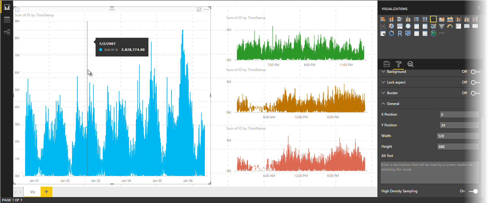
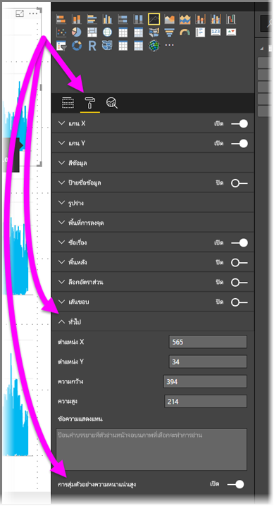

# การสุ่มตัวอย่างเส้นแบบความหนาแน่นสูงใน Power BIHigh-density line sampling in Power BI
เริ่มตั้งแต่ **Power BI Desktop** ที่เผยแพร่เดือนมิถุนายน 2017 และการอัปเดตใน **บริการของ Power BI** มีอัลกอริทึมการสุ่มตัวอย่างใหม่ ซึ่งช่วยปรับปรุงวิชวลที่สุ่มตัวอย่างข้อมูลที่มีความหนาแน่นสูงBeginning with the June 2017 release of the **Power BI Desktop** and updates to the **Power BI service**, a new sampling algorithm is available that improves visuals that sample high-density data. ตัวอย่างเช่น คุณอาจสร้างแผนภูมิเส้นจากผลลัพธ์ยอดขายของร้านค้าปลีกของคุณ แต่ละร้านค้ามีมากกว่าหนึ่งหมื่นใบเสร็จการขายสินค้าต่อปีFor example, you might create a line chart from your retail stores' sales results, each store having more than ten thousand sales receipts each year. แผนภูมิเส้นของข้อมูลดังกล่าวจะสุ่มตัวอย่างข้อมูล (เลือกตัวแทนของข้อมูลที่สื่อความหมาย ให้เห็นว่าการขายเกิดขึ้นตามเวลาอย่างไร) จากข้อมูลของแต่ละร้านค้า และสร้างแผนภูมิเส้นแบบหลายชุดข้อมูลที่แทนข้อมูลเบื้องต้นA line chart of such sales information would sample data (select a meaningful representation of that data, to illustrate how sales vary over time) from the data for each store, and create a multi-series line chart that thereby represents the underlying data. นี่คือแนวทางปฏิบัติทั่วไปในการแสดงภาพความหนาแน่นสูงThis is common practice in visualizing high-density data. Power BI Desktop ได้ปรับปรุงการสุ่มตัวอย่างของข้อมูลที่หนาแน่นสูง รายละเอียดนั้นจะอธิบายไว้ในบทความนี้Power BI Desktop has improved its sampling of high-density data, the details of which are described in this article.

> [!NOTE]
> อัลกอริทึมการ **สุ่มที่มีหนาแน่นของความสูง** ที่อธิบายไว้ในบทความนี้ มีทั้งใน **Power BI Desktop** และ **บริการของ Power BI**The **High Density Sampling** algorithm described in this article is available in both **Power BI Desktop** and the **Power BI service**.

## วิธีการทำงานของการสุ่มตัวอย่างเส้นความหนาแน่นสูงHow high-density line sampling works
ก่อนหน้านี้ **Power BI** เลือกคอลเลกชันของจุดข้อมูลตัวอย่างในช่วงทั้งหมดของข้อมูลเบื้องต้นตามแบบจำลองที่กำหนดขึ้นPreviously, **Power BI** selected a collection of sample data points in the full range of underlying data in a deterministic fashion. ตัวอย่างเช่น สำหรับข้อมูลความหนาแน่นสูงบนวิชวลที่ครอบคลุมช่วงเวลาหนึ่งปีปฏิทิน อาจมีจุดข้อมูลตัวอย่าง 350 จุดที่แสดงในวิชวล ซึ่งแต่ละจุดข้อมูลถูกเลือกเพื่อให้ได้ช่วงข้อมูลเต็ม (ชุดข้อมูลโดยรวมของข้อมูลเบื้องต้น) ใช้เป็นตัวแทนในวิชวลFor example, for high-density data on a visual spanning one calendar year, there might be 350 sample data points displayed in the visual, each of which was selected to ensure the full range of data (the overall series of underlying data) was represented in the visual. เพื่อช่วยให้คุณเข้าใจว่าเกิดขึ้นได้อย่างไร สมมติว่า เรามีการลงจุดราคาหุ้นในช่วงเวลาหนึ่งปี และเลือกจุดข้อมูล 365 จุดเพื่อสร้างวิชวลแผนภูมิเส้น (หนึ่งจุดข้อมูลสำหรับหนึ่งวัน)To help understand how this happens, imagine plotting a stock price over a one-year period, and selecting 365 data points to create a line chart visual (that's one data point for each day).

ในสถานการณ์นั้น มีค่าหลายค่าสำหรับราคาหุ้นภายในแต่ละวันIn that situation, there are many values for a stock price within each day. แน่นอนว่ามีราคาสูงสุดและต่ำสุดประจำวัน แต่ค่าเหล่านั้นสามารถเกิดขึ้นเวลาใดก็ได้ระหว่างวันเมื่อตลาดหุ้นเปิดOf course, there is a daily high and low, but those could occur at any time during the day when the stock market is open. สำหรับการสุ่มตัวอย่างของเส้นความหนาแน่นสูง ถ้าการสุ่มตัวอย่างข้อมูลเบื้องต้นทำที่เวลา 10:30 น. และ 12:00 น. ในแต่ละวัน คุณจะได้สแนปช็อตของข้อมูลเบื้องต้น (ราคาที่ 10:30 น. และ 12:00 น.) แต่อาจไม่บันทึกราคาหุ้นสูงสุดและต่ำสุดสำหรับจุดข้อมูลนั้น (วันนั้น)For high-density line sampling, if the underlying data sample was taken at 10:30 AM and 12:00 PM each day, you would get a representative snapshot of the underlying data (the price at 10:30 AM and 12:00 PM), but it might not capture the actual high and low of the stock price for that representative data point (that day). ในสถานการณ์นั้นและสถานการณ์อื่น ๆ การสุ่มตัวอย่างจะเป็นตัวแทนข้อมูลเบื้องต้น แต่จะอาจไม่จับจุดข้อมูลที่สำคัญเสมอไป ซึ่งในกรณีนี้ คือราคาหุ้นสูงสุดและต่ำสุดรายวันIn that situation – and others – the sampling is representative of the underlying data, but it doesn't always capture important points, which in this case, would be daily stock price highs and lows.

จากคำนิยาม ข้อมูลความหนาแน่นสูง จะถูกสุ่มตัวอย่างเพื่อสร้างการแสดงภาพได้อย่างรวดเร็วพอ ที่ตอบสนองต่อการโต้ตอบได้By definition, high-density data is sampled to create visualizations reasonably quickly that are responsive to interactivity. จุดข้อมูลที่มากเกินไปบนวิชวลทำให้รกตา และขัดขวางไม่ให้เห็นแนวโน้มToo many data points on a visual can bog it down, and can detract from the visibility of trends. ดังนั้น วิธีที่ใช้สุ่มข้อมูลคือสิ่งที่มาผลักดันการสร้างอัลกอริทึมการสุ่มตัวอย่าง เพื่อสร้างประสบการณ์การแสดงภาพที่ดีที่สุด และมั่นใจได้ว่าข้อมูลทั้งหมดถูกแสดงSo, how the data is sampled is what drives the creation of the sampling algorithm to provide the best visualization experience. ใน Power BI Desktop อัลกอริทึมได้รับการปรับปรุงเพื่อให้ได้การผสมผสานที่ดีที่สุด ระหว่างการตอบสนอง, ตัวแทนข้อมูล และการคงจุดข้อมูลที่สำคัญในแต่ละช่วงเวลาIn Power BI Desktop, the algorithm is now improved to provide the best combination of responsiveness, representation, and clear preservation of important points in each time slice.

## วิธีการทำงานของอัลกอริธึมการสุ่มตัวอย่างของแผนภูมิเส้นHow the new line sampling algorithm works
อัลกอริทึมใหม่สำหรับการสุ่มตัวอย่างเส้นความหนาแน่นสูง มีสำหรับวิชวลแผนภูมิเส้นและแผนภูมิพื้นที่ที่มีแกน X แบบต่อเนื่องThe new algorithm for high-density line sampling is available for line chart and area chart visuals with a continuous x-axis.

สำหรับวิชวลความหนาแน่นสูง **Power BI** ทำการแบ่งส่วนข้อมูลของคุณ เป็นกลุ่มข้อมูลความละเอียดสูงอย่างชาญฉลาด จากนั้นเลือกจุดข้อมูลที่สำคัญเพื่อเป็นตัวแทนสำหรับแต่ละกลุ่มFor a high-density visual, **Power BI** intelligently slices your data into high-resolution chunks, and then picks important points to represent each chunk. กระบวนการแบ่งส่วนข้อมูลความละเอียดสูงดำเนินการเพื่อให้แน่ใจว่าผลลัพธ์แผนภูมิที่ได้สามารถแยกความแตกต่างได้ด้วยตาจากจุดข้อมูลเบื้องต้นทั้งหมดที่มีให้ แต่จะเร็วกว่ามากและมีการโต้ตอบได้ดีกว่าThat process of slicing high-resolution data is specifically tuned to ensure that the resulting chart is visually indistinguishable from rendering all of the underlying data points, but much faster and more interactive.

### ค่าต่ำสุดและสูงสุดสำหรับภาพความหนาแน่นสูงเชิงเส้นMinimum and maximum values for high-density line visuals
สำหรับการแสดงภาพใด ๆ จะเป็นไปตามข้อจำกัดด้านการมองเห็นต่อไปนี้:For any given visualization, the following visual limitations apply:

* **3,500** คือจำนวนจุดข้อมูลสูงสุด *ที่แสดง* บนวิชวลส่วนใหญ่ โดยไม่คำนึงถึงจำนวนของจุดข้อมูลเบื้องต้นหรือชุดข้อมูล (ดู *ข้อยกเว้น* ในรายการหัวข้อย่อยต่อไปนี้)**3,500** is the maximum number of data points *displayed* on most visuals, regardless of the number of underlying data points or series (see the *exceptions* in the following bullet list). ในกรณีดังกล่าว ถ้าคุณมี 10 ชุดข้อมูลที่แต่ละชุดข้อมูลมี 350 จุดข้อมูล ภาพดังกล่าวได้ถึงขีดจำกัดสูงสุดของจุดข้อมูลโดยรวมแล้วAs such, if you have 10 series with 350 data points each, the visual has reached its maximum overall data points limit. ถ้าคุณมีหนึ่งชุดข้อมูล ชุดข้อมูลดังกล่าวอาจมีจุดข้อมูลสูงสุด 3,500 จุดได้หากอัลกอริทึมใหม่เข้าข่ายการสุ่มตัวอย่างที่ดีที่สุดสำหรับข้อมูลเบื้องต้นIf you have one series, it may have up to 3,500 data points if the new algorithm deems that the best sampling for the underlying data.

* จำนวนชุดข้อมูลสูงสุดสำหรับภาพหนึ่ง ๆ คือ **60 ชุดข้อมูล**There is a maximum of **60 series** for any visual. ถ้าคุณมีชุดข้อมูลมากกว่า 60 ชุด ให้แบ่งชุดข้อมูลและสร้างวิชวลหลายวิชวล ด้วยชุดข้อมูล 60 ชุดหรือน้อยกว่านั้นในแต่ละวิชวลIf you have more than 60 series, break up the data and create multiple visuals with 60 or fewer series each. ขั้นตอนนี้เป็นหลักปฏิบัติที่ดีในการใช้ **ตัวแบ่งส่วนข้อมูล** เพื่อแสดงเฉพาะบางเซกเมนต์ของข้อมูล (เฉพาะบางชุดข้อมูล)It's good practice to use a **slicer** to show only segments of the data (only certain series). ตัวอย่างเช่น ถ้าคุณกำลังแสดงประเภทย่อยทั้งหมดในคำอธิบายแผนภูมิ คุณสามารถใช้ตัวแบ่งส่วนข้อมูลเพื่อกรองตามประเภททั้งหมดบนหน้ารายงานเดียวกันได้For example, if you're displaying all subcategories in the legend, you could use a slicer to filter by the overall category on the same report page.

จำนวนขีดจำกัดสูงสุดของข้อมูลจะสูงกว่าสำหรับประเภทวิชวลต่อไปนี้ ซึ่งมี *ข้อยกเว้น* ขีด จำกัดจุดข้อมูลเท่ากับ 3,500:The maximum number of data limits is higher for the following visual types, which are *exceptions* to the 3,500 data point limit:

* **150,000** จุดข้อมูลสูงสุดสำหรับวิชวล R**150,000** data points maximum for R visuals.
* **30,000** จุดข้อมูลสำหรับวิชวล Power BI**30,000** data points for Power BI visuals.
* **10000** จุดข้อมูลสำหรับแผนภูมิกระจาย (ค่าเริ่มต้นแผนภูมิกระจายสูงถึง 3,500)**10,000** data points for scatter charts (scatter charts default to 3,500)
* **3,500** สำหรับภาพวิชวลอื่น ๆ ทั้งหมด**3,500** for all other visuals

พารามิเตอร์เหล่านี้มีไว้เพื่อให้แน่ใจว่าวิชวลใน Power BI Desktop แสดงได้อย่างรวดเร็ว และตอบสนองต่อการโต้ตอบกับผู้ใช้งานได้เป็นอย่างดี รวมถึงไม่ต้องคำนวณเพื่อสร้างภาพวิชวลดังกล่าวมากเกินได้These parameters ensure that visuals in Power BI Desktop render very quickly, are responsive to interaction with users, and do not result in undue computational overhead on the computer rendering the visual.

### การประเมินจุดข้อมูลที่เป็นตัวแทนสำหรับภาพเชิงเส้นความหนาแน่นสูงEvaluating representative data points for high-density line visuals
เมื่อมีจำนวนจุดข้อมูลเบื้องต้นเกินกว่าจุดข้อมูลสูงสุดที่สามารถแสดงได้ในวิชวล กระบวนการที่เรียกว่า *การจัดช่องเก็บ* จะเริ่มต้นขึ้น ซึ่งจะรวมกลุ่มข้อมูลเบื้องต้นเป็นกลุ่ม ๆ ที่เรียกว่า *ช่องเก็บ* และจะทำซ้ำการปรับปรุงช่องเก็บเหล่านั้นWhen the number of underlying data points exceeds the maximum data points that can be represented in the visual, a process called *binning* begins, which chunks the underlying data into groups called *bins*, and then iteratively refines those bins.

อัลกอริทึมสร้างช่องเก็บมากที่สุดเท่าที่จะทำได้เพื่อสร้างส่วนประกอบที่ดีที่สุดสำหรับภาพThe algorithm creates as many bins as possible to create the greatest granularity for the visual. ภายในแต่ละช่องเก็บ อัลกอริทึมค้นหาค่าข้อมูลต่ำสุดและสูงสุด เพื่อให้แน่ใจว่าค่าที่สำคัญและค่าที่มีนัยสำคัญ (ตัวอย่างเช่น ค่าผิดปกติ) จะรวบรวมไว้ และแสดงในภาพนี้Within each bin, the algorithm finds the minimum and maximum data value, to ensure that important and significant values (for example, outliers) are captured and displayed in the visual. จากผลลัพธ์ของการจัดช่องเก็บและการประเมินข้อมูลต่อมาโดย Power BI จะกำหนดความละเอียดต่ำสุดสำหรับแกน X ของวิชวล เพื่อให้แน่ใจว่าวิชวลมีความละเอียดสูงสุดBased on the results of the binning and subsequent evaluation of the data by Power BI, the minimum resolution for the x-axis for the visual is determined – to ensure maximum granularity for the visual.

ดังที่ได้กล่าวมาแล้ว ความละเอียดขั้นต่ำสำหรับแต่ละชุดคือ 350 จุด สูงสุดคือ 3,500 จุด สำหรับภาพส่วนใหญ่โดยมี *ข้อยกเว้น* ที่ระบุไว้ในย่อหน้าก่อนหน้าAs mentioned previously, the minimum granularity for each series is 350 points, the maximum is 3,500 for most visuals, with the *exceptions* listed in the previous paragraphs.

แต่ละช่องเก็บจะแสดง 2 จุดข้อมูล ซึ่งจะกลายเป็นจุดข้อมูลที่เป็นตัวแทนของช่องเก็บข้อมูลในภาพEach bin is represented by two data points, which become the bin's representative data points in the visual. จุดข้อมูลเป็นเพียงแค่ค่าสูงสุดและต่ำสุดสำหรับช่องเก็บดังกล่าว และโดยการเลือกค่าสูงสุดและต่ำสุด กระบวนการจัดช่องจะช่วยทำให้แน่ใจว่ามีการจับและแสดงค่าสูงสุดที่สำคัญหรือค่าต่ำสุดที่มีนัยสำคัญบนภาพThe data points are simply the high and low value for that bin, and by selecting the high and low, the binning process ensures any important high value, or significant low value, is captured and rendered in the visual.

ถ้านี่ฟังเหมือนว่าการวิเคราะห์จำนวนมาก มีเพื่อให้แน่ใจว่าได้จับค่าที่ผิดปกติและแสดงอย่างถูกต้องในวิชวล คุณเข้าใจถูกแล้ว และนั่นคือเหตุผลที่แท้จริงเบื้องหลังอัลกอริทึมและการจัดช่องเก็บใหม่If that sounds like a lot of analysis to ensure the occasional outlier is captured and properly displayed in the visual, you are correct, but that's the exact reason for the new algorithm and binning process.

## เคล็ดลับเครื่องมือและการสุ่มตัวอย่างเส้นความหนาแน่นสูงTooltips and high-density line sampling
เป็นเรื่องสำคัญที่ต้องทราบว่า กระบวนการการจัดช่องนี้ ให้ค่าต่ำสุดและสูงสุดที่อยู่ในช่องเก็บได้จัดเก็บและแสดง ซึ่งอาจส่งผลต่อการแสดงข้อมูลของคำแนะนำเครื่องมือ เมื่อคุณโฮเวอร์เหนือจุดข้อมูลIt's important to note that this binning process, which results in the minimum and maximum value in a given bin being captured and displayed, may affect how tooltips display data when you hover over the data points. เพื่ออธิบายว่าเกิดขึ้นได้อย่างไรและทำไม กลับไปดูตัวอย่างของเราเกี่ยวกับราคาหุ้นTo explain how and why this occurs, let's revisit our example about stock prices.

สมมติว่า คุณกำลังสร้างวิชวลจากราคาหุ้น และคุณกำลังเปรียบเทียบหุ้นสองตัว ซึ่งใช้ **การสุ่มตัวอย่างความหนาแน่นสูง** เหมือนกันทั้งคู่Let's say you're creating a visual based on stock price and you're comparing two different stocks, both of which are using **High-Density Sampling**. ข้อมูลเบื้องต้นสำหรับแต่ละชุดข้อมูลมีจุดข้อมูลมากมาย (บางทีคุณอาจจับราคาหุ้นในแต่ละวินาทีของวัน)The underlying data for each series has lots of data points (maybe you capture the stock price each second of the day). อัลกอริทึมการสุ่มตัวอย่างเส้นความหนาแน่นสูง ดำเนินการกับช่องเก็บแต่ละชุดข้อมูลอิสระจากกันThe high-density line sampling algorithm performs binning for each series independently of the other.

ตอนนี้สมมุติว่า ราคาหุ้นตัวแรกกระโดดขึ้นไปที่เวลา 12:02 น. จากนั้นราคาก็ร่วงลงอีก 10 วินาทีต่อมาNow let's say that the first stock jumps up in price at 12:02, then quickly comes back down ten seconds later. นั่นเป็นจุดข้อมูลที่สำคัญจุดหนึ่งThat's an important data point. เมื่อทำการจัดช่องเก็บสำหรับหุ้นดังกล่าว ค่าสูงสุดที่ 12:02 จะเป็นจุดข้อมูลที่เป็นตัวแทนสำหรับช่องเก็บนั้นWhen binning occurs for that stock, the high at 12:02 will be a representative data point for that bin.

แต่สำหรับหุ้นตัวที่สอง ที่เวลา 12:02 น. ไม่มีทั้งค่าสูงสุดและต่ำสุดในช่องเก็บที่รวมเวลาดังกล่าวBut, for the second stock, 12:02 was neither a high nor a low in the bin that included that time. แต่ค่าสูงสุดและต่ำสุดสำหรับช่องเก็บนั้น ที่รวมเวลา 12:02 น. อาจเกิดขึ้นสามนาทีในภายหลังMaybe the high and low for the bin that includes 12:02 occurred three minutes later. ในการสถานการณ์นั้น เมื่อมีการสร้างแผนภูมิเส้นและคุณเลื่อนไปเหนือ 12:02 คุณจะเห็นค่าหนึ่งในเคล็ดลับเครื่องมือสำหรับหุ้นตัวแรก (เพราะค่ากระโดดไปที่ 12:02 และค่าดังกล่าวถูกเลือกเป็นจุดข้อมูลสูงสุดของช่องเก็บ) แต่คุณจะ *ไม่* เห็นค่าใด ๆ ในเคล็ดลับเครื่องมือที่ 12:02 สำหรับหุ้นตัวที่สองIn that situation, when the line chart is created and you hover over 12:02, you will see a value in the tooltip for the first stock (because it jumped at 12:02 and that value was selected as that bin's high data point), but you will *not* see any value in the tooltip at 12:02 for the second stock. นั่นเนื่องจากว่าหุ้นตัวที่สองไม่มีทั้งค่าต่ำสุดหรือสูงสุดสำหรับช่องเก็บที่รวม 12:02That's because the second stock had neither a high, nor a low, for the bin that included 12:02. ดังนั้น ไม่มีข้อมูลที่จะแสดงสำหรับหุ้นตัวที่สองที่เวลา 12:02 ทำให้ไม่มีข้อมูลเคล็ดลับเครื่องมือที่จะแสดงSo, there's no data to show for the second stock at 12:02, and thus, no tooltip data is displayed.

สถานการณ์นี้จะเกิดขึ้นบ่อยครั้งกับเคล็ดลับเครื่องมือThis situation will happen frequently with tooltips. ค่าสูงสุดและต่ำสุดสำหรับช่องเก็บที่ระบุอาจไม่ตรงกับจุดค่าแกน x ที่ปรับมาตราส่วนเท่า ๆ กันอย่างสมบูรณ์แบบ และหากเป็นเช่นนั้นเคล็ดลับเครื่องมือจะไม่แสดงค่าThe high and low values for a given bin might not match perfectly with the evenly scaled x-axis value points, and as such the tooltip will not display the value.  

## วิธีการเปิดใช้งานการสุ่มตัวอย่างเส้นความหนาแน่นสูงHow to turn on high-density line sampling
ตามค่าเริ่มต้น อัลกอริทึมใหม่จะ **เปิด** ใช้งานBy default, the new algorithm is turned **on**. เพื่อเปลี่ยนการตั้งค่านี้ ไปที่บานหน้าต่าง **จัดรูปแบบ** ในการ์ด **ทั่วไป** และตามแนวด้านล่างคุณจะเห็นตัวเลื่อนสลับที่ชื่อว่า **การสุ่มตัวอย่างความหนาแน่นสูง**To change this setting, go to the **Formatting** pane, in the **General** card, and along the bottom, you see a toggle slider called **High-Density Sampling**. ในการปิดใช้งาน เลื่อนไปที่ **ปิด**To turn it off, slide it to **Off**.

## ข้อควรพิจารณาและข้อจำกัดConsiderations and limitations
อัลกอริทึมใหม่สำหรับการสุ่มตัวอย่างเส้นความหนาแน่นสูง เป็นการพัฒนาที่สำคัญสำหรับ Power BI แต่ยังมีข้อควรพิจารณาที่ต้องทราบ เมื่อทำงานกับค่าและข้อมูลที่มีความหนาแน่นสูงThe new algorithm for high-density line sampling is an important improvement to Power BI, but there are a few considerations you need to know when working with high-density values and data.

* เนื่องด้วยส่วนประกอบและกระบวนการจัดช่องเก็บที่เพิ่มขึ้น **เคล็ดลับเครื่องมือ** อาจแสดงค่าเฉพาะถ้าข้อมูลที่เป็นตัวแทนได้รับการจัดแนวด้วยเคอร์เซอร์ของคุณBecause of increased granularity and the binning process, **Tooltips** may only show a value if the representative data is aligned with your cursor. ดูส่วน *เคล็ดลับเครื่องมือและการสุ่มตัวอย่างเส้นความหนาแน่นสูง* ในบทความนี้สำหรับข้อมูลเพิ่มเติมSee the *Tooltips and high-density line sampling* section in this article for more information.
* เมื่อขนาดของแหล่งข้อมูลที่มีทั้งหมดมีขนาดใหญ่เกินไป อัลกอริทึมใหม่จะกำจัดชุดข้อมูล (องค์ประกอบของคำอธิบายแผนภูมิ) เพื่อให้สอดคล้องกับข้อจำกัดสูงสุดของการนำเข้าข้อมูลWhen the size of an overall data source is too big, the new algorithm eliminates series (legend elements) to accommodate the data import maximum constraint.
  
  * ในสถานการณ์นี้ อัลกอริทึมใหม่จะจัดเรียงคำอธิบายแผนภูมิของชุดข้อมูลตามลำดับตัวอักษร เริ่มตั้งแต่คำอธิบายแผนภูมิแรก จนกระทั่งถึงขีดจำกัดสูงสุดในการนำเข้าข้อมูล และจะไม่นำเข้าชุดข้อมูลเพิ่มเติมอีกIn this situation, the new algorithm orders legend series alphabetically, starts down the list of legend elements in alphabetical order until the data import maximum is reached, and does not import additional series.
* เมื่อชุดข้อมูลเบื้องต้นมีชุดข้อมูลมากกว่า 60 ชุด (จำนวนสูงสุดของชุดข้อมูลตามที่อธิบายไว้ก่อนหน้านี้) อัลกอริทึมใหม่จะจัดเรียงชุดข้อมูลตามลำดับตัวอักษร และกำจัดชุดข้อมูลที่เกิดกว่า 60 ชุดตามลำดับตัวอักษรWhen an underlying data set has more than 60 series (the maximum number of series, as described earlier), the new algorithm orders the series alphabetically, and eliminates series beyond the 60th alphabetically-ordered series.
* ถ้าค่าในข้อมูลไม่ใช่ชนิด *ตัวเลข* หรือ *วันที่/เวลา* Power BI จะไม่ใช้อัลกอริทึมใหม่ และจะกลับไปใช้อัลกอริทึมก่อนหน้านี้ (ที่ไม่ใช่การสุ่มตัวอย่างความหนาแน่นสูง)If the values in the data are not of type *numeric* or *date/time*, Power BI will not use the new algorithm, and will revert to the previous (non-high-density sampling) algorithm.
* การตั้งค่า **แสดงรายการที่ไม่มีข้อมูล** ไม่สนับสนุนในอัลกอริทึมใหม่นี้The **Show items with no data** setting is not supported with the new algorithm.
* ไม่สนับสนุนอัลกอริทึมใหม่เมื่อใช้การเชื่อมต่อสดไปยังแบบจำลองที่โฮสต์ใน SQL Server Analysis Services (เวอร์ชัน 2016 หรือเวอร์ชันก่อนหน้า)The new algorithm is not supported when using a live connection to a model hosted in SQL Server Analysis Services (version 2016 or earlier). แต่จะสนับสนุนในแบบจำลองที่โฮสต์ใน **Power BI** หรือ Azure Analysis ServicesIt is supported in models hosted in **Power BI** or Azure Analysis Services.

## ขั้นตอนถัดไปNext steps
สำหรับข้อมูลเพิ่มเติมเกี่ยวกับสุ่มตัวอย่างความหนาแน่นสูงในแผนภูมิกระจาย ดูบทความต่อไปนี้For information about high-density sampling in scatter charts, see the following article.

* [การสุ่มตัวอย่างความหนาแน่นสูงในแผนภูมิกระจาย Power BIHigh Density Sampling in Power BI scatter charts](desktop-high-density-scatter-charts.md)

