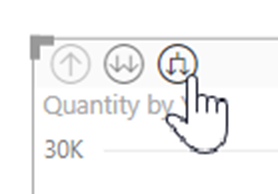
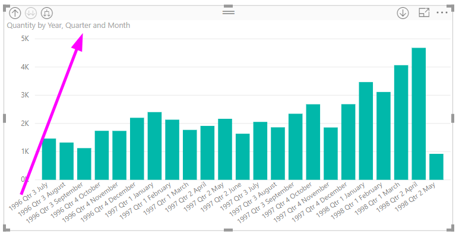
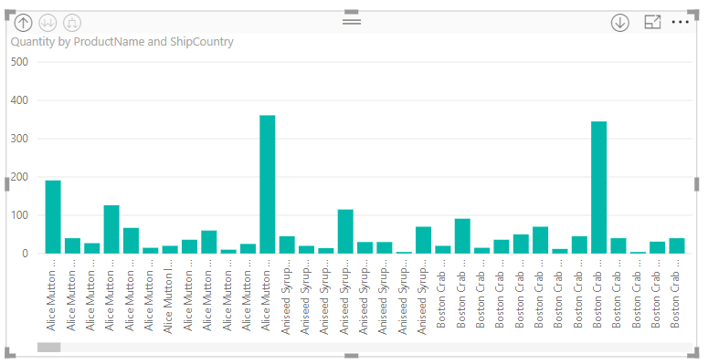

# ใช้ป้ายลำดับชั้นแบบอินไลน์ใน Power BI DesktopUse inline hierarchy labels in Power BI Desktop
**Power BI Desktop** สนับสนุนการใช้ **ป้ายลำดับชั้นแบบอินไลน์** ซึ่งเป็นหนึ่งในสองคุณลักษณะ ที่ปรับปรุงการดูรายละเอียดแบบลำดับชั้นให้ดีขึ้น**Power BI Desktop** supports the use of **inline hierarchy labels**, which is the first of two features intended to enhance hierarchical drilling. คุณลักษณะที่สอง ซึ่งอยู่ในขณะนี้อยู่ในระหว่างการพัฒนา คือความสามารถในการใช้ป้ายลำดับชั้นที่ซ้อนกัน (รออีกสักหน่อย - เราอัปเดตอยู่บ่อย ๆ)The second feature, which is currently in development, is the ability to use nested hierarchy labels (stay tuned for that - our updates happen frequently).   

## ป้ายลำดับชั้นแบบอินไลน์ทำงานอย่างไรHow inline hierarchy labels work
ด้วยป้ายลำดับชั้นแบบอินไลน์ คุณสามารถเห็นป้ายลำดับชั้นได้ขณะที่คุณขยายวิชวลโดยใช้คุณลักษณะ **ขยายทั้งหมด**With inline hierarchy labels, you can see hierarchy labels as you expand visuals using the **Expand All** feature. ประโยชน์ที่สำคัญหนึ่งอย่างก็คือ คุณยังสามารถเลือกที่จะ **เรียงลำดับ** ตามป้ายเหล่านี้ เมื่อคุณขยายข้อมูลของคุณตามลำดับชั้นOne great benefit to seeing these hierarchy labels is that you can also choose to **sort** by these different hierarchy labels as you expand your hierarchical data.

### การใช้คุณลักษณะขยายที่มีอยู่ในตัว (โดยไม่มีการเรียงลำดับตามป้ายลำดับชั้น)Using the built-in Expand feature (without sorting by hierarchy labels)
ก่อนที่เราเห็นการทำงานของป้ายลำดับชั้นแบบอินไลน์ เรามาดูว่าค่าเริ่มต้นคุณลักษณะ **ขยายไปยังระดับถัดไป**Before we see inline hierarchy labels in action, let's review the default **Expand to next level** feature behavior. ซึ่งจะช่วยให้เราเข้าใจ (และชื่นชม) ว่าป้ายลำดับชั้นแบบอินไลน์มีประโยชน์แค่ไหนDoing so will help us understand (and appreciate) how useful inline hierarchy labels can be.

รูปต่อไปนี้แสดงแผนภูมิแท่งสำหรับยอดขายรายปีThe following image shows a bar chart visual for annual sales. เมื่อคุณคลิกขวาบนแถบ คุณสามารถเลือก **ขยายไปยังระดับถัดไป** ได้When you right-click on a bar, you can choose **Expand to next level**.

> [!NOTE]
> แทนที่จะคลิกขวาบนแถบ คุณสามารถเลือกปุ่ม *ขยาย* ที่ด้านบนซ้ายของการแสดงภาพได้As an alternative to right-clicking on a bar, you can select the *Expand* button on the top left of the visualization.

  

ทันทีที่เลือก **ขยายไปยังระดับถัดไป** วิชวลจะขยายลำดับชั้นวันที่จาก *ปี* ไปเป็น *ไตรมาส* ดังที่แสดงในรูปต่อไปนี้Once **Expand to next level** is selected, the visual expands the date hierarchy from *Year* to *Quarter*, as shown in the following image.

สังเกตว่า ป้าย *ปี* และ *ไตรมาส* จะแสดงแบบอินไลน์เข้าด้วยกัน รูปแบบป้ายนี้ยังดำเนินต่อไปเรื่อยๆ เมื่อคุณ **ขยายทั้งหมด** ลงไปจนถึงลำดับชั้นล่างสุดNotice that the *Year* and *Quarter* labels are shown inline together - this labeling scheme continues as you **Expand All** down to the bottom of the hierarchy.

นี่คือวิธีการทำงานของลำดับชั้น *วันที่* ที่เชื่อมโยงกับเขตข้อมูลที่มีชนิดข้อมูลเป็น *วันที่/เวลา*This is how the built-in *Date* hierarchy, associated with fields that have a *date/time* data type, behaves. เรามาดูในส่วนถัดไป และดูว่าคุณลักษณะป้ายลำดับชั้นแบบอินไลน์ที่เพิ่มมาใหม่แตกต่างกันอย่างไรLet's head to the next section, and see how the new inline hierarchy labels feature is different.

### การใช้ป้ายลำดับชั้นแบบอินไลน์Using inline hierarchy labels
ตอนนี้มาดูที่อีกแผนภูมิหนึ่ง - ที่ใช้ข้อมูลที่มีลำดับชั้นที่ไม่เป็นทางการNow let's look at a different chart - using data that has informal hierarchies. ในวิชวลต่อไปนี้ เรามีแผนภูมิแท่ง **ปริมาณ** โดยใช้ *ชื่อผลิตภัณฑ์* เป็นแกนIn the following visual, we have a bar chart with **Quantity**, using *ProductName* as the axis. ในข้อมูลนี้ *ชื่อผลิตภัณฑ์* และ *ประเทศที่ส่งไป* สร้างลำดับชั้นไม่เป็นทางการIn this data, *ProductName* and *ShipCountry* form an informal hierarchy. จากที่นี่ คุณสามารถเลือก *ขยายไปยังระดับถัดไป* เมื่อต้องการดูข้อมูลแบบละเอียดตามลำดับชั้นลงไปFrom here, you can again select *Expand to next level* to drill down into the hierarchy.

การเลือก **ขยายไปยังระดับถัดไป** จะแสดงระดับถัดไป ด้วยการแสดงผลป้ายลำดับชั้นแบบอินไลน์Selecting **Expand to next level** shows the next level with the inline display of hierarchy labels. ตามค่าเริ่มต้น ลำดับชั้นแบบอินไลน์ จะเรียงลำดับตามค่าหน่วยวัด – ในกรณีนี้คือ **ปริมาณ**By default, inline hierarchies are sorted by the measure value – in this case, **Quantity**. เมื่อเปิดใช้งานป้ายลำดับชั้นแบบอินไลน์ คุณสามารถเลือกที่จะเรียงลำดับข้อมูลนี้ตามลำดับชั้นด้วย โดยการเลือกจุดไข่ปลาในมุมบนขวา ( **...** ), แล้วเลือก **เรียงลำดับตามชื่อผลิตภัณฑ์ ประเทศที่ส่งไป** ดังที่แสดงในรูปต่อไปนี้With inline hierarchy labels enabled, you can choose to sort this data by the hierarchy too, by selecting the ellipsis in the upper right corner (the **...**), then selecting **Sort by ProductName ShipCountry** as shown in the following image.

ทันทีที่เลือก **ประเทศที่ส่งไป** ข้อมูลมีการเรียงลำดับตามลำดับชั้นที่ไม่เป็นทางการ ดังแสดงในรูปต่อไปนี้Once **ShipCountry** is selected, the data is sorted based on the informal hierarchy selection, as shown in the following image.

> [!NOTE]
> ป้ายลำดับชั้นแบบอินไลน์ ยังไม่เรียงลำดับชั้นเวลาที่มีอยู่แล้วตามค่าได้ ทำได้เพียงจัดเรียงตามลำดับชั้นเท่านั้นThe inline hierarchy label feature doesn't yet allow for the built-in time hierarchy to be sorted by value; it's only sorted by hierarchy order.
> 
> 

## แนวทางการแก้ไขปัญหาTroubleshooting
เป็นไปได้ที่วิชวลของคุณ ค้างอยู่ที่ระดับลำดับชั้นแบบอินไลน์ที่ขยายแล้วIt's possible for your visuals to get stuck in an expanded inline hierarchy level state. ในบางกรณีคุณอาจพบว่า บางวิชวลของคุณค้างอยู่ในโหมดที่ขยายแล้ว และไม่สามารถเลื่อนขึ้นไปยังลำดับชั้นสูงกว่าได้In some cases, you might find that some of your visuals are stuck in the mode where they were expanded, in which case drilling up doesn't work. ซึ่งสามารถเกิดขึ้นได้ถ้าคุณทำขั้นตอนต่อไปนี้ (วิธีการแก้ไขปัญหานี้อยู่ *ด้านล่าง* ขั้นตอนที่ก่อให้เกิดปัญหา):This can happen if you happened to take the following steps (the fix for this is *below* these steps):

ขั้นตอนที่อาจทำให้วิชวลของคุณค้างอยู่ในสถานะที่ถูกขยาย:Steps that might get your visuals stuck in an expanded state:

1. คุณเปิดใช้งานคุณลักษณะ **ป้ายลำดับชั้นแบบอินไลน์**You enable the **inline hierarchy label** feature
2. คุณสร้างวิชวลบางอย่างที่มีลำดับชั้นYou create some visuals with hierarchies
3. แล้วคุณ **ขยายทั้งหมด** และบันทึกไฟล์ของคุณThen you **Expand All** and save your file
4. จากนั้นก็ *ปิดใช้งาน* คุณลักษณะ **ป้ายลำดับชั้นแบบอินไลน์** และรีสตาร์ท Power BI DesktopYou then *disable* the **inline hierarchy label** feature, and restart Power BI Desktop
5. แล้วคุณเปิดไฟล์ของคุณอีกครั้งThen you re-open your file

ถ้าคุณบังเอิญทำขั้นตอนเหล่านั้น และวิชวลของคุณจะค้างอยู่ในโหมดขยาย คุณสามารถทำตามขั้นตอนต่อไปนี้เพื่อแก้ไขปัญหา:If you happen to take those steps, and your visuals are stuck in expanded mode, you can do the following to troubleshoot them:

1. เปิดใช้งานคุณลักษณะ **ป้ายลำดับชั้นแบบอินไลน์** ใหม่ จากนั้นรีสตาร์ท Power BI DesktopRe-enable the **inline hierarchy label** feature, then restart Power BI Desktop
2. เปิดไฟล์ของคุณอีกครั้ง และเลื่อนขึ้นจนถึงระดับชั้นบนสุดของวิชวลที่ได้รับผลกระทบRe-open your file, and drill back up to top of your affected visual(s)
3. บันทึกไฟล์ของคุณSave your file
4. ปิดใช้งานคุณลักษณะ **ป้ายลำดับชั้นแบบอินไลน์** จากนั้นรีสตาร์ท Power BI DesktopDisable the **inline hierarchy label** feature, then restart Power BI Desktop
5. เปิดไฟล์ของคุณอีกครั้งRe-open your file

อีกวิธีหนึ่งคือ คุณสามารถเพียงแค่ลบวิชวลของคุณ แล้วสร้างขึ้นใหม่Alternatively, you can just delete your visual and recreate it.

