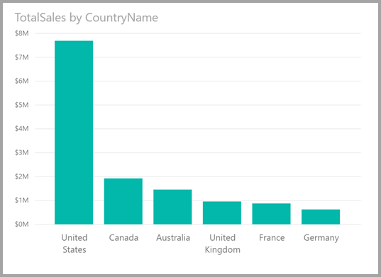
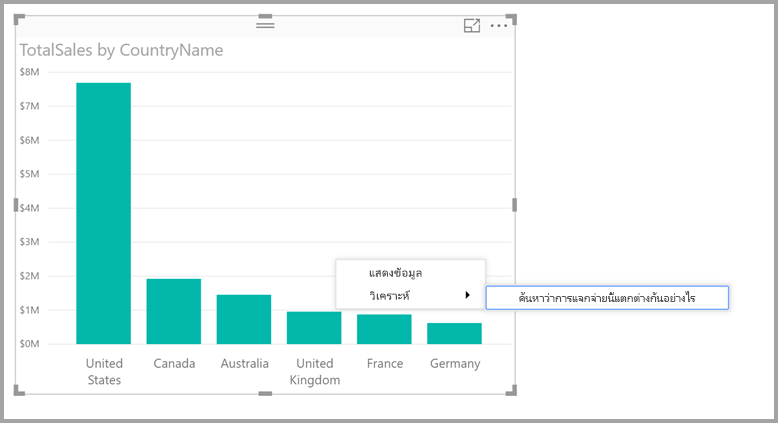
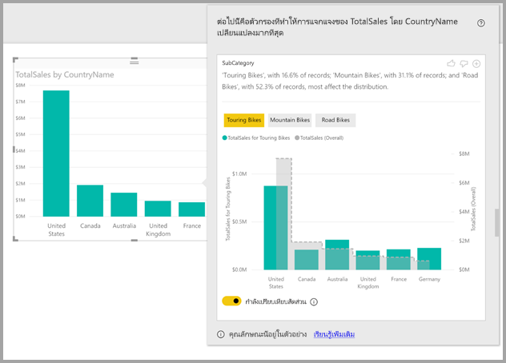

# <a name="apply-insights-in-power-bi-desktop-to-discover-where-distributions-vary-preview"></a><span data-ttu-id="d52d6-103">ปรับใช้ข้อมูลเชิงลึกใน Power BI Desktop เพื่อค้นหาตำแหน่งการกระจายที่แตกต่างกัน (ตัวอย่าง)</span><span class="sxs-lookup"><span data-stu-id="d52d6-103">Apply insights in Power BI Desktop to discover where distributions vary (preview)</span></span>

<span data-ttu-id="d52d6-104">บ่อยครั้งในภาพ คุณจะเห็นจุดข้อมูลและสงสัยว่าการกระจายจะเหมือนกันสำหรับหมวดหมู่ต่างๆหรือไม่</span><span class="sxs-lookup"><span data-stu-id="d52d6-104">Often in visuals, you see a data point, and wonder about whether distribution would be the same for different categories.</span></span> <span data-ttu-id="d52d6-105">คุณสามารถค้นพบได้ด้วยการคลิกเพียงไม่กี่ครั้งด้วย **ข้อมูลเชิงลึก** ใน **Power BI Desktop**</span><span class="sxs-lookup"><span data-stu-id="d52d6-105">With **insights** in **Power BI Desktop** you can find out with just a few clicks.</span></span>

<span data-ttu-id="d52d6-106">พิจารณาภาพประกอบต่อไปนี้ซึ่งแสดง *ยอดขายรวม* ตาม *ประเทศ*</span><span class="sxs-lookup"><span data-stu-id="d52d6-106">Consider the following visual, which shows *Total Sales* by *Country*.</span></span> <span data-ttu-id="d52d6-107">ตามแผนภูมิที่แสดง ยอดขายส่วนใหญ่มาจากประเทศสหรัฐอเมริกา ซึ่งคิดเป็น 57% ของยอดขายทั้งหมดที่มีส่วนสนับสนุนจากผู้ให้เช่าจากประเทศอื่น</span><span class="sxs-lookup"><span data-stu-id="d52d6-107">As the chart shows, most sales come from the United States, accounting for 57% of all sales with lessor contributions coming from the other countries.</span></span> <span data-ttu-id="d52d6-108">ในกรณีดังกล่าวมักจะเป็นที่น่าสนใจในการสำรวจว่าการกระจายเดียวกันนี้จะเกิดขึ้นกับกลุ่มประชากรย่อยที่แตกต่างกันหรือไม่</span><span class="sxs-lookup"><span data-stu-id="d52d6-108">It's often interesting in such cases to explore whether that same distribution would be seen for different sub-populations.</span></span> <span data-ttu-id="d52d6-109">ตัวอย่างเช่น เหตุการณ์นี้เป็นเช่นเหมือนกันทุกปี ทุกช่องทางการขาย และทุกหมวดหมู่ของผลิตภัณฑ์หรือไม่</span><span class="sxs-lookup"><span data-stu-id="d52d6-109">For example, is this the same for all years, all sales channels, and all categories of products?</span></span>  <span data-ttu-id="d52d6-110">ในขณะที่คุณสามารถใช้ตัวกรองที่แตกต่างกันและเปรียบเทียบผลลัพธ์จากการมองด้วยสายตาได้ แต่การทำเช่นนี้อาจทำให้เสียเวลาและเกิดข้อผิดพลาด</span><span class="sxs-lookup"><span data-stu-id="d52d6-110">While you could apply different filters and compare the results visually, doing so can be time consuming and error prone.</span></span> 



<span data-ttu-id="d52d6-112">คุณสามารถบอก **Power BI Desktop** ให้หาว่าการกระจายจะแตกต่างกันที่ไหนและได้รับการวิเคราะห์ข้อมูลเชิงลึกที่รวดเร็วโดยอัตโนมัติ</span><span class="sxs-lookup"><span data-stu-id="d52d6-112">You can tell **Power BI Desktop** to find where a distribution is different, and get fast, automated, insightful analysis about your data.</span></span> <span data-ttu-id="d52d6-113">เพียงคลิกขวาที่จุดข้อมูล และเลือก **วิเคราะห์ > หาว่าการกระจายนี้ต่างกันตรงไหน** และข้อมูลเชิงลึกจะถูกส่งไปให้คุณในหน้าต่างที่ใช้งานง่าย</span><span class="sxs-lookup"><span data-stu-id="d52d6-113">Simply right-click on a data point, and select **Analyze > Find where the distribution is different**, and insight is delivered to you in an easy-to-use window.</span></span>


<span data-ttu-id="d52d6-115">ในตัวอย่างนี้ การวิเคราะห์อัตโนมัติแสดงให้เห็นอย่างรวดเร็วว่า สำหรับ *จักรยานทัวร์ริ่ง* สัดส่วนของยอดขายในสหรัฐอเมริกาและแคนาดาจะต่ำลง ในขณะที่สัดส่วนที่มาจากประเทศอื่น ๆ สูงขึ้น</span><span class="sxs-lookup"><span data-stu-id="d52d6-115">In this example, the automated analysis quickly shows that for *Touring Bikes*, the  proportion of sales in the United States and Canada are lower, while the proportion coming from the other countries is higher.</span></span>   

> [!NOTE]
> <span data-ttu-id="d52d6-116">คุณลักษณะนี้ยังเป็นแค่ตัวอย่าง และอาจเปลี่ยนแปลงได้</span><span class="sxs-lookup"><span data-stu-id="d52d6-116">This feature is in preview, and is subject to change.</span></span> <span data-ttu-id="d52d6-117">คุณลักษณะข้อมูลเชิงลึก เปิดและทำงานอยู่แล้วตามค่าเริ่มต้น (คุณไม่จำเป็นต้องทำเครื่องหมายที่กล่อง ตัวอย่าง เพื่อเปิดใช้งาน) ตั้งแต่ **Power BI Desktop** เวอร์ชันเดือนกันยายน 2017 เป็นต้นไป</span><span class="sxs-lookup"><span data-stu-id="d52d6-117">The insight feature is enabled and on by default (you don't need to check a Preview box to enable it) beginning with the September 2017 version of **Power BI Desktop**.</span></span>
> 
> 

## <a name="using-insights"></a><span data-ttu-id="d52d6-118">การใช้ข้อมูลเชิงลึก</span><span class="sxs-lookup"><span data-stu-id="d52d6-118">Using insights</span></span>
<span data-ttu-id="d52d6-119">เมื่อต้องใช้ข้อมูลเชิงลึกเพื่อหาว่าการกระจายที่เห็นในแผนภูมิแตกต่างกันที่ไหน เพียงคลิกขวาบนจุดข้อมูลใดๆ (หรือบนภาพทั้งหมด), และเลือก **วิเคราะห์ > ค้นหาว่าการกระจายแตกต่างกันตรงไหน**</span><span class="sxs-lookup"><span data-stu-id="d52d6-119">To use insights to find where distributions seen on charts are different, just right-click on any data point (or on the visual as a whole), and select **Analyze > Find where the distribution is different**.</span></span>



<span data-ttu-id="d52d6-121">**Power BI Desktop** จะเรียกใช้อัลกอริทึมการเรียนรู้ กับข้อมูล และเพิ่มวิชวลและคำอธิบายลงในหน้าต่าง ที่ใช้อธิบายว่าหมวดหมู่ใด (คอลัมน์) และค่าใดของคอลัมน์เหล่านี้ทำให้เกิดการกระจายที่แตกต่างกันมากที่สุดอย่างมีนัยสำคัญ</span><span class="sxs-lookup"><span data-stu-id="d52d6-121">**Power BI Desktop** then runs its machine learning algorithms over the data, and populates a window with a visual and a description that describes which categories (columns), and which values of those columns, result in the most significantly different distribution.</span></span> <span data-ttu-id="d52d6-122">ข้อมูลเชิงลึกจะแสดงด้วยแผนภูมิคอลัมน์ ดังแสดงในรูปภาพต่อไปนี้</span><span class="sxs-lookup"><span data-stu-id="d52d6-122">Insights are provided as a column chart, as shown in the following image.</span></span> 



<span data-ttu-id="d52d6-124">ค่าที่ใช้ตัวกรองที่เลือกจะแสดงโดยใช้สีเริ่มต้นปกติ</span><span class="sxs-lookup"><span data-stu-id="d52d6-124">The values with the selected filter applied are shown using the normal default color.</span></span> <span data-ttu-id="d52d6-125">ค่าค่าโดยรวมตามที่เห็นในภาพเริ่มต้นดั่งเดิมจะแสดงเป็นสีเทาเพื่อให้เปรียบเทียบได้ง่าย</span><span class="sxs-lookup"><span data-stu-id="d52d6-125">The overall values, as seen on the original starting visual, are shown in grey for easy comparison.</span></span> <span data-ttu-id="d52d6-126">คุณสามารถเลือกตัวกรองที่แตกต่างกันได้ถึงสามตัว (*จักรยานทัวร์ริ่ง* *จักรยานเสือภูเขา* *จักรยานเสือหมอบ* สำหรับตัวอย่างนี้) และสามารถเลือกตัวกรองที่แตกต่างกันโดยคลิกที่ตัวกรองเหล่านั้น (หรือใช้ ctrl-click เพื่อเลือกหลายรายการ)</span><span class="sxs-lookup"><span data-stu-id="d52d6-126">Up to three different filters might be included (*Touring Bikes*, *Mountain Bikes*, *Road Bikes* in this example) and different filters can be chosen by clicking on them (or using ctrl-click to select multiple).</span></span>

<span data-ttu-id="d52d6-127">สำหรับค่าวัดทีบวกกันได้แบบง่าย เช่น *ยอดขายรวม* ในตัวอย่างนี้ การเปรียบเทียบจะขึ้นอยู่กับค่าสัมพัทธ์ แทนที่จะเป็นแบบสัมบูรณ์</span><span class="sxs-lookup"><span data-stu-id="d52d6-127">For simple additive measures, like *Total Sales* in this example, the comparison is based on the relative, rather than absolute, values.</span></span> <span data-ttu-id="d52d6-128">ดังนั้นในขณะที่ยอดขายของจักรยานทัวร์ริ่งต่ำกว่ายอดขายโดยรวมสำหรับทุกหมวดหมู่ โดยใช้แกนคู่เป็นค่าเริ่มต้นเพื่อให้สามารถเปรียบเทียบระหว่างสัดส่วนของยอดขายในแต่ละประเทศสำหรับจักรยานทัวร์ริ่งและจักรยานทุกประเภทได้</span><span class="sxs-lookup"><span data-stu-id="d52d6-128">Hence while the sales for Touring Bikes are lower than overall sales for all categories, by default the visual uses a dual axis to allow the comparison between the proportion of sales across different countries, for Touring Bikes versus all categories of bikes.</span></span>  <span data-ttu-id="d52d6-129">การสลับปุ่ม toggle ด้านล่างจะช่วยให้สามารถแสดงค่าสองค่าในแกนเดียวกันบนภาพได้เพื่อให้สามารถเปรียบเทียบค่าสัมบูรณ์ได้อย่างง่ายดาย (ดังแสดงในรูปต่อไปนี้)</span><span class="sxs-lookup"><span data-stu-id="d52d6-129">Switching the toggle below the visual allows the two values to be displayed in the same axis, allowing the absolute values to easily be compared (as shown in the following image).</span></span>    


<span data-ttu-id="d52d6-131">ข้อความอธิบายยังให้ข้อบ่งชี้ถึงระดับความสำคัญที่อาจติดมากับค่าตัวกรองด้วย ซึ่งให้จำนวนเร็กคอร์ดที่ตรงกับตัวกรอง</span><span class="sxs-lookup"><span data-stu-id="d52d6-131">The descriptive text also gives some indication of the level of importance that might be attached to a filter value, by given the number of records that match the filter.</span></span> <span data-ttu-id="d52d6-132">ดังนั้นในตัวอย่างนี้ คุณจะเห็นได้ว่าในขณะที่การกระจายสำหรับ *จักรยานทัวร์ริ่ง* อาจแตกต่างกันอย่างมีนัยสำคัญ แต่คิดเป็นเพียง 16.6% ของเรกคอร์ดเท่านั้น</span><span class="sxs-lookup"><span data-stu-id="d52d6-132">So in this example, you can see that while the distribution for *Touring Bikes* might be significantly different, they account for only 16.6% of records.</span></span>

<span data-ttu-id="d52d6-133">ไอคอน *ยกนิ้วโป้งขึ้น* และ *คว่านิ้วโป้งลง* ที่ด้านบนของหน้า ให้คุณเสนอแนะติชมวิชวลและคุณลักษณะนี้</span><span class="sxs-lookup"><span data-stu-id="d52d6-133">The *thumbs up* and *thumbs down* icons at the top of the page are provided so you can provide feedback about the visual and the feature.</span></span> <span data-ttu-id="d52d6-134">การดำเนินการดังกล่าวมีคำติชม แต่จะไม่ใช่การสอนอัลกอริทึมในปัจจุบันเพื่อให้ส่งผลกระทบต่อผลลัพธ์ที่ส่งกลับเมื่อคุณใช้คุณลักษณะครั้งถัดไป</span><span class="sxs-lookup"><span data-stu-id="d52d6-134">Doing so provides feedback, but it does not currently train the algorithm to influence the results returned next time you use the feature.</span></span>

<span data-ttu-id="d52d6-135">และที่สำคัญ ปุ่ม **+** ที่ด้านบนของวิชวลช่วย ให้คุณเพิ่มวิชวลที่เลือกลงในรายงานของคุณ ราวกับว่าคุณได้สร้างวิชวลด้วยตัวเอง</span><span class="sxs-lookup"><span data-stu-id="d52d6-135">And importantly, the **+** button at the top of the visual lets you add the selected visual to your report, just as if you created the visual manually.</span></span> <span data-ttu-id="d52d6-136">จากนั้นคุณสามารถจัดรูปแบบ หรือปรับแก้วิชวลที่เพิ่มเข้าไป ได้เหมือนกับที่คุณทำกับวิชวลอื่น ๆ บนรายงานของคุณ</span><span class="sxs-lookup"><span data-stu-id="d52d6-136">You can then format or otherwise adjust the added visual just as you would to any other visual on your report.</span></span> <span data-ttu-id="d52d6-137">คุณสามารถเพิ่มวิชวลเชิงลึกที่เลือกไว้ เมื่อคุณแก้ไขรายงานใน **Power BI Desktop** เท่านั้น</span><span class="sxs-lookup"><span data-stu-id="d52d6-137">You can only add a selected insight visual when you're editing a report in **Power BI Desktop**.</span></span>

<span data-ttu-id="d52d6-138">คุณสามารถใช้ข้อมูลเชิงลึกเมื่อรายงานของคุณอยู่ในโหมดอ่าน หรือแก้ไข ทำให้มีความยืดหยุ่นในการวิเคราะห์ข้อมูล และสร้างวิชวลที่คุณสามารถเพิ่มในรายงานของคุณได้อย่างง่ายดายเ</span><span class="sxs-lookup"><span data-stu-id="d52d6-138">You can use insights when your report is in reading or editing mode, making it versatile for both analyzing data, and for creating visuals you can easily add to your reports.</span></span>

## <a name="details-of-the-returned-results"></a><span data-ttu-id="d52d6-139">รายละเอียดของผลลัพธ์ที่ส่งกลับ</span><span class="sxs-lookup"><span data-stu-id="d52d6-139">Details of the returned results</span></span>
<span data-ttu-id="d52d6-140">คุณสามารถนึกภาพอัลกอริทึมเป็นเป็นคอลัมน์อื่น ๆ ในแบบจำลอง และสำหรับค่าทั้งหมดของคอลัมน์เหล่านั้น ให้นำไปใช้เป็นตัวกรองกับวิชวลเดิม และค้นหาค่าตัวกรองใดที่ก่อให้เกิดผลลัพธ์ *ที่แตกต่าง* จากต้นฉบับมากที่สุด</span><span class="sxs-lookup"><span data-stu-id="d52d6-140">You can think of the algorithm as taking all the other columns in the model, and for all of the values of those columns, applying them as filters to the original visual, and finding which of those filter values produces the most *different* result from the original.</span></span>

<span data-ttu-id="d52d6-141">คุณอาจสงสัยว่าอะไรเป็นความหมาย *ที่แตกต่าง*</span><span class="sxs-lookup"><span data-stu-id="d52d6-141">You likely wonder what *different* means.</span></span> <span data-ttu-id="d52d6-142">ตัวอย่างเช่น กล่าวว่ายอดขายโดยรวมสามารถแยกเป็นยอดขายของสหรัฐอเมริกาและแคนาดาได้ดังต่อไปนี้:</span><span class="sxs-lookup"><span data-stu-id="d52d6-142">For example, say that the overall split of sales between the USA and Canada was the following:</span></span>

|<span data-ttu-id="d52d6-143">ประเทศ</span><span class="sxs-lookup"><span data-stu-id="d52d6-143">Country</span></span>  |<span data-ttu-id="d52d6-144">ยอดขาย ($M)</span><span class="sxs-lookup"><span data-stu-id="d52d6-144">Sales ($M)</span></span>|
|---------|----------|
|<span data-ttu-id="d52d6-145">สหรัฐอเมริกา</span><span class="sxs-lookup"><span data-stu-id="d52d6-145">USA</span></span>      |<span data-ttu-id="d52d6-146">15</span><span class="sxs-lookup"><span data-stu-id="d52d6-146">15</span></span>        |
|<span data-ttu-id="d52d6-147">แคนาดา</span><span class="sxs-lookup"><span data-stu-id="d52d6-147">Canada</span></span>   |<span data-ttu-id="d52d6-148">5</span><span class="sxs-lookup"><span data-stu-id="d52d6-148">5</span></span>         |

<span data-ttu-id="d52d6-149">จากนั้นสำหรับหมวดหมู่เฉพาะของผลิตภัณฑ์ *"จักรยานเสือหมอบ*) อาจแยกจากยอดขายเป็น:</span><span class="sxs-lookup"><span data-stu-id="d52d6-149">Then for a particular category of product *“Road Bike*) the split of sales might be:</span></span>

|<span data-ttu-id="d52d6-150">ประเทศ</span><span class="sxs-lookup"><span data-stu-id="d52d6-150">Country</span></span>  |<span data-ttu-id="d52d6-151">ยอดขาย ($M)</span><span class="sxs-lookup"><span data-stu-id="d52d6-151">Sales ($M)</span></span>|
|---------|----------|
|<span data-ttu-id="d52d6-152">สหรัฐอเมริกา</span><span class="sxs-lookup"><span data-stu-id="d52d6-152">USA</span></span>      |<span data-ttu-id="d52d6-153">3</span><span class="sxs-lookup"><span data-stu-id="d52d6-153">3</span></span>        |
|<span data-ttu-id="d52d6-154">แคนาดา</span><span class="sxs-lookup"><span data-stu-id="d52d6-154">Canada</span></span>   |<span data-ttu-id="d52d6-155">1</span><span class="sxs-lookup"><span data-stu-id="d52d6-155">1</span></span>         |

<span data-ttu-id="d52d6-156">ในขณะที่ตัวเลขมีความแตกต่างกันในตารางดังกล่าวแต่ละตาราง ค่าสัมพัทธ์ระหว่างสหรัฐอเมริกาและแคนาดามีความเหมือนกัน (75% และ 25% โดยรวมและสำหรับจักรยานเสือหมอบ)</span><span class="sxs-lookup"><span data-stu-id="d52d6-156">While the numbers are different in each of those tables, the relative values between USA and Canada are identical (75% and 25% overall, and for Road Bikes).</span></span> <span data-ttu-id="d52d6-157">ด้วยเหตุนี้จึงไม่ถือว่ามีความแตกต่างกัน</span><span class="sxs-lookup"><span data-stu-id="d52d6-157">Because of that, these are not considered different.</span></span> <span data-ttu-id="d52d6-158">สำหรับค่าวัดทีบวกกันได้แบบง่าย เช่น ค่านี้ อัลกอริทึมจะมองหาความแตกต่างใน *ค่าสัมพัทธ์*</span><span class="sxs-lookup"><span data-stu-id="d52d6-158">For simple additive measures like this, the algorithm is therefore looking for differences in the *relative* value.</span></span>  

<span data-ttu-id="d52d6-159">ในทางตรงกันข้าม เมื่อพิจารณาค่าวัด เช่น มาร์จิ้น ซึ่งคำนวณเป็นกำไร/ต้นทุน จะสามารถบอกได้ว่ามาร์จิ้นโดยรวมสำหรับสหรัฐอเมริกาและแคนาดาเป็นดังต่อไปนี้</span><span class="sxs-lookup"><span data-stu-id="d52d6-159">By contrast consider a measure like margin, that is calculated as Profit/Cost, and say that the overall margins for the USA and Canada were the following</span></span>

|<span data-ttu-id="d52d6-160">ประเทศ</span><span class="sxs-lookup"><span data-stu-id="d52d6-160">Country</span></span>  |<span data-ttu-id="d52d6-161">มาร์จิ้น (%)</span><span class="sxs-lookup"><span data-stu-id="d52d6-161">Margin (%)</span></span>|
|---------|----------|
|<span data-ttu-id="d52d6-162">สหรัฐอเมริกา</span><span class="sxs-lookup"><span data-stu-id="d52d6-162">USA</span></span>      |<span data-ttu-id="d52d6-163">15</span><span class="sxs-lookup"><span data-stu-id="d52d6-163">15</span></span>        |
|<span data-ttu-id="d52d6-164">แคนาดา</span><span class="sxs-lookup"><span data-stu-id="d52d6-164">Canada</span></span>   |<span data-ttu-id="d52d6-165">5</span><span class="sxs-lookup"><span data-stu-id="d52d6-165">5</span></span>         |

<span data-ttu-id="d52d6-166">จากนั้นสำหรับหมวดหมู่เฉพาะของผลิตภัณฑ์ *"จักรยานเสือหมอบ*) อาจแยกจากยอดขายเป็น:</span><span class="sxs-lookup"><span data-stu-id="d52d6-166">Then for a particular category of product *“Road Bike*) the split of sales might be:</span></span>

|<span data-ttu-id="d52d6-167">ประเทศ</span><span class="sxs-lookup"><span data-stu-id="d52d6-167">Country</span></span>  |<span data-ttu-id="d52d6-168">มาร์จิ้น (%)</span><span class="sxs-lookup"><span data-stu-id="d52d6-168">Margin (%)</span></span>|
|---------|----------|
|<span data-ttu-id="d52d6-169">สหรัฐอเมริกา</span><span class="sxs-lookup"><span data-stu-id="d52d6-169">USA</span></span>      |<span data-ttu-id="d52d6-170">3</span><span class="sxs-lookup"><span data-stu-id="d52d6-170">3</span></span>        |
|<span data-ttu-id="d52d6-171">แคนาดา</span><span class="sxs-lookup"><span data-stu-id="d52d6-171">Canada</span></span>   |<span data-ttu-id="d52d6-172">1</span><span class="sxs-lookup"><span data-stu-id="d52d6-172">1</span></span>         |

<span data-ttu-id="d52d6-173">เมื่อพิจารณาถึงลักษณะของค่าวัดดังกล่าว *ถือว่า* แตกต่างกันอย่างน่าสนใจ</span><span class="sxs-lookup"><span data-stu-id="d52d6-173">Given the nature of such measures, this *is* considered interestingly different.</span></span> <span data-ttu-id="d52d6-174">ดังนั้น สำหรับค่าวัดทีบวกกันไม่ได้ เช่นตัวอย่างนี้คือมาร์จิ้น อัลกอริทึมจะมองหาความแตกต่างในค่าสัมบูรณ์</span><span class="sxs-lookup"><span data-stu-id="d52d6-174">So for non-additive measures such as this margin example, the algorithm is looking for differences in the absolute value.</span></span>

<span data-ttu-id="d52d6-175">ภาพที่ปรากฏมีวัตถุประสงค์เพื่อแสดงให้เห็นถึงความแตกต่างที่พบระหว่างการกระจายโดยรวม (ตามที่เห็นในภาพต้นฉบับ) และค่าที่ใช้ตัวกรองเฉพาะได้อย่างชัดเจน</span><span class="sxs-lookup"><span data-stu-id="d52d6-175">The visuals displayed are thus intended to clearly show the differences found between the overall distribution (as seen in the original visual) and the value with the particular filter applied.</span></span>  

<span data-ttu-id="d52d6-176">ดังนั้นสำหรับค่าวัดทีบวกกัน เช่น *ยอดขาย* ในตัวอย่างก่อนหน้าจะใช้แผนภูมิเส้นและคอลัมน์โดยใช้แกนคู่ที่มีการปรับขนาดอย่างเหมาะสมเพื่อให้สามารถเปรียบเทียบค่าสัมพัทธ์ได้อย่างง่ายดาย</span><span class="sxs-lookup"><span data-stu-id="d52d6-176">So for additive measures, like *Sales* in the previous example, a column and line chart is used, where the use of a dual axis with appropriate scaling such that the relative values can easily be compared.</span></span> <span data-ttu-id="d52d6-177">คอลัมน์แสดงค่าด้วยตัวกรองที่ใช้ และเส้นแสดงค่าโดยรวม (โดยมีแกนคอลัมน์อยู่ทางด้านซ้ายและแกนเส้นด้านขวาตามปกติ)</span><span class="sxs-lookup"><span data-stu-id="d52d6-177">The columns show the value with the filter applied, and the line shows the overall value (with the column axis being on the left, and the line axis on the right, as normal).</span></span> <span data-ttu-id="d52d6-178">เส้นจะถูกแสดงในลักษณะที่เป็น *ขั้น* และมีเส้นประสีเทา</span><span class="sxs-lookup"><span data-stu-id="d52d6-178">The line is shown using a *stepped* style, with a dashed line, filled with grey.</span></span> <span data-ttu-id="d52d6-179">สำหรับตัวอย่างก่อนหน้านี้ ถ้าค่าสูงสุดของแกนคอลัมน์คือ 4 และค่าแกนเส้นสูงสุดเท่ากับ 20 จะทำให้สามารถเปรียบเทียบค่าสัมพัทธ์ระหว่างค่าที่กรองและค่าโดยรวมของสหรัฐอเมริกาและแคนาดาได้อย่างง่ายดาย</span><span class="sxs-lookup"><span data-stu-id="d52d6-179">For the previous example, if the column axis maximum value is 4, and the line axis maximum value is 20, then it would allow easy comparison of the relative values between USA and Canada for the filtered and overall values.</span></span> 

<span data-ttu-id="d52d6-180">ในทำนองเดียวกัน สำหรับค่าวัดทีบวกกันไม่ได้ เช่น *มาร์จิ้น* ในตัวอย่างก่อนหน้า จะใช้แผนภูมิเส้นและคอลัมน์โดยใช้แกนเดี่ยว เพื่อให้สามารถเปรียบเทียบค่าสัมบูรณ์ได้อย่างง่าย</span><span class="sxs-lookup"><span data-stu-id="d52d6-180">Similarly, for non-additive measures like *Margin* in the previous example, a column and line chart is used, where the use of a single axis means the absolute values can easily be compared.</span></span> <span data-ttu-id="d52d6-181">นอกจากนั้น เส้น (สีเทา) ยังแสดงค่าโดยรวมด้วย</span><span class="sxs-lookup"><span data-stu-id="d52d6-181">Again the line (filled with grey) shows the overall value.</span></span> <span data-ttu-id="d52d6-182">ไม่ว่าจะเป็นการเปรียบเทียบตัวเลขที่เกิดขึ้นจริงหรือตัวเลขสัมพัทธ์ แต่การกำหนดระดับที่ซึ่งการกระจายทั้งสองมีความแตกต่างกันไม่ได้เป็นเรื่องของการคำนวณความแตกต่างของค่าเพียงอย่างเดียว</span><span class="sxs-lookup"><span data-stu-id="d52d6-182">Whether comparing actual or relative numbers, the determination of the degree to which two distributions are different is not simply a matter of calculating the difference in the values.</span></span> <span data-ttu-id="d52d6-183">ตัวอย่างเช่น:</span><span class="sxs-lookup"><span data-stu-id="d52d6-183">For example:</span></span>

* <span data-ttu-id="d52d6-184">ขนาดของประชากรที่เป็นปัจจัยมีความแตกต่างกันอย่างมีนัยสำคัญทางสถิติและไม่ค่อยน่าสนใจหากใช้กับประชากรกลุ่มเล็กกว่าเมื่อเทียบกับประชากรโดยรวม</span><span class="sxs-lookup"><span data-stu-id="d52d6-184">The size of the population is factored in, as a difference is less statistically significant and less interesting when it applies to a smaller proportion of the overall population.</span></span> <span data-ttu-id="d52d6-185">ตัวอย่างเช่น การกระจายของยอดขายในแต่ละประเทศอาจแตกต่างกันมากสำหรับผลิตภัณฑ์เฉพาะบางรายการ ซึ่งจะไม่ถือว่าน่าสนใจหากมีผลิตภัณฑ์นับพันรายการและด้วยเหตุนี้ผลิตภัณฑ์เฉพาะจึงคิดเป็นเพียงส่วนน้อยของยอดขายโดยรวม</span><span class="sxs-lookup"><span data-stu-id="d52d6-185">As an example, the distribution of sales across countries might be very different for some particular product, this would not be considered interesting if there were thousands of products, and hence that particular product accounted for only a small percentage of the overall sales.</span></span>

* <span data-ttu-id="d52d6-186">ความแตกต่างสำหรับหมวดหมู่ที่มีค่าเดิมสูงมากหรือใกล้เคียงกับศูนย์อย่างมากจะถูกถ่วงน้ำหนักมากกว่าค่าอื่น</span><span class="sxs-lookup"><span data-stu-id="d52d6-186">Differences for those categories where the original values were very high or very close to zero are weighted higher than others.</span></span> <span data-ttu-id="d52d6-187">ตัวอย่างเช่น หากประเทศมีส่วนสนับสนุนโดยรวมเพียง 1% ของยอดขาย แต่สำหรับผลิตภัณฑ์เฉพาะบางรายการมีส่วนสนับสนุน 6% นั่นหมายความว่ามีนัยสำคัญทางสถิติมากกว่าและถือเป็นที่น่าสนใจมากกว่าประเทศที่มีส่วนสนับสนุนเปลี่ยนจาก 50% เป็น 55%</span><span class="sxs-lookup"><span data-stu-id="d52d6-187">For example, if a country overall contributes only 1% of sales, but for some particular type of product contributes 6%, that is more statistically significant, and therefore considered more interesting, than a country whose contribution changed from 50% to 55%.</span></span> 

* <span data-ttu-id="d52d6-188">วิทยาการศึกษาสำนึกแบบต่างๆ จะถูกนำมาใช้เพื่อเลือกผลลัพธ์ที่มีความหมายมากที่สุด เช่น โดยการพิจารณาความสัมพันธ์ระหว่างข้อมูลอื่นๆ</span><span class="sxs-lookup"><span data-stu-id="d52d6-188">Various heuristics are employed to select the most meaningful results, for example by considering other relationships between the data.</span></span>
     
<span data-ttu-id="d52d6-189">หลังจากตรวจสอบคอลัมน์ที่แตกต่างกัน และจะกำหนดค่าที่ให้ความแตกต่างมากที่สุดสำหรับคอลัมน์แต่ละคอลัมน์</span><span class="sxs-lookup"><span data-stu-id="d52d6-189">After examining different columns, and the values for each of those columns, the set of values that give the biggest differences are chosen.</span></span> <span data-ttu-id="d52d6-190">เพื่อให้ง่ายต่อการทำความเข้าใจ ข้อมูลเหล่านี้จะถูกจัดกลุ่มตามคอลัมน์โดยคอลัมน์ที่ให้ค่าความแตกต่างมากที่สุดจะอยู่ลำดับแรก</span><span class="sxs-lookup"><span data-stu-id="d52d6-190">For ease of understanding, these are then output grouped by column, with the column whose values give the biggest difference listed first.</span></span> <span data-ttu-id="d52d6-191">สามารถแสดงค่าได้สูงสุดสามค่าต่อคอลัมน์ แต่อาจแสดงน้อยลงหากมีค่าที่ส่งผลกระทบขนาดใหญ่น้อยกว่าสามค่า หรือถ้าค่าบางค่ามีผลกระทบมากกว่าค่าอื่นๆ อย่างเห็นได้ชัด</span><span class="sxs-lookup"><span data-stu-id="d52d6-191">Up to three values are shown per column, but less might be shown either if there were fewer than three values that have a large effect, or if some values are much more impactful than others.</span></span> 

<span data-ttu-id="d52d6-192">ซึ่งไม่จำเป็นว่าคอลัมน์ทั้งหมดในแบบจำลองจะได้รับการตรวจสอบในเวลาที่มีอยู่ ดังนั้นจึงไม่รับประกันว่าคอลัมน์และค่าที่มีผลกระทบมากที่สุดจะปรากฏขึ้น</span><span class="sxs-lookup"><span data-stu-id="d52d6-192">It is not necessarily the case that all of the columns in the model will be examined in the time available, so it is not guaranteed that the most impactful columns and values are displayed.</span></span> <span data-ttu-id="d52d6-193">อย่างไรก็ตาม วิทยาการศึกษาสำนึกแบบต่างๆ จะถูกนำมาใช้เพื่อให้แน่ใจว่าคอลัมน์ที่เป็นไปได้มากที่สุดจะได้รับการตรวจสอบก่อน</span><span class="sxs-lookup"><span data-stu-id="d52d6-193">However, various heuristics are employed to ensure that the most likely columns are examined first.</span></span> <span data-ttu-id="d52d6-194">ตัวอย่างเช่น สมมติว่าหลังจากตรวจสอบคอลัมน์ทั้งหมดจะพิจารณาว่าคอลัมน์/ค่าต่อไปนี้มีผลกระทบมากที่สุดต่อการกระจ่ายจากผลกระทบมากที่สุดไปจนถึงน้อยที่สุด:</span><span class="sxs-lookup"><span data-stu-id="d52d6-194">For example, say that after examining all the columns, it is determined that the following columns/values have the biggest impact on the distribution, from most impact to least:</span></span>

```console
Subcategory = Touring Bikes
Channel = Direct
Subcategory = Mountain Bikes
Subcategory = Road Bikes
Subcategory = Kids Bikes
Channel = Store
```

<span data-ttu-id="d52d6-195">คอลัมน์เหล่านี้จะถูกนำมาจัดลำดับ ดังนี้</span><span class="sxs-lookup"><span data-stu-id="d52d6-195">These would get output in column order, as follows:</span></span>

* <span data-ttu-id="d52d6-196">หมวดหมู่ย่อย: จักรยานทัวริ่ง จักรยานเสือภูเขา จักรยานเสือหมอบ (มีเพียงสามรายการเท่านั้น โดยมีข้อความ "...จากรายการทั้งหมด" รวมอยู่ด้วยเพื่อระบุว่ามีมากกว่าสามรายการที่มีผลกระทบอย่างมีนัยสำคัญ)</span><span class="sxs-lookup"><span data-stu-id="d52d6-196">Subcategory: Touring Bikes, Mountain Bikes, Road Bikes (only three listed, with the text including “...amongst others” to indicate that more than three have a significant impact)</span></span> 

* <span data-ttu-id="d52d6-197">ช่องทาง = ทางตรง (เฉพาะรายการทางตรงเท่านั้น หากระดับผลกระทบสูงกว่าร้านค้ามาก)</span><span class="sxs-lookup"><span data-stu-id="d52d6-197">Channel = Direct (only Direct listed, if it’s level of impact was much greater than Store)</span></span>

## <a name="considerations-and-limitations"></a><span data-ttu-id="d52d6-198">ข้อควรพิจารณาและข้อจำกัด</span><span class="sxs-lookup"><span data-stu-id="d52d6-198">Considerations and limitations</span></span>
<span data-ttu-id="d52d6-199">รายการต่อไปนี้ คือสถานการณ์ที่ **ข้อมูลเชิงลึก** ยังไม่รองรับ:</span><span class="sxs-lookup"><span data-stu-id="d52d6-199">The following list is the collection of currently unsupported scenarios for **insights**:</span></span>

* <span data-ttu-id="d52d6-200">ตัวกรอง TopN</span><span class="sxs-lookup"><span data-stu-id="d52d6-200">TopN filters</span></span>
* <span data-ttu-id="d52d6-201">ตัวกรองหน่วยวัด</span><span class="sxs-lookup"><span data-stu-id="d52d6-201">Measure filters</span></span>
* <span data-ttu-id="d52d6-202">หน่วยวัดที่ไม่ใช่ตัวเลข</span><span class="sxs-lookup"><span data-stu-id="d52d6-202">Non-numeric measures</span></span>
* <span data-ttu-id="d52d6-203">ใช้ "แสดงค่าเป็น"</span><span class="sxs-lookup"><span data-stu-id="d52d6-203">Use of "Show value as"</span></span>
* <span data-ttu-id="d52d6-204">การวัดที่กรองแล้ว - การวัดที่กรองแล้วคือการคำนวณระดับชั้นด้วยสายตาโดยใช้ตัวกรองเฉพาะ (ตัวอย่างเช่น *ยอดขายรวมสำหรับประเทศฝรั่งเศส*) และใช้กับภาพจริงบางส่วนที่สร้างโดยคุณลักษณะข้อมูลเชิงลึก</span><span class="sxs-lookup"><span data-stu-id="d52d6-204">Filtered measures - filtered measures are visual level calculations with a specific filter applied (for example, *Total Sales for France*), and are used on some of the visuals created by the insights feature</span></span>

<span data-ttu-id="d52d6-205">นอกจากนี้ ข้อมูลเชิงลึกยังไม่สนับสนุน รูปแบบข้อมูลและแหล่งข้อมูลต่อไปนี้</span><span class="sxs-lookup"><span data-stu-id="d52d6-205">In addition, the following model types and data sources are currently not supported for insights:</span></span>

* <span data-ttu-id="d52d6-206">DirectQuery</span><span class="sxs-lookup"><span data-stu-id="d52d6-206">DirectQuery</span></span>
* <span data-ttu-id="d52d6-207">เชื่อมต่อสด</span><span class="sxs-lookup"><span data-stu-id="d52d6-207">Live connect</span></span>
* <span data-ttu-id="d52d6-208">Reporting Services ในองค์กร</span><span class="sxs-lookup"><span data-stu-id="d52d6-208">On-premises Reporting Services</span></span>
* <span data-ttu-id="d52d6-209">การฝังตัว</span><span class="sxs-lookup"><span data-stu-id="d52d6-209">Embedding</span></span>

## <a name="next-steps"></a><span data-ttu-id="d52d6-210">ขั้นตอนถัดไป</span><span class="sxs-lookup"><span data-stu-id="d52d6-210">Next steps</span></span>
<span data-ttu-id="d52d6-211">สำหรับข้อมูลเพิ่มเติมเกี่ยวกับ **Power BI Desktop** และวิธีการเริ่มต้นใช้งาน ตรวจสอบบทความต่อไปนี้</span><span class="sxs-lookup"><span data-stu-id="d52d6-211">For more information about **Power BI Desktop**, and how to get started, check out the following articles.</span></span>

* [<span data-ttu-id="d52d6-212">Power BI Desktop คืออะไร</span><span class="sxs-lookup"><span data-stu-id="d52d6-212">What is Power BI Desktop?</span></span>](../fundamentals/desktop-what-is-desktop.md)
* [<span data-ttu-id="d52d6-213">ภาพรวมคิวรี่กับ Power BI Desktop</span><span class="sxs-lookup"><span data-stu-id="d52d6-213">Query Overview with Power BI Desktop</span></span>](../transform-model/desktop-query-overview.md)
* [<span data-ttu-id="d52d6-214">แหล่งข้อมูลใน Power BI Desktop</span><span class="sxs-lookup"><span data-stu-id="d52d6-214">Data Sources in Power BI Desktop</span></span>](../connect-data/desktop-data-sources.md)
* [<span data-ttu-id="d52d6-215">เชื่อมต่อกับข้อมูลใน Power BI Desktop</span><span class="sxs-lookup"><span data-stu-id="d52d6-215">Connect to Data in Power BI Desktop</span></span>](../connect-data/desktop-connect-to-data.md)
* [<span data-ttu-id="d52d6-216">จัดรูปทรงและรวมข้อมูลด้วย Power BI Desktop</span><span class="sxs-lookup"><span data-stu-id="d52d6-216">Shape and Combine Data with Power BI Desktop</span></span>](../connect-data/desktop-shape-and-combine-data.md)
* [<span data-ttu-id="d52d6-217">งานคิวรี่ที่ใช้บ่อยใน Power BI Desktop</span><span class="sxs-lookup"><span data-stu-id="d52d6-217">Common Query Tasks in Power BI Desktop</span></span>](../transform-model/desktop-common-query-tasks.md)   
