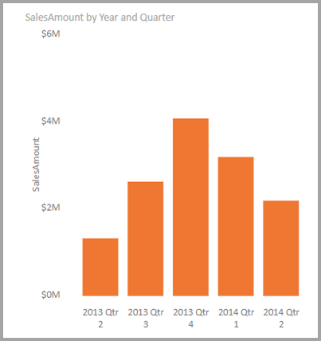
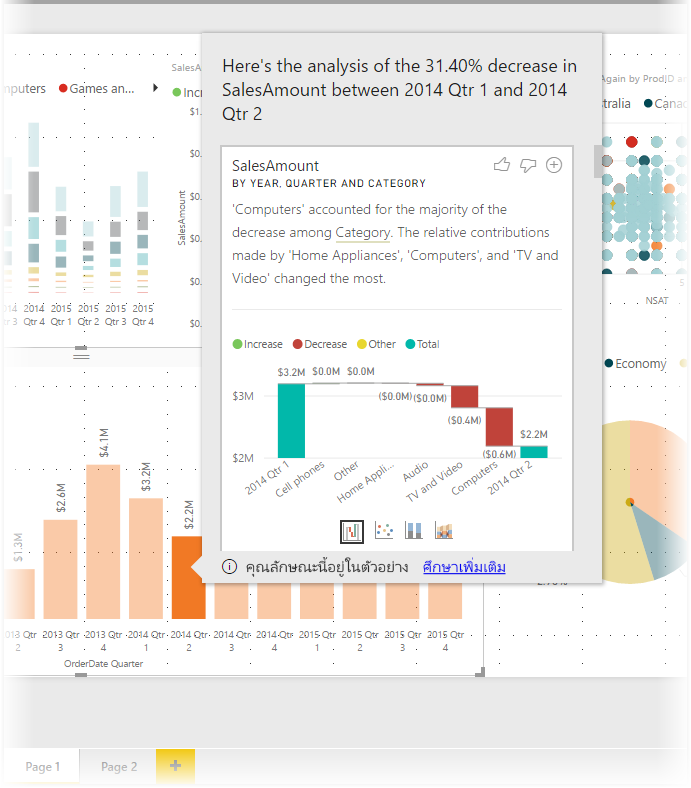
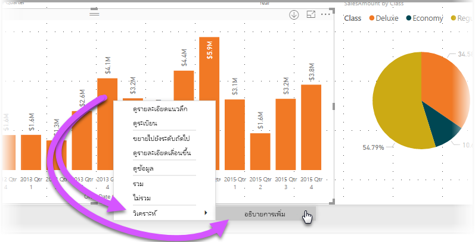
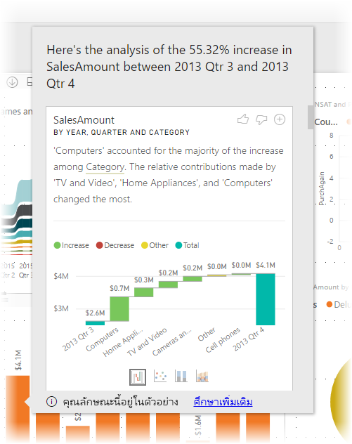
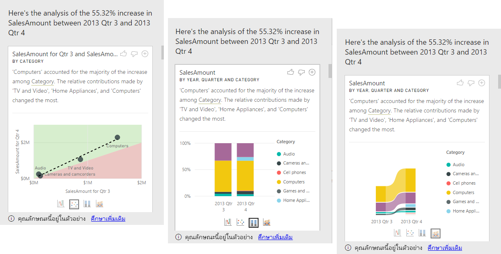
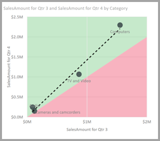

# ปรับใช้ข้อมูลเชิงลึกใน Power BI Desktop เพื่ออธิบายการผันผวนของวิชวล (ตัวอย่าง)Apply insights in Power BI Desktop to explain fluctuations in visuals (preview)

บ่อยครั้งในการแสดงผลด้วยภาพ คุณเห็นการเพิ่มอย่างมาก จากนั้นค่าจะลดลงอย่างรวดเร็ว และสงสัยเกี่ยวกับสาเหตุของความผันผวนดังกล่าวOften in visuals, you see a large increase and then a sharp drop in values, and wonder about  the cause of such fluctuations. คุณสามารถเรียนรู้สาเหตุด้วยการคลิกเพียงไม่กี่ครั้งด้วย **ข้อมูลเชิงลึก** ใน **Power BI Desktop**With **insights** in **Power BI Desktop** you can learn the cause with just a few clicks.

ตัวอย่างเช่น พิจารณาวิชวลต่อไปนี้ที่แสดง *ยอดขาย* ตาม *ปี* และ *ประเทศ*For example, consider the following visual that shows *Sales Amount* by *Year* and *Quarter*. ยอดขายลดลงอย่างมากเกิดขึ้นในปี 2014 เนื่องจากการขายที่ลดลงอย่างชัดเจนระหว่าง *ไตรมาสที่ 1* และ *ไตรมาส 2*A large decrease in sales occurs in 2014, with sales dropping sharply between *Qtr 1* and *Qtr 2*. ในกรณีดังกล่าว คุณสามารถสำรวจข้อมูล เพื่อช่วยอธิบายการเปลี่ยนแปลงที่เกิดขึ้นได้In such cases you can explore the data, to help explain the change that occurred. 

คุณสามารถบอกให้ **Power BI Desktop** อธิบายการเพิ่มขึ้นหรือลดลงของแผนภูมิ ดูปัจจัยการกระจายในแผนภูมิ และรับการวิเคราะห์ที่รวดเร็ว อัตโนมัติ และชาญฉลากเกี่ยวกับข้อมูลของคุณYou can tell **Power BI Desktop** to explain increases or decreases in charts, see distribution factors in charts, and get fast, automated, insightful analysis about your data. เพียงคลิกขวาที่จุดข้อมูล และเลือก **วิเคราะห์ > อธิบายการลดลง** (หรือเพิ่มขึ้น หากเส้นก่อนหน้านี้ต่ำกว่า) หรือ **วิเคราะห์ > หาว่าการกระจายนี้ต่างกันตรงไหน** และข้อมูลเชิงลึกจะถูกส่งไปให้คุณในหน้าต่างที่ใช้งานง่ายSimply right-click on a data point, and select **Analyze > Explain the decrease** (or increase, if the previous bar was lower), or **Analyze > Find where this distribution is different** and insight is delivered to you in an easy-to-use window.

คุณลักษณะข้อมูลเชิงลึก มีบริบทและขึ้นกับจุดข้อมูลก่อนหน้า - เช่นแท่งก่อนหน้า หรือคอลัมน์ก่อนหน้าThe insights feature is contextual, and is based on the immediately previous data point - such as the previous bar, or column.

> [!NOTE]
> คุณลักษณะนี้ยังเป็นแค่ตัวอย่าง และอาจเปลี่ยนแปลงได้This feature is in preview, and is subject to change. คุณลักษณะข้อมูลเชิงลึก เปิดและทำงานอยู่แล้วตามค่าเริ่มต้น (คุณไม่จำเป็นต้องทำเครื่องหมายที่กล่อง ตัวอย่าง เพื่อเปิดใช้งาน) ตั้งแต่ **Power BI Desktop** เวอร์ชันเดือนกันยายน 2017 เป็นต้นไปThe insight feature is enabled and on by default (you don't need to check a Preview box to enable it) beginning with the September 2017 version of **Power BI Desktop**.

## การใช้ข้อมูลเชิงลึกUsing insights
หากต้องการใช้ข้อมูลเชิงลึกเพื่ออธิบายการเพิ่มขึ้นหรือลดลงตามที่พบในแผนภูมิ ให้คลิกขวาบนจุดข้อมูลใด ๆ ในแท่งหรือแผนภูมิเส้น และเลือก **วิเคราะห์ > อธิบายการเพิ่มขึ้น** (หรือ *อธิบายการ ลดลง* เนื่องจากข้อมูลเชิงลึกทั้งหมดจะอาศัยการเปลี่ยนแปลงจากจุดข้อมูลก่อนหน้านี้)To use insights to explain increases or decreases seen on charts, just right-click on any data point in a bar or line chart, and select **Analyze > Explain the increase** (or *Explain the decrease*, since all insights are based on the change from the previous data point).

**Power BI Desktop** จะเรียกใช้อัลกอริทึมการเรียนรู้ กับข้อมูล และเพิ่มวิชวลและคำอธิบายลงในหน้าต่าง ที่ใช้อธิบายว่าข้อมูลประเภทไหนส่งผลต่อการเพิ่มขึ้นหรือลดลงมากที่สุด**Power BI Desktop** then runs its machine learning algorithms over the data, and populates a window with a visual and a description that describes which categories most influenced the increase or decrease. ตามค่าเริ่มต้น ข้อมูลเชิงลึกจะแสดงด้วย *แผนภูมิแบบน้ำตก* ดังแสดงในรูปต่อไปนี้By default, insights are provided as a *waterfall* visual, as shown in the following image.

โดยการเลือกไอคอนขนาดเล็กที่ด้านล่างของแผนแบบภูมิน้ำตก คุณสามารถเลือกให้แสดงข้อมูลเชิงลึก เป็น แผนภูมิกระจาย แผนภูมิคอลัมน์แบบเรียงซ้อน หรือแผนภูมิ ribbonBy selecting the small icons at the bottom of the waterfall visual, you can choose to have insights display a scatter chart, stacked column chart, or a ribbon chart.

ไอคอน *ยกนิ้วโป้งขึ้น* และ *คว่านิ้วโป้งลง* ที่ด้านบนของหน้า ให้คุณเสนอแนะติชมวิชวลและคุณลักษณะนี้The *thumbs up* and *thumbs down* icons at the top of the page are provided so you can provide feedback about the visual and the feature. การดำเนินการดังกล่าวมีคำติชม แต่จะไม่ใช่การสอนอัลกอริทึมในปัจจุบันเพื่อให้ส่งผลกระทบต่อผลลัพธ์ที่ส่งกลับเมื่อคุณใช้คุณลักษณะครั้งถัดไปDoing so provides feedback, but it does not currently train the algorithm to influence the results returned next time you use the feature.

และที่สำคัญ ปุ่ม **+** ที่ด้านบนของวิชวลช่วย ให้คุณเพิ่มวิชวลที่เลือกลงในรายงานของคุณ ราวกับว่าคุณได้สร้างวิชวลด้วยตัวเองAnd importantly, the **+** button at the top of the visual lets you add the selected visual to your report, just as if you created the visual manually. จากนั้นคุณสามารถจัดรูปแบบ หรือปรับแก้วิชวลที่เพิ่มเข้าไป ได้เหมือนกับที่คุณทำกับวิชวลอื่น ๆ บนรายงานของคุณYou can then format or otherwise adjust the added visual just as you would to any other visual on your report. คุณสามารถเพิ่มวิชวลเชิงลึกที่เลือกไว้ เมื่อคุณแก้ไขรายงานใน **Power BI Desktop** เท่านั้นYou can only add a selected insight visual when you're editing a report in **Power BI Desktop**.

คุณสามารถใช้ข้อมูลเชิงลึกเมื่อรายงานของคุณอยู่ในโหมดอ่าน หรือแก้ไข ทำให้มีความยืดหยุ่นในการวิเคราะห์ข้อมูล และสร้างวิชวลที่คุณสามารถเพิ่มในรายงานของคุณได้อย่างง่ายดายเYou can use insights when your report is in reading or editing mode, making it versatile for both analyzing data, and for creating visuals you can easily add to your reports.

## รายละเอียดของผลลัพธ์ที่ส่งกลับDetails of the results returned

รายละเอียดที่ส่งกลับโดยข้อมูลเชิงลึกมีจุดมุ่งหมายเพื่อเน้นสิ่งที่แตกต่างกันระหว่างสองช่วงเวลา เพื่อช่วยให้คุณเข้าใจการเปลี่ยนแปลงระหว่างกันThe details returned by insights are intended to highlight what was different between the two time periods, to help you understand the change between them.  

ตัวอย่างเช่น ถ้า *ยอดขาย* โดยรวมเพิ่มขึ้น 55% จาก *ไตรมาส 3* จนถึง *ไตรมาส 4* และเป็นจริงที่ว่าเท่ากันทุก *หมวดหมู่* ของผลิตภัณฑ์ (ยอดขายของคอมพิวเตอร์เพิ่มขึ้น 55% และของเสียง และอื่นๆ) และยังเป็นจริงสำหรับทุกประเทศ และทุกชนิดของลูกค้า แล้วมีเพียงเล็กน้อยที่สามารถระบุได้ในข้อมูลเพื่อช่วยในการอธิบายการเปลี่ยนแปลงFor example, if *Sales* increased by 55% overall from *Qtr 3* to *Qtr 4*, and that is equally true for every *Category* of product (sales of Computer increased by 55%, and of Audio, and so on), and also true for every country, and for every type of customer, then there is little that can be identified in the data to help explain the change. อย่างไรก็ตาม สถานการณ์ดังกล่าวไม่ได้เป็นเช่นนั้นและเรามักจะพบความแตกต่างในสิ่งที่เกิดขึ้น เช่น ในหมวดหมู่ *คอมพิวเตอร์* และ *เครื่องใช้ในบ้าน* ขยายตัวได้ถึง 63% ในขณะที่ *โทรทัศน์และเสียง* เพิ่มขึ้นเพียง 23% เท่านั้น ดังนั้น *คอมพิวเตอร์* และ *เครื่องใช้ในบ้าน* มีส่วนช่วยทำให้ยอดขายรวมใน *ไตรมาส 4* สูงกว่า *ไตรมาส 3* อย่างมากHowever, that situation is generally not the case, and we might typically find differences in what occurred, such that among the categories, *Computers* and *Home Appliances* grew by a much larger 63% percentage, while *TV and Audio* grew by only 23%, and therefore *Computers* and *Home Appliances* contributed a larger amount of the total for *Qtr 4* than they had for *Qtr 3*.  ดังตัวอย่างที่ให้ไว้นี้ คำอธิบายที่สมเหตุสมผลของการเพิ่มขึ้นคือ: *ยอดขายที่แข็งแกร่งโดยเฉพาะอย่างยิ่งสำหรับคอมพิวเตอร์และทีวีและเครื่องเสียง*Given this example, a reasonable explanation of the increase would be: *particularly strong sales for Computers and TV and Audio*. 

ดังนั้นอัลกอริทึมไม่ได้ส่งคืนค่าที่ทำให้เกิดการเปลี่ยนแปลงในปริมาณมากที่สุดSo the algorithm is not simply returning the values that account for the biggest amount of the change. ตัวอย่างเช่น ถ้ายอดขายส่วนใหญ่ (98%) มาจากประเทศสหรัฐอเมริกาแล้ว โดยทั่วไปก็จะเป็นกรณีที่การเพิ่มขึ้นส่วนใหญ่ยังคงอยู่ในประเทศสหรัฐอเมริกาด้วยFor example, if the vast majority (98%) of sales came from the USA, then it would commonly be the case that the vast majority of the increase was also in the USA. เว้นแต่ว่าจะมีการเปลี่ยนแปลงของส่วนสนับสนุนสัมพัทธ์ต่อผลรวมอย่างมีนัยสำคัญในประเทศสหรัฐอเมริกาหรือประเทศอื่นๆ ดังนั้นจะไม่ถือว่า *ประเทศ* น่าสนใจในบริบทนี้Yet unless the USA or other countries had a significant change to their relative contribution to the total, *Country* would not be considered interesting in this context.  

กล่าวให้ง่ายขึ้นก็คือ อัลกอริธึมสามารถคิดได้ว่าจะใช้คอลัมน์อื่นๆ ทั้งหมดในโมเดลและคำนวณรายละเอียดตามคอลัมน์นั้น *ก่อน* และ *หลัง* ช่วงเวลาโดยพิจารณาว่ามีการเปลี่ยนแปลงเกิดขึ้นในรายละเอียดนั้น และจากนั้นส่งคืนคอลัมน์เหล่านั้นที่มีขนาดการเปลี่ยนแปลงมากที่สุดSimplistically, the algorithm can be thought of as taking all the other columns in the model, and calculating the breakdown by that column for the *before* and *after* time periods, determining how much change occurred in that breakdown, and then returning those columns with the biggest change. ตัวอย่างเช่น *หมวดหมู่* ได้รับเลือกในตัวอย่างข้างต้นเนื่องจากส่วนสนับสนุนที่เกิดจาก *ทีวีและวิดีโอ* ลดลง 7% จาก 33% เป็น 26% ในขณะที่ส่วนสนับสนุนจาก *เครื่องใช้ในบ้าน* เพิ่มขึ้นจากที่ไม่มีเลยเป็นมากกว่า 6%For example, *Category* was selected in the example above, as the contribution made by *TV and Video* fell 7% from 33% to 26%, while the contribution from *Home Appliances* grew from nothing to over 6%. 

สำหรับแต่ละคอลัมน์ที่ส่งคืน มีภาพสี่ภาพที่สามารถแสดงผลได้For each column returned, there are four visuals that can be displayed. ภาพสามภาพเหล่านี้มีจุดมุ่งหมายเพื่อเน้นการเปลี่ยนแปลงของส่วนสนับสนุนระหว่างสองช่วงเวลาThree of those visuals are intended to highlight the change in contribution between the two periods. ตัวอย่าง เช่นสำหรับคำอธิบายการเพิ่มขึ้นจาก *ไตรมาส 2* ถึง *ไตรมาส 3*For example, for the explanation of the increase from *Qtr 2* to *Qtr 3*.

### แผนภูมกระจายThe scatter plot

ภาพแผนภูมิกระจายจะแสดงค่าของการวัดในช่วงแรก (บนแกน x) เทียบกับค่าของการวัดในช่วงที่สอง (บนแกน y) สำหรับแต่ละค่าของคอลัมน์ (ในกรณีนี้คือ *หมวดหมู่* ู่)The scatter plot visual shows the value of the measure in the first period (on the x-axis) against the value of the measure in the second period (on the y-axis), for each value of the column (*Category* in this case). ดังนั้น ตามที่แสดงในรูปภาพต่อไปนี้ จุดข้อมูลใดๆ จะอยู่ในพื้นที่สีเขียวหากค่าเพิ่มขึ้นและในพื้นที่สีแดงหากลดลงThus as shown in the following image, any data points are in the green region if the value increased, and in the red region if they decreased. 

เส้นประแสดงให้เห็นถึงจุดที่พอเหมาะที่สุด และดังที่ปรากฏ จุดข้อมูลเหนือเส้นนี้เพิ่มขึ้นมากกว่าแนวโน้มโดยรวมและจุดข้อมูลต่ำกว่าเส้นลดน้อยลงThe dotted line shows the best fit, and as such, data points above this line increased by more than the overall trend, and those below it by less.  

โปรดทราบว่ารายการข้อมูลที่มีค่าว่างในช่วงเวลาหนึ่งๆ จะไม่ปรากฏในแผนภูมิกระจาย (ตัวอย่างเช่น ในกรณีนี้คือ *เครื่องใช้ในบ้าน*)Note that data items whose value was blank in either period will not appear on the scatter plot (for example, *Home Appliances* in this case)

### แผนภูมิคอลัมน์แบบเรียงซ้อน 100%The 100% stacked column chart

ภาพแผนภูมิคอลัมน์แบบเรียงซ้อน 100% แสดงค่าของการวัดก่อนและหลังตามคอลัมน์ที่เลือก ซึ่งแสดงเป็นคอลัมน์แบบเรียงซ้อน 100%The 100% stacked column chart visual shows the value of the measure before and after, by the selected column, shown as a 100% stacked column. ซึ่งจะช่วยให้สามารถเปรียบเทียบส่วนสนับสนุนก่อนและหลังได้แบบเคียงข้างกันThis allows side-by-side comparison of the contribution before and after. เคล็ดลับเครื่องมือแสดงส่วนสนับสนุนที่แท้จริงสำหรับค่าที่เลือกThe tooltips show the actual contribution for the selected value.

### แผนภูมิริบบอนThe ribbon chart

ภาพแผนภูมิริบบอนยังแสดงให้เห็นถึงค่าของการวัดก่อนและหลังด้วยThe ribbon chart visual showsalso  the value of the measure before and after. ซึ่งมีประโยชน์อย่างยิ่งเพื่อแสดงการเปลี่ยนแปลงของส่วนสนับสนุนเมื่อ *การเรียงลำดับ* ของส่วนสนับสนุนมีการเปลี่ยนแปลง (ตัวอย่างเช่น ถ้า *คอมพิวเตอร์* เป็นส่วนสนับสนุนอันดับหนึ่งในช่วงก่อนหน้า แต่หลังจากนั้นร่วงมาอยู่อันดับที่สาม)It's particularly useful in showing the changes in contributions when these were such that the *ordering* of contributors changed (for example, if *Computers* were the number one contributor before, but then fell to number three). 

### แผนภูมิน้ำตกThe waterfall chart

ภาพที่สี่คือแผนภูมิน้ำตกซึ่งแสดงการเพิ่มขึ้นหรือลดลงจริงในแต่ละช่วงเวลาThe fourth visual is a waterfall chart, showing the main actual increases or decreases between the periods. ภาพนี้แสดงให้เห็นถึงการเปลี่ยนแปลงที่เกิดขึ้นจริงอย่างชัดเจน แต่ไม่ได้ระบุถึงเฉพาะการเปลี่ยนแปลงในระดับชั้นของส่วนสนับสนุนที่เน้นความสำคัญอย่างแท้จริงว่าทำไมคอลัมน์จึงถูกเลือกให้เป็นที่น่าสนใจThis visual clearly shows the actual changes, but does not alone indicate the changes to the level of contribution that actually highlight why the column was chosen as being interesting. 

เมื่อจัดอันดับคอลัมน์ตามที่มีความแตกต่างมากที่สุดของส่วนสนับสนุนสัมพัทธ์ ให้พิจารณาต่อไปนี้:When ranking the column as to which have the largest differences in the relative contributions, the following is considered: 

* คาร์ดินาลลิตีเป็นปัจจัยเนื่องจากมีความแตกต่างทางสถิติน้อยอย่างมีนัยสำคัญ และมีความน่าสนใจน้อยเมื่อคอลัมน์มีคาร์ดินาลลิตีจำนวนมากThe cardinality is factored in, as a difference is less statistically significant, and less interesting, when a column has a large cardinality. 

* ความแตกต่างสำหรับหมวดหมู่ที่มีค่าเดิมสูงมากหรือใกล้เคียงกับศูนย์อย่างมากจะถูกถ่วงน้ำหนักมากกว่าค่าอื่นDifferences for those categories where the original values were very high or very close to zero are weighted higher than others. ตัวอย่างเช่น ถ้าหมวดหมู่หนึ่งมีส่วนสนับสนุนเพียง 1% ของยอดขาย แต่เปลี่ยนเป็น 6% โดยมีนัยสำคัญทางสถิติ ดังนั้นจะถือว่าหมวดหมู่นี้น่าสนใจมากกว่าหมวดหมู่ที่มีการเปลี่ยนแปลงจาก 50% เป็น 55%For example, if a Category  only contributed 1% of sales, and this changed to 6%, that is more statistically significant, and therefore considered more interesting, than a Category whose contribution changed from 50% to 55%. 

* วิทยาการศึกษาสำนึกแบบต่างๆ จะถูกนำมาใช้เพื่อเลือกผลลัพธ์ที่มีความหมายมากที่สุด เช่น โดยการพิจารณาความสัมพันธ์ระหว่างข้อมูลอื่นๆVarious heuristics are employed to select the most meaningful results, for example by considering other relationships between the data.
 
หลังจากตรวจสอบคอลัมน์ต่างๆ แล้วจะมีการเลือกคอลัมน์ที่แสดงการเปลี่ยนแปลงมากที่สุดต่อส่วนสนับสนุนสัมพัทธ์และส่งค่าออกAfter examining different columns, those that show the biggest change to relative contribution are chosen and output. สำหรับแต่ละหมวดหมู่ ค่าที่มีการเปลี่ยนแปลงของส่วนสนับสนุนอย่างมีนัยสำคัญที่สุดจะถูกนำไปใช้ในการอธิบายFor each, the values which had the most significant change to contribution are called out in the description. นอกจากนี้ ค่าที่มีการเพิ่มขึ้นและลดลงมากที่สุดตามที่เกิดขึ้นจริงจะถูกนำไปใช้ด้วยIn addition, the values that had the largest actual increases and decreases are also called out.

## ข้อควรพิจารณาและข้อจำกัดConsiderations and limitations
เนื่องจากข้อมูลเชิงลึกเหล่านี้ขึ้นอยู่กับการเปลี่ยนแปลงจากจุดข้อมูลก่อนหน้า ดังนั้นจึงไม่สามารถใช้งานได้เมื่อคุณเลือกจุดข้อมูลแรกในภาพSince these insights are based on the change from the previous data point, they aren't available when you select the first data point in a visual. 

รายการต่อไปนี้ คือชุดของสถานการณ์ที่ไม่สนับสนุนในการ **อธิบายการเพิ่มขึ้น/ลดลง** ในปัจจุบัน:The following list is the collection of currently unsupported scenarios for **explain the increase/decrease**:

* ตัวกรอง TopNTopN filters
* ตัวกรอง รวม/ไม่รวมInclude/exclude filters
* ตัวกรองหน่วยวัดMeasure filters
* หน่วยวัดที่ไม่ใช่ตัวเลขNon-numeric measures
* ใช้ "แสดงค่าเป็น"Use of "Show value as"
* การวัดที่กรองแล้ว - การวัดที่กรองแล้วคือการคำนวณระดับชั้นด้วยสายตาโดยใช้ตัวกรองเฉพาะ (ตัวอย่างเช่น *ยอดขายรวมสำหรับประเทศฝรั่งเศส*) และใช้กับภาพจริงบางส่วนที่สร้างโดยคุณลักษณะข้อมูลเชิงลึกFiltered measures - filtered measures are visual level calculations with a specific filter applied (for example, *Total Sales for France*), and are used on some of the visuals created by the insights feature
* คอลัมน์ประเภทที่ใช้เป็นแกน X เว้นแต่ว่าจะกำหนดการเรียงลำดับตามคอลัมน์ที่เป็นสเกลาCategorical columns on X-axis unless it defines a sort by column that is scalar. ถ้ามีการใช้ลำดับชั้น ทุกคอลัมน์ในลำดับชั้นที่ใช้งานจะต้องตรงกับเงื่อนไขนี้If using a hierarchy, then every column in the active hierarchy has to match this condition

นอกจากนี้ ข้อมูลเชิงลึกยังไม่สนับสนุน รูปแบบข้อมูลและแหล่งข้อมูลต่อไปนี้In addition, the following model types and data sources are currently not supported for insights:

* DirectQueryDirectQuery
* เชื่อมต่อสดLive connect
* Reporting Services ในองค์กรOn-premises Reporting Services
* การฝังตัวEmbedding

## ขั้นตอนถัดไปNext steps
สำหรับข้อมูลเพิ่มเติมเกี่ยวกับ **Power BI Desktop** และวิธีการเริ่มต้นใช้งาน ตรวจสอบบทความต่อไปนี้For more information about **Power BI Desktop**, and how to get started, check out the following articles.

* [Power BI Desktop คืออะไรWhat is Power BI Desktop?](../fundamentals/desktop-what-is-desktop.md)
* [ภาพรวมคิวรี ด้วย Power BI DesktopQuery Overview with Power BI Desktop](../transform-model/desktop-query-overview.md)
* [แหล่งข้อมูลใน Power BI DesktopData Sources in Power BI Desktop](../connect-data/desktop-data-sources.md)
* [เชื่อมต่อกับข้อมูลใน Power BI DesktopConnect to Data in Power BI Desktop](../connect-data/desktop-connect-to-data.md)
* [จัดรูปทรง และรวมข้อมูลด้วย Power BI DesktopShape and Combine Data with Power BI Desktop](../connect-data/desktop-shape-and-combine-data.md)
* [งานคิวรี่ทั่วไปใน Power BI DesktopCommon Query Tasks in Power BI Desktop](../transform-model/desktop-common-query-tasks.md)   
