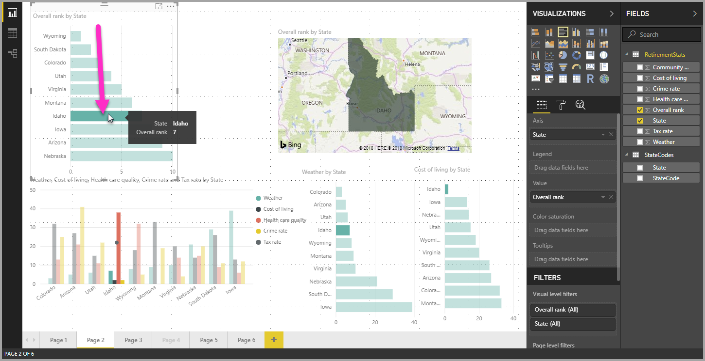
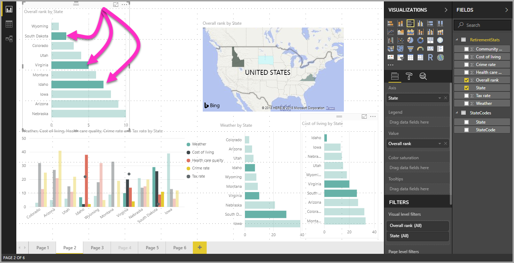

# องค์ประกอบข้อมูลที่เลือกได้หลายรายการ จุดข้อมูล และวิชวลใน Power BI Desktop

คุณสามารถเลือกองค์ประกอบข้อมูลหลายรายการในวิชวลเดียว จุดข้อมูลหลายรายการในวิชวล หรือหลายวิชวลในรายงานโดยใช้ Power BI Desktop ส่วนต่อไปนี้ จะอธิบายขั้นแต่ละขั้นตอนตามลำดับ

## เลือกจุดข้อมูลหลายรายการ

ใน Power BI Desktop คุณสามารถเน้นจุดข้อมูลในภาพที่กำหนดได ้เพียงแค่คลิกบนจุดข้อมูลในภาพ ตัวอย่างเช่น ถ้าคุณมีแถบที่สำคัญหรือองค์ประกอบแผนภูมิ และคุณต้องการให้ภาพรายการอื่น ๆ ในหน้ารายงานเน้นข้อมูลตามสิ่งที่คุณเลือก ให้คลิกองค์ประกอบของข้อมูลในภาพใดภาพหนึ่ง แล้วคุณก็จะเห็นผลลัพธ์ที่ปรากฏในภาพอื่น ๆ ในหน้านั้น นี่คือการเน้นพื้นฐาน หรือการเน้นรายการที่เลือกเพียงรายการเดียว รูปต่อไปนี้จะแสดงการเน้นพื้นฐาน 

เมื่อใช้การเลือกหลายรายการ คุณก็สามารถเลือกจุดข้อมูลมากกว่าหนึ่งรายการในหน้ารายงาน **Power BI Desktop** ของคุณ และเน้นผลลัพธ์ผ่านภาพต่าง ๆ ในหน้านั้นได้ ซึ่งจะเหมือนกับข้อความ **และ** หรือฟังก์ชันการทำงาน เช่น "เน้นผลลัพธ์สำหรับไอดาโฮ **และ** เวอร์จิเนีย" เมื่อต้องการเลือกจุดข้อมูลหลายรายการในวิชวล ใช้ **CTRL + คลิก** เพื่อเลือกจุดข้อมูลหลายรายการ รูปต่อไปนี้จะแสดง **จุดข้อมูลหลายรายการ** ที่เลือก (เลือกหลายรายการ) ไว้

วิธีการนี้เหมือนจะเป็นคุณลักษณะพื้นฐานธรรมดา แต่จะแสดงข้อมูลโอกาสได้ทุกประเภท เมื่อคุณสร้าง แชร์ และโต้ตอบกับรายงาน 

## เลือกหลายองค์ประกอบโดยใช้การเลือกสี่เหลี่ยม (ตัวอย่าง)

คุณสามารถเลือกองค์ประกอบข้อมูลหลายรายการในวิชวล หรือหลายวิชวลในรายงานได้โดยใช้การเลือกรูปสี่เหลี่ยมซึ่งมักจะเรียกว่า *lasso select* 

### เลือกหลายวิชวลบนพื้นที่ทำงาน

เลือกหลาบวิชวลและองค์ประกอบรายงานอื่นๆ โดยการคลิกและลากผ่านพื้นที่ทำงานเพื่อสร้าง lasso สี่เหลี่ยมผืนผ้า วิชวลทั้งหมดที่มีอยู่ภายใน lasso คือวิชวลถูกเลือกแล้ว ถ้าคุณกดแป้น *Ctrl* หรือ *Shift* (ตามที่คุณเลือกหลายรายการโดย Ctrl + คลิกที่แต่ละวิชวล) lasso เพิ่มเติมจะเพิ่มการเลือกวิชวลให้กับการเลือกแบบหลายรายการปัจจุบัน 

ถ้ามีการเลือกวิชวลแล้วและมีการสร้าง lasso แล้ว ใช้ *Ctrl* หรือ *Shift* สลับปิดการเลือกนั้น Lasso ไม่ได้เลือกวิชวลเดียวภายในกลุ่ม แต่สามารถเลือกกลุ่มได้โดยห่อทั้งกลุ่ม

พื้นที่ทำงานไม่ได้เลื่อนโดยอัตโนมัติพร้อมการเลือก lasso สี่เหลี่ยม 

### เลือกจุดข้อมูลหลายรายการในวิชวล

คุณสามารถเลือกหลายจุดข้อมูลภายในวิชวลโดยใช้ขั้นตอน lasso สี่เหลี่ยมเดียวกันได้ ในขณะที่กดปุ่ม *Ctrl* แล้วให้คลิกและลากภายในวิชวลเพื่อเลือกจุดข้อมูลหลายรายการ เมื่อคุณปล่อยปุ่มเมาส์ จุดทั้งหมดที่มีการเลือกทับซ้อนกันในการเลือกสี่เหลี่ยมจะถูกเลือก และการเลือก lasso ก่อนหน้านี้จะยังคงถูกเก็บไว้ ถ้าคุณ lasso เลือกพื้นที่ที่รวมจุดที่เลือกไว้ก่อนหน้านี้โดยใช้ *Ctrl* ในขณะที่เลือก จุดข้อมูลเหล่านั้นจะไม่ถูกเลือก (ปิดใช้งาน) การใช้ lasso มีผลเหมือนกันและ *Ctrl*-การคลิกที่จุดแต่ละรายการ 

เมื่อคุณใช้คีย์ *Shift* ในขณะที่ทำการเลือก lasso การเลือกก่อนหน้านี้จะถูกรักษาไว้และมีการเลือกจุดข้อมูลที่เลือกไว้อยู่แล้วจะยังคงถูกเลือกไว้อยู่ ดังนั้นการใช้ *Shift* ขณะดำเนินการ lasso จะเพิ่มจุดข้อมูลลงในการเลือกของคุณเท่านั้น แทนที่จะเป็นจุดข้อมูลสลับในพื้นที่ที่เลือกไว้

คุณสามารถล้างการเลือกปัจจุบันของคุณได้โดยการคลิกที่พื้นที่ว่างบนพื้นที่ลงจุดโดยไม่ต้องกดแป้นพิมพ์

สำหรับข้อมูลเพิ่มเติมเกี่ยวกับคุณลักษณะนี้ ให้ดู [บล็อกโพสต์เกี่ยวกับการเผยแพร่คุณลักษณะนี้](https://powerbi.microsoft.com/blog/power-bi-desktop-august-2020-feature-summary/#_Data_point)

มีข้อจำกัดและข้อควรพิจารณาบางอย่างสำหรับการเลือกจุดข้อมูลหลายรายการภายในวิชวล:

* เส้น พื้นที่ แผนภูมิกระจาย แผนที่ต้นไม้ และแผนที่รองรับการเลือกแบบลาสโซ
* จำนวนสูงสุดของจุดข้อมูลที่คุณสามารถเลือกได้ในครั้งเดียวคือ 300
* เมื่อดูรายงานในบริการของ Power BI การเลือกสี่เหลี่ยมผืนผ้าจะเปิดใช้งานเฉพาะเมื่อมีการเปิดใช้งานคุณลักษณะการเลือก lasso เมื่อมีการบันทึกและเผยแพร่รายงาน

## ขั้นตอนถัดไป

คุณอาจสนใจบทความต่อไปนี้:

* [ใช้เส้นตารางและจัดชิดกับเส้นตารางในรายงาน Power BI Desktop](desktop-gridlines-snap-to-grid.md)
* [เกี่ยวกับตัวกรองและการไฮไลท์ในรายงาน Power BI](power-bi-reports-filters-and-highlighting.md)

