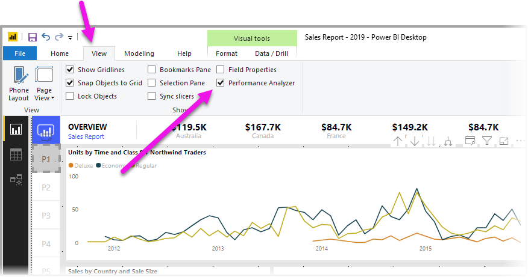
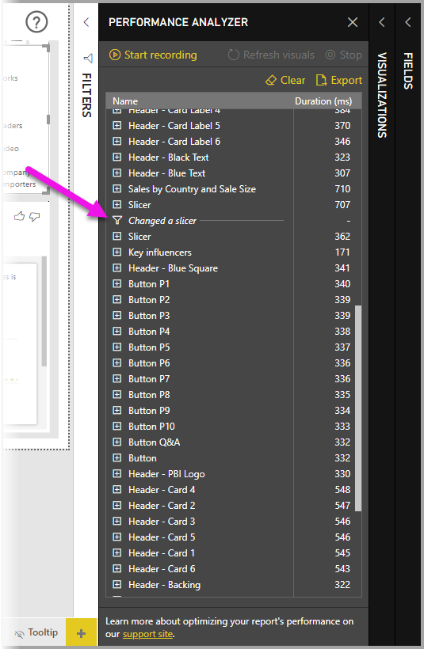
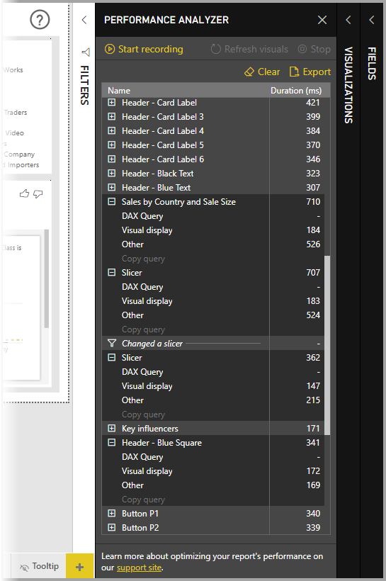
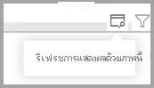
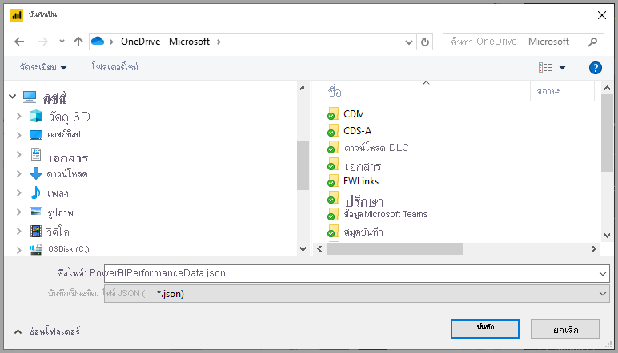

# ใช้ตัววิเคราะห์ประสิทธิภาพในการตรวจสอบประสิทธิภาพขององค์ประกอบรายงานUse Performance Analyzer to examine report element performance

ใน **Power BI Desktop** คุณสามารถค้นหาว่าองค์ประกอบรายงานแต่ละรายการของคุณ เช่น วิชวลและสูตร DAX ทำงานอย่างไรIn **Power BI Desktop** you can find out how each of your report elements, such as visuals and DAX formulas, are performing. การใช้ **ตัววิเคราะห์ประสิทธิภาพ** คุณสามารถดูและบันทึกข้อมูลบันทึกที่วัดว่าแต่ละองค์ประกอบของรายงานมีประสิทธิภาพอย่างไรเมื่อผู้ใช้โต้ตอบกับองค์ประกอบดังกล่าว และประสิทธิภาพการทำงานด้านใดที่ใช้ทรัพยากรมากที่สุด (หรือน้อยที่สุด)Using the **Performance Analyzer**, you can see and record logs that measure how each of your report elements performs when users interact with them, and which aspects of their performance are most (or least) resource intensive.

ตัววิเคราะห์ประสิทธิภาพตรวจสอบและแสดงระยะเวลาที่จำเป็นสำหรับการอัปเดตหรือรีเฟรชวิชวลทั้งหมดเมื่อการโต้ตอบของผู้ใช้เริ่มต้นขึ้น และนำเสนอข้อมูลเพื่อให้คุณสามารถดู เจาะลึกรายละเอียด หรือส่งออกผลลัพธ์ได้Performance Analyzer inspects and displays the duration necessary for updating or refreshing all visuals that user interactions initiate, and presents the information so you can view, drill down, or export the results. ตัววิเคราะห์ประสิทธิภาพสามารถช่วยให้คุณระบุวิชวลที่มีผลกระทบต่อประสิทธิภาพการทำงานของรายงานของคุณ และระบุเหตุผลสำหรับผลกระทบPerformance Analyzer can help you identify visuals that are impacting the performance of your reports, and identify the reason for the impact.

## แสดงบานหน้าต่างตัววิเคราะห์ประสิทธิภาพDisplaying the Performance Analyzer pane

ใน **Power BI Desktop** ให้เลือกริบบอน **มุมมอง**In **Power BI Desktop** select the **View** ribbon. ในพื้นที่ **แสดง** ของริบบอน **มุมมอง** คุณสามารถเลือกช่องทำเครื่องหมายถัดจาก **ตัววิเคราะห์ประสิทธิภาพ** เพื่อแสดงบานหน้าต่างตัววิเคราะห์ประสิทธิภาพIn the **Show** area of the **View** ribbon you can select the checkbox next to **Performance Analyzer** to display the Performance Analyzer pane.

เมื่อเลือกแล้ว ตัววิเคราะห์ประสิทธิภาพจะแสดงในบานหน้าต่างของตัวเองทางด้านขวาของพื้นที่รายงานOnce selected, the Performance Analyzer is displayed in its own pane, to the right of the report canvas.

## ใช้ตัววิเคราะห์ประสิทธิภาพUsing Performance Analyzer

ตัววิเคราะห์ประสิทธิภาพวัดเวลาการประมวลผล (รวมถึงเวลาในการสร้างหรืออัปเดตวิชวล) ที่จำเป็นในการอัปเดตองค์ประกอบรายงานที่เริ่มต้นขึ้นอันเป็นผลมาจากการโต้ตอบของผู้ใช้ที่ทำให้เกิดการเรียกใช้คิวรีPerformance analyzer measures the processing time (including the time to create or update a visual) required to update report elements initiated as a result of any user interaction that results in running a query. ตัวอย่างเช่น การปรับตัวแบ่งส่วนข้อมูลจำเป็นต้องมีการปรับแต่งวิชวลของตัวแบ่งส่วนข้อมูล คิวรีที่จะส่งไปยังแบบจำลองข้อมูล และวิชวลที่ได้รับผลกระทบจะต้องมีการอัปเดตอันเป็นผลมาจากการตั้งค่าใหม่For example, adjusting a slicer requires the slicer visual to be modified, a query to be sent to the data model, and affected visuals that must be updated as a result of the new settings. 

เมื่อต้องการให้ตัววิเคราะห์ประสิทธิภาพเริ่มต้นการบันทึก เพียงแค่เลือก **เริ่มการบันทึก**To have Performance Analyzer begin recording, simply select **Start recording**

การดำเนินการใดก็ตามที่คุณทำในรายงานจะแสดงขึ้นและบันทึกในบานหน้าต่างตัววิเคราะห์ประสิทธิภาพตามลำดับที่มีการโหลดวิชวลโดย Power BIAny actions you take in the report are displayed and logged in the Performance Analyzer pane, in the order that the visual is loaded by Power BI. ตัวอย่างเช่น คุณอาจมีรายงานที่ผู้ใช้แจ้งว่าการรีเฟรชใช้เวลานานFor example, perhaps you have a report that users have said takes a long time to refresh. หรือการแสดงวิชวลในรายงานบางวิชวลใช้เวลานานเมื่อมีการปรับแถบเลื่อนOr certain visuals in a report take a long time to display when a slider is adjusted. ตัววิเคราะห์ประสิทธิภาพสามารถบอกคุณได้ว่าวิชวลใดเป็นสาเหตุ และระบุลักษณะของวิชวลที่ใช้เวลานานที่สุดในการดำเนินการPerformance analyzer can tell you which visual is the culprit, and identifies which aspects of the visual is taking the longest duration to process. 

เมื่อคุณเริ่มการบันทึกแล้ว ปุ่ม **เริ่มการบันทึก** จะเป็นสีเทา (ไม่ทำงานเนื่องจากคุณได้เริ่มการบันทึกแล้ว) และปุ่ม **หยุด** ทำงานอยู่Once you start recording, the **Start recording** button is grayed out (inactive, since you've already begun recording) and the **Stop** button is active. 

ตัววิเคราะห์ประสิทธิภาพจะรวบรวมและแสดงข้อมูลการวัดประสิทธิภาพในแบบเรียลไทม์Performance analyzer collects and displays the performance measurement information in real time. ดังนั้นแต่ละครั้งที่คุณคลิกบนวิชวล ย้ายตัวแบ่งส่วนข้อมูล หรือโต้ตอบในวิธีอื่น ตัววิเคราะห์ประสิทธิภาพจะแสดงผลลัพธ์ของประสิทธิภาพการทำงานในบานหน้าต่างทันทีSo each time you click on a visual, move a slicer, or interact in any other way, Performance Analyzer immediately displays the performance results in its pane.

ถ้าบานหน้าต่างมีข้อมูลมากกว่าที่สามารถแสดงได้ แถบเลื่อนจะปรากฏขึ้นเพื่อนำทางไปยังข้อมูลเพิ่มเติมIf the pane has more information than can be displayed, a scroll bar appears to navigate to additional information.

การโต้ตอบแต่ละรายการจะมีตัวระบุส่วนในบานหน้าต่าง อธิบายการดำเนินการที่เริ่มต้นรายการบันทึกEach interaction has a section identifier in the pane, describing the action that initiated the log entries. ในรูปภาพต่อไปนี้ การโต้ตอบคือ ผู้ใช้ปรับตัวแบ่งส่วนข้อมูลIn the following image, the interaction was that the users changed a slicer.

ข้อมูลบันทึกของแต่ละวิชวลจะประกอบด้วยเวลาที่ใช้ (ระยะเวลา) ในการดำเนินงานตามหมวดหมู่ต่อไปนี้ให้เสร็จสมบูรณ์:Each visual's log information includes the time spent (duration) to complete the following categories of tasks:

* **คิวรี DAX** - ถ้าจำเป็นต้องมีคิวรี DAX นี่คือเวลาระหว่างวิชวลที่ส่งคิวรี และสำหรับ Analysis Services เพื่อส่งคืนผลลัพธ์**DAX query** - if a DAX query was required, this is the time between the visual sending the query, and for Analysis Services to return the results.
* **การแสดงวิชวล** - เวลาที่ต้องใช้ในการวาดวิชวลลงบนหน้าจอ รวมถึงเวลาที่ต้องใช้เพื่อดึงรูปภาพของเว็บหรือการเข้ารหัสภูมิศาสตร์**Visual display** - time required for the visual to draw on the screen, including time required to retrieve any web images or geocoding. 
* **อื่น ๆ** - เวลาที่วิชวลต้องการสำหรับการจัดเตรียมคิวรี รอให้วิชวลอื่นเสร็จสมบูรณ์ หรือดำเนินการประมวลผลเบื้องหลังอื่น ๆ**Other** - time required by the visual for preparing queries, waiting for other visuals to complete, or performing other background processing.

ค่า **ช่วงเวลา (ms)** แสดงความแตกต่างระหว่างประทับเวลา *เริ่มต้น* และ *สิ้นสุด* สำหรับแต่ละการดำเนินการThe **Duration (ms)** values indicate the difference between a *start* and *end* timestamp for each operation. พื้นที่ทำงานและการดำเนินการวิชวลส่วนใหญ่ทำงานตามลำดับบนเธรดอินเทอร์เฟซผู้ใช้เดียว ซึ่งใช้ร่วมกันหลายการดำเนินการMost canvas and visual operations execute sequentially on a single User Interface thread, which is shared by multiple operations. ช่วงเวลาที่รายงานรวมประกอบด้วยที่อยู่ในคิวขณะที่การดำเนินการอื่นเสร็จสมบูรณ์The reported durations include time spent queued while other operations complete. [ตัวอย่างตัววิเคราะห์ประสิทธิภาพ](https://github.com/microsoft/powerbi-desktop-samples/tree/main/Performance%20Analyzer)บน GitHub และ[เอกสาร](https://github.com/microsoft/powerbi-desktop-samples/blob/main/Performance%20Analyzer/Power%20BI%20Performance%20Analyzer%20Export%20File%20Format.docx)ที่เกี่ยวข้องให้รายละเอียดเกี่ยวกับวิธีการสร้างวิชวลข้อมูลคิวรี และวิธีการแสดงผลข้อมูลดังกล่าวThe [Performance Analyzer sample](https://github.com/microsoft/powerbi-desktop-samples/tree/main/Performance%20Analyzer) on GitHub and its associated [documentation](https://github.com/microsoft/powerbi-desktop-samples/blob/main/Performance%20Analyzer/Power%20BI%20Performance%20Analyzer%20Export%20File%20Format.docx) provide details about how visuals query data, and how they render.

หลังจากที่คุณโต้ตอบกับองค์ประกอบของรายงานที่คุณต้องการวัดผลด้วยตัววิเคราะห์ประสิทธิภาพ แล้วคุณสามารถเลือกปุ่ม **หยุด**After you've interacted with elements of the report you want to measure with Performance Analyzer, you can select the **Stop** button. ข้อมูลประสิทธิภาพยังคงอยู่ในบานหน้าต่างหลังจากคุณเลือก **หยุด** เพื่อให้คุณนำไปวิเคราะห์The performance information remains in the pane after you select **Stop** for you to analyze.

หากต้องการล้างข้อมูลในบานหน้าต่างตัววิเคราะห์ประสิทธิภาพ ให้เลือก **ล้าง**To clear out the information in the Performance Analyzer pane, select **Clear**. ข้อมูลทั้งหมดจะถูกลบออกและไม่ได้รับการบันทึกเมื่อคุณเลือก **ล้าง**All information is erased and is not saved when you select **Clear**. ดูหัวข้อถัดไปเพื่อเรียนรู้วิธีการบันทึกข้อมูลในรายการบันทึกSee the next section to learn how to save information in logs. 

## การรีเฟรชวิชวลRefreshing visuals

คุณสามารถเลือก **รีเฟรชวิชวล** ในบานหน้าต่างตัววิเคราะห์ประสิทธิภาพเพื่อรีเฟรชวิชวลทั้งหมดในหน้าปัจจุบันของรายงาน และด้วยเหตุนี้ ตัววิเคราะห์ประสิทธิภาพจึงรวบรวมข้อมูลเกี่ยวกับวิชวลดังกล่าวทั้งหมดYou can select **Refresh visuals** in the Performance Analyzer pane to refresh all visuals on the current page of the report, and thereby have Performance Analyzer gather information about all such visuals.

คุณยังสามารถรีเฟรชวิชวลแต่ละอันแยกต่างหากได้You can also refresh individual visuals. เมื่อตัววิเคราะห์ประสิทธิภาพกำลังบันทึก คุณสามารถเลือก **รีเฟรชวิชวลนี้** ที่มุมขวาบนของแต่ละวิชวล เพื่อรีเฟรชวิชวลนั้น และเก็บข้อมูลประสิทธิภาพของวิชวลดังกล่าวWhen Performance Analyzer is recording, you can select **Refresh this visual** found in the top-right corner of each visual, to refresh that visual, and capture its performance information.

## การบันทึกข้อมูลประสิทธิภาพSaving performance information

คุณสามารถบันทึกข้อมูลที่ตัววิเคราะห์ประสิทธิภาพสร้างเกี่ยวกับรายงานได้โดยการเลือกปุ่ม **ส่งออก**You can save the information that Performance Analyzer creates about a report by selecting the **Export** button. การเลือก **ส่งออก** จะสร้างไฟล์ .json ที่มีข้อมูลจากบานหน้าต่างตัววิเคราะห์ประสิทธิภาพSelecting **Export** creates a .json file with information from the Performance Analyzer pane. 

## ขั้นตอนถัดไปNext steps
สำหรับข้อมูลเพิ่มเติมเกี่ยวกับ **Power BI Desktop** และวิธีการเริ่มต้นใช้งาน ตรวจสอบบทความต่อไปนี้For more information about **Power BI Desktop**, and how to get started, check out the following articles.

* [Power BI Desktop คืออะไรWhat is Power BI Desktop?](../fundamentals/desktop-what-is-desktop.md)
* [ภาพรวมคิวรี ด้วย Power BI DesktopQuery Overview with Power BI Desktop](../transform-model/desktop-query-overview.md)
* [แหล่งข้อมูลใน Power BI DesktopData Sources in Power BI Desktop](../connect-data/desktop-data-sources.md)
* [เชื่อมต่อกับข้อมูลใน Power BI DesktopConnect to Data in Power BI Desktop](../connect-data/desktop-connect-to-data.md)
* [จัดรูปทรง และรวมข้อมูลด้วย Power BI DesktopShape and Combine Data with Power BI Desktop](../connect-data/desktop-shape-and-combine-data.md)
* [งานคิวรี่ทั่วไปใน Power BI DesktopCommon Query Tasks in Power BI Desktop](../transform-model/desktop-common-query-tasks.md)   

สำหรับข้อมูลเกี่ยวกับตัวอย่างตัววิเคราะห์ประสิทธิภาพ ให้ดูแหล่งข้อมูลต่อไปนี้For information about the Performance Analyzer sample, check out the following resources.

* [ตัวอย่างตัววิเคราะห์ประสิทธิภาพPerformance Analyzer sample](https://github.com/microsoft/powerbi-desktop-samples/tree/main/Performance%20Analyzer)
* [เอกสารตัวอย่างตัววิเคราะห์ประสิทธิภาพPerformance Analyzer sample documentation](https://github.com/microsoft/powerbi-desktop-samples/blob/main/Performance%20Analyzer/Power%20BI%20Performance%20Analyzer%20Export%20File%20Format.docx)
