# <a name="use-r-powered-power-bi-visuals-in-power-bi"></a><span data-ttu-id="848da-103">ใช้ส่วนแสดงผล Power BI จาก R ใน Power BI</span><span class="sxs-lookup"><span data-stu-id="848da-103">Use R-powered Power BI visuals in Power BI</span></span>

<span data-ttu-id="848da-104">ใน **Power BI Desktop** และ **บริการของ Power BI** คุณสามารถใช้ส่วนการแสดงผล Power BI ที่ทำงานด้วย R โดยไม่มีความรู้ใด ๆ เกี่ยวกับ R และไม่ต้องเขียนสคริปต์ R ได้</span><span class="sxs-lookup"><span data-stu-id="848da-104">In **Power BI Desktop** and the **Power BI service**, you can use R-powered Power BI visuals without any knowledge of R and without any R scripting.</span></span> <span data-ttu-id="848da-105">ซึ่งช่วยให้คุณนำความสามารถการวิเคราะห์ และการแสดงผลของวิชวล R และสคริปต์ R มาใช้งาน โดยไม่ต้องการเรียนรู้ R หรือเขียนโปรแกรมเอง</span><span class="sxs-lookup"><span data-stu-id="848da-105">This enables you to harness the analytic and visual power of R visuals, and R scripts, without learning R or doing any programming yourself.</span></span>

<span data-ttu-id="848da-106">เพื่อใช้ส่วนการแสดงผล Power BI ที่ทำงานด้วย R คุณเร่ิมจากการเลือกและดาวน์โหลดวิชวล R แบบกำหนดเอง ที่คุณสนใจจะใช้จากแกลเลอรี **ส่วนการแสดงผล Power BI** สำหรับ Power BI ใน [**AppSource**](https://appsource.microsoft.com/marketplace/apps?product=power-bi-visuals&page=1)</span><span class="sxs-lookup"><span data-stu-id="848da-106">To use R-powered Power BI visuals, you first select and download the R custom visual you're interested in using from the [**AppSource**](https://appsource.microsoft.com/marketplace/apps?product=power-bi-visuals&page=1) gallery of **Power BI visuals** for Power BI.</span></span>

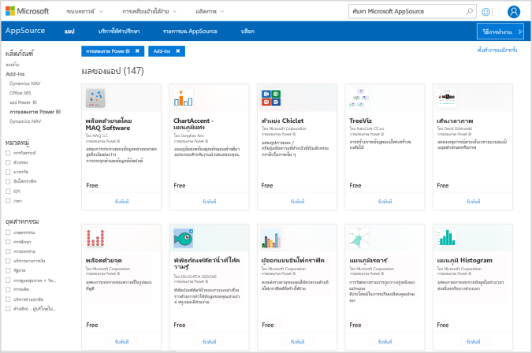

<span data-ttu-id="848da-108">ส่วนต่อไปนี้อธิบายวิธีการเลือก โหลด และใช้วิชวล R ใน **Power BI Desktop**</span><span class="sxs-lookup"><span data-stu-id="848da-108">The following sections describe how to select, load, and use R-powered visuals in **Power BI Desktop**.</span></span>

## <a name="use-r-power-bi-visuals"></a><span data-ttu-id="848da-109">ใช้ส่วนการแสดงผล Power BI จาก R</span><span class="sxs-lookup"><span data-stu-id="848da-109">Use R Power BI visuals</span></span>

<span data-ttu-id="848da-110">เพื่อใช้สว่นการแสดงผล Power BI จาก R ดาวน์โหลดแต่ละวิชวลจากไลบรารี **ส่วนการแสดงผล Power BI** จากนั้นใช้วิชวลได้เช่นเดียวกับวิชวลชนิดอื่น ๆ ใน **Power BI Desktop**</span><span class="sxs-lookup"><span data-stu-id="848da-110">To use R-powered Power BI visuals, download each visual from the **Power BI visuals** library, then use the visual like any other type of visual in **Power BI Desktop**.</span></span> <span data-ttu-id="848da-111">มีสองวิธีในการรับส่วนการแสดงผล Power BI: คุณสามารถดาวน์โหลดจากไซต์ออนไลน์ **AppSource** หรือเรียกดูและรับจากภายใน **Power BI Desktop**</span><span class="sxs-lookup"><span data-stu-id="848da-111">There are two ways to get Power BI visuals: you can download them from the online **AppSource** site, or browse and get them from within **Power BI Desktop**.</span></span> 

### <a name="get-power-bi-visuals-from-appsource"></a><span data-ttu-id="848da-112">รับส่วนการแสดงผล Power BI จาก AppSource</span><span class="sxs-lookup"><span data-stu-id="848da-112">Get Power BI visuals from AppSource</span></span>

<span data-ttu-id="848da-113">ต่อไปนี้คือขั้นตอนในการเรียกดู และเลือกวิชวลจากไซต์ออนไลน์ **AppSource**:</span><span class="sxs-lookup"><span data-stu-id="848da-113">Following are the steps to browse and select visuals from the online **AppSource** site:</span></span>

1. <span data-ttu-id="848da-114">นำทางไปยังไลบรารีวิชวล Power BI ที่ [https://appsource.microsoft.com](https://appsource.microsoft.com/)</span><span class="sxs-lookup"><span data-stu-id="848da-114">Navigate to the Power BI visuals library, found at [https://appsource.microsoft.com](https://appsource.microsoft.com/).</span></span> <span data-ttu-id="848da-115">เลือกกล่องกาเครื่องหมาย *แอป Power BI* ภายใต้ *ปรับปรุงตามผลิตภัณฑ์* แล้วเลือกลิงก์ **ดูทั้งหมด**</span><span class="sxs-lookup"><span data-stu-id="848da-115">Select the *Power BI apps* checkbox under *Refine by product*, then select the **See all** link.</span></span>

   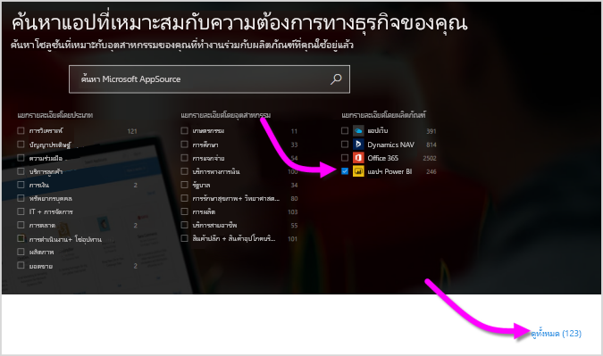

2. <span data-ttu-id="848da-117">บนหน้าไลบรารี [วิชวล Power BI](https://appsource.microsoft.com/marketplace/apps?product=power-bi-visuals&page=1) เลือก **วิชวล Power BI** จากรายการของ add-in ในบานหน้าต่างด้านซ้าย</span><span class="sxs-lookup"><span data-stu-id="848da-117">On the [Power BI visuals](https://appsource.microsoft.com/marketplace/apps?product=power-bi-visuals&page=1) library page, select **Power BI visuals** from the list of Add-ins in the left pane.</span></span>

   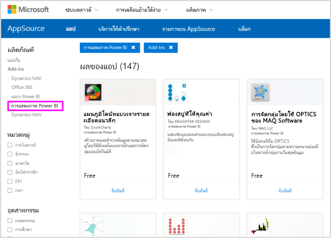

3. <span data-ttu-id="848da-119">เลือก **วิชวล** ที่คุณสนใจใช้จากแกลเลอรี และคุณจะถูกนำไปยังเพจที่อธิบายวิชวล</span><span class="sxs-lookup"><span data-stu-id="848da-119">Select the **visual** you're interested in using from the gallery, and you're taken to a page that describes the visual.</span></span> <span data-ttu-id="848da-120">เลือกปุ่ม **รับทันที** เพื่อดาวน์โหลด</span><span class="sxs-lookup"><span data-stu-id="848da-120">Select the **Get it now** button to download.</span></span>

   > [!NOTE]
    > <span data-ttu-id="848da-121">สำหรับการเขียนรายงานใน **Power BI Desktop** คุณจำเป็นต้องมี R ติดตั้งอยู่บนเครื่องคอมพิวเตอร์ของคุณ</span><span class="sxs-lookup"><span data-stu-id="848da-121">For authoring in **Power BI Desktop**, you need to have R installed on your local machine.</span></span> <span data-ttu-id="848da-122">แต่เมื่อผู้ใช้ต้องการดูวิชวลที่ทำงานด้วย R ใน **บริการของ Power BI** ไม่ต้องติดตั้ง R ภายในเครื่อง</span><span class="sxs-lookup"><span data-stu-id="848da-122">But, when users want to view an R-powered visual in the **Power BI service** they do not need R installed locally.</span></span>

   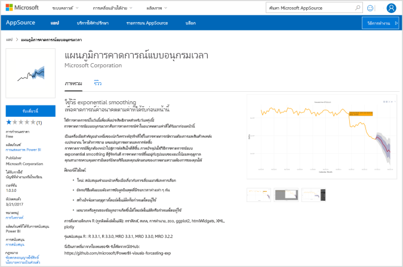

   <span data-ttu-id="848da-124">คุณไม่จำเป็นต้องติดตั้ง R เพื่อใช้ส่วนการแสดงผล Power BI จาก R ใน **บริการของ Power BI** แต่ถ้าคุณต้องการใช้ส่วนการแสดงผล Power BI จาก R ใน **Power BI Desktop** คุณ *ต้อง* ติดตั้ง R บนเครื่อง</span><span class="sxs-lookup"><span data-stu-id="848da-124">You do not need to install R to use R-powered Power BI visuals in the **Power BI service**, however, if you want to use R-powered Power BI visuals in **Power BI Desktop** you *must* install R on the local machine.</span></span> <span data-ttu-id="848da-125">คุณสามารถดาวน์โหลด R จากที่ต่อไปนี้:</span><span class="sxs-lookup"><span data-stu-id="848da-125">You can download R from the following locations:</span></span>

   * [<span data-ttu-id="848da-126">CRAN</span><span class="sxs-lookup"><span data-stu-id="848da-126">CRAN</span></span>](https://cran.r-project.org/)
   * [<span data-ttu-id="848da-127">MRO</span><span class="sxs-lookup"><span data-stu-id="848da-127">MRO</span></span>](https://mran.microsoft.com/)

4. <span data-ttu-id="848da-128">เมื่อวิชวลถูกดาวน์โหลดแล้ว (ซึ่งจะเหมือนกับการดาวน์โหลดไฟล์ใด ๆ จากเบราว์เซอร์ของคุณ) ไปที่ **Power BI Desktop** และคลิก **ตัวเลือกเพิ่มเติม** (...) ในบานหน้าต่าง **การแสดงภาพ** และเลือก **นำเข้าจากไฟล์**</span><span class="sxs-lookup"><span data-stu-id="848da-128">Once the visual is downloaded (which is like downloading any file from your browser), go to **Power BI Desktop** and click **More options** (...) in the **Visualizations** pane, and select **Import from file**.</span></span>

   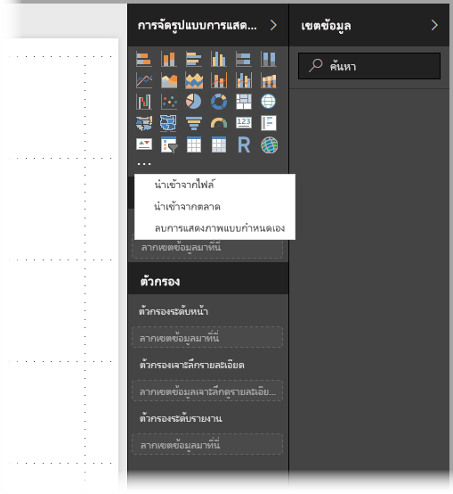
5. <span data-ttu-id="848da-130">คุณได้รับคำเตือนเกี่ยวกับการนำเข้าวิชวลที่กำหนดเองดังแสดงในรูปต่อไปนี้:</span><span class="sxs-lookup"><span data-stu-id="848da-130">You're warned about importing a custom visual, as shown in the following image:</span></span>

   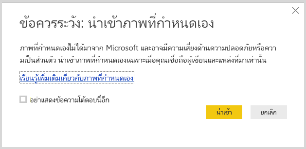
6. <span data-ttu-id="848da-132">ไปยังตำแหน่งที่บันทึกไฟล์วิชวล จากนั้นเลือกไฟล์</span><span class="sxs-lookup"><span data-stu-id="848da-132">Navigate to where the visual file was saved, then select the file.</span></span> <span data-ttu-id="848da-133">ไฟล์การแสดงภาพแบบกำหนดเองของ **Power BI Desktop** มีนามสกุล .pbiviz</span><span class="sxs-lookup"><span data-stu-id="848da-133">**Power BI Desktop** custom visualizations have the .pbiviz extension.</span></span>

   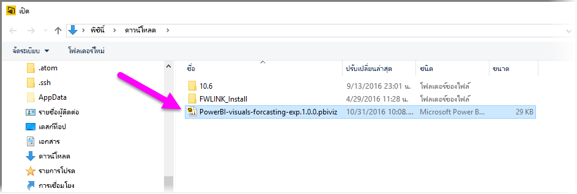
7. <span data-ttu-id="848da-135">เมื่อคุณกลับไปยัง Power BI Desktop คุณสามารถเห็นวิชวลชนิดใหม่ในบานหน้าต่าง **การจัดรูปแบบการแสดงข้อมูล** ได้</span><span class="sxs-lookup"><span data-stu-id="848da-135">When you return to Power BI Desktop, you can see the new visual type in the **Visualizations** pane.</span></span>

   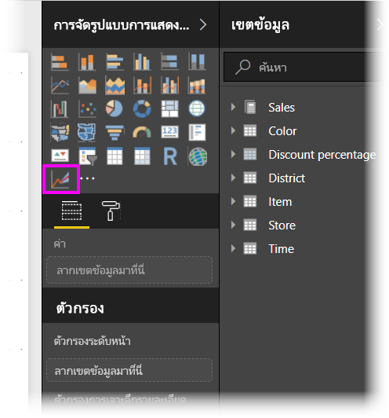
8. <span data-ttu-id="848da-137">เมื่อคุณนำเข้าวิชวลใหม่ (หรือเปิดรายงานที่มีวิชวลแบบกำหนดเองที่ทำงานบน R) **Power BI Desktop** จะติดตั้งแพคเกจ R ที่จำเป็น</span><span class="sxs-lookup"><span data-stu-id="848da-137">When you import the new visual (or open a report that contains an R-powered custom visual), **Power BI Desktop** installs the required R packages.</span></span>

   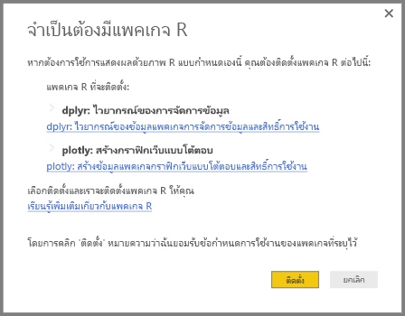

9. <span data-ttu-id="848da-139">จากนั้น คุณสามารถเพิ่มข้อมูลลงในวิชวลเหมือนกับที่คุณทำกับวิชวลอื่น ๆ ใน **Power BI Desktop** ได้</span><span class="sxs-lookup"><span data-stu-id="848da-139">From there, you can add data to the visual just as you would any other **Power BI Desktop** visual.</span></span> <span data-ttu-id="848da-140">เมื่อทำเสร็จ คุณสามารถดูวิชวลที่เสร็จแล้วของคุณบนพื้นที่ทำงาน</span><span class="sxs-lookup"><span data-stu-id="848da-140">When complete, you can see your finished visual on the canvas.</span></span> <span data-ttu-id="848da-141">ในวิชวลต่อไปนี้ ใช้วิชวล **การคาดการณ์** ที่ทำงานด้วย R กับการประมาณอัตราการเกิดของ สหประชาชาติ (UN) (วิชวลทางด้านซ้าย)</span><span class="sxs-lookup"><span data-stu-id="848da-141">In the following visual, the **Forecasting** R-powered visual was used with United Nations (UN) birth rate projections (the visual on the left).</span></span>

    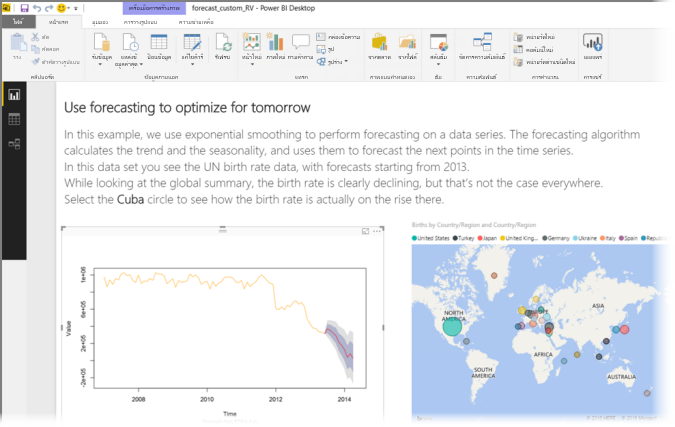

    <span data-ttu-id="848da-143">เหมือนกับวิชวลอื่น ๆ ใน **Power BI Desktop** คุณสามารถเผยแพร่รายงานนี้ ที่มีวิชวล R ไปยัง **บริการของ Power BI** และแชร์ให้กับผู้อื่นได้</span><span class="sxs-lookup"><span data-stu-id="848da-143">Like any other **Power BI Desktop** visual, you can publish this report with its R-powered visuals to the **Power BI service** and share it with others.</span></span>

    <span data-ttu-id="848da-144">ตรวจสอบไลบรารีบ่อย ๆ เพราะมีวิชวลใหม่ ๆ เพิ่มเข้ามาตลอดเวลา</span><span class="sxs-lookup"><span data-stu-id="848da-144">Check the library often, since new visuals are being added all the time.</span></span>

### <a name="get-power-bi-visuals-from-within-power-bi-desktop"></a><span data-ttu-id="848da-145">รับส่วนการแสดงผล Power BI จากใน **Power BI Desktop**</span><span class="sxs-lookup"><span data-stu-id="848da-145">Get Power BI visuals from within **Power BI Desktop**</span></span>

1. <span data-ttu-id="848da-146">นอกจากนี้คุณยังสามารถใช้ส่วนการแสดงผล Power BI จากใน **Power BI Desktop**</span><span class="sxs-lookup"><span data-stu-id="848da-146">You can also get Power BI visuals from within **Power BI Desktop**.</span></span> <span data-ttu-id="848da-147">ใน **Power BI Desktop** คลิกที่จุดไข่ปลา (...) ในบานหน้าต่าง **การจัดรูปแบบการแสดงข้อมูล** แล้วเลือก **นำเข้าจาก marketplace**</span><span class="sxs-lookup"><span data-stu-id="848da-147">In **Power BI Desktop** click the ellipsis (the ...) in the **Visualizations** pane, and select **Import from marketplace**.</span></span>

   

2. <span data-ttu-id="848da-149">เมื่อเลือกแล้ว กล่องโต้ตอบ **วิชวล BI Power** จะปรากฏขึ้น ให้คุณสามารถเลื่อนดูส่วนการแสดงผล Power BI ที่มีให้ใช้งาน และเลือกวิชวลที่คุณต้องการ</span><span class="sxs-lookup"><span data-stu-id="848da-149">When you do so, the **Power BI Visuals** dialog appears, where you can scroll through the available Power BI visuals and select what you would like.</span></span> <span data-ttu-id="848da-150">คุณสามารถค้นหาตามชื่อ เลือกประเภท หรือเพียงเลื่อนผ่านวิชวลที่มี</span><span class="sxs-lookup"><span data-stu-id="848da-150">You can search by name, select a category, or just scroll through the available visuals.</span></span> <span data-ttu-id="848da-151">เมื่อคุณพร้อมแล้ว เลือก **เพิ่ม** เพื่อเพิ่มวิชวลแบบกำหนดเองไปยัง **Power BI Desktop**</span><span class="sxs-lookup"><span data-stu-id="848da-151">When you're ready, just select **Add** to add the custom visual to **Power BI Desktop**.</span></span>

   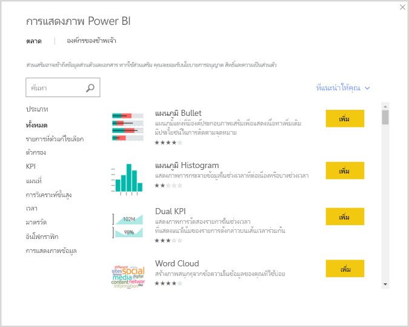

## <a name="contribute-r-powered-power-bi-visuals"></a><span data-ttu-id="848da-153">จัดส่วนการแสดงผล Power BI ผ่าน R</span><span class="sxs-lookup"><span data-stu-id="848da-153">Contribute R-powered Power BI visuals</span></span>

<span data-ttu-id="848da-154">ถ้าคุณสร้างวิชวล R ของคุณเองสำหรับการใช้ในรายงานของคุณ คุณสามารถแชร์วิชวลเหล่านั้นให้กับทุกคน โดยการแจกจ่ายวิชวลแบบกำหนดเองของคุณไปยัง **แกลเลอรีส่วนการแสดงผล Power BI**</span><span class="sxs-lookup"><span data-stu-id="848da-154">If you create your own R visuals for use in your reports, you can share those visuals with the world by contributing your custom visual to the **Power BI visuals gallery**.</span></span> <span data-ttu-id="848da-155">การบริจาคทำผ่าน GitHub และขั้นตอนมีการระบุเค้าโครงที่ตำแหน่งต่อไปนี้:</span><span class="sxs-lookup"><span data-stu-id="848da-155">Contributions are made through GitHub, and the process is outlined in the following location:</span></span>

* [<span data-ttu-id="848da-156">บริจาคให้แกลเลอส่วนการแสดงผล Power BI ผ่าน R</span><span class="sxs-lookup"><span data-stu-id="848da-156">Contributing to the R-powered Power BI visuals gallery</span></span>](https://github.com/PowerBi-Projects/PowerBI-visuals#building-r-powered-custom-visual-corrplot)

## <a name="troubleshoot-r-powered-power-bi-visuals"></a><span data-ttu-id="848da-157">แก้ไขปัญหาส่วนการจัดแสดง Power BI ผ่าน R</span><span class="sxs-lookup"><span data-stu-id="848da-157">Troubleshoot R-powered Power BI visuals</span></span>

<span data-ttu-id="848da-158">ส่วนการจัดแสดง Power BI จาก R ที่ทำงานด้วย R มีการพึ่งพาบางโปรแกรม เพื่อให้วิชวลทำงานได้อย่างถูกต้อง</span><span class="sxs-lookup"><span data-stu-id="848da-158">R-powered Power BI visuals have certain dependencies that must be met for the visuals to work properly.</span></span> <span data-ttu-id="848da-159">เมื่อส่วนการจัดแสดง Power BI จาก R ไม่ทำงาน หรือโหลดไม่ถูกต้อง มักเกิดจากปัญหาใดปัญหาหนึ่งต่อไปนี้:</span><span class="sxs-lookup"><span data-stu-id="848da-159">When R-powered Power BI visuals don't run or load properly, the problem is usually one of the following:</span></span>

* <span data-ttu-id="848da-160">โปรแกรม R ขาดหายไป</span><span class="sxs-lookup"><span data-stu-id="848da-160">The R engine is missing</span></span>
* <span data-ttu-id="848da-161">ข้อผิดพลาดในสคริปต์ R ที่วิชวลใช้</span><span class="sxs-lookup"><span data-stu-id="848da-161">Errors in the R script on which the visual is based</span></span>
* <span data-ttu-id="848da-162">แพคเกจ R จะสูญหาย หรือล้าสมัย</span><span class="sxs-lookup"><span data-stu-id="848da-162">R packages are missing or out of date</span></span>

<span data-ttu-id="848da-163">ส่วนต่อไปนี้อธิบายขั้นตอนการแก้ไขปัญหา ที่คุณสามารถใช้เพื่อช่วยแก้ปัญหาที่คุณอาจพบ</span><span class="sxs-lookup"><span data-stu-id="848da-163">The following section describes troubleshooting steps you can take to help address trouble you might run into.</span></span>

### <a name="missing-or-outdated-r-packages"></a><span data-ttu-id="848da-164">แพคเกจ R หายไป หรือล้าสมัย</span><span class="sxs-lookup"><span data-stu-id="848da-164">Missing or outdated R packages</span></span>

<span data-ttu-id="848da-165">เมื่อพยายามติดตั้งวิชวลแบบกำหนดเองที่ทำงานบน R คุณอาจเจอข้อผิดพลาดเมื่อแพคเกจ R มีการสูญหาย หรือล้าสมัย ซึ่งมักเกิดจากหนึ่งในเหตุผลต่อไปนี้:</span><span class="sxs-lookup"><span data-stu-id="848da-165">When attempting to install an R-powered custom visual, you can run into errors when there are missing or outdated R packages; this is due to one of the following reasons:</span></span>

* <span data-ttu-id="848da-166">การติดตั้ง R ไม่เข้ากันกับแพคเกจ R</span><span class="sxs-lookup"><span data-stu-id="848da-166">The R installation is incompatible with the R package</span></span>
* <span data-ttu-id="848da-167">ไฟร์วอลล์, ซอฟต์แวร์ป้องกันไวรัส หรือการตั้งค่าพร็อกซี ป้องกันไม่ให้ R เชื่อมต่อกับอินเทอร์เน็ต</span><span class="sxs-lookup"><span data-stu-id="848da-167">The firewall, anti-virus software, or proxy settings are preventing R from connecting to the Internet</span></span>
* <span data-ttu-id="848da-168">การเชื่อมต่ออินเทอร์เน็ตช้า หรือมีปัญหาการเชื่อมต่ออินเทอร์เน็ต</span><span class="sxs-lookup"><span data-stu-id="848da-168">The Internet connection is slow or there's an Internet connection problem</span></span>

<span data-ttu-id="848da-169">ทีม Power BI กำลังทำงานเพื่อลดปัญหาเหล่านี้ก่อนที่จะไปถึงคุณ และรุ่นถัดไปของ Power BI Desktop จะรวมการปรับปรุงเพื่อแก้ปัญหาเหล่านี้</span><span class="sxs-lookup"><span data-stu-id="848da-169">The Power BI team is actively working on mitigating these issues before they reach you and the next Power BI Desktop will incorporate updates to address these problems.</span></span> <span data-ttu-id="848da-170">จนกว่าจะถึงตอนนั้น คุณสามารถใช้หนึ่งหรือหลายขั้นตอนต่อไปนี้ เพื่อแก้ไขปัญหา:</span><span class="sxs-lookup"><span data-stu-id="848da-170">Until then, you can take one or more of the following steps to mitigate the issues:</span></span>

1. <span data-ttu-id="848da-171">ลบวิชวลแบบกำหนดเอง แล้วติดตั้งอีกครั้ง</span><span class="sxs-lookup"><span data-stu-id="848da-171">Remove the custom visual, then install it again.</span></span> <span data-ttu-id="848da-172">ซึ่งจะเริ่มต้นการติดตั้งแพคเกจ R ใหม่</span><span class="sxs-lookup"><span data-stu-id="848da-172">This initiates a reinstallation of the R packages.</span></span>
2. <span data-ttu-id="848da-173">ถ้าการติดตั้ง R ของคุณไม่เป็นปัจจุบัน อัปเกรดการติดตั้ง R ของคุณ จากนั้นเอาออกและติดตั้งวิชวลแบบกำหนดเองใหม่ ตามที่อธิบายไว้ในขั้นตอนก่อนหน้า</span><span class="sxs-lookup"><span data-stu-id="848da-173">If your installation of R is not current, upgrade your R installation, then remove and reinstall the custom visual as described in the previous step.</span></span>

   <span data-ttu-id="848da-174">เวอร์ชัน R ที่ได้รับการสนับสนุน จะแสดงอยู่ในคำอธิบายของแต่ละวิชวล R แบบกำหนดเอง ดังแสดงในรูปต่อไปนี้</span><span class="sxs-lookup"><span data-stu-id="848da-174">Supported R versions are listed in the description of each R-powered custom visual, as shown in the following image.</span></span>

     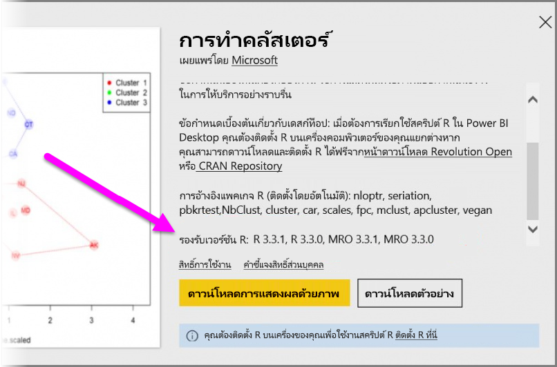
    > [!NOTE]
    > <span data-ttu-id="848da-176">คุณสามารถเก็บการติดตั้ง R เดิม และเชื่อมโยง Power BI Desktop เข้ากับเวอร์ชันปัจจุบันที่คุณติดตั้งได้</span><span class="sxs-lookup"><span data-stu-id="848da-176">You can keep the original R installation and only associate Power BI Desktop with the current version you install.</span></span> <span data-ttu-id="848da-177">ไปยัง **ไฟล์ > ตัวเลือกและการตั้งค่า > ตัวเลือก > การเขียนสคริปต์ R**</span><span class="sxs-lookup"><span data-stu-id="848da-177">Go to **File > Options and settings > Options > R scripting**.</span></span>

3. <span data-ttu-id="848da-178">ติดตั้งแพคเกจ R ด้วยตนเอง โดยใช้คอนโซล R ใด ๆ</span><span class="sxs-lookup"><span data-stu-id="848da-178">Install R packages manually, using any R console.</span></span> <span data-ttu-id="848da-179">มีขั้นตอนดังนี้:</span><span class="sxs-lookup"><span data-stu-id="848da-179">The steps for this approach follow:</span></span>

   <span data-ttu-id="848da-180">a.</span><span class="sxs-lookup"><span data-stu-id="848da-180">a.</span></span> <span data-ttu-id="848da-181">ดาวน์โหลดสคริปต์การติดตั้งวิชวล R และบันทึกไฟล์ดังกล่าวลงในไดรฟ์ภายในเครื่อง</span><span class="sxs-lookup"><span data-stu-id="848da-181">Download the R-powered visual installation script and save that file to a local drive.</span></span>

   <span data-ttu-id="848da-182">b.</span><span class="sxs-lookup"><span data-stu-id="848da-182">b.</span></span> <span data-ttu-id="848da-183">จากคอนโซล R เรียกใช้คำสั่งต่อไปนี้:</span><span class="sxs-lookup"><span data-stu-id="848da-183">From the R console, run the following:</span></span>

      ```console
      source("C:/Users/david/Downloads/ScriptInstallPackagesForForecastWithWorkarounds.R")
      ```

   <span data-ttu-id="848da-184">ตำแหน่งที่ติดตั้งตามค่าเริ่มต้น โดยทั่วไปมีดังนี้:</span><span class="sxs-lookup"><span data-stu-id="848da-184">Typical default installation locations are the following:</span></span>

   ```console
       c:\Program Files\R\R-3.3.x\bin\x64\Rterm.exe (for CRAN-R)
       c:\Program Files\R\R-3.3.x\bin\x64\Rgui.exe (for CRAN-R)
       c:\Program Files\R\R-3.3.x\bin\R.exe (for CRAN-R)
       c:\Program Files\Microsoft\MRO-3.3.x\bin\R.exe (for MRO)
       c:\Program Files\Microsoft\MRO-3.3.x\bin\x64\Rgui.exe (for MRO)
       c:\Program Files\RStudio\bin\rstudio.exe (for RStudio)
   ```

4. <span data-ttu-id="848da-185">ถ้าขั้นตอนก่อนหน้านี้ไม่ได้ผล ลองต่อไปนี้:</span><span class="sxs-lookup"><span data-stu-id="848da-185">If the previous steps don't work, try the following:</span></span>

   <span data-ttu-id="848da-186">a.</span><span class="sxs-lookup"><span data-stu-id="848da-186">a.</span></span> <span data-ttu-id="848da-187">ใช้ **R Studio** และทำตามขั้นตอนที่ระบุไว้ในข้อ 3.b</span><span class="sxs-lookup"><span data-stu-id="848da-187">Use **R Studio** and follow the step outlined in 3.b.</span></span> <span data-ttu-id="848da-188">ด้านบน (เรียกใช้บรรทัดสคริปต์จากคอนโซล R)</span><span class="sxs-lookup"><span data-stu-id="848da-188">above (run the script line from the R console).</span></span>

   <span data-ttu-id="848da-189">b.</span><span class="sxs-lookup"><span data-stu-id="848da-189">b.</span></span> <span data-ttu-id="848da-190">ถ้าขั้นตอนก่อนหน้าไม่ได้ผล เปลี่ยน **เครื่องมือ > ตัวเลือกส่วนกลาง > แพคเกจ** ใน **R Studio** และเปิดใช้งานกล่องกาเครื่องหมายสำหรับ **ใช้ Internet Explorer ไลบรารี/พร็อกซีสำหรับ HTTP** แล้วทำซ้ำขั้นตอนที่ 3.b</span><span class="sxs-lookup"><span data-stu-id="848da-190">If the previous step doesn't work, change **Tools > Global Options > Packages** in **R Studio**, and enable the checkbox for **Use Internet Explorer library/proxy for HTTP**, then repeat step 3.b.</span></span> <span data-ttu-id="848da-191">จากขั้นตอนข้างต้น</span><span class="sxs-lookup"><span data-stu-id="848da-191">from the above steps.</span></span>

## <a name="next-steps"></a><span data-ttu-id="848da-192">ขั้นตอนถัดไป</span><span class="sxs-lookup"><span data-stu-id="848da-192">Next steps</span></span>

<span data-ttu-id="848da-193">ดูข้อมูลเพิ่มเติมเกี่ยวกับ R ใน Power BI ได้ในบทความต่อไปนี้</span><span class="sxs-lookup"><span data-stu-id="848da-193">Take a look at the following additional information about R in Power BI.</span></span>

* [<span data-ttu-id="848da-194">แกลเลอรีวิชวล Power BI</span><span class="sxs-lookup"><span data-stu-id="848da-194">Power BI visuals gallery</span></span>](https://app.powerbi.com/visuals/)
* [<span data-ttu-id="848da-195">การเรียกใช้สคริปต์ R ใน Power BI Desktop</span><span class="sxs-lookup"><span data-stu-id="848da-195">Running R Scripts in Power BI Desktop</span></span>](../connect-data/desktop-r-scripts.md)
* [<span data-ttu-id="848da-196">สร้างวิชวล R ใน Power BI Desktop</span><span class="sxs-lookup"><span data-stu-id="848da-196">Create R visuals in Power BI Desktop</span></span>](desktop-r-visuals.md)
* [<span data-ttu-id="848da-197">ใช้ R IDE ภายนอกกับ Power BI</span><span class="sxs-lookup"><span data-stu-id="848da-197">Use an external R IDE with Power BI</span></span>](../connect-data/desktop-r-ide.md)
