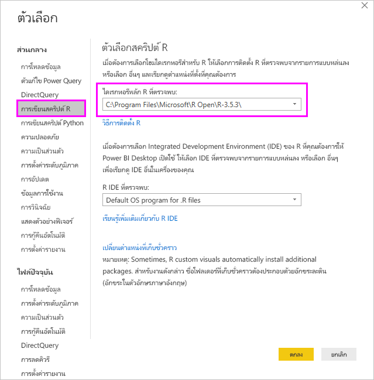
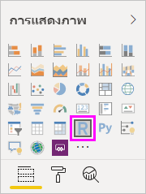
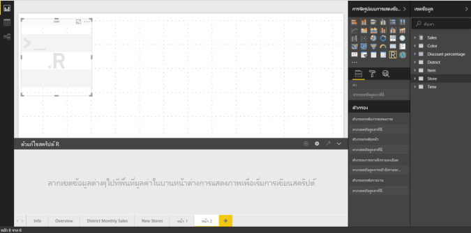
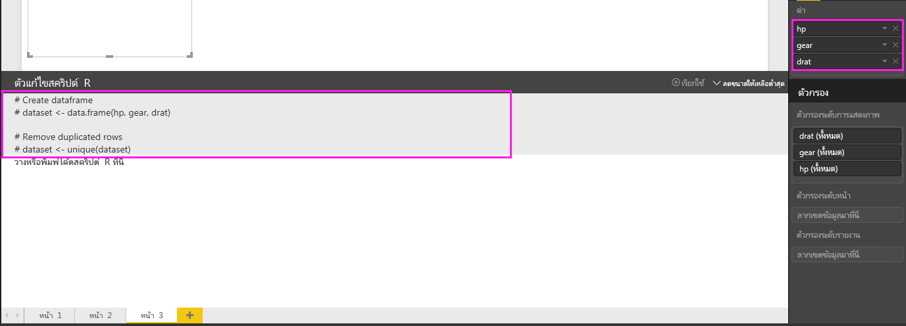
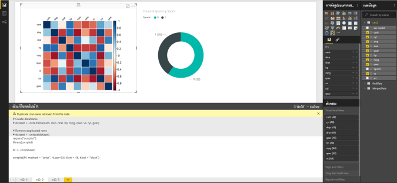
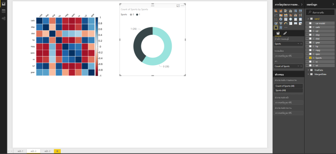
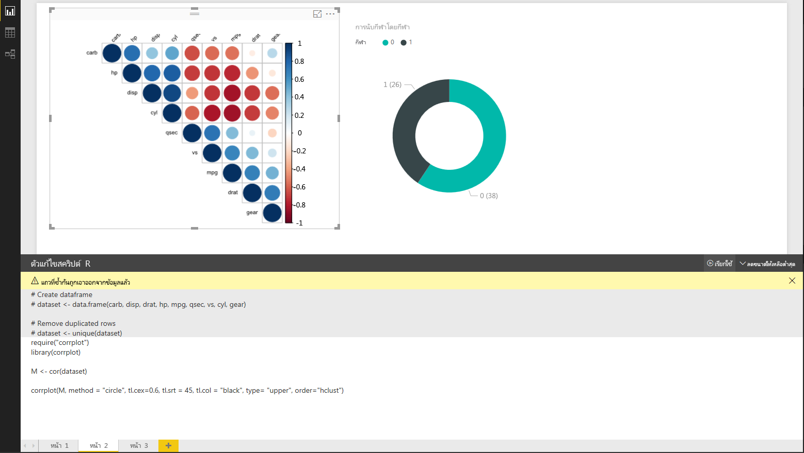
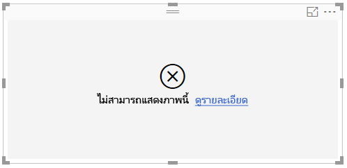

# <a name="create-power-bi-visuals-using-r"></a><span data-ttu-id="197bb-103">สร้างภาพของ Power BI โดยใช้ R</span><span class="sxs-lookup"><span data-stu-id="197bb-103">Create Power BI visuals using R</span></span>
<span data-ttu-id="197bb-104">ด้วย Power BI Desktop คุณสามารถใช้กลไก *R* เพื่อแสดงภาพข้อมูลของคุณได้</span><span class="sxs-lookup"><span data-stu-id="197bb-104">With Power BI Desktop, you can use *R* to visualize your data.</span></span> <span data-ttu-id="197bb-105">[R](https://mran.revolutionanalytics.com/documents/what-is-r) คือภาษาและสภาพแวดล้อมสำหรับการประมวลผลเชิงสถิติและกราฟิก</span><span class="sxs-lookup"><span data-stu-id="197bb-105">[R](https://mran.revolutionanalytics.com/documents/what-is-r) is a language and environment for statistical computing and graphics.</span></span>

## <a name="install-r"></a><span data-ttu-id="197bb-106">ติดตั้ง R</span><span class="sxs-lookup"><span data-stu-id="197bb-106">Install R</span></span>
<span data-ttu-id="197bb-107">ตามค่าเริ่มต้น Power BI Desktop ไม่มีการปรับใช้หรือติดตั้งกลไกจัดการ R</span><span class="sxs-lookup"><span data-stu-id="197bb-107">By default, Power BI Desktop doesn't include, deploy, or install the R engine.</span></span> <span data-ttu-id="197bb-108">เมื่อต้องการเรียกใช้สคริปต์ R ใน Power BI Desktop คุณต้องติดตั้ง R บนเครื่องคอมพิวเตอร์ของคุณแยกต่างหาก</span><span class="sxs-lookup"><span data-stu-id="197bb-108">To run R scripts in Power BI Desktop, you must separately install R on your local computer.</span></span> <span data-ttu-id="197bb-109">คุณสามารถดาวน์โหลดและติดตั้ง R ได้ฟรีจากตำแหน่งที่ตั้งต่าง ๆ ซึ่งรวมถึง [หน้าดาวน์โหลด Revolution Open](https://mran.revolutionanalytics.com/download/) และ [CRAN Repository](https://cran.r-project.org/bin/windows/base/)</span><span class="sxs-lookup"><span data-stu-id="197bb-109">You can download and install R for free from many locations, including the [Revolution Open download page](https://mran.revolutionanalytics.com/download/), and the [CRAN Repository](https://cran.r-project.org/bin/windows/base/).</span></span> <span data-ttu-id="197bb-110">รุ่นปัจจุบันของการเขียนสคริปต์ R ใน Power BI Desktop สนับสนุนตัวอักษร Unicode ตลอดจนช่องว่าง (ตัวอักษรว่างเปล่า) ในเส้นทางการติดตั้ง</span><span class="sxs-lookup"><span data-stu-id="197bb-110">The current release of R scripting in Power BI Desktop supports Unicode characters as well as spaces (empty characters) in the installation path.</span></span>

## <a name="enable-r-visuals-in-power-bi-desktop"></a><span data-ttu-id="197bb-111">เปิดใช้งานวิชวล R ใน Power BI Desktop</span><span class="sxs-lookup"><span data-stu-id="197bb-111">Enable R visuals in Power BI Desktop</span></span>
<span data-ttu-id="197bb-112">หลังจากที่คุณติดตั้ง R แล้ว Power BI Desktop จะเปิดใช้งานโดยอัตโนมัติ</span><span class="sxs-lookup"><span data-stu-id="197bb-112">After you've installed R, Power BI Desktop enables it automatically.</span></span> <span data-ttu-id="197bb-113">เมื่อต้องการตรวจสอบว่า Power BI Desktop ได้เปิดใช้งาน R ในตำแหน่งที่ตั้งที่ถูกต้องหรือไม่ ให้ทำตามขั้นตอนเหล่านี้:</span><span class="sxs-lookup"><span data-stu-id="197bb-113">To verify that Power BI Desktop has enabled R in the correct location, follow these steps:</span></span> 

1. <span data-ttu-id="197bb-114">จากเมนู Power BI Desktop ให้เลือก **ไฟล์** > **ตัวเลือกและการตั้งค่า** > **ตัวเลือก**</span><span class="sxs-lookup"><span data-stu-id="197bb-114">From the Power BI Desktop menu, select **File** > **Options and settings** > **Options**.</span></span> 

2. <span data-ttu-id="197bb-115">ทางด้านซ้ายของหน้า **ตัวเลือก** ภายใต้ **ส่วนกลาง** ให้เลือก **การเขียนสคริปต์ R**</span><span class="sxs-lookup"><span data-stu-id="197bb-115">On the left side of the **Options** page, under **Global**, select **R scripting**.</span></span> 

3. <span data-ttu-id="197bb-116">ภายใต้ **ตัวเลือกสคริปต์ R** ให้ตรวจสอบว่ามีการระบุการติดตั้ง R ภายในเครื่องของคุณใน **โฮมไดเรกทอรี R ที่ตรวจพบ** และสะท้อนให้เห็นถึงการติดตั้ง R ที่เหมาะสมภายในเครื่องที่คุณต้องการให้ Power BI Desktop ใช้</span><span class="sxs-lookup"><span data-stu-id="197bb-116">Under **R script options**, verify that your local R installation is specified in **Detected R home directories** and that it properly reflects the local R installation you want Power BI Desktop to use.</span></span> <span data-ttu-id="197bb-117">ในรูปต่อไปนี้ เส้นทางไปยังการติดตั้ง R ภายในเครื่องคือ **C:\Program Files\R Open\R-3.5.3\\**</span><span class="sxs-lookup"><span data-stu-id="197bb-117">In the following image, the path to the local installation of R is **C:\Program Files\R Open\R-3.5.3\\**.</span></span>
   
   

<span data-ttu-id="197bb-119">หลังจากที่คุณได้ตรวจสอบการติดตั้ง R แล้ว คุณก็พร้อมที่จะเริ่มสร้างวิชวล R</span><span class="sxs-lookup"><span data-stu-id="197bb-119">After you've verified your R installation, you’re ready to begin creating R visuals.</span></span>

## <a name="create-r-visuals-in-power-bi-desktop"></a><span data-ttu-id="197bb-120">สร้างวิชวล R ใน Power BI Desktop</span><span class="sxs-lookup"><span data-stu-id="197bb-120">Create R visuals in Power BI Desktop</span></span>
1. <span data-ttu-id="197bb-121">เลือกไอคอน **วิชวล R** ในบานหน้าต่าง **การแสดงภาพ** เพื่อเพิ่มวิชวล R</span><span class="sxs-lookup"><span data-stu-id="197bb-121">Select the **R Visual** icon in the **Visualization** pane to add an R visual.</span></span>
   
   

2. <span data-ttu-id="197bb-123">ในหน้าต่าง **เปิดใช้งานวิชวลสคริปต์** ที่ปรากฏขึ้น เลือก **เปิดใช้งาน**</span><span class="sxs-lookup"><span data-stu-id="197bb-123">In the **Enable script visuals** window that appears, select **Enable**.</span></span>

   

   <span data-ttu-id="197bb-125">เมื่อคุณเพิ่มวิชวล R ไปยังรายงาน Power BI Desktop จะมีการเปลี่ยนแปลงดังต่อไปนี้:</span><span class="sxs-lookup"><span data-stu-id="197bb-125">When you add an R visual to a report, Power BI Desktop makes the following changes:</span></span>
   
   - <span data-ttu-id="197bb-126">รูปวิชวล R ของพื้นที่ที่สำรองไว้ปรากฏบนพื้นที่รายงาน</span><span class="sxs-lookup"><span data-stu-id="197bb-126">A placeholder R visual image appears on the report canvas.</span></span>
   
   - <span data-ttu-id="197bb-127">**ตัวแก้ไขสคริปต์ R** ปรากฏขึ้นทางด้านล่างของบานหน้าต่างกลาง</span><span class="sxs-lookup"><span data-stu-id="197bb-127">The **R script editor** appears along the bottom of the center pane.</span></span>
   
   

3. <span data-ttu-id="197bb-129">ในส่วน **ค่า** ของบานหน้าต่าง **การแสดงภาพ** ให้ลากเขตข้อมูลจากบานหน้าต่าง **เขตข้อมูล** ที่คุณต้องการใช้ในสคริปต์ R ของคุณ เช่นเดียวกับที่คุณทำกับวิชวล Power BI Desktop อื่นๆ</span><span class="sxs-lookup"><span data-stu-id="197bb-129">In the **Values** section of the **Visualization** pane, drag fields from the **Fields** pane that you want to consume in your R script, just as you would with any other Power BI Desktop visual.</span></span> <span data-ttu-id="197bb-130">อีกวิธีหนึ่งคือคุณยังสามารถเลือกเขตข้อมูลได้โดยตรงในบานหน้าต่าง **เขตข้อมูล**</span><span class="sxs-lookup"><span data-stu-id="197bb-130">Alternatively, you can also select the fields directly in the **Fields** pane.</span></span>
    
    <span data-ttu-id="197bb-131">เฉพาะเขตข้อมูลที่คุณเพิ่มลงในส่วน **ค่า** เท่านั้นที่พร้อมใช้งานสำหรับสคริปต์ R ของคุณ</span><span class="sxs-lookup"><span data-stu-id="197bb-131">Only fields that you've added to the **Values** section are available to your R script.</span></span> <span data-ttu-id="197bb-132">คุณสามารถเพิ่มเขตข้อมูลใหม่ หรือเอาเขตข้อมูลที่ไม่ต้องการออกจากส่วน **เขตข้อมูล** ขณะที่ทำงานบนสคริปต์ R ของคุณใน **ตัวแก้ไขสคริปต์ R**</span><span class="sxs-lookup"><span data-stu-id="197bb-132">You can add new fields or remove unneeded fields from the **Values** section while working on your R script in the **R script editor**.</span></span> <span data-ttu-id="197bb-133">Power BI Desktop จะตรวจจับเขตข้อมูลที่คุณได้เพิ่มหรือเอาออกโดยอัตโนมัติ</span><span class="sxs-lookup"><span data-stu-id="197bb-133">Power BI Desktop automatically detects which fields you've added or removed.</span></span>
   
   > [!NOTE]
   > <span data-ttu-id="197bb-134">ชนิดการรวมเริ่มต้นสำหรับวิชวล R คือ *ไม่ต้องทำการสรุป*</span><span class="sxs-lookup"><span data-stu-id="197bb-134">The default aggregation type for R visuals is *do not summarize*.</span></span>
   > 
   > 
   
4. <span data-ttu-id="197bb-135">ขณะนี้คุณสามารถใช้ข้อมูลที่คุณเลือกเพื่อสร้างการลงจุด:</span><span class="sxs-lookup"><span data-stu-id="197bb-135">Now you can use the data you selected to create a plot:</span></span> 

    - <span data-ttu-id="197bb-136">เมื่อคุณเลือกเขตข้อมูล **ตัวแก้ไขสคริปต์ R** จะสร้างโค้ดการผูกสคริปต์ R สนับสนุนสำหรับเขตข้อมูลเหล่านั้นในส่วนสีเทาตามแนวด้านบนของบานหน้าต่างตัวแก้ไข</span><span class="sxs-lookup"><span data-stu-id="197bb-136">As you select fields, the **R script editor** generates supporting R script binding code for those fields in the gray section along the top of the editor pane.</span></span>
    - <span data-ttu-id="197bb-137">ถ้าคุณลบเขตข้อมูล **ตัวแก้ไขสคริปต์ R** จะลบรหัสการสนับสนุนสำหรับเขตข้อมูลนั้นโดยอัตโนมัติ</span><span class="sxs-lookup"><span data-stu-id="197bb-137">If you remove a field, the **R script editor** automatically removes the supporting code for that field.</span></span>
   
   <span data-ttu-id="197bb-138">ในตัวอย่างที่แสดงในรูปต่อไปนี้ มีการเลือกเขตข้อมูลสามเขตได้แก่: hp gear และ drat</span><span class="sxs-lookup"><span data-stu-id="197bb-138">In the example shown in the following image, three fields are selected: hp, gear, and drat.</span></span> <span data-ttu-id="197bb-139">จากการเลือกดังกล่าว ตัวแก้ไขสคริปต์ R จะสร้างโค้ดการผูก ซึ่งสรุปได้ดังนี้:</span><span class="sxs-lookup"><span data-stu-id="197bb-139">As a result of those selections, the R script editor generates binding code, which is summarized as follows:</span></span>
   
   * <span data-ttu-id="197bb-140">สร้าง dataframe ที่เรียกว่า **ชุดข้อมูล** ซึ่งประกอบด้วยเขตข้อมูลอื่นที่ผู้ใช้เลือก</span><span class="sxs-lookup"><span data-stu-id="197bb-140">Create a dataframe called **dataset**, which is comprised of the different fields selected by the user.</span></span>
   * <span data-ttu-id="197bb-141">การรวมเริ่มต้นคือ *ไม่สรุป*</span><span class="sxs-lookup"><span data-stu-id="197bb-141">The default aggregation is: *do not summarize*.</span></span>
   * <span data-ttu-id="197bb-142">คล้ายกับวิชวลตาราง เขตข้อมูลจะถูกจัดกลุ่ม และทำซ้ำแถวที่ปรากฏเพียงครั้งเดียว</span><span class="sxs-lookup"><span data-stu-id="197bb-142">Similar to table visuals, fields are grouped and duplicate rows appear only once.</span></span>
   
   
   
   > [!TIP]
   > <span data-ttu-id="197bb-144">ในบางกรณี คุณอาจไม่ต้องการให้จัดกลุ่มโดยอัตโนมัติ หรือคุณอาจต้องการให้แถวทั้งหมดปรากฏ รวมถึงรายการที่ซ้ำกัน</span><span class="sxs-lookup"><span data-stu-id="197bb-144">In certain cases, you may not want automatic grouping to occur, or you may want all rows to appear, including duplicates.</span></span> <span data-ttu-id="197bb-145">ในกรณีดังกล่าว ให้เพิ่มเขตข้อมูลดัชนีลงในชุดข้อมูลของคุณ ซึ่งทำให้ทุกแถวถือว่าไม่ซ้ำกันและป้องกันการจัดกลุ่ม</span><span class="sxs-lookup"><span data-stu-id="197bb-145">In that case, add an index field to your dataset, which causes all rows to be considered unique and prevents grouping.</span></span>
   > 
   > 
   
   <span data-ttu-id="197bb-146">Dataframe ที่สร้างขึ้นเรียกว่า **ชุดข้อมูล** และคุณสามารถเข้าถึงเลือกคอลัมน์ที่เลือกไว้จากชื่อที่เกี่ยวข้อง</span><span class="sxs-lookup"><span data-stu-id="197bb-146">The generated dataframe is named **dataset**, and you access selected columns by their respective names.</span></span> <span data-ttu-id="197bb-147">ตัวอย่างเช่น เขตข้อมูล gear สามารถเข้าถึงได้โดยการเพิ่ม *dataset$gear* ในสคริปต์ R ของคุณ</span><span class="sxs-lookup"><span data-stu-id="197bb-147">For example, access the gear field by adding *dataset$gear* to your R script.</span></span> <span data-ttu-id="197bb-148">สำหรับเขตข้อมูลที่มีช่องว่างหรืออักขระพิเศษ ให้ใช้เครื่องหมายอัญประกาศเดี่ยว</span><span class="sxs-lookup"><span data-stu-id="197bb-148">For fields with spaces or special characters, use single quotes.</span></span>

5. <span data-ttu-id="197bb-149">ด้วย Dataframe ที่สร้างขึ้นอัตโนมัติโดยเขตข้อมูลที่คุณเลือก คุณก็พร้อมที่จะเขียนสคริปต์ R ที่ Power BI Desktop จะลงจุดไปยังอุปกรณ์เริ่มต้นของ R</span><span class="sxs-lookup"><span data-stu-id="197bb-149">With the dataframe automatically generated by the fields you selected, you’re ready to write an R script, which Power BI Desktop plots to the R default device.</span></span> <span data-ttu-id="197bb-150">หลังจากที่คุณดำเนินการสคริปต์เสร็จสมบูรณ์แล้ว ให้เลือก **เรียกใช้สคริปต์** ทางด้านขวาของแถบชื่อของ **ตัวแก้ไขสคริปต์ R**</span><span class="sxs-lookup"><span data-stu-id="197bb-150">After you've completed the script, select **Run script** on the right side of the **R script editor** title bar.</span></span>
   
    <span data-ttu-id="197bb-151">เมื่อคุณเลือก **เรียกใช้สคริปต์** Power BI Desktop จะแยกแยะการลงจุดนี้และแสดงบนพื้นที่ทำงาน</span><span class="sxs-lookup"><span data-stu-id="197bb-151">When you select **Run script**, Power BI Desktop identifies the plot and presents it on the canvas.</span></span> <span data-ttu-id="197bb-152">เนื่องจากกระบวนการจะทำบนการติดตั้ง R ภายในเครื่องของคุณ ตรวจสอบให้แน่ใจว่ามีการติดตั้งแพคเกจที่จำเป็นแล้ว</span><span class="sxs-lookup"><span data-stu-id="197bb-152">Because the process is executed on your local R installation, make sure the required R packages are installed.</span></span>
   
   <span data-ttu-id="197bb-153">Power BI Desktop จะลงจุดวิชวลซ้ำอีกครั้งเมื่อเหตุการณ์ใด ๆ ต่อไปนี้เกิดขึ้น:</span><span class="sxs-lookup"><span data-stu-id="197bb-153">Power BI Desktop replots the visual when any of the following events occur:</span></span>
   
   * <span data-ttu-id="197bb-154">เมื่อคุณเลือก **เรียกใช้สคริปต์** จากแถบชื่อเรื่อง **ตัวแก้ไขสคริปต์ R**</span><span class="sxs-lookup"><span data-stu-id="197bb-154">You select **Run script** from the **R script editor** title bar.</span></span>
   * <span data-ttu-id="197bb-155">เมื่อใดก็ตามที่เกิดการเปลี่ยนแปลงข้อมูล เนื่องจากการรีเฟรชข้อมูล การกรอง หรือการไฮไลท์</span><span class="sxs-lookup"><span data-stu-id="197bb-155">A data change occurs because of data refreshing, filtering, or highlighting.</span></span>

     <span data-ttu-id="197bb-156">รูปต่อไปนี้แสดงตัวอย่างโค้ดการลงจุดสหสัมพันธ์ ซึ่งลงจุดสหสัมพันธ์ระหว่างแอตทริบิวต์ของรถยนต์ชนิดต่าง ๆ</span><span class="sxs-lookup"><span data-stu-id="197bb-156">The following image shows an example of the correlation plot code, which plots the correlations between attributes of different types of cars.</span></span>

     

6. <span data-ttu-id="197bb-158">เพื่อให้ได้มุมมองของการแสดงภาพที่มีขนาดใหญ่ขึ้น คุณสามารถย่อ **ตัวแก้ไขสคริปต์ R** ได้</span><span class="sxs-lookup"><span data-stu-id="197bb-158">To get a larger view of the visualizations, minimize the **R script editor**.</span></span> <span data-ttu-id="197bb-159">เช่นเดียวกับวิชวลอื่น ๆ ใน Power BI Desktopคุณสามารถกรองข้ามการลงจุดสหสัมพันธ์ โดยเลือกส่วนที่เฉพาะเจาะจง (เช่น รถสปอร์ต) ในวิชวลรูปโดนัท (วิชวลกลมทางด้านขวา)</span><span class="sxs-lookup"><span data-stu-id="197bb-159">Like other visuals in Power BI Desktop, you can cross filter the correlation plot by selecting a specific section (such as sports cars) in the donut-shaped visual (the round visual on the right).</span></span>

    

7. <span data-ttu-id="197bb-161">ปรับเปลี่ยนสคริปต์ R เพื่อกำหนดวิชวลด้วยตนเอง และใช้ประโยชน์จากพลังของ R โดยการเพิ่มพารามิเตอร์ไปยังคำสั่งการลงจุด</span><span class="sxs-lookup"><span data-stu-id="197bb-161">Modify the R script to customize the visual, and take advantage of the power of R by adding parameters to the plotting command.</span></span>

    <span data-ttu-id="197bb-162">คำสั่งการลงจุดเดิมมีดังต่อไปนี้:</span><span class="sxs-lookup"><span data-stu-id="197bb-162">The original plotting command is:</span></span>

    ```
    corrplot(M, method = "color",  tl.cex=0.6, tl.srt = 45, tl.col = "black")
    ```

    <span data-ttu-id="197bb-163">เปลี่ยนสคริปต์ R เพื่อให้คำสั่งการลงจุดเป็นดังนี้:</span><span class="sxs-lookup"><span data-stu-id="197bb-163">Change the R script so that the plotting command is as follows:</span></span>

    ```
    corrplot(M, method = "circle", tl.cex=0.6, tl.srt = 45, tl.col = "black", type= "upper", order="hclust")
    ```

    <span data-ttu-id="197bb-164">เป็นผลให้ขณะนี้วิชวล R ลงจุดวงกลม พิจารณาเพียงส่วนครึ่งบน และจัดลำดับเมทริกซ์ไปยังแอตทริบิวต์ที่สัมพันธ์กับคลัสเตอร์</span><span class="sxs-lookup"><span data-stu-id="197bb-164">As a result, the R visual now plots circles, only considers the upper half, and reorders the matrix to cluster correlated attributes.</span></span>

    

    <span data-ttu-id="197bb-166">เมื่อคุณเรียกใช้สคริปต์ R ที่ส่งผลให้เกิดข้อผิดพลาด ข้อความแสดงข้อผิดพลาดจะแสดงบนพื้นที่ทำงานแทนที่จะเป็นการลงจุดของวิชวล R</span><span class="sxs-lookup"><span data-stu-id="197bb-166">When you execute an R script that results in an error, an error message displays on the canvas instead of the R visual plot.</span></span> <span data-ttu-id="197bb-167">สำหรับรายละเอียดเกี่ยวกับข้อผิดพลาด เลือก **ดูรายละเอียด** จากข้อผิดพลาดของวิชวล R</span><span class="sxs-lookup"><span data-stu-id="197bb-167">For details on the error, select **See details** from the R visual error.</span></span>

    

## <a name="r-scripts-security"></a><span data-ttu-id="197bb-169">การรักษาความปลอดภัยสคริปต์ R</span><span class="sxs-lookup"><span data-stu-id="197bb-169">R scripts security</span></span> 
<span data-ttu-id="197bb-170">วิชวล R ถูกสร้างขึ้นจากสคริปต์ R ซึ่งประกอบด้วยโค้ดที่มีความเสี่ยงต่อความปลอดภัยหรือความเป็นส่วนตัว</span><span class="sxs-lookup"><span data-stu-id="197bb-170">R visuals are created from R scripts, which might contain code with security or privacy risks.</span></span> <span data-ttu-id="197bb-171">เมื่อพยายามที่จะดูหรือโต้ตอบกับวิชวล R เป็นครั้งแรก ผู้ใช้จะได้รับข้อความเตือนเรื่องความปลอดภัย</span><span class="sxs-lookup"><span data-stu-id="197bb-171">When attempting to view or interact with an R visual for the first time, a user is presented with a security warning message.</span></span> <span data-ttu-id="197bb-172">เปิดใช้งานวิชวล R ถ้าคุณเชื่อถือผู้เขียนและแหล่งที่มาเท่านั้น หรือหลังจากที่คุณตรวจทานและทำความเข้าใจสคริปต์ R</span><span class="sxs-lookup"><span data-stu-id="197bb-172">Only enable R visuals if you trust the author and source, or after you review and understand the R script.</span></span>


## <a name="known-limitations"></a><span data-ttu-id="197bb-173">ข้อจำกัดที่ทราบ</span><span class="sxs-lookup"><span data-stu-id="197bb-173">Known limitations</span></span>
<span data-ttu-id="197bb-174">วิชวล R ใน Power BI Desktop มีข้อจำกัดดังต่อไปนี้:</span><span class="sxs-lookup"><span data-stu-id="197bb-174">R visuals in Power BI Desktop have the following limitations:</span></span>

* <span data-ttu-id="197bb-175">ขนาดข้อมูล: ข้อมูลที่ใช้โดยวิชวล R สำหรับการลงจุดจะถูกจำกัดไว้ที่ 150,000 แถว</span><span class="sxs-lookup"><span data-stu-id="197bb-175">Data sizes: Data used by an R visual for plotting is limited to 150,000 rows.</span></span> <span data-ttu-id="197bb-176">ถ้าเลือกมากกว่า 150,000 แถว จะมีการใช้งานเฉพาะ 150,000 แถวบนสุด และข้อความจะแสดงบนรูปภาพ</span><span class="sxs-lookup"><span data-stu-id="197bb-176">If more than 150,000 rows are selected, only the top 150,000 rows are used and a message is displayed on the image.</span></span>

* <span data-ttu-id="197bb-177">ขนาดเอาท์พุท : วิชวล R มีขีดจำกัดขนาดผลลัพธ์ที่ 2MB</span><span class="sxs-lookup"><span data-stu-id="197bb-177">Output size : R visual has an output size limit of 2MB.</span></span>

* <span data-ttu-id="197bb-178">ความละเอียด: วิชวล R ทั้งหมดจะแสดงที่ 72 DPI</span><span class="sxs-lookup"><span data-stu-id="197bb-178">Resolution: All R visuals are displayed at 72 DPI.</span></span>

* <span data-ttu-id="197bb-179">อุปกรณ์การลงจุด: รองรับเฉพาะการลงจุดไปยังอุปกรณ์เริ่มต้นเท่านั้น</span><span class="sxs-lookup"><span data-stu-id="197bb-179">Plotting device: Only plotting to the default device is supported.</span></span> 

* <span data-ttu-id="197bb-180">เวลาการคำนวณ: ถ้าการคำนวณวิชวล R เกินห้านาที จะทำให้เกิดข้อผิดพลาดเนื่องจากหมดเวลา</span><span class="sxs-lookup"><span data-stu-id="197bb-180">Calculation times: If an R visual calculation exceeds five minutes, it causes a time-out error.</span></span>

* <span data-ttu-id="197bb-181">ความสัมพันธ์: เช่นเดียวกับวิชวลอื่น ๆ ของ Power BI Desktop ถ้ามีการเลือกเขตข้อมูลจากตารางต่าง ๆ โดยไม่มีความสัมพันธ์ที่กำหนดระหว่างกัน จะเกิดข้อผิดพลาดขึ้น</span><span class="sxs-lookup"><span data-stu-id="197bb-181">Relationships: As with other Power BI Desktop visuals, if data fields from different tables with no defined relationship between them are selected, an error occurs.</span></span>

* <span data-ttu-id="197bb-182">การรีเฟรช: ภาพ R ได้รับการรีเฟรชเมื่อมีการปรับปรุงข้อมูล การกรอง และการทำไฮไลท์</span><span class="sxs-lookup"><span data-stu-id="197bb-182">Refreshes: R visuals are refreshed upon data updates, filtering, and highlighting.</span></span> <span data-ttu-id="197bb-183">อย่างไรก็ตาม รูปภาพนั้นไม่ได้มีการโต้ตอบและไม่สามารถแหล่งที่มาของการกรองข้ามได้</span><span class="sxs-lookup"><span data-stu-id="197bb-183">However, the image itself isn't interactive and can't be the source of cross-filtering.</span></span>

* <span data-ttu-id="197bb-184">การไฮไลท์: วิชวล R จะตอบสนองต่อการทำไฮไลท์วิชวลอื่น ๆ แต่คุณไม่สามารถเลือกองค์ประกอบในวิชวล R เพื่อกรองข้ามองค์ประกอบอื่น ๆ ได้</span><span class="sxs-lookup"><span data-stu-id="197bb-184">Highlights: R visuals respond if you highlight other visuals, but you can't select elements in the R visual to cross filter other elements.</span></span>

* <span data-ttu-id="197bb-185">อุปกรณ์แสดงผล: เฉพาะการลงจุดที่ถูกลงจุดไปยังอุปกรณ์แสดงผลเริ่มต้น R เท่านั้นจะแสดงผลอย่างถูกต้องบนพื้นที่ทำงาน</span><span class="sxs-lookup"><span data-stu-id="197bb-185">Display devices: Only plots that are plotted to the R default display device are displayed correctly on the canvas.</span></span> <span data-ttu-id="197bb-186">หลีกเลี่ยงการใช้อุปกรณ์แสดงผล R ที่แตกต่างกันอย่างชัดเจน</span><span class="sxs-lookup"><span data-stu-id="197bb-186">Avoid explicitly using a different R display device.</span></span>

* <span data-ttu-id="197bb-187">การเปลี่ยนชื่อคอลัมน์: วิชวล R ไม่รองรับการเปลี่ยนชื่อคอลัมน์ช่องป้อนข้อมูล</span><span class="sxs-lookup"><span data-stu-id="197bb-187">Column renaming: R visuals do not support renaming input columns.</span></span> <span data-ttu-id="197bb-188">คอลัมน์จะถูกอ้างอิงโดยใช้ชื่อเดิมของคอลัมน์นั้นในระหว่างการประมวลผลสคริปต์</span><span class="sxs-lookup"><span data-stu-id="197bb-188">Columns will be referred to by their original name during script execution.</span></span>

* <span data-ttu-id="197bb-189">การติดตั้ง RRO: ในรีลีสนี้ Power Power Desktop รุ่น 32 บิตไม่ได้ระบุการติดตั้ง RRO โดยอัตโนมัติ คุณต้องระบุเส้นทางไปยังไดเรกทอรีการติดตั้ง R ด้วยตนเองใน **ตัวเลือกและการตั้งค่า** > **ตัวเลือก** > **การเขียนสคริปต์ R**</span><span class="sxs-lookup"><span data-stu-id="197bb-189">RRO installations: In this release, the 32-bit version of Power BI Desktop doesn't automatically identify RRO installations; you must manually provide the path to the R installation directory in **Options and settings** > **Options** > **R Scripting**.</span></span>

## <a name="next-steps"></a><span data-ttu-id="197bb-190">ขั้นตอนถัดไป</span><span class="sxs-lookup"><span data-stu-id="197bb-190">Next steps</span></span>
<span data-ttu-id="197bb-191">สำหรับข้อมูลเพิ่มเติมเกี่ยวกับ R ใน Power BI ให้ดูบทความต่อไปนี้:</span><span class="sxs-lookup"><span data-stu-id="197bb-191">For more information about R in Power BI, see the following articles:</span></span>

* [<span data-ttu-id="197bb-192">การเรียกใช้สคริปต์ R ใน Power BI Desktop</span><span class="sxs-lookup"><span data-stu-id="197bb-192">Running R Scripts in Power BI Desktop</span></span>](../connect-data/desktop-r-scripts.md)
* [<span data-ttu-id="197bb-193">ใช้ R IDE ภายนอกกับ Power BI</span><span class="sxs-lookup"><span data-stu-id="197bb-193">Use an external R IDE with Power BI</span></span>](../connect-data/desktop-r-ide.md)
