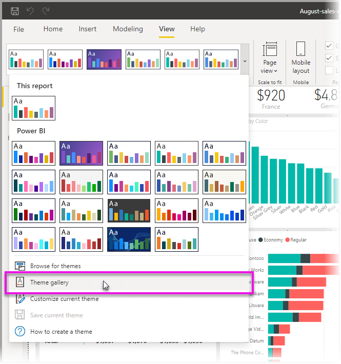
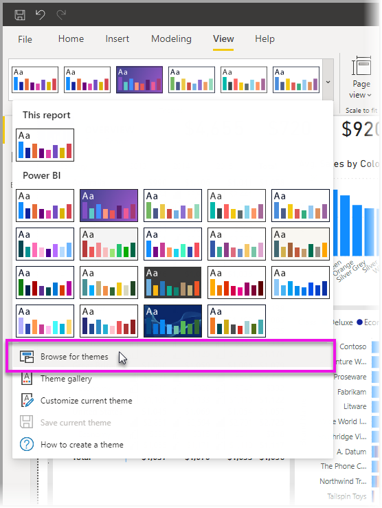

# <a name="use-report-themes-in-power-bi-desktop"></a><span data-ttu-id="fe957-103">ใช้ธีมรายงานใน Power BI Desktop</span><span class="sxs-lookup"><span data-stu-id="fe957-103">Use report themes in Power BI Desktop</span></span>

<span data-ttu-id="fe957-104">ด้วย *ธีมรายงาน* ของ Power BI Desktop คุณสามารถเปลี่ยนแปลงการออกแบบกับรายงานทั้งหมดของคุณได้ เช่น การใช้สีสำหรับองค์กร การเปลี่ยนชุดไอคอน หรือการใช้การจัดรูปแบบภาพตามค่าเริ่มต้นใหม่</span><span class="sxs-lookup"><span data-stu-id="fe957-104">With Power BI Desktop *report themes*, you can apply design changes to your entire report, such as using corporate colors, changing icon sets, or applying new default visual formatting.</span></span> <span data-ttu-id="fe957-105">เมื่อคุณใช้ธีมรายงาน วิชวลทั้งหมดในรายงานของคุณจะใช้สีและการจัดรูปแบบจากธีมที่คุณเลือกเป็นค่าเริ่มต้น</span><span class="sxs-lookup"><span data-stu-id="fe957-105">When you apply a report theme, all visuals in your report use the colors and formatting from your selected theme as their defaults.</span></span> <span data-ttu-id="fe957-106">มีข้อยกเว้นบางอยู่บางประการ ซึ่งจะอธิบายภายหลังในบทความนี้</span><span class="sxs-lookup"><span data-stu-id="fe957-106">A few exceptions apply, which are described later in this article.</span></span>

<span data-ttu-id="fe957-107">คุณสามารถเลือกธีมรายงานได้โดยการนำทางไปยังริบบอน **มุมมอง** จากนั้นเลือกปุ่มลูกศรดรอปดาวน์ในส่วน **ธีม** ของริบบอน แล้วเลือกธีมที่คุณต้องการ</span><span class="sxs-lookup"><span data-stu-id="fe957-107">Report themes can be selected by navigating to the **View** ribbon, then selecting the drop-down arrow button in the **Themes** section of the ribbon, then selecting the theme you want.</span></span> <span data-ttu-id="fe957-108">ธีมที่พร้อมใช้งานจะคล้ายกับธีมที่เห็นในผลิตภัณฑ์อื่นๆ ของ Microsoft เช่น Microsoft PowerPoint</span><span class="sxs-lookup"><span data-stu-id="fe957-108">Available themes are similar to themes seen in other Microsoft products, such as Microsoft PowerPoint.</span></span>


<span data-ttu-id="fe957-110">ธีมรายงานมีทั้งหมดสองประเภท คือ ธีมรายงานที่มีอยู่ภายในระบบ และไฟล์ธีมรายงานแบบกำหนดเอง</span><span class="sxs-lookup"><span data-stu-id="fe957-110">There are two types of report themes: built-in report themes and custom report theme files.</span></span>

- <span data-ttu-id="fe957-111">ธีมรายงาน **ที่มีอยู่ภายในระบบ** นั้น จะประกอบด้วยแบบสีที่กำหนดไว้ล่วงหน้า ซึ่งติดตั้งมากับ Power BI Desktop</span><span class="sxs-lookup"><span data-stu-id="fe957-111">**Built-in** report themes provide different kinds of predefined color schemes that are installed with Power BI Desktop.</span></span> <span data-ttu-id="fe957-112">คุณเลือกธีมรายงานที่มีอยู่ภายในระบบได้โดยตรงจากเมนู Power BI Desktop</span><span class="sxs-lookup"><span data-stu-id="fe957-112">You select built-in report themes directly from the Power BI Desktop menu.</span></span>

- <span data-ttu-id="fe957-113">ธีมรายงานแบบ **กำหนดเอง** ถูกสร้างขึ้นโดยการปรับธีมปัจจุบันจากนั้นบันทึกเป็นธีมที่กำหนดเอง หรือสร้างธีมที่คุณกำหนดเองโดยใช้ไฟล์ JSON</span><span class="sxs-lookup"><span data-stu-id="fe957-113">**Custom** report themes are created by adjusting a current theme then saving it as a custom theme, or creating your own customize theme using a JSON file.</span></span> <span data-ttu-id="fe957-114">ไฟล์ JSON ให้การควบคุมที่ละเอียดมากกว่าหลายแง่มุมของธีมรายงานตามที่อธิบายไว้ภายหลังในบทความนี้</span><span class="sxs-lookup"><span data-stu-id="fe957-114">The JSON file provides granular control over many aspects of a report theme, as described later in this article.</span></span> 

<span data-ttu-id="fe957-115">มาคุยกันว่าธีมรายงานทำงานอย่างไร จากนั้นให้ข้ามไปยังวิธีการสร้างธีมรายงานแบบกำหนดเองกันเถอะ</span><span class="sxs-lookup"><span data-stu-id="fe957-115">Let's discuss how report themes work, then jump into how to create customized report themes.</span></span>


## <a name="how-report-themes-work"></a><span data-ttu-id="fe957-116">ธีมรายงาน ทำงานอย่างไร</span><span class="sxs-lookup"><span data-stu-id="fe957-116">How report themes work</span></span>

<span data-ttu-id="fe957-117">เมื่อต้องการนำธีมรายงานไปใช้กับรายงาน Power BI Desktop คุณสามารถเลือกจากตัวเลือกต่อไปนี้:</span><span class="sxs-lookup"><span data-stu-id="fe957-117">To apply a report theme to a Power BI Desktop report, you can select from the following options:</span></span>

* <span data-ttu-id="fe957-118">เลือกจาก [ธีมรายงานที่มีอยู่แล้วภายในที่พร้อมใช้งาน](#built-in-report-themes) ซึ่งมีอยู่แล้วภายใน Power BI Desktop</span><span class="sxs-lookup"><span data-stu-id="fe957-118">Select from the [available built-in report themes](#built-in-report-themes) that are built into Power BI Desktop</span></span>
* <span data-ttu-id="fe957-119">กำหนดธีมเองโดยใช้กล่องโต้ตอบ **กำหนดค่าธีม**</span><span class="sxs-lookup"><span data-stu-id="fe957-119">Customize a theme, using the **Customize theme** dialog</span></span>
* <span data-ttu-id="fe957-120">[นำเข้าไฟล์ JSON ของธีมแบบกำหนดเอง](#import-custom-report-theme-files)</span><span class="sxs-lookup"><span data-stu-id="fe957-120">[Import a custom theme JSON file](#import-custom-report-theme-files).</span></span>

<span data-ttu-id="fe957-121">เราจะมาดูตัวเลือกเหล่านี้กัน</span><span class="sxs-lookup"><span data-stu-id="fe957-121">We'll take a look at each of these options in turn.</span></span>

> [!NOTE]
> <span data-ttu-id="fe957-122">สามารถใช้ธีมได้เมื่อใช้ Power BI Desktop เท่านั้น</span><span class="sxs-lookup"><span data-stu-id="fe957-122">Themes can only be applied when using Power BI Desktop.</span></span> <span data-ttu-id="fe957-123">คุณไม่สามารถใช้ธีมกับรายงานที่มีอยู่ภายในบริการของ Power BI ได้</span><span class="sxs-lookup"><span data-stu-id="fe957-123">You cannot apply themes to existing reports within the Power BI service.</span></span> 

### <a name="built-in-report-themes"></a><span data-ttu-id="fe957-124">ธีมรายงานที่มีอยู่ภายในระบบ</span><span class="sxs-lookup"><span data-stu-id="fe957-124">Built-in report themes</span></span>

<span data-ttu-id="fe957-125">เพื่อเลือกจากธีมรายงานที่มีอยู่ภายในระบบ:</span><span class="sxs-lookup"><span data-stu-id="fe957-125">To select from the available built-in report themes:</span></span>

1. <span data-ttu-id="fe957-126">เลือกปุ่มลูกศรดรอปดาวน์ **ธีม** **สลับธีม** จากริบบอน **มุมมอง**</span><span class="sxs-lookup"><span data-stu-id="fe957-126">Select the **Themes** drop-down arrow button **Switch Theme** from the **View** ribbon.</span></span>

   

2. <span data-ttu-id="fe957-128">เลือกจากบรรดาธีมที่รวมอยู่จากเมนูดรอปดาวน์ที่ปรากฏขึ้น</span><span class="sxs-lookup"><span data-stu-id="fe957-128">Select from among the included themes from the drop-down menu that appears.</span></span>

   

   <span data-ttu-id="fe957-130">ในตอนนี้ธีมรายงานของคุณได้ถูกนำไปใช้กับรายงานแล้ว</span><span class="sxs-lookup"><span data-stu-id="fe957-130">Your report theme is now applied to the report.</span></span>

    <span data-ttu-id="fe957-131">ตารางต่อไปนี้แสดงธีมรายงานที่มีอยู่ภายในระบบ</span><span class="sxs-lookup"><span data-stu-id="fe957-131">The following table shows the available built-in report themes.</span></span>
    
    | <span data-ttu-id="fe957-132">ธีมรายงานที่มีอยู่ภายในระบบ</span><span class="sxs-lookup"><span data-stu-id="fe957-132">Built-in report theme</span></span> | <span data-ttu-id="fe957-133">ลำดับสีเริ่มต้น</span><span class="sxs-lookup"><span data-stu-id="fe957-133">Default color sequence</span></span> |
    |------ |---------- |
    | <span data-ttu-id="fe957-134">ค่าเริ่มต้น</span><span class="sxs-lookup"><span data-stu-id="fe957-134">Default</span></span> | |
    | <span data-ttu-id="fe957-136">Highrise</span><span class="sxs-lookup"><span data-stu-id="fe957-136">Highrise</span></span> | |
    | <span data-ttu-id="fe957-138">ผู้บริหาร</span><span class="sxs-lookup"><span data-stu-id="fe957-138">Executive</span></span> | |
    | <span data-ttu-id="fe957-140">พรมแดน</span><span class="sxs-lookup"><span data-stu-id="fe957-140">Frontier</span></span>| |
    | <span data-ttu-id="fe957-142">สร้างสรรค์</span><span class="sxs-lookup"><span data-stu-id="fe957-142">Innovate</span></span> | |
    | <span data-ttu-id="fe957-144">ดอกไม้บาน</span><span class="sxs-lookup"><span data-stu-id="fe957-144">Bloom</span></span> | |
    | <span data-ttu-id="fe957-146">คลื่น</span><span class="sxs-lookup"><span data-stu-id="fe957-146">Tidal</span></span>| |
    | <span data-ttu-id="fe957-148">อุณหภูมิ</span><span class="sxs-lookup"><span data-stu-id="fe957-148">Temperature</span></span> | |
    | <span data-ttu-id="fe957-150">พระอาทิตย์</span><span class="sxs-lookup"><span data-stu-id="fe957-150">Solar</span></span>| |
    | <span data-ttu-id="fe957-152">แตกต่าง</span><span class="sxs-lookup"><span data-stu-id="fe957-152">Divergent</span></span> | |
    | <span data-ttu-id="fe957-154">พายุ</span><span class="sxs-lookup"><span data-stu-id="fe957-154">Storm</span></span> | |
    | <span data-ttu-id="fe957-156">คลาสสิก</span><span class="sxs-lookup"><span data-stu-id="fe957-156">Classic</span></span> | |
    | <span data-ttu-id="fe957-158">ซิตี้ปาร์ค</span><span class="sxs-lookup"><span data-stu-id="fe957-158">City park</span></span> | |
    | <span data-ttu-id="fe957-160">ชั้นเรียน</span><span class="sxs-lookup"><span data-stu-id="fe957-160">Classroom</span></span> | |
    | <span data-ttu-id="fe957-162">ปลอดภัยสำหรับผู้ที่ตาบอดสี</span><span class="sxs-lookup"><span data-stu-id="fe957-162">Colorblind safe</span></span> | |
    | <span data-ttu-id="fe957-164">ไฟฟ้า</span><span class="sxs-lookup"><span data-stu-id="fe957-164">Electric</span></span> | |
    | <span data-ttu-id="fe957-166">ความคมชัดสูง</span><span class="sxs-lookup"><span data-stu-id="fe957-166">High contrast</span></span> | |
    | <span data-ttu-id="fe957-168">พระอาทิตย์ตก</span><span class="sxs-lookup"><span data-stu-id="fe957-168">Sunset</span></span> | |
    | <span data-ttu-id="fe957-170">พลบค่ำ</span><span class="sxs-lookup"><span data-stu-id="fe957-170">Twilight</span></span> | |
    
3. <span data-ttu-id="fe957-172">คุณยังสามารถเรียกดูคอลเลกชันของธีมที่สร้างขึ้นโดยสมาชิกของชุมชน Power BI ได้ โดยการเลือก **แกลเลอรีธีม** จากรายการแบบดรอปดาวน์ของธีม</span><span class="sxs-lookup"><span data-stu-id="fe957-172">You can also browse the collection of themes created by members of the Power BI Community, by selecting **Theme gallery** from the Themes drop-down.</span></span>

   

    <span data-ttu-id="fe957-174">จากแกลเลอรี คุณสามารถเลือกธีมที่คุณต้องการและดาวน์โหลดไฟล์ JSON ที่เกี่ยวข้อง</span><span class="sxs-lookup"><span data-stu-id="fe957-174">From the gallery, you can select a theme you like and download its associated JSON file.</span></span> 

    <span data-ttu-id="fe957-175">หากต้องการติดตั้งไฟล์ที่ดาวน์โหลด ให้เลือก **เรียกดูธีม** จากดรอปดาวน์ **ธีม** ไปที่ตำแหน่งที่คุณดาวน์โหลดไฟล์ JSON และเลือกเพื่อนำเข้าธีมไปยัง Power BI Desktop ให้เป็นธีมใหม่</span><span class="sxs-lookup"><span data-stu-id="fe957-175">To install the downloaded file, select **Browse for themes** from the **Themes** drop-down, navigate to the location where you downloaded the JSON file, and select it to import the theme into Power BI Desktop as a new theme.</span></span>

    <span data-ttu-id="fe957-176">เมื่อประสบความสำเร็จ Power BI จะแสดงกล่องโต้ตอบที่การนำเข้าเสร็จสมบูรณ์</span><span class="sxs-lookup"><span data-stu-id="fe957-176">When successful, Power BI shows a dialog that the import was successful.</span></span>

   

## <a name="customize-report-themes"></a><span data-ttu-id="fe957-178">ปรับแต่งธีมรายงาน</span><span class="sxs-lookup"><span data-stu-id="fe957-178">Customize report themes</span></span>

<span data-ttu-id="fe957-179">คุณสามารถปรับแต่งและกำหนดมาตรฐานองค์ประกอบเกือบทั้งหมดที่ปรากฏในส่วน **การจัดรูปแบบ** ของบานหน้าต่าง **การแสดงวิชวล** โดยผ่านการปรับแต่งโดยตรงใน Power BI Desktop หรือผ่านธีมรายงานไฟล์ JSON</span><span class="sxs-lookup"><span data-stu-id="fe957-179">You can customize and standardize nearly all the elements that are listed in the **Format** section of the **Visualizations** pane, either through customizations made directly in Power BI Desktop, or through a report theme JSON file.</span></span> <span data-ttu-id="fe957-180">เป้าหมายคือเพื่อให้คุณสามารถควบคุมลักษณะและรูปแบบค่าเริ่มต้นของรายงานของคุณได้อย่างเต็มที่ ไปจนถึงระดับแยกย่อย</span><span class="sxs-lookup"><span data-stu-id="fe957-180">The goal is to give you full control over your report's default look and feel, on a granular level.</span></span>

<span data-ttu-id="fe957-181">สองวิธีในการปรับแต่งธีมรายงานมีดังต่อไปนี้:</span><span class="sxs-lookup"><span data-stu-id="fe957-181">The two ways to customize report themes are the following:</span></span>

- [<span data-ttu-id="fe957-182">สร้างและปรับแต่งธีมใน Power BI Desktop</span><span class="sxs-lookup"><span data-stu-id="fe957-182">Create and customize a theme in Power BI Desktop</span></span>](#create-and-customize-a-theme-in-power-bi-desktop)
- [<span data-ttu-id="fe957-183">สร้างและปรับแต่งไฟล์ JSON ของธีมรายงานแบบกำหนดเอง</span><span class="sxs-lookup"><span data-stu-id="fe957-183">Create and customize a custom report theme JSON file</span></span>](#introduction-to-report-theme-json-files)

<span data-ttu-id="fe957-184">ลองมาดูที่แต่ละแนวทางเหล่านี้ในส่วนต่อไปนี้</span><span class="sxs-lookup"><span data-stu-id="fe957-184">Let's take a look at each of these approaches, in turn, in the following sections.</span></span>

### <a name="create-and-customize-a-theme-in-power-bi-desktop"></a><span data-ttu-id="fe957-185">สร้างและปรับแต่งธีมใน Power BI Desktop</span><span class="sxs-lookup"><span data-stu-id="fe957-185">Create and customize a theme in Power BI Desktop</span></span>

<span data-ttu-id="fe957-186">เมื่อต้องการกำหนดธีมโดยตรงใน Power BI Desktop คุณสามารถเลือกธีมที่ใกล้เคียงกับสิ่งที่คุณต้องการ และทำการปรับเปลี่ยนบางอย่างได้</span><span class="sxs-lookup"><span data-stu-id="fe957-186">To customize a theme directly in Power BI Desktop, you can select a theme that's close to what you like, and make a few adjustments.</span></span> <span data-ttu-id="fe957-187">ก่อนอื่นให้เลือกธีมที่ปิดอยู่ (หรือเริ่มต้นด้วยธีมใดก็ตามและปรับแต่งให้แตกต่างจากดั้งเดิม) และทำตามขั้นตอนต่อไปนี้:</span><span class="sxs-lookup"><span data-stu-id="fe957-187">First select the theme that's close (or just begin with any theme, and customize away from there), and take the following steps:</span></span>

1. <span data-ttu-id="fe957-188">จากริบบอน **มุมมอง** ให้เลือกปุ่มดรอปดาวน์ **ธีม** และเลือก **กำหนดค่าธีมปัจจุบัน**</span><span class="sxs-lookup"><span data-stu-id="fe957-188">From the **View** ribbon, select the **Themes** drop down button and select **Customize current theme**.</span></span>

   

2. <span data-ttu-id="fe957-190">กล่องโต้ตอบจะปรากฏขึ้น ซึ่งคุณสามารถทำการเปลี่ยนแปลงได้ทุกประเภทกับธีมปัจจุบันจากนั้นสามารถบันทึกการตั้งค่าของคุณเป็นธีมใหม่ได้</span><span class="sxs-lookup"><span data-stu-id="fe957-190">A dialog appears, where you can make all sorts of changes to the current theme, and then, can save your settings as a new theme.</span></span>

   

<span data-ttu-id="fe957-192">การตั้งค่าธีมที่สามารถกำหนดได้นั้น สามารถทำได้ในหมวดหมู่ต่างๆ ต่อไปนี้ ซึ่งจะแสดงในหน้าต่าง **กำหนดธีม**:</span><span class="sxs-lookup"><span data-stu-id="fe957-192">Customizable theme settings are found in the following categories, reflected in the **Customize theme** window:</span></span>

- <span data-ttu-id="fe957-193">**ชื่อและสี**: ชื่อธีมและการตั้งค่าสี ประกอบด้วย [สีของธีม](#how-report-theme-colors-stick-with-your-reports) สีแสดงความคิดเห็น สีที่แตกต่างกัน และ [สีโครงสร้าง (ขั้นสูง)](#setting-structural-colors)</span><span class="sxs-lookup"><span data-stu-id="fe957-193">**Name and colors**: Theme name and color settings include [theme colors](#how-report-theme-colors-stick-with-your-reports), sentiment colors, divergent colors, and [structural colors (Advanced)](#setting-structural-colors).</span></span>
- <span data-ttu-id="fe957-194">**ข้อความ**: การตั้งค่าข้อความประกอบด้วยกลุ่มแบบอักษร ขนาด และสี ซึ่งตั้งค่า [ค่าเริ่มต้นของระดับข้อความหลัก](#setting-formatted-text-defaults) สำหรับป้ายชื่อ ชื่อ การ์ดและ KPI และส่วนหัวของแท็บ</span><span class="sxs-lookup"><span data-stu-id="fe957-194">**Text**: Text settings include font family, size, and color, which sets [the primary text class defaults](#setting-formatted-text-defaults) for labels, titles, cards and KPIs, and tab headers.</span></span>
- <span data-ttu-id="fe957-195">**วิชวล**: การตั้งค่าวิชวลประกอบด้วย พื้นหลัง กรอบ ส่วนหัว และคำแนะนำเครื่องมือ</span><span class="sxs-lookup"><span data-stu-id="fe957-195">**Visuals**: Visual settings include background, border, header, and tooltips.</span></span>
- <span data-ttu-id="fe957-196">**หน้า**: การตั้งค่าองค์ประกอบของหน้า ประกอบด้วย รูปพื้นหลัง และพื้นหลัง</span><span class="sxs-lookup"><span data-stu-id="fe957-196">**Page**: Page element settings include wallpaper and background.</span></span>
- <span data-ttu-id="fe957-197">**บานหน้าต่างตัวกรอง**: การตั้งค่าบานหน้าต่างตัวกรอง ประกอบด้วย สีพื้นหลัง ความโปร่งแสง สีตัวอักษรและไอคอน ขนาด การ์ดตัวกรอง</span><span class="sxs-lookup"><span data-stu-id="fe957-197">**Filter pane**: Filter pane settings include background color, transparency, font and icon color, size, filter cards.</span></span>

<span data-ttu-id="fe957-198">หลังจากที่คุณทำการเปลี่ยนแปลงแล้ว เลือก **นำไปใช้และบันทึก** เพื่อบันทึกธีมของคุณ</span><span class="sxs-lookup"><span data-stu-id="fe957-198">After you make your changes, select **Apply and save** to save your theme.</span></span> <span data-ttu-id="fe957-199">ในตอนนี้ สามารถใช้ธีมของคุณในรายงานปัจจุบันและรายงานส่งออกได้แล้ว</span><span class="sxs-lookup"><span data-stu-id="fe957-199">Your theme can now be used in the current report, and exported.</span></span>

<span data-ttu-id="fe957-200">การปรับแต่งธีมปัจจุบันของคุณด้วยวิธีนี้สามารถทำให้การปรับแต่งธีมเป็นไปอย่างง่ายดายและรวดเร็ว</span><span class="sxs-lookup"><span data-stu-id="fe957-200">Customizing the current theme in this way makes it quick and easy to customize themes.</span></span> <span data-ttu-id="fe957-201">อย่างไรก็ตาม คุณสามารถปรับแต่งรูปแบบที่ดีที่สุดให้ธีมได้ ซึ่งจำเป็นต้องปรับเปลี่ยน[ไฟล์ JSON](#report-theme-json-file-format) ของธีม</span><span class="sxs-lookup"><span data-stu-id="fe957-201">However, you can make finer adjustments to themes, which require modifying the theme's [JSON file](#report-theme-json-file-format).</span></span>

> [!TIP]
> <span data-ttu-id="fe957-202">คุณสามารถปรับแต่งตัวเลือกธีมรายงานที่พบบ่อยที่สุดโดยใช้ตัวควบคุมในกล่องโต้ตอบ **ปรับแต่งธีม**</span><span class="sxs-lookup"><span data-stu-id="fe957-202">You can customize the most common report theme options by using the controls in the **Customize theme** dialog.</span></span> <span data-ttu-id="fe957-203">สำหรับการควบคุมเพิ่มเติม คุณสามารถเลือกที่จะส่งออกไฟล์ JSON ของธีม และทำการปรับปรุงและปรับแต่งด้วยตนเอง โดยการปรับเปลี่ยนการตั้งค่าในไฟล์นั้น</span><span class="sxs-lookup"><span data-stu-id="fe957-203">For even more control, you can optionally export a theme's JSON file and make fine-tuned adjustments by manually modifying the settings in that file.</span></span> <span data-ttu-id="fe957-204">คุณสามารถเปลี่ยนชื่อไฟล์ JSON ที่ได้รับการปรับแต่งแล้ว และนำเข้าไฟล์ในภายหลัง</span><span class="sxs-lookup"><span data-stu-id="fe957-204">You can rename that fine-tuned JSON file and later import it.</span></span>

### <a name="import-custom-report-theme-files"></a><span data-ttu-id="fe957-205">นำเข้าไฟล์ธีมรายงานแบบกำหนดเอง</span><span class="sxs-lookup"><span data-stu-id="fe957-205">Import custom report theme files</span></span>

<span data-ttu-id="fe957-206">คุณยังสามารถนำเข้าไฟล์ธีมรายงานแบบกำหนดเองได้โดยทำตามขั้นตอนต่อไปนี้:</span><span class="sxs-lookup"><span data-stu-id="fe957-206">You can also import a custom report theme file, by taking the following steps:</span></span>

1. <span data-ttu-id="fe957-207">เลือกริบบอน **มุมมอง** จากนั้นเลือกปุ่มดรอปดาวน์ **ธีม** และเลือก **เรียกดูธีม**</span><span class="sxs-lookup"><span data-stu-id="fe957-207">Select the **View** ribbon, then from the **Themes** drop down button, select **Browse for themes**.</span></span>

   

   <span data-ttu-id="fe957-209">หน้าต่างจะปรากฏขึ้นเพื่อให้คุณเรียกดูตำแหน่งที่ตั้งของไฟล์ธีม JSON</span><span class="sxs-lookup"><span data-stu-id="fe957-209">A window appears that lets you browse to the location of the JSON theme file.</span></span>

2. <span data-ttu-id="fe957-210">ในรูปต่อไปนี้ แสดงธีมวันหยุดจำนวนหนึ่งที่มี</span><span class="sxs-lookup"><span data-stu-id="fe957-210">In the following image, a handful of holiday theme files are available.</span></span> <span data-ttu-id="fe957-211">เราจะเลือกธีมวันหยุดสำหรับเดือนมีนาคม *St Patricks Day.json*</span><span class="sxs-lookup"><span data-stu-id="fe957-211">We'll choose a holiday theme for March, *St Patricks Day.json*.</span></span>

   

   <span data-ttu-id="fe957-213">เมื่อโหลดไฟล์ธีมสำเร็จแล้ว Power BI Desktop จะแสดงข้อความแจ้งให้ทราบ</span><span class="sxs-lookup"><span data-stu-id="fe957-213">When the theme file has loaded successfully, Power BI Desktop displays a success message.</span></span>

   

## <a name="introduction-to-report-theme-json-files"></a><span data-ttu-id="fe957-215">บทนำเบื้องต้นของไฟล์ JSON ของธีมรายงาน</span><span class="sxs-lookup"><span data-stu-id="fe957-215">Introduction to report theme JSON files</span></span>

 <span data-ttu-id="fe957-216">เมื่อคุณเปิดไฟล์ JSON พื้นฐานที่ได้กล่าวถึงในส่วนก่อนหน้า (St Patricks Day.json) จะปรากฏเป็นดังนี้:</span><span class="sxs-lookup"><span data-stu-id="fe957-216">When you open the basic JSON file mentioned in the previous section (St Patricks Day.json), it appears as follows:</span></span>

 ```json
    {
        "name": "St Patrick's Day",
        "dataColors": ["#568410", "#3A6108", "#70A322", "#915203", "#D79A12", "#bb7711", "#114400", "#aacc66"],
        "background":"#FFFFFF",
        "foreground": "#3A6108",
        "tableAccent": "#568410"
    }
```

<span data-ttu-id="fe957-217">ไฟล์ JSON ธีมรายงานนี้มีบรรทัดดังต่อไปนี้:</span><span class="sxs-lookup"><span data-stu-id="fe957-217">This report theme JSON file has the following lines:</span></span>

- <span data-ttu-id="fe957-218">**ชื่อ**: ชื่อธีมรายงาน</span><span class="sxs-lookup"><span data-stu-id="fe957-218">**name**: The report theme name.</span></span> <span data-ttu-id="fe957-219">เขตข้อมูลนี้เป็นเขตข้อมูลที่จำเป็นเท่านั้น</span><span class="sxs-lookup"><span data-stu-id="fe957-219">This field is the only required field.</span></span>
- <span data-ttu-id="fe957-220">**dataColors**: รายการรหัสสีฐานสิบหกที่ใช้สำหรับข้อมูลในวิชวล Power BI Desktop</span><span class="sxs-lookup"><span data-stu-id="fe957-220">**dataColors**: The list of color hexadecimal codes to use for data in Power BI Desktop visuals.</span></span> <span data-ttu-id="fe957-221">รายการนี้สามารถมีจำนวนสีมากหรือน้อยเท่าใดก็ได้ ตามความต้องการของคุณ</span><span class="sxs-lookup"><span data-stu-id="fe957-221">This list can have as many or as few colors as you want.</span></span>
- <span data-ttu-id="fe957-222">**background**, **firstLevelElements** และ **tableAccent** (เป็นต้น): ระดับชั้นสี</span><span class="sxs-lookup"><span data-stu-id="fe957-222">**background**, **firstLevelElements**, and **tableAccent** (etc.): Color classes.</span></span> <span data-ttu-id="fe957-223">ระดับชั้นสีช่วยให้คุณสามารถตั้งค่าสีโครงสร้างได้หลายสีในรายงานของคุณครั้งเดียว</span><span class="sxs-lookup"><span data-stu-id="fe957-223">Color classes enable you to set many structural colors in your report at once.</span></span>

<span data-ttu-id="fe957-224">คุณสามารถใช้ไฟล์ JSON นี้เป็นพื้นฐานในการสร้างไฟล์ธีมรายงานแบบกำหนดเองที่จะนำเข้าของคุณเองได้</span><span class="sxs-lookup"><span data-stu-id="fe957-224">You can use this JSON file as a basis to create your own custom report theme file to import.</span></span> <span data-ttu-id="fe957-225">ถ้าคุณต้องการปรับเฉพาะสีพื้นฐานของรายงานของคุณ ให้เปลี่ยนชื่อและรหัสฐานสิบหกในไฟล์</span><span class="sxs-lookup"><span data-stu-id="fe957-225">If you want to adjust only the basic colors of your report, change the name and hex codes in the file.</span></span>

<span data-ttu-id="fe957-226">ในไฟล์ JSON ธีมรายงาน คุณกำหนดได้เฉพาะการจัดรูปแบบที่คุณต้องการเปลี่ยนแปลง</span><span class="sxs-lookup"><span data-stu-id="fe957-226">In a report theme JSON file, you define only the formatting that you want to change.</span></span> <span data-ttu-id="fe957-227">รายการใดก็ตามที่คุณไม่ได้ระบุในไฟล์ JSON จะแปลงกลับไปยังการตั้งค่าเริ่มต้นของ Power BI Desktop</span><span class="sxs-lookup"><span data-stu-id="fe957-227">Whatever you don't specify in the JSON file reverts to the Power BI Desktop default settings.</span></span>

<span data-ttu-id="fe957-228">ประโยชน์ของการสร้างไฟล์ JSON มีหลายข้อ</span><span class="sxs-lookup"><span data-stu-id="fe957-228">The advantages of creating a JSON file are many.</span></span> <span data-ttu-id="fe957-229">ตัวอย่างเช่น คุณสามารถระบุได้ว่า ให้ใช้ขนาดตัวอักษร 12 ในแผนภูมิทั้งหมด หรือให้ใช้ตระกูลแบบอักษรที่กำหนด ในวิชวลบางวิชวล หรือปิดใช้งานป้ายชื่อสำหรับแผนภูมิบางชนิด</span><span class="sxs-lookup"><span data-stu-id="fe957-229">For example, you can specify that all charts use a font size of 12, that certain visuals use a particular font family, or that data labels are turned off for specific chart types.</span></span> <span data-ttu-id="fe957-230">ในการใช้ไฟล์ JSON คุณสามารถสร้างไฟล์ธีมรายงานที่กำหนดมาตรฐานให้แผนภูมิ และรายงานของคุณ ซึ่งจะทำให้เป็นการง่ายที่จะให้รายงานองค์กรของคุณมีรูปแบบที่สอดคล้องกันทั้งหมด</span><span class="sxs-lookup"><span data-stu-id="fe957-230">By using a JSON file, you can create a report theme file that standardizes your charts and reports, making it easy for your organization's reports to be consistent.</span></span>

<span data-ttu-id="fe957-231">สำหรับข้อมูลเพิ่มเติมเกี่ยวกับรูปแบบของไฟล์ JSON ดู [รูปแบบไฟล์ JSON ธีมรายงาน](#report-theme-json-file-format)</span><span class="sxs-lookup"><span data-stu-id="fe957-231">For more information about the format of the JSON file, see [Report theme JSON file format](#report-theme-json-file-format).</span></span>

> [!NOTE]
> <span data-ttu-id="fe957-232">การแก้ไขธีมรายงาน JSON แบบกำหนดเองด้วยกล่องโต้ตอบ [**ปรับแต่งธีม**](#create-and-customize-a-theme-in-power-bi-desktop) มีความปลอดภัย</span><span class="sxs-lookup"><span data-stu-id="fe957-232">Modifying a custom JSON report theme with the [**Customize theme** dialog box](#create-and-customize-a-theme-in-power-bi-desktop) is safe.</span></span>  <span data-ttu-id="fe957-233">กล่องโต้ตอบจะไม่แก้ไขการตั้งค่าธีมที่ไม่สามารถควบคุมได้และจะอัปเดตการเปลี่ยนแปลงที่เกิดขึ้นกับธีมรายงานในสถานที่</span><span class="sxs-lookup"><span data-stu-id="fe957-233">The dialog will not modify theme settings that it cannot control, and will update the changes made to the report theme in-place.</span></span>

## <a name="how-report-theme-colors-stick-with-your-reports"></a><span data-ttu-id="fe957-234">สีจากธีมรายงานจะติดไปกับรายงานของคุณอย่างไร</span><span class="sxs-lookup"><span data-stu-id="fe957-234">How report theme colors stick with your reports</span></span>

<span data-ttu-id="fe957-235">เมื่อคุณเผยแพร่รายงานของคุณไปยัง บริการของ Power BI จะมีสีของธีมรายงานของคุณติดไปด้วย</span><span class="sxs-lookup"><span data-stu-id="fe957-235">When you publish your report to the Power BI service, your report theme colors stay with it.</span></span> <span data-ttu-id="fe957-236">ส่วน **สีข้อมูล** ของแผง **รูปแบบ** จะสะท้อนให้เห็นธีมรายงานของคุณ</span><span class="sxs-lookup"><span data-stu-id="fe957-236">The **Data colors** section of the **Format** panel reflects your report theme.</span></span>

<span data-ttu-id="fe957-237">เมื่อต้องการดูสีที่พร้อมใช้งานในธีมรายงาน:</span><span class="sxs-lookup"><span data-stu-id="fe957-237">To view the available colors in a report theme:</span></span>

1. <span data-ttu-id="fe957-238">เลือกวิชวล</span><span class="sxs-lookup"><span data-stu-id="fe957-238">Select a visual.</span></span>

2. <span data-ttu-id="fe957-239">จากส่วน **รูปแบบ** ของบานหน้าต่าง **การแสดงวิชวล** เลือก **สีข้อมูล**</span><span class="sxs-lookup"><span data-stu-id="fe957-239">From the **Format** section of the **Visualization** pane, select **Data colors**.</span></span>

3. <span data-ttu-id="fe957-240">เลือกรายการดรอปดาวน์เพื่อดู **สีธีม** ข้อมูลของธีมรายงาน</span><span class="sxs-lookup"><span data-stu-id="fe957-240">Select the drop-down of an item to view the **Theme colors** information of the report theme.</span></span>

   

<span data-ttu-id="fe957-242">ในตัวอย่างของเรา หลังจากที่ใช้โทนสีเขียว และสีน้ำตาลจากธีมรายงาน St. Patrick's Day แล้ว ให้เลือกดูสีธีม</span><span class="sxs-lookup"><span data-stu-id="fe957-242">In our example, after you apply the multitude of green and brown colors from the St. Patrick's Day report theme, view the theme colors.</span></span> <span data-ttu-id="fe957-243">เห็นสีเขียวทั้งหมดนั่นไหม?</span><span class="sxs-lookup"><span data-stu-id="fe957-243">See all that green?</span></span> <span data-ttu-id="fe957-244">นั่นเป็นเพราะว่าสีเหล่านั้นเป็นส่วนหนึ่งของธีมรายงานที่เราได้นำเข้าและนำไปใช้งาน</span><span class="sxs-lookup"><span data-stu-id="fe957-244">That's because those colors were part of the report theme that we imported and applied.</span></span>

<span data-ttu-id="fe957-245">นอกจากนี้ สีในจานสีจะยังสอดคล้องกับธีมปัจจุบัน</span><span class="sxs-lookup"><span data-stu-id="fe957-245">The colors in the color palette are relative to the current theme.</span></span> <span data-ttu-id="fe957-246">ตัวอย่างเช่น สมมติว่าคุณเลือกสีที่สามของแถวบนสุดสำหรับจุดข้อมูล</span><span class="sxs-lookup"><span data-stu-id="fe957-246">For example, suppose you select the third color of the top row for a data point.</span></span> <span data-ttu-id="fe957-247">ในภายหลัง ถ้าคุณเปลี่ยนไปใช้ธีมอื่น สีของจุดข้อมูลนั้นจะอัปเดตโดยอัตโนมัติไปเป็นสีที่สามของแถวบนสุดในธีมใหม่ เช่นเดียวกับที่คุณเห็นเมื่อมีการเปลี่ยนธีมใน Microsoft Office</span><span class="sxs-lookup"><span data-stu-id="fe957-247">Later, if you change to a different theme, that data point's color updates automatically to the third color of the top row in the new theme, just as you'd see when changing themes in Microsoft Office.</span></span>

<span data-ttu-id="fe957-248">การตั้งค่าธีมรายงานจะเปลี่ยนสีเริ่มต้นที่ใช้ในวิชวลตลอดทั้งรายงาน</span><span class="sxs-lookup"><span data-stu-id="fe957-248">Setting a report themes changes the default colors used in visuals throughout the report.</span></span> <span data-ttu-id="fe957-249">Power BI รักษารายการที่ประกอบด้วยสีต่าง ๆ หลายร้อยสี เพื่อให้แน่ใจว่าวิชวลจะมีสีที่ไม่ซ้ำกันมากมายสำหรับการแสดงผลในรายงาน</span><span class="sxs-lookup"><span data-stu-id="fe957-249">Power BI maintains a list consisting of hundreds of colors, to ensure visuals have plenty of unique colors to display in a report.</span></span> <span data-ttu-id="fe957-250">เมื่อ Power BI กำหนดสีให้กับชุดของวิชวล ระบบจะเลือกสีตามลำดับของชุดสีที่กำหนดไว้ โดยสีที่กำหนดไว้ก่อนจะถูกใช้ก่อน</span><span class="sxs-lookup"><span data-stu-id="fe957-250">When Power BI assigns colors to a visual's series, colors are selected on a first-come, first-served basis as series colors are assigned.</span></span> <span data-ttu-id="fe957-251">เมื่อคุณนำเข้าธีม ระบบจะรีเซ็ตการสร้างแผนที่สีสำหรับชุดข้อมูล</span><span class="sxs-lookup"><span data-stu-id="fe957-251">When you import a theme, the mapping of colors for data series is reset.</span></span> 

<span data-ttu-id="fe957-252">Power BI จะติดตามสีสำหรับชุดข้อมูลแบบไดนามิก และใช้สีเดียวกันสำหรับค่าในวิชวลอื่น ๆ</span><span class="sxs-lookup"><span data-stu-id="fe957-252">Power BI tracks the color for a dynamic series, and uses the same color for the value in other visuals.</span></span> <span data-ttu-id="fe957-253">ใน *ชุดข้อมูลแบบไดนามิก* จำนวนชุดที่แสดงในวิชวลอาจเปลี่ยนแปลงตามหน่วยวัด ค่า หรือลักษณะอื่น ๆ</span><span class="sxs-lookup"><span data-stu-id="fe957-253">In a *dynamic series*, the number of series presented in visuals may change based on measures, values, or other aspects.</span></span> <span data-ttu-id="fe957-254">ตัวอย่างเช่น หากคุณแสดง *กำไรตามภูมิภาค* ในรายงาน จำนวนภูมิภาคการขายที่คุณมีอยู่อาจเท่ากับห้า หรืออาจเท่ากับเก้า</span><span class="sxs-lookup"><span data-stu-id="fe957-254">For example, if you show *Profit by Region* in a report, the number of sales regions you have might be five, or it might be nine.</span></span> <span data-ttu-id="fe957-255">จำนวนภูมิภาคเป็นแบบไดนามิก ดังนั้นจึงถือว่าเป็นชุดข้อมูลแบบไดนามิก</span><span class="sxs-lookup"><span data-stu-id="fe957-255">The number of regions is dynamic, so it's considered a dynamic series.</span></span> 

<span data-ttu-id="fe957-256">ในทางกลับกัน สำหรับ *ชุดข้อมูลแบบคงที่* คุณจะทราบจำนวนของชุดข้อมูลอยู่แล้ว</span><span class="sxs-lookup"><span data-stu-id="fe957-256">Conversely, for *static series*, the number of series is known.</span></span> <span data-ttu-id="fe957-257">ตัวอย่างเช่น *กำไร* และ *รายได้* รายได้เป็นชุดข้อมูลแบบคงที่</span><span class="sxs-lookup"><span data-stu-id="fe957-257">For example, *Profit* and *Revenue* revenue are static series.</span></span> <span data-ttu-id="fe957-258">ในชุดข้อมูลแบบคงที่ Power BI จะกำหนดสีตามดัชนีภายในรูปแบบธีม</span><span class="sxs-lookup"><span data-stu-id="fe957-258">In static series, Power BI assigns colors by index within the theme palettes.</span></span> <span data-ttu-id="fe957-259">คุณสามารถแทนที่การกำหนดสีเริ่มต้นได้โดยการเลือกสีจากบานหน้าต่างการจัดรูปแบบภายใต้ **สีข้อมูล**</span><span class="sxs-lookup"><span data-stu-id="fe957-259">You can override the default color assignment by selecting a color from the formatting pane under **Data colors**.</span></span> <span data-ttu-id="fe957-260">คุณอาจต้องเปลี่ยนการเลือกตัวแบ่งส่วนข้อมูลของคุณ เพื่อดูค่าชุดข้อมูลที่เป็นไปได้ทั้งหมด และตั้งค่าสีของชุดข้อมูลดังกล่าว</span><span class="sxs-lookup"><span data-stu-id="fe957-260">You may have to change your slicer selections to see all potential series values, and set their colors as well.</span></span> <span data-ttu-id="fe957-261">หากคุณตั้งค่าสีอย่างชัดเจนสำหรับวิชวลเดียวโดยใช้บานหน้าต่าง **คุณสมบัติ** ธีมที่นำเข้าจะไม่มีผลใช้งานกับสีที่กำหนดไว้อย่างชัดเจนเหล่านั้น</span><span class="sxs-lookup"><span data-stu-id="fe957-261">If you explicitly set a color explicitly a single visual using the **Properties** pane, the imported theme does not apply to any of those explicitly defined colors.</span></span> 

<span data-ttu-id="fe957-262">หากต้องการอนุญาตให้ธีมมีผลใช้งานกับสีที่เลือกไว้อย่างชัดเจน ให้ใช้ **แปลงกลับเป็นค่าเริ่มต้น** ในส่วน **สีข้อมูล** สำหรับวิชวลที่มีการตั้งค่าสีไว้อย่างชัดเจนแล้ว เพื่อยกเลิกการใช้งานสีที่ตั้งค่าไว้และอนุญาตให้ใช้ธีม</span><span class="sxs-lookup"><span data-stu-id="fe957-262">To allow the theme to apply to those explicitly selected colors, use **Revert to default** in the **Data Colors** section the visual to which the color has been explicitly set, to undo the explicit color application and allow the theme to apply.</span></span>


### <a name="situations-when-report-theme-colors-wont-stick-to-your-reports"></a><span data-ttu-id="fe957-263">สถานการณ์เมื่อสีจากธีมรายงานไม่ติดไปกับรายงานของคุณ</span><span class="sxs-lookup"><span data-stu-id="fe957-263">Situations when report theme colors won't stick to your reports</span></span>

<span data-ttu-id="fe957-264">สมมติว่าคุณเลือกใช้ชุดสีแบบกำหนดเอง (หรือสีเฉพาะ) ไปยังจุดข้อมูลเฉพาะในวิชวล โดยใช้ตัวเลือก **สีที่กำหนดเอง** ในเครื่องมือเลือกสี</span><span class="sxs-lookup"><span data-stu-id="fe957-264">Suppose you apply a custom color set (or individual color) to a particular data point in a visual by using the **Custom color** option in the color picker.</span></span> <span data-ttu-id="fe957-265">เมื่อคุณใช้ธีมรายงาน จะ *ไม่* เกิดการแทนที่สีของจุดข้อมูลที่กำหนดเอง</span><span class="sxs-lookup"><span data-stu-id="fe957-265">When you apply a report theme, it does *not* override that customized data point color.</span></span>

<span data-ttu-id="fe957-266">หรือ สมมติว่าคุณต้องการตั้งค่าสีของสีจุดข้อมูลด้วยตนเองโดยใช้ส่วน **สีธีม**</span><span class="sxs-lookup"><span data-stu-id="fe957-266">Or, suppose you want to manually set the color of a data point color by using the **Theme colors** section.</span></span> <span data-ttu-id="fe957-267">เมื่อคุณใช้ธีมรายงานใหม่ สีเหล่านั้นจะ *ไม่* ถูกอัปเดต</span><span class="sxs-lookup"><span data-stu-id="fe957-267">When you apply a new report theme, those colors are *not* updated.</span></span> <span data-ttu-id="fe957-268">ในการเรียกใช้ค่าเริ่มต้นของสีตามเดิม เพื่อให้สามารถอัปเดตได้เมื่อคุณใช้ธีมรายงานใหม่ คุณสามารถเลือก **กลับไปใช้ค่าเริ่มต้น** หรือเลือกสีจากชุด **สีธีม** ในเครื่องมือเลือกสี</span><span class="sxs-lookup"><span data-stu-id="fe957-268">To get your default colors back, so they'll update when you apply a new report theme, select **Revert to default**, or select a color from the **Theme colors** palette in the color picker.</span></span>


<span data-ttu-id="fe957-270">วิชวล Power BI หลายรายการจะไม่มีผลใช้งานกับธีมรายงาน</span><span class="sxs-lookup"><span data-stu-id="fe957-270">Many Power BI visuals won't apply to report themes.</span></span>

## <a name="custom-report-theme-files-you-can-use-right-now"></a><span data-ttu-id="fe957-271">ไฟล์ธีมรายงานแบบกำหนดเองที่คุณสามารถใช้ในขณะนี้</span><span class="sxs-lookup"><span data-stu-id="fe957-271">Custom report theme files you can use right now</span></span>

<span data-ttu-id="fe957-272">ต้องการเริ่มต้นใช้ธีมรายงานหรือไม่</span><span class="sxs-lookup"><span data-stu-id="fe957-272">Want to get started with report themes?</span></span> <span data-ttu-id="fe957-273">เลือกดูธีมรายงานแบบกำหนดเองใน [แกลเลอรีชุดรูปแบบ](https://community.powerbi.com/t5/Themes-Gallery/bd-p/ThemesGallery) หรือลองใช้ไฟล์ JSON ของธีมรายงานแบบกำหนดเองที่พร้อมใช้งานต่อไปนี้ ซึ่งคุณสามารถดาวน์โหลดและนำเข้าลงในรายงาน Power BI Desktop ของคุณ:</span><span class="sxs-lookup"><span data-stu-id="fe957-273">Check out the custom report themes in the [themes gallery](https://community.powerbi.com/t5/Themes-Gallery/bd-p/ThemesGallery) or try the following ready-made custom report theme JSON files, which you can download and import into your Power BI Desktop report:</span></span>

- <span data-ttu-id="fe957-274">[ธีมรูปคลื่น](https://community.powerbi.com/t5/Themes-Gallery/Waveform/m-p/140536)</span><span class="sxs-lookup"><span data-stu-id="fe957-274">[Waveform theme](https://community.powerbi.com/t5/Themes-Gallery/Waveform/m-p/140536).</span></span> <span data-ttu-id="fe957-275">ธีมรายงานนี้ได้รับการแนะนำอยู่ใน [บล็อกโพสต์](https://powerbi.microsoft.com/blog/power-bi-desktop-march-feature-summary/) ที่ประกาศการเปิดตัวครั้งแรกของธีมรายงาน</span><span class="sxs-lookup"><span data-stu-id="fe957-275">This report theme was introduced in the [blog post](https://powerbi.microsoft.com/blog/power-bi-desktop-march-feature-summary/) that announced the first release of report themes.</span></span> <span data-ttu-id="fe957-276">[ดาวน์โหลด Waveform.json](https://go.microsoft.com/fwlink/?linkid=843924)</span><span class="sxs-lookup"><span data-stu-id="fe957-276">[Download Waveform.json](https://go.microsoft.com/fwlink/?linkid=843924).</span></span>

  

- <span data-ttu-id="fe957-278">[ธีมที่เป็นมิตรกับคนตาบอดสี](https://community.powerbi.com/t5/Themes-Gallery/Color-Blind-Friendly/m-p/140597)</span><span class="sxs-lookup"><span data-stu-id="fe957-278">[Color blind friendly theme](https://community.powerbi.com/t5/Themes-Gallery/Color-Blind-Friendly/m-p/140597).</span></span>
<span data-ttu-id="fe957-279">ธีมรายงานนี้ง่ายต่อการอ่านสำหรับผู้ที่มีความบกพร่องทางสายตา</span><span class="sxs-lookup"><span data-stu-id="fe957-279">This report theme is easier to read for the visually impaired.</span></span> <span data-ttu-id="fe957-280">[ดาวน์โหลด ColorblindSafe-Longer.json](https://go.microsoft.com/fwlink/?linkid=843923)</span><span class="sxs-lookup"><span data-stu-id="fe957-280">[Download ColorblindSafe-Longer.json](https://go.microsoft.com/fwlink/?linkid=843923).</span></span>

  <span data-ttu-id="fe957-282">.</span><span class="sxs-lookup"><span data-stu-id="fe957-282">.</span></span>

- <span data-ttu-id="fe957-283">ธีม Power View ที่มี Apothecary.json</span><span class="sxs-lookup"><span data-stu-id="fe957-283">Power View themes, featuring Apothecary.json.</span></span> <span data-ttu-id="fe957-284">[ดาวน์โหลดธีม Power View ในไฟล์ Zip](https://go.microsoft.com/fwlink/?linkid=843925)</span><span class="sxs-lookup"><span data-stu-id="fe957-284">[Download Power View themes in a zip file](https://go.microsoft.com/fwlink/?linkid=843925).</span></span>

  

- <span data-ttu-id="fe957-286">ธีมวันวาเลนไทน์</span><span class="sxs-lookup"><span data-stu-id="fe957-286">Valentine's Day theme.</span></span>

  

  <span data-ttu-id="fe957-288">นี่คือรหัสสำหรับไฟล์ JSON วันวาเลนไทน์:</span><span class="sxs-lookup"><span data-stu-id="fe957-288">Here's the code for the Valentine's Day JSON file:</span></span>

   ```json
       {
           "name": "Valentine's Day",
           "dataColors": ["#990011", "#cc1144", "#ee7799", "#eebbcc", "#cc4477", "#cc5555", "#882222", "#A30E33"],
           "background":"#FFFFFF",
           "foreground": "#ee7799",
           "tableAccent": "#990011"
       }
   ```

<span data-ttu-id="fe957-289">นี่เป็นธีมรายงานเพื่มเติมที่คุณสามารถใช้เป็นจุดเริ่มต้น:</span><span class="sxs-lookup"><span data-stu-id="fe957-289">Here are a few more report themes you can use as starting points:</span></span>

- [<span data-ttu-id="fe957-290">Sunflower-twilight</span><span class="sxs-lookup"><span data-stu-id="fe957-290">Sunflower-twilight</span></span>](https://community.powerbi.com/t5/Themes-Gallery/Sunflower-Twilight/m-p/140749)
- [<span data-ttu-id="fe957-291">Plum</span><span class="sxs-lookup"><span data-stu-id="fe957-291">Plum</span></span>](https://community.powerbi.com/t5/Themes-Gallery/Plum/m-p/140711)
- [<span data-ttu-id="fe957-292">Autumn</span><span class="sxs-lookup"><span data-stu-id="fe957-292">Autumn</span></span>](https://community.powerbi.com/t5/Themes-Gallery/Autumn/m-p/140746)
- [<span data-ttu-id="fe957-293">High contrast</span><span class="sxs-lookup"><span data-stu-id="fe957-293">High contrast</span></span>](https://community.powerbi.com/t5/Themes-Gallery/Color-Blind-Friendly/m-p/140597)

<span data-ttu-id="fe957-294">ธีมรายงาน สามารถทำให้รายงาน Power BI Desktop ของคุณ สะท้อนสีสันในแบบของคุณ องค์กรของคุณ หรือแม้แต่ฤดูกาล หรือเทศกาลได้</span><span class="sxs-lookup"><span data-stu-id="fe957-294">Report themes can make your Power BI Desktop reports a colorful reflection of you, your organization, or even the current season or holiday.</span></span>

## <a name="export-report-themes"></a><span data-ttu-id="fe957-295">ส่งออกธีมรายงาน</span><span class="sxs-lookup"><span data-stu-id="fe957-295">Export report themes</span></span>

<span data-ttu-id="fe957-296">คุณสามารถส่งออกธีมรายงานที่ใช้ในขณะนี้ได้โดยตรงจาก Power BI Desktop ไปยังไฟล์ JSON</span><span class="sxs-lookup"><span data-stu-id="fe957-296">You can export the currently applied report theme directly from Power BI Desktop to a JSON file.</span></span> <span data-ttu-id="fe957-297">หลังจากที่คุณส่งออกธีมรายงานแล้ว คุณสามารถนำมาใช้ใหม่ในรายงานอื่นได้</span><span class="sxs-lookup"><span data-stu-id="fe957-297">After you export a report theme, you can then re-use it in other reports.</span></span> <span data-ttu-id="fe957-298">ตัวเลือกนี้ช่วยให้คุณสามารถส่งออกไฟล์ JSON สำหรับธีมส่วนใหญ่ที่มีอยู่แล้วภายในระบบได้</span><span class="sxs-lookup"><span data-stu-id="fe957-298">This option lets you export the JSON file for most of the built-in themes.</span></span> <span data-ttu-id="fe957-299">ซึ่งจะยกเว้นเพียงธีมพื้นฐาน ธีมคลาสสิกและธีมค่าเริ่มต้น ซึ่งธีมอื่นๆ จะสร้างขึ้นจากตีมเหล่านี้เมื่อมีการนำเข้า</span><span class="sxs-lookup"><span data-stu-id="fe957-299">The only exceptions are the base themes, Classic and Default, which other themes build upon when imported.</span></span>

<span data-ttu-id="fe957-300">ในการส่งออกธีมที่ใช้ในปัจจุบันจาก Power BI Desktop:</span><span class="sxs-lookup"><span data-stu-id="fe957-300">To export the currently applied theme from Power BI Desktop:</span></span>

1. <span data-ttu-id="fe957-301">เลือกตัวเลือก **ไฟล์** >  **และตัวเลือก** > **การตั้งค่า**</span><span class="sxs-lookup"><span data-stu-id="fe957-301">Select **File** > **Options and settings** > **Options**.</span></span>

2. <span data-ttu-id="fe957-302">ในส่วน **การแสดงตัวอย่าง** เลือก **ปรับแต่งธีมปัจจุบัน** จากนั้นเลือก **ตกลง**</span><span class="sxs-lookup"><span data-stu-id="fe957-302">In the **Preview features** section, select **Customize current theme**, and then select **OK**.</span></span>

   <span data-ttu-id="fe957-303">คุณอาจได้รับพร้อมท์ให้รีสตาร์ท Power BI Desktop เพื่อเปิดใช้งานฟีเจอร์ตัวอย่าง</span><span class="sxs-lookup"><span data-stu-id="fe957-303">You might be prompted to restart Power BI Desktop for the preview feature to be enabled.</span></span> <span data-ttu-id="fe957-304">หลังจากที่คุณรีสตาร์ท คุณสามารถเริ่มต้นส่งออกธีมที่ใช้อยู่ในขณะนั้นได้</span><span class="sxs-lookup"><span data-stu-id="fe957-304">After you restart, you can begin exporting the currently applied theme.</span></span>

3. <span data-ttu-id="fe957-305">จาก Ribbon **หน้าแรก** เลือก **สลับธีม** > **ส่งออกธีมปัจจุบัน**</span><span class="sxs-lookup"><span data-stu-id="fe957-305">From the **Home** ribbon, select **Switch theme** > **Export current theme**.</span></span>

4. <span data-ttu-id="fe957-306">จากกล่องโต้ตอบ **บันทึกเป็น** ให้เรียกดูไดเรกทอรีที่จะบันทึกไฟล์ JSON จากนั้นเลือก **บันทึก**</span><span class="sxs-lookup"><span data-stu-id="fe957-306">From the **Save As** dialog box, browse to a directory in which to save the JSON file, and then select **Save**.</span></span>

## <a name="report-theme-json-file-format"></a><span data-ttu-id="fe957-307">รูปแบบไฟล์ธีมรายงาน JSON</span><span class="sxs-lookup"><span data-stu-id="fe957-307">Report theme JSON file format</span></span>

<span data-ttu-id="fe957-308">ในขั้นพื้นฐานที่สุด ธีมไฟล์ JSON มีบรรทัดที่จำเป็นต้องระบุเพียงหนึ่งรายการเท่านั้นคือ: **ชื่อ**</span><span class="sxs-lookup"><span data-stu-id="fe957-308">At its most basic level, the theme JSON file has only one required line: **name**.</span></span>

```json
{
    "name": "Custom Theme"
}
```

<span data-ttu-id="fe957-309">นอกเหนือจาก **ชื่อ** ข้อมูลอื่น ๆ นั้นจะระบุหรือไม่ก็ได้ ซึ่งหมายความว่าคุณสามารถเพิ่มคุณสมบัติเฉพาะที่คุณต้องการจัดรูปแบบสำหรับไฟล์ธีมได้อย่างอิสระ และสามารถใช้ค่าเริ่มต้นของ Power BI สำหรับส่วนที่อื่นๆ ที่เหลือได้</span><span class="sxs-lookup"><span data-stu-id="fe957-309">Other than **name**, everything else is optional, which means you're free to only add the properties you specifically want to format to the theme file, and continue to use Power BI's defaults for the rest.</span></span>

### <a name="setting-theme-colors"></a><span data-ttu-id="fe957-310">การตั้งค่าสีธีม</span><span class="sxs-lookup"><span data-stu-id="fe957-310">Setting theme colors</span></span>

<span data-ttu-id="fe957-311">ที่ด้านล่างของ **ชื่อ** คุณสามารถเพิ่มคุณสมบัติสีที่เกี่ยวข้องกับข้อมูลพื้นฐานได้</span><span class="sxs-lookup"><span data-stu-id="fe957-311">Under **name**, you can add the following basic data color-related properties:</span></span>

- <span data-ttu-id="fe957-312">**dataColors**: รายการรหัสสีฐานสิบหกที่ใช้กับรูปร่างสีที่แสดงข้อมูลในวิชวล Power BI Desktop</span><span class="sxs-lookup"><span data-stu-id="fe957-312">**dataColors**: The list of color hexadecimal codes to use to color shapes that represent data in Power BI Desktop visuals.</span></span> <span data-ttu-id="fe957-313">รายการนี้สามารถมีจำนวนสีมากหรือน้อยเท่าใดก็ได้ ตามความต้องการของคุณ</span><span class="sxs-lookup"><span data-stu-id="fe957-313">This list can have as many or as few colors as you want.</span></span> <span data-ttu-id="fe957-314">เมื่อใช้สีทุกสีจากรายการนี้แล้ว หากการแสดงผลด้วยภาพยังต้องใช้สีเพิ่มอีก ค่าสีจะเปลี่ยนกลับไปใช้ชุดสีตามค่าเริ่มต้นของ Power BI</span><span class="sxs-lookup"><span data-stu-id="fe957-314">Once all colors from this list have been used, if the visual still needs more colors, it reverts back to using Power BI's default color palette.</span></span>
- <span data-ttu-id="fe957-315">**ดี** **ปานกลาง** **ไม่ดี**: คุณสมบัติเหล่านี้เหล่านี้จะกำหนดสีสำหรับสถานะที่ใช้ในแผนภูมิแบบน้ำตกและวิชวล KPI</span><span class="sxs-lookup"><span data-stu-id="fe957-315">**good**, **neutral**, **bad**: These properties set the status colors used by the waterfall chart and the KPI visual.</span></span>
- <span data-ttu-id="fe957-316">**สูงสุด** **ปานกลาง** **ต่ำสุด** **null**: สีเหล่านี้จะกำหนดการไล่ระดับสีต่างๆ ในกล่องโต้ตอบการจัดรูปแบบตามเงื่อนไข</span><span class="sxs-lookup"><span data-stu-id="fe957-316">**maximum**, **center**, **minimum**, **null**: These colors set the various gradient colors in the conditional formatting dialog box.</span></span>

<span data-ttu-id="fe957-317">ธีมพื้นฐานที่กำหนดสีต่างๆ เหล่านี้อาจปรากฏในลักษณะดังต่อไปนี้:</span><span class="sxs-lookup"><span data-stu-id="fe957-317">A basic theme that defines these colors might appear as follows:</span></span>

```json
{
    "name": "Custom Theme",
    "dataColors": [
        "#118DFF",
        "#12239E",
        "#E66C37",
        "#6B007B",
        "#E044A7",
        "#744EC2",
        "#D9B300",
        "#D64550",
        "#197278",
        "#1AAB40"
    ],
    "good": "#1AAB40",
    "neutral": "#D9B300",
    "bad": "#D64554",
    "maximum": "#118DFF",
    "center": "#D9B300",
    "minimum": "#DEEFFF",
    "null": "#FF7F48"
}
```

### <a name="setting-structural-colors"></a><span data-ttu-id="fe957-318">การตั้งค่าสีโครงสร้าง</span><span class="sxs-lookup"><span data-stu-id="fe957-318">Setting structural colors</span></span>

<span data-ttu-id="fe957-319">ถัดไป คุณสามารถเพิ่มระดับชั้นสีต่างๆ เช่น **background** และ **firstLevelElements**</span><span class="sxs-lookup"><span data-stu-id="fe957-319">Next, you can add various color classes, such as **background** and **firstLevelElements**.</span></span> <span data-ttu-id="fe957-320">ระดับชั้นสีเหล่านี้จะตั้งค่าสีโครงสร้างสำหรับองค์ประกอบในรายงานเช่น เส้นตารางของแกน สีไฮไลท์ และสีพื้นหลังสำหรับองค์ประกอบวิชวล</span><span class="sxs-lookup"><span data-stu-id="fe957-320">These color classes set the structural colors for elements in the report, such as axis gridlines, highlight colors, and background colors for visual elements.</span></span>

<span data-ttu-id="fe957-321">ตารางต่อไปนี้แสดงระดับชั้นสีหกชั้นที่คุณสามารถจัดรูปแบบได้</span><span class="sxs-lookup"><span data-stu-id="fe957-321">The following table shows the six color classes you can format.</span></span>  <span data-ttu-id="fe957-322">ชื่อ **ระดับชั้นสี** ที่สอดคล้องกับชื่อในส่วนย่อย "ขั้นสูง" ของหัวข้อ "ชื่อและสี" ในกล่องโต้ตอบ [**ปรับแต่งธีม**](#create-and-customize-a-theme-in-power-bi-desktop)</span><span class="sxs-lookup"><span data-stu-id="fe957-322">The **Color class** names correspond to the names in the "Advanced" subsection of the "Name and Colors" section in the [**Customize theme** dialog box](#create-and-customize-a-theme-in-power-bi-desktop).</span></span>

|<span data-ttu-id="fe957-323">ระดับชั้นสี</span><span class="sxs-lookup"><span data-stu-id="fe957-323">Color class</span></span>  |<span data-ttu-id="fe957-324">รายการที่จัดรูปแบบ</span><span class="sxs-lookup"><span data-stu-id="fe957-324">What it formats</span></span>  |
|---------|---------|
| <span data-ttu-id="fe957-325">**firstLevelElements**</span><span class="sxs-lookup"><span data-stu-id="fe957-325">**firstLevelElements**</span></span> <br> <span data-ttu-id="fe957-326">**foreground**    (ไม่สนับสนุน)</span><span class="sxs-lookup"><span data-stu-id="fe957-326">**foreground**    (deprecated)</span></span> | <span data-ttu-id="fe957-327">สีพื้นหลังของป้ายกำกับ (เมื่ออยู่ภายนอกจุดข้อมูล)</span><span class="sxs-lookup"><span data-stu-id="fe957-327">Labels background color (when outside data points)</span></span> <br> <span data-ttu-id="fe957-328">สีเส้นแน้วโน้ม</span><span class="sxs-lookup"><span data-stu-id="fe957-328">Trend line color</span></span> <br>  <span data-ttu-id="fe957-329">สีค่าเริ่มต้นของกล่องข้อความ</span><span class="sxs-lookup"><span data-stu-id="fe957-329">Textbox default color</span></span> <br> <span data-ttu-id="fe957-330">ค่าตารางและเมทริกซ์ รวมถึงสีแบบอักษรทั้งหมดสำหรับสีแกนแถบข้อมูล</span><span class="sxs-lookup"><span data-stu-id="fe957-330">Table and matrix values and totals font colors Data bars axis color</span></span> <br> <span data-ttu-id="fe957-331">ป้ายชื่อข้อมูลของการ์ด</span><span class="sxs-lookup"><span data-stu-id="fe957-331">Card data labels</span></span> <br> <span data-ttu-id="fe957-332">สีค่าคำบรรยายตัววัด</span><span class="sxs-lookup"><span data-stu-id="fe957-332">Gauge callout value color</span></span> <br> <span data-ttu-id="fe957-333">สีเป้าหมาย KPI</span><span class="sxs-lookup"><span data-stu-id="fe957-333">KPI goal color</span></span> <br>  <span data-ttu-id="fe957-334">สีข้อความ KPI</span><span class="sxs-lookup"><span data-stu-id="fe957-334">KPI text color</span></span> <br> <span data-ttu-id="fe957-335">สีรายการสำหรับตัวแบ่งส่วนข้อมูล (เมื่ออยู่ในโหมดโฟกัส)</span><span class="sxs-lookup"><span data-stu-id="fe957-335">Slicer item color (when in focus mode)</span></span>  <br> <span data-ttu-id="fe957-336">สีแบบอักษรของรายการแบบหล่นลงสำหรับตัวแบ่งส่วนข้อมูล</span><span class="sxs-lookup"><span data-stu-id="fe957-336">Slicer dropdown item font color</span></span> <br> <span data-ttu-id="fe957-337">สีแบบอักษรในการป้อนค่าตัวเลขสำหรับตัวแบ่งส่วนข้อมูล</span><span class="sxs-lookup"><span data-stu-id="fe957-337">Slicer numeric input font color</span></span> <br> <span data-ttu-id="fe957-338">สีแบบอักษรที่ส่วนหัวสำหรับตัวแบ่งส่วนข้อมูล</span><span class="sxs-lookup"><span data-stu-id="fe957-338">Slicer header font color</span></span> <br> <span data-ttu-id="fe957-339">สีเส้นอัตราส่วนสำหรับแผนภูมิกระจาย</span><span class="sxs-lookup"><span data-stu-id="fe957-339">Scatter chart ratio line color</span></span> <br> <span data-ttu-id="fe957-340">สีเส้นการคาดการณ์สำหรับแผนภูมิเส้น</span><span class="sxs-lookup"><span data-stu-id="fe957-340">Line chart forecast line color</span></span> <br> <span data-ttu-id="fe957-341">สีเส้นตัวนำแผนที่</span><span class="sxs-lookup"><span data-stu-id="fe957-341">Map leader line color</span></span> <br> <span data-ttu-id="fe957-342">สีบานหน้าต่างตัวกรองและข้อความบนการ์ด</span><span class="sxs-lookup"><span data-stu-id="fe957-342">Filter pane and card text color</span></span>|
| <span data-ttu-id="fe957-343">**secondLevelElements**</span><span class="sxs-lookup"><span data-stu-id="fe957-343">**secondLevelElements**</span></span> <br> <span data-ttu-id="fe957-344">**foregroundNeutralSecondary** (ไม่สนับสนุน)</span><span class="sxs-lookup"><span data-stu-id="fe957-344">**foregroundNeutralSecondary** (deprecated)</span></span> | <span data-ttu-id="fe957-345">[ระดับชั้นของข้อความรอง](#setting-formatted-text-defaults) "สีอ่อน"</span><span class="sxs-lookup"><span data-stu-id="fe957-345">"light" [secondary text classes](#setting-formatted-text-defaults)</span></span> <br> <span data-ttu-id="fe957-346">สีป้ายกำกับ</span><span class="sxs-lookup"><span data-stu-id="fe957-346">Label colors</span></span>  <br> <span data-ttu-id="fe957-347">สีป้ายกำกับคำอธิบายแผนภูมิ</span><span class="sxs-lookup"><span data-stu-id="fe957-347">Legend label color</span></span> <br> <span data-ttu-id="fe957-348">สีป้ายกำกับแกน</span><span class="sxs-lookup"><span data-stu-id="fe957-348">Axis label color</span></span> <br> <span data-ttu-id="fe957-349">สีแบบอักษรของส่วนหัวตารางและเมทริกซ์</span><span class="sxs-lookup"><span data-stu-id="fe957-349">Table and matrix header font color</span></span> <br> <span data-ttu-id="fe957-350">สีเส้นเป้าหมายตัววัดและตัวนำเป้าหมาย</span><span class="sxs-lookup"><span data-stu-id="fe957-350">Gauge target and target leader line color</span></span> <br>  <span data-ttu-id="fe957-351">สีแกนแนวโน้ม KPI</span><span class="sxs-lookup"><span data-stu-id="fe957-351">KPI trend axis color</span></span> <br> <span data-ttu-id="fe957-352">สีแถบเลื่อนสำหรับตัวแบ่งส่วนข้อมูล</span><span class="sxs-lookup"><span data-stu-id="fe957-352">Slicer slider color</span></span> <br> <span data-ttu-id="fe957-353">สีแบบอักษรรายการสำหรับตัวแบ่งส่วนข้อมูล</span><span class="sxs-lookup"><span data-stu-id="fe957-353">Slicer item font color</span></span> <br> <span data-ttu-id="fe957-354">สีเส้นกรอบสำหรับตัวแบ่งส่วนข้อมูล</span><span class="sxs-lookup"><span data-stu-id="fe957-354">Slicer outline color</span></span> <br> <span data-ttu-id="fe957-355">สีโฮเวอร์สำหรับแผนภูมิเส้น</span><span class="sxs-lookup"><span data-stu-id="fe957-355">Line chart hover color</span></span> <br> <span data-ttu-id="fe957-356">สีชื่อของการ์ดแบบหลายแถว</span><span class="sxs-lookup"><span data-stu-id="fe957-356">Multi-row card title color</span></span> <br> <span data-ttu-id="fe957-357">สีสโตรกของแผนภูมิริบบอน</span><span class="sxs-lookup"><span data-stu-id="fe957-357">Ribbon chart stroke color</span></span> <br> <span data-ttu-id="fe957-358">สีเส้นขอบของแผนที่แบบแสดงรูปร่าง</span><span class="sxs-lookup"><span data-stu-id="fe957-358">Shape map border color</span></span> <br> <span data-ttu-id="fe957-359">สีแบบอักษรสำหรับข้อความปุ่ม</span><span class="sxs-lookup"><span data-stu-id="fe957-359">Button text font color</span></span> <br> <span data-ttu-id="fe957-360">สีเส้นสำหรับไอคอนปุ่ม</span><span class="sxs-lookup"><span data-stu-id="fe957-360">Button icon line color</span></span> <br> <span data-ttu-id="fe957-361">สีเส้นกรอบปุ่ม</span><span class="sxs-lookup"><span data-stu-id="fe957-361">Button outline color</span></span> |
| <span data-ttu-id="fe957-362">**thirdLevelElements**</span><span class="sxs-lookup"><span data-stu-id="fe957-362">**thirdLevelElements**</span></span> <br ><span data-ttu-id="fe957-363">**backgroundLight** (ไม่สนับสนุน)</span><span class="sxs-lookup"><span data-stu-id="fe957-363">**backgroundLight** (deprecated)</span></span> | <span data-ttu-id="fe957-364">สีเส้นตารางแกน</span><span class="sxs-lookup"><span data-stu-id="fe957-364">Axis gridline color</span></span> <br> <span data-ttu-id="fe957-365">สีเส้นตารางและเมทริกซ์</span><span class="sxs-lookup"><span data-stu-id="fe957-365">Table and matrix grid color</span></span> <br> <span data-ttu-id="fe957-366">สีพื้นหลังส่วนหัวของตัวแบ่งส่วนข้อมูล (เมื่ออยู่ในโหมดโฟกัส)</span><span class="sxs-lookup"><span data-stu-id="fe957-366">Slicer header background color (when in focus mode)</span></span>  <br> <span data-ttu-id="fe957-367">สีเส้นกรอบของการ์ดแบบหลายแถว</span><span class="sxs-lookup"><span data-stu-id="fe957-367">Multi-row card outline color</span></span>  <br> <span data-ttu-id="fe957-368">สีเติมรูปร่าง</span><span class="sxs-lookup"><span data-stu-id="fe957-368">Shape fill color</span></span> <br> <span data-ttu-id="fe957-369">สีพื้นหลังของเส้นโค้งตัววัด</span><span class="sxs-lookup"><span data-stu-id="fe957-369">Gauge arc background color</span></span> <br> <span data-ttu-id="fe957-370">สีพื้นหลังการ์ดตัวกรองที่ใช้</span><span class="sxs-lookup"><span data-stu-id="fe957-370">Applied filter card background color</span></span> <br> <span data-ttu-id="fe957-371">เมื่อพื้นหลัง = FFFFFF:</span><span class="sxs-lookup"><span data-stu-id="fe957-371">When background = FFFFFF:</span></span> <br> <span data-ttu-id="fe957-372">ปิดใช้งานการเติมสีปุ่มแล้ว</span><span class="sxs-lookup"><span data-stu-id="fe957-372">Disabled button fill color</span></span> <br> <span data-ttu-id="fe957-373">ปิดใช้งานการเติมสีที่เส้นขอบของปุ่มแล้ว</span><span class="sxs-lookup"><span data-stu-id="fe957-373">Disabled button outline color</span></span> <br> |
| <span data-ttu-id="fe957-374">**fourthLevelElements**</span><span class="sxs-lookup"><span data-stu-id="fe957-374">**fourthLevelElements**</span></span> <br> <span data-ttu-id="fe957-375">**foregroundNeutralTertiary** (ไม่สนับสนุน)</span><span class="sxs-lookup"><span data-stu-id="fe957-375">**foregroundNeutralTertiary** (deprecated)</span></span> | <span data-ttu-id="fe957-376">สีคำอธิบายแผนภูมิแบบจาง</span><span class="sxs-lookup"><span data-stu-id="fe957-376">legend dimmed color</span></span> <br> <span data-ttu-id="fe957-377">สีป้ายกำกับประเภทการ์ด</span><span class="sxs-lookup"><span data-stu-id="fe957-377">Card category label color</span></span> <br> <span data-ttu-id="fe957-378">สีป้ายกำกับประเภทการ์ดแบบหลายแถว</span><span class="sxs-lookup"><span data-stu-id="fe957-378">Multi-row card category labels color</span></span> <br> <span data-ttu-id="fe957-379">สีแถบการ์ดแบบหลายแถว</span><span class="sxs-lookup"><span data-stu-id="fe957-379">Mulit-row card bar color</span></span> <br> <span data-ttu-id="fe957-380">สีสโตรกของอัตราส่วนการแปลงแผนภูมิกรวย</span><span class="sxs-lookup"><span data-stu-id="fe957-380">Funnel chart conversion rate stroke color</span></span> <br> <span data-ttu-id="fe957-381">ปิดใช้งานสีแบบอักษรสำหรับข้อความปุ่มแล้ว</span><span class="sxs-lookup"><span data-stu-id="fe957-381">Disabled button text font color</span></span> <br> <span data-ttu-id="fe957-382">ปิดใช้งานสีเส้นสำหรับไอคอนปุ่มแล้ว</span><span class="sxs-lookup"><span data-stu-id="fe957-382">Disabled button icon line color</span></span> <br> |
| <span data-ttu-id="fe957-383">**พื้นหลัง**</span><span class="sxs-lookup"><span data-stu-id="fe957-383">**background**</span></span> | <span data-ttu-id="fe957-384">สีพื้นหลังของป้ายกำกับ (เมื่ออยู่ภายในจุดข้อมูล)</span><span class="sxs-lookup"><span data-stu-id="fe957-384">Labels background color (when inside data points)</span></span> <br> <span data-ttu-id="fe957-385">สีพื้นหลังของรายการแบบหล่นลงสำหรับตัวแบ่งส่วนข้อมูล</span><span class="sxs-lookup"><span data-stu-id="fe957-385">Slicer dropdown items background color</span></span>  <br> <span data-ttu-id="fe957-386">สีสโตรกของแผนภูมิโดนัท</span><span class="sxs-lookup"><span data-stu-id="fe957-386">Donut chart stroke color</span></span> <br> <span data-ttu-id="fe957-387">สีสโตรกสำหรับแผนที่ต้นไม้</span><span class="sxs-lookup"><span data-stu-id="fe957-387">Treemap stroke color</span></span> <br> <span data-ttu-id="fe957-388">สีพื้นหลังสำหรับแผนภูมิผสม</span><span class="sxs-lookup"><span data-stu-id="fe957-388">Combo chart background color</span></span> <br> <span data-ttu-id="fe957-389">สีเติมปุ่ม</span><span class="sxs-lookup"><span data-stu-id="fe957-389">Button fill color</span></span> <br> <span data-ttu-id="fe957-390">สีบานหน้าต่างตัวกรองและพื้นหลังของการ์ดตัวกรองทีใช้งานได้</span><span class="sxs-lookup"><span data-stu-id="fe957-390">Filter pane and available  filter card background color</span></span> |
| <span data-ttu-id="fe957-391">**secondaryBackground**</span><span class="sxs-lookup"><span data-stu-id="fe957-391">**secondaryBackground**</span></span> <br> <span data-ttu-id="fe957-392">**backgroundNeutral** (ไม่สนับสนุน)</span><span class="sxs-lookup"><span data-stu-id="fe957-392">**backgroundNeutral** (deprecated)</span></span> | <span data-ttu-id="fe957-393">สีเส้นกรอบของเส้นตารางและเมทริกซ์</span><span class="sxs-lookup"><span data-stu-id="fe957-393">Table and matrix grid outline color</span></span> <br> <span data-ttu-id="fe957-394">สีตามค่าเริ่มต้นของแผนทีแบบแสดง่รูปร่าง</span><span class="sxs-lookup"><span data-stu-id="fe957-394">Shape map default color</span></span> <br> <span data-ttu-id="fe957-395">สีเติมแถบแผนภูมิริบบอน (เมื่อปิดตัวเลือกชุดข้อมูลตรงกัน)</span><span class="sxs-lookup"><span data-stu-id="fe957-395">Ribbon chart ribbon fill color (when match series option is turned off)</span></span> <br> <span data-ttu-id="fe957-396">เมื่อพื้นหลัง != FFFFFF:</span><span class="sxs-lookup"><span data-stu-id="fe957-396">When background != FFFFFF:</span></span> <br> <span data-ttu-id="fe957-397">ปิดใช้งานการเติมสีปุ่มแล้ว</span><span class="sxs-lookup"><span data-stu-id="fe957-397">Disabled button fill color</span></span> <br> <span data-ttu-id="fe957-398">ปิดใช้งานการเติมสีที่เส้นขอบของปุ่มแล้ว</span><span class="sxs-lookup"><span data-stu-id="fe957-398">Disabled button outline color</span></span> <br> |
| <span data-ttu-id="fe957-399">**tableAccent**</span><span class="sxs-lookup"><span data-stu-id="fe957-399">**tableAccent**</span></span> | <span data-ttu-id="fe957-400">แทนที่สีกรอบเส้นตารางตารางและเมทริกซ์เมื่อแสดง</span><span class="sxs-lookup"><span data-stu-id="fe957-400">Overrides table and matrix grid outline color when present</span></span> |

<span data-ttu-id="fe957-401">ต่อไปนี้คือตัวอย่างธีมที่มีการตั้งค่าระดับชั้นสี:</span><span class="sxs-lookup"><span data-stu-id="fe957-401">Here's a sample theme that sets the color classes:</span></span>

```json
{
    "name": "Custom Theme",
    "firstLevelElements": "#252423",
    "secondLevelElements": "#605E5C",
    "thirdLevelElements": "#F3F2F1",
    "fourthLevelElements": "#B3B0AD",
    "background": "#FFFFFF",
    "secondaryBackground": "#C8C6C4",
    "tableAccent": "#118DFF"
}
```

> [!TIP]
> <span data-ttu-id="fe957-402">ถ้าคุณกำลังเขียน "ธีมมืด" หรือธีมที่มีสีสันอื่น ๆ ที่ต่างจาก **firstLevelElements** “สีดำ” ทั่วไปบนรูปแบบ **พื้นหลัง** “สีขาว” ให้ตรวจสอบให้แน่ใจว่าได้ตั้งค่าสำหรับสีโครงสร้างอื่น ๆ และ [ระดับชั้นสีของข้อความหลัก](#setting-formatted-text-defaults)</span><span class="sxs-lookup"><span data-stu-id="fe957-402">If you are authoring a "dark theme" or other colorful theme that diverges from the typical "black" **firstLevelElements** on "white" **background** style, be sure to also set the values for other structural colors and the [primary text class colors](#setting-formatted-text-defaults).</span></span>  <span data-ttu-id="fe957-403">การดำเนินการนี้จะทำให้แน่ใจว่า (ตัวอย่าง) ป้ายชื่อข้อมูลบนแผนภูมิที่มีพื้นหลังป้ายชื่อจะตรงกับลักษณะที่คาดหวังไว้ และสามารถอ่านได้ตลอดจนให้แน่ใจว่าเส้นตารางแกนสามารถมองเห็นได้</span><span class="sxs-lookup"><span data-stu-id="fe957-403">This will ensure that (for example) data labels on charts with a label background will match the anticipated style and be readable, as well as ensuring axis gridlines are visible.</span></span>

### <a name="setting-formatted-text-defaults"></a><span data-ttu-id="fe957-404">การตั้งค่าเริ่มต้นของข้อความที่จัดรูปแบบ</span><span class="sxs-lookup"><span data-stu-id="fe957-404">Setting formatted text defaults</span></span>

<span data-ttu-id="fe957-405">ถัดไป คุณสามารถเพิ่มระดับชั้นข้อความไปยังไฟล์ JSON ของคุณได้</span><span class="sxs-lookup"><span data-stu-id="fe957-405">Next up, you can add text classes to your JSON file.</span></span> <span data-ttu-id="fe957-406">ระดับชั้นข้อความคล้ายคลึงกับระดับชั้นสี แต่ระดับชั้นข้อความนั้นออกแบบขึ้นมาเพื่อช่วยให้คุณอัปเดตขนาดตัวอักษร สี และตระกูลกลุ่มข้อความตัวอักษรในรายงานทั้งหมดของคุณ</span><span class="sxs-lookup"><span data-stu-id="fe957-406">Text classes are similar to color classes, but are designed to allow you to update the font size, color, and family for groups of text across your report.</span></span>

<span data-ttu-id="fe957-407">ระดับชั้นข้อความมี 12 ระดับ แต่คุณจำเป็นต้องตั้งค่าเพียงสี่ระดับชั้นเท่านั้น ซึ่งเรียกว่า *ระดับชั้นหลัก* เพื่อเปลี่ยนการจัดรูปแบบข้อความทั้งหมดในรายงานของคุณ</span><span class="sxs-lookup"><span data-stu-id="fe957-407">There are 12 text classes, but you need to set only four classes, called *primary classes*, to change all of the text formatting in your report.</span></span>  <span data-ttu-id="fe957-408">ระดับชั้นหลัก 4 ระดับเหล่านี้สามารถตั้งค่าได้ในกล่องโต้ตอบ [**ปรับแต่งธีม**](#create-and-customize-a-theme-in-power-bi-desktop) ภายใต้หัวข้อ "ข้อความ": "ทั่วไป" สอดคล้องกับ **ป้ายชื่อ** "ชื่อเรื่อง" กับ **ชื่อเรื่อง** "การ์ดและ KPI" กับ **คำบรรยายภาพ** และ "ส่วนหัวของแท็บ" กับ **ส่วนหัว**</span><span class="sxs-lookup"><span data-stu-id="fe957-408">These four primary classes can be set in the [**Customize theme** dialog box](#create-and-customize-a-theme-in-power-bi-desktop) under the "Text" section: "General" corresponds to **label**, "Title" to **title**, "Cards and KPIs" to **callout**, and "Tab headers" to **header**.</span></span>

<span data-ttu-id="fe957-409">ระดับชั้นข้อความอื่น ๆ นั้น ถือเป็น *ระดับชั้นรอง* ซึ่งจะมีผลหรือทำงานตามคุณสมบัติของตนเองต่อจากระดับชั้นหลักที่เกี่ยวข้องกันโดยอัตโนมัติ</span><span class="sxs-lookup"><span data-stu-id="fe957-409">Other text classes, considered *secondary classes*, automatically derive their properties from their associated primary classes.</span></span> <span data-ttu-id="fe957-410">บ่อยครั้งที่ระดับชั้นรองจะเลือกสีข้อความในเฉดที่สว่างกว่า หรือขนาดข้อความที่มีเปอร์เซ็นต์ใหญ่กว่าหรือเล็กกว่าเมื่อเทียบกับระดับชั้นหลัก</span><span class="sxs-lookup"><span data-stu-id="fe957-410">Often, a secondary class selects a lighter shade of text color, or a percentage large or smaller text size compared to the primary class.</span></span>

<span data-ttu-id="fe957-411">เราจะใช้ระดับชั้นของ **ป้ายกำกับ** เป็นตัวอย่าง</span><span class="sxs-lookup"><span data-stu-id="fe957-411">Take the **label** class as an example.</span></span> <span data-ttu-id="fe957-412">การจัดรูปแบบเริ่มต้นสำหรับระดับชั้น **ป้ายกำกับ** คือ Segoe UI #252423 (สีเทาเข้ม) และมีขนาด 12 point</span><span class="sxs-lookup"><span data-stu-id="fe957-412">The default formatting for the **label** class is Segoe UI, #252423 (a dark grey color), and 12 point.</span></span> <span data-ttu-id="fe957-413">ระดับชั้นนี้ใช้เพื่อจัดรูปแบบค่าในตารางและเมทริกซ์</span><span class="sxs-lookup"><span data-stu-id="fe957-413">This class is used to format the values in the table and matrix.</span></span> <span data-ttu-id="fe957-414">โดยทั่วไปแล้ว ค่ารวมทั้งหมดในตารางหรือเมทริกซ์จะมีการจัดรูปแบบที่คล้ายคลึงกัน แต่จะแสดงเป็นตัวหนาด้วยระดับชั้น **ป้ายกำกับแบบตัวหนา** เพื่อความชัดเจนมากขึ้น  อย่างไรก็ตาม คุณไม่จำเป็นต้องระบุระดับชั้นที่อยู่ในธีม JSON เพราะ Power BI สามารถทำได้โดยอัตโนมัติ</span><span class="sxs-lookup"><span data-stu-id="fe957-414">Typically, the totals in a table or matrix have similar formatting, but are bolded with the **bold label** class so they stand out. However, you don't need to specify that class in the theme JSON; Power BI does so automatically.</span></span> <span data-ttu-id="fe957-415">หลังจากนั้น ถ้าคุณตัดสินใจที่จะระบุป้ายกำกับที่มีขนาดตัวอักษร 14 ในธีมของคุณ คุณไม่จำเป็นต้องอัปเดตระดับชั้น **ป้ายกำกับแบบตัวหนา** เนื่องจากระบบจะใช้การจัดรูปแบบข้อความจากระดับชั้น **ป้ายกำกับ**</span><span class="sxs-lookup"><span data-stu-id="fe957-415">Later, if you decide to specify labels that have a 14-point font in your theme, you don't need to also update the **bold label** class, because it inherits text formatting from the **label** class.</span></span>

<span data-ttu-id="fe957-416">ตารางต่อไปนี้แสดงข้อมูลต่อไปนี้:</span><span class="sxs-lookup"><span data-stu-id="fe957-416">The following table shows the following information:</span></span>

- <span data-ttu-id="fe957-417">ระดับชั้นหลักแต่ละชั้นของข้อความทั้งสี่ระดับ รายการที่จัดรูปแบบ และการตั้งค่าเริ่มต้นของระดับชั้นนั้น</span><span class="sxs-lookup"><span data-stu-id="fe957-417">Each of the four primary text classes, what it formats, and its default settings</span></span>
- <span data-ttu-id="fe957-418">ระดับชั้นรองแต่ละชั้น รายการที่จัดรูปแบบ และการตั้งค่าเริ่มต้นของระดับชั้นนั้น ซึ่งไม่ซ้ำกันเมื่อเทียบกับระดับชั้นหลัก</span><span class="sxs-lookup"><span data-stu-id="fe957-418">Each secondary class, what it formats, and its default setting that's unique compared to the primary class</span></span>

|<span data-ttu-id="fe957-419">ระดับชั้นหลัก</span><span class="sxs-lookup"><span data-stu-id="fe957-419">Primary class</span></span>  |<span data-ttu-id="fe957-420">ระดับชั้นรอง</span><span class="sxs-lookup"><span data-stu-id="fe957-420">Secondary classes</span></span>  |<span data-ttu-id="fe957-421">ชื่อระดับชั้น JSON</span><span class="sxs-lookup"><span data-stu-id="fe957-421">JSON class name</span></span>  | <span data-ttu-id="fe957-422">การตั้งค่าเริ่มต้น</span><span class="sxs-lookup"><span data-stu-id="fe957-422">Default settings</span></span>  |<span data-ttu-id="fe957-423">วัตถุสำหรับการแสดงผลด้วยภาพที่เกี่ยวข้อง</span><span class="sxs-lookup"><span data-stu-id="fe957-423">Associated visual objects</span></span>  |
|---------|---------|---------|---------|---------|
| <span data-ttu-id="fe957-424">คำบรรยาย</span><span class="sxs-lookup"><span data-stu-id="fe957-424">Callout</span></span> | <span data-ttu-id="fe957-425">N/A</span><span class="sxs-lookup"><span data-stu-id="fe957-425">N/A</span></span> | <span data-ttu-id="fe957-426">คำบรรยาย</span><span class="sxs-lookup"><span data-stu-id="fe957-426">callout</span></span> | <span data-ttu-id="fe957-427">DIN</span><span class="sxs-lookup"><span data-stu-id="fe957-427">DIN</span></span> <br> <span data-ttu-id="fe957-428">#252423</span><span class="sxs-lookup"><span data-stu-id="fe957-428">#252423</span></span> <br> <span data-ttu-id="fe957-429">45pt</span><span class="sxs-lookup"><span data-stu-id="fe957-429">45pt</span></span> |<span data-ttu-id="fe957-430">ป้ายชื่อข้อมูลของการ์ด</span><span class="sxs-lookup"><span data-stu-id="fe957-430">Card data labels</span></span> <br> <span data-ttu-id="fe957-431">ตัวบ่งชี้ KPI</span><span class="sxs-lookup"><span data-stu-id="fe957-431">KPI indicators</span></span>|
|<span data-ttu-id="fe957-432">ส่วนหัว</span><span class="sxs-lookup"><span data-stu-id="fe957-432">Header</span></span>|<span data-ttu-id="fe957-433">N/A</span><span class="sxs-lookup"><span data-stu-id="fe957-433">N/A</span></span>|<span data-ttu-id="fe957-434">ส่วนหัว</span><span class="sxs-lookup"><span data-stu-id="fe957-434">header</span></span>|<span data-ttu-id="fe957-435">Segoe UI Semibold</span><span class="sxs-lookup"><span data-stu-id="fe957-435">Segoe UI Semibold</span></span> <br> <span data-ttu-id="fe957-436">#252423</span><span class="sxs-lookup"><span data-stu-id="fe957-436">#252423</span></span> <br> <span data-ttu-id="fe957-437">12pt</span><span class="sxs-lookup"><span data-stu-id="fe957-437">12pt</span></span> |<span data-ttu-id="fe957-438">ส่วนหัวเรื่องของตัวกำหนดอิทธิพลหลัก</span><span class="sxs-lookup"><span data-stu-id="fe957-438">Key influencers headers</span></span> |
| <span data-ttu-id="fe957-439">ชื่อเรื่อง</span><span class="sxs-lookup"><span data-stu-id="fe957-439">Title</span></span> || <span data-ttu-id="fe957-440">ชื่อเรื่อง</span><span class="sxs-lookup"><span data-stu-id="fe957-440">title</span></span> |<span data-ttu-id="fe957-441">DIN</span><span class="sxs-lookup"><span data-stu-id="fe957-441">DIN</span></span> <br> <span data-ttu-id="fe957-442">#252423</span><span class="sxs-lookup"><span data-stu-id="fe957-442">#252423</span></span> <br> <span data-ttu-id="fe957-443">12pt</span><span class="sxs-lookup"><span data-stu-id="fe957-443">12pt</span></span> |<span data-ttu-id="fe957-444">ชื่อแกนประเภท</span><span class="sxs-lookup"><span data-stu-id="fe957-444">Category axis title</span></span> <br> <span data-ttu-id="fe957-445">ชื่อแกนค่า</span><span class="sxs-lookup"><span data-stu-id="fe957-445">Value axis title</span></span> <br> <span data-ttu-id="fe957-446">ชื่อของการ์ดแบบหลายแถว \*</span><span class="sxs-lookup"><span data-stu-id="fe957-446">Multi-row card title \*</span></span> <br> <span data-ttu-id="fe957-447">ส่วนหัวของตัวแบ่งส่วนข้อมูล</span><span class="sxs-lookup"><span data-stu-id="fe957-447">Slicer header</span></span>|
|-| <span data-ttu-id="fe957-448">ชื่อเรื่องขนาดใหญ่</span><span class="sxs-lookup"><span data-stu-id="fe957-448">Large title</span></span> | <span data-ttu-id="fe957-449">ชื่อเรื่องขนาดใหญ่</span><span class="sxs-lookup"><span data-stu-id="fe957-449">largeTitle</span></span> |<span data-ttu-id="fe957-450">14pt</span><span class="sxs-lookup"><span data-stu-id="fe957-450">14pt</span></span> |<span data-ttu-id="fe957-451">ชื่อการแสดงผลด้วยภาพ</span><span class="sxs-lookup"><span data-stu-id="fe957-451">Visual title</span></span> |
|<span data-ttu-id="fe957-452">ป้ายกำกับ</span><span class="sxs-lookup"><span data-stu-id="fe957-452">Label</span></span> ||<span data-ttu-id="fe957-453">ป้ายกำกับ</span><span class="sxs-lookup"><span data-stu-id="fe957-453">label</span></span> |<span data-ttu-id="fe957-454">Segoe UI</span><span class="sxs-lookup"><span data-stu-id="fe957-454">Segoe UI</span></span><br><span data-ttu-id="fe957-455">#252423</span><span class="sxs-lookup"><span data-stu-id="fe957-455">#252423</span></span><br><span data-ttu-id="fe957-456">10pt</span><span class="sxs-lookup"><span data-stu-id="fe957-456">10pt</span></span> |<span data-ttu-id="fe957-457">ส่วนหัวของคอลัมน์ตารางและเมทริกซ์</span><span class="sxs-lookup"><span data-stu-id="fe957-457">Table and matrix column headers</span></span> <br> <span data-ttu-id="fe957-458">ส่วนหัวของแถวเมทริกซ์</span><span class="sxs-lookup"><span data-stu-id="fe957-458">Matrix row headers</span></span><br><span data-ttu-id="fe957-459">เส้นตารางและเมทริกซ์</span><span class="sxs-lookup"><span data-stu-id="fe957-459">Table and matrix grid</span></span><br><span data-ttu-id="fe957-460">ค่าตารางและเมทริกซ์</span><span class="sxs-lookup"><span data-stu-id="fe957-460">Table and matrix values</span></span> |
|-|<span data-ttu-id="fe957-461">หนาครึ่งหนึ่ง</span><span class="sxs-lookup"><span data-stu-id="fe957-461">Semibold</span></span> |<span data-ttu-id="fe957-462">semiboldLabel</span><span class="sxs-lookup"><span data-stu-id="fe957-462">semiboldLabel</span></span>| <span data-ttu-id="fe957-463">Segoe UI Semibold</span><span class="sxs-lookup"><span data-stu-id="fe957-463">Segoe UI Semibold</span></span> | <span data-ttu-id="fe957-464">ข้อความโปรไฟล์ตัวกำหนดอิทธิพลหลัก</span><span class="sxs-lookup"><span data-stu-id="fe957-464">Key influencers profile text</span></span>
|-|<span data-ttu-id="fe957-465">ขนาดใหญ่</span><span class="sxs-lookup"><span data-stu-id="fe957-465">Large</span></span> |<span data-ttu-id="fe957-466">largeLabel</span><span class="sxs-lookup"><span data-stu-id="fe957-466">largeLabel</span></span> |<span data-ttu-id="fe957-467">12pt</span><span class="sxs-lookup"><span data-stu-id="fe957-467">12pt</span></span> | <span data-ttu-id="fe957-468">ป้ายชื่อข้อมูลของการ์ดแบบหลายแถว</span><span class="sxs-lookup"><span data-stu-id="fe957-468">Multi-row card data labels</span></span> |
|-|<span data-ttu-id="fe957-469">ขนาดเล็ก</span><span class="sxs-lookup"><span data-stu-id="fe957-469">Small</span></span> |<span data-ttu-id="fe957-470">smallLabel</span><span class="sxs-lookup"><span data-stu-id="fe957-470">smallLabel</span></span> |<span data-ttu-id="fe957-471">9pt</span><span class="sxs-lookup"><span data-stu-id="fe957-471">9pt</span></span> |<span data-ttu-id="fe957-472">ป้ายกำกับเส้นอ้างอิง \*</span><span class="sxs-lookup"><span data-stu-id="fe957-472">Reference line labels \*</span></span> <br><span data-ttu-id="fe957-473">ป้ายกำกับช่วงวันที่สำหรับตัวแบ่งส่วนข้อมูล</span><span class="sxs-lookup"><span data-stu-id="fe957-473">Slicer date range labels</span></span><br> <span data-ttu-id="fe957-474">ลักษณะแบบอักษรในการป้อนค่าตัวเลขสำหรับตัวแบ่งส่วนข้อมูล</span><span class="sxs-lookup"><span data-stu-id="fe957-474">Slicer numeric input text style</span></span><br><span data-ttu-id="fe957-475">กล่องค้นหาสำหรับตัวแบ่งส่วนข้อมูล</span><span class="sxs-lookup"><span data-stu-id="fe957-475">Slicer search box</span></span><br><span data-ttu-id="fe957-476">ข้อความตัวกำหนดอิทธิพลหลัก</span><span class="sxs-lookup"><span data-stu-id="fe957-476">Key influencers influencer text</span></span>|
|-|<span data-ttu-id="fe957-477">สีอ่อน</span><span class="sxs-lookup"><span data-stu-id="fe957-477">Light</span></span> |<span data-ttu-id="fe957-478">ป้ายกำกับสีอ่อน</span><span class="sxs-lookup"><span data-stu-id="fe957-478">lightLabel</span></span> |<span data-ttu-id="fe957-479">#605E5C</span><span class="sxs-lookup"><span data-stu-id="fe957-479">#605E5C</span></span> |<span data-ttu-id="fe957-480">ข้อความคำอธิบายแผนภูมิ</span><span class="sxs-lookup"><span data-stu-id="fe957-480">Legend text</span></span><br><span data-ttu-id="fe957-481">ข้อความบนปุ่ม</span><span class="sxs-lookup"><span data-stu-id="fe957-481">Button text</span></span><br><span data-ttu-id="fe957-482">ป้ายกำกับแกนประเภท</span><span class="sxs-lookup"><span data-stu-id="fe957-482">Category Axis labels</span></span><br><span data-ttu-id="fe957-483">ป้ายชื่อข้อมูลของแผนภูมิกรวย</span><span class="sxs-lookup"><span data-stu-id="fe957-483">Funnel chart data labels</span></span><br><span data-ttu-id="fe957-484">ป้ายกำกับอัตราส่วนการแปลงแผนภูมิกรวย</span><span class="sxs-lookup"><span data-stu-id="fe957-484">Funnel chart conversion rate labels</span></span><br><span data-ttu-id="fe957-485">เป้าหมายของตัววัด</span><span class="sxs-lookup"><span data-stu-id="fe957-485">Gauge target</span></span><br><span data-ttu-id="fe957-486">ป้ายกำกับประเภทสำหรับแผนภูมิกระจาย</span><span class="sxs-lookup"><span data-stu-id="fe957-486">Scatter chart category label</span></span><br><span data-ttu-id="fe957-487">รายการตัวแบ่งส่วนข้อมูล</span><span class="sxs-lookup"><span data-stu-id="fe957-487">Slicer items</span></span>|
|-|<span data-ttu-id="fe957-488">ตัวหนา</span><span class="sxs-lookup"><span data-stu-id="fe957-488">Bold</span></span> |<span data-ttu-id="fe957-489">ป้ายกำกับแบบตัวหนา</span><span class="sxs-lookup"><span data-stu-id="fe957-489">boldLabel</span></span> |<span data-ttu-id="fe957-490">Segoe UI Bold</span><span class="sxs-lookup"><span data-stu-id="fe957-490">Segoe UI Bold</span></span> |<span data-ttu-id="fe957-491">ผลรวมย่อยของเมทริกซ์</span><span class="sxs-lookup"><span data-stu-id="fe957-491">Matrix subtotals</span></span><br><span data-ttu-id="fe957-492">ผลรวมทั้งหมดของเมทริกซ์</span><span class="sxs-lookup"><span data-stu-id="fe957-492">Matrix grand totals</span></span><br><span data-ttu-id="fe957-493">ผลรวมตาราง</span><span class="sxs-lookup"><span data-stu-id="fe957-493">Table totals</span></span> |
|-|<span data-ttu-id="fe957-494">ขนาดใหญ่และสีอ่อน</span><span class="sxs-lookup"><span data-stu-id="fe957-494">Large and Light</span></span> |<span data-ttu-id="fe957-495">largeLightLabel</span><span class="sxs-lookup"><span data-stu-id="fe957-495">largeLightLabel</span></span> |<span data-ttu-id="fe957-496">#605E5C</span><span class="sxs-lookup"><span data-stu-id="fe957-496">#605E5C</span></span><br><span data-ttu-id="fe957-497">12pt</span><span class="sxs-lookup"><span data-stu-id="fe957-497">12pt</span></span> |<span data-ttu-id="fe957-498">ป้ายกำกับประเภทการ์ด</span><span class="sxs-lookup"><span data-stu-id="fe957-498">Card category labels</span></span><br><span data-ttu-id="fe957-499">ป้ายกำกับตัววัด</span><span class="sxs-lookup"><span data-stu-id="fe957-499">Gauge labels</span></span><br><span data-ttu-id="fe957-500">ป้ายกำกับประเภทการ์ดแบบหลายแถว</span><span class="sxs-lookup"><span data-stu-id="fe957-500">Multi-row card category labels</span></span> |
|-|<span data-ttu-id="fe957-501">ขนาดใหญ่และสีอ่อน</span><span class="sxs-lookup"><span data-stu-id="fe957-501">Small and Light</span></span> |<span data-ttu-id="fe957-502">smallLightLabel</span><span class="sxs-lookup"><span data-stu-id="fe957-502">smallLightLabel</span></span> |<span data-ttu-id="fe957-503">#605E5C</span><span class="sxs-lookup"><span data-stu-id="fe957-503">#605E5C</span></span><br><span data-ttu-id="fe957-504">9pt</span><span class="sxs-lookup"><span data-stu-id="fe957-504">9pt</span></span> |<span data-ttu-id="fe957-505">ป้ายชื่อข้อมูล</span><span class="sxs-lookup"><span data-stu-id="fe957-505">Data labels</span></span><br><span data-ttu-id="fe957-506">ป้ายกำกับแกนค่า</span><span class="sxs-lookup"><span data-stu-id="fe957-506">Value axis labels</span></span>|

<span data-ttu-id="fe957-507">*\* รายการที่ติดดาวยังมีสีที่ยึดตามสีข้อมูลแรกของธีมรายงาน*</span><span class="sxs-lookup"><span data-stu-id="fe957-507">*\* Starred items are also colored based on the first data color of the report theme.*</span></span>

> [!TIP]
> <span data-ttu-id="fe957-508">ชุดรูปแบบ *สีอ่อน* ของระดับชั้นข้อความจะใช้สีอ่อนจาก [สีโครงสร้าง](#setting-structural-colors) ที่กำหนดไว้ข้างต้น</span><span class="sxs-lookup"><span data-stu-id="fe957-508">The *light* variations of text classes take their light color from the [structural colors](#setting-structural-colors) defined above.</span></span>  <span data-ttu-id="fe957-509">ถ้าคุณกำลังเขียน "ธีมมืด" ให้แน่ใจว่าได้ตั้งค่าสี "firstLevelElements" (ตรงกับสีข้อความหลัก), "secondLevelElements" (ตรงกับสี "สีอ่อน" ที่คาดไว้สำหรับข้อความ) และ "พื้นหลัง" (ที่มีความเปรียบต่างที่เพียงพอกับทั้งสีองค์ประกอบระดับแรกและสีองค์ประกอบระดับที่สอง)</span><span class="sxs-lookup"><span data-stu-id="fe957-509">If you are authoring a "dark theme," be sure to also set the colors "firstLevelElements" (matching the primary text color), "secondLevelElements" (matching the anticipated "light" color for text), and "background" (with sufficient contrast to both first- and second-level elements colors).</span></span>

<span data-ttu-id="fe957-510">ต่อไปนี้คือตัวอย่างธีมซึ่งตั้งค่าระดับชั้นข้อความหลักเท่านั้น:</span><span class="sxs-lookup"><span data-stu-id="fe957-510">Here's an example theme that sets only the primary text classes:</span></span>

```json
{
    "name": "Custom Theme",
    "textClasses": {
        "callout": {
            "fontSize": 45,
            "fontFace": "DIN",
            "color": "#252423"
        },
        "title": {
            "fontSize": 12,
            "fontFace": "DIN",
            "color": "#252423"
        },
        "header": {
            "fontSize": 12,
            "fontFace": "Segoe UI Semibold",
            "color": "#252423"
        },
        "label": {
            "fontSize": 10,
            "fontFace": "Segoe UI",
            "color": "#252423"
        }
    }
}
```

<span data-ttu-id="fe957-511">เนื่องจากระดับชั้นรองได้รับการส่งต่อมาจากระดับชั้นหลัก คุณไม่จำเป็นต้องตั้งค่าในไฟล์ธีมของคุณ</span><span class="sxs-lookup"><span data-stu-id="fe957-511">Because secondary classes inherit from the primary classes, you don't need to set them in your theme file.</span></span> <span data-ttu-id="fe957-512">อย่างไรก็ตาม หากคุณไม่ชอบกฎการส่งต่อระดับชั้น (ตัวอย่างเช่น หากคุณไม่ต้องการให้ผลรวมของคุณนั้นมีรูปแบบค่าในตารางเป็นตัวหนา) คุณสามารถจัดรูปแบบเฉพาะระดับชั้นรองในไฟล์ธีมได้ เช่นเดียวกับที่คุณจัดรูปแบบระดับชั้นหลัก</span><span class="sxs-lookup"><span data-stu-id="fe957-512">However, if you don't like the inheritance rules (for example, if you don't want your totals to be a bolded version of the values in a table), you can explicitly format the secondary classes in the theme file, just like you can format the primary classes.</span></span>

### <a name="setting-visual-property-defaults-visualstyles"></a><span data-ttu-id="fe957-513">การตั้งค่าเริ่มต้นของคุณสมบัติวิชวล (`visualStyles`)</span><span class="sxs-lookup"><span data-stu-id="fe957-513">Setting visual property defaults (`visualStyles`)</span></span>

<span data-ttu-id="fe957-514">ขั้นสุดท้าย หากต้องการสร้างไฟล์ JSON รูปแบบขยาย ที่มีรายละเอียดเพิ่มขึ้น และมีการควบคุมการจัดรูปแบบการแสดงวิชวลทั้งหมดที่ละเอียดแยกย่อยมากขึ้นในรายงาน คุณสามารถเพิ่มส่วน **visualStyles** ที่ไฟล์ JSON เพื่อจัดรูปแบบข้อมูลจำเพาะได้</span><span class="sxs-lookup"><span data-stu-id="fe957-514">Lastly, to create an extended-format JSON file, with more detailed and granular control over all visual formatting in a report, add a **visualStyles** section to the JSON file to nest the formatting specifics.</span></span> <span data-ttu-id="fe957-515">ต่อไปนี้เป็นตัวอย่างแม่แบบของส่วน **visualStyles**:</span><span class="sxs-lookup"><span data-stu-id="fe957-515">Here's a templated example of the **visualStyles** section:</span></span>

```json
    "visualStyles": {
        "<visualName>": {
            "<styleName>": {
                "<cardName>": [{
                    "<propertyName>": <propertyValue>
                }]
            }
        }
    }
```

<span data-ttu-id="fe957-516">สำหรับส่วน **visualName** และ **cardName** ให้ใช้การแสดงผลด้วยภาพและชื่อการ์ดเฉพาะ</span><span class="sxs-lookup"><span data-stu-id="fe957-516">For the **visualName** and **cardName** sections, use a specific visual and card name.</span></span> <span data-ttu-id="fe957-517">ในตอนนี้ **styleName** จะเป็นเครื่องหมายดอกจัน (\*) เสมอ แต่ในอนาคต คุณจะสามารถสร้างลักษณะที่แตกต่างกันสำหรับวิชวลของคุณ และตั้งชื่อให้ลักษณะนั้น ๆ ได้ (คล้ายกับคุณลักษณะของลักษณะตารางและเมทริกซ์)</span><span class="sxs-lookup"><span data-stu-id="fe957-517">Currently, the **styleName** is always an asterisk (\*), but in a future release you'll be able to create different styles for your visuals and give them names (similar to the table and matrix style feature).</span></span> <span data-ttu-id="fe957-518">**propertyName** คือชื่อของตัวเลือกการจัดรูปแบบเฉพาะ และ **propertyValue** คือค่าสำหรับตัวเลือกการจัดรูปแบบ</span><span class="sxs-lookup"><span data-stu-id="fe957-518">**propertyName** is the name of the formatting option and **propertyValue** is the value for that formatting option.</span></span>

<span data-ttu-id="fe957-519">สำหรับ **visualName** และ **cardName** คุณสามารถใช้เครื่องหมายดอกจันหนึ่งอันในเครื่องหมายคำพูด หากคุณต้องการใช้การตั้งค่านั้นกับวิชวลหรือการ์ดทั้งหมดที่มีคุณสมบัติ</span><span class="sxs-lookup"><span data-stu-id="fe957-519">For **visualName** and **cardName**, use an asterisk in quotes if you want that setting to apply to all visuals or cards that have a property.</span></span> <span data-ttu-id="fe957-520">หากคุณใช้เครื่องหมายดอกจันสำหรับทั้งชื่อวิชวลและชื่อการ์ด คุณจะใช้การตั้งค่าทั่วโลกในรายงานของคุณได้อย่างมีประสิทธิภาพ เช่น ขนาดตัวอักษร หรือตระกูลแบบอักษรเฉพาะสำหรับข้อความทั้งหมดในวิชวลทุกรายการ</span><span class="sxs-lookup"><span data-stu-id="fe957-520">If you use an asterisk for both the visual and card name, you're effectively applying a setting globally in your report, such as a font size or specific font family for all text across all visuals.</span></span>

<span data-ttu-id="fe957-521">ต่อไปนี้เป็นตัวอย่างการตั้งค่าคุณสมบัติบางประการผ่านรูปแบบวิชวล:</span><span class="sxs-lookup"><span data-stu-id="fe957-521">Here's an example that sets a few properties through the visual styles:</span></span>

```json
{
   "name":"Custom Theme",
   "visualStyles":{
      "*": {
         "*": {
            "*": [{
                "wordWrap": true
            }],
            "categoryAxis": [{
                "gridlineStyle": "dotted"
            }],
            "filterCard": [
              {
                "$id": "Applied",
                "foregroundColor": {"solid": {"color": "#252423" } }
              },
              {
                "$id":"Available",
                "border": true
              }
            ]
         }
      },
      "scatterChart": {
         "*": {
            "bubbles": [{
                  "bubbleSize": -10
            }]
         }
      }
   }
}
```

<span data-ttu-id="fe957-522">ในตัวอย่างนี้มีการตั้งค่าต่อไปนี้:</span><span class="sxs-lookup"><span data-stu-id="fe957-522">This example makes the following settings:</span></span>

- <span data-ttu-id="fe957-523">เปิดใช้งานการตัดคำทุกส่วน</span><span class="sxs-lookup"><span data-stu-id="fe957-523">Turns on word wrap everywhere</span></span>
- <span data-ttu-id="fe957-524">ตั้งค่าลักษณะเส้นตารางเป็นจุดสำหรับภาพทั้งหมดที่มีแกนประเภท</span><span class="sxs-lookup"><span data-stu-id="fe957-524">Sets the gridline style to dotted for all visuals with a category axis</span></span>
- <span data-ttu-id="fe957-525">ตั้งค่าการจัดรูปแบบบางอย่างสำหรับการ์ดตัวกรองที่มีอยู่และที่ใช้งาน (โปรดทราบว่ารูปแบบใช้ "$id" ในการตั้งค่ารุ่นการ์ดตัวกรองแบบอื่น ๆ)</span><span class="sxs-lookup"><span data-stu-id="fe957-525">Sets some formatting for the available and applied filter cards (note the format using "$id" to set the different versions of the filter cards)</span></span>
- <span data-ttu-id="fe957-526">ตั้งค่าขนาดฟองสำหรับแผนภูมิกระจายเป็น -10</span><span class="sxs-lookup"><span data-stu-id="fe957-526">Sets the bubble size for scatter charts to -10.</span></span>

> [!NOTE]
> <span data-ttu-id="fe957-527">คุณเพียงต้องระบุองค์ประกอบการจัดรูปแบบที่คุณต้องการแก้ไขเท่านั้น</span><span class="sxs-lookup"><span data-stu-id="fe957-527">You need only specify the formatting elements you want to adjust.</span></span> <span data-ttu-id="fe957-528">องค์ประกอบการจัดรูปแบบใดๆ ที่ไม่ได้ระบุอยู่ในไฟล์ JSON จะกลับไปใช้ค่าและการตั้งค่าเริ่มต้น</span><span class="sxs-lookup"><span data-stu-id="fe957-528">Any formatting elements that aren't included in the JSON file revert to their default values and settings.</span></span>

### <a name="visualstyles-definition-list"></a><span data-ttu-id="fe957-529">`visualStyles`รายการคำจำกัดความ</span><span class="sxs-lookup"><span data-stu-id="fe957-529">`visualStyles` definition list</span></span>

<span data-ttu-id="fe957-530">ตารางในส่วนนี้กำหนดชื่อวิชวล (**visualName**), ชื่อการ์ด (**cardName**), ชื่อคุณสมบัติ (**propertyName**) และค่าจาระไนที่จำเป็นต่อการสร้างไฟล์ JSON ของคุณ</span><span class="sxs-lookup"><span data-stu-id="fe957-530">The tables in this section define visual names (**visualName**), card names (**cardName**), property names (**propertyName**), and the enumerations that are necessary to create your JSON file.</span></span>

| <span data-ttu-id="fe957-531">ค่า VisualName</span><span class="sxs-lookup"><span data-stu-id="fe957-531">visualName values</span></span> |
| --- |
| <span data-ttu-id="fe957-532">areaChart</span><span class="sxs-lookup"><span data-stu-id="fe957-532">areaChart</span></span> |
| <span data-ttu-id="fe957-533">barChart</span><span class="sxs-lookup"><span data-stu-id="fe957-533">barChart</span></span> |
| <span data-ttu-id="fe957-534">basicShape</span><span class="sxs-lookup"><span data-stu-id="fe957-534">basicShape</span></span> |
| <span data-ttu-id="fe957-535">card</span><span class="sxs-lookup"><span data-stu-id="fe957-535">card</span></span> |
| <span data-ttu-id="fe957-536">clusteredBarChart</span><span class="sxs-lookup"><span data-stu-id="fe957-536">clusteredBarChart</span></span> |
| <span data-ttu-id="fe957-537">clusteredColumnChart</span><span class="sxs-lookup"><span data-stu-id="fe957-537">clusteredColumnChart</span></span> |
| <span data-ttu-id="fe957-538">columnChart</span><span class="sxs-lookup"><span data-stu-id="fe957-538">columnChart</span></span> |
| <span data-ttu-id="fe957-539">comboChart</span><span class="sxs-lookup"><span data-stu-id="fe957-539">comboChart</span></span> |
| <span data-ttu-id="fe957-540">donutChart</span><span class="sxs-lookup"><span data-stu-id="fe957-540">donutChart</span></span> |
| <span data-ttu-id="fe957-541">filledMap</span><span class="sxs-lookup"><span data-stu-id="fe957-541">filledMap</span></span> |
| <span data-ttu-id="fe957-542">funnel</span><span class="sxs-lookup"><span data-stu-id="fe957-542">funnel</span></span> |
| <span data-ttu-id="fe957-543">gauge</span><span class="sxs-lookup"><span data-stu-id="fe957-543">gauge</span></span> |
| <span data-ttu-id="fe957-544">hundredPercentStackedBarChart</span><span class="sxs-lookup"><span data-stu-id="fe957-544">hundredPercentStackedBarChart</span></span> |
| <span data-ttu-id="fe957-545">hundredPercentStackedColumnChart</span><span class="sxs-lookup"><span data-stu-id="fe957-545">hundredPercentStackedColumnChart</span></span> |
| <span data-ttu-id="fe957-546">image</span><span class="sxs-lookup"><span data-stu-id="fe957-546">image</span></span> |
| <span data-ttu-id="fe957-547">kpi</span><span class="sxs-lookup"><span data-stu-id="fe957-547">kpi</span></span> |
| <span data-ttu-id="fe957-548">lineChart</span><span class="sxs-lookup"><span data-stu-id="fe957-548">lineChart</span></span> |
| <span data-ttu-id="fe957-549">lineClusteredColumnComboChart</span><span class="sxs-lookup"><span data-stu-id="fe957-549">lineClusteredColumnComboChart</span></span> |
| <span data-ttu-id="fe957-550">lineStackedColumnComboChart</span><span class="sxs-lookup"><span data-stu-id="fe957-550">lineStackedColumnComboChart</span></span> |
| <span data-ttu-id="fe957-551">map</span><span class="sxs-lookup"><span data-stu-id="fe957-551">map</span></span> |
| <span data-ttu-id="fe957-552">multiRowCard</span><span class="sxs-lookup"><span data-stu-id="fe957-552">multiRowCard</span></span> |
| <span data-ttu-id="fe957-553">pieChart</span><span class="sxs-lookup"><span data-stu-id="fe957-553">pieChart</span></span> |
| <span data-ttu-id="fe957-554">PivotTable</span><span class="sxs-lookup"><span data-stu-id="fe957-554">pivotTable</span></span> |
| <span data-ttu-id="fe957-555">ribbonChart</span><span class="sxs-lookup"><span data-stu-id="fe957-555">ribbonChart</span></span> |
| <span data-ttu-id="fe957-556">scatterChart</span><span class="sxs-lookup"><span data-stu-id="fe957-556">scatterChart</span></span> |
| <span data-ttu-id="fe957-557">shapeMap</span><span class="sxs-lookup"><span data-stu-id="fe957-557">shapeMap</span></span> |
| <span data-ttu-id="fe957-558">slicer</span><span class="sxs-lookup"><span data-stu-id="fe957-558">slicer</span></span> |
| <span data-ttu-id="fe957-559">stackedAreaChart</span><span class="sxs-lookup"><span data-stu-id="fe957-559">stackedAreaChart</span></span> |
| <span data-ttu-id="fe957-560">tableEx</span><span class="sxs-lookup"><span data-stu-id="fe957-560">tableEx</span></span> |
| <span data-ttu-id="fe957-561">treemap</span><span class="sxs-lookup"><span data-stu-id="fe957-561">treemap</span></span> |
| <span data-ttu-id="fe957-562">waterfallChart</span><span class="sxs-lookup"><span data-stu-id="fe957-562">waterfallChart</span></span> |

<span data-ttu-id="fe957-563">ตารางต่อไปนี้กำหนดค่า **cardName**</span><span class="sxs-lookup"><span data-stu-id="fe957-563">The following table defines **cardName** values.</span></span> <span data-ttu-id="fe957-564">ค่าแรกในแต่ละเซลล์เป็นคำที่ใช้ไฟล์ JSON</span><span class="sxs-lookup"><span data-stu-id="fe957-564">The first value in each cell is the JSON file term.</span></span> <span data-ttu-id="fe957-565">ค่าที่สองคือชื่อของการ์ดตามที่ปรากฏในส่วนติดต่อผู้ใช้ของ Power BI Desktop</span><span class="sxs-lookup"><span data-stu-id="fe957-565">The second value is the name of the card as seen in the Power BI Desktop user interface.</span></span>

| <span data-ttu-id="fe957-566">ค่า cardName</span><span class="sxs-lookup"><span data-stu-id="fe957-566">cardName values</span></span> |
| --- |
| <span data-ttu-id="fe957-567">แกน: แกนวัด</span><span class="sxs-lookup"><span data-stu-id="fe957-567">axis: Gauge axis</span></span> |
| <span data-ttu-id="fe957-568">breakdown: การแบ่งย่อย</span><span class="sxs-lookup"><span data-stu-id="fe957-568">breakdown: Breakdown</span></span> |
| <span data-ttu-id="fe957-569">bubbles: แผนภูมิแบบฟอง</span><span class="sxs-lookup"><span data-stu-id="fe957-569">bubbles: Bubbles</span></span> |
| <span data-ttu-id="fe957-570">calloutValue: ค่าคำบรรยายภาพ</span><span class="sxs-lookup"><span data-stu-id="fe957-570">calloutValue: Callout Value</span></span> |
| <span data-ttu-id="fe957-571">card: การ์ด</span><span class="sxs-lookup"><span data-stu-id="fe957-571">card: Card</span></span> |
| <span data-ttu-id="fe957-572">cardTitle: ชื่อการ์ด</span><span class="sxs-lookup"><span data-stu-id="fe957-572">cardTitle: Card Title</span></span> |
| <span data-ttu-id="fe957-573">categoryAxis: แกน X</span><span class="sxs-lookup"><span data-stu-id="fe957-573">categoryAxis: X-Axis</span></span> |
| <span data-ttu-id="fe957-574">categoryLabels: ป้ายชื่อประเภท</span><span class="sxs-lookup"><span data-stu-id="fe957-574">categoryLabels: Category labels</span></span> |
| <span data-ttu-id="fe957-575">columnFormatting: การจัดรูปแบบเขตข้อมูล</span><span class="sxs-lookup"><span data-stu-id="fe957-575">columnFormatting: Field formatting</span></span> |
| <span data-ttu-id="fe957-576">columnHeaders: ส่วนหัวของคอลัมน์</span><span class="sxs-lookup"><span data-stu-id="fe957-576">columnHeaders: Column headers</span></span> |
| <span data-ttu-id="fe957-577">dataLabels: ป้ายชื่อข้อมูล</span><span class="sxs-lookup"><span data-stu-id="fe957-577">dataLabels: Data labels</span></span> |
| <span data-ttu-id="fe957-578">fill: เติม</span><span class="sxs-lookup"><span data-stu-id="fe957-578">fill: Fill</span></span> |
| <span data-ttu-id="fe957-579">fillPoint: จุดกรอกข้อมูล</span><span class="sxs-lookup"><span data-stu-id="fe957-579">fillPoint: Fill point</span></span> |
| <span data-ttu-id="fe957-580">forecast: พยากรณ์</span><span class="sxs-lookup"><span data-stu-id="fe957-580">forecast: Forecast</span></span> |
| <span data-ttu-id="fe957-581">general: ทั่วไป</span><span class="sxs-lookup"><span data-stu-id="fe957-581">general: General</span></span> |
| <span data-ttu-id="fe957-582">goals: เป้าหมาย</span><span class="sxs-lookup"><span data-stu-id="fe957-582">goals: Goals</span></span> |
| <span data-ttu-id="fe957-583">grid: เส้นตาราง</span><span class="sxs-lookup"><span data-stu-id="fe957-583">grid: Grid</span></span> |
| <span data-ttu-id="fe957-584">header: ส่วนหัว</span><span class="sxs-lookup"><span data-stu-id="fe957-584">header: Header</span></span> |
| <span data-ttu-id="fe957-585">imageScaling: การปรับมาตราส่วน</span><span class="sxs-lookup"><span data-stu-id="fe957-585">imageScaling: Scaling</span></span> |
| <span data-ttu-id="fe957-586">indicator: ตัวบ่งชี้</span><span class="sxs-lookup"><span data-stu-id="fe957-586">indicator: Indicator</span></span> |
| <span data-ttu-id="fe957-587">items: รายการ</span><span class="sxs-lookup"><span data-stu-id="fe957-587">items: Items</span></span> |
| <span data-ttu-id="fe957-588">labels: ป้ายชื่อข้อมูล</span><span class="sxs-lookup"><span data-stu-id="fe957-588">labels: Data labels</span></span> |
| <span data-ttu-id="fe957-589">legend: คำอธิบายแผนภูมิ</span><span class="sxs-lookup"><span data-stu-id="fe957-589">legend: Legend</span></span> |
| <span data-ttu-id="fe957-590">lineStyles: รูปร่าง</span><span class="sxs-lookup"><span data-stu-id="fe957-590">lineStyles: Shapes</span></span> |
| <span data-ttu-id="fe957-591">mapControls: ตัวควบคุมแผนที่</span><span class="sxs-lookup"><span data-stu-id="fe957-591">mapControls: Map controls</span></span> |
| <span data-ttu-id="fe957-592">mapStyles: ลักษณะการแมป</span><span class="sxs-lookup"><span data-stu-id="fe957-592">mapStyles: Map styles</span></span> |
| <span data-ttu-id="fe957-593">numericInputStyle: ข้อมูลป้อนเข้าแบบตัวเลข</span><span class="sxs-lookup"><span data-stu-id="fe957-593">numericInputStyle: Numeric inputs</span></span> |
| <span data-ttu-id="fe957-594">percentBarLabel: ป้ายอัตราการแปลง</span><span class="sxs-lookup"><span data-stu-id="fe957-594">percentBarLabel: Conversion Rate Label</span></span> |
| <span data-ttu-id="fe957-595">plotArea: พื้นที่การลงจุด</span><span class="sxs-lookup"><span data-stu-id="fe957-595">plotArea: Plot Area</span></span> |
| <span data-ttu-id="fe957-596">plotAreaShading: แรเงาสมมาตร</span><span class="sxs-lookup"><span data-stu-id="fe957-596">plotAreaShading: Symmetry shading</span></span> |
| <span data-ttu-id="fe957-597">ratioLine: เส้นอัตราส่วน</span><span class="sxs-lookup"><span data-stu-id="fe957-597">ratioLine: Ratio line</span></span> |
| <span data-ttu-id="fe957-598">referenceLine: เส้นคงที่</span><span class="sxs-lookup"><span data-stu-id="fe957-598">referenceLine: Constant Line</span></span> |
| <span data-ttu-id="fe957-599">ribbonChart ริบบิ้น</span><span class="sxs-lookup"><span data-stu-id="fe957-599">ribbonChart: Ribbons</span></span> |
| <span data-ttu-id="fe957-600">rotation: การหมุน</span><span class="sxs-lookup"><span data-stu-id="fe957-600">rotation: Rotation</span></span> |
| <span data-ttu-id="fe957-601">rowHeaders: ส่วนหัวของแถว</span><span class="sxs-lookup"><span data-stu-id="fe957-601">rowHeaders: Row headers</span></span> |
| <span data-ttu-id="fe957-602">selection: ตัวควบคุมการเลือก</span><span class="sxs-lookup"><span data-stu-id="fe957-602">selection: Selection Controls</span></span> |
| <span data-ttu-id="fe957-603">sentimentColors: สีแสดงความคิดเห็น</span><span class="sxs-lookup"><span data-stu-id="fe957-603">sentimentColors: Sentiment colors</span></span> |
| <span data-ttu-id="fe957-604">shape: รูปร่าง</span><span class="sxs-lookup"><span data-stu-id="fe957-604">shape: Shape</span></span> |
| <span data-ttu-id="fe957-605">slider: แถบเลื่อน</span><span class="sxs-lookup"><span data-stu-id="fe957-605">slider: Slider</span></span> |
| <span data-ttu-id="fe957-606">status: การเข้ารหัสสี</span><span class="sxs-lookup"><span data-stu-id="fe957-606">status: Color coding</span></span> |
| <span data-ttu-id="fe957-607">subTotals: ผลรวมย่อย</span><span class="sxs-lookup"><span data-stu-id="fe957-607">subTotals: Subtotals</span></span> |
| <span data-ttu-id="fe957-608">target: เป้าหมาย</span><span class="sxs-lookup"><span data-stu-id="fe957-608">target: Target</span></span> |
| <span data-ttu-id="fe957-609">total: ผลรวมทั้งหมด</span><span class="sxs-lookup"><span data-stu-id="fe957-609">total: Grand total</span></span> |
| <span data-ttu-id="fe957-610">trend: เส้นแนวโน้ม</span><span class="sxs-lookup"><span data-stu-id="fe957-610">trend: Trend Line</span></span> |
| <span data-ttu-id="fe957-611">trendline: แกนแนวโน้ม</span><span class="sxs-lookup"><span data-stu-id="fe957-611">trendline: Trend axis</span></span> |
| <span data-ttu-id="fe957-612">valueAxis: แกน Y</span><span class="sxs-lookup"><span data-stu-id="fe957-612">valueAxis: Y-Axis</span></span> |
| <span data-ttu-id="fe957-613">values: ค่า</span><span class="sxs-lookup"><span data-stu-id="fe957-613">values: Values</span></span> |
| <span data-ttu-id="fe957-614">wordWrap: ตัดคำ</span><span class="sxs-lookup"><span data-stu-id="fe957-614">wordWrap: Word wrap</span></span> |
| <span data-ttu-id="fe957-615">xAxisReferenceLine: เส้นคงที่แกน X</span><span class="sxs-lookup"><span data-stu-id="fe957-615">xAxisReferenceLine: X-Axis Constant Line</span></span> |
| <span data-ttu-id="fe957-616">y1AxisReferenceLine: เส้นคงที่</span><span class="sxs-lookup"><span data-stu-id="fe957-616">y1AxisReferenceLine: Constant Line</span></span> |
| <span data-ttu-id="fe957-617">zoom: ย่อ/ขยาย</span><span class="sxs-lookup"><span data-stu-id="fe957-617">zoom: Zoom</span></span> |

### <a name="properties-within-each-card"></a><span data-ttu-id="fe957-618">คุณสมบัติภายในแต่ละการ์ด</span><span class="sxs-lookup"><span data-stu-id="fe957-618">Properties within each card</span></span>

<span data-ttu-id="fe957-619">ส่วนต่อไปนี้กำหนดชื่อคุณสมบัติภายในแต่การ์ด</span><span class="sxs-lookup"><span data-stu-id="fe957-619">The following section defines the properties within each card.</span></span> <span data-ttu-id="fe957-620">ชื่อการ์ดจะตามด้วยชื่อคุณสมบัติแต่ละรายการ</span><span class="sxs-lookup"><span data-stu-id="fe957-620">The card name is followed by each property name.</span></span> <span data-ttu-id="fe957-621">สำหรับคุณสมบัติแต่ละรายการนั้น คุณจะเห็นชื่อหากบานหน้าต่างการจัดรูปแบบแสดงขึ้นมา คำอธิบายเกี่ยวกับสิ่งที่ตัวเลือกการจัดรูปแบบสามารถทำได้ และประเภทของตัวเลือกการจัดรูปแบบ</span><span class="sxs-lookup"><span data-stu-id="fe957-621">For each property: the name you see if the formatting pane is displayed, a description of what the formatting option does, and the type of the formatting option.</span></span> <span data-ttu-id="fe957-622">วิธีนี้ช่วยให้คุณรู้ชนิดของค่าต่าง ๆ ที่คุณสามารถใช้ในไฟล์ธีมของคุณได้</span><span class="sxs-lookup"><span data-stu-id="fe957-622">This approach lets you know what kind of values you can use in your theme file.</span></span>

<span data-ttu-id="fe957-623">เมื่อใช้ **dateTime** วันที่ต้องเป็นวันที่ ISO ในเครื่องหมายอัญประกาศเดี่ยวที่เริ่มต้นด้วย datetime</span><span class="sxs-lookup"><span data-stu-id="fe957-623">When you're using **dateTime**, the date must be an ISO date in single quotes, with datetime at the beginning.</span></span> <span data-ttu-id="fe957-624">ดูตัวอย่างดังต่อไปนี้:</span><span class="sxs-lookup"><span data-stu-id="fe957-624">See the following example:</span></span>

  <span data-ttu-id="fe957-625">"datetime'2011-10-05T14:48:00.000Z'"</span><span class="sxs-lookup"><span data-stu-id="fe957-625">"datetime'2011-10-05T14:48:00.000Z'"</span></span>

<span data-ttu-id="fe957-626">บูลีนเป็นจริงหรือเท็จ</span><span class="sxs-lookup"><span data-stu-id="fe957-626">Booleans are either true or false.</span></span> <span data-ttu-id="fe957-627">สตริงที่ต้องอยู่ในเครื่องหมายอัญประกาศคู่ เหมือนกับใน "นี่คือสตริง"</span><span class="sxs-lookup"><span data-stu-id="fe957-627">Strings must be in double quotes, as in "this is a string".</span></span> <span data-ttu-id="fe957-628">ตัวเลขเป็นค่าตามจำนวนของมันเองเท่านั้น ไม่ใช่การแจ้งราคา</span><span class="sxs-lookup"><span data-stu-id="fe957-628">Numbers are just the value itself, not in quotes.</span></span>

<span data-ttu-id="fe957-629">สีจะใช้ในรูปแบบต่อไปนี้ ซึ่งรหัสเลขฐานสิบหกที่คุณกำหนดเองนั้นจะแทนค่า “FFFFFF” ดังตัวอย่างต่อไปนี้:</span><span class="sxs-lookup"><span data-stu-id="fe957-629">Colors use the following format, where your custom hexadecimal code replaces "FFFFFF" is in the following example:</span></span>

```json
{ "solid": { "color": "#FFFFFF" } }
```

<span data-ttu-id="fe957-630">การใช้ค่าจาระไน ซึ่งส่วนใหญ่ใช้สำหรับตัวเลือกการจัดรูปแบบแบบดรอปดาวน์ ให้ความหมายว่าคุณสามารถตั้งค่าค่าจาระไนดังกล่าวเป็นตัวเลือกใดก็ได้ที่เห็นในบานหน้าต่าง ตัวอย่างเช่น "RightCenter" สำหรับตำแหน่งคำอธิบายแผนภูมิหรือ "Data value, percent of total" สำหรับป้ายกำกับข้อมูลแบบวงกลม</span><span class="sxs-lookup"><span data-stu-id="fe957-630">An enumeration, most commonly used for drop-down formatting options, means it can be set to any of the options seen in the pane, for example "RightCenter" for legend position or "Data value, percent of total" for pie data label.</span></span> <span data-ttu-id="fe957-631">ตัวเลือกค่าจาระไนแสดงอยู่ที่ด้านล่างของรายการคุณสมบัติ</span><span class="sxs-lookup"><span data-stu-id="fe957-631">The enumeration options are shown below the property list.</span></span>

```json
{
      "general":{
        "responsive": {
          "type": [
            "bool"
          ],
          "displayName": [
            "(Preview) Responsive"
          ],
          "description": [
            "The visual will adapt to size changes"
          ]
        },
        "legend": {
        "show": {
          "type": [
            "bool"
          ],
          "displayName": [
            "Show"
          ]
        },
        "position": {
          "type": [
            "enumeration"
          ],
          "displayName": [
            "Position"
          ],
          "description": [
            "Select the location for the legend"
          ]
        },
        "showTitle": {
          "type": [
            "bool"
          ],
          "displayName": [
            "Title"
          ],
          "description": [
            "Display a title for legend symbols"
          ]
        },
        "labelColor": {
          "type": [
            "fill"
          ],
          "displayName": [
            "Color"
          ]
        },
        "fontFamily": {
          "type": [
            "formatting"
          ],
          "displayName": [
            "Font family"
          ]
        },
        "fontSize": {
          "type": [
            "formatting"
          ],
          "displayName": [
            "Text Size"
          ]
        }
      },
      "categoryAxis": {
        "show": {
          "type": [
            "bool"
          ],
          "displayName": [
            "Show"
          ]
        },
        "axisScale": {
          "type": [
            "enumeration"
          ],
          "displayName": [
            "Scale type"
          ]
        },
        "start": {
          "type": [
            "numeric",
            "dateTime"
          ],
          "displayName": [
            "Start"
          ],
          "description": [
            "Enter a starting value (optional)"
          ]
        },
        "end": {
          "type": [
            "numeric",
            "dateTime"
          ],
          "displayName": [
            "End"
          ],
          "description": [
            "Enter an ending value (optional)"
          ]
        },
        "axisType": {
          "type": [
            "enumeration"
          ],
          "displayName": [
            "Type"
          ]
        },
        "showAxisTitle": {
          "type": [
            "bool"
          ],
          "displayName": [
            "Title"
          ],
          "description": [
            "Title for the X-axis",
            "Title for the Y-axis"
          ]
        },
        "axisStyle": {
          "type": [
            "enumeration"
          ],
          "displayName": [
            "Style"
          ]
        },
        "labelColor": {
          "type": [
            "fill"
          ],
          "displayName": [
            "Color"
          ]
        },
        "fontFamily": {
          "type": [
            "formatting"
          ],
          "displayName": [
            "Font family"
          ]
        },
        "fontSize": {
          "type": [
            "formatting"
          ],
          "displayName": [
            "Text Size"
          ]
        },
        "labelDisplayUnits": {
          "type": [
            "formatting"
          ],
          "displayName": [
            "Display units"
          ],
          "description": [
            "Select the units (millions, billions, etc.)"
          ]
        },
        "labelPrecision": {
          "type": [
            "numeric"
          ],
          "displayName": [
            "Value decimal places"
          ],
          "description": [
            "Select the number of decimal places to display for the values"
          ]
        },
        "concatenateLabels": {
          "type": [
            "bool"
          ],
          "displayName": [
            "Concatenate labels"
          ],
          "description": [
            "Always concatenate levels of the hierarchy instead of drawing the hierarchy."
          ]
        },
        "preferredCategoryWidth": {
          "type": [
            "numeric"
          ],
          "displayName": [
            "Minimum category width"
          ]
        },
        "titleColor": {
          "type": [
            "fill"
          ],
          "displayName": [
            "Title color"
          ]
        },
        "titleFontFamily": {
          "type": [
            "formatting"
          ],
          "displayName": [
            "Font family"
          ]
        },
        "titleFontSize": {
          "type": [
            "formatting"
          ],
          "displayName": [
            "Title text size"
          ]
        },
        "position": {
          "type": [
            "enumeration"
          ],
          "displayName": [
            "Position"
          ],
          "description": [
            "Select left or right"
          ]
        },
        "color": {
          "type": [
            "fill"
          ],
          "displayName": [
            "Color"
          ],
          "description": [
            "Select color for data labels"
          ]
        },
        "duration": {
          "type": [
            "numeric"
          ]
        }
      },
      "valueAxis": {
        "show": {
          "type": [
            "bool"
          ],
          "displayName": [
            "Show"
          ]
        },
        "position": {
          "type": [
            "enumeration"
          ],
          "displayName": [
            "Position"
          ],
          "description": [
            "Select left or right"
          ]
        },
        "axisScale": {
          "type": [
            "enumeration"
          ],
          "displayName": [
            "Scale type"
          ]
        },
        "start": {
          "type": [
            "numeric",
            "dateTime"
          ],
          "displayName": [
            "Start"
          ],
          "description": [
            "Enter a starting value (optional)"
          ]
        },
        "end": {
          "type": [
            "numeric",
            "dateTime"
          ],
          "displayName": [
            "End"
          ],
          "description": [
            "Enter an ending value (optional)"
          ]
        },
        "showAxisTitle": {
          "type": [
            "bool"
          ],
          "displayName": [
            "Title"
          ],
          "description": [
            "Title for the Y-axis",
            "Title for the X-axis"
          ]
        },
        "axisStyle": {
          "type": [
            "enumeration"
          ],
          "displayName": [
            "Style"
          ]
        },
        "labelColor": {
          "type": [
            "fill"
          ],
          "displayName": [
            "Color"
          ]
        },
        "fontFamily": {
          "type": [
            "formatting"
          ],
          "displayName": [
            "Font family"
          ]
        },
        "fontSize": {
          "type": [
            "formatting"
          ],
          "displayName": [
            "Text Size"
          ]
        },
        "labelDisplayUnits": {
          "type": [
            "formatting"
          ],
          "displayName": [
            "Display units"
          ],
          "description": [
            "Select the units (millions, billions, etc.)"
          ]
        },
        "labelPrecision": {
          "type": [
            "numeric"
          ],
          "displayName": [
            "Value decimal places"
          ],
          "description": [
            "Select the number of decimal places to display for the values"
          ]
        },
        "titleColor": {
          "type": [
            "fill"
          ],
          "displayName": [
            "Title color"
          ]
        },
        "titleFontFamily": {
          "type": [
            "formatting"
          ],
          "displayName": [
            "Font family"
          ]
        },
        "titleFontSize": {
          "type": [
            "formatting"
          ],
          "displayName": [
            "Title text size"
          ]
        },
        "axisLabel": {
          "type": [
            "none"
          ],
          "displayName": [
            "Y-Axis (Column)"
          ]
        },
        "secShow": {
          "type": [
            "bool"
          ],
          "displayName": [
            "Show secondary"
          ]
        },
        "alignZeros": {
          "type": [
            "bool"
          ],
          "displayName": [
            "Align zeros"
          ],
          "description": [
            "Align the zero tick marks for both value axes"
          ]
        },
        "secAxisLabel": {
          "type": [
            "none"
          ],
          "displayName": [
            "Y-Axis (Line)"
          ]
        },
        "secPosition": {
          "type": [
            "enumeration"
          ],
          "displayName": [
            "Position"
          ],
          "description": [
            "Select left or right"
          ]
        },
        "secAxisScale": {
          "type": [
            "enumeration"
          ],
          "displayName": [
            "Scale type"
          ]
        },
        "secStart": {
          "type": [
            "numeric"
          ],
          "displayName": [
            "Start"
          ],
          "description": [
            "Enter a starting value (optional)"
          ]
        },
        "secEnd": {
          "type": [
            "numeric"
          ],
          "displayName": [
            "End"
          ],
          "description": [
            "Enter an ending value (optional)"
          ]
        },
        "secShowAxisTitle": {
          "type": [
            "bool"
          ],
          "displayName": [
            "Title"
          ],
          "description": [
            "Title for the Y-axis"
          ]
        },
        "secAxisStyle": {
          "type": [
            "enumeration"
          ],
          "displayName": [
            "Style"
          ]
        },
        "secLabelColor": {
          "type": [
            "fill"
          ],
          "displayName": [
            "Color"
          ]
        },
        "secFontFamily": {
          "type": [
            "formatting"
          ],
          "displayName": [
            "Font family"
          ]
        },
        "secFontSize": {
          "type": [
            "formatting"
          ],
          "displayName": [
            "Text Size"
          ]
        },
        "secLabelDisplayUnits": {
          "type": [
            "formatting"
          ],
          "displayName": [
            "Display units"
          ],
          "description": [
            "Select the units (millions, billions, etc.)"
          ]
        },
        "secLabelPrecision": {
          "type": [
            "numeric"
          ],
          "displayName": [
            "Value decimal places"
          ],
          "description": [
            "Select the number of decimal places to display for the values"
          ]
        },
        "secTitleColor": {
          "type": [
            "fill"
          ],
          "displayName": [
            "Title color"
          ]
        },
        "secTitleFontFamily": {
          "type": [
            "formatting"
          ],
          "displayName": [
            "Font family"
          ]
        },
        "secTitleFontSize": {
          "type": [
            "formatting"
          ],
          "displayName": [
            "Title text size"
          ]
        }
      },
      "dataPoint": {
        "defaultColor": {
          "type": [
            "fill"
          ],
          "displayName": [
            "Default color",
            "Default Column Color"
          ]
        },
        "fill": {
          "type": [
            "fill"
          ],
          "displayName": [
            "Fill"
          ]
        },
        "defaultCategoryColor": {
          "type": [
            "fill"
          ],
          "displayName": [
            "Default color",
            "Default Column Color"
          ]
        },
        "showAllDataPoints": {
          "type": [
            "bool"
          ],
          "displayName": [
            "Show all"
          ]
        }
      },
      "labels": {
        "show": {
          "type": [
            "bool"
          ],
          "displayName": [
            "Show"
          ]
        },
        "showSeries": {
          "type": [
            "bool"
          ],
          "displayName": [
            "Show"
          ]
        },
        "color": {
          "type": [
            "fill"
          ],
          "displayName": [
            "Color"
          ],
          "description": [
            "Select color for data labels"
          ]
        },
        "labelDisplayUnits": {
          "type": [
            "formatting"
          ],
          "displayName": [
            "Display units"
          ],
          "description": [
            "Select the units (millions, billions, etc.)"
          ]
        },
        "labelPrecision": {
          "type": [
            "numeric"
          ],
          "displayName": [
            "Value decimal places"
          ],
          "description": [
            "Select the number of decimal places to display for the values"
          ]
        },
        "showAll": {
          "type": [
            "bool"
          ],
          "displayName": [
            "Customize series"
          ]
        },
        "fontSize": {
          "type": [
            "formatting"
          ],
          "displayName": [
            "Text Size"
          ]
        },
        "fontFamily": {
          "type": [
            "formatting"
          ],
          "displayName": [
            "Font family"
          ]
        },
        "labelDensity": {
          "type": [
            "formatting"
          ],
          "displayName": [
            "Label density"
          ]
        },
        "labelOrientation": {
          "type": [
            "enumeration"
          ],
          "displayName": [
            "Orientation"
          ]
        },
        "labelPosition": {
          "type": [
            "enumeration"
          ],
          "displayName": [
            "Position"
          ]
        },
        "percentageLabelPrecision": {
          "type": [
            "numeric"
          ],
          "displayName": [
            "% decimal places"
          ],
          "description": [
            "Select the number of decimal places to display for the percentages"
          ]
        },
        "labelStyle": {
          "type": [
            "enumeration"
          ],
          "displayName": [
            "Label style"
          ]
        }
      },
      "lineStyles": {
        "strokeWidth": {
          "type": [
            "numeric"
          ],
          "displayName": [
            "Stroke width"
          ]
        },
        "strokeLineJoin": {
          "type": [
            "enumeration"
          ],
          "displayName": [
            "Join type"
          ]
        },
        "lineStyle": {
          "type": [
            "enumeration"
          ],
          "displayName": [
            "Line style"
          ]
        },
        "showMarker": {
          "type": [
            "bool"
          ],
          "displayName": [
            "Show marker"
          ]
        },
        "markerShape": {
          "type": [
            "enumeration"
          ],
          "displayName": [
            "Marker shape"
          ]
        },
        "markerSize": {
          "type": [
            "numeric"
          ],
          "displayName": [
            "Marker size"
          ]
        },
        "markerColor": {
          "type": [
            "fill"
          ],
          "displayName": [
            "Marker color"
          ]
        },
        "showSeries": {
          "type": [
            "bool"
          ],
          "displayName": [
            "Customize series",
            "Show"
          ]
        },
        "shadeArea": {
          "type": [
            "bool"
          ],
          "displayName": [
            "Shade area"
          ]
        }
      },
      "plotArea": {
        "transparency": {
          "type": [
            "numeric"
          ],
          "displayName": [
            "Transparency"
          ],
          "description": [
            "Set transparency for background color"
          ]
        }
      },
      "trend": {
        "show": {
          "type": [
            "bool"
          ],
          "displayName": [
            "Show"
          ]
        },
        "displayName": {
          "type": [
            "text"
          ],
          "displayName": [
            "Name"
          ],
          "description": [
            "Set trend line name"
          ]
        },
        "lineColor": {
          "type": [
            "fill"
          ],
          "displayName": [
            "Color"
          ],
          "description": [
            "Set trend line color"
          ]
        },
        "transparency": {
          "type": [
            "numeric"
          ],
          "displayName": [
            "Transparency"
          ],
          "description": [
            "Set transparency for trend line color"
          ]
        },
        "style": {
          "type": [
            "enumeration"
          ],
          "displayName": [
            "Style"
          ],
          "description": [
            "Set trend line style"
          ]
        },
        "combineSeries": {
          "type": [
            "bool"
          ],
          "displayName": [
            "Combine Series"
          ],
          "description": [
            "Show one trend line per series or combine"
          ]
        }
      },
      "y1AxisReferenceLine": {
        "show": {
          "type": [
            "bool"
          ],
          "displayName": [
            "Show"
          ]
        },
        "value": {
          "type": [
            "numeric"
          ],
          "displayName": [
            "Value"
          ],
          "description": [
            "Set reference line numeric value"
          ]
        },
        "lineColor": {
          "type": [
            "fill"
          ],
          "displayName": [
            "Color"
          ],
          "description": [
            "Set reference line color"
          ]
        },
        "transparency": {
          "type": [
            "numeric"
          ],
          "displayName": [
            "Transparency"
          ],
          "description": [
            "Set transparency for reference line color"
          ]
        },
        "style": {
          "type": [
            "enumeration"
          ],
          "displayName": [
            "Line style"
          ]
        },
        "position": {
          "type": [
            "enumeration"
          ],
          "displayName": [
            "Position"
          ],
          "description": [
            "Arrange relative to chart data points"
          ]
        },
        "dataLabelShow": {
          "type": [
            "bool"
          ],
          "displayName": [
            "Data label"
          ],
          "description": [
            "Display a data label for the reference line"
          ]
        },
        "dataLabelColor": {
          "type": [
            "fill"
          ],
          "displayName": [
            "Color"
          ],
          "description": [
            "Set the reference line data label color"
          ]
        },
        "dataLabelDecimalPoints": {
          "type": [
            "numeric"
          ],
          "displayName": [
            "Decimal Places"
          ]
        },
        "dataLabelHorizontalPosition": {
          "type": [
            "enumeration"
          ],
          "displayName": [
            "Horizontal Position"
          ],
          "description": [
            "Set the horizontal position for the reference line data label"
          ]
        },
        "dataLabelVerticalPosition": {
          "type": [
            "enumeration"
          ],
          "displayName": [
            "Vertical Position"
          ],
          "description": [
            "Set the vertical position for the reference line data label"
          ]
        },
        "dataLabelDisplayUnits": {
          "type": [
            "formatting"
          ],
          "displayName": [
            "Display units"
          ],
          "description": [
            "Select the units (millions, billions, etc.)"
          ]
        }
      },
      "referenceLine": {
        "show": {
          "type": [
            "bool"
          ],
          "displayName": [
            "Show"
          ]
        },
        "displayName": {
          "type": [
            "text"
          ],
          "displayName": [
            "Name"
          ],
          "description": [
            "Set reference line name"
          ]
        },
        "value": {
          "type": [
            "numeric"
          ],
          "displayName": [
            "Value"
          ],
          "description": [
            "Set reference line numeric value"
          ]
        },
        "lineColor": {
          "type": [
            "fill"
          ],
          "displayName": [
            "Color"
          ],
          "description": [
            "Set reference line color"
          ]
        },
        "transparency": {
          "type": [
            "numeric"
          ],
          "displayName": [
            "Transparency"
          ],
          "description": [
            "Set transparency for reference line color"
          ]
        },
        "style": {
          "type": [
            "enumeration"
          ],
          "displayName": [
            "Line style"
          ]
        },
        "position": {
          "type": [
            "enumeration"
          ],
          "displayName": [
            "Position"
          ],
          "description": [
            "Arrange relative to chart data points"
          ]
        },
        "dataLabelShow": {
          "type": [
            "bool"
          ],
          "displayName": [
            "Data label"
          ],
          "description": [
            "Display a data label for the reference line"
          ]
        },
        "dataLabelColor": {
          "type": [
            "fill"
          ],
          "displayName": [
            "Color"
          ],
          "description": [
            "Set the reference line data label color"
          ]
        },
        "dataLabelDecimalPoints": {
          "type": [
            "numeric"
          ],
          "displayName": [
            "Decimal Places"
          ]
        },
        "dataLabelHorizontalPosition": {
          "type": [
            "enumeration"
          ],
          "displayName": [
            "Horizontal Position"
          ],
          "description": [
            "Set the horizontal position for the reference line data label"
          ]
        },
        "dataLabelVerticalPosition": {
          "type": [
            "enumeration"
          ],
          "displayName": [
            "Vertical Position"
          ],
          "description": [
            "Set the vertical position for the reference line data label"
          ]
        },
        "dataLabelDisplayUnits": {
          "type": [
            "formatting"
          ],
          "displayName": [
            "Display units"
          ],
          "description": [
            "Select the units (millions, billions, etc.)"
          ]
        }
      },
      "line": {
        "lineColor": {
          "type": [
            "fill"
          ],
          "displayName": [
            "Line color"
          ]
        },
        "transparency": {
          "type": [
            "numeric"
          ],
          "displayName": [
            "Transparency"
          ],
          "description": [
            "Set transparency for background color"
          ]
        },
        "weight": {
          "type": [
            "numeric"
          ],
          "displayName": [
            "Weight"
          ]
        },
        "roundEdge": {
          "type": [
            "numeric"
          ],
          "displayName": [
            "Round edges"
          ]
        }
      },
      "fill": {
        "show": {
          "type": [
            "bool"
          ],
          "displayName": [
            "Show"
          ]
        },
        "fillColor": {
          "type": [
            "fill"
          ],
          "displayName": [
            "Fill color"
          ]
        },
        "transparency": {
          "type": [
            "numeric"
          ],
          "displayName": [
            "Transparency"
          ],
          "description": [
            "Set transparency for background color"
          ]
        }
      },
      "rotation": {
        "angle": {
          "type": [
            "numeric"
          ],
          "displayName": [
            "Rotation"
          ]
        }
      },
      "categoryLabels": {
        "show": {
          "type": [
            "bool"
          ],
          "displayName": [
            "Show"
          ]
        },
        "color": {
          "type": [
            "fill"
          ],
          "displayName": [
            "Color"
          ],
          "description": [
            "Select color for data labels"
          ]
        },
        "fontSize": {
          "type": [
            "formatting"
          ],
          "displayName": [
            "Text Size"
          ]
        },
        "fontFamily": {
          "type": [
            "formatting"
          ],
          "displayName": [
            "Font family"
          ]
        }
      },
      "wordWrap": {
        "show": {
          "type": [
            "bool"
          ],
          "displayName": [
            "Show"
          ]
        }
      },
      "dataLabels": {
        "color": {
          "type": [
            "fill"
          ],
          "displayName": [
            "Color"
          ],
          "description": [
            "Select color for data labels"
          ]
        },
        "fontSize": {
          "type": [
            "formatting"
          ],
          "displayName": [
            "Text Size"
          ]
        },
        "fontFamily": {
          "type": [
            "formatting"
          ],
          "displayName": [
            "Font family"
          ]
        }
      },
      "cardTitle": {
        "color": {
          "type": [
            "fill"
          ],
          "displayName": [
            "Color"
          ],
          "description": [
            "Select color for data labels"
          ]
        },
        "fontSize": {
          "type": [
            "formatting"
          ],
          "displayName": [
            "Text Size"
          ]
        },
        "fontFamily": {
          "type": [
            "formatting"
          ],
          "displayName": [
            "Font family"
          ]
        }
      },
      "card": {
        "outline": {
          "type": [
            "enumeration"
          ],
          "displayName": [
            "Outline"
          ]
        },
        "outlineColor": {
          "type": [
            "fill"
          ],
          "displayName": [
            "Outline color"
          ],
          "description": [
            "Color of the outline"
          ]
        },
        "outlineWeight": {
          "type": [
            "numeric"
          ],
          "displayName": [
            "Outline weight"
          ],
          "description": [
            "Thickness of the outline in pixels"
          ]
        },
        "barShow": {
          "type": [
            "bool"
          ],
          "displayName": [
            "Show bar"
          ],
          "description": [
            "Display a bar to the left side of the card as an accent"
          ]
        },
        "barColor": {
          "type": [
            "fill"
          ],
          "displayName": [
            "Bar color"
          ]
        },
        "barWeight": {
          "type": [
            "numeric"
          ],
          "displayName": [
            "Bar thickness"
          ],
          "description": [
            "Thickness of the bar in pixels"
          ]
        },
        "cardPadding": {
          "type": [
            "numeric"
          ],
          "displayName": [
            "Padding"
          ],
          "description": [
            "Background"
          ]
        },
        "cardBackground": {
          "type": [
            "fill"
          ],
          "displayName": [
            "Background"
          ]
        }
      },
      "percentBarLabel": {
        "show": {
          "type": [
            "bool"
          ],
          "displayName": [
            "Show"
          ]
        },
        "color": {
          "type": [
            "fill"
          ],
          "displayName": [
            "Color"
          ],
          "description": [
            "Select color for data labels"
          ]
        },
        "fontSize": {
          "type": [
            "formatting"
          ],
          "displayName": [
            "Text Size"
          ]
        },
        "fontFamily": {
          "type": [
            "formatting"
          ],
          "displayName": [
            "Font family"
          ]
        }
      },
      "axis": {
        "min": {
          "type": [
            "numeric"
          ],
          "displayName": [
            "Min"
          ]
        },
        "max": {
          "type": [
            "numeric"
          ],
          "displayName": [
            "Max"
          ]
        },
        "target": {
          "type": [
            "numeric"
          ],
          "displayName": [
            "Target"
          ]
        }
      },
      "target": {
        "show": {
          "type": [
            "bool"
          ],
          "displayName": [
            "Show"
          ]
        },
        "color": {
          "type": [
            "fill"
          ],
          "displayName": [
            "Color"
          ],
          "description": [
            "Select color for data labels"
          ]
        },
        "labelDisplayUnits": {
          "type": [
            "formatting"
          ],
          "displayName": [
            "Display units"
          ],
          "description": [
            "Select the units (millions, billions, etc.)"
          ]
        },
        "labelPrecision": {
          "type": [
            "numeric"
          ],
          "displayName": [
            "Value decimal places"
          ],
          "description": [
            "Select the number of decimal places to display for the values"
          ]
        },
        "fontSize": {
          "type": [
            "formatting"
          ],
          "displayName": [
            "Text Size"
          ]
        },
        "fontFamily": {
          "type": [
            "formatting"
          ],
          "displayName": [
            "Font family"
          ]
        }
      },
      "calloutValue": {
        "show": {
          "type": [
            "bool"
          ],
          "displayName": [
            "Show"
          ]
        },
        "color": {
          "type": [
            "fill"
          ],
          "displayName": [
            "Color"
          ],
          "description": [
            "Select color for data labels"
          ]
        },
        "labelDisplayUnits": {
          "type": [
            "formatting"
          ],
          "displayName": [
            "Display units"
          ],
          "description": [
            "Select the units (millions, billions, etc.)"
          ]
        },
        "labelPrecision": {
          "type": [
            "numeric"
          ],
          "displayName": [
            "Value decimal places"
          ],
          "description": [
            "Select the number of decimal places to display for the values"
          ]
        }
      },
      "forecast": {
        "show": {
          "type": [
            "bool"
          ],
          "displayName": [
            "Show"
          ]
        },
        "displayName": {
          "type": [
            "text"
          ],
          "displayName": [
            "Name"
          ],
          "description": [
            "Set forecast name"
          ]
        },
        "confidenceBandStyle": {
          "type": [
            "enumeration"
          ],
          "displayName": [
            "Confidence band style"
          ],
          "description": [
            "Set forecast confidence band style"
          ]
        },
        "lineColor": {
          "type": [
            "fill"
          ],
          "displayName": [
            "Color"
          ],
          "description": [
            "Set forecast line color"
          ]
        },
        "transparency": {
          "type": [
            "numeric"
          ],
          "displayName": [
            "Transparency"
          ],
          "description": [
            "Set transparency for background color"
          ]
        },
        "style": {
          "type": [
            "enumeration"
          ],
          "displayName": [
            "Line style"
          ]
        },
        "transform": {
          "type": [
            "queryTransform"
          ]
        }
      },
      "bubbles": {
        "bubbleSize": {
          "type": [
            "formatting"
          ],
          "displayName": [
            "Size"
          ]
        }
      },
      "mapControls": {
        "autoZoom": {
          "type": [
            "bool"
          ],
          "displayName": [
            "Auto zoom"
          ]
        },
        "zoomLevel": {
          "type": [
            "numeric"
          ]
        },
        "centerLatitude": {
          "type": [
            "numeric"
          ]
        },
        "centerLongitude": {
          "type": [
            "numeric"
          ]
        }
      },
      "mapStyles": {
        "mapTheme": {
          "type": [
            "enumeration"
          ],
          "displayName": [
            "Theme"
          ]
        }
      },
      "shape": {
        "map": {
          "type": [
            "geoJson"
          ]
        },
        "projectionEnum": {
          "type": [
            "enumeration"
          ],
          "displayName": [
            "Projection"
          ],
          "description": [
            "Projection"
          ]
        }
      },
      "zoom": {
        "autoZoom": {
          "type": [
            "bool"
          ],
          "displayName": [
            "Auto zoom"
          ],
          "description": [
            "Zoom in on shapes with available data"
          ]
        },
        "selectionZoom": {
          "type": [
            "bool"
          ],
          "displayName": [
            "Selection zoom"
          ],
          "description": [
            "Zoom in on selected shapes"
          ]
        },
        "manualZoom": {
          "type": [
            "bool"
          ],
          "displayName": [
            "Manual zoom"
          ],
          "description": [
            "Allow user to zoom and pan"
          ]
        }
      },
      "xAxisReferenceLine": {
        "show": {
          "type": [
            "bool"
          ],
          "displayName": [
            "Show"
          ]
        },
        "value": {
          "type": [
            "numeric"
          ],
          "displayName": [
            "Value"
          ],
          "description": [
            "Set reference line numeric value"
          ]
        },
        "lineColor": {
          "type": [
            "fill"
          ],
          "displayName": [
            "Color"
          ],
          "description": [
            "Set reference line color"
          ]
        },
        "transparency": {
          "type": [
            "numeric"
          ],
          "displayName": [
            "Transparency"
          ],
          "description": [
            "Set transparency for reference line color"
          ]
        },
        "style": {
          "type": [
            "enumeration"
          ],
          "displayName": [
            "Line style"
          ]
        },
        "position": {
          "type": [
            "enumeration"
          ],
          "displayName": [
            "Position"
          ],
          "description": [
            "Arrange relative to chart data points"
          ]
        },
        "dataLabelShow": {
          "type": [
            "bool"
          ],
          "displayName": [
            "Data label"
          ],
          "description": [
            "Display a data label for the reference line"
          ]
        },
        "dataLabelColor": {
          "type": [
            "fill"
          ],
          "displayName": [
            "Color"
          ],
          "description": [
            "Set the reference line data label color"
          ]
        },
        "dataLabelDecimalPoints": {
          "type": [
            "numeric"
          ],
          "displayName": [
            "Decimal Places"
          ]
        },
        "dataLabelHorizontalPosition": {
          "type": [
            "enumeration"
          ],
          "displayName": [
            "Horizontal Position"
          ],
          "description": [
            "Set the horizontal position for the reference line data label"
          ]
        },
        "dataLabelVerticalPosition": {
          "type": [
            "enumeration"
          ],
          "displayName": [
            "Vertical Position"
          ],
          "description": [
            "Set the vertical position for the reference line data label"
          ]
        },
        "dataLabelDisplayUnits": {
          "type": [
            "formatting"
          ],
          "displayName": [
            "Display units"
          ],
          "description": [
            "Select the units (millions, billions, etc.)"
          ]
        }
      },
      "fillPoint": {
        "show": {
          "type": [
            "bool"
          ],
          "displayName": [
            "Show"
          ]
        }
      },
      "colorByCategory": {
        "show": {
          "type": [
            "bool"
          ],
          "displayName": [
            "Show"
          ]
        }
      },
      "plotAreaShading": {
        "show": {
          "type": [
            "bool"
          ],
          "displayName": [
            "Show"
          ]
        },
        "upperShadingColor": {
          "type": [
            "fill"
          ],
          "displayName": [
            "Upper shading"
          ],
          "description": [
            "Shading color of the upper region"
          ]
        },
        "lowerShadingColor": {
          "type": [
            "fill"
          ],
          "displayName": [
            "Lower shading"
          ],
          "description": [
            "Shading color of the lower region"
          ]
        },
        "transparency": {
          "type": [
            "numeric"
          ],
          "displayName": [
            "Transparency"
          ],
          "description": [
            "Set transparency for background color"
          ]
        }
      },
      "ratioLine": {
        "show": {
          "type": [
            "bool"
          ],
          "displayName": [
            "Show"
          ]
        },
        "lineColor": {
          "type": [
            "fill"
          ],
          "displayName": [
            "Color"
          ],
          "description": [
            "Set reference line color"
          ]
        },
        "transparency": {
          "type": [
            "numeric"
          ],
          "displayName": [
            "Transparency"
          ],
          "description": [
            "Set transparency for line color"
          ]
        },
        "style": {
          "type": [
            "enumeration"
          ],
          "displayName": [
            "Line style"
          ]
        }
      },
      "grid": {
        "outlineColor": {
          "type": [
            "fill"
          ],
          "displayName": [
            "Outline color"
          ],
          "description": [
            "Color of the outline"
          ]
        },
        "outlineWeight": {
          "type": [
            "numeric"
          ],
          "displayName": [
            "Outline weight"
          ],
          "description": [
            "Thickness of the outline in pixels"
          ]
        },
        "gridVertical": {
          "type": [
            "bool"
          ],
          "displayName": [
            "Vert grid"
          ],
          "description": [
            "Show/Hide the vertical gridlines"
          ]
        },
        "gridVerticalColor": {
          "type": [
            "fill"
          ],
          "displayName": [
            "Vert grid color"
          ],
          "description": [
            "Color for the vertical gridlines"
          ]
        },
        "gridVerticalWeight": {
          "type": [
            "numeric"
          ],
          "displayName": [
            "Vert grid thickness"
          ],
          "description": [
            "Thickness of the vertical gridlines in pixels"
          ]
        },
        "gridHorizontal": {
          "type": [
            "bool"
          ],
          "displayName": [
            "Horiz grid"
          ],
          "description": [
            "Show/Hide the horizontal gridlines"
          ]
        },
        "gridHorizontalColor": {
          "type": [
            "fill"
          ],
          "displayName": [
            "Horiz grid color"
          ],
          "description": [
            "Color for the horizontal gridlines"
          ]
        },
        "gridHorizontalWeight": {
          "type": [
            "numeric"
          ],
          "displayName": [
            "Horiz grid thickness"
          ],
          "description": [
            "Thickness of the horizontal gridlines in pixels"
          ]
        },
        "rowPadding": {
          "type": [
            "numeric"
          ],
          "displayName": [
            "Row padding"
          ],
          "description": [
            "Padding in pixels applied to top and bottom of every row"
          ]
        },
        "imageHeight": {
          "type": [
            "numeric"
          ],
          "displayName": [
            "Image height"
          ],
          "description": [
            "The height of images in pixels"
          ]
        },
        "textSize": {
          "type": [
            "numeric"
          ],
          "displayName": [
            "Text Size"
          ]
        }
      },
      "columnHeaders": {
        "outline": {
          "type": [
            "enumeration"
          ],
          "displayName": [
            "Outline"
          ]
        },
        "fontColor": {
          "type": [
            "fill"
          ],
          "displayName": [
            "Font color"
          ],
          "description": [
            "Font color of the cells"
          ]
        },
        "backColor": {
          "type": [
            "fill"
          ],
          "displayName": [
            "Background color"
          ],
          "description": [
            "Background color of the cells"
          ]
        },
        "wordWrap": {
          "type": [
            "bool"
          ],
          "displayName": [
            "Word wrap"
          ]
        },
        "fontFamily": {
          "type": [
            "formatting"
          ],
          "displayName": [
            "Font family"
          ]
        },
        "fontSize": {
          "type": [
            "formatting"
          ],
          "displayName": [
            "Text Size"
          ]
        },
        "autoSizeColumnWidth": {
          "type": [
            "bool"
          ],
          "displayName": [
            "Auto-size column width"
          ]
        },
        "urlIcon": {
          "type": [
            "bool"
          ],
          "displayName": [
            "URL icon"
          ],
          "description": [
            "Show an icon instead of the full URL"
          ]
        }
      },
      "values": {
        "outline": {
          "type": [
            "enumeration"
          ],
          "displayName": [
            "Outline"
          ]
        },
        "backColor": {
          "type": [
            "fill"
          ],
          "displayName": [
            "Color scales"
          ]
        },
        "fontColorPrimary": {
          "type": [
            "fill"
          ],
          "displayName": [
            "Font color"
          ],
          "description": [
            "Font color of the odd rows"
          ]
        },
        "backColorPrimary": {
          "type": [
            "fill"
          ],
          "displayName": [
            "Background color"
          ],
          "description": [
            "Background color of the odd rows"
          ]
        },
        "fontColorSecondary": {
          "type": [
            "fill"
          ],
          "displayName": [
            "Alternate font color"
          ],
          "description": [
            "Font color of the even rows"
          ]
        },
        "backColorSecondary": {
          "type": [
            "fill"
          ],
          "displayName": [
            "Alternate background color"
          ],
          "description": [
            "Background color of the even rows"
          ]
        },
        "urlIcon": {
          "type": [
            "bool"
          ],
          "displayName": [
            "URL icon"
          ],
          "description": [
            "Show an icon instead of the full URL"
          ]
        },
        "fontFamily": {
          "type": [
            "formatting"
          ],
          "displayName": [
            "Font family"
          ]
        },
        "fontSize": {
          "type": [
            "formatting"
          ],
          "displayName": [
            "Text Size"
          ]
        },
        "wordWrap": {
          "type": [
            "bool"
          ],
          "displayName": [
            "Word wrap"
          ]
        },
        "bandedRowHeaders": {
          "type": [
            "bool"
          ],
          "displayName": [
            "Banded row style"
          ],
          "description": [
            "Apply banded row style to the last level of the row group headers, using the colors of the values."
          ]
        },
        "valuesOnRow": {
          "type": [
            "bool"
          ],
          "displayName": [
            "Show on rows"
          ],
          "description": [
            "Show values in row groups rather than columns"
          ]
        }
      },
      "total": {
        "outline": {
          "type": [
            "enumeration"
          ],
          "displayName": [
            "Outline"
          ]
        },
        "fontColor": {
          "type": [
            "fill"
          ],
          "displayName": [
            "Font color"
          ],
          "description": [
            "Font color of the cells"
          ]
        },
        "backColor": {
          "type": [
            "fill"
          ],
          "displayName": [
            "Background color"
          ],
          "description": [
            "Background color of the cells"
          ]
        },
        "applyToHeaders": {
          "type": [
            "bool"
          ],
          "displayName": [
            "Apply to labels"
          ]
        },
        "totals": {
          "type": [
            "bool"
          ],
          "displayName": [
            "Totals"
          ]
        },
        "fontFamily": {
          "type": [
            "formatting"
          ],
          "displayName": [
            "Font family"
          ]
        },
        "fontSize": {
          "type": [
            "formatting"
          ],
          "displayName": [
            "Text Size"
          ]
        }
      },
      "columnFormatting": {
        "fontColor": {
          "type": [
            "fill"
          ],
          "displayName": [
            "Font color"
          ],
          "description": [
            "Font color of the cells"
          ]
        },
        "backColor": {
          "type": [
            "fill"
          ],
          "displayName": [
            "Background color"
          ],
          "description": [
            "Background color of the cells"
          ]
        },
        "styleHeader": {
          "type": [
            "bool"
          ],
          "displayName": [
            "Color header"
          ]
        },
        "styleValues": {
          "type": [
            "bool"
          ],
          "displayName": [
            "Color values"
          ]
        },
        "styleTotal": {
          "type": [
            "bool"
          ],
          "displayName": [
            "Color total"
          ]
        },
        "styleSubtotals": {
          "type": [
            "bool"
          ],
          "displayName": [
            "Color subtotals"
          ]
        }
      },
      "rowHeaders": {
        "outline": {
          "type": [
            "enumeration"
          ],
          "displayName": [
            "Outline"
          ]
        },
        "fontColor": {
          "type": [
            "fill"
          ],
          "displayName": [
            "Font color"
          ],
          "description": [
            "Font color of the cells"
          ]
        },
        "backColor": {
          "type": [
            "fill"
          ],
          "displayName": [
            "Background color"
          ],
          "description": [
            "Background color of the cells"
          ]
        },
        "wordWrap": {
          "type": [
            "bool"
          ],
          "displayName": [
            "Word wrap"
          ]
        },
        "fontFamily": {
          "type": [
            "formatting"
          ],
          "displayName": [
            "Font family"
          ]
        },
        "fontSize": {
          "type": [
            "formatting"
          ],
          "displayName": [
            "Text Size"
          ]
        },
        "stepped": {
          "type": [
            "bool"
          ],
          "displayName": [
            "Stepped layout"
          ],
          "description": [
            "Render row headers with stepped layout"
          ]
        },
        "steppedLayoutIndentation": {
          "type": [
            "numeric"
          ],
          "displayName": [
            "Stepped layout indentation"
          ],
          "description": [
            "Set the indentation, in pixels, applied to row headers"
          ]
        },
        "urlIcon": {
          "type": [
            "bool"
          ],
          "displayName": [
            "URL icon"
          ],
          "description": [
            "Show an icon instead of the full URL"
          ]
        }
      },
      "subTotals": {
        "outline": {
          "type": [
            "enumeration"
          ],
          "displayName": [
            "Outline"
          ]
        },
        "fontColor": {
          "type": [
            "fill"
          ],
          "displayName": [
            "Font color"
          ],
          "description": [
            "Font color of the cells"
          ]
        },
        "backColor": {
          "type": [
            "fill"
          ],
          "displayName": [
            "Background color"
          ],
          "description": [
            "Background color of the cells"
          ]
        },
        "fontFamily": {
          "type": [
            "formatting"
          ],
          "displayName": [
            "Font family"
          ]
        },
        "fontSize": {
          "type": [
            "formatting"
          ],
          "displayName": [
            "Text Size"
          ]
        },
        "rowSubtotals": {
          "type": [
            "bool"
          ],
          "displayName": [
            "Total row"
          ]
        },
        "columnSubtotals": {
          "type": [
            "bool"
          ],
          "displayName": [
            "Total column"
          ]
        },
        "applyToHeaders": {
          "type": [
            "bool"
          ],
          "displayName": [
            "Apply to labels"
          ]
        }
      },
      "selection": {
        "selectAllCheckboxEnabled": {
          "type": [
            "bool"
          ],
          "displayName": [
            "Select All"
          ]
        },
        "singleSelect": {
          "type": [
            "bool"
          ],
          "displayName": [
            "Single Select"
          ]
        }
      },
      "header": {
        "show": {
          "type": [
            "bool"
          ],
          "displayName": [
            "Show"
          ]
        },
        "fontColor": {
          "type": [
            "fill"
          ],
          "displayName": [
            "Font color"
          ],
          "description": [
            "Font color of the cells"
          ]
        },
        "background": {
          "type": [
            "fill"
          ],
          "displayName": [
            "Background"
          ]
        },
        "outline": {
          "type": [
            "enumeration"
          ],
          "displayName": [
            "Outline"
          ]
        },
        "textSize": {
          "type": [
            "numeric"
          ],
          "displayName": [
            "Text Size"
          ]
        },
        "fontFamily": {
          "type": [
            "formatting"
          ],
          "displayName": [
            "Font family"
          ]
        }
      },
      "items": {
        "fontColor": {
          "type": [
            "fill"
          ],
          "displayName": [
            "Font color"
          ],
          "description": [
            "Font color of the cells"
          ]
        },
        "background": {
          "type": [
            "fill"
          ],
          "displayName": [
            "Background"
          ]
        },
        "outline": {
          "type": [
            "enumeration"
          ],
          "displayName": [
            "Outline"
          ]
        },
        "textSize": {
          "type": [
            "numeric"
          ],
          "displayName": [
            "Text Size"
          ]
        },
        "fontFamily": {
          "type": [
            "formatting"
          ],
          "displayName": [
            "Font family"
          ]
        }
      },
      "numericInputStyle": {
        "fontColor": {
          "type": [
            "fill"
          ],
          "displayName": [
            "Font color"
          ],
          "description": [
            "Font color of the cells"
          ]
        },
        "textSize": {
          "type": [
            "numeric"
          ],
          "displayName": [
            "Text Size"
          ]
        },
        "fontFamily": {
          "type": [
            "formatting"
          ],
          "displayName": [
            "Font family"
          ]
        },
        "background": {
          "type": [
            "fill"
          ],
          "displayName": [
            "Background"
          ]
        }
      },
      "slider": {
        "show": {
          "type": [
            "bool"
          ],
          "displayName": [
            "Show"
          ]
        },
        "color": {
          "type": [
            "fill"
          ],
          "displayName": [
            "Color"
          ]
        }
      },
      "dateRange": {
        "includeToday": {
          "type": [
            "bool"
          ],
          "displayName": [
            "Include today"
          ]
        }
      },
      "sentimentColors": {
        "increaseFill": {
          "type": [
            "fill"
          ],
          "displayName": [
            "Increase"
          ]
        },
        "decreaseFill": {
          "type": [
            "fill"
          ],
          "displayName": [
            "Decrease"
          ]
        },
        "totalFill": {
          "type": [
            "fill"
          ],
          "displayName": [
            "Total"
          ]
        },
        "otherFill": {
          "type": [
            "fill"
          ],
          "displayName": [
            "Other"
          ]
        }
      },
      "breakdown": {
        "maxBreakdowns": {
          "type": [
            "integer"
          ],
          "displayName": [
            "Max breakdowns"
          ],
          "description": [
            "The number of individual breakdowns to show (rest grouped into Other)"
          ]
        }
      },
      "indicator": {
        "indicatorDisplayUnits": {
          "type": [
            "formatting"
          ],
          "displayName": [
            "Display units"
          ],
          "description": [
            "Select the units (millions, billions, etc.)"
          ]
        },
        "indicatorPrecision": {
          "type": [
            "numeric"
          ],
          "displayName": [
            "Value decimal places"
          ],
          "description": [
            "Select the number of decimal places to display for the values"
          ]
        },
        "kpiFormat": {
          "type": [
            "text"
          ],
          "displayName": [
            "Format"
          ]
        }
      },
      "trendline": {
        "show": {
          "type": [
            "bool"
          ],
          "displayName": [
            "Show"
          ]
        }
      },
      "goals": {
        "showGoal": {
          "type": [
            "bool"
          ],
          "displayName": [
            "Goal"
          ]
        },
        "showDistance": {
          "type": [
            "bool"
          ],
          "displayName": [
            "Distance"
          ]
        }
      },
      "status": {
        "direction": {
          "type": [
            "enumeration"
          ],
          "displayName": [
            "Direction"
          ]
        },
        "goodColor": {
          "type": [
            "fill"
          ],
          "displayName": [
            "Good Color"
          ]
        },
        "neutralColor": {
          "type": [
            "fill"
          ],
          "displayName": [
            "Neutral Color"
          ]
        },
        "badColor": {
          "type": [
            "fill"
          ],
          "displayName": [
            "Bad Color"
          ]
        }
      }
```


### <a name="enumerations-in-the-json-file"></a><span data-ttu-id="fe957-632">ชื่อในไฟล์ JSON</span><span class="sxs-lookup"><span data-stu-id="fe957-632">Enumerations in the JSON file</span></span>
<span data-ttu-id="fe957-633">ส่วนต่อไปนี้กำหนดค่าจาระไนที่คุณสามารถใช้ในไฟล์ JSON</span><span class="sxs-lookup"><span data-stu-id="fe957-633">The following section defines the enumerations that you can use in the JSON file.</span></span>

```json
    {
        "legend": {
            "position": [
                {
                    "value": "Top",
                    "displayName": "Top"
                },
                {
                    "value": "Bottom",
                    "displayName": "Bottom"
                },
                {
                    "value": "Left",
                    "displayName": "Left"
                },
                {
                    "value": "Right",
                    "displayName": "Right"
                },
                {
                    "value": "TopCenter",
                    "displayName": "Top Center"
                },
                {
                    "value": "BottomCenter",
                    "displayName": "Bottom Center"
                },
                {
                    "value": "LeftCenter",
                    "displayName": "Left Center"
                },
                {
                    "value": "RightCenter",
                    "displayName": "Right center"
                }
            ],
            "legendMarkerRendering": [
                {
                    "value": "markerOnly",
                    "displayName": "Markers only"
                },
                {
                    "value": "lineAndMarker",
                    "displayName": "Line and markers"
                },
                {
                    "value": "lineOnly",
                    "displayName": "Line only"
                }
            ]
        },
        "categoryAxis": {
            "axisScale": [
                {
                    "value": "linear",
                    "displayName": "Linear"
                },
                {
                    "value": "log",
                    "displayName": "Log"
                }
            ],
            "axisType": [
                {
                    "value": "Scalar",
                    "displayName": "Continuous"
                },
                {
                    "value": "Categorical",
                    "displayName": "Categorical"
                }
            ],
            "axisStyle": [
                {
                    "value": "showTitleOnly",
                    "displayName": "Show title only"
                },
                {
                    "value": "showUnitOnly",
                    "displayName": "Show unit only"
                },
                {
                    "value": "showBoth",
                    "displayName": "Show both"
                }
            ],
            "gridlineStyle": [
                {
                    "value": "dashed",
                    "displayName": "Dashed"
                },
                {
                    "value": "solid",
                    "displayName": "Solid"
                },
                {
                    "value": "dotted",
                    "displayName": "Dotted"
                }
            ],
            "position": [
                {
                    "value": "Left",
                    "displayName": "Left"
                },
                {
                    "value": "Right",
                    "displayName": "Right"
                }
            ]
        },
        "valueAxis": {
            "position": [
                {
                    "value": "Left",
                    "displayName": "Left"
                },
                {
                    "value": "Right",
                    "displayName": "Right"
                }
            ],
            "axisScale": [
                {
                    "value": "linear",
                    "displayName": "Linear"
                },
                {
                    "value": "log",
                    "displayName": "Log"
                }
            ],
            "axisStyle": [
                {
                    "value": "showTitleOnly",
                    "displayName": "Show title only"
                },
                {
                    "value": "showUnitOnly",
                    "displayName": "Show unit only"
                },
                {
                    "value": "showBoth",
                    "displayName": "Show both"
                }
            ],
            "gridlineStyle": [
                {
                    "value": "dashed",
                    "displayName": "Dashed"
                },
                {
                    "value": "solid",
                    "displayName": "Solid"
                },
                {
                    "value": "dotted",
                    "displayName": "Dotted"
                }
            ],
            "secPosition": [
                {
                    "value": "Left",
                    "displayName": "Left"
                },
                {
                    "value": "Right",
                    "displayName": "Right"
                }
            ],
            "secAxisScale": [
                {
                    "value": "linear",
                    "displayName": "Linear"
                },
                {
                    "value": "log",
                    "displayName": "Log"
                }
            ],
            "secAxisStyle": [
                {
                    "value": "showTitleOnly",
                    "displayName": "Show title only"
                },
                {
                    "value": "showUnitOnly",
                    "displayName": "Show unit only"
                },
                {
                    "value": "showBoth",
                    "displayName": "Show both"
                }
            ]
        },
        "lineStyles": {
            "strokeLineJoin": [
                {
                    "value": "miter",
                    "displayName": "Miter"
                },
                {
                    "value": "round",
                    "displayName": "Round"
                },
                {
                    "value": "bevel",
                    "displayName": "Bevel"
                }
            ],
            "lineStyle": [
                {
                    "value": "dashed",
                    "displayName": "Dashed"
                },
                {
                    "value": "solid",
                    "displayName": "Solid"
                },
                {
                    "value": "dotted",
                    "displayName": "Dotted"
                }
            ],
            "markerShape": [
                {
                    "value": "circle",
                    "displayName": "●"
                },
                {
                    "value": "square",
                    "displayName": "■"
                },
                {
                    "value": "diamond",
                    "displayName": "◆"
                },
                {
                    "value": "triangle",
                    "displayName": "▲"
                },
                {
                    "value": "x",
                    "displayName": "☓"
                },
                {
                    "value": "shortDash",
                    "displayName": " -"
                },
                {
                    "value": "longDash",
                    "displayName": "—"
                },
                {
                    "value": "plus",
                    "displayName": "+"
                }
            ]
        },
        "trend": {
            "style": [
                {
                    "value": "dashed",
                    "displayName": "Dashed"
                },
                {
                    "value": "solid",
                    "displayName": "Solid"
                },
                {
                    "value": "dotted",
                    "displayName": "Dotted"
            }
        ]
    },
    "y1AxisReferenceLine": {
        "style": [
            {
                "value": "dashed",
                "displayName": "Dashed"
            },
            {
                "value": "solid",
                "displayName": "Solid"
            },
            {
                "value": "dotted",
                "displayName": "Dotted"
            }
        ],
        "position": [
            {
                "value": "back",
                "displayName": "Behind"
            },
            {
                "value": "front",
                "displayName": "In Front"
            }
        ],
        "dataLabelText": [
            {
                "value": "Value",
                "displayName": "Value"
            },
            {
                "value": "Name",
                "displayName": "Name"
            },
            {
                "value": "ValueAndName",
                "displayName": "Name and Value"
            }
        ],
        "dataLabelHorizontalPosition": [
            {
                "value": "left",
                "displayName": "Left"
            },
            {
                "value": "right",
                "displayName": "Right"
            }
        ],
        "dataLabelVerticalPosition": [
            {
                "value": "above",
                "displayName": "Above"
            },
            {
                "value": "under",
                "displayName": "Under"
            }
        ]
    },
    "referenceLine": {
        "style": [
            {
                "value": "dashed",
                "displayName": "Dashed"
            },
            {
                "value": "solid",
                "displayName": "Solid"
            },
            {
                "value": "dotted",
                "displayName": "Dotted"
            }
        ],
        "position": [
            {
                "value": "back",
                "displayName": "Behind"
            },
            {
                "value": "front",
                "displayName": "In Front"
            }
        ],
        "dataLabelText": [
      {
        "value": "Value",
        "displayName": "Value"
      },
      {
        "value": "Name",
        "displayName": "Name"
      },
      {
        "value": "ValueAndName",
        "displayName": "Name and Value"
      }
    ],
    "dataLabelHorizontalPosition": [
      {
        "value": "left",
        "displayName": "Left"
      },
      {
        "value": "right",
        "displayName": "Right"
      }
    ],
    "dataLabelVerticalPosition": [
      {
        "value": "above",
        "displayName": "Above"
      },
      {
        "value": "under",
        "displayName": "Under"
      }
    ]
    },
    "labels": {
    "labelOrientation": [
      {
        "value": "vertical",
        "displayName": "Vertical"
      },
      {
        "value": "horizontal",
        "displayName": "Horizontal"
      }
    ],
    "labelPosition": [
      {
        "value": "Auto",
        "displayName": "Auto"
      },
      {
        "value": "InsideEnd",
        "displayName": "Inside End"
      },
      {
        "value": "OutsideEnd",
        "displayName": "Outside End"
      },
      {
        "value": "InsideCenter",
        "displayName": "Inside Center"
      },
      {
        "value": "InsideBase",
        "displayName": "Inside Base"
      }
    ],
    "labelStyle": [
      {
        "value": "Category",
        "displayName": "Category"
      },
      {
        "value": "Data",
        "displayName": "Data value"
      },
      {
        "value": "Percent of total",
        "displayName": "Percent of total"
      },
      {
        "value": "Both",
        "displayName": "Category, data value"
      },
      {
        "value": "Category, percent of total",
        "displayName": "Category, percent of total"
      },
      {
        "value": "Data value, percent of total",
        "displayName": "Data value, percent of total"
      },
      {
        "value": "Category, data value, percent of total",
        "displayName": "All detail labels"
      }
     ]
    },
    "card": {
        "outline": [
          {
            "value": "None",
            "displayName": "None"
          },
          {
            "value": "BottomOnly",
            "displayName": "Bottom only"
          },
          {
            "value": "TopOnly",
            "displayName": "Top only"
          },
          {
            "value": "LeftOnly",
            "displayName": "Left only"
          },
          {
            "value": "RightOnly",
            "displayName": "Right only"
          },
          {
            "value": "TopBottom",
            "displayName": "Top + bottom"
          },
          {
            "value": "LeftRight",
            "displayName": "Left + right"
          },
          {
            "value": "Frame",
            "displayName": "Frame"
          }
         ]
    },
    "imageScaling": {
        "imageScalingType": [
          {
            "value": "Normal",
            "displayName": "Normal"
          },
          {
            "value": "Fit",
            "displayName": "Fit"
          },
          {
            "value": "Fill",
            "displayName": "Fill"
          }
        ]
    },
    "forecast": {
        "confidenceBandStyle": [
          {
            "value": "fill",
            "displayName": "Fill"
          },
          {
            "value": "line",
            "displayName": "Line"
          },
          {
            "value": "none",
            "displayName": "None"
          }
        ],
        "style": [
          {
            "value": "dashed",
            "displayName": "Dashed"
          },
          {
            "value": "solid",
            "displayName": "Solid"
          },
          {
            "value": "dotted",
            "displayName": "Dotted"
          }
        ]
        },
        "mapStyles": {
        "mapTheme": [
          {
            "value": "aerial",
            "displayName": "Aerial"
          },
          {
            "value": "canvasDark",
            "displayName": "Dark"
          },
          {
            "value": "canvasLight",
            "displayName": "Light"
          },
          {
            "value": "grayscale",
            "displayName": "Grayscale"
          },
          {
            "value": "road",
            "displayName": "Road"
          }
        ]
    },
    "shape": {
        "projectionEnum": [
          {
            "value": "albersUsa",
            "displayName": "Albers USA"
          },
          {
            "value": "equirectangular",
            "displayName": "Equirectangular"
          },
          {
            "value": "mercator",
            "displayName": "Mercator"
          },
          {
            "value": "orthographic",
            "displayName": "Orthographic"
          }
        ]
        },
        "xAxisReferenceLine": {
        "style": [
          {
            "value": "dashed",
            "displayName": "Dashed"
          },
          {
            "value": "solid",
            "displayName": "Solid"
          },
          {
            "value": "dotted",
            "displayName": "Dotted"
          }
        ],
        "position": [
          {
            "value": "back",
            "displayName": "Behind"
          },
          {
            "value": "front",
            "displayName": "In Front"
          }
        ],
        "dataLabelText": [
          {
            "value": "Value",
            "displayName": "Value"
          },
          {
            "value": "Name",
            "displayName": "Name"
          },
          {
            "value": "ValueAndName",
            "displayName": "Name and Value"
          }
        ],
        "dataLabelHorizontalPosition": [
          {
            "value": "left",
            "displayName": "Left"
          },
          {
            "value": "right",
            "displayName": "Right"
          }
        ],
        "dataLabelVerticalPosition": [
          {
            "value": "above",
            "displayName": "Above"
          },
          {
            "value": "under",
            "displayName": "Under"
          }
        ]
        },
        "ratioLine": {
        "style": [
          {
            "value": "dashed",
            "displayName": "Dashed"
          },
          {
            "value": "solid",
            "displayName": "Solid"
          },
          {
            "value": "dotted",
            "displayName": "Dotted"
          }
        ]
        },
        "columnHeaders": {
        "outline": [
          {
            "value": "None",
            "displayName": "None"
          },
          {
            "value": "BottomOnly",
            "displayName": "Bottom only"
          },
          {
            "value": "TopOnly",
            "displayName": "Top only"
          },
          {
            "value": "LeftOnly",
            "displayName": "Left only"
          },
          {
            "value": "RightOnly",
            "displayName": "Right only"
          },
          {
            "value": "TopBottom",
            "displayName": "Top + bottom"
          },
          {
            "value": "LeftRight",
            "displayName": "Left + right"
          },
          {
            "value": "Frame",
            "displayName": "Frame"
          }
        ]
        },
        "values": {
        "outline": [
          {
            "value": "None",
            "displayName": "None"
          },
          {
            "value": "BottomOnly",
            "displayName": "Bottom only"
          },
          {
            "value": "TopOnly",
            "displayName": "Top only"
          },
          {
            "value": "LeftOnly",
            "displayName": "Left only"
          },
          {
            "value": "RightOnly",
            "displayName": "Right only"
          },
          {
            "value": "TopBottom",
            "displayName": "Top + bottom"
          },
          {
            "value": "LeftRight",
            "displayName": "Left + right"
          },
          {
            "value": "Frame",
            "displayName": "Frame"
          }
        ]
        },
        "total": {
        "outline": [
          {
            "value": "None",
            "displayName": "None"
          },
          {
            "value": "BottomOnly",
            "displayName": "Bottom only"
          },
          {
            "value": "TopOnly",
            "displayName": "Top only"
          },
          {
            "value": "LeftOnly",
            "displayName": "Left only"
          },
          {
            "value": "RightOnly",
            "displayName": "Right only"
          },
          {
            "value": "TopBottom",
            "displayName": "Top + bottom"
          },
          {
            "value": "LeftRight",
            "displayName": "Left + right"
          },
          {
            "value": "Frame",
            "displayName": "Frame"
          }
        ]
        },
        "rowHeaders": {
        "outline": [
          {
            "value": "None",
            "displayName": "None"
          },
          {
            "value": "BottomOnly",
            "displayName": "Bottom only"
          },
          {
            "value": "TopOnly",
            "displayName": "Top only"
          },
          {
            "value": "LeftOnly",
            "displayName": "Left only"
          },
          {
            "value": "RightOnly",
            "displayName": "Right only"
          },
          {
            "value": "TopBottom",
            "displayName": "Top + bottom"
          },
          {
            "value": "LeftRight",
            "displayName": "Left + right"
          },
          {
            "value": "Frame",
            "displayName": "Frame"
          }
        ]
        },
        "subTotals": {
        "outline": [
          {
            "value": "None",
            "displayName": "None"
          },
          {
            "value": "BottomOnly",
            "displayName": "Bottom only"
          },
          {
            "value": "TopOnly",
            "displayName": "Top only"
          },
          {
            "value": "LeftOnly",
            "displayName": "Left only"
          },
          {
            "value": "RightOnly",
            "displayName": "Right only"
          },
          {
            "value": "TopBottom",
            "displayName": "Top + bottom"
          },
          {
            "value": "LeftRight",
            "displayName": "Left + right"
          },
          {
            "value": "Frame",
            "displayName": "Frame"
          }
        ],
        "rowSubtotalsPosition": [
          {
            "value": "Top",
            "displayName": "Top"
          },
          {
            "value": "Bottom",
            "displayName": "Bottom"
          }
        ]
        },
        "general": {
        "orientation": [
          {
            "value": "vertical",
            "displayName": "Vertical"
          },
          {
            "value": "horizontal",
            "displayName": "Horizontal"
          }
        ]
        },
        "data": {
        "relativeRange": [
          {
            "value": "Last",
            "displayName": "Last"
          },
          {
            "value": "Next",
            "displayName": "Next"
          },
          {
            "value": "This",
            "displayName": "This"
          }
        ],
        "relativePeriod": [
          {
            "value": "None",
            "displayName": "Select"
          },
          {
            "value": "Days",
            "displayName": "Days"
          },
          {
            "value": "Weeks",
            "displayName": "Weeks"
          },
          {
            "value": "Calendar Weeks",
            "displayName": "Weeks (Calendar)"
          },
          {
            "value": "Months",
            "displayName": "Months"
          },
          {
            "value": "Calendar Months",
            "displayName": "Months (Calendar)"
          },
          {
            "value": "Years",
            "displayName": "Years"
          },
          {
            "value": "Calendar Years",
            "displayName": "Years (Calendar)"
          }
        ],
        "mode": [
          {
            "value": "Between",
            "displayName": "Between"
          },
          {
            "value": "Before",
            "displayName": "Before"
          },
          {
            "value": "After",
            "displayName": "After"
          },
          {
            "value": "Basic",
            "displayName": "List"
          },
          {
            "value": "Dropdown",
            "displayName": "Dropdown"
          },
          {
            "value": "Relative",
            "displayName": "Relative"
          },
          {
            "value": "Single",
            "displayName": "Single Value"
          }
        ]
        },
        "header": {
        "outline": [
          {
            "value": "None",
            "displayName": "None"
          },
          {
            "value": "BottomOnly",
            "displayName": "Bottom only"
          },
          {
            "value": "TopOnly",
            "displayName": "Top only"
          },
          {
            "value": "LeftOnly",
            "displayName": "Left only"
          },
          {
            "value": "RightOnly",
            "displayName": "Right only"
          },
          {
            "value": "TopBottom",
            "displayName": "Top + bottom"
          },
          {
            "value": "LeftRight",
            "displayName": "Left + right"
          },
          {
            "value": "Frame",
            "displayName": "Frame"
          }
        ]
        },
        "items": {
        "outline": [
          {
            "value": "None",
            "displayName": "None"
          },
          {
            "value": "BottomOnly",
            "displayName": "Bottom only"
          },
          {
            "value": "TopOnly",
            "displayName": "Top only"
          },
          {
            "value": "LeftOnly",
            "displayName": "Left only"
          },
          {
            "value": "RightOnly",
            "displayName": "Right only"
          },
          {
            "value": "TopBottom",
            "displayName": "Top + bottom"
          },
          {
            "value": "LeftRight",
            "displayName": "Left + right"
          },
          {
            "value": "Frame",
            "displayName": "Frame"
          }
        ]
        },
        "status": {
        "direction": [
          {
            "value": "Positive",
            "displayName": "High is good"
          },
          {
            "value": "Negative",
            "displayName": "Low is good"
          }
         ]
       }
    }
  }
}
```

## <a name="limitations-and-considerations"></a><span data-ttu-id="fe957-634">ข้อจำกัดและข้อควรพิจารณา</span><span class="sxs-lookup"><span data-stu-id="fe957-634">Limitations and considerations</span></span>

<span data-ttu-id="fe957-635">หากคุณกำลังใช้หนึ่งในธีมแบบดั้งเดิมของเรา ธีมแบบ คลาสสิค" หรือธีมแบบกำหนดเองที่คุณนำเข้าที่ด้านบนของหนึ่งในธีมเหล่านี้ ส่วนข้อความของกล่องโต้ตอบธีมจะไม่สามารถกำหนดค่าได้</span><span class="sxs-lookup"><span data-stu-id="fe957-635">If you're using one of our original themes, the "Classic" theme, or a custom theme that you imported on top of one of these, the text section of the theme dialog box isn't available for configuring.</span></span>

<span data-ttu-id="fe957-636">ธีมที่มีอยู่ภายในที่ได้รับผลกระทบจากข้อจำกัดนี้รวมถึงธีมต่อไปนี้:</span><span class="sxs-lookup"><span data-stu-id="fe957-636">Built-in themes that are affected by this limitation include the following themes:</span></span>
* <span data-ttu-id="fe957-637">คลาสสิก</span><span class="sxs-lookup"><span data-stu-id="fe957-637">Classic</span></span>
* <span data-ttu-id="fe957-638">ซิตี้ปาร์ค</span><span class="sxs-lookup"><span data-stu-id="fe957-638">City park</span></span>
* <span data-ttu-id="fe957-639">ชั้นเรียน</span><span class="sxs-lookup"><span data-stu-id="fe957-639">Classroom</span></span>
* <span data-ttu-id="fe957-640">ปลอดภัยสำหรับผู้ที่ตาบอดสี</span><span class="sxs-lookup"><span data-stu-id="fe957-640">Colorblind safe</span></span>
* <span data-ttu-id="fe957-641">ไฟฟ้า</span><span class="sxs-lookup"><span data-stu-id="fe957-641">Electric</span></span>
* <span data-ttu-id="fe957-642">ความคมชัดสูง</span><span class="sxs-lookup"><span data-stu-id="fe957-642">High contrast</span></span>
* <span data-ttu-id="fe957-643">พระอาทิตย์ตก</span><span class="sxs-lookup"><span data-stu-id="fe957-643">Sunset</span></span>
* <span data-ttu-id="fe957-644">พลบค่ำ</span><span class="sxs-lookup"><span data-stu-id="fe957-644">Twilight</span></span>

<span data-ttu-id="fe957-645">ถ้าคุณกำลังใช้หนึ่งในธีมที่ได้รับผลกระทบ และคุณไม่ต้องการปรับเปลี่ยนการตั้งค่าข้อความ คุณสามารถใช้แท็บอื่น ๆ ของกล่องโต้ตอบที่ไม่มีปัญหาได้อย่างปลอดภัย</span><span class="sxs-lookup"><span data-stu-id="fe957-645">If you're using one of the affected themes and you don't need to modify the text settings, you can safely use the other tabs of the dialog box with no issues.</span></span> <span data-ttu-id="fe957-646">อย่างไรก็ตาม ถ้าคุณต้องการใช้ระดับชั้นข้อความกับหนึ่งในธีมที่ได้รับผลกระทบ คุณจะมีตัวเลือกคู่:</span><span class="sxs-lookup"><span data-stu-id="fe957-646">However, if you want to use the text classes with one of the affected themes, you have a couple options:</span></span>

- <span data-ttu-id="fe957-647">วิธีที่รวดเร็วและง่ายที่สุดในการเปิดใช้งานระดับชั้นข้อความคือการเลือกตัวเลือกธีมค่าเริ่มต้น</span><span class="sxs-lookup"><span data-stu-id="fe957-647">The quickest and easiest way to enable the text classes is to select the Default theme options.</span></span>
- <span data-ttu-id="fe957-648">ถ้าคุณต้องการรักษาธีมที่กำหนดเองปัจจุบัน ให้เปิดใช้งานแท็บข้อความ:</span><span class="sxs-lookup"><span data-stu-id="fe957-648">If you want to keep your current custom theme, to enable the text tab:</span></span>
  1. <span data-ttu-id="fe957-649">ส่งออกธีมปัจจุบัน</span><span class="sxs-lookup"><span data-stu-id="fe957-649">Export your current theme.</span></span>
  1. <span data-ttu-id="fe957-650">เลือกธีมค่าเริ่มต้น</span><span class="sxs-lookup"><span data-stu-id="fe957-650">Select the default theme.</span></span>
  1. <span data-ttu-id="fe957-651">นำเข้าธีมแบบกำหนดเองที่คุณส่งออกในขั้นตอนแรก</span><span class="sxs-lookup"><span data-stu-id="fe957-651">Import the custom theme you exported in the first step.</span></span>

<span data-ttu-id="fe957-652">ข้อความในรายงานของคุณจะมีลักษณะแตกต่างกัน แต่คุณจะสามารถเข้าถึงแท็บข้อความในกล่องโต้ตอบธีมได้</span><span class="sxs-lookup"><span data-stu-id="fe957-652">The text in your report will look different, but you will be able to access the text tab in the theme dialog box.</span></span>


