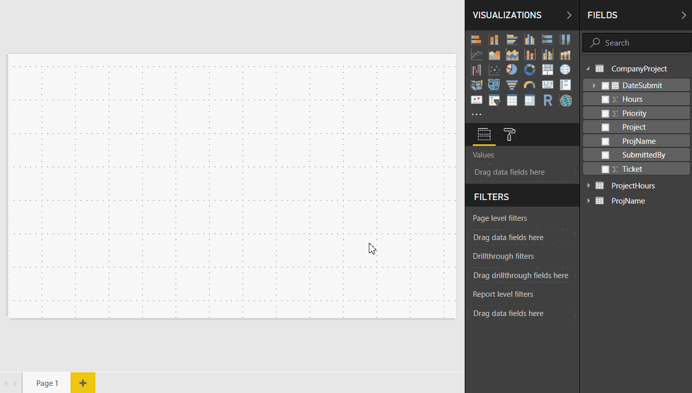

# ทำงานกับมุมมองรายงานใน Power BI DesktopWork with Report view in Power BI Desktop

ถ้าคุณเคยทำงานกับ Power BI คุณย่อมทราบว่า Power BI สามารถสร้างรายงานที่แสดงเปอร์สเปกทิฟแบบไดนามิกและข้อมูลเชิงลึกในข้อมูลของคุณได้อย่างง่ายดายIf you've been working with Power BI, you know how easy it's to create reports providing dynamic perspectives and insights into your data. Power BI ยังมีคุณลักษณะขั้นสูงอื่น ๆ ใน Power BI DesktopPower BI also has more advanced features in Power BI Desktop. ด้วย Power BI Desktop คุณสามารถสร้างคิวรีขั้นสูง ผสมรวมข้อมูลจากหลายแหล่งข้อมูล สร้างความสัมพันธ์ระหว่างตาราง และอื่นๆ ได้With Power BI Desktop, create advanced queries, mashup data from multiple sources, create relationships between tables, and more.

Power BI Desktop รวมด้วยกับ *มุมมองรายงาน* ซึ่งคุณสามารถสร้างหน้ารายงานที่มีการแสดงผลด้วยภาพจำนวนกี่หน้าก็ได้Power BI Desktop includes a *Report view*, where you can create any number of report pages with visualizations. มุมมองรายงานใน  Power BI Desktop ให้ประสบการณ์ในการออกแบบที่ค่อนข้างเหมือนกับมุมมองการแก้ไขของรายงานใน *บริการ Power BI*Report view in Power BI Desktop provides a similar design experience to the report's editing view in the *Power BI service*. คุณสามารถย้ายการแสดงภาพไปรอบ ๆ คัดลอกและวาง ผสาน และอื่น ๆYou can move visualizations around, copy and paste, merge, and so on.

ความแตกต่างคือ เมื่อใช้ Power BI Desktop คุณสามารถทำงานกับคิวรีของคุณ และสร้างแบบจำลองข้อมูลของคุณ เพื่อให้แน่ใจว่า ข้อมูลรองรับข้อมูลเชิงลึกที่ดีที่สุดในรายงานของคุณThe difference between them is when using Power BI Desktop, you can work with your queries and model your data to make sure your data supports the best insights in your reports. จากนั้นคุณสามารถบันทึกไฟล์ Power BI Desktop ของคุณเมื่อใดก็ตามที่คุณต้องการ ไม่ว่าจะบันทึกลงไดรฟ์ในเครื่อง หรือคลาวด์You can then save your Power BI Desktop file wherever you like, whether it's your local drive or to the cloud.

## ลองมาดูกันLet's take a look!

เมื่อคุณเริ่มโหลดข้อมูลใน Power BI Desktop คุณจะเห็นมุมมองรายงานกับพื้นที่ว่างเปล่า พร้อมกับลิงก์ที่ช่วยให้คุณเพิ่มข้อมูลไปยังรายงานของคุณได้When you first load data in Power BI Desktop, you'll see the Report view with a blank canvas, with links to help you add data to your report.

คุณสามารถสลับไปมาระหว่าง **รายงาน** **ข้อมูล** และ **ความสัมพันธ์** โดยการเลือกไอคอนในแผงนำทางด้านซ้าย:You can switch between **Report**, **Data**, and **Relationship** views by selecting the icons in the left-hand navigation pane:

เมื่อคุณเพิ่มบางข้อมูลแล้ว คุณสามารถเพิ่มเขตข้อมูลไปยังการแสดงผลด้วยภาพแบบใหม่ในพื้นที่ว่างOnce you've added some data, you can add fields to a new visualization in the canvas.

เมื่อต้องการเปลี่ยนชนิดของการแสดงผลด้วยภาพ คุณสามารถเลือกได้ในพื้นที่ว่าง จากนั้นเลือกชนิดใหม่ใน **การแสดงผลด้วยภาพ**To change the type of visualization, you can select it on the canvas, then select a new type in **Visualizations**.

> [!TIP]
> ตรวจสอบให้แน่ใจว่าได้ทดลองกับชนิดการแสดงภาพอื่นBe sure to experiment with different visualization types. การแสดงผลด้วยภาพของคุณควรจะต้องสื่อข้อมูลในข้อมูลของคุณอย่างชัดเจนIt's important your visualization convey information in your data clearly.

รายงานจะมีหน้าเปล่าอย่างน้อยหนึ่งหน้าเพื่อเริ่มต้นใช้งานA report will have at least one blank page to start. หน้าที่ปรากฏในบานหน้าต่างตัวนำทางที่อยู่ทางด้านซ้ายของพื้นที่ว่างPages appear in the navigator pane just to the left of the canvas. คุณสามารถเพิ่มการเรียงลำดับทั้งหมดของการแสดงภาพลงในหน้า แต่จะต้องไม่เพิ่มมากเกินไปYou can add all sorts of visualizations to a page, but it's important not to overdo it. การแสดงผลด้วยภาพมากเกินไปในหน้าจะทำให้ดูยุ่งเหยิง และยากในการค้นหาข้อมูลที่ถูกต้องToo many visualizations on a page make it look busy and difficult to find the right information. คุณสามารถเพิ่มหน้าใหม่ลงในรายงานของคุณYou can add new pages to your report. เพียงแค่คลิกที่ **หน้าใหม่** บน ribbonJust click **New Page** on the ribbon.

เมื่อต้องการลบหน้า คลิกที่ **X** บนแท็บของหน้าที่ด้านล่างของมุมมองรายงานTo delete a page, click the **X** on the page's tab at the bottom of the Report view.

> [!NOTE]
> รายงานและการแสดงผลด้วยภาพไม่สามารถปักหมุดลงในแดชบอร์ดจาก Power BI DesktopReports and visualizations can't be pinned to a dashboard from Power BI Desktop. เมื่อต้องการทำเช่นนั้น คุณจะต้องเผยแพร่จาก Power BI Desktopไปยังไซต์ Power BI ของคุณTo do that, you'll need to publish to your Power BI site. สำหรับข้อมูลเพิ่มเติม ให้ดู [เผยแพร่ชุดข้อมูลและรายงานจาก Power BI Desktop](desktop-upload-desktop-files.md)For more information, see [Publish datasets and reports from Power BI Desktop](desktop-upload-desktop-files.md).

## คัดลอกและวางระหว่างรายงานCopy and paste between reports

คุณสามารถใช้วิชวลจากรายงาน Power BI Desktop หนึ่งรายงาน และวางลงในรายงานอื่นได้อย่างง่ายดายYou can easily take a visual from one Power BI Desktop report and paste it into another report. เพียงแค่ใช้แป้นพิมพ์ลัด Ctrl + C เพื่อคัดลอกวิชวลรายงานของคุณSimply use the Ctrl+C keyboard shortcut to copy your report visual. ในรายงาน Power BI Desktop อื่นๆ ให้ใช้ Ctrl + V เพื่อวางวิชวลลงในรายงานอื่นๆIn the other Power BI Desktop report, use Ctrl+V to paste the visual into the other report. คุณสามารถเลือกภาพได้ครั้งละหนึ่งวิชวลหรือสามารถเลือกภาพทั้งหมดบนหน้าเพื่อคัดลอก จากนั้นวางลงในรายงาน Power BI Desktop ปลายทางYou can select one visual at a time, or all visuals on a page to copy, then paste into the destination Power BI Desktop report.

ความสามารถในการคัดลอกและวางภาพจะมีประโยชน์สำหรับผู้ที่สร้าง และอัปเดตรายงานหลายรายงานเป็นประจำThe ability to copy and paste visuals is useful for people who build and updates multiple reports frequently. เมื่อคัดลอกระหว่างไฟล์ การตั้งค่าและการจัดรูปแบบที่ตั้งไว้อย่างชัดเจนในบานหน้าต่างการจัดรูปแบบจะดำเนินการไปข้างหน้าWhen copying between files, settings and formatting that have been explicitly set in the formatting pane will carry forward, while visual elements relying on a theme or the default settings automatically update to match the theme of the destination report. ดังนั้นเมื่อคุณได้รับการจัดรูปแบบภาพในแบบที่คุณต้องการแล้ว คุณสามารถคัดลอกและวางภาพนั้นลงในรายงานใหม่และเก็บรักษางานการจัดรูปแบบที่ดีทั้งหมดไว้ได้So when you get a visual formatted and looking just the way you want, you can copy and paste that visual into new reports and preserve all that good formatting work.

หากเขตข้อมูลในแบบโมเดลของคุณแตกต่างกัน คุณจะเห็นข้อผิดพลาดบนวิชวลและคำเตือนเกี่ยวกับเขตข้อมูลนั้นๆ ที่ไม่มีอยู่If the fields in your model are different, you'll see an error on the visual and a warning about which fields don't exist. ข้อผิดพลาดคล้ายกับสิ่งที่คุณเห็นเมื่อคุณลบเขตข้อมูลในแบบจำลองที่ใช้ภาพอยู่The error is similar to the experience you see when you delete a field in the model that a visual is using.

เมื่อต้องการแก้ไขข้อผิดพลาด เพียงแค่แทนเขตข้อมูลที่ใช้งานไม่ได้ด้วยเขตข้อมูลที่คุณต้องการใช้จากแบบจำลองในรายงานที่คุณได้วางภาพไว้To correct the error, just replace the broken fields with the fields you want to use from the model in the report to which you pasted the visual. หากคุณกำลังใช้ภาพแบบกำหนดเอง คุณต้องนำเข้าภาพแบบกำหนดเองนั้นลงในรายงานปลายทางIf you're using a custom visual, you must also import that custom visual to the destination report.

## ซ่อนหน้ารายงานHide report pages

เมื่อคุณสร้างรายงาน คุณสามารถซ่อนหน้าจากรายงานWhen you create a report, you can also hide pages from a report. นี่อาจเป็นประโยชน์ถ้าคุณจำเป็นต้องสร้างข้อมูลพื้นฐานหรือวิชวลในรายงาน แต่ไม่ต้องการให้ผู้อื่นสามารถมองเห็นหน้าเหล่านั้น เช่น เมื่อคุณสร้างตารางหรือวิชวลสนับสนุนที่ใช้ในหน้ารายงานอื่นๆThis approach might be useful if you need to create underlying data or visuals in a report, but you don't want those pages to be visible to others, such as when you create tables or supporting visuals that are used in other report pages. มีเหตุผลสร้างสรรค์มากมายที่คุณอาจต้องการสร้างหน้ารายงาน และซ่อนหน้ารายงานนั้นจากรายงานที่คุณต้องการเผยแพร่There are many other creative reasons you might want to create a report page, then hide it from a report you want to publish.

การซ่อนหน้ารายงานเป็นเรื่องง่ายHiding a report page is easy. เพียงแค่คลิกขวาบนแท็บหน้ารายงาน และเลือก **ซ่อน** จากเมนูที่ปรากฏขึ้นSimply right-click on the report page tab, and select **Hide** from the menu that appears.

คุณควรทราบข้อควรพิจารณาบางประการเมื่อทำการซ่อนหน้ารายงานThere are a few considerations to keep in mind when hiding a report page:

* คุณยังคงสามารถดูมุมมองรายงานที่ซ่อนไว้ใน Power BI Desktop แม้ว่าชื่อของหน้าจะเป็นสีเทา ในรูปต่อไปนี้ หน้าที่ 4 ถูกซ่อนอยู่You can still see a hidden report view when in Power BI Desktop, even though the page's title is grayed out. In the following image, Page 4 is hidden.

    

* คุณ *ไม่สามารถ* ดูหน้ารายงานที่ซ่อนไว้เมื่อดูรายงานในบริการ Power BIYou *cannot* see a hidden report page when viewing the report in the Power BI service.

* การซ่อนหน้ารายงาน *ไม่ใช่* มาตรการรักษาความปลอดภัยHiding a report page is *not* a security measure. ผู้ใช้ยังคงสามารถเข้าถึงหน้าได้ และเนื้อหาจะยังคงสามารถเข้าถึงได้โดยใช้ตัวเจาะเข้าถึงรายละเอียด และวิธีการอื่น ๆThe page can still be accessed by users, and its content is still accessible using drill-through, and other methods.

* เมื่อซ่อนหน้าแล้ว ในโหมดมุมมองจะไม่แสดงลูกศรนำทางโหมดมุมองWhen a page is hidden, when in View mode, no view-mode navigation arrows are shown.
