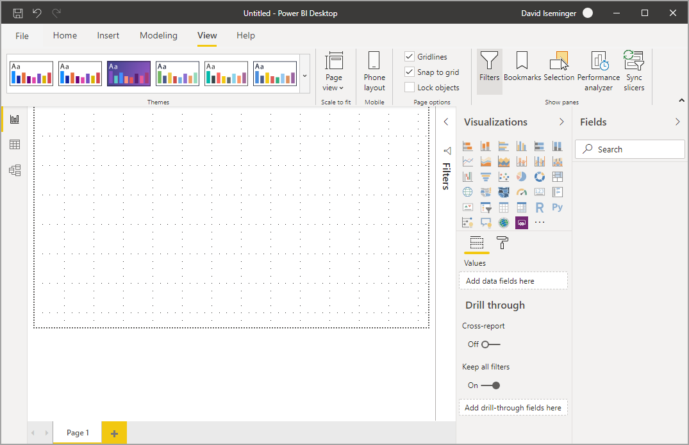

# ใช้ชุดแถบเครื่องมือที่อัปเดตแล้วใน Power BI Desktop (ตัวอย่าง)Use the updated ribbon in Power BI Desktop

Power BI Desktop ได้ปรับปรุงแถบเครื่องมือ เพื่อปรับแต่งลักษณะและประสบการณ์การใช้งานให้ตรงกับผลิตภัณฑ์อื่นๆ ของ Microsoft เช่น Microsoft Office มากขึ้นPower BI Desktop has revised its ribbon to better align its appearance and experience with other Microsoft products, such as Microsoft Office.

## วิธีการเปิดใช้งานริบบิ้นที่ปรับปรุงแล้วHow to enable the updated ribbon

โดยทั่วไปแถบเครื่องมือที่อัปเดตแล้วจะพร้อมใช้งานเริ่มต้นในการปล่อย Power BI Desktop ในเดือนพฤษภาคม 2020The updated ribbon is generally available beginning with the May 2020 release of Power BI Desktop. เริ่มด้วยการอัปเดตประจำเดือนมีนาคม 2020 แถบเครื่องมือที่อัปเดตแล้วจะเปิดใช้งานตามการตั้งค่าเริ่มต้นStarting with the March 2020 update, the updated ribbon is on by default. 

## คุณลักษณะของแถบเครื่องมือที่อัปเดตแล้วFeatures of the updated ribbon

ประโยชน์ของการอัปเดตริบบิ้นของเรามีจุดมุ่งหมายเพื่อให้ประสบการณ์การใช้งานทั่วทั้ง Power BI Desktop ตลอดจนผลิตภัณฑ์อื่นๆ ของ Microsoft ใช้งานได้ง่ายและเป็นที่คุ้นเคยThe benefits of updating our ribbon are intended to make the experience across Power BI Desktop, as well as other Microsoft products, easy and familiar. 

สิทธิประโยชน์เหล่านี้สามารถจัดกลุ่มเป็นประเภทดังต่อไปนี้:These benefits can be grouped into the following categories:

* **รูปลักษณ์ สัมผัส และการจัดระเบียบที่ดีขึ้น** ไอคอนและฟังก์ชันการทำงานในริบบิ้นของ Power BI Desktop ที่อัปเดตแล้วจะถูกจัดให้สอดคล้องกับรูปลักษณ์ความรู้สึกและการจัดระเบียบรายการริบบิ้นที่พบในแอปพลิเคชัน Office**Improved look, feel, and organization** - icons and functionality in the updated Power BI Desktop ribbon are aligned to the look, feel, and organization of ribbon items found in Office applications.

    

* **แกลเลอรีธีมที่ใช้งานง่าย** - แกลเลอรีธีมซึ่งพบได้ใน **มุมมอง** ริบบิ้น ที่มีรูปลักษณ์ที่คุ้นเคยของแกลเลอรีชุดรูปแบบ PowerPoint**An intuitive Themes gallery** - the Themes gallery, found in the **View** ribbon, has the familiar look and feel of the PowerPoint themes gallery. ดังนั้นรูปภาพในริบบิ้น จะแสดงให้คุณเห็นว่าชุดรูปแบบการเปลี่ยนแปลงนั้นจะมีลักษณะอย่างไรหากนำไปใช้กับรายงานของคุณ เช่น การผสมสีและแบบอักษรAs such, the images in the ribbon show you what the theme changes will look like if applied to your report, such as the color combinations and fonts. 

    

* **เนื้อหาริบบิ้นแบบไดนามิกตามมุมมองของคุณ** - ในริบบิ้น ที่มีอยู่สำหรับ Power BI Desktop ไอคอนหรือคำสั่งที่ไม่พร้อมใช้งานนั้นเป็นสีเทาเพียงอย่างเดียวทำให้เกิดการใช้งานน้อยที่สุด**Dynamic ribbon content based on your view** - in the existing ribbon for Power BI Desktop, icons or commands that weren't available were simply grayed out, creating a less-than-optimal experience. ด้วยริบบิ้นที่อัปเดตไอคอนจะแสดงและจัดเรียงแบบไดนามิกเพื่อให้คุณรู้อยู่เสมอว่าตัวเลือกใดที่พร้อมใช้งานสำหรับคุณWith the updated ribbon, icons are dynamically displayed and arranged, so that you always know which options are available to you, in context.

* **ริบบิ้นเส้นเดียวเมื่อยุบจะช่วยให้คุณประหยัดพื้นที่** - ข้อดีอีกประการของริบบิ้นที่ได้รับการอัพเดตคือความสามารถในการยุบริบบิ้นลงในบรรทัดเดียวโดยแสดงรายการริบบิ้นแบบไดนามิกตามบริบทของคุณ**A single-line ribbon, when collapsed, saves you space** - another benefit of the updated ribbon is the ability to collapse the ribbon itself into a single line, dynamically displaying ribbon items based on your context. 

    

* **Keytip เพื่อนำทางและเลือกปุ่ม** เพื่อช่วยในการนำทางริบบิ้น คุณสามารถกด **Alt + คีย์ Windows** เพื่อเปิดใช้งาน keytip ได้**Keytips to navigate and select buttons** - to help navigate the ribbon, you can press **Alt + Windows Key** to activate keytips. เมื่อเปิดใช้งานแล้ว คุณสามารถกดคีย์ที่แสดงบนแป้นพิมพ์เพื่อนำทางได้Once activated, you can press the shown keys on your keyboard to navigate.

    

* **สตริงการจัดรูปแบบแบบกำหนดเอง** - นอกเหนือจากการตั้งค่าสตริงรูปแบบแบบกำหนดเองในบานหน้าต่าง *คุณสมบัติ* แล้วคุณยังสามารถตั้งค่าเหล่านั้นในริบบิ้นได้อีกด้วย**Custom format strings** - in addition to setting custom format strings in the *Properties* pane, you can also set them in the ribbon. เลือกหน่วยวัดหรือคอลัมน์ที่คุณต้องการปรับแต่งและแท็บบริบท **เครื่องมือวัด** หรือ **เครื่องมือคอลัมน์** จะปรากฏขึ้น ทั้งนี้ขึ้นอยู่กับการเลือกของคุณด้วยSelect the measure or column you want to customize and a **Measure tools** or **Column tools** contextual tab appears, depending on your selection. ในส่วนการจัดรูปแบบของแท็บ คุณสามารถพิมพ์สตริงรูปแบบแบบกำหนดเองลงในกล่องดรอปดาวน์ได้โดยตรงIn that tab's formatting section, you can type your custom format string directly into the dropdown box.

    

* **การเข้าถึง** - แถบชื่อเรื่อง ริบบิ้น และเมนูไฟล์จะสามารถเข้าถึงได้อย่างสมบูรณ์**Accessibility** - the title bar, ribbon, and file menu are fully accessible. กด Ctrl + F6 เพื่อนำทางไปยังส่วนริบบิ้นPress Ctrl + F6 to navigate to the ribbon section. เมื่อถึงตอนนั้นคุณสามารถใช้ **Tab** เพื่อเลื่อนระหว่างแถบด้านบนและด้านล่าง และใช้ปุ่มลูกศรเพื่อย้ายระหว่างองค์ประกอบได้Once there, you can use **Tab** to move between the top and bottom bars, and use arrow keys to move between elements.

นอกเหนือจากการเปลี่ยนแปลงที่มองเห็นได้ ริบบิ้นที่อัปเดตแล้วยังช่วยให้เราทำการอัปเดตในอนาคตไปยังริบบิ้นของ Power BI Desktop และเช่นรายการต่อไปนี้:In addition to those visible changes, an updated ribbon also lets us make future updates to Power BI Desktop, and its ribbon, such as the following:

* สร้างตัวควบคุมที่ยืดหยุ่นและใช้งานง่ายขึ้นในริบบิ้น เช่น แกลเลอรีภาพCreate more flexible and intuitive controls in the ribbon, such as the visuals gallery
* เพิ่มธีม *สีดำ* และ *สีเทาเข้ม* ของ Office ให้กับ Power BI DesktopAdd the *black* and *dark gray* Office themes to Power BI Desktop
* ปรับปรุงความสามารถในการเข้าถึงImprove accessibility

## ขั้นตอนถัดไปNext steps
มีข้อมูลหลากหลายประเภทที่คุณสามารถเชื่อมต่อโดยใช้ Power BI DesktopThere are all sorts of data you can connect to using Power BI Desktop. สำหรับข้อมูลเพิ่มเติมเกี่ยวกับแหล่งข้อมูล โปรดดูทรัพยากรต่อไปนี้:For more information on data sources, check out the following resources:

* [Power BI Desktop คืออะไรWhat is Power BI Desktop?](../fundamentals/desktop-what-is-desktop.md)
* [แหล่งข้อมูลใน Power BI DesktopData Sources in Power BI Desktop](../connect-data/desktop-data-sources.md)
* [จัดรูปทรงและรวมข้อมูลด้วย Power BI DesktopShape and Combine Data with Power BI Desktop](../connect-data/desktop-shape-and-combine-data.md)
* [เชื่อมต่อกับเวิร์กบุ๊ก Excel ใน Power BI DesktopConnect to Excel workbooks in Power BI Desktop](../connect-data/desktop-connect-excel.md)   
* [ป้อนข้อมูลลงใน Power BI Desktop โดยตรงEnter data directly into Power BI Desktop](../connect-data/desktop-enter-data-directly-into-desktop.md)   
