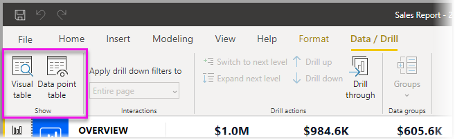
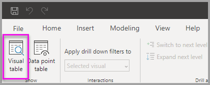
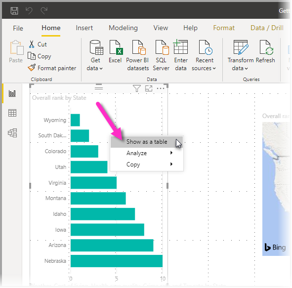
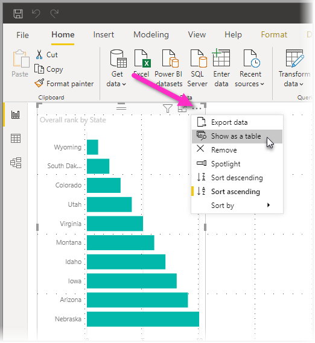
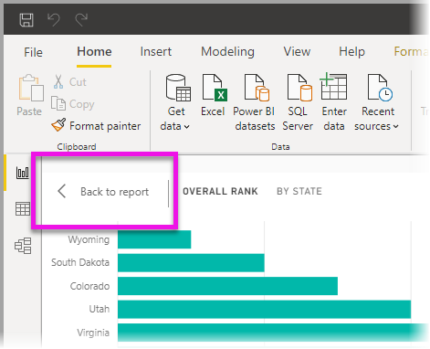
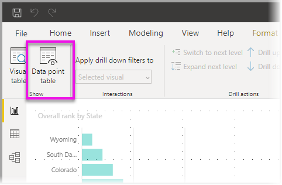

# ใช้ตารางวิชวลและตารางจุดข้อมูลใน Power BI DesktopUse Visual table and Data point table in Power BI Desktop
ใน **Power BI Desktop** คุณสามารถเจาะลึกรายละเอียดของการแสดงผลใด ๆ และดูข้อมูลพื้นฐานหรือระเบียนข้อมูลสำหรับวิชวลที่เลือก ให้อยู่ในรูปข้อความได้In **Power BI Desktop** you can drill into the details of a visualization, and see textual representations of the underlying data or the individual data records for the selected visual. คุณลักษณะเหล่านี้ บางครั้งเรียกว่าการ *คลิกผ่าน* หรือ *ดูรายละเอียด* หรือ *เข้าถึงรายละเอียด*These features are sometimes referred to as *click-through*, *drill-through*, or *drill-through to details*.

คุณสามารถใช้ **ตารางวิชวล** เพื่อดูข้อมูลในวิชวลในรูปแบบตาราง หรือใช้ **ตารางจุดข้อมูล** เพื่อดูตารางของข้อมูลที่ใช้ในการคำนวณจุดข้อมูลเดียวYou can use **Visual table** to view the data in a visual as a table, or use **Data point table** to view a table of the data used to calculate a single data point. 

>[!IMPORTANT]
>**ตารางวิชวล** และ **ตารางจุดข้อมูล** รองรับเฉพาะชนิดการแสดงภาพต่อไปนี้:**Visual table** and **Data point table** support only the following visualization types:
>  - แผนภูมิแท่งBar chart
>  - Column chartColumn chart
>  - แผนภูมิโดนัทDonut chart
>  - แผนที่แถบสีFilled map
>  - แผนภูมิกรวยFunnel
>  - แผนที่Map
>  - Pie chartPie chart
>  - แผนที่ต้นไม้Treemap

## ใช้ตารางวิชวลใน Power BI DesktopUse Visual table in Power BI Desktop

**ตารางวิชวล** แสดงข้อมูลเบื้องต้นในการแสดงภาพ**Visual table** shows you the data underlying a visualization. **ตารางวิชวล** ปรากฏในแท็บ **ข้อมูล/เข้าถึงรายละเอียด** ในส่วน **แสดง** ของแถบเครื่องมือ เมื่อวิชวลถูกเลือก**Visual table** appears in the **Data/Drill** tab in the **Show** section of the ribbon when a visual is selected.

คุณยังสามารถดูข้อมูลได้โดยการคลิกขวาบนการแสดงภาพ แล้ว เลือก **แสดงข้อมูล** จากเมนูที่ปรากฏ หรือ โดยการเลือก **ตัวเลือกเพิ่มเติม** (...) ในมุมขวาบนของการแสดงภาพ และจากนั้นเลือก **แสดงในรูปแบบตาราง**You can also see the data by right-clicking on a visualization, and then selecting **Show Data** from the menu that appears; or by selecting **More options** (...) in the upper-right corner of a visualization, and then selecting **Show as a table**.

&nbsp;&nbsp;

> [!NOTE]
> คุณต้องโฮเวอร์เมาส์เหนือจุดข้อมูลในวิชวล เพื่อให้มีเมนูคลิกขวาYou must be hovering over a data point in the visual for the right-click menu to be available.

เมื่อคุณเลือก **ตารางวิชวล** หรือ **ตารางจุดข้อมูล** พื้นที่ของ Power BI Desktop จะแสดงทั้งวิชวล และข้อมูลพื้นฐานของข้อมูลWhen you select **Visual table** or **Data point table**, the Power BI Desktop canvas displays both the visual and the textual representation of the data. ใน *มุมมองแนวนอน* วิชวลจะแสดงอยู่ครึ่งบนของพื้นที่ ส่วนข้อมูลจะแสดงอยู่ครึ่งล่าง ดังรูปต่อไปนี้In the *horizontal view*, the visual is displayed on the top half of the canvas, and the data is shown on the bottom half. 

คุณยังสามารถสลับระหว่างมุมมองแนวนอน และ *มุมมองแนวตั้ง* โดยการเลือกไอคอนที่มุมบนขวาได้You can toggle between the horizontal view and a *vertical view* by selecting the icon in the upper-right corner of the canvas.

เพื่อกลับไปยังรายงาน เลือก **< กลับไปที่รายงาน** ในมุมบนซ้ายของพื้นที่ทำงานTo get back to the report, select **< Back to Report** in the upper-left corner of the canvas.

## ใช้ตารางจุดข้อมูลใน Power BI DesktopUse Data point table in Power BI Desktop

คุณยังสามารถโฟกัสไปที่ข้อมูลหนึ่งระเบียนในวิชวล และเจาะลึกลงข้อมูลข้างในYou can also focus on one data record in a visualization, and drill into the data behind it. เพื่อใช้ **ตารางจุดข้อมูล** ให้เลือกการแสดงภาพ จากนั้นเลือก **ตารางจุดข้อมูล** ในแท็บ **ข้อมูล/เข้าถึงรายละเอียด** ในส่วน **เครื่องมือวิชวล** ของแถบเครื่องมือ แล้วจึงเลือกจุดข้อมูลหรือแถวบนการแสดงภาพTo use **Data point table**, select a visualization, then select **Data point table** in the **Data/Drill** tab in the **Visual Tools** section of the ribbon, and then select a data point or row on the visualization. 

> [!NOTE]
> ถ้าปุ่ม **ตารางจุดข้อมูล** ในแถบเครื่องมือถูกปิดใช้งาน และแสดงเป็นสีเทา แสดงว่า การแสดงผลภาพที่เลือกไม่รองรับ **ตารางจุดข้อมูล**If the **Data point table** button in the ribbon is disabled and grayed-out, it means the selected visualization does not support **Data point table**.

คุณยังสามารถคลิกขวาที่องค์ประกอบข้อมูล และเลือก **ตารางจุดข้อมูล** จากเมนูที่ปรากฏขึ้นYou can also right-click a data element and select **Data point table** from the menu that appears.

เมื่อคุณได้เลือก **ตารางจุดข้อมูล** สำหรับองค์ประกอบข้อมูล พื้นที่ทำงานของ Power BI Desktop จะแสดงข้อมูลทั้งหมดที่เกี่ยวข้องกับองค์ประกอบที่เลือกWhen you select **Data point table** for a data element, the Power BI Desktop canvas displays all the data associated with the selected element. 

เพื่อกลับไปยังรายงาน เลือก **< กลับไปที่รายงาน** ในมุมบนซ้ายของพื้นที่ทำงานTo get back to the report, select **< Back to Report** in the upper-left corner of the canvas.

> [!NOTE]
>**ตารางจุดข้อมูล** มีข้อจำกัดดังต่อไปนี้:**Data point table** has the following limitations:
> - คุณไม่สามารถเปลี่ยนข้อมูลในมุมมอง **ตารางจุดข้อมูล** และบันทึกกลับไปยังรายงานได้You can't change the data in the **Data point table** view and save it back to the report.
> - คุณไม่สามารถใช้ **ตารางจุดข้อมูล** เมื่อวิชวลของคุณใช้หน่วยวัดจากการคำนวณในกลุ่มหน่วยวัด (หลายมิติ)You can't use **Data point table** when your visual uses a calculated measure in a (multidimensional) measure group.
> - คุณไม่สามารถใช้ **ตารางจุดข้อมูล** เมื่อคุณเชื่อมต่อกับแบบจำลองสดแบบหลายมิติ (MD)You can't use **Data point table** when you are connected to a live multidimensional (MD) model.

## ขั้นตอนถัดไปNext steps
มีการจัดรูปแบบและการจัดการข้อมูลที่หลากหลายใน **Power BI Desktop**There are all sorts of report formatting and data management features in **Power BI Desktop**. ลองดูทรัพยากรต่อไปนี้สำหรับตัวอย่างบางส่วน:Check out the following resources for a few examples:

* [ใช้การจัดกลุ่ม และจัดช่องเก็บใน Power BI DesktopUse grouping and binning in Power BI Desktop](desktop-grouping-and-binning.md)
* [ใช้เส้นตาราง, จัดชิดกับเส้นตาราง, ลําดับบนแกน Z, การจัดแนว และการแจกจ่ายในรายงาน Power BI DesktopUse gridlines, snap-to-grid, z-order, alignment and distribution in Power BI Desktop reports](desktop-gridlines-snap-to-grid.md)

