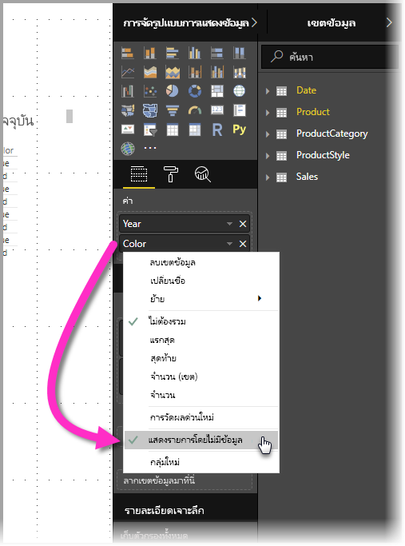
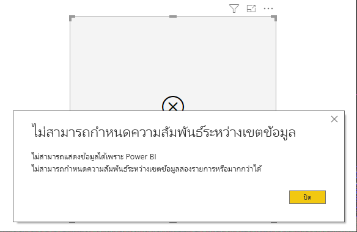
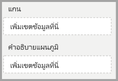
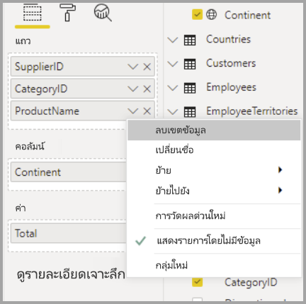

# แสดงรายการที่ไม่มีหน่วยข้อมูลใน Power BIShow items with no data in Power BI

Power BI ช่วยให้คุณเห็นข้อมูลจากแหล่งข้อมูลหลายๆ แห่งPower BI lets you visualize all sorts of data from various sources. เมื่อสร้างการแสดงผลด้วยภาพ Power BI จะแสดงข้อมูลที่เกี่ยวข้องเท่านั้นเพื่อจะจัดการวิธีแสดง ข้อมูลอย่างเหมาะสมWhen creating a visual, Power BI only shows relevant data when creating a visual to properly manage how data is presented and displayed. Power BI จะกำหนดเองว่าข้อมูลอันไหนที่เกี่ยวข้องโดยอ้างอิงตามการกำหนดค่าของการแสดงภาพและแบบจำลองข้อมูลเบื้องต้นPower BI determines which data is relevant based on the configuration of the visual, and the underlying data model. บทความนี้อธิบายให้เห็นการทำงานของ Power BI ว่าเป็นอย่างไร เมื่อกำหนดข้อมูลที่เกี่ยวข้องด้วยตัวอย่างที่แสดงวิธีการกำหนดค่าThis article describes how Power BI behaves when determining relevant data, with examples that illustrate how determinations are made.

## การกำหนดข้อมูลที่เกี่ยวข้องDetermining relevant data

เมื่อต้องเริ่มต้นทำความเข้าใจวิธี Power BI กำหนดข้อมูลที่เกี่ยวข้องในการแสดงผล ให้พิจารณาตารางนี้ในฐานะตัวอย่างอย่างง่ายTo get started understanding how Power BI determines which data is relevant to display, let's consider a table as a simple example. การใช้แบบจำลองที่แสดงในส่วน[แบบจำลองข้อมูลตัวอย่าง](#example-data-model) ซึ่งอยู่ที่ส่วนท้ายของบทความนี้ พิจารณาการสร้างตารางด้วยการตั้งค่าต่อไปนี้:Using the model represented in the [example data model](#example-data-model) section, found at the end of this article, consider building a table with the following settings:

**1. รวมกลุ่มที่มาจากตารางเดียวกัน:** *ผลิตภัณฑ์ [สี] - ผลิตภัณฑ์ [ขนาด]* **1. Groups from the same table:** *Product[Color] - Product[Size]*

|*ผลิตภัณฑ์ [สี]**Product[Color]*  |*ผลิตภัณฑ์ [ขนาด]**Product[Size]*  |
|---------|---------|
|สีฟ้าBlue     |ขนาดใหญ่Large         |
|สีฟ้าBlue     |ขนาดปานกลางMedium         |
|สีฟ้าBlue     |ขนาดเล็กSmall         |
|สีแดงRed     |ขนาดใหญ่Large         |

ในตัวอย่างนี้ Power BI จะ แสดงชุดข้อมูลรวมกันของ *[สี-ขนาด]* ที่อยู่ในตาราง *[ผลิตภัณฑ์]*In this example, Power BI displays the combinations of *[Color-Size]* that exist in the table *[Product]*. 

ทีนี้ลองมาดูการรวมข้อมูลแบบอื่น:Now let's look at a different combination:

**2. รวมกลุ่มที่มาจากต่างแหล่งแต่มีตารางและหน่วยวัดเกี่ยวข้องโดยตรง:** *สไตล์ผลิตภัณฑ์ [เสร็จสิ้น] - ผลิตภัณฑ์ [สี] - ผลรวม(ยอดขาย[ปริมาณ])***2. Groups from different but directly related tables and a measure:** *ProductStyle[Finish] - Product[Color] - Sum(Sales[Quantity])*

|*สไตล์ผลิตภัณฑ์ [สิ้นสุด]**ProductStyle[Finish]*  |*ผลิตภัณฑ์ [สี]**Product[Color]*  |*[ผลรวมปริมาณ]**[SumQuantity]*  |
|---------|---------|---------|
|ผิวมันวาวGloss     |สีฟ้าBlue         |1010         |
|ผิวด้านMatte     |สีฟ้าBlue         |1515         |

ในตัวอย่างนี้ Power BI แสดงเฉพาะชุดข้อมูลรวมกันที่มีอยู่In this example, Power BI displays only combinations that exist. ยกตัวอย่างเช่น ระบบจะไม่แสดงผล ("ไม่มี" + "สีน้ำเงิน") หรือ ("ผิวด้าน" + "สีแดง") เพราะชุดข้อมูลรวมกันเหล่านั้นไม่มีอยู่ในแบบจำลองFor example, it will not display ("None" + "Blue") or ("Matte" + "Red") because those combinations do not exist in the model. เงื่อนไขซึ่งเป็นตัวกำหนดว่าชุดข้อมูลรวมกันที่ยังอยู่ชุดไหนจะมีค่า *ผลรวม(ยอดขาย[ปริมาณ])* อยู่และจะไม่ถูกปล่อยไว้ให้ว่างเปล่าThe condition that determines which combinations exist is the value for *Sum(Sales[Quantity])* not being blank.

ลองมาดูตัวอย่างในกรณีอื่น:Let's look at a different case: 

**3. รวมกลุ่มที่มาจากต่างแหล่งซึ่งมีตารางเกี่ยวข้องกันโดยตรงแต่ไม่มีหน่วยวัด:** *สไตล์ผลิตภัณฑ์ [เสร็จสิ้น] - ผลิตภัณฑ์ [สี]***3. Groups from different but related tables and no measure:** *ProductStyle[Finish] - Product[Color]*

|*สไตล์ผลิตภัณฑ์ [เสร็จสิ้น]**ProductStyle[Finish]*  |*ผลิตภัณฑ์ [สี]**Product[Color]*  |
|---------|---------|
|ผิวมันวาวGloss     |สีฟ้าBlue         |
|ผิวมันวาวGloss     |สีแดงRed         |
|ผิวด้านMatte     |สีฟ้าBlue         |

เนื่องจากมีหน่วยวัดไม่ชัดเจนและทั้งสองตารางมีความเกี่ยวข้องกันโดยตรง Power BI จึงพยายามใส่หน่วยวัดเพื่อจำกัดการรวมกันของชุดข้อมูลSince there is no explicit measure and the two tables are directly related, Power BI attempts to inject a measure to constrain the combinations that result. ในกรณีนี้ Power BI จะใส่หน่วยวัด *CALCULATE(COUNTROWS('Product'))* ซึ่งไม่ควรถูกทิ้งไว้ให้ว่างเพราะ *ผลิตภัณฑ์* คือตารางที่ใช้ร่วมกันในทั้งสองตารางIn this case, Power BI injects a *CALCULATE(COUNTROWS('Product'))* measure, which should not be blank, since *Product* is the table that is common to both tables.

ด้วยเหตุนั้น Power BI จึงแสดงชุดข้อมูลรวมกันที่มีรายการในตารางผลิตภัณฑ์ ซึ่งไม่รวมชุดข้อมูลของ *("ไม่มี" + "สีน้ำเงิน")* และ *("ผิวด้าน" + "สีแดง")*As such, Power BI displays the combinations that do have entries in the Product table, which excludes the combinations of *("None" + "Blue")* and *("Matte" + "Red")*.

**4. รวมกลุ่มจากตารางอื่นและไม่มีความเกี่ยวข้องกัน****4. Groups from different and unrelated tables**

ตัวอย่างแบบจำลองไม่มีการรวมนี้ แต่ถ้าเป็นกลุ่มจากตารางอื่นและไม่มีความเกี่ยวข้องกัน Power BI จะไม่สามารถเชื่อมสองคอลัมน์The sample model doesn't have this combination, but if there were groups from different and unrelated tables, Power BI would not be able to relate two columns. ผลลัพธ์จะเป็นการรวมข้ามตารางของค่าทั้งหมดในแต่ละคอลัมน์The result would be a crossjoin of all the values of each column. ในสถานการณ์นั้น Power BI จะแจ้งข้อผิดพลาดเป็นปัญหาประเภท *การรวมแบบไม่มีข้อจำกัด* เนื่อง จากการรวมข้ามเช่นนั้นฐานข้อมูลต้องใช้ข้อมูลจำนวนมหาศาลในการคำนวณและไม่สามารถให้ข้อมูลจำนวนมากขนาดนั้นกับผู้ใช้ได้In that situation, Power BI issues an error of type *unconstrained join*, because such cross joins are expensive to compute in the database, and do not provide very much information to a user. 

## แสดงรายการโดยไม่มีข้อมูลShowing items with no data

ในส่วนก่อนหน้านี้อธิบายถึงวิธีที่ Power BI กำหนดว่าข้อมูลไหนเกี่ยวข้องกันและจะนำไปขึ้นแสดงผลThe previous section described how Power BI determines which data is relevant to display. แต่อาจจะมีเวลาที่คุณ *ต้องการ* จะแสดงรายการที่ไม่มีข้อมูลBut there may be times when you *want* to show items with no data. 

ฟีเจอร์การ **แสดงรายการที่ไม่มีข้อมูล** ช่วยให้คุณสามารถ รวมแถวข้อมูลและคอลัมน์ที่ไม่มีข้อมูลหน่วยวัด (ไม่มีค่าหน่วยวัด) ได้The **Show items with no data** feature enables you to do exactly that - include data rows and columns that don't contain measure data (blank measure values).

เมื่อต้องการเปิดใช้งานฟีเจอร์ **แสดงรายการที่ไม่มีข้อมูล** ให้คุณเลือกการแสดงผลด้วยภาพแล้วใน **เขตข้อมูล** ให้คลิกขวาที่เขตข้อมูลและเลือก **แสดงรายการที่ไม่มีข้อมูล** จากเมนูที่ ปรากฏซึ่งแสดงในรูปต่อไปนี้:To enable the **Show items with no data** feature select a visual, then in the **Fields** well, right-click the field and select **Show items with no data** from the menu that appears, as shown in the following image:

ฟีเจอร์การ **แสดงรายการที่ไม่มีข้อมูล** จะ *ไม่มี* ผลใดๆ ในสถานการณ์ต่อไปนี้:The **Show items with no data** feature does *not* have effect in the following circumstances:

* ไม่มีหน่วยวัดถูกเพิ่มเข้ามาในการแสดงผลด้วยภาพ และกลุ่มคอลัมน์กลุ่มก็มาจากตารางเดียวกันThere's no measure added to the visual, and the grouping columns come from the same table
* สำหรับกลุ่มที่ไม่เกี่ยวข้องกัน Power BI จะไม่เรียกใช้คิวรีสำหรับกลุ่มการแสดงภาพซึ่งไม่เกี่ยวข้องกันGroups are unrelated; Power BI doesn't run queries for visuals that have unrelated groups
* หน่วยวัดไม่มีความเกี่ยวข้องกับกลุ่มใด ๆ เพราะหน่วยวัดจะไม่เคยถูกทิ้งไว้ให้ว่างสำหรับการรวมชุดข้อมูลบางชุดเท่านั้นThe measure is unrelated to any of the groups; this is because the measure will never be blank for only some group combinations
* แต่ก็มีตัวกรองหน่วยวัดที่ผู้ใช้เป็นคนกำหนดเองซึ่งไม่รวมหน่วยวัดที่ว่างเปล่า -ยกตัวอย่างเช่น: *ยอดขาย > 0*There's a user-defined measure filter that excludes blank measures - for example: *SalesAmount > 0*

### วิธีแสดงรายการที่ไม่มีหน่วยข้อมูลHow Show items with no data works

กรณีที่การใช้งานที่น่าสนใจที่สุดสำหรับการ **แสดงรายการที่ไม่มีข้อมูล** คือตอนที่แสดงรายการออกมาแล้วยังมีหน่วยวัดอยู่The most interesting use cases of **Show items with no data** are when measures are present. ลองมาดูสถานการณ์เมื่อกลุ่มจากตารางเดียวกัน หรืออาจเกี่ยวข้องกันในแบบจำลองLet's look at the situation when the groups are from the same table, or can be related through a path in the model. ตัวอย่างเช่น *สไตล์ผลิตภัณฑ์* มีความเกี่ยวข้องโดยตรงกับ *ผลิตภัณฑ์* และทางอ้อมก็มีความเกี่ยวข้องกับ *การขาย*, *สไตล์ผลิตภัณฑ์* และ *ประเภทผลิตภัณฑ์* อาจเกี่ยวข้องกันผ่านตาราง *ผลิตภัณฑ์* และอื่น ๆ ได้For example, *ProductStyle* is directly related to *Product* and indirectly related to *Sales*, *ProductStyle* and *ProductCategory* can be related through the *Product* table, and so on.

มาดูอีกสักสองสามกรณีที่น่าสนใจ และการเปรียบเทียบเมื่อเปิดและปิดการ **แสดงรายการที่ไม่มีข้อมูล**Let's look at a couple interesting cases, and compare when **Show items with no data** is off and then on. 

**1. จัดกลุ่มคอลัมน์จากตารางเดียวกัน:** *ผลิตภัณฑ์ [สี] - ผลิตภัณฑ์ [ขนาด] - ผลรวม(ยอดขาย[ปริมาณ])***1. Grouping columns from the same table:** *Product[Color] - Product[Size] - Sum(Sales[Quantity])*

วิธีการปรากฏขึ้นของการ **แสดงรายการที่ไม่มีข้อมูล** พร้อมการปิดใช้งานฟีเจอร์:How it appears with **Show items with no data** feature off:

|*ผลิตภัณฑ์ [สี]**Product[Color]*  |*ผลิตภัณฑ์ [ขนาด]**Product[Size]*  |*[ผลรวมปริมาณ]**[SumQuantity]*  |
|---------|---------|---------|
|สีฟ้าBlue     |ขนาดปานกลางMedium         |1515         |
|สีฟ้าBlue     |ขนาดเล็กSmall         |1010         |

วิธีปรากฏขึ้นของการ **แสดงรายการที่ไม่มีข้อมูล** พร้อมการเปิดใช้งานฟีเจอร์:How it appears with **Show items with no data** feature on:

|*ผลิตภัณฑ์ [สี]**Product[Color]*  |*ผลิตภัณฑ์ [ขนาด]**Product[Size]*  |*[ผลรวมปริมาณ]**[SumQuantity]*  |
|---------|---------|---------|
|สีฟ้าBlue     |ขนาดใหญ่Large         |         |
|สีฟ้าBlue     |ขนาดปานกลางMedium         |1515         |
|สีฟ้าBlue     |ขนาดเล็กSmall         |1010         |
|สีแดงRed     |ขนาดใหญ่Large         |         |

โปรดสังเกตวิธีที่ชุดข้อมูลรวมกันใหม่ทั้งสองปรากฏขึ้นพร้อมกันกับการเปิดใช้งานฟีเจอร์: *สีน้ำเงิน - ขนาดใหญ่* และ *สีแดง - ขนาดใหญ่*Notice how two new combinations showed up with the feature turned on: *Blue - Large* and *Red - Large*. รายการทั้งสองนั้นมี *ปริมาณ* ไม่สอดคล้องกับตาราง *ยอดขาย*Both of those entries have no corresponding *Quantity* in the *Sales* table. อย่างไรก็ตาม ทั้งสองก็ยังแสดงผลในตารางของ *ผลิตภัณฑ์*However, they show up in the *Product* table.

**2. จัดกลุ่มคอลัมน์จากตารางที่เกี่ยวข้อง:** *สไตล์ผลิตภัณฑ์ [เสร็จสิ้น] - ผลิตภัณฑ์ [สี] - ผลรวม(ยอดขาย[ปริมาณ])***2. Grouping columns from related tables:** *ProductStyle[Finish] - Product[Color] - Sum(Sales[Quantity])*

วิธีการปรากฏขึ้นของการ **แสดงรายการที่ไม่มีข้อมูล** พร้อมการปิดใช้งานฟีเจอร์:How it appears with **Show items with no data** feature off:

|*สไตล์ผลิตภัณฑ์ [เสร็จสิ้น]**ProductStyle[Finish]*  |*ผลิตภัณฑ์ [สี]**Product[Color]*  |*[ผลรวมปริมาณ]**[SumQuantity]*  |
|---------|---------|---------|
|ผิวมันวาวGloss     |สีฟ้าBlue         |1010         |
|ผิวด้านMatte     |สีฟ้าBlue         |1515         |

วิธีปรากฏขึ้นของการ **แสดงรายการที่ไม่มีข้อมูล** พร้อมการเปิดใช้งานฟีเจอร์:How it appears with **Show items with no data** feature on:

|*สไตล์ผลิตภัณฑ์ [เสร็จสิ้น]**ProductStyle[Finish]*  |*ผลิตภัณฑ์ [สี]**Product[Color]*  |*[ผลรวมปริมาณ]**[SumQuantity]*  |
|---------|---------|---------|
|ผิวมันวาวGloss     |สีฟ้าBlue         |1010         |
|ผิวมันวาวGloss     |สีแดงRed         |         |
|ผิวด้านMatte     |สีฟ้าBlue         |1515         |
|ไม่มีNone     |         |         |

แจ้งให้ทราบเกี่ยวกับวิธีการทำให้ *(ผิวมันวาน - สีแดง)* และ *(ไม่มี, ว่างเปล่า)* ปรากฏเป็นชุดข้อมูลรวมกันNotice how *(Gloss-Red)* and *(None, blank)* appeared as combinations. นี่คือเหตุผลที่กระบวนการปรากฏขึ้น:Here is the reason they appeared:
* Power BI จะพิจารณา สไตล์ผลิตภัณฑ์ [เสร็จสิ้น] ก่อนจะเลือกค่าทั้งหมดเพื่อแสดงผล - แสดงผลออกมาเป็นผิวมันวาว, ผิวด้าน, ไม่มีPower BI first considered ProductStyle[Finish] and selected all the values to display - this resulted in Gloss, Matte, None.
* ใช้แต่ละค่าเหล่านี้ Power BI เลือกรายการ *ผลิตภัณฑ์ [สี]* ทั้งหมดที่สอดคล้องกันUsing each of these values, Power BI selected all the corresponding *Product[Color]* entries 
* เนื่องจากค่า *ไม่มี* ไม่สอดคล้องกับ *ผลิตภัณฑ์ [สี]* ใดๆ การตั้งค่าว่าว่างเปล่าจึงปรากฏขึ้นSince *None* does not correspond to any *Product[Color]*, a blank appears for that value

สิ่งสำคัญที่จะต้องทราบคือกลไกการเลือกค่าสำหรับคอลัมน์เป็นไปตามลำดับ และอาจจะสามารถเรียกว่าเป็น การ *รวมภายนอกด้านซ้าย* ระหว่างตารางIt's important to note that the mechanism of selecting values for the columns is order-dependent, and can be thought of as a *Left outer join* operation between tables. ถ้าลำดับของคอลัมน์มีการเปลี่ยนแปลง ผลลัพธ์ก็จะเปลี่ยนแปลงได้เช่นกันIf the order of the columns is changed, the results will change as well.

ลองมาดูตัวอย่างของการเปลี่ยนแปลงลำดับและผลกระทบที่เกิดจากการเปลี่ยนแปลงLet's look at an example of changing the order, and how it impacts results. นี่เป็นรายการตัวอย่างเดียวกันกับในส่วนที่ **2** นี้แต่ลำดับจะมีการเปลี่ยนแปลงไปThis is the same as item **2** in this section, with the ordering changed.

**ผลิตภัณฑ์ [สี] - สไตล์ผลิตภัณฑ์ [เสร็จสิ้น] - สรุป(ยอดขาย[จำนวน])****Product[Color] - ProductStyle[Finish] - Sum(Sales[Quantity])**

วิธีปรากฏขึ้นของการ **แสดงรายการที่ไม่มีข้อมูล** พร้อมการเปิดใช้งานฟีเจอร์:How it appears with **Show items with no data** feature on:

|*ผลิตภัณฑ์ [สี]**Product[Color]* |*สไตล์ผลิตภัณฑ์ [เสร็จสิ้น]**ProductStyle[Finish]*  |*[ผลรวมปริมาณ]**[SumQuantity]*  |
|---------|---------|---------|
|สีฟ้าBlue     |ผิวมันวาวGloss         |1010         |
|สีฟ้าBlue     |ผิวด้านMatte         |1515         |
|สีแดงRed     |ผิวมันวาวGloss         |         |

ในกรณีนี้โปรดสังเกตว่าวิธีการที่ *สไตล์ผลิตภัณฑ์ [เสร็จสิ้น] =ไม่มี* ไม่ปรากฏในตารางIn this case, notice how *ProductStyle[Finish]=None* does not appear in the table. นั่นเป็นเพราะว่าในกรณีนี้ Power BI ตอนแรกเลือกค่า *สี* ทั้งหมดในตาราง *ผลิตภัณฑ์*This is because, in this case, Power BI first selected all the *Color* values in the *Product* table. จากนั้น Power BI จะเลือกค่าที่มีข้อมูล *เสร็จสิ้น* และมีความสอดคล้องกันในแต่ละสีThen for each color, Power BI selected the corresponding *Finish* values that contained data. เพราะค่า *ไม่มี* ไม่ปรากฏในการรวมของ *สี* ใดๆ เพราะมันไม่ได้ถูกเลือกSince *None* does not show up in any combination of *Color*, it is not selected.

## ลักษณะการทำงานของวิชวล Power BIPower BI visual behavior

เมื่อเปิดใช้งานฟีเจอร์ **แสดงรายการที่ไม่มีข้อมูล** บนเขตข้อมูลใดเขตข้อมูลหนึ่งในวิชวล ฟีเจอร์นี้จะเปิดใช้งานโดยอัตโนมัติสำหรับเขตข้อมูลอื่นๆ ทั้งหมดที่อยู่ใน *กลุ่มของวิชวล* หรือลำดับชั้นเดียวกันWhen **Show items with no data** is enabled on one field in a visual, the feature is automatically enabled for all other fields that are in that same *visual bucket* or hierarchy. กลุ่มหรือลำดับชั้นของวิชวลอาจเป็น **แกน** หรือ **คำอธิบายแผนภูมิ** หรือ **ประเภท** **แถว** หรือ **คอลัมน์** ได้A visual bucket or hierarchy can be its **Axis** or **Legend**, or **Category**, **Rows** or **Columns**.

ตัวอย่างเช่น บนวิชวลเมทริกซ์ด้วยสี่เขตข้อมูลในกลุ่ม **แถว** ถ้าหนึ่งเขตข้อมูลมีฟีเจอร์ **แสดงรายการที่ไม่มีข้อมูล** ที่เปิดใช้งานแล้ว รายการทั้งหมดในเมทริกซ์จะเปิดใช้งานFor example, on a Matrix visual with four fields in the **Rows** bucket, if one field has **Show items with no data** enabled, all items in the matrix will have it enabled. ในรูปต่อไปนี้ ฟีเจอร์ **แสดงรายการที่ไม่มีข้อมูล** ถูกเปิดใช้งานบนเขตข้อมูลแรกในกลุ่ม **แถว** เขตข้อมูล *SupplierID*In the following image, the **Show items with no data** is enabled on the first field in the **Rows** bucket, the *SupplierID* field. เขตข้อมูลอื่น ๆ ในกลุ่ม **แถว** มีการเปิดใช้งานโดยอัตโนมัติเช่นกันThe other fields in the **Rows** bucket have it automatically enabled as well.

ในทางตรงกันข้าม เขตข้อมูล *ทวีป* ที่แสดงในกลุ่ม **คอลัมน์***ไม่มีฟีเจอร์***แสดงรายการที่ไม่มีข้อมูล** ที่เปิดใช้งานโดยอัตโนมัติIn contrast, the *Continent* field shown in the **Columns** bucket does *not* have **Show items with no data** automatically enabled. 

ลักษณะการทำงานของวิชวลนี้มักจะเห็นได้เมื่อมีการแปลงวิชวลเป็นชนิดอื่น ตัวอย่างเช่น การแปลงวิชวลเมทริกซ์เป็นวิชวลตารางThis visual behavior is often seen when a visual is converted to a different type, for example, converting a Matrix visual to a table visual. ในการแปลงดังกล่าว ฟีเจอร์ **แสดงรายการที่ไม่มีข้อมูล** จะถูกเปิดใช้งานโดยอัตโนมัติสำหรับเขตข้อมูลใด ๆ ที่ย้ายไปยังกลุ่มที่เขตข้อมูลในกลุ่มนั้นมีฟีเจอร์ที่เปิดใช้งานแล้วIn such conversions, the **Show items with no data** is automatically enabled for any field moved to a bucket where a field in that bucket has the feature enabled. ในตัวอย่างก่อนหน้า ถ้า *SupplierID* มีฟีเจอร์ **แสดงรายการที่ไม่มีข้อมูล** ที่เปิดใช้งานแล้ว และวิชวลจะถูกแปลงเป็นตาราง เขตข้อมูล *ทวีป* จากกลุ่ม **คอลัมน์** จะถูกย้าย (พร้อมกับเขตข้อมูลในกลุ่ม **แถว**) ไปเป็นกลุ่มเดียวที่ใช้ในวิชวลตาราง - กลุ่ม **ค่า**In the previous example, if *SupplierID* has the **Show items with no data** feature enabled and the visual is converted to a table, the *Continent* field from the **Columns** bucket is moved (along with the fields in the **Rows** bucket) into the only bucket used in a table visual - the **Values** bucket. ดังนั้นเขตข้อมูลทั้งหมดในกลุ่ม **ค่า** จะมีฟีเจอร์ **แสดงรายการที่ไม่มีข้อมูล** ที่เปิดใช้งานแล้วAs such, all fields in the **Values** bucket will have **Show items with no data** enabled.

### การส่งออกข้อมูลExporting data

เมื่อใช้ฟีเจอร์ **ส่งออกข้อมูลสรุป** ลักษณะการทำงานของฟีเจอร์ **แสดงรายการที่ไม่มีข้อมูล** จะเหมือนกันถ้าการส่งออกถูกแปลงเป็นวิชวลตารางWhen using the **Export summarized data** feature, the behavior of the **Show items with no data** feature is the same as if the export were converted to a Table visual. ดังนั้นเมื่อส่งออกวิชวลเช่น วิชวลเมทริกซ์แผนภูมิข้อมูลที่ส่งออกอาจปรากฏขึ้นต่างจากวิชวลที่แสดงAs such, when exporting a visual such as a Chart Matrix visual, the exported data may appear differently than the visual displayed. ทั้งนี้เนื่องจากการแปลงเป็นวิชวลตารางเป็นส่วนหนึ่งของกระบวนการส่งออกจะเปิดใช้งานฟีเจอร์ **แสดงรายการที่ไม่มีข้อมูล** สำหรับเขตข้อมูลทั้งหมดที่จะส่งออกThis is because the conversion to a table visual, as part of the export process, would enable **Show items with no data** for all fields being exported. 

## แบบจำลองข้อมูลตัวอย่างExample data model

ส่วนนี้จะแสดงรูปแบบข้อมูลตัวอย่างที่ใช้เป็นตัวอย่างในบทความนี้This section shows the sample data model used in the examples in this article.

**แบบจำลอง**: **Model**: 

**ข้อมูล**:**Data**:

|ผลิตภัณฑ์ [ID ผลิตภัณฑ์]Product[ProductId]|    ผลิตภัณฑ์ [ชื่อผลิตภัณฑ์]Product[ProductName]|   ผลิตภัณฑ์ [สี]Product[Color]| ผลิตภัณฑ์ [ขนาด]Product[Size]|  ผลิตภัณฑ์ [ID ประเภท]Product[CategoryId]|    ผลิตภัณฑ์ [ID สไตล์]Product[StyleId]|
|---------|---------|---------|---------|---------|---------|
|11  |ผลิตภัณฑ์ตัวที่ 1Prod1  |สีฟ้าBlue   |ขนาดเล็กSmall  |11  |11 |
|22  |ผลิตภัณฑ์ตัวที่ 2Prod2  |สีฟ้าBlue   |ขนาดปานกลางMedium |22  |22 |
|33  |ผลิตภัณฑ์ตัวที่ 3Prod3  |สีแดงRed    |ขนาดใหญ่Large  |11  |11 |
|44  |ผลิตภัณฑ์ตัวที่ 4Prod4  |สีฟ้าBlue   |ขนาดใหญ่Large  |22  |22 |

|ประเภทผลิตภัณฑ์ [รหัสประเภท]ProductCategory[CategoryId]|   ประเภทผลิตภัณฑ์ [ชื่อประเภท]ProductCategory[CategoryName]|
|---------|---------|
|11  |โทรศัพท์Phone   |
|22  |CameraCamera |
|33  |โทรทัศน์TV |

|สไตล์ผลิตตภัณฑ์ [ID สไตล์]ProductStyle[StyleId]| สไตล์ผลิตภัณฑ์ [เสร็จสิ้น]ProductStyle[Finish]|   สไตล์ผลิตภัณฑ์ [ผิวเงาวาว]ProductStyle[Polished]|
|---------|---------|---------|
|11  |ผิวมันวาวGloss  |ใช่Yes |
|22  |ผิวด้านMatte  |ไม่ใช่No |
|33  |ไม่มีNone   |ไม่ใช่No |

|ยอดขาย [ID ยอดขาย]Sales[SaleId]| ยอดขาย [ID ผลิตภัณฑ์]Sales[ProductId]|   ยอดขาย [วันที่]Sales[Date]|    ยอดขาย [ปริมาณ]Sales[Quantity]|
|---------|---------|---------|---------|
|11  |11  |1/1/2012 0:001/1/2012 0:00| 1010 |
|22  |22  |1/1/2013 0:001/1/2013 0:00| 1515 |

## ขั้นตอนถัดไปNext steps

บทความนี้อธิบายวิธีเปิดใช้งานฟีเจอร์การ **แสดงรายการที่ไม่มีข้อมูล** ใน Power BIThis article described how you can enable the **Show items with no data** feature in Power BI. คุณอาจสนใจบทความต่อไปนี้:You might also be interested in the following articles: 

* [สมาชิกเริ่มต้นในแบบจำลองหลายมิติใน Power BIDefault member in multidimensional models in Power BI](../connect-data/desktop-default-member-multidimensional-models.md)
