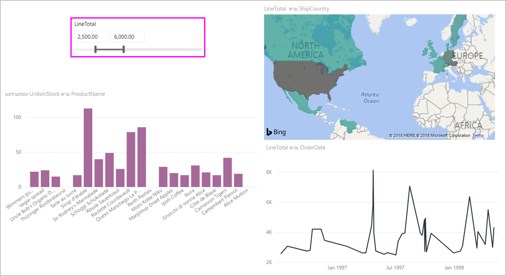

# ใช้ตัวแบ่งส่วนข้อมูลช่วงตัวเลขใน Power BIUse the numeric range slicer in Power BI

[!INCLUDE [applies-to](../includes/applies-to.md)] [!INCLUDE [yes-desktop](../includes/yes-desktop.md)] [!INCLUDE [yes-service](../includes/yes-service.md)][!INCLUDE [applies-to](../includes/applies-to.md)] [!INCLUDE [yes-desktop](../includes/yes-desktop.md)] [!INCLUDE [yes-service](../includes/yes-service.md)]

ด้วยตัวแบ่งส่วนข้อมูลช่วงตัวเลข คุณสามารถใช้ตัวกรองทุกประเภทในคอลัมน์ตัวเลขใดก็ตามในแบบจำลองข้อมูลของคุณได้With the numeric range slicer, you can apply all sorts of filters to any numeric column in your data model. มีสามตัวเลือกสำหรับการกรองข้อมูลตัวเลขของคุณ: ระหว่างตัวเลขน้อยกว่าหรือเท่ากับตัวเลข หรือมากกว่าหรือเท่ากับตัวเลขThere are three options for filtering your numeric data: between numbers, less than or equal to a number, or greater than or equal to a number. เทคนิคง่าย ๆ นี้เป็นวิธีที่มีประสิทธิภาพในการกรองข้อมูลของคุณThis simple technique is a powerful way to filter your data.

## VideoVideo

ในวิดีโอนี้ จะแสดงการสร้างตัวแบ่งส่วนข้อมูลช่วงตัวเลขIn this video, Will walks through creating a numeric range slicer.

> [!NOTE]
> วิดีโอนี้ใช้ Power BI Desktop เวอร์ชันเก่าThis video uses an older version of Power BI Desktop.

<iframe width="560" height="315" src="https://www.youtube.com/embed/zIZPA0UrJyA" frameborder="0" allowfullscreen></iframe> 

## เพิ่มตัวแบ่งส่วนข้อมูลช่วงตัวเลขAdd a numeric range slicer

คุณสามารถใช้ตัวแบ่งส่วนข้อมูลช่วงตัวเลขได้เช่นเดียวกับที่คุณใช้ตัวแบ่งส่วนข้อมูลอื่น ๆYou can use the numeric range slicer like you would use any other slicer. เพียงแค่สร้างวิชวล **ตัวแบ่งส่วนข้อมูล** สำหรับรายงานของคุณ จากนั้นเลือกค่าตัวเลขสำหรับค่า **เขตข้อมูล**Just create a **Slicer** visual for your report, and then select a numeric value for the **Field** value. ในรูปต่อไปนี้ เราได้เลือกเขตข้อมูล **LineTotal**In the following image, we selected the **LineTotal** field.

เลือกลูกศรชี้ลงที่มุมบนขวาของตัวแบ่งส่วนช่วงตัวเลขและเมนูจะปรากฏขึ้นSelect the down-arrow in the upper-right corner of the numeric range slicer and a menu appears.

สำหรับช่วงตัวเลข คุณสามารถเลือกจากตัวเลือกทั้งสามต่อไปนี้:For the numeric range, you can select from the following three options:

* **ระหว่าง****Between**
* **น้อยกว่าหรือเท่ากับ****Less than or equal to**
* **มากกว่าหรือเท่ากับ****Greater than or equal to**

เมื่อคุณเลือก **ระหว่าง** จากเมนู แถบเลื่อนจะปรากฏขึ้นWhen you select **Between** from the menu, a slider appears. คุณสามารถใช้แถบเลื่อนเพื่อเลือกค่าตัวเลขที่อยู่ระหว่างตัวเลขต่าง ๆYou can use the slider to select numeric values that fall between the numbers. บางครั้งส่วนประกอบของการย้ายแถบตัวแบ่งส่วนข้อมูลจะทำให้ยากต่อการใช้ตัวเลขนั้นSometimes the granularity of moving the slicer bar makes it difficult to land exactly on that number. คุณยังสามารถใช้แถบเลื่อนและเลือกกล่องใดก็ได้เพื่อพิมพ์ค่าที่เราต้องการYou can also use the slider and select either box to type in the values we want. ตัวเลือกนี้จะสะดวกเมื่อคุณต้องการแบ่งย่อยในตัวเลขที่ระบุThis option is convenient when you want to slice on specific numbers.

ในรูปต่อไปนี้ หน้ารายงานจะกรองด้วยค่า **LineTotal** ที่อยู่ในช่วงระหว่าง 2500.00 และ 6000.00In the following image, the report page filters for **LineTotal** values that range between 2500.00 and 6000.00.

เมื่อคุณเลือก **น้อยกว่าหรือเท่ากับ** ด้ามจับที่ด้านซ้าย (ค่าต่ำกว่า) ของแถบเลื่อนจะหายไป และคุณสามารถปรับเปลี่ยนเฉพาะขีดจำกัดขอบสูงสุดของแถบเลื่อนดังกล่าวได้When you select **Less than or equal to**, the left (lower value) handle of the slider bar disappears, and you can adjust only the upper-bound limit of the slider bar. ในรูปต่อไปนี้ เราตั้งค่าแถบเลื่อนเป็น 5928.19In the following image, we set the slider bar maximum to 5928.19.

สุดท้ายถ้าคุณเลือก **มากกว่าหรือเท่ากับ** จากนั้นด้ามจับที่ด้านขวา (ค่าสูงกว่า) จะเลื่อนหายไปLastly, if you select **Greater than or equal to**, then the right (higher value) slider bar handle disappears. จากนั้นคุณสามารถปรับค่าต่ำกว่าดังที่เห็นในรูปต่อไปนี้You can then adjust the lower value, as seen in the following image. ตอนนี้ เฉพาะรายการที่มี **LineTotal** มากกว่าหรือเท่ากับ 4902.99 จะแสดงในภาพบนหน้ารายงานNow, only items with a **LineTotal** greater than or equal to 4902.99 display in the visuals on the report page.

## จัดชิดเป็นเลขจำนวนเต็มด้วยตัวแบ่งส่วนช่วงตัวเลขSnap to whole numbers with the numeric range slicer

ตัวแบ่งส่วนช่วงตัวเลขจะจัดชิดเป็นเลขจำนวนเต็มถ้าชนิดข้อมูลของเขตข้อมูลเบื้องต้นเป็น *จำนวนเต็ม*A numeric range slicer snaps to whole numbers if the data type of the underlying field is *Whole Number*. คุณลักษณะนี้ช่วยให้ตัวแบ่งส่วนข้อมูลของคุณสามารถจัดพอดีกับจำนวนเต็มThis feature lets your slicer cleanly align to whole numbers. เขตข้อมูล *ตัวเลขทศนิยม* ช่วยให้คุณสามารถป้อนหรือเลือกเศษส่วนของจำนวนได้*Decimal Number* fields let you enter or select fractions of a number. การจัดรูปแบบที่ตั้งค่าในกล่องข้อความตรงกับชุดการจัดรูปแบบในเขตข้อมูล แม้ว่าคุณจะสามารถพิมพ์ลงหรือเลือกตัวเลขที่เที่ยงตรงกว่าได้The formatting set in the text box matches the formatting set on the field, even though you can type in or select more precise numbers.

## แสดงการจัดรูปแบบด้วยตัวแบ่งส่วนข้อมูลช่วงวันที่Display formatting with the date range slicer

เมื่อคุณใช้ตัวแบ่งส่วนข้อมูลเพื่อแสดงหรือตั้งค่าช่วงวันที่ วันที่จะแสดงในรูปแบบ *วันที่แบบสั้น*When you use a slicer to display or set a range of dates, the dates display in the *Short Date* format. ตำแหน่งที่ตั้งของเบราว์เซอร์หรือระบบปฏิบัติการของผู้ใช้จะกำหนดรูปแบบวันที่The user's browser or operating system locale determine the date format. ดังนั้น รูปแบบนี้จะเป็นรูปแบบการแสดงผล ไม่ว่าจะเป็นการตั้งค่าชนิดข้อมูลสำหรับข้อมูลเบื้องต้นหรือแบบจำลองAs such, it will be the display format no matter what the data type settings are for the underlying data or model.

ตัวอย่างเช่น คุณสามารถใช้รูปแบบวันที่แบบยาวสำหรับชนิดข้อมูลเบื้องต้นYou could, for example, have a long date format for the underlying data type. ในกรณีนี้ รูปแบบวันที่เช่น  *dddd, MMMM d, yyyy* จะจัดรูปแบบวันที่ในภาพหรือสถานการณ์อื่นๆ *เป็นวันพุธที่ 14 มีนาคม 2001*In this case, a date format such as *dddd, MMMM d, yyyy* would format a date in other visuals or circumstances as *Wednesday, March 14, 2001*. แต่ในตัวแบ่งส่วนข้อมูลวันที่ วันที่นั้นจะแสดงในตัวแบ่งส่วนข้อมูลเป็น *03/14/2001*But in the date range slicer, that date displays in the slicer as *03/14/2001*.

การแสดงรูปแบบวันที่แบบสั้นในตัวแบ่งส่วนข้อมูลเพื่อให้มั่นใจถึงความยาวของสตริงคงที่และกระชับภายในตัวแบ่งส่วนข้อมูลDisplaying the Short Date format in the slicer ensures the length of the string stays consistent and compact within the slicer.

## ข้อจำกัดและข้อควรพิจารณาLimitations and considerations

ข้อจำกัดและข้อควรพิจารณาต่อไปนี้จะใช้กับตัวแบ่งส่วนข้อมูลช่วงตัวเลข:The following limitations and considerations apply to the numeric range slicer:

* ตัวแบ่งส่วนข้อมูลช่วงตัวเลขจะกรองทุกแถวต้นแบบในข้อมูลดังกล่าว ไม่ใช่ค่ารวมใด ๆThe numeric range slicer filters every underlying row in the data, not any aggregated value. ตัวอย่างเช่น สมมติว่าคุณใช้เขตข้อมูล *ยอดขาย*For example, let's say that you use a *Sales Amount* field. จากนั้นตัวแบ่งส่วนข้อมูลจะกรองธุรกรรมแต่ละรายการตามยอดขาย ไม่ใช่ผลรวมของยอดขายสำหรับแต่ละจุดข้อมูลของภาพThe slicer then filters each transaction based on the sales amount, not the sum of the sales amount for each data point of a visual.
* ปัจจุบันยังไม่สามารถทำงานร่วมกับหน่วยวัดได้It doesn't currently work with measures.
* คุณสามารถพิมพ์ตัวเลขต่าง ๆ ลงในตัวแบ่งส่วนตัวเลขได้ แม้ว่าจะอยู่นอกช่วงของค่าในคอลัมน์อ้างอิงก็ตามYou can type any number into a numeric slicer, even if it is outside the range of values in the underlying column. ตัวเลือกนี้จะช่วยให้คุณสามารถตั้งค่าตัวกรองได้ หากคุณทราบว่าข้อมูลอาจมีการเปลี่ยนแปลงในอนาคตThis option lets you set up filters if you know the data may change in future.
