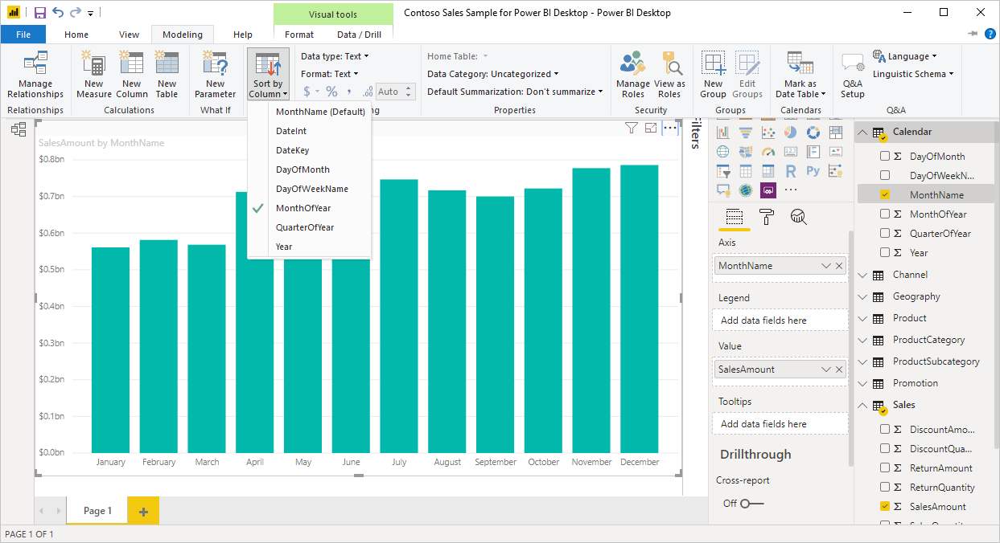

# เรียงลำดับตามคอลัมน์ใน Power BI DesktopSort by column in Power BI Desktop
ใน Power BI Desktop และบริการ Power BI คุณสามารถเปลี่ยนลักษณะของวิชวล โดยเรียงลำดับตามเขตข้อมูลที่แตกต่างกันได้In Power BI Desktop and the Power BI service, you can change how a visual looks by sorting it by different data fields. โดยการเปลี่ยนวิธีการเรียงลำดับวิชวล คุณสามารถเน้นข้อมูลที่คุณต้องการสื่อ และทำให้แน่ใจว่า วิชวลสะท้อนแนวโน้ม (หรือเน้นให้เห็น)By changing how you sort a visual, you can highlight the information you want to convey, and ensure the visual reflects that trend (or emphasis).

ไม่ว่าคุณจะใช้ข้อมูลตัวเลข (เช่น ตัวเลขยอดขาย) หรือข้อมูลข้อความ (เช่น ชื่อรัฐ) คุณสามารถเรียงลำดับการแสดงผลข้อมูลด้วยภาพของคุณ และทำให้แสดงในแบบที่คุณต้องการได้Whether you're using numeric data (such as sales figures) or text data (such as state names), you can sort your visualizations, and make them look like you want them to. Power BI มีความยืดหยุ่นสำหรับการรียงลำดับอย่างมาก และมีเมนูด่วนให้คุณใช้Power BI provides much flexibility for sorting, and quick menus for you to use. เมื่อต้องเรียงลำดับวิชวลใดก็ตาม ให้เลือกเมนู **ตัวเลือกเพิ่มเติม** (... ) เลือก **เรียงลำดับโดย** จากนั้นเลือกเขตข้อมูลที่คุณต้องการเรียงลำดับTo sort any visual, select its **More options** (...) menu, select **Sort by**, and then select the field by which you want to sort.

## ตัวอย่างการเรียงลำดับSorting example
ลองใช้ตัวอย่างที่มีความลึกมากกว่าเดิม และดูว่าทำงานอย่างไรใน Power BI DesktopLet's use an example that has more depth, and see how it works in Power BI Desktop.

การแสดงภาพต่อไปนี้แสดงต้นทุน, ปริมาณ และยอดเงินตามชื่อผู้ผลิตThe following visualization shows costs, quantities, and amounts by manufacturer name. นี่คือการแสดงผลข้อมูลด้วยภาพ ก่อนที่จะทำการเรียงลำดับHere's the visualization as it looks before we do any further sorting:

ในปัจจุบัน วิชวลจะถูกจัดเรียงตามคอลัมน์ **SalesQuantity**The visual is currently sorted by the **SalesQuantity** column. เราสามารถกำหนดคอลัมน์การเรียงลำดับโดยการจับคู่สีของแท่งจากน้อยไปหามากกับคำอธิบายแผนภูมิ แต่มีวิธีที่ดีกว่า: เมนู **ตัวเลือกเพิ่มเติม** ซึ่งคุณเข้าถึงได้โดยการเลือกจุดไข่ปลา (...)We can determine the sort column by matching the color of the ascending bars to the legend, but there's a better way: the **More options** menu, which you access by selecting the ellipses (...).

ตัวเลือกการเรียงลำดับจะเป็นดังนี้:The sorting selections are as follows:

* เขตข้อมูลที่เรียงลำดับในปัจจุบันคือ **SalesQuantity** ระบุโดย **SalesQuantity** เป็นตัวหนานำหน้าด้วยแท่งสีเหลืองThe current sorting field is **SalesQuantity**, indicated by **SalesQuantity** in bold preceded by a yellow bar. 

* ทิศทางการเรียงลำดับปัจจุบันเรียงจากน้อยไปมากดังแสดงโดย **เรียงลำดับจากน้อยไปมาก** เป็นตัวหนานำหน้าด้วยแท่งสีเหลืองThe current sorting direction is ascending, as shown by **Sort ascending** in bold preceded by a yellow bar.

เราจะดูเขตข้อมูลและทิศทางการเรียงลำดับในส่วนถัดไปอีกสองส่วนWe'll look at the sorting field and sorting direction in the next two sections.

## เลือกคอลัมน์ที่จะใช้สำหรับการเรียงลำดับSelect which column to use for sorting
คุณสังเกตเห็นแท่งสีเหลืองที่อยู่ก่อนหน้า **SalesQuantity** ในเมนู **ตัวเลือกเพิ่มเติม** ซึ่งแสดงว่าวิชวลจะเรียงลำดับตามคอลัมน์ **SalesQuantity**You noticed the yellow bar preceding **SalesQuantity** in the **More options** menu, which indicates that the visual is sorted by the **SalesQuantity** column. การเรียงลำดับตามคอลัมน์อื่นเป็นเรื่องง่าย: เลือกจุดไข่ (...) เพื่อแสดงเมนู **ตัวเลือกเพิ่มเติม** เลือก **เรียงลำดับตาม** จากนั้นเลือกคอลัมน์อื่นที่แตกต่างSorting by another column is easy: select the ellipses (...) to show the **More options** menu, select **Sort by**, and then select a different column.

ในรูปต่อไปนี้ เราเลือก **DiscountAmount** เป็นคอลัมน์ที่เราต้องการเรียงลำดับIn the following image, we select **DiscountAmount** as the column by which we want to sort. คอลัมน์นั้นปรากฏเป็นหนึ่งในบรรทัดบนวิชวล แทนที่จะเป็นหนึ่งในแท่งThat column appears as one of the lines on the visual, rather than one of the bars. 

โปรดสังเกตว่าภาพได้เปลี่ยนไปNotice how the visual has changed. ค่าตอนนี้เรียงลำดับจากค่า **DiscountAmount** มากสุด ซึ่งคือ Fabrikam inc. ลงไปถึง Northwind Traders ซึ่งมีค่าต่ำสุดThe values now are ordered from the highest **DiscountAmount** value, Fabrikam Inc., down to the lowest, Northwind Traders. 

แต่อะไรจะเกิดขึ้นถ้าเราต้องการเรียงลำดับจากน้อยไปมาก แทนจากมากไปหาน้อยหรือไม่But what if we want to sort ascending, instead of descending? ส่วนถัดไปแสดงว่ามันง่ายอย่างไรThe next section shows how easy that is to do.

## เลือกลำดับการจัดเรียงSelect the sort order
เมื่อเราดูเมนู **ตัวเลือกเพิ่มเติม** จากรูปภาพก่อนหน้า เราเห็นว่า **เรียงลำดับจากมากไปน้อย** อยู่ในรูปแบบตัวหนานำหน้าด้วยแท่งสีเหลืองWhen we take a closer look at the **More options** menu from the previous image, we see that **Sort descending** is in bold preceded by a yellow bar.

เมื่อเลือก **เรียงลำดับจากมากไปน้อย** นั่นหมายความว่า ภาพจะถูกเรียงลำดับตามคอลัมน์ที่เลือกตามลำดับของค่าที่มากที่สุดเมื่อต้องการค่าน้อยที่สุดWhen **Sort descending** is selected, it means the visual is being sorted by the selected column in order of greatest value to smallest value. ต้องการเปลี่ยนสิ่งนั้นหรือไม่Want to change that? ไม่มีปัญหา เพียงแค่เลือก **เรียงลำดับจากน้อยไปมาก** และลำดับการจัดเรียงของคอลัมน์ที่เลือกจะเปลี่ยนจากค่าน้อยไปหามากที่สุดNo problem, just select **Sort ascending** and the sort order of the selected column changes from smallest to greatest value.

ต่อไปนี้เป็นวิชวลเดียวกันของเรา หลังจากการเปลี่ยนแปลงการเรียงลำดับของ **DiscountAmount**Here's our same visual, after changing the ordering of **DiscountAmount**. สังเกตเห็นว่า ตอนนี้ Northwind Traders เป็นผู้ผลิตแรกที่แสดงในรายการ และ Fabrikam Inc. อยู่ลำดับสุดท้าย ซึ่งตรงกันข้ามกับการเรียงลำดับก่อนหน้าNotice that Northwind Traders is now the first manufacturer listed, and Fabrikam Inc. is the last; the opposite sorting from before.

คุณสามารถเรียงลำดับตามคอลัมน์ใดก็ตามที่มีในวิชวล เราสามารถเลือก **SalesQuantity** ให้เป็นคอลัมน์ที่เราต้องการเรียงลำดับได้อย่างง่ายดาย เพื่อแสดงผู้ผลิตที่มียอดขายสูงที่สุดก่อน และยังคงรักษาคอลัมน์อื่น ๆ ไว้ในวิชวลตามที่ใช้กับผู้ผลิตรายนั้นYou can sort by any column included in the visual; we could have easily selected **SalesQuantity** as the column by which we want to sort, to show the manufacturers with the most sales first, and still retain the other columns in the visual as they apply to that manufacturer. นี่คือวิชวลที่มองเห็นด้วยการตั้งค่าเหล่านี้:Here's a look at the visual with those settings:

## เรียงลำดับโดยใช้การเรียงลำดับตามปุ่มคอลัมน์Sort using the Sort by Column button
มีวิธีอื่นในการเรียงลำดับข้อมูลของคุณ โดยใช้ปุ่ม **เรียงลำดับตามคอลัมน์** ในริบบิ้น **การสร้างแบบจำลอง**There's another way to sort your data, by using the **Sort by Column** button in the **Modeling** ribbon.

วิธีการเรียงลำดับนี้ต้องการให้คุณเลือกคอลัมน์ (เขตข้อมูล) ก่อนเพื่อเรียงลำดับจากบานหน้าต่าง **เขตข้อมูล** จากนั้นเลือก **การสร้างแบบจำลอง** > **เรียงตามคอลัมน์** เพื่อเรียงลำดับวิชวลของคุณThis approach to sorting requires that you first select the column (field) to sort from the **Fields** pane, and then select **Modeling** > **Sort by Column** to sort your visual. ถ้าคุณไม่ได้เลือกคอลัมน์ ปุ่ม **เรียงตามคอลัมน์** จะไม่ทำงานIf you don't select a column, the **Sort by Column** button is inactive.

มาลองดูตัวอย่างที่พบบ่อยกันLet's look at a common example. คุณมีข้อมูลจากแต่ละเดือนของปี และคุณต้องการเรียงตามลำดับเวลาYou have data from each month of the year, and you want to sort it based on chronological order. ขั้นตอนต่อไปนี้แสดงวิธีการดังกล่าว:The following steps show you how:

1. ให้สังเกตว่า เมื่อเลือกวิชวลแต่ไม่มีคอลัมน์ถูกเลือกไว้ในบานหน้าต่าง **เขตข้อมูล** ปุ่ม **เรียงลำดับตามคอลัมน์** จะไม่ทำงาน (เป็นสีเทา)Notice that when the visual is selected but no column is selected in the **Fields** pane, the **Sort by Column** button is inactive (grayed out).
   
   

2. เมื่อเราเลือกคอลัมน์ที่เราต้องการเรียงลำดับ ในบานหน้าต่าง **เขตข้อมูล** ปุ่ม **เรียงลำดับตามคอลัมน์** จะถูกเปิดใช้งานWhen we select the column by which we want to sort, in the **Fields** pane, the **Sort by Column** button becomes active.
   
   
3. ตอนนี้ เลือกวิชวลแล้ว เราสามารถเลือก **MonthOfYear** แทนที่จะเป็นค่าเริ่มต้น **MonthName** และตอนนี้วิชวลเรียงลำดับตามลำดับที่เราต้องการ คือเรียงตามเดือนในปีNow, with the visual selected, we can select **MonthOfYear**, instead of the default **MonthName**, and the visual sorts in the order we want: by the month of the year.
   
   

<!---
This functionality is no longer active. Jan 2020

## Getting back to default column for sorting
You can sort by any column you'd like, but there may be times when you want the visual to return to its default sorting column. No problem. For a visual that has a sort column selected, open the **More options** menu and select that column again, and the visualization returns to its default sort column.

For example, here's our previous chart:

When we go back to the menu and select **SalesQuantity** again, the visual defaults to being ordered alphabetically by **Manufacturer**, as shown in the following image.

With so many options for sorting your visuals, creating just the chart or image you want is easy.
--->

## ขั้นตอนถัดไปNext steps

คุณอาจมีความสนใจบทความต่อไปนี้:You might also be interested in the following articles:

* [ใช้ตัวเจาะเข้าถึงรายละเอียดข้ามรายงานใน Power BI DesktopUse cross-report drillthrough in Power BI Desktop](desktop-cross-report-drill-through.md)
* [ตัวแบ่งส่วนข้อมูลใน Power BISlicers in Power BI](../visuals/power-bi-visualization-slicers.md)
