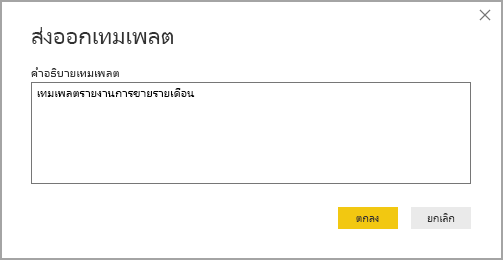
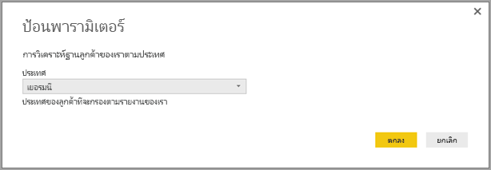

# สร้างเทมเพลตของรายงานสำหรับ Power BI DesktopCreate report templates for Power BI Desktop

ด้วย **Power BI Desktop** คุณสามารถสร้างรายงานที่น่าสนใจซึ่งแบ่งปันข้อมูลเชิงลึกทั่วทั้งองค์กรของคุณWith **Power BI Desktop,** you can create compelling reports that share insights across your entire organization. ด้วย **เทมเพลต** Power BI Desktop คุณสามารถทำให้งานของคุณคล่องตัวขึ้นด้วยการสร้างเทมเพลตรายงานโดยยึดตามเทมเพลตที่มีอยู่ ซึ่งคุณหรือผู้ใช้รายอื่นในองค์กรของคุณสามารถใช้เป็นจุดเริ่มต้นสำหรับโครงร่าง แบบจำลองข้อมูล และคิวรี่ของรายงานใหม่With Power BI Desktop **templates**, you can streamline your work by creating a report template, based on an existing template, which you or other users in your organization can use as a starting point for a new report's layout, data model, and queries. เทมเพลตใน **Power BI Desktop** ช่วยให้คุณเริ่มต้นได้อย่างรวดเร็วและสร้างมาตรฐานรายงานได้Templates in **Power BI Desktop** help you jump-start and standardize report creation.

## การสร้างเทมเพลตCreating templates

เทมเพลตรายงาน Power BI ประกอบด้วยข้อมูลต่อไปนี้จากรายงานที่สร้างขึ้น:Power BI report templates contain the following information from the report from which they were generated:

* **หน้า** รายงาน ภาพวิชวล และองค์ประกอบวิชวลอื่น ๆReport **pages**, visuals, and other visual elements
* **คำนิยามแบบจำลองข้อมูล** รวมถึงสคีมา ความสัมพันธ์ หน่วยวัด และวัตถุคำนิยามแบบจำลองอื่น ๆThe **data model definition**, including the schema, relationships, measures, and other model definition artifacts
* **คำนิยามคิวรี** ทั้งหมด เช่น คิวรี พารามิเตอร์คิวรี และองค์ประกอบคิวรีอื่นๆAll **query definitions**, such as queries, Query Parameters, and other query elements

สิ่งที่ *ไม่ได้* รวมอยู่ในเทมเพลตคือข้อมูลของรายงานWhat is *not* included in templates is the report's data. 

เทมเพลตรายงานรายงานใช้ส่วนขยายไฟล์ .PBIT (เปรียบเทียบกับรายงาน Power BI Desktop ซึ่งใช้ส่วนขยาย .PBIX)Report templates use the file extension .PBIT (compare to Power BI Desktop reports, which use the .PBIX extension). 

เมื่อต้องการสร้างเทมเพลตรายงาน ให้เลือก **ไฟล์ > ส่งออกแม่ > เทมเพลต Power BI** จากเมนูซึ่งจะแสดงหน้าต่างต่อไปนี้ และแสดงพร้อมท์ให้คุณใส่คำอธิบายสำหรับเทมเพลตTo create a report template, select **File > Export > Power BI template** from the menu, which brings up the following window, which prompts you to provide a description for the template. ในตัวอย่างนี้ คำอธิบายสำหรับเทมเพลตของเราคือ *เทมเพลตรายงานการขายรายเดือน*In this example, our description for the template is *Monthly sales report template.*

เลือก **ตกลง** และคุณจะได้รับพร้อมท์ให้ระบุตำแหน่งไฟล์เพื่อจัดเก็บไฟล์เทมเพลต .PBITSelect **OK** and you're prompted for a file location to store the .PBIT template file.

และนั่นคือเทมเพลตรายงาน Power BI ของคุณถูกสร้างขึ้นในตำแหน่งไฟล์ที่คุณระบุด้วยนามสกุล .PBITAnd that's it, your Power BI report template is created in the file location you specified, with the .PBIT extension.

> [!NOTE]
> โดยทั่วไปไฟล์เทมเพลตรายงาน Power BI นั้นมีขนาดเล็กกว่ารายงาน Power BI Desktop มากเนื่องจากเทมเพลตจะไม่มีข้อมูลใดเลย มีเพียงแค่คำนิยามรายงานเท่านั้นเองPower BI report template files are generally much smaller than a Power BI Desktop report, because templates to not contain any data - just the report definitions themselves. 

## การใช้เทมเพลตUsing templates

เมื่อต้องการใช้เทมเพลตรายงาน Power BI เพียงแค่เปิดเทมเพลตใน Power BI Desktop และเริ่มต้นใช้งานTo use a Power BI report template, simply open it in Power BI Desktop and begin using it. คุณสามารถเปิดเทมเพลรายงาน Power BI ได้สองวิธี:You can open Power BI report templates in two ways:

* ดับเบิลคลิกที่ไฟล์ .PBIT ใดก็ตามเพื่อเรียกใช้ Power BI Desktop โดยอัตโนมัติและโหลดเทมเพลตDouble-click on any .PBIT file to automatically launch Power BI Desktop and load the template
* เลือก **ไฟล์ > นำเข้า > เทมเพลต Power BI** จากภายใน Power BI DesktopSelect **File > Import > Power BI template** from within Power BI Desktop

เมื่อคุณเปิดเทมเพลตรายงาน กล้องโต้ตอบจะปรากฏค่าสำหรับพารามิเตอร์ใดก็ตามที่กำหนดไว้ในรายงานที่มีการใช้เทมเพลตWhen you open a report template, a dialog appears values for any parameters that are defined in the report on which the template is based. ตัวอย่างเช่น หากรายงานวิเคราะห์ลูกค้ายึดตามประเทศหรือภูมิภาคและมีพารามิเตอร์ *ประเทศ* เพื่อระบุฐานลูกค้า พร้อมท์จะปรากฏข้อความแจ้งให้คุณเลือกค่า *ประเทศ* จากรายการค่าที่ระบุเมื่อกำหนดพารามิเตอร์For example, if a report analyzes customers based on country or region and has a *Country* parameter to specify the customer base, a prompt appears for you to select a *Country* value from the list of values that were specified when defining the parameter. 

เมื่อมีการระบุพารามิเตอร์ที่จำเป็นแล้ว คุณจะได้รับพร้อมท์ให้ระบุตำแหน่งของข้อมูลพื้นฐานที่เกี่ยวข้องกับรายงานOnce any required parameters are provided, you're prompted for the location of the underlying data associated with the report. หลังจากนั้นผู้สร้างรายงานปัจจุบันสามารถเชื่อมต่อกับข้อมูลตามข้อมูลประจำตัวของพวกเขาได้The current report creator can then connect to data based on their credentials.

เมื่อมีการระบุพารามิเตอร์และข้อมูลแล้ว รายงานจะถูกสร้างขึ้นซึ่งประกอบด้วยหน้า วิชวล วัตถุแบบจำลองข้อมูล และคิวรีทั้งหมดที่เป็นส่วนหนึ่งของรายงานที่มีการใช้เทมเพลตOnce parameters and data have been specified, a report is created containing all the pages, visuals, data model artifacts, and queries that were part of the report on which the template is based. 

เสร็จแล้ว!That's it. การสร้างและการใช้เทมเพลตรายงานใน Power BI Desktop นั้นง่ายดาย ช่วยให้คุณสร้างเค้าโครงที่น่าสนใจและลักษณะอื่นของรายงาน และแบ่งปันกับผู้อื่นได้อย่างง่ายดายCreating and using report templates in Power BI Desktop is easy, enabling you to easily reproduce compelling layouts and other report aspects, and share them with others.

## ขั้นตอนถัดไปNext steps
นอกจากนี้ คุณอาจสนใจที่จะเรียนรู้เพิ่มเติมเกี่ยวกับ **พารามิเตอร์แบบสอบถาม**:You might also be interested in learning about **Query Parameters**:
* [การใช้พารามิเตอร์แบบสอบถามใน Power BI DesktopUsing Query Parameters in Power BI Desktop?](/power-query/power-query-query-parameters)

นอกจากนี้ยังมีอีกหลายสิ่งที่คุณสามารถทำได้ด้วย Power BI DesktopIn addition, there are all sorts of things you can do with Power BI Desktop. สำหรับข้อมูลเพิ่มเติมเกี่ยวกับขีดความสามารถ กรุณาดูแหล่งทรัพยากรต่อไปนี้:For more information on its capabilities, check out the following resources:

* [Power BI Desktop คืออะไรWhat is Power BI Desktop?](../fundamentals/desktop-what-is-desktop.md)
* [ภาพรวมคิวรี ด้วย Power BI DesktopQuery Overview with Power BI Desktop](../transform-model/desktop-query-overview.md)
* [ชนิดข้อมูลใน Power BI DesktopData Types in Power BI Desktop](../connect-data/desktop-data-types.md)
* [จัดรูปทรง และรวมข้อมูลด้วย Power BI DesktopShape and Combine Data with Power BI Desktop](../connect-data/desktop-shape-and-combine-data.md)
* [งานคิวรี่ทั่วไปใน Power BI DesktopCommon Query Tasks in Power BI Desktop](../transform-model/desktop-common-query-tasks.md)