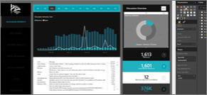
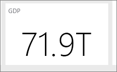

# <a name="tips-and-tricks-for-creating-reports-in-power-bi-desktop"></a><span data-ttu-id="55b07-103">คำแนะนำและเคล็ดลับในการสรา้งรายงานใน Power BI Desktop</span><span class="sxs-lookup"><span data-stu-id="55b07-103">Tips and tricks for creating reports in Power BI Desktop</span></span>
<span data-ttu-id="55b07-104">เพื่อให้ได้รับประโยชน์สูงสุดจากข้อมูลของคุณ บางครั้งคุณก็ต้องการความช่วยเหลือเพิ่มเติมเล็กน้อย</span><span class="sxs-lookup"><span data-stu-id="55b07-104">To get the most out of your data, sometimes you need a little extra help.</span></span> <span data-ttu-id="55b07-105">เราได้รวบรวมคำแนะนำและเคล็ดลับบางประการที่คุณสามารถใช้งานได้ในการสร้างรายงานใน Microsoft Power BI Desktop *และ* ในรุ่น Microsoft Excel 2016 หรือ Excel 2013 Pro-Plus ที่เปิดใช้งาน Power Pivot add-in แล้วและติดตั้งรวมทั้งเปิดใช้งาน Power Query แล้ว</span><span class="sxs-lookup"><span data-stu-id="55b07-105">We’ve put together some tips & tricks you can use when creating reports in the Microsoft Power BI Desktop *and* in Microsoft Excel 2016, or Excel 2013 Pro-Plus editions with the Power Pivot add-in enabled and Power Query installed and enabled.</span></span> 

## <a name="learning-to-use-the-query-editor"></a><span data-ttu-id="55b07-106">การเรียนรู้วิธีใช้ตัวแก้ไขคิวรี</span><span class="sxs-lookup"><span data-stu-id="55b07-106">Learning to use the Query Editor</span></span>
<span data-ttu-id="55b07-107">ตัวแก้ไขคิวรีใน Power BI Desktop จะคล้ายกับความสามารถในการทำงาน Power Query add-in ใน Excel 2013</span><span class="sxs-lookup"><span data-stu-id="55b07-107">Query Editor in Power BI Desktop is similar to the Power Query add-in capability in Excel 2013.</span></span> <span data-ttu-id="55b07-108">นอกจากจะมีบทความเป็นประโยชน์จำนวนมากมายในการสนับสนุน Power BI แล้วคุณยังอาจต้องการตรวจทานเอกสาร Power Query ใน support.office.com เพื่อเริ่มต้นใช้งาน</span><span class="sxs-lookup"><span data-stu-id="55b07-108">While there are several helpful articles in Power BI Support, you might also want to review the Power Query documentation on support.office.com to get started.</span></span>

<span data-ttu-id="55b07-109">คุณสามารถรับข้อมูลเพิ่มเติมได้จาก[ศูนย์แหล่งข้อมูล Power Query](https://support.office.com/article/Microsoft-Power-Query-for-Excel-Help-2b433a85-ddfb-420b-9cda-fe0e60b82a94)</span><span class="sxs-lookup"><span data-stu-id="55b07-109">You can get additional information from the [Power Query Resource Center](https://support.office.com/article/Microsoft-Power-Query-for-Excel-Help-2b433a85-ddfb-420b-9cda-fe0e60b82a94).</span></span>

<span data-ttu-id="55b07-110">คุณยังสามารถดู[การอ้างอิงสูตร](https://support.office.com/Article/Learn-about-Power-Query-formulas-6bc50988-022b-4799-a709-f8aafdee2b2f)ได้อีกด้วย</span><span class="sxs-lookup"><span data-stu-id="55b07-110">You can also view the [Formula Reference](https://support.office.com/Article/Learn-about-Power-Query-formulas-6bc50988-022b-4799-a709-f8aafdee2b2f).</span></span>

## <a name="data-types-in-query-editor"></a><span data-ttu-id="55b07-111">ชนิดข้อมูลในตัวแก้ไขคิวรี</span><span class="sxs-lookup"><span data-stu-id="55b07-111">Data types in Query Editor</span></span>
<span data-ttu-id="55b07-112">เมื่อคุณใช้ตัวแก้ไขคิวรีใน Power BI Desktop เพื่อโหลดข้อมูล เราจะทำการตรวจหาชนิดข้อมูลจากการคาดเดาที่ดีที่สุด</span><span class="sxs-lookup"><span data-stu-id="55b07-112">When using Query Editor in Power BI Desktop to load data, we do a best guess data type detection.</span></span> <span data-ttu-id="55b07-113">เมื่อใช้สูตร บางครั้งระบบจะไม่เก็บการตั้งค่าชนิดข้อมูลที่คอลัมน์ไว้</span><span class="sxs-lookup"><span data-stu-id="55b07-113">When using formulas, sometimes data type settings on columns are not preserved.</span></span> <span data-ttu-id="55b07-114">ตรวจสอบให้แน่ใจว่าประเภทของข้อมูลในคอลัมน์ว่าถูกต้องหรือไม่หลังจากดำเนินการดังต่อไปนี้:  โหลดข้อมูลเบื้องต้นไปยังแท็บคิวรี แถวแรกเป็นหัวกระดาษ เพิ่มคอลัมน์ จัดกลุ่มตาม ผสาน ผนวก และก่อนที่จะกดโหลดข้อมูลเป็นครั้งแรก</span><span class="sxs-lookup"><span data-stu-id="55b07-114">Ensure the data type of columns are correct after doing the following operations:  Load data initially to the query tab, First Row as Header, Add column, Group by, Merge, Append, and before pressing loading the data for the first time.</span></span>

<span data-ttu-id="55b07-115">ข้อควรระลึกที่สำคัญประการหนึ่ง คือ: ตัวเอียงในเส้นตารางข้อมูล ไม่ได้หมายความว่า ตั้งค่าชนิดข้อมูลนั้นไม่ถูกต้อง แต่เพียงหมายความว่า ระบบไม่ได้พิจารณาข้อมูลนั้นว่าเป็นข้อความ</span><span class="sxs-lookup"><span data-stu-id="55b07-115">One key thing to remember: italics in the data grid do not mean the data type is correctly set, it just means the data is not considered as Text.</span></span>

## <a name="reference-queries-in-the-query-editor"></a><span data-ttu-id="55b07-116">คิวรีอ้างอิงในตัวแก้ไขคิวรี</span><span class="sxs-lookup"><span data-stu-id="55b07-116">Reference queries in the Query Editor</span></span>
<span data-ttu-id="55b07-117">ในตัวนำทางของตัวแก้ไขคิวรีใน Power BI Desktop เมื่อคุณคลิกขวาที่หนึ่งในคิวรี ตัวเลือกสำหรับ "การอ้างอิง" ก็จะปรากฏขึ้น</span><span class="sxs-lookup"><span data-stu-id="55b07-117">In Query Editor's navigator in Power BI Desktop, when you right-click one of the queries, an option for "Reference" is available.</span></span> <span data-ttu-id="55b07-118">การดำเนินการนี้จะเป็นประโยชน์ด้วยเหตุผลต่อไปนี้:</span><span class="sxs-lookup"><span data-stu-id="55b07-118">This is useful for the following reason:</span></span>

* <span data-ttu-id="55b07-119">เมื่อคุณใช้ไฟล์เป็นแหล่งข้อมูลสำหรับคิวรี เส้นทางสัมบูรณ์ไปยังไฟล์ก็จะได้รับการบันทึกไว้ในคิวรีนั้น</span><span class="sxs-lookup"><span data-stu-id="55b07-119">When you use files as the data source for a query, the absolute path to the file is stored in the query.</span></span> <span data-ttu-id="55b07-120">ขณะใช้ร่วมกันหรือย้ายไฟล์ Power BI Desktop หรือเวิร์กบุ๊ก Excel คุณก็จะประหยัดเวลา เมื่ออัปเดตเส้นทาง ด้วยการอัปเดตคิวรีเพียงครั้งเดียวแทนที่จะเป็นเส้นทาง</span><span class="sxs-lookup"><span data-stu-id="55b07-120">When sharing or moving Power BI Desktop file or Excel workbook, you'll save time when you update the paths by updating it just once rather than the paths.</span></span>

<span data-ttu-id="55b07-121">ตามค่าเริ่มต้น คิวรีทั้งหมดจะโหลดไปยังแบบจำลองข้อมูล</span><span class="sxs-lookup"><span data-stu-id="55b07-121">By default all queries load to the data model.</span></span> <span data-ttu-id="55b07-122">คิวรีบางรายการจะเป็นขั้นตอนระหว่างกระบวนการ และไม่ได้มีไว้สำหรับผู้ใช้</span><span class="sxs-lookup"><span data-stu-id="55b07-122">Some queries are intermediary steps and not intended for end users.</span></span> <span data-ttu-id="55b07-123">เมื่อมีการอ้างอิงคิวรีตามที่ระบุไว้ด้านบน ก็มักจะเป็นกรณีนี้</span><span class="sxs-lookup"><span data-stu-id="55b07-123">When referencing queries as mentioned above, this is often the case.</span></span> <span data-ttu-id="55b07-124">คุณสามารถควบคุมลักษณะการทำงานของการโหลดคิวรีได้โดยคลิกขวาที่คิวรีในตัวนำทาง แล้วสลับตัวเลือก "เปิดใช้งานการโหลด"</span><span class="sxs-lookup"><span data-stu-id="55b07-124">You can control query loading behavior by right-clicking the query in the navigator and toggling the "Enable Load" option.</span></span> <span data-ttu-id="55b07-125">เมื่อ *เปิดใช้งานการโหลด* ไม่มีเครื่องหมายถูกอยู่ข้างๆ คิวรียังคงพร้อมใช้งานในแท็บคิวรี และคุณก็สามารถใช้กับคิวรีอื่นๆ ได้</span><span class="sxs-lookup"><span data-stu-id="55b07-125">When *Enable Load* does not have a checkmark next to it, the query is still available in the query tab and you can use it with other queries.</span></span> <span data-ttu-id="55b07-126">ซึ่งมีประโยชน์อย่างยิ่ง เมื่อใช้งานร่วมกับการผสาน การผนวก และการแปลงข้อมูลอ้างอิง</span><span class="sxs-lookup"><span data-stu-id="55b07-126">It is especially useful in combination with Merge, Append, and Reference transforms.</span></span> <span data-ttu-id="55b07-127">อย่างไรก็ตาม เนื่องจากไม่มีการโหลดผลลัพธ์ของคิวรีลงในรูปแบบข้อมูล คิวรีก็จะไม่กระจายอยู่ในรายการเขตข้อมูลในรายงานของคุณ หรือรูปแบบข้อมูลของคุณ</span><span class="sxs-lookup"><span data-stu-id="55b07-127">However since the query results are not loaded to the data model, the query will not clutter your reports field list or your data model.</span></span> 

## <a name="scatter-charts-need-a-point-identifier"></a><span data-ttu-id="55b07-128">แผนภูมิกระจายต้องมีตัวระบุจุด</span><span class="sxs-lookup"><span data-stu-id="55b07-128">Scatter charts need a point identifier</span></span>
<span data-ttu-id="55b07-129">ใช้ตัวอย่างของตารางอย่างง่ายสำหรับอุณหภูมิและเวลาที่ได้ทำการอ่านข้อมูล</span><span class="sxs-lookup"><span data-stu-id="55b07-129">Taking an example of a simple table of Temperatures and the Time the reading was taken.</span></span> <span data-ttu-id="55b07-130">ถ้าคุณลงจุดค่าเหล่านี้ลงในแผนภูมิกระจายโดยตรง Power BI Desktop ก็จะรวมค่าทั้งหมดไว้เป็นจุดเดียว</span><span class="sxs-lookup"><span data-stu-id="55b07-130">If you plot this directly on a scatter chart, Power BI aggregates all the values into a single point.</span></span> <span data-ttu-id="55b07-131">เมื่อต้องการแสดงจุดข้อมูลแต่ละจุด คุณต้องเพิ่มเขตข้อมูลลงในบักเก็ตรายละเอียดในเขตข้อมูลตามที่เหมาะสม</span><span class="sxs-lookup"><span data-stu-id="55b07-131">To show individual data points, you must add a field to the Details bucket in the field well.</span></span> <span data-ttu-id="55b07-132">วิธีง่ายๆ ในการสร้างตัวระบุจุดใน Power BI Desktop คือ ที่แท็บคิวรี ให้ใช้ตัวเลือก "เพิ่มคอลัมน์ดัชนี" ใน ribbon "เพิ่มคอลัมน์"</span><span class="sxs-lookup"><span data-stu-id="55b07-132">A simple way to do this in Power BI Desktop is on the query tab by using the "Add index column" option on the "Add Column" ribbon.</span></span> 

## <a name="reference-lines-in-your-report"></a><span data-ttu-id="55b07-133">เส้นอ้างอิงในรายงานของคุณ</span><span class="sxs-lookup"><span data-stu-id="55b07-133">Reference lines in your report</span></span>
<span data-ttu-id="55b07-134">คุณสามารถใช้คอลัมน์จากการคำนวณใน Power BI Desktop เพื่อกำหนดเส้นอ้างอิง หรือสายการอ้างอิงได้</span><span class="sxs-lookup"><span data-stu-id="55b07-134">You can use a calculated column in Power BI Desktop to define a reference line.</span></span> <span data-ttu-id="55b07-135">ระบุตารางและคอลัมน์ที่คุณต้องการสร้างเส้นอ้างอิง</span><span class="sxs-lookup"><span data-stu-id="55b07-135">Identify the table and column on which you want to create a reference line.</span></span> <span data-ttu-id="55b07-136">เลือก "คอลัมน์ใหม่" ใน Ribbon และ ในแถบสูตร ให้พิมพ์สูตรต่อไปนี้:</span><span class="sxs-lookup"><span data-stu-id="55b07-136">Select "New Column" in the ribbon and, in the formula bar, type the following formula:</span></span>

```console
Target Value = 100
```

<span data-ttu-id="55b07-137">คอลัมน์จากการคำนวณจะแสดงค่า 100 โดยไม่คำนึงถึงว่าจะใช้งานอยู่ในตำแหน่งใด</span><span class="sxs-lookup"><span data-stu-id="55b07-137">This calculated column will return the value 100 regardless of where it is used.</span></span> <span data-ttu-id="55b07-138">คอลัมน์ใหม่ของคุณจะปรากฏขึ้นในรายการเขตข้อมูล</span><span class="sxs-lookup"><span data-stu-id="55b07-138">Your new column will show up in the Field List.</span></span> <span data-ttu-id="55b07-139">เพิ่มคอลัมน์จากการคำนวณของค่าเป้าหมายลงในแผนภูมิเส้น เพื่อแสดงลักษณะความสัมพันธ์ระหว่างชุดข้อมูลต่างๆ กับเส้นอ้างอิงที่กำหนด</span><span class="sxs-lookup"><span data-stu-id="55b07-139">Add the Target Value calculated column to a line chart to show how any series relates to that specific reference line.</span></span> 

## <a name="sort-by-another-column"></a><span data-ttu-id="55b07-140">จัดเรียงตามคอลัมน์อื่น</span><span class="sxs-lookup"><span data-stu-id="55b07-140">Sort by another column</span></span>
<span data-ttu-id="55b07-141">เมื่อคุณใช้ค่าแบบประเภท (สตริง) ใน Power BI Desktop สำหรับแกนของแผนภูมิ หรือในตัวแบ่งส่วนข้อมูลหรือตัวกรอง ค่าเริ่มต้นของการเรียงลำดับจะเรียงตามตัวอักษร</span><span class="sxs-lookup"><span data-stu-id="55b07-141">When you use a categorical (string) value in Power BI for chart axes or in a slicer or filter, the default order is alphabetical.</span></span> <span data-ttu-id="55b07-142">ถ้าคุณต้องการแทนลำดับนี้ ตัวอย่างเช่น สำหรับสิ่งต่างๆ เช่น วันในสัปดาห์หรือเดือน จากนั้นก็สามารถกำหนดให้ Power BI Desktop เรียงลำดับตามคอลัมน์ต่างๆ</span><span class="sxs-lookup"><span data-stu-id="55b07-142">If you need to override this order, for example for things like days of the week or months, then you can tell Power BI Desktop to sort by a different column.</span></span> <span data-ttu-id="55b07-143">หากต้องการเรียนรู้เพิ่มเติม โปรดดู[เรียงลำดับตามคอลัมน์ใน Power BI Desktop](desktop-sort-by-column.md)</span><span class="sxs-lookup"><span data-stu-id="55b07-143">To learn more, see [Sort by Column in Power BI Desktop](desktop-sort-by-column.md).</span></span>

## <a name="building-maps-more-easily-with-hints-to-bing"></a><span data-ttu-id="55b07-144">การสร้างแมปให้สะดวกขึ้นด้วยคำแนะนำสำหรับ Bing</span><span class="sxs-lookup"><span data-stu-id="55b07-144">Building maps more easily with hints to Bing</span></span>
<span data-ttu-id="55b07-145">Power BI จะรวมการทำงานเข้ากับ Bing เพื่อให้ได้พิกัดแมปเริ่มต้น (กระบวนการที่เรียกว่า การกำหนดพิกัดทางภูมิศาสตร์) ดังนั้นคุณจึงสร้างแมปได้สะดวกขึ้น</span><span class="sxs-lookup"><span data-stu-id="55b07-145">Power BI integrates with Bing to provide default map coordinates (a process called geo-coding) so it's easier for you to create maps.</span></span> <span data-ttu-id="55b07-146">Bing จะใช้อัลกอริทึมและคำแนะนำบางอย่าง เพื่อพยายามรับข้อมูลตำแหน่งที่ถูกต้อง แต่เป็นการคาดเดาที่ดีที่สุด</span><span class="sxs-lookup"><span data-stu-id="55b07-146">Bing uses some algorithms and hints to try to get the right location, but it's a best guess.</span></span> <span data-ttu-id="55b07-147">ถ้าต้องการเพิ่มความเป็นไปได้ในการกำหนดพิกัดทางภูมิศาสตร์ที่ถูกต้อง คุณสามารถใช้เคล็ดลับต่อไปนี้:</span><span class="sxs-lookup"><span data-stu-id="55b07-147">To increase the likelihood of correct geo-coding, you can use the following tips:</span></span>

<span data-ttu-id="55b07-148">เมื่อคุณสร้างแผนที่ คุณมักจะต้องเขียนแผนที่โดยระบุประเทศ/ภูมิภาค รัฐ และเมืองต่าง ๆ</span><span class="sxs-lookup"><span data-stu-id="55b07-148">When you create a map, you're often looking to plot countries/regions, states, and cities.</span></span> <span data-ttu-id="55b07-149">ใน Power BI Desktop ถ้าคุณตั้งชื่อคอลัมน์ตามชื่อทางภูมิศาสตร์ ก็จะช่วยให้ Bing สามารถคาดเดาสิ่งที่คุณต้องการแสดงได้</span><span class="sxs-lookup"><span data-stu-id="55b07-149">In Power BI Desktop, if you name columns after the geographic designation it will help Bing guess what you're looking to display.</span></span> <span data-ttu-id="55b07-150">ตัวอย่างเช่น ถ้าคุณมีเขตข้อมูลชื่อรัฐของสหรัฐอเมริกา เช่น "แคลิฟอร์เนีย" และ "วอชิงตัน" Bing อาจแสดงตำแหน่งที่ตั้งของวอชิงตัน ดีซี แทนรัฐวอชิงตัน สำหรับคำว่า "วอชิงตัน"</span><span class="sxs-lookup"><span data-stu-id="55b07-150">For example, if you have a field of US state names such as "California" and "Washington", Bing might return the location of Washington, DC instead of Washington State for the word "Washington".</span></span> <span data-ttu-id="55b07-151">การตั้งชื่อคอลัมน์ "รัฐ" จะช่วยปรับปรุงการกำหนดพิกัดทางภูมิศาสตร์</span><span class="sxs-lookup"><span data-stu-id="55b07-151">Naming the column "State" will improve the geocoding.</span></span> <span data-ttu-id="55b07-152">เช่นเดียวกับคอลัมน์ที่ใช้ชื่อว่า "ประเทศ" และ "เมือง"</span><span class="sxs-lookup"><span data-stu-id="55b07-152">The same goes for columns named "Country" and "City".</span></span> 

<span data-ttu-id="55b07-153">ชื่อบางชื่อไม่ชัดเจน เมื่อพิจารณาตามบริบทข้อมูลของหลายประเทศ/ภูมิภาค</span><span class="sxs-lookup"><span data-stu-id="55b07-153">Some designations are ambiguous when considered in the context of multiple countries/regions.</span></span> <span data-ttu-id="55b07-154">ในบางกรณี ประเทศ/ภูมิภาคใดประเทศ/ภูมิภาคหนึ่งถือว่า 'รัฐ' เป็น 'จังหวัด' หรือ 'เทศมณฑล' หรือใช้ชื่ออื่น</span><span class="sxs-lookup"><span data-stu-id="55b07-154">In some cases what one country/region considers a 'state' is treated as a 'province' or a 'county' or some other designation.</span></span> <span data-ttu-id="55b07-155">คุณสามารถเพิ่มความแม่นยำของการกำหนดพิกัดทางภูมิศาสตร์ โดยการสร้างคอลัมน์ที่ผนวกหลายเขตข้อมูลเข้าด้วยกัน และใช้คอลัมน์เหล่านั้นเพื่อลงจุดตำแหน่งที่ตั้งของข้อมูล</span><span class="sxs-lookup"><span data-stu-id="55b07-155">You can increase the accuracy of geo-coding by building columns that append multiple fields together and use those for plotting data locations.</span></span> <span data-ttu-id="55b07-156">ตัวอย่างเช่น แทนที่จะระบุเพียงคำว่า "วิลต์เชอร์" คุณสามารถระบุว่า "วิลต์เชอร์ อังกฤษ" เพื่อให้ได้ผลลัพธ์การกำหนดพิกัดทางภูมิศาสตร์ที่ถูกต้องยิ่งขึ้น</span><span class="sxs-lookup"><span data-stu-id="55b07-156">An example would be instead of passing only "Wiltshire", you can pass "Wiltshire, England" to get a more accurate geo-coding result.</span></span> 

<span data-ttu-id="55b07-157">คุณสามารถใส่ข้อมูลเป็นตำแหน่งละติจูดและลองจิจูดในบริการของ Power BI หรือ Desktop ได้เสมอ</span><span class="sxs-lookup"><span data-stu-id="55b07-157">You can always provide specific latitude and longitude locations in Power BI service or Desktop.</span></span> <span data-ttu-id="55b07-158">เมื่อคุณดำเนินการดังกล่าว คุณก็ยังจะต้องระบุข้อมูลลงในเขตข้อมูลตำแหน่งที่ตั้ง มิฉะนั้นระบบจะรวมข้อมูลไว้ตามค่าเริ่มต้น ดังนั้นตำแหน่งที่ตั้งของละติจูดและลองจิจูดจึงอาจไม่ตรงกับที่คุณคาดว่าจะได้รับ</span><span class="sxs-lookup"><span data-stu-id="55b07-158">When you do this, you'll also need to pass a Location field,  otherwise the data is aggregated by default, so the location of the latitude and longitude may not match what you expected.</span></span>

## <a name="categorizing-geographic-fields-to-hint-bings-geocoding"></a><span data-ttu-id="55b07-159">การจัดประเภทเขตข้อมูลทางภูมิศาสตร์ เพื่อช่วยเสนอแนะข้อมูลในการกำหนดพิกัดทางภูมิศาสตร์ของ Bing</span><span class="sxs-lookup"><span data-stu-id="55b07-159">Categorizing geographic fields to hint Bing's geocoding</span></span>
<span data-ttu-id="55b07-160">อีกวิธีในการทำให้แน่ใจว่าเขตข้อมูลได้รับการกำหนดพิกัดทางภูมิศาสตร์ไว้ถูกต้อง คือการตั้งค่าประเภทข้อมูลในเขตข้อมูลนั้น</span><span class="sxs-lookup"><span data-stu-id="55b07-160">Another way to ensure fields are correctly geocoded is by setting the Data Category on the data fields.</span></span> <span data-ttu-id="55b07-161">ใน Power BI Desktop ให้เลือกตารางที่คุณต้องการ ไปที่ริบบอนขั้นสูง แล้วตั้งค่าประเภทข้อมูลให้เป็นที่อยู่ เมือง ทวีป ประเทศ/ภูมิภาค ประเทศ รหัสไปรษณีย์ รัฐหรือจังหวัด</span><span class="sxs-lookup"><span data-stu-id="55b07-161">In Power BI Desktop, select the desired table, go to the Advanced ribbon, and then set the Data Category to Address, City, Continent, Country/Region, Country, Postal Code, State, or Province.</span></span> <span data-ttu-id="55b07-162">ประเภทข้อมูลเหล่านี้ช่วยให้ Bing เข้ารหัสข้อมูลได้อย่างถูกต้อง</span><span class="sxs-lookup"><span data-stu-id="55b07-162">These data categories help Bing to correctly encode the data.</span></span> <span data-ttu-id="55b07-163">เมื่อต้องการเรียนรู้เพิ่มเติม ดู[จัดประเภทข้อมูลใน Power BI Desktop](../transform-model/desktop-data-categorization.md)</span><span class="sxs-lookup"><span data-stu-id="55b07-163">To learn more, see [Data categorization in Power BI Desktop](../transform-model/desktop-data-categorization.md).</span></span>

## <a name="better-geocoding-with-more-specific-locations"></a><span data-ttu-id="55b07-164">การกำหนดพิกัดทางภูมิศาสตร์ให้เหมาะสมยิ่งขึ้นด้วยตำแหน่งที่ตั้งที่เฉพาะเจาะจงมากขึ้น</span><span class="sxs-lookup"><span data-stu-id="55b07-164">Better geocoding with more specific locations</span></span>
<span data-ttu-id="55b07-165">บางครั้ง แม้แต่การตั้งค่าประเภทข้อมูลสำหรับแผนที่ก็ยังไม่เพียงพอ</span><span class="sxs-lookup"><span data-stu-id="55b07-165">Sometimes, even setting the data categories for mapping is insufficient.</span></span> <span data-ttu-id="55b07-166">สร้างตำแหน่งที่เฉพาะเจาะจงมากขึ้น เช่น เลขที่ถนน โดยใช้ตัวแก้ไขคิวรีใน Power BI Desktop</span><span class="sxs-lookup"><span data-stu-id="55b07-166">Build a more specific location like a street address using the Query Editor in Power BI Desktop.</span></span> <span data-ttu-id="55b07-167">ใช้คุณลักษณะเพิ่มคอลัมน์ เพื่อสร้างคอลัมน์แบบกำหนดเอง</span><span class="sxs-lookup"><span data-stu-id="55b07-167">Use the Add Column feature to build a custom column.</span></span> <span data-ttu-id="55b07-168">จากนั้น สร้างตำแหน่งที่ตั้งตามที่ต้องการดังต่อไปนี้:</span><span class="sxs-lookup"><span data-stu-id="55b07-168">Then build the desired location as follows:</span></span> 

```console
= [Field1] & " " & [Field2]
```

<span data-ttu-id="55b07-169">จากนั้น ใช้เขตข้อมูลผลลัพธ์นี้ในการแสดงภาพแมป</span><span class="sxs-lookup"><span data-stu-id="55b07-169">Then use this resulting field in the map visualizations.</span></span> <span data-ttu-id="55b07-170">วิธีนี้มีประโยชน์มากในการสร้างที่อยู่ถนน จากเขตข้อมูลที่อยู่สำหรับจัดส่ง ซึ่งพบได้ทั่วไปในชุดข้อมูล</span><span class="sxs-lookup"><span data-stu-id="55b07-170">This is very useful for building street addresses from shipping address fields that are common in data sets.</span></span> <span data-ttu-id="55b07-171">ข้อควรระลึกไว้ประการหนึ่ง คือ การเรียงต่อกันสามารถใช้งานได้เฉพาะกับเขตข้อมูลข้อความเท่านั้น</span><span class="sxs-lookup"><span data-stu-id="55b07-171">One note is that the concatenation only works with text fields.</span></span> <span data-ttu-id="55b07-172">ในกรณีที่จำเป็น ให้แปลงหมายเลขถนนเป็นชนิดข้อมูลข้อความก่อนที่จะนำไปใช้สร้างอยู่</span><span class="sxs-lookup"><span data-stu-id="55b07-172">If needed, convert the street number to a text data type before using it to build an address.</span></span>

## <a name="histograms-in-the-query-stage"></a><span data-ttu-id="55b07-173">ฮิสโทแกรมในขั้นคิวรี</span><span class="sxs-lookup"><span data-stu-id="55b07-173">Histograms in the query stage</span></span>
<span data-ttu-id="55b07-174">มีหลายวิธีในการสร้างฮิสโทแกรมใน Power BI Desktop เราจะเริ่มต้นจากวิธีที่ง่ายที่สุด และต่อยอดจากตรงนั้น:</span><span class="sxs-lookup"><span data-stu-id="55b07-174">There are several ways to build histograms in Power BI Desktop, we'll start with the simplest and go from there:</span></span>

<span data-ttu-id="55b07-175">สำหรับฮิสโทแกรมที่ง่ายที่สุด วิธีคือให้กำหนดว่าคิวรีใดที่มีเขตข้อมูลซึ่งคุณต้องการสร้างฮิสโตแกรม</span><span class="sxs-lookup"><span data-stu-id="55b07-175">Simplest Histograms - Determine which query has the field you want to build a histogram on.</span></span> <span data-ttu-id="55b07-176">ใช้ตัวเลือก "การอ้างอิง" สำหรับคิวรีที่จะสร้างคิวรีใหม่ แล้วตั้งชื่อคิวรีนั้นเป็น "ฮีสโตแกรมชื่อเขตข้อมูล"</span><span class="sxs-lookup"><span data-stu-id="55b07-176">Use the "Reference" option for the query to create a new query and name it "FieldName Histogram".</span></span> <span data-ttu-id="55b07-177">ใช้ตัวเลือก "จัดกลุ่มตาม" ใน Ribbon "แปลง" แล้วเลือกผลรวม "นับแถว"</span><span class="sxs-lookup"><span data-stu-id="55b07-177">Use the "Group by" option in the "Transform" ribbon and select the "count rows" aggregate.</span></span> <span data-ttu-id="55b07-178">ตรวจสอบให้แน่ใจว่า คอลัมน์ผลลัพธ์การรวมมีชนิดข้อมูลเป็นตัวเลข</span><span class="sxs-lookup"><span data-stu-id="55b07-178">Ensure the data type is a number for the resulting aggregate column.</span></span> <span data-ttu-id="55b07-179">จากนั้น แสดงภาพข้อมูลนี้ในหน้ารายงาน</span><span class="sxs-lookup"><span data-stu-id="55b07-179">Then visualize this data on the reports page.</span></span> <span data-ttu-id="55b07-180">วิธีนี้ทำได้ง่ายและรวดเร็ว แต่จะทำงานได้ไม่ดี ถ้าคุณมีจุดข้อมูลจำนวนมาก และไม่อนุญาตให้ทำการ brush ระหว่างวิชวลต่างๆ</span><span class="sxs-lookup"><span data-stu-id="55b07-180">This is fast and easy to build, but doesn't work well if you have many data points and does not allow brushing across visuals.</span></span>

<span data-ttu-id="55b07-181">สำหรับการกำหนดบักเก็ตเพื่อสร้างฮิสโทแกรม วิธีคือให้กำหนดว่าคิวรีใดที่มีเขตข้อมูลซึ่งคุณต้องการสร้างฮิสโตแกรม</span><span class="sxs-lookup"><span data-stu-id="55b07-181">Defining buckets to build a histogram - Determine which query has the field you want to build a histogram on.</span></span> <span data-ttu-id="55b07-182">ใช้ตัวเลือก "การอ้างอิง" สำหรับคิวรีที่จะสร้างคิวรีใหม่ แล้วตั้งชื่อคิวรีนั้นเป็น "ชื่อเขตข้อมูล"</span><span class="sxs-lookup"><span data-stu-id="55b07-182">Use the "Reference" option for the query to create a new query and name it "FieldName".</span></span> <span data-ttu-id="55b07-183">ตอนนี้ ให้กำหนดบักเก็ตด้วยกฎ</span><span class="sxs-lookup"><span data-stu-id="55b07-183">Now define the buckets with a rule.</span></span> <span data-ttu-id="55b07-184">ใช้ตัวเลือกเพิ่มคอลัมน์ใน Ribbon เพิ่มคอลัมน์ แล้วสร้างกฎแบบกำหนดเอง</span><span class="sxs-lookup"><span data-stu-id="55b07-184">Use the Add Custom Column option on the Add Column ribbon and build a custom rule.</span></span> <span data-ttu-id="55b07-185">กฎการบักเก็ตอย่างง่ายอาจมีลักษณะดังต่อไปนี้:</span><span class="sxs-lookup"><span data-stu-id="55b07-185">A simple bucketing rule might look like this:</span></span>

```console
if([FieldName] \< 2) then "\<2 min" else
if([FieldName] \< 5) then "\<5 min" else
if([FieldName] \< 10) then "\<10 min" else
if([FieldName] \< 30) then "\<30 min" else
"longer")
```

<span data-ttu-id="55b07-186">ตรวจสอบให้แน่ใจว่า คอลัมน์ผลลัพธ์การรวมมีชนิดข้อมูลเป็นตัวเลข</span><span class="sxs-lookup"><span data-stu-id="55b07-186">Ensure the data type is a number for the resulting aggregate column.</span></span> <span data-ttu-id="55b07-187">ตอนนี้คุณสามารถใช้เทคนิคการจัดกลุ่มตามดังที่อธิบายไว้ในหัวข้อฮิสโทแกรมที่ง่ายที่สุด เพื่อสร้างฮิสโทแกรมให้สำเร็จ</span><span class="sxs-lookup"><span data-stu-id="55b07-187">Now you can use the group by technique described in Simplest Histogram to achieve the histogram.</span></span> <span data-ttu-id="55b07-188">ตัวเลือกนี้จะจัดการกับจุดข้อมูลได้มากกว่า แต่ยังคงไม่ช่วยในเรื่องการ brush</span><span class="sxs-lookup"><span data-stu-id="55b07-188">This option handles more data points but still does not help with brushing.</span></span>

<span data-ttu-id="55b07-189">การกำหนดฮิสโทแกรมที่สนับสนุนการเลือกส่วนบ่อยของข้อมูล (Brushing) โดยการเลือกส่วนบ่อยของข้อมูลจะเกิดขึ้น เมื่อมีการเชื่อมโยงวิชวลเข้าด้วยกัน จนกระทั่งผู้ใช้เลือกจุดข้อมูลในวิชวลใดวิชวลหนึ่ง วิชวลอื่นๆ ในหน้ารายงานก็จะไฮไลต์หรือกรองจุดข้อมูลที่สัมพันธ์กับจุดข้อมูลที่เลือกไว้</span><span class="sxs-lookup"><span data-stu-id="55b07-189">Defining a histogram that supports brushing -  Brushing is when visuals are linked together so that when a user selects a data point in one visual, other visuals on the report page highlight or filter data points related to the selected data point.</span></span> <span data-ttu-id="55b07-190">เนื่องจากเรากำลังจัดการกับข้อมูลในขณะเวลาของคิวรี เราจึงต้องสร้างความสัมพันธ์ระหว่างตารางต่างๆ และตรวจสอบให้แน่ใจว่าเราได้ทราบว่ารายการรายละเอียดรายการใดเกี่ยวข้องกับบักเก็ตในฮิสโทแกรมและในทางกลับกันก็เช่นกัน</span><span class="sxs-lookup"><span data-stu-id="55b07-190">Since we're manipulating data at query time, we will need to create a relationship between tables and ensure we know which detail item relates to the bucket in the histogram and vice-versa.</span></span>

<span data-ttu-id="55b07-191">เริ่มต้นกระบวนการนี้โดยใช้ตัวเลือก "การอ้างอิง" ในคิวรีซึ่งมีเขตข้อมูลที่คุณต้องการสร้างฮิสโทแกรม</span><span class="sxs-lookup"><span data-stu-id="55b07-191">Start the process by using the "Reference" option on the query that has the field you want to build a histogram on.</span></span> <span data-ttu-id="55b07-192">ตั้งชื่อคิวรีใหม่เป็น "บักเก็ต"</span><span class="sxs-lookup"><span data-stu-id="55b07-192">Name the new query "Buckets".</span></span> <span data-ttu-id="55b07-193">สำหรับตัวอย่างนี้เราจะเรียกคิวรีเดิมว่า "รายละเอียด"</span><span class="sxs-lookup"><span data-stu-id="55b07-193">For this example, let's call the original query "Details".</span></span> <span data-ttu-id="55b07-194">ขั้นตอนถัดไป ให้เอาคอลัมน์ทั้งหมดออก ยกเว้นคอลัมนที่คุณจะใช้เป็นบักเก็ตสำหรับฮิสโทแกรม</span><span class="sxs-lookup"><span data-stu-id="55b07-194">Next remove all columns except the column you'll use as the bucket for the histogram.</span></span> <span data-ttu-id="55b07-195">ถึงตอนนี้ ให้ใช้คุณลักษณะ "เอารายการที่ซ้ำออก" ในคิวรี โดยเป็นคุณลักษณะที่อยู่ในเมนูคลิกขวา เมื่อเลือกคอลัมน์ เพื่อให้ค่าที่เหลือเป็นค่าที่ไม่ซ้ำกันอยู่ในคอลัมน์</span><span class="sxs-lookup"><span data-stu-id="55b07-195">Now use the "Remove Duplicates" feature in query, it's on the right click menu when you select the column, so the remaining values are the unique values in the column.</span></span> <span data-ttu-id="55b07-196">ถ้าคุณมีตัวเลขทศนิยม ในเบื้องต้น คุณก็สามารถใช้คำแนะนำสำหรับการกำหนดบักเก็ตเพื่อสร้างฮิสโทแกรมให้มีชุดบักเก็ตที่จัดการได้</span><span class="sxs-lookup"><span data-stu-id="55b07-196">If you have decimal numbers, you can first use the tip for defining buckets to build a histogram to get a manageable set of buckets.</span></span> <span data-ttu-id="55b07-197">ถึงตอนนี้ ให้ตรวจสอบข้อมูลที่แสดงในการแสดงตัวอย่างของคิวรี</span><span class="sxs-lookup"><span data-stu-id="55b07-197">Now, check the data shown in the query preview.</span></span> <span data-ttu-id="55b07-198">ถ้าคุณเห็นค่าว่างหรือ null คุณจะต้องแก้ไขปัญหาเหล่านั้นก่อนที่จะสร้างความสัมพันธ์</span><span class="sxs-lookup"><span data-stu-id="55b07-198">If you see blank values or null, you'll need to fix those up before creating a relationship.</span></span> <span data-ttu-id="55b07-199">ดูที่ "การสร้างความสัมพันธ์ถ้าข้อมูลของฉันมีค่า null หรือเป็นค่าว่าง"</span><span class="sxs-lookup"><span data-stu-id="55b07-199">See "Creating a relationship if my data has null or blank values".</span></span> <span data-ttu-id="55b07-200">การใช้วิธีนี้อาจมีปัญหาเนื่องจากจำเป็นต้องเรียงลำดับด้วย</span><span class="sxs-lookup"><span data-stu-id="55b07-200">Using this approach can be problematic due to the need to sort.</span></span> <span data-ttu-id="55b07-201">เมื่อต้องการให้บักเก็ตเรียงลำดับอย่างถูกต้อง โปรดดู "การเรียงลำดับ: ทำให้ประเภทปรากฏในลำดับที่ฉันต้องการ"</span><span class="sxs-lookup"><span data-stu-id="55b07-201">To get the buckets to sort correctly, see "Sorting order: make categories appear in the order I want".</span></span> 

>[!NOTE]
><span data-ttu-id="55b07-202">วิธีนี้จะมีประโยชน์ เมื่อต้องพิจารณาเรื่องการเรียงลำดับ ก่อนที่จะสร้างวิชวลต่างๆ</span><span class="sxs-lookup"><span data-stu-id="55b07-202">It's useful to think about the sort order before building any visuals.</span></span> 

<span data-ttu-id="55b07-203">ขั้นตอนถัดไปในกระบวนการ คือให้กำหนดความสัมพันธ์ระหว่างคิวรี “บักเก็ต” กับ “รายละเอียด” ในคอลัมน์บักเก็ต</span><span class="sxs-lookup"><span data-stu-id="55b07-203">Next step in the process is to define a relationship between the "Buckets" and "Details" queries on the buckets column.</span></span> <span data-ttu-id="55b07-204">ใน Power BI Desktop ให้คลิก **จัดการความสัมพันธ์** ใน Ribbon นั้นๆ</span><span class="sxs-lookup"><span data-stu-id="55b07-204">In Power BI Desktop, click **Manage Relationships** in the ribbon.</span></span> <span data-ttu-id="55b07-205">สร้างความสัมพันธ์ซึ่งบักเก็ตอยู่ในตารางด้านซ้าย และรายละเอียดในตารางด้านขวา แล้วเลือกเขตข้อมูลที่คุณจะใช้สำหรับฮิสโตแกรม</span><span class="sxs-lookup"><span data-stu-id="55b07-205">Create a relationship where Buckets is in the left table and Details in on the right table and select the field you're using for the histogram.</span></span> 

<span data-ttu-id="55b07-206">ขั้นตอนสุดท้ายคือการสร้างฮิสโทแกรม</span><span class="sxs-lookup"><span data-stu-id="55b07-206">Last step is to create the histogram.</span></span> <span data-ttu-id="55b07-207">ลากเขตข้อมูลบักเก็ตจากตาราง “บักเก็ต”</span><span class="sxs-lookup"><span data-stu-id="55b07-207">Drag the Bucket field from the "Buckets" table.</span></span> <span data-ttu-id="55b07-208">เอาเขตข้อมูลค่าเริ่มต้นออกจากแผนภูมิคอลัมน์ที่เป็นผลลัพธ์</span><span class="sxs-lookup"><span data-stu-id="55b07-208">Remove the default field from the resulting column chart.</span></span> <span data-ttu-id="55b07-209">ถึงตอนนี้ จากตาราง “รายละเอียด” ให้ลากเขตข้อมูลฮีสโทแกรมไปไว้ในวิชวลเดียวกัน</span><span class="sxs-lookup"><span data-stu-id="55b07-209">Now from the "Details" table drag the histogram field into the same visual.</span></span> <span data-ttu-id="55b07-210">ในเขตข้อมูลตามที่เหมาะสม ให้เปลี่ยนผลรวมตามค่าเริ่มต้น เป็นจำนวนนับ</span><span class="sxs-lookup"><span data-stu-id="55b07-210">In the field well, change the default aggregate to Count.</span></span> <span data-ttu-id="55b07-211">ผลลัพธ์ที่ได้ก็จะเป็นฮิสโทแกรม</span><span class="sxs-lookup"><span data-stu-id="55b07-211">The result is the histogram.</span></span> <span data-ttu-id="55b07-212">ถ้าคุณสร้างอีกวิชวล เช่น ทรีแมปจากตารางรายละเอียด ให้เลือกจุดข้อมูลในทรีแมป เพื่อดูการไฮไลต์ฮิสโทแกรม และแสดงฮีสโทแกรมสำหรับจุดข้อมูลที่เลือกไว้ เมื่อเทียบกับแนวโน้มของชุดข้อมูลทั้งหมด</span><span class="sxs-lookup"><span data-stu-id="55b07-212">If you create another visual like a treemap from the Details table, select a data point in treemap to see the histogram highlight and show the histogram for the selected data point relative to the trend for the entire data set.</span></span>

## <a name="histograms"></a><span data-ttu-id="55b07-213">ฮิสโทแกรม</span><span class="sxs-lookup"><span data-stu-id="55b07-213">Histograms</span></span>
<span data-ttu-id="55b07-214">ใน Power BI Desktop คุณสามารถใช้เขตข้อมูลจากการคำนวณเพื่อกำหนดฮิสโทแกรมได้</span><span class="sxs-lookup"><span data-stu-id="55b07-214">In Power BI Desktop, you can use a calculated field to define a Histogram.</span></span> <span data-ttu-id="55b07-215">ระบุตารางและคอลัมน์ที่คุณต้องการสร้างฮิสโทแกรม</span><span class="sxs-lookup"><span data-stu-id="55b07-215">Identify the table and column on which you want to create a histogram.</span></span> <span data-ttu-id="55b07-216">ในพื้นที่การคำนวณ ให้พิมพ์สูตรต่อไปนี้:</span><span class="sxs-lookup"><span data-stu-id="55b07-216">In the calculation area, type the following formula:</span></span>

> <span data-ttu-id="55b07-217">ความถี่:=COUNTROWS(\<Column Name\>)</span><span class="sxs-lookup"><span data-stu-id="55b07-217">Frequency:=COUNTROWS(\<Column Name\>)</span></span>
> 
> 

<span data-ttu-id="55b07-218">บันทึกการเปลี่ยนแปลงของคุณ และกลับไปยังรายงานของคุณ</span><span class="sxs-lookup"><span data-stu-id="55b07-218">Save your changes and return to your report.</span></span> <span data-ttu-id="55b07-219">เพิ่ม \<Column Name\> และความถี่ลงในตาราง จากนั้นแปลงเป็นแผนภูมิแท่ง</span><span class="sxs-lookup"><span data-stu-id="55b07-219">Add the \<Column Name\> and the Frequency to a table then convert to a bar chart.</span></span> <span data-ttu-id="55b07-220">ตรวจสอบให้ให้แน่ใจว่า \<Column Name\> อยู่บนแกน x และเขตข้อมูลจากการคำนวณอยู่บนแกน y</span><span class="sxs-lookup"><span data-stu-id="55b07-220">Ensure the \<Column Name\> is on the x-axis and the calculated field Frequency is on the y-axis.</span></span>

## <a name="tips-and-tricks-for-creating-relationships-in-power-bi-desktop"></a><span data-ttu-id="55b07-221">คำแนะนำและเคล็ดลับในการสร้างความสัมพันธ์ใน Power BI Desktop</span><span class="sxs-lookup"><span data-stu-id="55b07-221">Tips and tricks for creating relationships in Power BI Desktop</span></span>
<span data-ttu-id="55b07-222">บ่อยครั้งเมื่อโหลดชุดข้อมูลที่มีรายละเอียดจากแหล่งข้อมูลหลายแหล่ง ปัญหาต่างๆ เช่น ค่า null ค่าว่างหรือค่าที่ซ้ำกัน จะส่งผลให้คุณไม่สามารถสร้างความสัมพันธ์ได้</span><span class="sxs-lookup"><span data-stu-id="55b07-222">Often when loading detail data sets from multiple sources, issues like null values, blank values, or duplicate values prevent you from creating relationships.</span></span> 

<span data-ttu-id="55b07-223">มาลองดูตัวอย่างกัน</span><span class="sxs-lookup"><span data-stu-id="55b07-223">Let's look at an example:</span></span> 

<span data-ttu-id="55b07-224">ถ้าเราโหลดชุดข้อมูลจากคำขอการสนับสนุนลูกค้าที่ใช้งานอยู่ และชุดข้อมูลอีกชุดหนึ่งของรายการงานที่มี schema ในลักษณะดังต่อไปนี้:</span><span class="sxs-lookup"><span data-stu-id="55b07-224">If we load data sets from of active customer support requests and another data set of work items that have schemas as follows:</span></span>

> <span data-ttu-id="55b07-225">CustomerIncidents: {IncidentID, CustomerName, IssueName, OpenedDate, Status} WorkItems: {WorkItemID, IncidentID, WorkItemName, OpenedDate, Status, CustomerName }</span><span class="sxs-lookup"><span data-stu-id="55b07-225">CustomerIncidents: {IncidentID, CustomerName, IssueName, OpenedDate, Status} WorkItems: {WorkItemID, IncidentID, WorkItemName, OpenedDate, Status, CustomerName }</span></span> 
> 
> 

<span data-ttu-id="55b07-226">เมื่อเราต้องการติดตามเหตุการณ์และรายการงานทั้งหมดที่เกี่ยวข้องกับ CustomerName ตามที่ระบุ เราก็ไม่สามารถสร้างความสัมพันธ์ระหว่างชุดข้อมูลสองชุดนี้ได้ง่าย ๆ</span><span class="sxs-lookup"><span data-stu-id="55b07-226">When we want to track all incidents and work items that relate to a specific a CustomerName, we cannot simply create a relationship between these two data sets.</span></span> <span data-ttu-id="55b07-227">WorkItems บางรายการอาจไม่เกี่ยวข้องกับ CustomerName ดังนั้นเขตข้อมูลนั้นจึงจะเป็น NULL หรือว่างเปล่า</span><span class="sxs-lookup"><span data-stu-id="55b07-227">Some WorkItems may not be related to a CustomerName, so that field would be blank or NULL.</span></span> <span data-ttu-id="55b07-228">อาจมีหลายระเบียนใน WorkItems และ CustomerIncidents สำหรับ CustomerName ใดๆ ก็ตาม</span><span class="sxs-lookup"><span data-stu-id="55b07-228">There might be multiple records in WorkItems and CustomerIncidents for any given CustomerName.</span></span> 

### <a name="creating-relationships-in-power-bi-desktop-when-the-data-has-null-or-blank-values"></a><span data-ttu-id="55b07-229">การสร้างความสัมพันธ์ใน Power BI Desktop เมื่อข้อมูลมีค่า null หรือมีค่าว่าง</span><span class="sxs-lookup"><span data-stu-id="55b07-229">Creating relationships in Power BI Desktop when the data has null or blank values</span></span>
<span data-ttu-id="55b07-230">ชุดข้อมูลมักจะประกอบด้วยคอลัมน์ที่ มีค่า null หรือมีค่าว่าง</span><span class="sxs-lookup"><span data-stu-id="55b07-230">Often data sets contain columns with null or blank values.</span></span> <span data-ttu-id="55b07-231">ซึ่งสามารถทำให้เกิดปัญหาในขณะพยายามใช้ความสัมพันธ์</span><span class="sxs-lookup"><span data-stu-id="55b07-231">This can cause problems when trying to use relationships.</span></span> <span data-ttu-id="55b07-232">โดยหลักแล้ว คุณมีตัวเลือกสองตัวเลือกในการแก้ไขปัญหา</span><span class="sxs-lookup"><span data-stu-id="55b07-232">You have essentially two options for addressing the issues.</span></span> <span data-ttu-id="55b07-233">คุณสามารถเอาแถวที่มีค่า null หรือค่าว่างออกได้</span><span class="sxs-lookup"><span data-stu-id="55b07-233">You can remove the rows that have null or blank values.</span></span> <span data-ttu-id="55b07-234">คุณสามารถดำเนินการนี้ได้ โดยใช้คุณลักษณะตัวกรองในแท็บคิวรี หรือถ้าคุณกำลังผสานคิวรีต่างๆ ให้เลือกตัวเลือก "เก็บเฉพาะแถวที่ตรงกัน"</span><span class="sxs-lookup"><span data-stu-id="55b07-234">You can do this using either the filter feature in the query tab or if you're merging queries, select the "keep only matching rows" option.</span></span> <span data-ttu-id="55b07-235">หรืออีกวิธีหนึ่งคือ คุณสามารถแทนค่า null หรือค่าว่าง ด้วยค่าที่ใช้ได้ผลในความสัมพันธ์ โดยทั่วไปจะเป็นสตริง เช่น "NULL" และ "(ว่าง)"</span><span class="sxs-lookup"><span data-stu-id="55b07-235">Alternatively, you can replace the null or blank values with values that work in relationships, typically strings like "NULL" and "(Blank)".</span></span> <span data-ttu-id="55b07-236">ในกรณีนี้ ไม่มีวิธีที่เหมาะสม นั่นคือ การกรองแถวในขั้นคิวรีจะเอาแถวออก และอาจส่งผลต่อการคำนวณและสถิติสรุป</span><span class="sxs-lookup"><span data-stu-id="55b07-236">There's no right approach here - Filtering out rows at the query stage removes rows and can affect summary statistics and calculations.</span></span> <span data-ttu-id="55b07-237">วิธีที่สองจะเก็บรักษาแถวข้อมูลนั้นไว้ แต่สามารถทำให้แถวที่ไม่เกี่ยวข้องปรากฏขึ้นในลักษณะที่เกี่ยวข้องในรูปแบบที่ทำให้เกิดการคำนวณผิด</span><span class="sxs-lookup"><span data-stu-id="55b07-237">The latter approach preserves that data rows but can make unrelated rows appear related in the model leading to miscalculations.</span></span> <span data-ttu-id="55b07-238">ถ้าคุณนำวิธีที่สองมาใช้ โปรดตรวจสอบให้แน่ใจว่าคุณได้ใช้ตัวกรองในมุมมอง/แผนภูมิตามที่หมาะสม เพื่อให้แน่ใจว่าคุณจะได้รับผลลัพธ์ทีถูกต้อง</span><span class="sxs-lookup"><span data-stu-id="55b07-238">If you adopt the latter solution ensure you use filters at the View/Chart where appropriate to ensure you're getting accurate results.</span></span> <span data-ttu-id="55b07-239">ที่สำคัญอย่างยิ่ง ต้องประเมินว่าแถวใดได้รับการจัดเก็บ/เอาออกแล้ว และทำความเข้าใจเกี่ยวกับผลกระทบในภาพรวมที่มีผลต่อการวิเคราะห์นี้</span><span class="sxs-lookup"><span data-stu-id="55b07-239">Most importantly, evaluate which rows are kept/removed and understand overall impact on the analysis..</span></span> 

### <a name="creating-relationships-in-power-bi-desktop-when-the-data-has-duplicate-values"></a><span data-ttu-id="55b07-240">การสร้างความสัมพันธ์ใน Power BI Desktop เมื่อข้อมูลมีค่าซ้ำกัน</span><span class="sxs-lookup"><span data-stu-id="55b07-240">Creating relationships in Power BI Desktop when the data has duplicate values</span></span>
<span data-ttu-id="55b07-241">บ่อยครั้งเมื่อโหลดชุดข้อมูลที่มีรายละเอียดจากแหล่งข้อมูลหลายแหล่ง ค่าข้อมูลที่ซ้ำกันจะส่งผลให้คุณไม่สามารถสร้างความสัมพันธ์ได้</span><span class="sxs-lookup"><span data-stu-id="55b07-241">Often when loading detailed data sets from multiple sources, duplicate data values prevent you from creating relationships.</span></span> <span data-ttu-id="55b07-242">คุณสามารถแก้ไขปัญหาได้นี้ได้ โดยสร้างตารางมิติที่มีค่าไม่ซ้ำกันจากชุดข้อมูลทั้งสองชุด</span><span class="sxs-lookup"><span data-stu-id="55b07-242">You can overcome this by creating a dimension table with the unique values from both data sets.</span></span> 

<span data-ttu-id="55b07-243">มาลองดูตัวอย่างกัน</span><span class="sxs-lookup"><span data-stu-id="55b07-243">Let's look at an example:</span></span> 

<span data-ttu-id="55b07-244">ถ้าเราโหลดชุดข้อมูลจากคำขอการสนับสนุนลูกค้าที่ใช้งานอยู่ และชุดข้อมูลอีกชุดหนึ่งของรายการงานที่มี schema ในลักษณะดังต่อไปนี้:</span><span class="sxs-lookup"><span data-stu-id="55b07-244">If we load data sets from of active customer support requests and another data set of work items that have schemas as follows:</span></span>

> <span data-ttu-id="55b07-245">CustomerInicdents: {IncidentID, CustomerName, IssueName, OpenedDate, Status} WorkItems: {WorkItemID, IncidentID, WorkItemName, OpenedDate, Status, CustomerName }</span><span class="sxs-lookup"><span data-stu-id="55b07-245">CustomerInicdents: {IncidentID, CustomerName, IssueName, OpenedDate, Status} WorkItems: {WorkItemID, IncidentID, WorkItemName, OpenedDate, Status, CustomerName }</span></span> 
> 
> 

<span data-ttu-id="55b07-246">เมื่อเราต้องการติดตามเหตุการณ์และรายการงานทั้งหมดที่เกี่ยวข้องกับ CustomerName ตามที่ระบุ เราก็ไม่สามารถสร้างความสัมพันธ์ระหว่างชุดข้อมูลสองชุดนี้ได้ง่าย ๆ</span><span class="sxs-lookup"><span data-stu-id="55b07-246">When we want to track all incidents and work items that relate to a specific CustomerName we cannot simply create a relationship between these two data sets.</span></span> <span data-ttu-id="55b07-247">WorkItems บางรายการอาจไม่เกี่ยวข้องกับ CustomerName ดังนั้นเขตข้อมูลนั้นจึงจะเป็น NULL หรือว่างเปล่า</span><span class="sxs-lookup"><span data-stu-id="55b07-247">Some WorkItems may not be related to a CustomerName, so that field would be blank or NULL.</span></span> <span data-ttu-id="55b07-248">ถ้าคุณมีค่าว่างหรือค่า null ใดๆ ในตาราง CustomerNames คุณอาจยังคงไม่สามารถสร้างความสัมพันธ์ได้ โปรดดูการสร้างความสัมพันธ์ ถ้าข้อมูลของฉันมีค่า null หรือค่าว่าง</span><span class="sxs-lookup"><span data-stu-id="55b07-248">If you have any blank values or null in the CustomerNames table, you might still not be able to create a relationship - see Creating relationships if my data has null or blank values.</span></span> <span data-ttu-id="55b07-249">อาจมีหลาย WorkItems และ CustomerIncidents สำหรับ CustomerName เดียว</span><span class="sxs-lookup"><span data-stu-id="55b07-249">There might be multiple WorkItems and CustomerIncidents for a single CustomerName.</span></span> 

<span data-ttu-id="55b07-250">เมื่อต้องการสร้างความสัมพันธ์ในกรณีนี้ เราจำเป็นต้องสร้างชุดข้อมูลแบบตรรกะของ CustomerNames ทั้งหมดในชุดข้อมูลทั้งสองชุดนี้</span><span class="sxs-lookup"><span data-stu-id="55b07-250">To create a relationship in this case, we need to create a logical data set of all the CustomerNames across the two data sets.</span></span> <span data-ttu-id="55b07-251">ในแท็บคิวรี คุณสามารถใช้ลำดับต่อไปนี้ เพื่อสร้างชุดข้อมูลแบบตรรกะ:</span><span class="sxs-lookup"><span data-stu-id="55b07-251">In the Query tab, you can use the following sequence to create the logical data set:</span></span>

1. <span data-ttu-id="55b07-252">ทำซ้ำคิวรีทั้งสอง โดยตั้งชื่อคิวรีแรกว่า **Temp** คิวรีที่สองว่า **CustomerNames**</span><span class="sxs-lookup"><span data-stu-id="55b07-252">Duplicate both queries, naming the first **Temp** and the second **CustomerNames**.</span></span>
2. <span data-ttu-id="55b07-253">ในแต่ละคิวรี ให้เอาคอลัมน์ทั้งหมดออก *ยกเว้น* คอลัมน์ CustomerName</span><span class="sxs-lookup"><span data-stu-id="55b07-253">In each query, remove all columns *except* the CustomerName column</span></span>
3. <span data-ttu-id="55b07-254">ในแต่ละคิวรี ให้ใช้ **เอารายการที่ซ้ำกันออก**</span><span class="sxs-lookup"><span data-stu-id="55b07-254">In each query, use  **Remove Duplicate**.</span></span>
4. <span data-ttu-id="55b07-255">ในคิวร ี **CustomerNames** ให้เลือกตัวเลือก **ผนวก** ใน Ribbon แล้วเลือกคิวรี **Temp**</span><span class="sxs-lookup"><span data-stu-id="55b07-255">In the **CustomerNames** query, select the **Append** option in the ribbon, select the query **Temp**.</span></span>
5. <span data-ttu-id="55b07-256">ในคิวรี **CustomerNames** ให้เลือก **เอารายการที่ซ้ำกันออก**</span><span class="sxs-lookup"><span data-stu-id="55b07-256">In the **CustomerNames** query, select **Remove Duplicates**.</span></span>

<span data-ttu-id="55b07-257">ในตอนนี้ คุณจะมีตารางขนาดที่คุณสามารถใช้ เพื่อกำหนดความสัมพันธ์ระหว่าง CustomerIndicents กับ WorkItems ซึ่งประกอบด้วยค่าทั้งหมดของแต่ละรายการ</span><span class="sxs-lookup"><span data-stu-id="55b07-257">Now you have a dimension table that you can use to relate to CustomerIncidents and WorkItems that contains all the values of each.</span></span> 

## <a name="patterns-to-jump-start-your-use-of-the-query-editor"></a><span data-ttu-id="55b07-258">รูปแบบเมื่อต้องการลัดไปยังการเริ่มต้นใช้งานตัวแก้ไขคิวรี</span><span class="sxs-lookup"><span data-stu-id="55b07-258">Patterns to jump-start your use of the Query Editor</span></span>
<span data-ttu-id="55b07-259">ตัวแก้ไขคิวรีมีประสิทธิภาพมากในวิธีที่สามารถจัดการข้อมูล เพื่อปรับรูปแบบและล้างข้อมูล เพื่อให้พร้อมที่จะนำไปแสดงภาพหรือจัดทำแบบจำลอง</span><span class="sxs-lookup"><span data-stu-id="55b07-259">Query Editor is very powerful in how it can manipulate data to shape and clean it so it is ready to be visualized or modeled.</span></span> <span data-ttu-id="55b07-260">มีรูปแบบบางอย่างที่คุณควรทราบ</span><span class="sxs-lookup"><span data-stu-id="55b07-260">There are a few patterns you should be aware of.</span></span>

### <a name="temporary-columns-can-be-deleted-after-computing-a-result"></a><span data-ttu-id="55b07-261">คุณสามารถลบคอลัมน์ชั่วคราวออกได้ หลังจากประมวลผลผลลัพธ์แล้ว</span><span class="sxs-lookup"><span data-stu-id="55b07-261">Temporary columns can be deleted after computing a result</span></span>
<span data-ttu-id="55b07-262">บ่อยครั้งที่คุณต้องสร้างการคำนวณใน Power BI Desktop ที่แปลงข้อมูลจากหลายคอลัมน์ให้เป็นคอลัมน์ใหม่เพียงคอลัมน์เดียว</span><span class="sxs-lookup"><span data-stu-id="55b07-262">Often you need to build a calculation in Power BI Desktop that transforms data from multiple columns into single new column.</span></span> <span data-ttu-id="55b07-263">ซึ่งอาจมีความซับซ้อน</span><span class="sxs-lookup"><span data-stu-id="55b07-263">This can be complex.</span></span> <span data-ttu-id="55b07-264">วิธีง่ายๆ วิธีหนึ่งเพื่อช่วยแก้ไขปัญหา คือการจำแนกการดำเนินการให้กลายเป็นขั้นตอนต่างๆ</span><span class="sxs-lookup"><span data-stu-id="55b07-264">One easy way to overcome the problem is do decompose the operation into steps.</span></span> <span data-ttu-id="55b07-265">เริ่มต้นจากการทำซ้ำคอลัมน์เริ่มต้น</span><span class="sxs-lookup"><span data-stu-id="55b07-265">Start by duplicating the initial columns.</span></span> <span data-ttu-id="55b07-266">จากนั้นให้สร้างคอลัมน์ชั่วคราว</span><span class="sxs-lookup"><span data-stu-id="55b07-266">Then build the temporary columns.</span></span> <span data-ttu-id="55b07-267">แล้วสร้างคอลัมน์สำหรับผลลัพธ์สุดท้าย</span><span class="sxs-lookup"><span data-stu-id="55b07-267">Then create the column for the final result.</span></span> <span data-ttu-id="55b07-268">คุณก็สามารถลบคอลัมน์ชั่วคราวออกได้ เพื่อไม่ให้ชุดข้อมูลสุดท้ายกระจัดกระจาย</span><span class="sxs-lookup"><span data-stu-id="55b07-268">You can then delete the temporary columns so the final data set is not cluttered.</span></span> <span data-ttu-id="55b07-269">ซึ่งอาจเป็นไปได้ เนื่องจากแท็บคิวรีจะดำเนินการตามขั้นตอน</span><span class="sxs-lookup"><span data-stu-id="55b07-269">This is possible because the query tab executes steps in order.</span></span> 

### <a name="duplicate-or-reference-queries-followed-by-merge-to-original-query"></a><span data-ttu-id="55b07-270">ทำซ้ำหรืออ้างอิงคิวรี จากนั้นผสานไปยังคิวรีเดิม</span><span class="sxs-lookup"><span data-stu-id="55b07-270">Duplicate or Reference queries followed by merge to original query</span></span>
<span data-ttu-id="55b07-271">บางครั้ง วิธีนี่้จะเป็นประโยชน์ในการคำนวณสถิติสรุปสำหรับชุดข้อมูล</span><span class="sxs-lookup"><span data-stu-id="55b07-271">Sometimes it's useful to compute summary statistics for a data set.</span></span> <span data-ttu-id="55b07-272">วิธีง่ายๆ เพื่อดำเนินการดังกล่าว คือ การทำซ้ำหรือการอ้างอิงคิวรีในแท็บคิวรี จากนั้น ใช้ **จัดกลุ่มตาม** เพื่อคำนวณสถิติสรุป</span><span class="sxs-lookup"><span data-stu-id="55b07-272">The easy way to do this is to duplicate or reference the query in the query tab. Then use **Group by** to compute the summary statistics.</span></span> <span data-ttu-id="55b07-273">สถิติสรุปจะช่วยให้คุณสามารถลดความซ้ำซ้อนสำหรับข้อมูลในข้อมูลเดิม เพื่อให้สามารถนำมาเปรียบเทียบได้มากขึ้น</span><span class="sxs-lookup"><span data-stu-id="55b07-273">Summary statistics help you normalize the data in the original data so they're more comparable.</span></span> <span data-ttu-id="55b07-274">ซึ่งเป็นประโยชน์อย่างมากในการเปรียบเทียบค่าแต่ละค่ากับค่าทั้งหมด</span><span class="sxs-lookup"><span data-stu-id="55b07-274">This is especially useful for comparing individual values to the whole.</span></span> <span data-ttu-id="55b07-275">เมื่อต้องการดำเนินการตามวิธีนี้ ให้ไปยังคิวรีเดิม แล้วเลือกตัวเลือกผสาน</span><span class="sxs-lookup"><span data-stu-id="55b07-275">To do this go to the original query, and select the merge option.</span></span> <span data-ttu-id="55b07-276">แล้ว ผสานข้อมูลจากคิวรีสถิติสรุปที่มีข้อมูลตรงกันกับตัวระบุที่เหมาะสม</span><span class="sxs-lookup"><span data-stu-id="55b07-276">Then merge the data from the summary statistics query matching on the appropriate identifiers.</span></span> <span data-ttu-id="55b07-277">ในตอนนี้ คุณก็พร้อมที่จะลดความซ้ำซ้อนของข้อมูลได้ตามต้องการสำหรับการวิเคราะห์ของคุณ</span><span class="sxs-lookup"><span data-stu-id="55b07-277">Now you're ready to normalize the data as needed for your analysis.</span></span>

## <a name="using-dax-for-the-first-time"></a><span data-ttu-id="55b07-278">การใช้ DAX เป็นครั้งแรก</span><span class="sxs-lookup"><span data-stu-id="55b07-278">Using DAX for the first time</span></span>
<span data-ttu-id="55b07-279">DAX คือ ภาษาสำหรับสูตรในการคำนวณใน Power BI Desktop</span><span class="sxs-lookup"><span data-stu-id="55b07-279">DAX is the calculations formula language in Power BI Desktop.</span></span> <span data-ttu-id="55b07-280">โดยได้รับการปรับให้เหมาะสมสำหรับการวิเคราะห์ BI</span><span class="sxs-lookup"><span data-stu-id="55b07-280">It's optimized for BI analytics.</span></span> <span data-ttu-id="55b07-281">และจะแตกต่างกันเล็กน้อยจากสิ่งที่คุณอาจคุ้นเคย ถ้าคุณเคยใช้ SQL เพียงอย่างเดียว เช่น ภาษาของคิวรี</span><span class="sxs-lookup"><span data-stu-id="55b07-281">It's a little different than what you might be familiar with if you've only used a SQL like query language.</span></span> <span data-ttu-id="55b07-282">มีแหล่งข้อมูลที่ดีอย่างมากในแบบออนไลน์ และในเอกสารประกอบการเรียนรู้ DAX</span><span class="sxs-lookup"><span data-stu-id="55b07-282">There are very good resources online and in literature for learning DAX.</span></span> 

[<span data-ttu-id="55b07-283">เรียนรู้พื้นฐาน DAX ใน Power BI Desktop</span><span class="sxs-lookup"><span data-stu-id="55b07-283">Learn DAX Basics in Power BI Desktop</span></span>](../transform-model/desktop-quickstart-learn-dax-basics.md)

[<span data-ttu-id="55b07-284">ข้อมูลอ้างอิงเกี่ยวกับ Data Analysis Expressions (DAX)</span><span class="sxs-lookup"><span data-stu-id="55b07-284">Data Analysis Expressions (DAX) Reference</span></span>](/dax/)

[<span data-ttu-id="55b07-285">ศูนย์กลางทรัพยากรของ DAX</span><span class="sxs-lookup"><span data-stu-id="55b07-285">DAX Resource Center</span></span>](https://social.technet.microsoft.com/wiki/contents/articles/1088.dax-resource-center.aspx)

## <a name="power-bi-service-and-power-bi-desktop"></a><span data-ttu-id="55b07-286">บริการของ Power BI *และ* Power BI Desktop</span><span class="sxs-lookup"><span data-stu-id="55b07-286">Power BI service *and* Power BI Desktop</span></span>

### <a name="read-or-watch-how-to-design-visually-stunning-reports-and-dashboards"></a><span data-ttu-id="55b07-287">อ่าน หรือดู " วิธีการออกแบบรายงาน (และแดชบอร์ด) อันน่าทึ่ง "</span><span class="sxs-lookup"><span data-stu-id="55b07-287">Read or watch "How to design visually stunning reports (and dashboards)"</span></span>
<span data-ttu-id="55b07-288">Miguel Myers สมาชิกคนหนึ่งของชุมชน  เป็นทั้งนักวิทยาศาสตร์ข้อมูลและนักออกแบบกราฟิก</span><span class="sxs-lookup"><span data-stu-id="55b07-288">Community member Miguel Myers is a data scientist as well as a graphic designer.</span></span> 



* [<span data-ttu-id="55b07-290">อ่านบล็อก</span><span class="sxs-lookup"><span data-stu-id="55b07-290">Read the blog</span></span>](https://powerbi.microsoft.com/blog/how-to-design-visually-stunning-reports/)
* [<span data-ttu-id="55b07-291">ดูการสัมมนาผ่านเว็บ</span><span class="sxs-lookup"><span data-stu-id="55b07-291">Watch the webinar</span></span>](https://community.powerbi.com/t5/Webinars-and-Video-Gallery/5-3-17-Webinar-How-to-Design-Visually-Stunning-Power-BI-Reports/m-p/168204?Is=Website)

### <a name="consider-your-audience"></a><span data-ttu-id="55b07-292">ให้พิจารณาผู้ชมรายงาน</span><span class="sxs-lookup"><span data-stu-id="55b07-292">Consider your audience</span></span>
<span data-ttu-id="55b07-293">อะไรคือตัววัดหลักที่จะช่วยให้พวกเขาทำการตัดสินใจ</span><span class="sxs-lookup"><span data-stu-id="55b07-293">What are the key metrics that will help them make decisions?</span></span> <span data-ttu-id="55b07-294">รายงานจะถูกใช้อย่างไร</span><span class="sxs-lookup"><span data-stu-id="55b07-294">How will the report be used?</span></span> <span data-ttu-id="55b07-295">สิ่งที่ได้เรียนรู้หรือสมมติฐานทางวัฒนธรรมบริโภคนิยมอะไรส่งผลต่อตัวเลือกการออกแบบ</span><span class="sxs-lookup"><span data-stu-id="55b07-295">What learned or cultural assumptions may affect design choices?</span></span> <span data-ttu-id="55b07-296">ข้อมูลใดที่ผู้ชมของคุณต้องทำให้สำเร็จ</span><span class="sxs-lookup"><span data-stu-id="55b07-296">What information does your audience need to be successful?</span></span>

<span data-ttu-id="55b07-297">รายงานจะถูกแสดงที่ไหน</span><span class="sxs-lookup"><span data-stu-id="55b07-297">Where is the report going to be displayed?</span></span> <span data-ttu-id="55b07-298">ถ้าจะอยู่บนจอภาพขนาดใหญ่ คุณสามารถใส่เนื้อหาเพิ่มเติมได้</span><span class="sxs-lookup"><span data-stu-id="55b07-298">If it will be on a large monitor, you can put more content on it.</span></span> <span data-ttu-id="55b07-299">ถ้าผู้อ่านดูรายงานบนแท็บเล็ต ใส่การแสดงภาพให้น้อยลงจะช่วยให้อ่านง่ายขึ้น</span><span class="sxs-lookup"><span data-stu-id="55b07-299">If readers will view it on their tablets, then fewer visualizations will be more readable.</span></span>

### <a name="tell-a-story-and-keep-it-to-one-screen"></a><span data-ttu-id="55b07-300">บอกเล่าเรื่องราวและอยู่ในหน้าจอเดียว</span><span class="sxs-lookup"><span data-stu-id="55b07-300">Tell a story and keep it to one screen</span></span>
<span data-ttu-id="55b07-301">แต่ละหน้าของรายงานควรบอกเล่าเรื่องราวอย่างรวดเร็ว</span><span class="sxs-lookup"><span data-stu-id="55b07-301">Each report page should tell a story at a glance.</span></span> <span data-ttu-id="55b07-302">คุณสามารถหลีกเลี่ยงแถบเลื่อนบนหน้าของคุณได้ไหม</span><span class="sxs-lookup"><span data-stu-id="55b07-302">Can you avoid scroll bars on your pages?</span></span> <span data-ttu-id="55b07-303">รายงานดูรกเกินไป หรือดูยุ่งเหยิงหรือไม่</span><span class="sxs-lookup"><span data-stu-id="55b07-303">Is the report too cluttered or too busy?</span></span>  <span data-ttu-id="55b07-304">ลบข้อมูลที่จำเป็นทั้งหมดซึ่งอ่านได้และแปลความหมายได้อย่างง่ายดาย</span><span class="sxs-lookup"><span data-stu-id="55b07-304">Remove all but essential information that can be easily read and interpreted.</span></span>

### <a name="make-the-most-important-information-biggest"></a><span data-ttu-id="55b07-305">ทำให้ข้อมูลที่สำคัญที่่สุดให้ใหญ่ที่สุด</span><span class="sxs-lookup"><span data-stu-id="55b07-305">Make the most important information biggest</span></span>
<span data-ttu-id="55b07-306">ถ้าข้อความและการแสดงภาพบนหน้ารายงานของคุณจะมีขนาดเท่ากันทั้งหมด ผู้อ่านของคุณจะจับใจความสำคัญได้ยาก</span><span class="sxs-lookup"><span data-stu-id="55b07-306">If the text and visualizations on your report page are all the same size, your readers will have a hard time focusing on what's most important.</span></span> <span data-ttu-id="55b07-307">ตัวอย่างเช่น แสดงภาพการ์ดเป็นวิธีดีในการแสดงหมายเลขสำคัญให้เป็นที่รู้จัก</span><span class="sxs-lookup"><span data-stu-id="55b07-307">For example, card visualizations are a good way to display an important number prominently:</span></span>  


### <a name="but-be-sure-to-provide-context"></a><span data-ttu-id="55b07-309">ตรวจสอบให้แน่ใจว่าคุณได้ให้บริบท</span><span class="sxs-lookup"><span data-stu-id="55b07-309">But be sure to provide context</span></span>  

<span data-ttu-id="55b07-310">ใช้คุณลักษณะ เช่นกล่องข้อความ และคำแนะนำเครื่องมือ เพื่อเพิ่มบริบทในการแสดงภาพของคุณ</span><span class="sxs-lookup"><span data-stu-id="55b07-310">Use features such as textboxes and tooltips to add context to your visualizations.</span></span>

### <a name="put-the-most-important-information-in-the-upper-corner"></a><span data-ttu-id="55b07-311">ใส่ข้อมูลที่สำคัญที่สุดที่มุมด้านบน</span><span class="sxs-lookup"><span data-stu-id="55b07-311">Put the most important information in the upper corner</span></span>
<span data-ttu-id="55b07-312">คนส่วนใหญ่อ่านจากบนลงล่าง ดังนั้นให้ใส่รายละเอียดที่ด้านบนและแสดงรายละเอียดเพิ่มเติมเมื่อคุณย้ายในทิศทางที่ผู้ชมใช้อ่าน (จากซ้ายไปขวา ขวาไปซ้าย)</span><span class="sxs-lookup"><span data-stu-id="55b07-312">Most people read from top to bottom, so put the highest level of detail at the top and show more detail as you move in the direction the audience uses for reading (left-to-right, right-to-left).</span></span>

### <a name="use-the-right-visualization-for-the-data-and-format-it-for-easy-reading"></a><span data-ttu-id="55b07-313">ใช้การแสดงภาพที่เหมาะสมสำหรับข้อมูล และจัดรูปแบบให้อ่านได้ง่าย</span><span class="sxs-lookup"><span data-stu-id="55b07-313">Use the right visualization for the data and format it for easy reading</span></span>
<span data-ttu-id="55b07-314">หลีกเลี่ยงการแสดงภาพต่างๆ เพื่อให้มีความหลากหลาย</span><span class="sxs-lookup"><span data-stu-id="55b07-314">Avoid visualization variety for the sake of variety.</span></span>  <span data-ttu-id="55b07-315">การแสดงภาพควรลงสีรูปภาพ และให้ "อ่าน" และแปลได้ง่าย</span><span class="sxs-lookup"><span data-stu-id="55b07-315">Visualizations should paint a picture and be easy to "read" and interpret.</span></span>  <span data-ttu-id="55b07-316">สำหรับข้อมูลและภาพบางอย่าง ภาพกราฟิกง่าย ๆ ก็เพียงพอ</span><span class="sxs-lookup"><span data-stu-id="55b07-316">For some data and visualizations, a simple graphic visualization is enough.</span></span> <span data-ttu-id="55b07-317">แต่อาจเรียกข้อมูลอื่นๆ เพื่อแสดงภาพที่ซับซ้อนมากขึ้น โปรดทำให้แน่ใจว่าได้ใช้ชื่อและป้ายชื่อและการกำหนดเองแบบอื่นๆ เพื่อช่วยผู้อ่าน</span><span class="sxs-lookup"><span data-stu-id="55b07-317">But other data may call for a more-complex visualization - be sure to make use of titles and labels and other customization to help the reader.</span></span>  

* <span data-ttu-id="55b07-318">ระมัดระวังการใช้แผนภูมิที่บิดเบือนความเป็นจริง 3 เช่น แผนภูมิสามมิติที่ไม่ได้เริ่มที่ศูนย์</span><span class="sxs-lookup"><span data-stu-id="55b07-318">Be careful using charts that distort reality, such as 3-D charts and charts that don't start at zero.</span></span> <span data-ttu-id="55b07-319">ระวังไว้ว่า เป็นเรื่องยากสำหรับสมองมนุษย์ที่จะตีความรูปร่างวงกลม</span><span class="sxs-lookup"><span data-stu-id="55b07-319">Keep in mind that it is more difficult for the human brain to interpret circular shapes.</span></span> <span data-ttu-id="55b07-320">แผนภูมิวงกลม แผนภูมิโดนัท หน้าปัด และชนิดแผนภูมิวงกลมอื่นๆ อาจดูสวยงาม แต่อาจมีวิชวลอื่นที่คุณสามารถใช้แทนหรือไม่</span><span class="sxs-lookup"><span data-stu-id="55b07-320">Pie charts, donut charts, gauges and other circular chart types may look pretty but perhaps there's a different visual you can use instead?</span></span>    
* <span data-ttu-id="55b07-321">ไม่สอดคล้องกับมาตราส่วนแผนภูมิบนแกน ลำดับมิติของแผนภูมิ และสยังถูกใช้สำหรับค่ามิติภายในแผนภูมิ</span><span class="sxs-lookup"><span data-stu-id="55b07-321">Be consistent with chart scales on axes, chart dimension ordering and also the colors used for dimension values within charts.</span></span>    
* <span data-ttu-id="55b07-322">ให้ตรวจสอบการเข้ารหัสข้อมูลเชิงปริมาณอย่างดี</span><span class="sxs-lookup"><span data-stu-id="55b07-322">Be sure to encode quantitative data nicely.</span></span> <span data-ttu-id="55b07-323">ไม่เกินสามหรือสี่ตัวเลขเมื่อแสดงตัวเลข</span><span class="sxs-lookup"><span data-stu-id="55b07-323">Don’t exceed three or four numerals when displaying numbers.</span></span> <span data-ttu-id="55b07-324">แสดงการวัดที่ตัวเลขหนึ่งหรือสองตัวด้านซ้ายของจุดทศนิยมและสเกลสำหรับหลักพันหรือหลักล้านเช่น 3.4 ไม่ใช่ 3,400,000</span><span class="sxs-lookup"><span data-stu-id="55b07-324">Display measures to one or two numerals left of the decimal point and scale for thousands or millions i.e. 3.4 million not 3,400,000.</span></span>    
* <span data-ttu-id="55b07-325">พยายามหลีกเลี่ยงการผสมระดับของความแม่นยำและเวลา</span><span class="sxs-lookup"><span data-stu-id="55b07-325">Try to avoid mixing levels of precision and time.</span></span> <span data-ttu-id="55b07-326">ตรวจสอบให้แน่ใจว่ากรอบเวลานั้นความเข้าใจดีแล้ว</span><span class="sxs-lookup"><span data-stu-id="55b07-326">Make sure that time frames are well understood.</span></span>  <span data-ttu-id="55b07-327">อย่ามีแผนภูมิหนึ่งอันที่มีเดือนล่าสุดถัดจากแผนภูมิที่ถูกกรองจากเดือนเฉพาะเดิอนหนึ่งของปี</span><span class="sxs-lookup"><span data-stu-id="55b07-327">Don’t have one chart that has last month next to filtered charts from a specific month of the year.</span></span>    
* <span data-ttu-id="55b07-328">และหลึกเลี่ยงการผสมหน่วยวัดขนาดใหญ่และขนาดเล็กบนมาตราส่วนเดียวกัน เช่น บนแผนภูมิเส้นหรือแผนภูมิแท่ง</span><span class="sxs-lookup"><span data-stu-id="55b07-328">Also try to avoid mixing big and small measures on the same scale, such as on a line or bar chart.</span></span>  <span data-ttu-id="55b07-329">ตัวอย่างเช่น หน่วยวัดหนึ่งสามารถเป็นหลายล้านและหน่วยวัดอื่นๆ หลายพัน</span><span class="sxs-lookup"><span data-stu-id="55b07-329">For example one measure can be in the millions and the other measure in the thousands.</span></span>  <span data-ttu-id="55b07-330">เนื่องจากเป็นขนาดใหญ่ มันยากที่จะเห็นความแตกต่างของหน่วยวัดที่อยู่ในหลักพัน</span><span class="sxs-lookup"><span data-stu-id="55b07-330">With such a large scale, it would be difficult to see the differences of the measure that is in the thousands.</span></span>  <span data-ttu-id="55b07-331">ถ้าคุณต้องการผสม ให้เลือกการแสดงภาพ เช่นแผนภูมิผสม ที่ให้ใช้แกนที่สองได้</span><span class="sxs-lookup"><span data-stu-id="55b07-331">If you need to mix, choose a visualization, like a combo chart, that allows the use of a second axis.</span></span>    
* <span data-ttu-id="55b07-332">หลีกเลี่ยงการทำให้แผนภูมิของคุณ รกไปด้วยป้ายชื่อข้อมูลที่ไม่จำเป็น</span><span class="sxs-lookup"><span data-stu-id="55b07-332">Avoid cluttering your charts with data labels that are not needed.</span></span> <span data-ttu-id="55b07-333">ค่าในแผนภูมิแท่ง \***ถ้าใหญ่พอ** _ จะเข้าใจได้โดยไม่ต้องแสดงตัวเลขที่แท้จริง</span><span class="sxs-lookup"><span data-stu-id="55b07-333">The values in bar charts, \***if large enough** _, are usually well understood without displaying the actual number.</span></span>   
<span data-ttu-id="55b07-334">_ให้ความสนใจกับวิธีการชำระเงิน[แผนภูมิจะถูกเรียงลำดับ](../consumer/end-user-change-sort.md)</span><span class="sxs-lookup"><span data-stu-id="55b07-334">_ Pay attention to how [charts are sorted](../consumer/end-user-change-sort.md).</span></span> <span data-ttu-id="55b07-335">ถ้าคุณต้องการดึงดูดความสนใจไปยังหมายเลขสูงสุดหรือต่ำสุด ให้เรียงลำดับตามหน่วยวัด</span><span class="sxs-lookup"><span data-stu-id="55b07-335">If you want to draw attention to the highest or lowest number, sort by the measure.</span></span> <span data-ttu-id="55b07-336">ถ้าคุณต้องการให้บุคคลสามารถค้นหาประเภทใดประเภทหนึ่งได้อย่างรวดเร็วภายในประเภทอื่นๆมากมาย ให้เรียงลำดับตามแกน</span><span class="sxs-lookup"><span data-stu-id="55b07-336">If you want people to be able to quickly find a particular category within many other categories, sort by the axis.</span></span>  
* <span data-ttu-id="55b07-337">แผนภูมิวงกลมนั้นดีที่สุดถ้าพวกมีน้อยกว่าแปดประเภท</span><span class="sxs-lookup"><span data-stu-id="55b07-337">Pie charts are best if they have fewer than eight categories.</span></span> <span data-ttu-id="55b07-338">เนื่องจากคุณไม่สามารถเปรียบเทียบค่ากัน มันจึงยากที่จะเปรียบเทียบค่าในแผนภูมิวงกลมกว่าแผนภูมิแท่งและแผนภูมิคอลัมน์</span><span class="sxs-lookup"><span data-stu-id="55b07-338">Because you can't compare values side by side, it’s harder to compare values in a pie chart than in bar and column charts.</span></span> <span data-ttu-id="55b07-339">แผนภูมิวงกลมนั้นเหมาะสำหรับการดูความสัมพันธ์จากส่วนย่อยไปส่วนทั้งหมด มากกว่าการเปรียบเทียบส่วนได้</span><span class="sxs-lookup"><span data-stu-id="55b07-339">Pie charts can be good for viewing part-to-whole relationships rather than for comparing the parts.</span></span> <span data-ttu-id="55b07-340">แผนภูมหน้าปัดนั้นยอดเยี่ยมสำหรับการแสดงสถานะปัจจุบันในบริบทของเป้าหมาย</span><span class="sxs-lookup"><span data-stu-id="55b07-340">And Gauge charts are great for displaying the current status in the context of a goal.</span></span>    

<span data-ttu-id="55b07-341">สำหรับคำแนะนำเพิ่มเติมของการแสดงภาพแบบเฉพาะ ให้ดู[ชนิดการแสดงภาพใน Power BI](../visuals/power-bi-visualization-types-for-reports-and-q-and-a.md)</span><span class="sxs-lookup"><span data-stu-id="55b07-341">For more visualization-specific guidance, see [Visualization types in Power BI](../visuals/power-bi-visualization-types-for-reports-and-q-and-a.md).</span></span>  

### <a name="learn-more-about-best-practice-dashboard-design"></a><span data-ttu-id="55b07-342">เรียนรู้เพิ่มเติมเกี่ยวกับแนวทางปฏิบัติที่ดีที่สุดของการออกแบบแดชบอร์ด</span><span class="sxs-lookup"><span data-stu-id="55b07-342">Learn more about Best Practice Dashboard Design</span></span>
<span data-ttu-id="55b07-343">หนังสือที่เราชื่นชอบรวมถึง</span><span class="sxs-lookup"><span data-stu-id="55b07-343">A few of our favorite books include:</span></span>

* <span data-ttu-id="55b07-344">*Storytelling with Data* โดย Cole Nussbaumer Knafic</span><span class="sxs-lookup"><span data-stu-id="55b07-344">*Storytelling with Data* by Cole Nussbaumer Knafic</span></span>
* <span data-ttu-id="55b07-345">*Data points* โดย Nathan Yau</span><span class="sxs-lookup"><span data-stu-id="55b07-345">*Data points* by Nathan Yau</span></span>
* <span data-ttu-id="55b07-346">*The truthful Art* โดย Alberto Cairo</span><span class="sxs-lookup"><span data-stu-id="55b07-346">*The truthful Art* by Alberto Cairo</span></span>
* <span data-ttu-id="55b07-347">*Now You See It* โดย Stephen Few</span><span class="sxs-lookup"><span data-stu-id="55b07-347">*Now You See It* by Stephen Few</span></span>  
* <span data-ttu-id="55b07-348">*Envisioning Information* โดย Edward Tufte</span><span class="sxs-lookup"><span data-stu-id="55b07-348">*Envisioning Information* by Edward Tufte</span></span>  
* <span data-ttu-id="55b07-349">*Advanced Presentations Design* โดย Andrew Abela</span><span class="sxs-lookup"><span data-stu-id="55b07-349">*Advanced Presentations Design* by Andrew Abela</span></span>   

## <a name="next-steps"></a><span data-ttu-id="55b07-350">ขั้นตอนถัดไป</span><span class="sxs-lookup"><span data-stu-id="55b07-350">Next steps</span></span>
* [<span data-ttu-id="55b07-351">แนวคิดพื้นฐานสำหรับนักออกแบบในบริการ Power BI</span><span class="sxs-lookup"><span data-stu-id="55b07-351">Basic concepts for designers in the Power BI service</span></span>](../fundamentals/service-basic-concepts.md)
* [<span data-ttu-id="55b07-352">รายงานใน Power BI</span><span class="sxs-lookup"><span data-stu-id="55b07-352">Reports in Power BI</span></span>](../consumer/end-user-reports.md)

<span data-ttu-id="55b07-353">มีคำถามเพิ่มเติมหรือไม่</span><span class="sxs-lookup"><span data-stu-id="55b07-353">More questions?</span></span> [<span data-ttu-id="55b07-354">ลองไปที่ชุมชน Power BI</span><span class="sxs-lookup"><span data-stu-id="55b07-354">Try the Power BI Community</span></span>](https://community.powerbi.com/)
