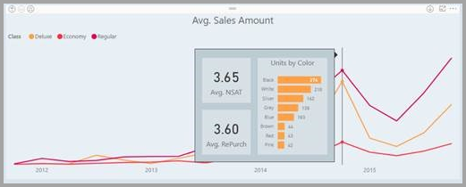
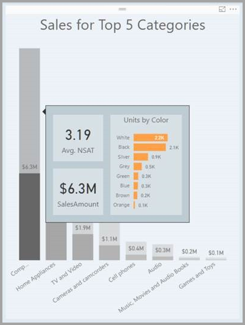

# สร้างคำแนะนำเครื่องมือตามหน้ารายงานใน Power BI DesktopCreate tooltips based on report pages in Power BI Desktop
คุณสามารถสร้าง **คำแนะนำเครื่องมือรายงาน** ที่สวยงาม ที่ปรากฏเมื่อคุณโฮเวอร์เหนือวิชวล จากหน้ารายงานที่คุณสร้างใน **Power BI Desktop** ได้You can create visually rich **report tooltips** that appear when you hover over visuals, based on report pages you create in **Power BI Desktop**. โดยการสร้างหน้ารายงานที่เป็นคำแนะนำเครื่องมือของคุณ คำแนะนำเครื่องมือแบบกำหนดเองของคุณสามารถรวม วิชวล รูปภาพ และคอลเลกชันของรายการใด ๆ ที่คุณสร้างไว้ในหน้ารายงานBy creating a report page that serves as your tooltip, your custom tooltips can include visuals, images, and any other collection of items you create in the report page. 

คุณสามารถสร้างหน้าคำแนะนำเครื่องมือต่าง ๆ ได้มากเท่าที่คุณต้องการYou can create as many tooltip pages as you want. คำแนะนำเครื่องมือแต่ละหน้า สามารถเชื่อมโยงกับหนึ่งหรือหลายเขตข้อมูลในรายงานของคุณ ดังนั้น เมื่อคุณโฮเวอร์เหนือวิชวลที่มีเขตข้อมูลที่เลือก คำแนะนำเครื่องมือที่คุณสร้างขึ้นจะปรากฏ เมื่อคุณโฮเวอร์เหนือวิชวลนั้น โดยกรองตามจุดข้อมูลที่เมาส์ของคุณกำลังโฮเวอร์อยู่Each tooltip page can be associated with one or more fields in your report, so that when you hover over a visual that includes the selected field, the tooltip you created on your tooltip page appears when you hover over the visual, filtered by the datapoint over which your mouse is hovering. 

มีหลายสิ่งน่าสนใจ ที่คุณสามารถทำได้ด้วยคำแนะนำเครื่องมือรายงานThere are all sorts of interesting things you can do with report tooltips. ลองมาดูวิธีการสร้างคำแนะนำเครื่องมือ และสิ่งที่คุณต้องทำเพื่อกำหนดค่าเหล่านั้นLet's take a look at how to create tooltips and what you must do to configure them.

## สร้างหน้าคำแนะนำเครื่องมือรายงานCreate a report tooltip page
เพื่อเริ่มต้นใช้งาน สร้างหน้ารายงานใหม่ โดยการคลิกที่ปุ่ม **+** ที่อยู่ด้านล่างของพื้นที่ทำงาน **Power BI Desktop** บริเวณแท็บหน้าTo get started, create a new report page by clicking the **+** button, found along the bottom of the **Power BI Desktop** canvas, in the page tabs area. ปุ่มอยู่ข้างถัดจากหน้าสุดท้ายของรายงานThe button is located beside the last page in the report. 

คำแนะนำเครื่องมือของคุณสามารถมีขนาดใดก็ได้ แต่เนื่องจากคำแนะนำเครื่องมือจะโฮเวอร์เหนือพื้นที่ทำงาน ดังนั้นคุณอาจต้องการให้มีขนาดค่อนข้างเล็กYour tooltip can be any size, but keep in mind that tooltips hover over the report canvas, so you might want to keep them reasonably small. ในบานหน้าต่าง **รูปแบบ** ในการ์ด **ขนาดหน้า** คุณสามารถเห็นขนาดหน้าใหม่ที่เรียกว่า *คำแนะนำเครื่องมือ*In the **Format** pane in the **Page Size** card, you can see a new page size template called *Tooltip*. ซึ่งทำให้ขนาดของหน้ารายงาน เหมาะกับคำแนะนำเครื่องมือของคุณThis provides a report page canvas size that's ready for your tooltip.

ตามค่าเริ่มต้น **Power BI Desktop** จะปรับให้พื้นที่ทำงานเท่ากับพื้นที่ทั้งหมดบนหน้าBy default, **Power BI Desktop** fits your report canvas to the available space on the page. ซึ่งมักเป็นสิ่งที่ดี แต่ไม่ใช่ในกรณีของคำแนะนำเครื่องมือOften that's good, but not in the case of tooltips. เพื่อให้เข้าใจได้ดีขึ้นว่า คำแนะนำเครื่องมือของคุณจะมีหน้าตาเป็นอย่างไรเมื่อเสร็จแล้ว คุณสามารถเปลี่ยน **มุมมองหน้า** เป็นขนาดจริงได้To get a better sense and view of what your tooltip will look like when you're done, you can change the **Page View** to actual size. 

เมื่อต้องการทำเช่นนั้น เลือกแท็บ **มุมมอง** จาก ribbonTo do that, select the **View** tab from the ribbon. จากที่นั่น เลือก **มุมมองหน้า > ขนาดจริง** ดังแสดงในรูปต่อไปนี้From there, select **Page View > Actual Size**, as shown in the following image.

คุณยังสามารถตั้งชื่อหน้ารายงาน เพื่อให้เห็นจุดประสงค์ที่ชัดเจนYou can also name the report page so its purpose is clear. เพียงเลือกการ์ด **ข้อมูลเกี่ยวกับหน้า** ในบานหน้าต่าง **รูปแบบ** แล้วพิมพ์ชื่อลงในเขตข้อมูล **ชื่อ** ที่คุณพบที่นั่นJust select the **Page Information** card in the **Format** pane, then type the name into the **Name** field you find there. ในรูปต่อไปนี้ ชื่อรายงานคำแนะนำเครื่องมือคือ *Tooltip 1* แต่คุณสามารถตั้งชื่ออื่นที่สร้างแรงบันดาลใจยิ่งขึ้นได้In the following image the tooltip report name is *Tooltip 1*, but feel free to name yours something more inspired.

จากนั้น คุณสามารถสร้างวิชวลใดก็ตาม ที่คุณต้องการให้แสดงในคำแนะนำเครื่องมือของคุณFrom there, you can create whatever visuals you would like to show up in your tooltip. ในรูปต่อไปนี้ มีการ์ดสองใบ และมีแผนภูมิแท่งแบบกลุ่มหนึ่งแผนภูมิ บนหน้าคำแนะนำเครื่องมือ พร้อมกับสีพื้นหลังของหน้า และพื้นหลังของแต่ละวิชวล เพื่อให้ได้หน้าที่มีลักษณะที่เราต้องการIn the following image, there are two cards and one clustered bar chart on the tooltip page, along with a background color for the page itself, and backgrounds for each of the visuals, to give it the look we wanted.

ยังมีอีกหลายขั้นตอนที่ต้องทำ เพื่อให้คำแนะนำเครื่องมือของหน้ารายงานของคุณ พร้อมทำงานเป็นคำแนะนำเครื่องมือThere are more steps to complete before your tooltip report page is ready to work as a tooltip. คุณจำเป็นต้องกำหนดค่าหน้าคำแนะนำเครื่องมือ ซึ่งทำได้สองสามวิธี ตามที่จะอธิบายในส่วนถัดไปYou need to configure the tooltip page in a few ways, as described in the next section. 

## กำหนดค่าหน้ารายงานคำแนะนำเครื่องมือConfigure your tooltip report page

เมื่อคุณสร้างหน้ารายงานคำแนะนำเครื่องมือแล้ว คุณจำเป็นต้องกำหนดค่าหน้า เพื่อให้ **Power BI Desktop** ลงทะเบียนเป็นคำแนะนำเครื่องมือ และให้แน่ใจว่าจะปรากฏขึ้นเหนือวิชวลที่ถูกต้องOnce you have the tooltip report page created, you need to configure the page in order for **Power BI Desktop** to register it as a tooltip, and to ensure it appears in over the right visuals.

เริ่มต้นจาก คุณจำเป็นต้องเลื่อนแถบเลื่อน **คำแนะนำเครื่องมือ** ให้เป็น **เปิด** ในการ์ด **ข้อมูลเกี่ยวกับหน้า** เพื่อทำให้หน้าเป็นคำแนะนำเครื่องมือTo begin with, you need to turn the **Tooltip** slider to **On**, in the **Page Information** card, to make the page a tooltip. 

เมื่อแถบเลื่อนถูกตั้งค่าเป็นเปิด คุณต้องระบุเขตข้อมูลที่คุณต้องการให้คำแนะนำเครื่องมือรายงานปรากฏขึ้นOnce that slider is set to on, you specify the fields for which you want the report tooltip to appear. สำหรับวิชวลในรายงานที่มีเขตข้อมูลที่คุณระบุ คำแนะนำจะปรากฏขึ้นFor visuals in the report that include the field you specify, the tooltip will appear. คุณระบุหนึ่งหรือหลายเขตข้อมูลที่จะใช้ โดยการลากเขตข้อมูลลงในบักเก็ต **เขตข้อมูลคำแนะนำเครื่องมือ** ที่พบในส่วน **เขตข้อมูล** ของบานหน้าต่าง **การจัดรูปแบบการแสดงข้อมูล**You specify which field or fields apply by dragging them into the **Tooltip fields** bucket, found in the **Fields** section of the **Visualizations** pane. ในรูปต่อไปนี้ เขตข้อมูล *SalesAmount* ได้ถูกลากลงในบักเก็ต **เขตข้อมูลคำแนะนำเครื่องมือ**In the following image, the *SalesAmount* field has been dragged into the **Tooltips fields** bucket.

 
คุณสามารถใส่เขตข้อมูล ทั้งที่เป็นประเภทหรือเป็นตัวเลข ในบักเก็ต **เขตข้อมูลคำแนะนำเครื่องมือ** รวมถึงหน่วยวัดได้You can include both categorical and numerical fields in the **Tooltips fields** bucket, including measures.

เมื่อเสร็จเรียบร้อย หน้ารายงานคำแนะนำเครื่องมือที่คุณสร้าง จะถูกใช้เป็นคำแนะนำเครื่องมือในวิชวล ในรายงานที่ใช้เขตข้อมูลที่คุณวางลงในบักเก็ต **เขตข้อมูลคำแนะนำเครื่องมือ** แทนที่จะเป็นคำแนะนำเครื่องมือเริ่มต้นของ Power BIOnce completed, the tooltip report page you created will be used as a tooltip in visuals in the report that use any fields you placed into the **Tooltips fields** bucket, replacing the default Power BI tooltip.

## การตั้งค่าคำแนะนำเครื่องมือรายงานด้วยตนเองManually setting a report tooltip

นอกจากการสร้างคำแนะนำเครื่องมือที่ปรากฏโดยอัตโนมัติ เมื่อโฮเวอร์เหนือวิชวลที่มีเขตข้อมูลที่ระบุ คุณสามารถตั้งค่าคำแนะนำด้วยตนเองได้In addition to creating a tooltip that automatically appears when hovering over a visual that contains the specified field, you can manually set a tooltip. 

วิชวลใด ๆ ที่สนับสนุนคำแนะนำเครื่องมือรายงานในขณะนี้ มีการ์ด **คำแนะนำเครื่องมือ** ในบานหน้าต่าง **การจัดรูปแบบ**Any visual that supports report tooltips now has a **Tooltip** card in its **Formatting** pane. 

เพื่อตั้งค่าแนะนำเครื่องมือด้วยตนเอง เลือกวิชวลที่คุณต้องการระบุคำแนะนำเครื่องมือด้วยตนเอง จากนั้นในบานหน้าต่าง **การจัดรูปแบบการแสดงข้อมูล** เลือกส่วน **รูปแบบ** และขยายการ์ด **คำแนะนำเครื่องมือ**To set a tooltip manually, select the visual for which you want to specify the manual tooltip, then in the **Visualizations** pane, select the **Format** section and expand the **Tooltip** card.

จากนั้น ในแดรอปดาวน์ **หน้า** เลือกหน้าคำแนะนำเครื่องมือที่คุณต้องการใช้สำหรับวิชวลที่เลือกThen, in the **Page** dropdown, select the tooltip page you want to use for the selected visual. สังเกตว่า เฉพาะหน้ารายงานที่มีระบุเป็น **คำแนะนำเครื่องมือ** เท่านั้น ที่จะแสดงขึ้นในกล่องโต้ตอบNote that only report pages that are specified as **Tooltip** pages show up in the dialog.

การที่สามารถกำหนดคำแนะนำเครื่องมือได้เอง มีการใช้งานได้หลายอย่างBeing able to manually set a tooltip has many uses. คุณสามารถตั้งค่าหน้าเปล่าสำหรับคำแนะนำ จึงเป็นการยกเลิกค่าเริ่มต้นคำแนะนำเครื่องมือของ Power BIYou can set a blank page for a tooltip, and thereby override the default Power BI tooltip selection. อีกการใช้งานหนึ่งคือ เมื่อคุณไม่ต้องการคำแนะนำเครื่องมือที่ถูกเลือกอัตโนมัติโดย Power BIAnother use is when you don't want the tooltip that is automatically selected by Power BI to be the tooltip. ตัวอย่างเช่น ถ้าคุณมีวิชวลที่มีสองเขตข้อมูล และทั้งสองเขตข้อมูลเหล่านั้นมีคำแนะนำเครื่องมือเชื่อมโยงอยู่ Power BI จะเลือกเพียงหนึ่งในนั้นเพื่อแสดงFor example, if you have a visual that includes two fields, and both of those fields have an associated tooltip, Power BI selects only one to show. คุณอาจไม่ต้องการอย่างนั้น ดังนั้นคุณสามารถเลือกคำแนะนำเครื่องมือที่จะแสดงด้วยตนเองYou might not want that to be the case, so you could manually select which tooltip should be displayed.

## การเปลี่ยนกลับเป็นค่าเริ่มต้นคำแนะนำเครื่องมือReverting to default tooltips

ถ้าคุณสร้างคำแนะนำเครื่องมือด้วยตนเองสำหรับวิชวล แต่คุณตัดสินใจที่จะกลับไปใช้คำแนะนำเครื่องมือเริ่มต้นแทน คุณสามารถกลับไปใช้คำแนะนำเครื่องมือเริ่มต้นของ Power BI ได้เสมอIf you create a manual tooltip for a visual but decide you want the default tooltip instead, you can always return to the default tooltip that Power BI provides. เพื่อทำเช่นนั้น เลือกที่วิชวลและขยายการ์ด **คำแนะนำเครื่องมือ** เพียงเลือก *อัตโนมัติ* จากดรอปดาวน์ **หน้า** เพื่อย้อนกลับเป็นค่าเริ่มต้นTo do so, when a visual is selected and the **Tooltip** card is expanded, just select *Auto* from the **Page** dropdown to go back to the default.

## คำแนะนำเครื่องมือรายงานที่กำหนดเอง และแผนภูมิเส้นCustom report tooltips and line charts

มีข้อควรพิจารณาสองสามข้อที่ควรทราบ เมื่อคำแนะนำเครื่องมือรายงานของคุณโต้ตอบกับวิชวลแผนภูมิเส้น และเมื่อวิชวลมีไฮไลต์แบบเชื่อมโยงThere are a few considerations to keep in mind when your report tooltips are interacting with line chart visuals, and with visuals when cross-highlighting.

### คำแนะนำเครื่องมือรายงานและแผนภูมิเส้นReport tooltips and line charts

เมื่อคำแนะนำเครื่องมือรายงานแสดงสำหรับแผนภูมิเส้น มีเพียงคำแนะนำเครื่องมือเดียวเท่านั้นที่จะแสดงสำหรับทุกเส้นในแผนภูมิWhen a report tooltip is displayed for a line chart, only one tooltip for all lines in the chart is displayed. ซึ่งเหมือนกับลักษณะคำแนะนำเครื่องมือเริ่มต้นของแผนภูมิเส้น ซึ่งแสดงคำแนะนำเครื่องมือเดียวเท่านั้นThis is similar to the default tooltip behavior for line charts, which also displays only one tooltip. 

เนื่องจากเขตข้อมูลในคำอธิบายแผนภูมิ ไม่ได้ส่งผ่านตัวกรองสำหรับคำแนะนำThis is because the field in the legend does not get passed through as a filter for the tooltip. ในรูปต่อไปนี้ คำแนะนำที่แสดงจะแสดงจำนวนหน่วยทั้งหมดที่ขายได้ในวันวันนั้น ของทั้งสามประเภทรวมกัน ในคำแนะนำเครื่องมือรายงาน (ในตัวอย่างคือ Deluxe, Economy และ Regular)In the following image, the tooltip being displayed is showing all units sold on that day across all three classes displayed in the report tooltip (in this example, Deluxe, Economy, and Regular). 

### คำแนะนำเครื่องมือและไฮไลต์แบบเชื่อมโยงReport tooltips and cross-highlighting

เมื่อวิชวลมีการไฮไลต์แบบเชื่อมโยงในรายงาน คำแนะนำเครื่องมือจะแสดงข้อมูลที่ถูกเชื่อมโยงเสมอ แม้ว่าคุณกำลังวางเมาส์ไว้เหนือส่วนที่สีจางของจุดข้อมูลWhen a visual is being cross-highlighted in a report, report tooltips always show the cross-highlighted data, even if you're hovering over the faded section of the data point. ในรูปต่อไปนี้ เมาส์กำลังโฮเวอร์เหนือส่วนที่สีจางของกราฟแท่ง (ส่วนที่ไม่ถูกไฮไลต์) แต่คำแนะนำเครื่องมือรายงาน ยังคงแสดงข้อมูลสำหรับส่วนที่สีเข้มสำหรับจุดข้อมูลน้ัน (ข้อมูลที่ถูกไฮไลต์)In the following image, the mouse is hovering over the faded section of the bar graph (the section that is not highlighted), but the report tooltip still shows data for the highlighted portion of that datapoint (the highlighted data).

## ข้อจำกัดและข้อควรพิจารณาLimitations and considerations
มีข้อจำกัดและข้อควรพิจารณาบางข้อสำหรับ **คำแนะนำเครื่องมือ** ที่คุณควรทราบThere are a few limitations and considerations for **tooltips** to keep in mind.

* เริ่มตั้งแต่เดือนธันวาคม 2018 ที่วางจำหน่าย **Power BI Desktop** วิชวลของปุ่มยังรองรับเคล็ดลับเครื่องมือBeginning with the December 2018 release of **Power BI Desktop**, Button visuals also support tooltips.
* วิชวล Power BI ไม่สนับสนุนกล่องแสดงคำอธิบายสำหรับรายงานReport tooltips are not supported for Power BI visuals. 
* คลัสเตอร์ เป็นเขตข้อมูลที่ยังไม่สนับสนุนการแสดงคำแนะนำเครื่องมือรายงานในขณะนี้Clusters are not currently supported as fields that can be shown in report tooltips. 
* เมื่อต้องการเลือกเขตข้อมูลสำหรับแสดงคำแนะนำเครื่องมือรายงาน เมื่อใช้เขตข้อมูลเมื่อเทียบกับประเภท วิชวลที่มีเขตข้อมูลนั้นจะแสดงคำแนะนำที่ระบุเมื่อ ข้อสรุปของเขตข้อมูลที่เลือกตรงกันWhen choosing a field to be shown for report tooltips, when using a field versus a category, visuals that contain that field will only show the specified tooltip when summarization with the selected field matches. 

## ขั้นตอนถัดไปNext steps
สำหรับข้อมูลเพิ่มเติมเกี่ยวกับคุณลักษณะที่คล้ายกัน หรือโต้ตอบกับคำแนะนำเครื่องมือรายงาน โปรดดูที่บทความต่อไปนี้:For more information about features that are similar or interact with report tooltips, take a look at the following articles:

* [ใช้ตัวเจาะเข้าถึงรายละเอียดใน Power BI DesktopUse drillthrough in Power BI Desktop](desktop-drillthrough.md)
* [แสดงไทล์แดชบอร์ดหรือรายงานวิชวลในโหมดโฟกัสDisplay a dashboard tile or report visual in Focus mode](../consumer/end-user-focus.md)
