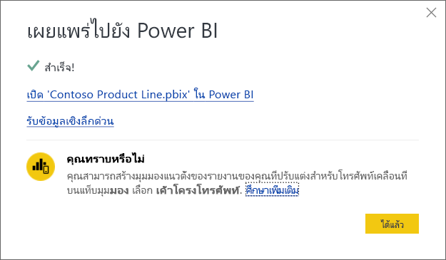

# เผยแพร่ชุดข้อมูลและรายงานจาก Power BI DesktopPublish datasets and reports from Power BI Desktop
เมื่อคุณเผยแพร่เป็นไฟล์ Power BI Desktop ไปยังบริการ Power BI แสดงว่าคุณได้เผยแพร่ข้อมูลในแบบจำลองดังกล่าวไปยังพื้นที่ทำงาน Power BI ของคุณWhen you publish a Power BI Desktop file to the Power BI service, you publish the data in the model to your Power BI workspace. ข้อมูลเดียวกันนี้จะเป็นจริงสำหรับรายงานใด ๆ ที่คุณสร้างไว้ในมุมมอง **รายงาน**The same is true for any reports you created in **Report** view. คุณจะเห็นชุดข้อมูลใหม่ที่มีชื่อเดียวกัน และรายงานต่างๆในตัวนำทางของพื้นที่ทำงานของคุณYou’ll see a new dataset with the same name, and any reports in your Workspace navigator.

การเผยแพร่จาก Power BI Desktop จะให้ผลลัพธ์เดียวกันกับการใช้ **Get Data** ใน Power BI เพื่อเชื่อมต่อและอัปโหลดไฟล์ Power BI DesktopPublishing from Power BI Desktop has the same effect as using **Get Data** in Power BI to connect to and upload a Power BI Desktop file.

> [!NOTE]
> การเปลี่ยนแปลงใดๆที่คุณทำกับรายงานใน Power BI จะไม่ถูกบันทึกกลับไปยังไฟล์ Power BI Desktop ต้นฉบับAny changes you make to the report in Power BI won't be saved back to the original Power BI Desktop file. ซึ่งรวมถึงเวลาที่คุณเเพิ่ม ลบ หรือเปลี่ยนแปลงการแสดงภาพต่าง ๆ ในรายงานThis includes when you add, delete, or change visualizations in reports.

## เมื่อต้องการเผยแพร่ชุดข้อมูลและรายงาน Power BI DesktopTo publish a Power BI Desktop dataset and reports
1. ใน Power BI Desktop เลือก **ไฟล์** \> **เผยแพร่** \> **เผยแพร่ไปยัง Power BI** หรือเลือก **เผยแพร่** บน RibbonIn Power BI Desktop, choose **File** \> **Publish** \> **Publish to Power BI** or select **Publish** on the ribbon.  

   

2. ลงชื่อเข้าใช้ Power BI หากคุณยังไม่ได้ลงชื่อเข้าใช้Sign in to Power BI, if you aren't already signed in.
3. เลือกปลายทางSelect the destination. ตั้งแต่การเปิดตัวในเดือนกันยายน 2020 คุณจะสามารถค้นหารายการพื้นที่ทำงานที่มีอยู่ของคุณเพื่อค้นหาพื้นที่ทำงานที่คุณต้องการเผยแพร่Beginning with the September 2020 release, you can search your list of available workspaces to find the workspace into which you want to publish. กล่องค้นหาช่วยให้คุณกรองพื้นที่ทำงานของคุณThe search box lets you filter your workspaces. เลือกพื้นที่ทำงาน จากนั้นคลิกปุ่ม **เลือก** เพื่อเผยแพร่Select the workspace, and then click the **Select** button to publish.

   

เมื่อการเผยแพร่เสร็จสมบูรณ์ คุณจะได้รับลิงก์ไปยังรายงานของคุณWhen publishing is complete, you receive a link to your report. เลือกลิงก์เพื่อเปิดรายงานในไซต์ Power BI ของคุณSelect the link to open the report in your Power BI site.

## เผยแพร่อีกครั้งหรือแทนที่ชุดข้อมูลที่เผยแพร่จาก Power BI DesktopRepublish or replace a dataset published from Power BI Desktop
ชุดข้อมูลและรายงานใดๆ ที่คุณสร้างขึ้นใน Power BI Desktop ให้อัปโหลดไปยังไซค์ Power BI ของคุณเมื่อเผยแพร่ไฟล์ Power BI DesktopThe dataset, and any reports you created in Power BI Desktop, upload to your Power BI site when you publish a Power BI Desktop file. เมื่อคุณเผยแพร่ไฟล์ Power BI Desktop ของคุณอีกครั้ง ชุดข้อมูลในไซต์ Power BI ของคุณจะถูกแทนที่ด้วยชุดข้อมูลที่อัปเดตแล้วจากไฟล์ Power BI DesktopWhen you republish your Power BI Desktop file, the dataset in your Power BI site is replaced with the updated dataset from the Power BI Desktop file.

กระบวนการนี้ค่อนข้างจะตรงไปตรงมา แต่จะมีรายการ 2-3 รายการที่คุณควรทราบ:This process is straightforward, but there are a few things you should know:

* ถ้าคุณมีชุดข้อมูลสองรายการ หรือมากกว่าใน Power BI โดยใช้ชื่อเดียวกันกับไฟล์ Power BI Desktop การเผยแพร่อาจล้มเหลวได้Two or more datasets in Power BI with the same name as the Power BI Desktop file could cause publishing to fail. ตรวจสอบให้แน่ใจว่า คุณมีชุดข้อมูลเดียวเท่านั้นใน Power BI ที่มีชื่อเดียวกันMake sure you have only one dataset in Power BI with the same name. นอกจากนี้คุณยังสามารถเปลี่ยนชื่อไฟล์และเผยแพร่ โดยสร้างชุดข้อมูลใหม่ชื่อเดียวกันกับไฟล์You can also rename the file and publish, creating a new dataset with same name as the file.
* ถ้าคุณเปลี่ยนชื่อหรือลบคอลัมน์หรือหน่วยวัด การแสดงภาพใดๆที่คุณมีใน Power BI ที่มีเขตข้อมูลนั้นอาจจะไม่สามารถใช้งานIf you rename or delete a column or measure, any visualizations you already have in Power BI with that field could be broken. 
* Power BI ละเว้นการเปลี่ยนแปลงการจัดรูปแบบบางอย่างของคอลัมน์ที่มีอยู่Power BI ignores some format changes of existing columns. ตัวอย่างเช่น หากคุณเปลี่ยนรูปแบบของคอลัมน์จาก 0.25% เป็น 25%For example, if you change a column’s format  from 0.25% to 25%.
* สมมติว่าคุณมีกำหนดการรีเฟรชที่มีการกำหนดค่าสำหรับชุดข้อมูลที่มีอยู่ของคุณใน Power BISay you have a refresh schedule that is configured for your existing dataset in Power BI. เมื่อคุณเพิ่มแหล่งข้อมูลใหม่ลงในไฟล์ของคุณแล้วเผยแพร่อีกครั้ง คุณจะต้องลงชื่อเข้าใช้ก่อน่การรีเฟรชตามกำหนดการครั้งถัดไปWhen you add new data sources to your file and then republish, you’ll have to sign into them before the next scheduled refresh.
* เมื่อคุณเผยแพร่ชุดข้อมูลที่เผยแพร่จาก Power BI Desktop ใหม่ และมีการกำหนดตารางเวลาการรีเฟรช การรีเฟรชชุดข้อมูลจะเริ่มต้นทันทีที่คุณเผยแพร่อีกครั้งWhen you republish a dataset published from Power BI Desktop and have a refresh schedule defined, a dataset refresh is started as soon as you republish.
* เมื่อคุณทำการเปลี่ยนแปลงกับชุดข้อมูล แล้วเผยแพร่ใหม่อีกครั้ง ข้อความจะแสดงจำนวนพื้นที่ทำงาน รายงาน และแดชบอร์ดที่อาจได้รับผลกระทบจากการเปลี่ยนแปลงนั้น และจะขอให้คุณยืนยันว่า คุณต้องการแทนที่ชุดข้อมูลที่เผยแพร่ในปัจจุบันด้วยรายการที่คุณปรับเปลี่ยนWhen you make a change to a dataset and then republish it, a message shows you how many workspaces, reports, and dashboards are potentially impacted by the change, and asks you to confirm that you want to replace the currently published dataset with the one you modified. นอกจากนี้ ข้อความยังประกอบด้วยลิงก์ไปยังการวิเคราะห์ผลกระทบของชุดข้อมูลแบบเต็มรูปแบบในบริการ Power BI ที่คุณจะสามารถมองเห็นข้อมูลเพิ่มเติม และดำเนินการเพื่อบรรเทาความเสี่ยงจากการเปลี่ยนแปลงของคุณThe message also provides a link to the full dataset impact analysis in the Power BI service, where you can see more information and take action to mitigate the risks of your change.

   

   [เรียนรู้เพิ่มเติมเกี่ยวกับการวิเคราะห์ผลกระทบของชุดข้อมูล](../collaborate-share/service-dataset-impact-analysis.md)[Learn more about Dataset impact analysis](../collaborate-share/service-dataset-impact-analysis.md).

> [!NOTE]
> การเชื่อมต่อข้อมูลบางอย่างในรายงาน Power BI อาจรวมถึงการเชื่อมโยงไปยังข้อมูล แทนที่จะรวมข้อมูลในชุดข้อมูลที่นำเข้าลงในบริการ Power BISome data connection in Power BI reports may include links to data, rather than including the data in the dataset that's imported into the Power BI service. ตัวอย่างเช่น ลิงก์การเชื่อมต่อ DirectQuery ไปยังข้อมูลเนื่องจากเกิดการอัปเดตหรือการโต้ตอบ แทนที่จะนำเข้าข้อมูลด้วยตัวเองFor example, DirectQuery connections link to data as updates or interactions occur, rather than importing the data itself. ถ้าแหล่งข้อมูลที่เชื่อมโยงในรายงานของคุณอยู่ภายในองค์กร คุณอาจจำเป็นต้องมีเกตเวย์เพื่อเข้าถึงจาก Power BI อีกด้วยIf linked data sources in your report are on premises, you may need a gateway to access them from Power BI. สำหรับข้อมูลเพิ่มเติม ดูที่ [เกตเวย์ข้อมูลภายในองค์กรคืออะไร](../connect-data/service-gateway-onprem.md)For more information, see [what is an on-premises data gateway?](../connect-data/service-gateway-onprem.md).
> 

## ขั้นตอนถัดไปNext steps

คุณสามารถทำการเรียงลำดับของของต่างๆ ด้วย Power BI DesktopYou can do all sorts of things with Power BI Desktop. สำหรับข้อมูลเพิ่มเติมเกี่ยวกับขีดความสามารถ กรุณาดูแหล่งทรัพยากรต่อไปนี้:For more information on its capabilities, check out the following resources:

* [Power BI Desktop คืออะไรWhat is Power BI Desktop?](../fundamentals/desktop-what-is-desktop.md)
* [ภาพรวมคำถามด้วย Power BI DesktopQuery overview with Power BI Desktop](../transform-model/desktop-query-overview.md)
* [ชนิดข้อมูลใน Power BI DesktopData types in Power BI Desktop](../connect-data/desktop-data-types.md)
* [บทช่วยสอน: จัดรูปร่างและรวมข้อมูลใน Power BI DesktopTutorial: Shape and combine data in Power BI Desktop](../connect-data/desktop-shape-and-combine-data.md)
* [งานแบบสอบถามทั่วไปใน Power BI DesktopCommon query tasks in Power BI Desktop](../transform-model/desktop-common-query-tasks.md)
