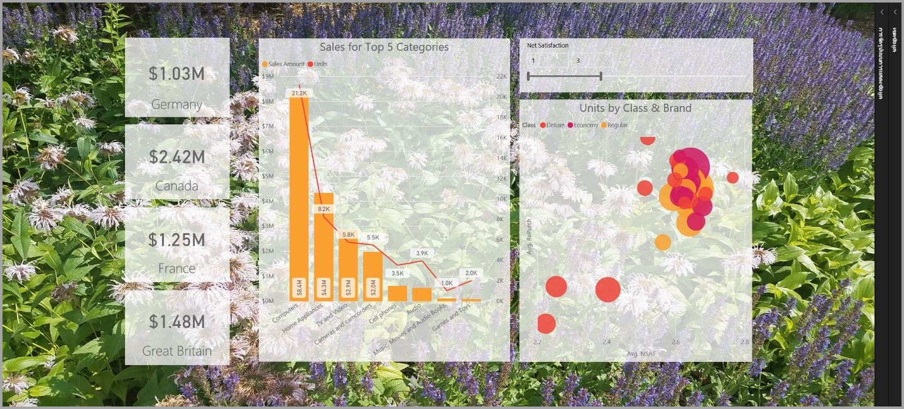
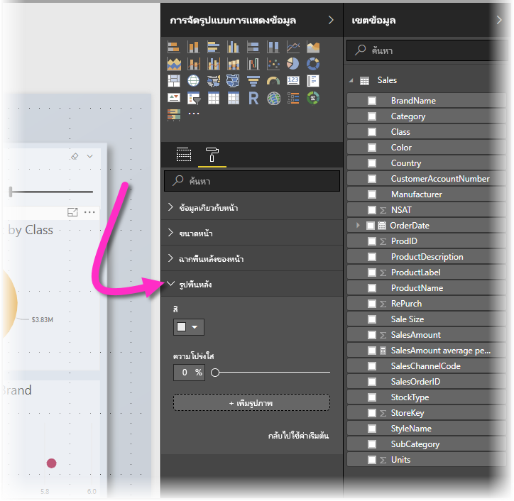

# ใช้องค์ประกอบด้านภาพเพื่อปรับแต่งรายงาน Power BIUse visual elements to enhance Power BI reports

ด้วย **Power BI Desktop** คุณสามารถใช้องค์ประกอบด้านภาพ เช่นพื้นพลังและภาพส่วนหัวที่ได้รับการปรับแต่งสำหรับการแสดงข้อมูล เพื่อปรับแต่งหน้าตาของรายงานWith **Power BI Desktop** you can use visual elements, such as wallpaper and improved visual headers for visualizations, to enhance the appearance of your reports.

นับตั้งแต่ **Power BI Desktop** รุ่นเดือนกรกฎาคม 2018 คุณสามารถเพิ่มการปรับแต่งให้กับรายงานและทำให้การวิเคราะห์และรายงานน่าดูยิ่งกว่าที่เคยBeginning with the July 2018 release of **Power BI Desktop**, you can put enhancements to use in your reports and make your analytics and reports even more appealing than before. การปรับแต่งที่พูดถึงในบทความนี้ประกอบด้วย:The enhancements discussed in this article include the following: 

* เพิ่ม **พื้นหลัง** ไปยังรายงานเพื่อให้พื้นหลังช่วยเสริมหรือเน้นองค์ประกอบของเรื่องราวที่ต้องการเล่าด้วยข้อมูลApply **wallpaper** to your reports so your background can enhance or highlight elements of the story you want to tell with your data
* ใช้ **ภาพส่วนหัว** ที่ได้รับการปรับแต่งสำหรับการแสดงข้อมูลแต่ละชิ้นเพื่อสร้างงานภาพที่เป็นไปในทางเดียวกันบนผืนผ้าใบสำหรับรายงานของคุณUse improved **visual headers** for individual visualizations to create perfectly aligned visuals on your report canvas. 

ส่วนต่อไปนี้อธิบายวิธีใช้การปรับแต่งเหล่านี้ และวิธีนำไปใช้กับรายงานThe following sections describe how to use these enhancements, and how to apply them to your reports.

## การใช้พื้นหลังในรายงาน Power BIUsing wallpaper in Power BI reports

คุณสามารถจัดรูปแบบพื้นที่สีเทานอกหน้ารายงานได้ด้วยการใช้ **พื้นหลัง**You can format the gray area outside your report page using **wallpaper**. ภาพต่อไปนี้มีลูกศรที่ช่วยอธิบายว่าพื้นหลังมีขอบเขตถึงบริเวณไหนThe following image has an arrow that clarifies where the wallpaper area applies. 

คุณสามารถตั้งค่าพื้นหลังเป็นต่อหน้ารายงาน หรือใช้พื้นหลังเดียวกันในรายงานทุกหน้าYou can either set wallpaper on a per-report-page basis, or have the same wallpaper for every page in your report. หากต้องการตั้งค่าพื้นหลัง ให้แตะหรือคลิกที่ไอคอน **การจัดรูปแบบ** เมื่อไม่ได้เลือกภาพใดในรายงานอยู่ และการ์ด **พื้นหลัง** ปรากฏในบานหน้าต่างTo set your wallpaper, tap or click the **Formatting** icon when no visual is selected in your report and the **Wallpaper** card appears in the pane.

คุณสามารถเลือกสีที่จะใช้เป็น **พื้นหลัง** ด้วยการเลือกรายการแบบหล่นลง **สี** หรือคุณสามารถเลือกปุ่ม **เพิ่มภาพ** เพื่อเลือกภาพที่จะใช้เป็นพื้นหลังYou can choose a color to apply as **wallpaper** by selecting the **Color** dropdown, or you can select the **Add Image** button to select an image to apply as wallpaper. คุณยังสามารถกำหนดความโปร่งใสให้กับพื้นหลัง ไม่ว่าจะเป็นสีหรือภาพ โดยใช้แถบเลื่อน **ความโปร่งใส**You can also apply transparency to your wallpaper, whether it's a color or an image, using the **Transparency** slider.

การจำคำนิยามที่เกี่ยวข้องกับ **พื้นหลัง** ต่อไปนี้ไว้จะมีประโยชน์กับคุณ:It's useful to keep in mind the following definitions that pertain to **wallpaper**:

* พื้นที่สีเทานอกรายงานคือพื้นที่ **พื้นหลัง**The gray area outside of your report area is the **wallpaper** area
* พื้นที่ในผืนผ้าใบซึ่งคุณสามารถวางภาพเรียกว่า **หน้า** รายงาน และใน **บ้านหน้าต่างรูปแบบ** สามารถปรับแต่งโดยใช้เมนูแบบหล่นลง **พื้นหลังหน้า** ได้The area in the canvas where you can place visuals is referred to as the report **page**, and in the **Format pane** can be modified using the **Page background** dropdown.

**หน้า** รายงานจะอยู่เบื้องหน้าเสมอ (เมื่อเทียบกับพื้นหลัง) ในขณะที่ **พื้นหลัง** จะอยู่ด้านหลังและเป็นองค์ประกอบที่อยู่ด้านหลังสุดในหน้ารายงานThe report **page** is always in the foreground (when compared to the wallpaper), while the **wallpaper** is behind it and the furthest-back element on the report page. เมื่อคุณใช้ความโปร่งใสกับหน้า ภาพในรายงานจะได้รับการใช้ความโปร่งใสด้วย ช่วยให้พื้นหลังของคุณปรากฏเป็นพื้นหลังผ่านภาพต่าง ๆWhen you apply transparency to the page, the visuals in your report also have the transparency applied, allowing your wallpaper to be visible in the background through your visuals.

สำหรับรายงานใหม่ ๆ ทั้งหมด ค่าเริ่มต้นเป็นดังนี้:For all new reports, the default settings are the following:

* **หน้า** รายงานได้รับการตั้งค่าเป็น **สีขาว** และความโปร่งใสได้รับการตั้งค่าเป็น **100%**The report **page** is set to **white** and its transparency is set to **100%**
* **พื้นหลัง** ได้รับการตั้งค่าเป็น **สีขาว** และความโปร่งใสได้รับการตั้งค่าเป็น **0%**The **wallpaper** is set to **white** and its transparency is set to **0%**

เมื่อคุณตั้งค่าพื้นหลังของหน้าให้มีความโปร่งใสเกิน 50% กรอบเส้นประจะปรากฏขณะที่คุณกำลังสร้างหรือแก้ไขรายงาน เพื่อแสดงให้เห็นขอบเขตของขอบผืนผ้าใบรายงานWhen you set your page background to greater than 50% transparency, a dotted border appears while you are creating or editing your report, to show you the boundary of the report canvas border. 

เป็นเรื่องสำคัญที่ต้องทราบไว้ว่ากรอบเส้นประจะแสดงเมื่อทำการแก้ไขรายงาน *เท่านั้น* และจะ *ไม่* ปรากฏต่อคนที่กำลังดูรายงานที่เผยแพร่ไปแล้วอยู่ อย่างเช่นเมื่อดูผ่าน **บริการ Power BI**It's important to note that the dotted boundary *only* shows up when editing your report, and does *not* appear for people who are viewing your published report, such as when it's viewed in the **Power BI service**.

> [!NOTE]
> ถ้าคุณใช้พื้นหลังสีเข้มสำหรับรูปพื้นหลัง และตั้งค่าข้อความสีอ่อนมาก หรือสีขาว โปรดจำไว้ว่าคุณลักษณะ **การส่งออกเป็น PDF** ไม่รวมรูปพื้นหลัง ดังนั้นการส่งออกใด ๆ กับแบบอักษรสีขาวจะแทบมองไม่เห็นในการส่งออกไฟล์ PDFIf you use dark-colored backgrounds for wallpaper and set text color to white or very light, be mindful that the **Export to PDF** feature does not include wallpaper, so any exports with white fonts will be nearly invisible in the exported PDF file. ดู [การส่งออกเป็น PDF](desktop-export-to-pdf.md)สำหรับข้อมูลเพิ่มเติมเกี่ยวกับ **การส่งออกเป็น PDF**See [export to PDF](desktop-export-to-pdf.md) for more information on **Export to PDF**.

## การใช้ภาพส่วนหัวที่ได้รับการปรับแต่งในรายงาน Power BIUsing improved visual headers in Power BI reports

นับตั้งแต่ **Power BI Desktop** รุ่นเดือนกรกฎาคม 2018 ภาพส่วนหัวในรายงานจะได้รับการปรับแต่งให้ดีขึ้นมากBeginning with the July 2018 release of **Power BI Desktop**, the headers for visuals in reports have been significantly improved. การปรับแต่งหลัก ๆ เลยก็คือส่วนหัวถูกแยกออกมาต่างหาก ทำให้สามารถปรับตำแหน่งได้ตามความต้องการ และส่วนหัวจะปรากฏภายในภาพแทนที่จะลอยอยู่เหนือขึ้นมาThe primary improvements are that the header has been detached from the visual so its position can be adjusted based on your preference of layout and positioning, and the header now appears within the visual itself instead of floating above it. 

โดยค่าเริ่มต้น ส่วนหัวจะปรากฏภายในภาพ และสัมพันธ์กับชื่อเรื่องBy default, the header appears inside the visual aligned with the title. ในภาพต่อไปนี้ คุณจะเห็นส่วนหัว (ไอคอนหมุด ไอคอนขยาย ไอคอนย่อ) ภายในภาพและถูกจัดชิดขวา ในระนาบเดียวกันกับชื่อเรื่องIn the following image, you can see the header (the pin icon, the expand icon, and the ellipses icon) within the visual and aligned to the right, along the same horizontal position as the visual's title.

หากภาพของคุณไม่มีชื่อเรื่อง ส่วนหัวจะลอยอยู่เหนือภาพและจัดชิดขวา ดังที่แสดงในภาพด้านล่างIf your visual doesn't have a title, the header floats above the top of the visual aligned to the right, as shown in the following image. 

หากภาพของคุณได้รับการจัดตำแหน่งไว้ด้านบนสุด ภาพส่วนหัวจะไปติดอยู่ที่ด้านล่างสุดของภาพแทนIf your visual is positioned all the way to the top of your report, the visual header instead snaps to the bottom of the visual. 

แต่ละภาพจะมีการ์ดในส่วน **การจัดรูปแบบ** ของบานหน้าต่าง **การแสดงผลด้วยภาพ** ในชื่อ **ภาพส่วนหัว**Each visual also has a card in the **Formatting** section of the **Visualizations** pane called **Visual header**. ในการ์ดนั้นคุณสามารถปรับลักษณะของภาพส่วนหัวได้ทุกแบบIn that card you can adjust all sorts of characteristics of the visual header

> [!NOTE]
> การมองเห็นปุ่มสลับไม่ได้ส่งผลต่อรายงานเมื่อคุณเขียนหรือแก้ไขรายงานThe visibility of toggles do not affect your report when you are authoring or editing the report. คุณต้องเผยแพร่รายงานและดูในโหมดอ่านเพื่อดูผลลัพธ์You must publish the report and view it in reading mode to see the effect. พฤติกรรมนี้ช่วยให้แน่ใจว่าตัวเลือกหลายอย่างที่มีให้ในภาพส่วนหัวเป็นสิ่งสำคัญในระหว่างการแก้ไข โดยเฉพาะไอคอนเตือนที่เตือนปัญหาในขณะที่ทำการแก้ไขThis behavior ensures that the many options provided in visual headers are important during editing, especially warning icons that alert you to issues while editing.

สำหรับรายงานที่ปรากฏใน **บริการ Power BI** เท่านั้น คุณสามารถปรับการใช้ภาพส่วนหัวได้โดยไปที่ **พื้นที่ทำงานของฉัน > รายงาน** และเลือกไอคอน **การตั้งค่า**For reports that only appear in the **Power BI service**, you can adjust the use of visual headers by going to **My Workspace > Reports** and then selecting the **Settings** icon. คุณจะได้เห็นการตั้งค่าสำหรับรายงานที่คุณเลือกใน **การตั้งค่า** และคุณสามารถปรับการตั้งค่าได้ที่นี่ ดังที่แสดงในภาพด้านล่างThere you see settings for the report for which you selected **Settings** and you can adjust the settings from there, as shown in the following image.

### การเปิดใช้งานภาพส่วนหัวที่ได้รับการปรับแต่งสำหรับรายงานที่มีอยู่Enabling improved visual headers for existing reports

ภาพส่วนหัวใหม่เป็นพฤติกรรมเริ่มต้นสำหรับรายงานใหม่ทั้งหมดThe new visual header is the default behavior for all new reports. สำหรับรายงานที่มีอยู่แล้ว คุณต้องเปิดใช้พฤติกรรมนี้ใน **Power BI Desktop** ด้วยการไปที่ **ไฟล์ > ตัวเลือกและการตั้งค่า > ตัวเลือก** และในส่วน **การตั้งค่ารายงาน** ให้กาเครื่องหมายในช่อง **ใช้ภาพส่วนหัวพร้อมตัวเลือกลักษณะที่ได้รับการอัปเดต**For existing reports, you need to enable this behavior in **Power BI Desktop** by going to **File > Options and settings > Options** and then in the **Report settings** section, enable the **Use the modern visual header with updated styling options** checkbox.

## ขั้นตอนถัดไปNext steps
สำหรับข้อมูลเพิ่มเติมเกี่ยวกับ **Power BI Desktop** และวิธีการเริ่มต้นใช้งาน ตรวจสอบบทความต่อไปนี้For more information about **Power BI Desktop**, and how to get started, check out the following articles.

* [Power BI Desktop คืออะไรWhat is Power BI Desktop?](../fundamentals/desktop-what-is-desktop.md)
* [ภาพรวมคิวรี ด้วย Power BI DesktopQuery Overview with Power BI Desktop](../transform-model/desktop-query-overview.md)
* [แหล่งข้อมูลใน Power BI DesktopData Sources in Power BI Desktop](../connect-data/desktop-data-sources.md)
* [เชื่อมต่อกับข้อมูลใน Power BI DesktopConnect to Data in Power BI Desktop](../connect-data/desktop-connect-to-data.md)
* [จัดรูปทรง และรวมข้อมูลด้วย Power BI DesktopShape and Combine Data with Power BI Desktop](../connect-data/desktop-shape-and-combine-data.md)
* [งานคิวรี่ทั่วไปใน Power BI DesktopCommon Query Tasks in Power BI Desktop](../transform-model/desktop-common-query-tasks.md)   
