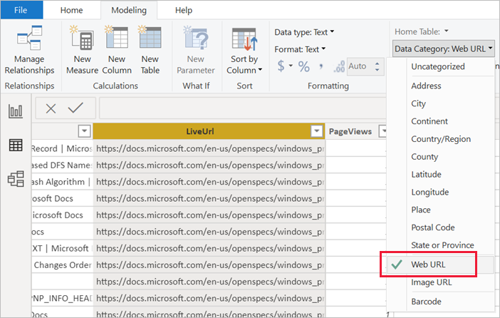
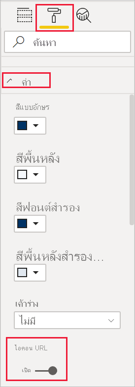
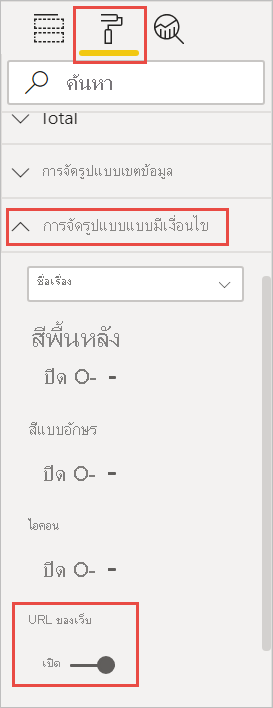
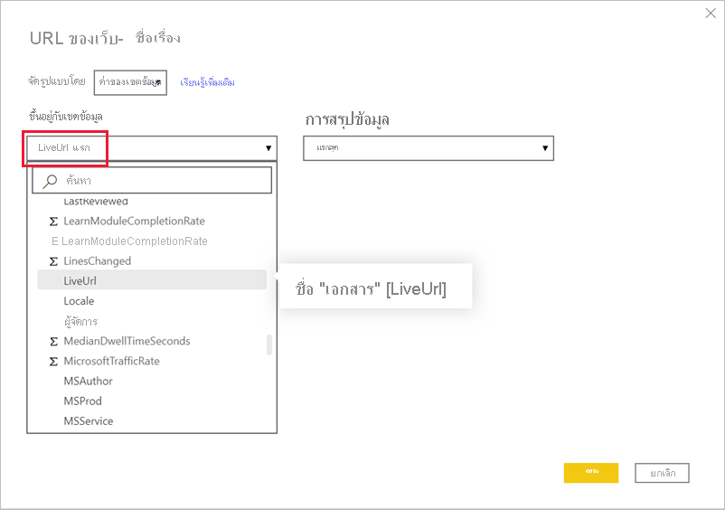
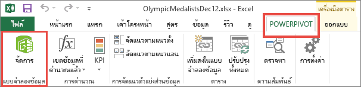
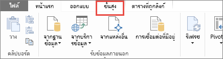
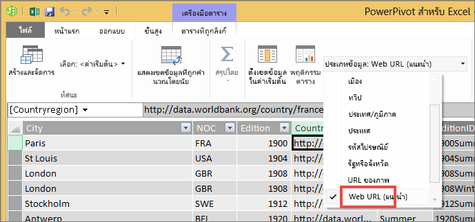

# เพิ่มไฮเปอร์ลิงก์ (URL) ไปยังตารางหรือเมทริกซ์Add hyperlinks (URLs) to a table or matrix
หัวข้อนี้จะสอนวิธีเพิ่มไฮเปอร์ลิงก์ (URL) ไปยังตารางThis topic teaches how to add hyperlinks (URLs) to a table. คุณใช้ Power BI Desktop เพื่อเพิ่มไฮเปอร์ลิงก์ (URL) ไปยังชุดข้อมูลYou use Power BI Desktop to add hyperlinks (URLs) to a dataset. คุณสามารถเพิ่มไฮเปอร์ลิงก์เหล่านั้นไปยังตารางหรือเมทริกซ์รายงานของคุณได้ในทั้ง Power BI Desktop หรือบริการ Power BIYou can add those hyperlinks to your report tables and matrixes in either Power BI Desktop or the Power BI service. จากนั้น คุณสามารถแสดงไอคอนของ URL หรือลิงก์ หรือจัดรูปแบบคอลัมน์อื่นเป็นข้อความลิงก์ได้Then you can display the URL or a link icon, or format another column as link text.

คุณยังสามารถสร้างไฮเปอร์ลิงก์ใน [กล่องข้อความในรายงาน](service-add-hyperlink-to-text-box.md) ในบริการของ Power BI และ Power BI DesktopYou can also create hyperlinks in [text boxes in reports](service-add-hyperlink-to-text-box.md) in the Power BI service and Power BI Desktop. และในบริการ Power BI คุณสามารถเพิ่มไฮเปอร์ลิงก์ไปยัง [ไทล์บนแดชบอร์ด](service-dashboard-edit-tile.md) และ [กล่องข้อความบนแดชบอร์ด](service-dashboard-add-widget.md)And in the Power BI service, you can add hyperlinks to [tiles on dashboards](service-dashboard-edit-tile.md) and to [text boxes on dashboards](service-dashboard-add-widget.md). 

## จัดรูปแบบ URL เป็นไฮเปอร์ลิงก์ใน Power BI DesktopFormat a URL as a hyperlink in Power BI Desktop

คุณสามารถจัดรูปแบบเขตข้อมูล URL เป็นไฮเปอร์ลิงก์ได้ใน Power BI Desktop แต่ไม่สามารถทำได้ในบริการของ Power BIYou can format a field with URLs as hyperlinks in Power BI Desktop, but not in the Power BI service. คุณยังสามารถ [จัดรูปแบบไฮเปอร์ลิงก์ใน Excel Power Pivot](#create-a-table-or-matrix-hyperlink-in-excel-power-pivot) ก่อนนำเข้าเวิร์กบุ๊กไปยัง Power BI.You can also [format hyperlinks in Excel Power Pivot](#create-a-table-or-matrix-hyperlink-in-excel-power-pivot) before you import the workbook into Power BI.

1. ใน Power BI Desktop ถ้าเขตข้อมูลที่มีไฮเปอร์ลิงก์ไม่ปรากฏในชุดข้อมูลของคุณอยู่แล้ว ให้เพิ่ทเป็น[คอลัมน์แบบกำหนดเอง](../transform-model/desktop-common-query-tasks.md)In Power BI Desktop, if a field with a hyperlink doesn't already exist in your dataset, add it as a [custom column](../transform-model/desktop-common-query-tasks.md).

    > [!NOTE]
    > คุณไม่สามารถสร้างคอลัมน์ในโหมด DirectQuery ได้You can't create a column in DirectQuery mode.  แต่ถ้าข้อมูลของคุณมี URL อยู่แล้ว คุณสามารถทำให้ URL เหล่านั้นเป็นไฮเปอร์ลิงก์ได้But if your data already contains URLs, you can turn them into hyperlinks.

2. ในมุมมองข้อมูลหรือมุมมองรายงาน ให้เลือกคอลัมน์In Data view or Report view, select the column. 

3. บนแท็บ **การสร้างแบบจำลอง** เลือก **ประเภทข้อมูล** > **URL เว็บ**On the **Modeling** tab, select **Data Category** > **Web URL**.
   
    

    > [!NOTE]
    > URL ต้องเริ่มต้นด้วยเลขนำหน้าบางอย่างURLS must start with certain prefixes. โปรดดู [ข้อควรพิจารณาและข้อจำกัด](#considerations-and-troubleshooting) ในบทความนี้สำหรับรายการทั้งหมดSee [Considerations and troubleshooting](#considerations-and-troubleshooting) in this article for the complete list.

## สร้างตารางหรือเมทริกซ์ด้วยไฮเปอร์ลิงก์Create a table or matrix with a hyperlink

1. หลังจากคุณได้ [จัดรูปแบบไฮเปอร์ลิงก์เป็น URL](#format-a-url-as-a-hyperlink-in-power-bi-desktop) แล้ว ให้สลับไปที่มุมมองรายงานAfter you've [formatted a hyperlink as a URL](#format-a-url-as-a-hyperlink-in-power-bi-desktop), switch to Report view.
2. สร้างตารางหรือเมทริกซ์ด้วยเขตข้อมูลที่คุณจัดหมวดหมู่เป็น URL เว็บCreate a table or matrix with the field that you categorized as a Web URL. ไฮเปอร์ลิงก์จะมีสีน้ำเงินและขีดเส้นใต้The hyperlinks are blue and underlined.

    

## แสดงไฮเปอร์ลิงก์ไอคอนแทน URLDisplay a hyperlink icon instead of a URL

ถ้าคุณไม่ต้องการแสดง URL ยาวในตาราง คุณสามารถแสดงเป็นไฮเปอร์ลิงก์แทนได้If you don't want to display a long URL in a table, you can display a hyperlink icon  แทนinstead. 

> [!NOTE]
> คุณไม่สามารถแสดงไอคอนในเมทริกซ์ได้You can't display icons in a matrix.
   
1. อันดับแรก [สร้างตารางที่มีไฮเปอร์ลิงก์](#create-a-table-or-matrix-with-a-hyperlink)First, [create a table with a hyperlink](#create-a-table-or-matrix-with-a-hyperlink).

2. เลือกตารางเพื่อเปิดใช้งานSelect the table to make it active.

    เลือกไอคอน **จัดรูปแบบ**  เพื่อเปิดแถบจัดรูปแบบSelect the **Format** icon  to open the Formatting tab.

    ขยาย **ค่า** ค้นหา **ไอคอน URL** และตั้งค่าการใช้งานเป็น **เปิด**Expand **Values**, locate **URL icon**, and turn it to **On**.

    

1. (ไม่บังคับ) [เผยแพร่รายงาน](desktop-upload-desktop-files.md) จาก Power BI Desktop ไปยังบริการของ Power BI(Optional) [Publish the report](desktop-upload-desktop-files.md) from Power BI Desktop to the Power BI service. เมื่อคุณเปิดรายงานในบริการของ Power BI ไฮเปอร์ลิงก์จะทำงานด้วยเช่นกันWhen you open the report in the Power BI service, the hyperlinks work there, too.

## จัดรูปแบบข้อความลิงก์เป็นไฮเปอร์ลิงก์Format link text as a hyperlink

คุณยังสามารถจัดรูปแบบเขตข้อมูลอื่นในตารางเป็นไฮเปอร์ลิงก์และไม่มีคอลัมน์สำหรับ URL เลยYou can also format another field in a table as the hyperlink, and not have a column for the URL at all. ในกรณีนี้ คุณไม่จัดรูปแบบคอลัมน์เป็น URL เว็บIn this case, you don't format the column as a Web URL.

> [!NOTE]
> คุณไม่สามารถจัดรูปแบบเขตข้อมูลอื่นเป็นไฮเปอร์ลิงก์ในเมทริกซ์ได้You can't format another field as the hyperlink in a matrix.

1. ในเขตข้อมูลที่ไม่มีไฮเปอร์ลิงก์ปรากฏในชุดข้อมูลของคุณ ให้ใช้ Power BI Desktop เพื่อเพิ่มเป็น [คอลัมน์แบบกำหนดเอง](../transform-model/desktop-common-query-tasks.md)If a field with a hyperlink doesn't already exist in your dataset, use Power BI Desktop to add it as a [custom column](../transform-model/desktop-common-query-tasks.md). อีกครั้ง คุณไม่สามารถสร้างคอลัมน์ในโหมด DirectQuery ได้Again, you can't create a column in DirectQuery mode.  แต่ถ้าข้อมูลของคุณมี URL อยู่แล้ว คุณสามารถทำให้ URL เหล่านั้นเป็นไฮเปอร์ลิงก์ได้But if your data already contains URLs, you can turn them into hyperlinks.

2. ในมุมมองข้อมูลหรือมุมมองรายงาน ให้เลือกคอลัมน์ที่ประกอบด้วย URLIn Data view or Report view, select the column that contains the URL. 

3. บนแท็บ **การสร้างแบบจำลอง** ให้เลือก **ประเภทข้อมูล**On the **Modeling** tab, select **Data Category**. ตรวจสอบให้แน่ใจว่าคอลัมน์ถูกจัดรูปแบบเป็น **ไม่มีประเภท**Make sure the column is formatted as **Uncategorized**.

2. ในมุมมองรายงาน สร้างตารางหรือเมทริกซ์ด้วยคอลัมน์ URL และคอลัมน์ที่คุณจะจัดรูปแบบเป็นข้อความลิงก์In Report view, create a table or matrix with the URL column and the column you're going to format as link text.

3. ในตารางที่เลือกไว้ เลือกไอคอน **จัดรูปแบบ**  เพื่อเปิดแถบจัดรูปแบบWith the table selected, select the **Format** icon  to open the Formatting tab.

4. ขยาย **การจัดรูปแบบตามเงื่อนไข** ตรวจสอบให้แน่ใจว่าชื่อในกล่องเป็นคอลัมน์ที่คุณต้องการให้เป็นข้อความลิงก์Expand **Conditional formatting**, making sure the name in the box is the column you want as link text. ค้นหา **URL เว็บ** และเปลี่ยนเป็น **เปิด**Locate **Web URL**, and turn it to **On**.

    

    > [!NOTE]
    > หากคุณไม่เห็นตัวเลือก **URL เว็บ** ตรวจสอบให้แน่ใจว่าคอลัมน์ที่มีไฮเปอร์ลิงก์ *ไม่* ได้จัดรูปแบบเป็น **URL เว็บ** ในกล่องดรอปดาวน์ **ประเภทข้อมูล**If you don't see a **Web URL** option, make sure the column that contains the hyperlinks is *not* formatted as **Web URL** in the **Data Category** dropdown box.

5. ในกล่องข้อความ **URL เว็บ** เลือกเขตข้อมูลที่มี URL ในกล่อง **เขตข้อมูล อิงตาม** > **ตกลง**In the **Web URL** dialog box, select the field that contains the URL in the **Based on field** box > **OK**.

    

    ตอนนี้ข้อความในคอลัมน์นั้นจะได้รับการจัดรูปแบบเป็นลิงก์Now the text in that column is formatted as the link.

    

1. (ไม่บังคับ) [เผยแพร่รายงาน](desktop-upload-desktop-files.md) จาก Power BI Desktop ไปยังบริการของ Power BI(Optional) [Publish the report](desktop-upload-desktop-files.md) from Power BI Desktop to the Power BI service. เมื่อคุณเปิดรายงานในบริการของ Power BI ไฮเปอร์ลิงก์จะทำงานด้วยเช่นกันWhen you open the report in the Power BI service, the hyperlinks work there, too.

## สร้างไฮเปอร์ลิงก์ตารางหรือเมทริกซ์ใน Power Pivot ของ ExcelCreate a table or matrix hyperlink in Excel Power Pivot

อีกวิธีในการเพิ่มไฮเปอร์ลิงก์ไปยัง Power BI ตารางและเมทริกซ์คือ การสร้างไฮเปอร์ลิงก์ในชุดข้อมูลก่อนที่คุณนำเข้า/เชื่อมต่อกับชุดข้อมูลนั้นจาก Power BIAnother way to add hyperlinks to your Power BI tables and matrixes is to create the hyperlinks in the dataset before you import/connect to that dataset from Power BI. ตัวอย่างนี้ใช้สมุดงาน ExcelThis example uses an Excel workbook.

1. เปิดสมุดงานใน ExcelOpen the workbook in Excel.
2. เลือกแถบ **PowerPivot** และจากนั้น เลือก **จัดการ**Select the **PowerPivot** tab and then choose **Manage**.
   
   
1. เมื่อ PowerPivot เปิดขึ้น เลือกแถบ **ขั้นสูง**When PowerPivot opens, select the **Advanced** tab.
   
   
4. วางเคอร์เซอร์ในคอลัมน์ที่ประกอบด้วย URL ที่คุณต้องการเปลี่ยนเป็นไฮเปอร์ลิงก์ในตาราง Power BIPlace your cursor in the column that contains the URLs that you'd like to turn into hyperlinks in Power BI tables.
   
   > [!NOTE]
   > URL ต้องเริ่มต้นด้วยเลขนำหน้าบางอย่างURLS must start with certain prefixes. โปรดดู [ข้อควรพิจารณาและการแก้ไขปัญหา](#considerations-and-troubleshooting) สำหรับรายการทั้งหมดSee [Considerations and troubleshooting](#considerations-and-troubleshooting) for the complete list.
   > 
   
5. ในกลุ่ม **รายงานคุณสมบัติ** เลือก **ประเภทข้อมูล** แบบเลื่อนลง แล้วเลือก **URL เว็บ**In the **Reporting Properties** group, select the **Data Category** dropdown and choose **Web URL**. 
   
   

6. จากบริการ Power BI หรือ Power BI Desktop เชื่อมต่อไปยัง หรือนำเข้าสมุดงานนี้From the Power BI service or Power BI Desktop, connect to or import this workbook.
7. สร้างการแสดงภาพตารางที่มีเขตข้อมูล URLCreate a table visualization that includes the URL field.
   
   

## ข้อควรพิจารณาและการแก้ไขปัญหาConsiderations and troubleshooting

URL ต้องเริ่มต้นด้วยหนึ่งในรายการต่อไปนี้:URLS must start with one of the following:
- httphttp
- httpshttps
- mailtomailto
- ftpftp
- newsnews
- telnettelnet

คำถาม: ฉันสามารถใช้ URL ที่กำหนดเองเป็นไฮเปอร์ลิงก์ในตารางหรือเมทริกซ์ได้หรือไม่?Q: Can I use a custom URL as a hyperlink in a table or matrix?    
คำตอบ: ไม่ได้A: No. คุณสามารถใช้ไอคอนลิงก์หนึ่งได้You can use a link icon. ถ้าคุณต้องการข้อความแบบกำหนดเองสำหรับไฮเปอร์ลิงก์ของคุณ และรายการของ URL เป็นรายการที่สั้น ให้พิจารณาการใช้กล่องข้อความแทนIf you need custom text for your hyperlinks and your list of URLs is short, consider using a text box instead.

## ขั้นตอนถัดไปNext steps
[การแสดงภาพในรายงาน Power BIVisualizations in Power BI reports](../visuals/power-bi-report-visualizations.md)

[แนวคิดพื้นฐานสำหรับนักออกแบบในบริการ Power BIBasic concepts for designers in the Power BI service](../fundamentals/service-basic-concepts.md)

มีคำถามเพิ่มเติมหรือไม่More questions? [ลองไปที่ชุมชน Power BITry the Power BI Community](https://community.powerbi.com/)
