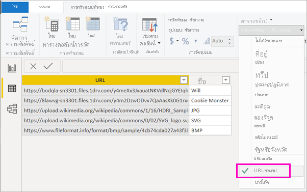

# แสดงรูปภาพต่าง ๆ ในตาราง เมทริกซ์ หรือตัวแบ่งส่วนข้อมูลในรายงานDisplay images in a table, matrix, or slicer in a report

วิธีที่ดีในการเพิ่มประสิทธิภาพให้กับรายงานของคุณคือการเพิ่มรูปภาพในรายงานA good way to enhance your reports is to add images to them. รูปภาพแบบคงที่บนหน้ารายงานนั้นเหมาะสำหรับวัตถุประสงค์บางอย่างStatic images on the page are good for some purposes. แต่บางครั้งคุณก็ต้องใช้รูปภาพที่เกี่ยวข้องกับข้อมูลในรายงานของคุณBut sometimes you want images that relate to the data in your report. ในหัวข้อนี้จะสอนวิธีการแสดงรูปภาพต่าง ๆ ในตาราง เมทริกซ์ ตัวแบ่งส่วนข้อมูล หรือการ์ดแบบหลายแถวThis topic teaches you how to display images in a table, matrix, slicer, or multi-row card. 

## เพิ่มรูปภาพลงในรายงานของคุณAdd images to your report

1. สร้างคอลัมน์ที่มี Url ของรูปภาพCreate a column with the URLs of the images. ดูข้อกำหนดต่าง ๆ ได้ที่[ข้อควรพิจารณา](#considerations)ในบทความนี้See [Considerations](#considerations) later in this article for requirements.

1. เลือกคอลัมน์นั้นSelect that column. บนริบบอน **การวางรูปแบบ** สำหรับ **หมวดหมู่ข้อมูล** ให้เลือก **URL ของรูปภาพ**On the **Modeling** ribbon, for **Data category**, select **Image URL**.

    

1. เพิ่มคอลัมน์ไปที่ตาราง เมทริกซ์ ตัวแบ่งส่วนข้อมูล หรือการ์ดแบบหลายแถวAdd the column to a table, matrix, slicer, or multi-row card.

    

## ข้อควรพิจารณาConsiderations

- รูปภาพต้องอยู่ในรูปแบบไฟล์เหล่านี้:  .bmp, .jpg, .jpeg, .gif, .png หรือ .svgThe image needs to be in one of these file formats: .bmp, .jpg, .jpeg, .gif, .png, or  .svg
- URL ต้องสามารถเข้าถึงได้โดยไม่ระบุตัวตน และไม่อยู่ในเว็บไซต์ที่จำเป็นต้องลงชื่อเข้าใช้ เช่น SharePointThe URL needs to be anonymously accessible, not on a site that requires a sign-in, such as SharePoint. อย่างไรก็ตาม หากมีการโฮสต์รูปภาพบน SharePoint หรือ OneDrive คุณอาจได้รับรหัสฝังตัวซึ่งจะนำทางไปยังรูปภาพดังกล่าวโดยตรงHowever, if images are hosted on SharePoint or OneDrive, you may be able to get an embed code that points directly to them. 

## ขั้นตอนถัดไปNext steps

[เค้าโครงและการจัดรูปแบบหน้าPage layout and formatting](/learn/modules/visuals-in-power-bi/12-formatting)

[แนวคิดพื้นฐานสำหรับนักออกแบบในบริการของ Power BIBasic concepts for designers in the Power BI service](../fundamentals/service-basic-concepts.md)

มีคำถามเพิ่มเติมหรือไม่More questions? [ลองไปที่ชุมชน Power BITry the Power BI Community](https://community.powerbi.com/)
