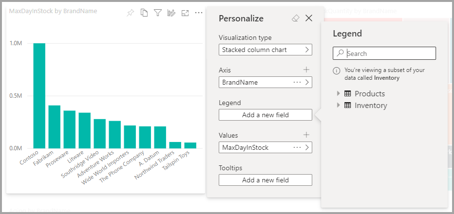
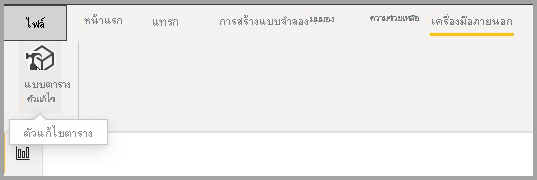
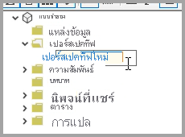
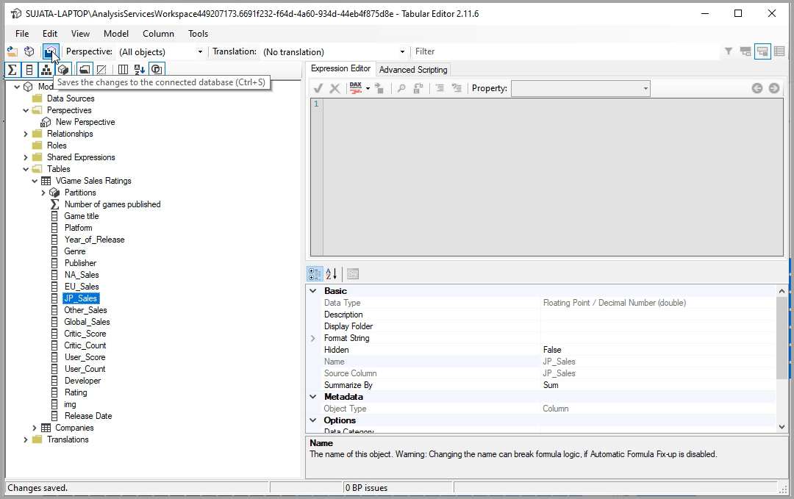
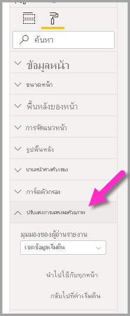
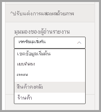
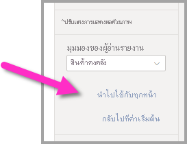

# อนุญาตให้ผู้ใช้สามารถตั้งค่าวิชวลส่วนบุคคลในรายงานได้Let users personalize visuals in a report

[!INCLUDE [applies-to](../includes/applies-to.md)] [!INCLUDE [yes-desktop](../includes/yes-desktop.md)] [!INCLUDE [yes-service](../includes/yes-service.md)][!INCLUDE [applies-to](../includes/applies-to.md)] [!INCLUDE [yes-desktop](../includes/yes-desktop.md)] [!INCLUDE [yes-service](../includes/yes-service.md)]

เมื่อคุณแชร์รายงานกับผู้ชมที่หลากหลาย ผู้ใช้บางส่วนของคุณอาจต้องการดูมุมมองวิชวลที่เฉพาะเจาะจงซึ่งแตกต่างกันเล็กน้อยWhen you share a report with a broad audience, some of your users may want to see slightly different views of particular visuals. บางทีผู้ใช้อาจต้องการสลับสิ่งที่อยู่บนแกน เปลี่ยนประเภทวิชวลหรือเพิ่มบางอย่างไปยังคำแนะนำเครื่องมือMaybe they'd want to swap what's on the axis, change the visual type, or add something to the tooltip. เป็นเรื่องยากที่จะสร้างวิชวลซึ่งสามารถตอบสนองความต้องการของทุกคนได้It's hard to make one visual that satisfies everyone's requirements. ด้วยความสามารถใหม่นี้ คุณสามารถมอบอํานาจให้ผู้ใช้ทางธุรกิจสามารถสํารวจและปรับแต่งภาพได้ในมุมมองการอ่านรายงานWith this new capability, you can empower your business users to explore and personalize visuals, all in report reading view. พวกเขาสามารถปรับวิชวลตามที่ตนเองต้องการ และบันทึกวิชวลดังกล่าวเป็นบุ๊กมาร์กเพื่อกลับมาใช้งานภายหลังได้They can adjust the visual the way they want, and save it as a bookmark to come back to. พวกเขาไม่จำเป็นต้องมีสิทธิ์ในการแก้ไขรายงาน หรือกลับไปยังผู้เขียนรายงานเพื่อทำการเปลี่ยนแปลงThey don't need to have edit permission for the report, or to go back to the report author for a change.

:::image type="content" source="media/power-bi-personalize-visuals/power-bi-personalize-visual.png" alt-text="ตั้งค่าวิชวลส่วนบุคคล":::
 
## รายงานอะไรที่ผู้ใช้สามารถเปลี่ยนแปลงได้What report users can change

คุณลักษณะนี้ช่วยให้ผู้ใช้ทางธุรกิจสามารถรับข้อมูลเชิงลึกเพิ่มเติมผ่านการสำรวจวิชวลแบบเฉพาะกิจบนรายงาน Power BI ได้This feature allows business users to gain further insights through ad-hoc exploration of visuals on a Power BI report. หากต้องการเรียนรู้วิธีการใช้คุณลักษณะนี้ในฐานะผู้ใช้ ให้ดู [ตั้งค่าวิชวลส่วนบุคคลในรายงานของคุณ](../consumer/end-user-personalize-visuals.md)To learn how to use this feature as a user, see [Personalize visuals in your reports](../consumer/end-user-personalize-visuals.md). คุณลักษณะนี้เหมาะสำหรับผู้เขียนรายงานที่ต้องการเปิดใช้งานสถานการณ์การสำรวจพื้นฐานของตัวอ่านรายงานของตนThe feature is ideal for report creators who want enable basic exploration scenarios for their report readers. ต่อไปนี้คือการปรับเปลี่ยนตัวอ่านรายงานที่สามารถทำได้:Here are modifications that report readers can make:

- การเปลี่ยนชนิดของการแสดงภาพChange the visualization type
- สลับหน่วยวัดหรือมิติSwap out a measure or dimension
- เพิ่มหรือลบคำอธิบายแผนภูมิAdd or remove a legend
- เปรียบเทียบหน่วยวัดสองหน่วยขึ้นไปCompare two or more measures
- เปลี่ยนการรวมและอื่น ๆChange aggregations, etc.

ไม่เฉพาะคุณลักษณะนี้เท่านั้นที่อนุญาตให้ใช้งานสำหรับความสามารถในการสำรวจใหม่Not only does this feature allow for new exploration capabilities. แต่ยังมีวิธีการสำหรับผู้ใช้ในการบันทึกและแชร์การเปลี่ยนแปลงของตนเอง:It also includes ways for users to capture and share their changes:

- บันทึกการเปลี่ยนแปลงของตนเองCapture their changes
- แชร์การเปลี่ยนแปลงของตนเองShare their changes
- รีเซ็ตการเปลี่ยนแปลงทั้งหมดของตนเองสำหรับรายงานReset all their changes for a report
- รีเซ็ตการเปลี่ยนแปลงทั้งหมดของตนเองสำหรับวิชวลReset all their changes for a visual
- ล้างการเปลี่ยนแปลงล่าสุดของตนเองClear out their recent changes

## ใช้มุมมองต่าง ๆ เพื่อให้ได้ภาพที่โฟกัสมากขึ้นUse Perspectives for a more focused view

เพื่อการปรับแต่งภาพ คุณสามารถใช้ **มุมมอง** เพื่อเลือกชุดย่อยของโมเดลที่ให้มุมมองที่โฟกัสมากขึ้นได้For Personalize visuals, you can use **Perspectives** to choose a subset of a model that provides a more focused view. การเลือกชุดย่อยจะเป็นประโยชน์เมื่อทำงานกับโมเดลข้อมูลขนาดใหญ่ และช่วยให้คุณสามารถมุ่งเน้นไปที่ชุดย่อยของเขตข้อมูลซึ่งสามารถบริหารจัดการได้และไม่มีการครอบงำผู้อ่านรายงานด้วยเขตข้อมูลเต็มรูปแบบเหมือนในโมเดลขนาดใหญ่Choosing a subset can be helpful when working with a large data model, allowing you to focus on a manageable subset of fields, and not overwhelm report readers with the full collection of fields in that large model. 

โปรดพิจารณาถึงสิ่งต่าง ๆ เหล่านี้เมื่อทำงานกับมุมมองKeep the following considerations in mind when working with perspectives:

* มุมมองไม่ได้มีจุดประสงค์เพื่อใช้เป็นเครื่องมือในการรักษาความปลอดภ้ัย แต่เป็นเครื่องมือที่ช่วยมอบประสบการณ์ผู้ใช้ที่ดียิ่งขึ้นPerspectives are not meant to be used as a security mechanism, they are a tool for providing a better end-user experience. การรักษาความปลอดภัยสำหรับมุมมองทั้งหมดนั้นได้มาจากโมเดลที่เป็นรากฐานAll security for a perspective is inherited from the underlying model.

* ระบบนี้สนับสนุนมุมมองทั้งแบบตารางและแบบหลายมิติPerspectives in both tabular and multi-dimensional models are supported. อย่างไรก็ตาม สำหรับมุมมองในโมเดลแบบหลายมิติ คุณจะสามารถตั้งค่ามุมมองให้เหมือนกับรายงานพื้นฐานได้เท่านั้นHowever, for perspectives in multi-dimensional models, you can only set the perspective to be the same as the base cube for the report.

* ก่อนที่จะลบมุมมองออกจากโมเดล โปรดตรวจสอบให้แน่ใจว่าไม่ใช้ใช้มุมมองดังกล่าวในการแสดงภาพแบบปรับแต่งเองBefore deleting a perspective from a model, be sure to check that the perspective is not being used in the Personalize visuals experience. 

หากต้องการใช้มุมมอง คุณต้องเปิดใช้งานมุมมองแบบปรับแต่งเองสำหรับรายงานTo use Perspectives, you must enable Personalize visuals for the report. คุณจำเป็นต้องสร้างมุมมองอย่างน้อยหนึ่งรายการที่มีมิติและหน่วยวัดที่คุณต้องการให้ผู้ใช้ได้ใช้สำหรับประสบการณ์การแสดงภาพแบบปรับแต่งเองYou also must create at least one Perspective that includes the dimensions and measures you want end-users to interact with for the Personalize visuals experience.

เพื่อสร้างมุมมอง ให้ใช้[ตัวแก้ไขตาราง](https://tabulareditor.com/)ซึ่งคุณสามารถดาวน์โหลดได้จากตำแหน่งต่อไปนี้: ดาวน์โหลดตัวแก้ไขตารางTo create the perspective use [Tabular Editor](https://tabulareditor.com/), which you can download from the following location: Tabular Editor download

เมื่อคุณติดตั้ง **ตัวแก้ไขตาราง** แล้ว ให้เปิดรายงานของคุณใน **Power BI Desktop** แล้วเปิดใช้ **ตัวแก้ไขตาราง** จากแท็บ **เครื่องมือภายนอก** ของริบบอน ตามที่แสดงในภาพต่อไปนี้Once you install **Tabular Editor**, open your report in **Power BI Desktop** and launch **Tabular Editor** from the **External Tools** tab of the ribbon, as shown in the following image.

ในตัวแก้ไขตาราง ให้คลิกขวาที่โฟลเดอร์ **มุมมอง** เพื่อสร้างมุมมองใหม่In Tabular Editor, right-click on the **Perspectives** folder to create a new perspective.

คุณสามารถดับเบิลคลิกที่ข้อความเพื่อเปลี่ยนชื่อมุมมองได้You can double-click the text to rename the perspective.

ต่อมา ให้เพิ่มเขตข้อมูลเข้าสู่มุมมองโดยการเปิดโฟลเดอร์ **ตาราง** ในตัวแก้ไขตาราง คลิกขวาที่เขตข้อมูลที่คุณต้องการเพื่อแสดงในมุมมองNext, add fields to the perspective by opening the **Tables** folder in Tabular Editor, the right-click on the fields you want to show in the perspective.

ทำซ้ำกระบวนการดังกล่าวสำหรับแต่ละเขตข้อมูลที่คุณต้องการเพิ่มในมุมมองRepeat that process for each field you want to add to the perspective. คุณไม่สามารถเพิ่มเขตข้อมูลซ้ำไว้ในมุมมองเดียวได้ ดังนั้นระบบจะปิดการใช้งานตัวเลือกในการเพิ่มเขตข้อมูลที่คุณเคยเพิ่มไปยังมุมมองแล้วYou can’t add duplicate fields in a perspective, so any fields you already added to a perspective will have the option to add it disabled.

หลังจากที่คุณได้เพิ่มเขตข้อมูลทั้งหมดที่คุณต้องการแล้ว ให้ตรวจสอบให้แน่ใจว่าได้บันทึกการตั้งค่าของคุณทั้งในตัวแก้ไขตารางและใน Power BI DesktopAfter you added all the fields you want, be sure to save your settings, both in Tabular Editor and then also in Power BI Desktop.

เมื่อคุณได้บันทึกมุมมองใหม่ไว้ในโมเดล และบันทึกใน Power BI Desktop แล้ว ให้ไปที่บานหน้าต่าง **รูปแบบ** ของหน้าซึ่งคุณจะเห็นส่วนใหม่สำหรับ **การกำหนดการแสดงผลด้วยภาพ**Once you save the new perspective to the model, and save the Power BI Desktop report, navigate to the **Format** pane for the page, where you see a new section for **Personalize visual**.

ในเบื้องต้น ระบบจะตั้งค่าตัวเลือกสำหรับ *มุมมองรายงาน-ผู้อ่าน* เป็น *เขตข้อมูลตามค่าเริ่มต้น*The selection for *Report-reader perspective* is set to *Default fields* initially. เมื่อคุณเลือกลูกศรดรอปดาวน์ คุณจะเห็นมุมมองอื่น ๆ ที่คุณได้สร้างขึ้นOnce you select the drop down arrow, you see the other Perspectives you’ve created.

เมื่อคุณตั้งค่ามุมมองสำหรับหน้ารายงาน ระบบจะกรองประสบการณ์กำหนดการแสดงผลด้วยภาพสำหรับหน้าดังกล่าวไปยังมุมมองที่เลือกOnce you set the Perspective for the report page, the Personalize visuals experience for that page is filtered to the selected Perspective. การเลือก **นำไปใช้กับทุกหน้า** จะช่วยให้คุณสามารถใช้การตั้งค่ามุมมองของคุณกับหน้าที่มีอยู่ทั้งหมดในรายงานของคุณได้Selecting **Apply to all pages** lets you apply your Perspective setting to all existing pages in your report.

## เปิดใช้งานการตั้งค่าส่วนบุคคลในรายงานEnable personalization in a report

คุณสามารถเปิดใช้งานคุณลักษณะใน Power BI Desktop หรือบริการของ Power BI ได้You can enable the feature either in Power BI Desktop or the Power BI service. คุณยังสามารถเปิดใช้งานในรายงานแบบฝังได้You can also enable it in embedded reports.

### ใน Power BI DesktopIn Power BI Desktop

หากต้องการเปิดใช้งานคุณลักษณะใน Power BI Desktop ให้ไปที่ **ไฟล์** > **ตัวเลือกและการตั้งค่า** > **ตัวเลือก** > **ไฟล์ปัจจุบัน** > **การตั้งค่ารายงาน**To enable the feature in Power BI Desktop, go to **File** > **Options and Settings** > **Options** > **Current file** > **Report settings**. ตรวจสอบให้แน่ใจว่า **ตั้งค่าวิชวลส่วนบุคคล** เปิดใช้งานอยู่Make sure **Personalize visuals** is turned on.

:::image type="content" source="media/power-bi-personalize-visuals/personalize-report-setting-desktop.png" alt-text="เปิดใช้งานการตั้งค่าส่วนบุคคลในรายงาน":::

### ในบริการของ Power BIIn the Power BI service

หากต้องการเปิดใช้งานคุณลักษณะในบริการของ Power BI แทน ให้ไปที่ **การตั้งค่า** สำหรับรายงานของคุณTo enable the feature in the Power BI service instead, go to **Settings** for your report.

:::image type="content" source="media/power-bi-personalize-visuals/power-bi-report-service-settings-personalize-visual.png" alt-text="การตั้งค่ารายงานในบริการของ Power BI":::

เปิด **การตั้งค่าวิชวลส่วนบุคคล** > **บันทึก**Turn on **Personalize visuals** > **Save**.

:::image type="content" source="media/power-bi-personalize-visuals/personalize-report-setting-service.png" alt-text="เปิด ตั้งค่าวิชวลส่วนบุคคลในรายงาน":::

## เปิดหรือปิดคุณสมบัติที่หน้าหรือระดับสายตาTurn the feature on or off at a page or visual level

เมื่อคุณเปิดใช้งานปรับแต่งภาพสําหรับรายงานที่กําหนดโดยค่าเริ่มต้นภาพทั้งหมดในรายงานนั้นสามารถเป็นแบบส่วนบุคคลWhen you enable Personalize visuals for a given report, by default all visuals in that report can be personalized. ถ้าคุณไม่ต้องการให้ภาพทั้งหมดเป็นแบบส่วนบุคคล คุณสามารถเปิดหรือปิดการตั้งค่าต่อหน้าหรือต่อภาพIf you don't want all the visuals to be personalized, you can turn the setting on or off per page or per visual.

### แต่ละหน้าPer page

เลือกแท็บหน้า > เลือก **รูปแบบ** ในบานหน้าต่าง **การแสดงภาพ**Select the page tab > select **Format** in the **Visualizations** pane.

:::image type="content" source="media/power-bi-personalize-visuals/personalize-page-level-setting.png" alt-text="เลือกการตั้งค่าวิชวลส่วนบุคคลสำหรับแต่ละหน้า":::
 
เลื่อนแถบ **ตั้งค่าวิชวลส่วนบุคคล** >  **เพื่อเปิด** หรือ **ปิด**Slide **Personalize visual** >  **On** or **Off**.

### แต่ละวิชวลPer visual

เลือกวิชวล > เลือก **รูปแบบ** ในบานหน้าต่าง **การแสดงภาพ** > ขยาย **ส่วนหัวของวิชวล**Select the visual > select **Format** in the **Visualizations** pane > expand **Visual header**.

:::image type="content" source="media/power-bi-personalize-visuals/power-bi-format-visual-header-personalize.png" alt-text="เลือกส่วนหัวของวิชวล":::
 
เลื่อนแถบ **ตั้งค่าวิชวลส่วนบุคคล** >  **เพื่อเปิด** หรือ **ปิด**Slide **Personalize visual** >  **On** or **Off**.

:::image type="content" source="media/power-bi-personalize-visuals/power-bi-format-visual-personalize-on-off.png" alt-text="แถบเลื่อนสำหรับการเปิดหรือปิดการตั้งค่าวิชวลส่วนบุคคล":::

## ข้อจำกัดLimitations

คุณลักษณะมีข้อจำกัดบางอย่างที่ต้องระวังในขณะนี้Currently the feature has a few limitations to be aware of.

- คุณลักษณะนี้ไม่รองรับการเผยแพร่ไปยังเว็บThis feature isn't supported for publish to web.
- การสำรวจของผู้ใช้ไม่ดำเนินการต่อโดยอัตโนมัติUser explorations don't automatically persist. คุณต้องบันทึกมุมมองของคุณเป็นบุ๊กมาร์กส่วนบุคคล เพื่อบันทึกการเปลี่ยนแปลงของคุณYou need to save your view as a personal bookmark to capture your changes.
- คุณลักษณะนี้ได้รับการรองรับในแอป Power BI สำหรับอุปกรณ์เคลื่อนที่สำหรับแท็บเล็ต iOS และ Android และในแอป Power BI Windows แต่ไม่ได้รับการรองรับในแอป Power BI สำหรับอุปกรณ์เคลื่อนที่สำหรับโทรศัพท์This feature is supported in the Power BI mobile apps for iOS and Android tablets and in the Power BI Windows app; it is not supported in the Power BI mobile apps for phones. อย่างไรก็ตาม การเปลี่ยนแปลงใด ๆ ที่ทำกับวิชวล ซึ่งคุณได้บันทึกในบุ๊กมาร์กส่วนบุคคลขณะที่ใช้บริการของ Power BI นั้นจะสามารถดำเนินการในแอป Power BI สำหรับอุปกรณ์เคลื่อนที่ทั้งหมดได้However, any change to a visual you save in a personal bookmark while in the Power BI service is respected in all the Power BI mobile apps.

## ขั้นตอนถัดไปNext steps

[ตั้งค่าวิชวลส่วนบุคคลในรายงานของคุณ](../consumer/end-user-personalize-visuals.md)[Personalize visuals in your reports](../consumer/end-user-personalize-visuals.md).     

ลองสัมผัสประสบการณ์การใช้งานการตั้งค่าวิชวลส่วนบุคคลใหม่Give the new visual personalization experience a try. ส่งคำติชมของคุณของคุณเกี่ยวกับคุณสมบัตินี้ และสิ่งที่เราสามารถปรับปรุงได้ ใน [ไซต์ Power BI Ideas](https://ideas.powerbi.com/forums/265200-power-bi)Give us your feedback for this feature, and how we can continue to improve it, on the [Power BI Ideas site](https://ideas.powerbi.com/forums/265200-power-bi). 

มีคำถามเพิ่มเติมหรือไม่More questions? [ลองไปที่ชุมชน Power BITry the Power BI Community](https://community.powerbi.com/)
