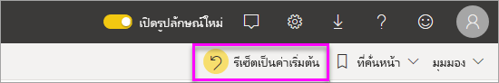
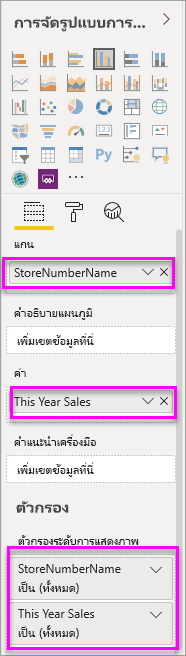
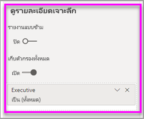

# เพิ่มตัวกรองไปยังรายงานใน Power BIAdd a filter to a report in Power BI

[!INCLUDE [power-bi-service-new-look-include](../includes/power-bi-service-new-look-include.md)]

บทความนี้จะอธิบายวิธีเพิ่มตัวกรองหน้า, ตัวกรองการแสดงภาพ, ตัวกรองรายงาน หรือตัวกรอง drillthrough ไปยังรายงานใน Power BIThis article explains how to add a page filter, visualization filter, report filter, or drillthrough filter to a report in Power BI. ตัวอย่างในบทความนี้จะอยู่ในบริการของ Power BIThe examples in this article are in the Power BI service. ขั้นตอนแทบจะเหมือนกันเกือบทั้งหมดใน Power BI DesktopThe steps are almost identical in Power BI Desktop.

**คุณทราบหรือไม่****Did you know?** Power BI มีการใช้งานตัวกรองใหม่Power BI has a new filter experience. อ่านเพิ่มเติมเกี่ยวกับ[การใช้งานตัวกรองใหม่ในรายงาน Power BI](power-bi-report-filter.md)Read more about [the new filter experience in Power BI reports](power-bi-report-filter.md).

Power BI มีตัวกรองหลายชนิด ตั้งแต่ชนิดแมนนวลและชนิดอัตโนมัติไปจนถึงชนิดเจาะลึกรายละเอียดและชนิดพาส-ทรูPower BI offers a number of different kinds of filters, from the manual and automatic to the drill-through and pass-through. อ่านเกี่ยวกับ [ตัวกรองประเภทต่าง ๆ](power-bi-report-filter-types.md)Read about the [different kinds of filters](power-bi-report-filter-types.md).

## ตัวกรองในมุมมองการแก้ไขและมุมมองการอ่านFilters in Editing view or Reading view
คุณสามารถโต้ตอบกับรายงานในสองมุมมอง คือ มุมมองการอ่าน และมุมมองการแก้ไขYou can interact with reports in two different views: Reading view and Editing view. ความสามารถในการกรองที่พร้อมใช้งานสำหรับคุณจะขึ้นอยู่กับมุมมองที่เลือกThe filtering capabilities available to you depend on which view you're in. อ่านรายละเอียด [เกี่ยวกับตัวกรองและการไฮไลท์ในรายงาน Power BI](power-bi-reports-filters-and-highlighting.md) ทั้งหมดRead all [about filters and highlighting in Power BI reports](power-bi-reports-filters-and-highlighting.md) for details.

บทความนี้จะอธิบายวิธีการสร้างตัวกรองใน **มุมมองการแก้ไข** ของรายงานThis article describes how to create filters in report **Editing view**.  สำหรับข้อมูลเพิ่มเติมเกี่ยวกับตัวกรองในมุมมองการอ่าน สามารถดูได้ที่ [โต้ตอบกับตัวกรองในมุมมองการอ่านของรายงาน](../consumer/end-user-report-filter.md)For more information on filters in Reading view, see [interacting with filters in report Reading view](../consumer/end-user-report-filter.md).

เนื่องจากตัวกรองยัง *คงอยู่* เมื่อคุณนำทางออกจากรายงาน Power BI ยังคงรักษาการเปลี่ยนแปลงของตัวกรอง, ตัวแบ่งส่วนข้อมูล และการเปลี่ยนแปลงของมุมมองข้อมูลอื่น ๆ ที่คุณสร้างBecause filters *persist*, when you navigate away from the report Power BI retains the filter, slicer, and other data view changes that you've made. ดังนั้นคุณจะสามารถกลับไปทำงานที่ค้างไว้ได้ เมื่อคุณกลับไปยังรายงานSo you can pick up where you left off when you return to the report. หากคุณไม่ต้องการเก็บการเปลี่ยนแปลงตัวกรองไว้ ให้เลือก **รีเซ็ตเป็นค่าเริ่มต้น** จากแถบเมนูด้านบนIf you don't want your filter changes to persist, select **Reset to default** from the top menubar.

## ระดับของตัวกรองในบานหน้าต่างตัวกรองLevels of filters in the Filters pane
ไม่ว่าคุณกำลังใช้บริการ Desktop หรือ Power BI บานหน้าต่างตัวกรองจะแสดงตามแนวทางด้านขวาของพื้นที่รายงานWhether you're using Desktop or Power BI service, the Filters pane displays along the right side of the report canvas. ถ้าคุณไม่เห็นบานหน้าต่างตัวกรอง เลือกแบบ " > " ไอคอนจากมุมขวาบนเพื่อขยายIf you don't see the Filters pane, select the ">" icon from the upper-right corner to expand it.

คุณสามารถตั้งค่าตัวกรองได้สามระดับสำหรับรายงาน ได้แก่: ตัวกรองระดับการแสดงผลด้วยภาพ ระดับหน้า และระดับรายงานYou can set filters at three different levels for the report: visual-level, page-level, and report-level filters. คุณยังสามารถตั้งค่าตัวกรองแบบเจาะลึกรายละเอียดYou can also set drillthrough filters. บทความนี้อธิบายถึงระดับต่างๆThis article explains the different levels.

## เพิ่มตัวกรองลงในวิชวลAdd a filter to a visual
มีสองวิธีที่คุณสามารถเพิ่มตัวกรองระดับการแสดงผลด้วยภาพไปยังการแสดงผลด้วยภาพที่เฉพาะเจาะจง You can add a visual-level filter to a specific visual in two different ways. 

* โดยการกรองเขตข้อมูลที่กำลังถูกใช้โดยการแสดงภาพFilter a field that is already being used by the visualization.
* โดยการระบุเขตข้อมูลที่ไม่ถูกใช้แล้วโดยการแสดงภาพ และเพิ่มเขตข้อมูลนั้นโดยตรงไปยังบักเก็ต **ตัวกรองระดับภาพ**Identify a field that is not already being used by the visualization, and add that field directly to the **Visual level filters** bucket.

อนึ่ง กระบวนงานนี้ใช้ตัวอย่างการวิเคราะห์ร้านค้าปลีก หากคุณต้องการดาวน์โหลดและทำตามไปด้วยBy the way, this procedure uses the Retail Analysis sample, if you'd like to download it and follow along. ดาวน์โหลดชุดเนื้อหา[ตัวอย่างการวิเคราะห์ร้านค้าปลีก](sample-retail-analysis.md#get-the-content-pack-for-this-sample)Download the [Retail Analysis sample](sample-retail-analysis.md#get-the-content-pack-for-this-sample) content pack.

### กรองเขตข้อมูลในภาพFilter the fields in the visual

1. เลือก **ตัวเลือกอื่นๆ (...)**  > **แก้ไขรายงาน** เพื่อเปิดรายงานในมุมมองการแก้ไขของคุณSelect **More options (...)** > **Edit report** to open your report in Editing view.
   
   

2. เปิดบานหน้าต่างการจัดรูปแบบข้อมูลและตัวกรองและบานหน้าต่างเขตข้อมูล (ถ้าพวกเขายังไม่ได้อยู่เปิด)Open the Visualizations and Filters pane and the Fields pane (if they're not already open).
   
   
3. เลือกการแสดงภาพเพื่อเปิดใช้งานSelect a visual to make it active. เขตข้อมูลทั้งหมดที่ถูกใช้ โดยภาพจะอยู่บานหน้าต่าง **เขตข้อมูล** และยังแสดงอยู่ในบานหน้าต่าง **ตัวกรอง** ใต้หัวเรื่อง **ตัวกรองระดับภาพ**All the fields being used by the visual are in the **Fields** pane and also listed in the **Filters** pane, under the **Visual level filters** heading.
   
   
4. ในตอนนี้ เราจะเพิ่มตัวกรองลงในเขตข้อมูลที่ถูกใช้แล้ว โดยการแสดงภาพAt this point, we'll add a filter to a field already being used by the visualization. 
   
    เลื่อนลงไป **ตัวกรองระดับการมองเห็น** พื้นที่แล้วเลือกลูกศรเพื่อขยายเขตข้อมูลคุณต้องการกรองScroll down to the **Visual level filters** area and select the arrow to expand the field you'd like to filter. ในตัวอย่างนี้ เราจะกรอง **StoreNumberName**In this example, we'll filter **StoreNumberName**.
     
     
    
    ตั้งค่าการควบคุมการกรองแบบ **พื้นฐาน**, **ขั้นสูง** หรือ **Top N** อย่างใดอย่างหนึ่งSet either **Basic**, **Advanced**, or **Top N** filtering controls. ในตัวอย่างนี้ เราจะค้นหาในการกรองพื้นฐานสำหรับ **cha** และเลือกร้านค้าทั้งห้าเหล่านั้นIn this example, we'll search in Basic filtering for **cha** and select those five stores.
     
     
   
    เปลี่ยนแปลงภาพเพื่อแสดงตัวกรองใหม่The visual changes to reflect the new filter. หากคุณบันทึกรายงานของคุณกับตัวกรอง ผู้อ่านรายงานจะสามารถเห็นภาพที่กรองเป็นอย่างแรก และสามารถโต้ตอบกับตัวกรองในมุมมองการอ่านที่เลือก หรือยกเลิกค่าIf you save your report with the filter, report readers will see the visual filtered to begin with, and can interact with the filter in Reading view, selecting or clearing values.
     
    
    
    เมื่อคุณใช้ตัวกรองบนเขตข้อมูลที่ใช้ในวิชวลที่รวมเขตข้อมูล (ตัวอย่างเช่น sum, value, หรือ count) คุณกำลังกรองค่า *รวม* ในแต่ละจุดข้อมูลWhen you use the filter on a field used in the visual where the field is aggregated (for example a sum, average, or count), you're filtering on the *aggregated* value in each data point. ดังนั้นขอให้กรองวิชวลข้างต้นที่ **ยอดขายในปีนี้ > 500,000**  หมายความว่าคุณจะเห็นเฉพาะจุดข้อมูล **13 - Charleston Fashion Direct** เท่านั้นในผลลัพธ์So, asking to filter the visual above where **This Year Sales > 500000** means you would see only the **13 - Charleston Fashion Direct** data point in the result. ตัวกรองบน [หน่วยวัดแบบจำลอง](../transform-model/desktop-measures.md) จะนำไปใช้กับค่ารวมของจุดข้อมูลเสมอFilters on [model measures](../transform-model/desktop-measures.md) always apply to the aggregated value of the data point.

### กรองด้วยเขตข้อมูลที่ไม่ได้อยู่ในภาพFilter with a field that's not in the visual

ตอนนี้มาเพิ่มเขตข้อมูลใหม่ไปยังการแสดงภาพเป็นตัวกรองระดับภาพกันNow let's add a new field to our visualization as a visual-level filter.
   
1. จากบานหน้าต่างเขตข้อมูล เลือกเขตข้อมูลที่ต้องการเพิ่มเป็นตัวกรองระดับภาพใหม่ และลากลงในการ **พื้นที่ตัวกรองระดับภาพ**From the Fields pane, select the field you want to add as a new visual-level filter, and drag it into the **Visual level filters area**.  ในตัวอย่างนี้ เราจะลาก **ผู้จัดการเขต** ลงในบักเก็ต **ตัวกรองระดับภาพ** ค้นหา **an** และเลือกผู้จัดการทั้งสามเหล่านั้นIn this example, we'll drag **District Manager** into the **Visual level filters** bucket, search for **an**, and select those three managers.
     
    

    โปรดสังเกตว่า \**ผู้จัดการเขต\*\*\*ไม่* ได้ถูกเพิ่มลงในการแสดงภาพของตัวเองNotice **District Manager** is *not* added to the visualization itself. การแสดงภาพจะยังประกอบด้วย **StoreNumberName** เป็นแกน และ **ยอดขายของปีนี้** เป็นค่าThe visualization is still composed of **StoreNumberName** as the Axis and **This Year Sales** as the Value.  
     
    

    และ ตอนนี้มีการกรองข้อมูลการแสดงภาพของตัวเองเพื่อแสดงยอดขายปีนี้ของผู้จัดการสำหรับร้านค้าที่ระบุAnd the visualization itself is now filtered to show only those managers' sales this year for the specified stores.
     
    

    หากคุณบันทึกรายงานของคุณกับตัวกรองนี้ ผู้อ่านรายงานจะสามารถโต้ตอบกับตัวกรอง **ผู้จัดการเขต** ในมุมมองการอ่านที่เลือกหรือยกเลิกค่าIf you save your report with this filter, report readers can interact with the **District Manager** filter in Reading view, selecting or clearing values.
    
    ถ้าคุณลาก *คอลัมน์ตัวเลข* ไปยังบานหน้าต่างตัวกรอง เพื่อสร้างตัวกรองระดับ วิชวลตัวกรองจะถูกนำไปใช้กับ *แถวข้อมูลพื้นฐาน*If you drag a *numeric column* to the filter pane to create a visual-level filter, the filter is applied to the *underlying rows of data*. ตัวอย่างเช่น การเพิ่มตัวกรองบนเขตข้อมูล **UnitCost** และการตั้งค่าที่ **UnitCost** > 20 จะแสดงเฉพาะข้อมูลสำหรับแถวผลิตภัณฑ์ที่ต้นทุนต่อหน่วยมีค่ามากกว่า 20 โดยไม่คำนึงถึงต้นทุนต่อหน่วยทั้งหมดสำหรับจุดข้อมูลที่แสดงในวิชวลFor example, adding a filter on the **UnitCost** field and setting it where **UnitCost** > 20 would only show data for the Product rows where the Unit Cost was greater than 20, regardless of the total Unit Cost for the data points shown in the visual.

## เพิ่มตัวกรองไปยังหน้าทั้งหมดAdd a filter to an entire page

นอกจากนี้ คุณยังสามารถเพิ่มตัวกรองระดับหน้าเพื่อกรองหน้าทั้งหน้าYou can also add a page-level filter to filter an entire page.

1. ในบริการของ Power BI ให้เปิดรายงานการวิเคราะห์ด้านการขายปลีกแล้วไปที่หน้า **ยอดขายรายเดือนในแต่ละเขต**In the Power BI service, open the Retail Analysis report, then go to the **District Monthly Sales** page. 

2. เลือก **...**  > **แก้ไขรายงาน** เพื่อเปิดรายงานของคุณในมุมมองการแก้ไขSelect **...** > **Edit report** to open your report in Editing view.
   
   
2. เปิดบานหน้าต่างการจัดรูปแบบข้อมูลและตัวกรองและบานหน้าต่างเขตข้อมูล (ถ้าพวกเขายังไม่ได้อยู่เปิด)Open the Visualizations and Filters pane and the Fields pane (if they're not already open).
3. จากบานหน้าต่างเขตข้อมูล เลือกเขตข้อมูลที่ต้องการเพิ่มเป็นตัวกรองระดับภาพใหม่ และลากลงในพื้นที่ **ตัวกรองระดับหน้า**From the Fields pane, select the field you want to add as a new page-level filter, and drag it into the **Page level filters** area.  
4. เลือกค่าที่ต้องการกรอง และตั้งค่ากรองตัวการควบคุมการกรองแบบ **พื้นฐาน** หรือ **ขั้นสูง** อย่างใดอย่างหนึ่งSelect the values you want to filter and set either  **Basic** or **Advanced** filtering controls.
   
   การแสดงภาพทั้งหมดบนหน้ามีการวาดอีกครั้งเพื่อแสดงการเปลี่ยนแปลงAll the visualizations on the page are redrawn to reflect the change.
   
   

    หากคุณบันทึกรายงานของคุณกับตัวกรอง ผู้อ่านรายงานจะสามารถโต้ตอบกับตัวกรองในมุมมองการอ่านที่เลือกหรือยกเลิกค่าIf you save your report with the filter, report readers can interact with the filter in Reading view, selecting or clearing values.

## ตัวกรอง DrillthroughAdd a drillthrough filter
ด้วยหากต้องการเข้าถึงรายละเอียดในบริการ Power BI และ Power BI Desktop คุณสามารถสร้างการ *ปลายทาง* หน้ารายงานที่มุ่งเน้นเฉพาะเจาะจงเอนทิตี - เช่นผู้ ขาย หรือลูกค้า หรือผู้ผลิต ได้With drillthrough in Power BI service and Power BI Desktop, you can create a *destination* report page that focuses on a specific entity - such as a supplier, or customer, or manufacturer. ตอนนี้ จากรายงานหน้าอื่น ๆ ผู้ใช้สามารถคลิกขวาบนจุดข้อมูลสำหรับเอนทิตีและเข้าถึงรายละเอียดไปยังหน้าโฟกัสนั้นNow, from the other report pages, users can right-click on a data point for that entity and drillthrough to the focused page.

### การสร้างตัวกรอง DrillthroughCreate a drillthrough filter
หากต้องการทำตาม ให้ดาวน์โหลด [ตัวอย่างการทำกำไรลูกค้า](sample-customer-profitability.md#get-the-content-pack-for-this-sample)To follow along, download the [Customer Profitability sample](sample-customer-profitability.md#get-the-content-pack-for-this-sample). สมมติว่าคุณต้องการสร้างให้หน้าหนึ่งหน้ามีความมุ่งเน้นพื้นที่ธุรกิจผู้บริหารLet's say that you want a page that focuses on Executive business areas.

1. ในบริการของ Power BI ให้เปิดรายงานการวิเคราะห์ด้านการขายปลีกแล้วไปที่หน้า **ยอดขายรายเดือนในแต่ละเขต**In the Power BI service, open the Retail Analysis report, then go to the **District Monthly Sales** page.

2. เลือก **ตัวเลือกอื่นๆ (...)**  > **แก้ไขรายงาน** เพื่อเปิดรายงานในมุมมองการแก้ไขของคุณSelect **More options (...)** > **Edit report** to open your report in Editing view.
   
   

1. เพิ่มหน้าใหม่ลงในรายงาน และตั้งชื่อเป็น **ทีมผู้บริหาร**Add a new page to the report and name it **Team Executive**. นี่จะเป็นการเข้าถึงรายละเอียด *ปลายทาง* หน้าThis page will be the drillthrough *destination*.
2. เพิ่มการแสดงภาพที่ติดตามเมตริกหลักสำหรับพื้นที่ทางธุรกิจของผู้บริหารทีมAdd visualizations that track key metrics for the team executives' business areas.    
3. จากตาราง **ผู้บริหาร** ลากคำว่า **ผู้บริหาร** เมื่อต้องการเข้าถึงรายละเอียดตัวกรองได้ดีขึ้นFrom the **Executives** table, drag **Executive** to the Drillthrough filters well.    
   
    
   
    โปรดสังเกตว่า Power BI เพิ่มเป็นลูกศรย้อนกลับไปยังหน้ารายงานNotice that Power BI adds a back arrow to the report page.  เลือกลูกศรย้อนกลับคืนค่าผู้ใช้รายงาน *ต้นฉบับ* หน้าที่พวกเขาทำงานอยู่เมื่อพวกเขาร่วมการเข้าถึงรายละเอียดSelecting the back arrow returns users to the *originating* report page -- the page they were on when they opted to drillthrough. ในมุมมองการแก้ไขให้กดแป้น Ctrl ค้างไว้เพื่อเลือกลูกศรย้อนกลับIn Editing view, hold down the Ctrl key to select the back arrow
   
     

### ตัวกรอง DrillthroughUse the drillthrough filter
มาดูวิธีการทำงานของตัวกรองการเข้าถึงรายละเอียดLet's see how the drillthrough filter works.

1. เริ่มต้นบนการ **ดัชนีชี้วัดทีม** หน้ารายงานStart on the **Team Scorecard** report page.    
2. สมมติว่าคุณคือ Andrew Ma และคุณต้องการดูหน้ารายงานทีมผู้บริหารที่ถูกกรองเพียงข้อมูลของคุณLet's say you're Andrew Ma and you want to see the Team Executive report page filtered to just your data.  จากแผนภูมิพื้นที่ด้านบนซ้าย ให้คลิกขวาที่จุดข้อมูลสีเขียวใด ๆ เพื่อเปิดตัวเลือกเมนูการเจาะลึกรายละเอียดFrom the top-left area chart, right-click any green data point to open the Drillthrough menu option.
   
    
3. เลือก **Drillthrough > ทีมผู้บริหาร** เมื่อต้องการเข้าถึงรายละเอียดไปยังหน้ารายงานมีชื่อว่า **ทีมผู้บริหาร**Select **Drillthrough > Team Executive** to drillthrough to the report page named **Team Executive**. หน้าจะถูกกรองให้แสดงข้อมูลเกี่ยวกับจุดข้อมูลที่คุณคลิกขวา ใน Andrew Ma นี้กรณีและปัญหาThe page is filtered to show information about the data point from which you right-clicked; in this case Andrew Ma. ตัวกรองใดๆ บนหน้าเริ่มต้นจะถูกนำไปใช้กับหน้ารายงาน drillthroughAny filters on the originating page are applied to the drillthrough report page.  
   
    

## เพิ่มตัวกรองระดับรายงานเพื่อกรองรายงานทั้งฉบับAdd a report-level filter to filter an entire report

1. เลือก **แก้ไขรายงาน** เพื่อเปิดรายงานในมุมมองการแก้ไขSelect **Edit report** to open the report in Editing view.
   
   

2. เปิดบานหน้าต่างการจัดรูปแบบข้อมูลและตัวกรองและบานหน้าต่างเขตข้อมูล หากยังไม่ได้เปิดอยู่Open the Visualizations and Filters pane and the Fields pane, if they're not already open.
3. จากบานหน้าต่างเขตข้อมูล เลือกเขตข้อมูลที่คุณต้องการเพิ่มเป็นตัวกรองระดับภาพใหม่ และลากลงในพื้นที่ **ตัวกรองระดับภาพ**From the Fields pane, select the field you want to add as a new report-level filter, and drag it into the **Report level filters** area.  
4. เลือกค่าที่คุณต้องการกรองSelect the values you want to filter.

    ภาพบนหน้าที่ทำงาน และหน้าทั้งหมดในรายงาน เปลี่ยนแปลงเพื่อแสดงตัวกรองใหม่The visuals on the active page, and on all pages in the report, change to reflect the new filter. หากคุณบันทึกรายงานของคุณกับตัวกรอง ผู้อ่านรายงานจะสามารถโต้ตอบกับตัวกรองในมุมมองการอ่านที่เลือกหรือยกเลิกค่าIf you save your report with the filter, report readers can interact with the filter in Reading view, selecting or clearing values.

1. เลือกลูกศรย้อนกลับเพื่อย้อนกลับไปยังเพจก่อนหน้ารายงานSelect the back arrow to return to the previous report page.

## ข้อควรพิจารณาและการแก้ไขปัญหาConsiderations and troubleshooting

- ถ้าคุณไม่เห็นบานหน้าต่างเขตข้อมูล ตรวจสอบให้แน่ใจว่า คุณอยู่ในรายงาน[มุมมองการแก้ไข](service-interact-with-a-report-in-editing-view.md)If you do not see the Fields pane, make sure you're in report [Editing view](service-interact-with-a-report-in-editing-view.md)    
- ถ้าคุณได้ทำการเปลี่ยนแปลงมากมายกับตัวกรอง และต้องการกลับไปยังค่าเริ่มต้นของผู้เขียนรายงาน เลือก **รีเซ็ตเป็นค่าเริ่มต้น** จากแถบเมนูด้านบนIf you've made lots of changes to the filters and want to return to the report author default settings, select **Reset to default** from the top menubar.

## ขั้นตอนถัดไปNext steps
[สำรวจภาพรวมของบานหน้าต่างตัวกรองของรายงานTake a tour of the report Filters pane](../consumer/end-user-report-filter.md)

[ตัวกรองและการทำไฮไลท์ในรายงานFilters and highlighting in reports](power-bi-reports-filters-and-highlighting.md)

[ตัวกรองประเภทต่างๆ ใน Power BIDifferent kinds of filters in Power BI](power-bi-report-filter-types.md)

มีคำถามเพิ่มเติมหรือไม่More questions? [ลองไปที่ชุมชน Power BITry the Power BI Community](https://community.powerbi.com/)
