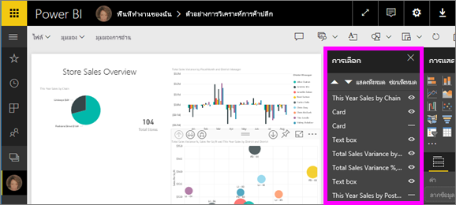
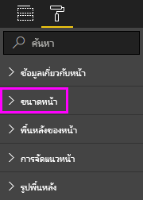

# ปรับใช้การตั้งค่าการแสดงหน้าในรายงาน Power BIApply page display settings in a Power BI report
เราเข้าใจดีว่าการรักษาให้พิกเซลของการจัดหน้ารายงานสมบูรณ์เป็นเรื่องสำคัญWe understand it's critical to keep your report layout pixel perfect. บางครั้ง การทำดังกล่าวเป็นไปได้ยากเนื่องจากคุณและเพื่อนร่วมงานของคุณอาจดูรายงานเหล่านั้นบนหน้าจอด้วยอัตราส่วนกว้างยาวและขนาดแตกต่างกันSometimes, it can be challenging, because you and your colleagues may view those reports on screens with different aspect ratios and sizes. 

มุมมองการแสดงในค่าเริ่มต้นคือ **พอดีกับหน้า** และขนาดแสดงในค่าเริ่มต้นคือ **16:9**The default display view is **Fit to page** and the default display size is **16:9**. ถ้าคุณต้องการล็อกในอัตราส่วนกว้างยาวที่แตกต่างกัน  หรือต้องการให้พอดีกับรายงานของคุณในลักษณะอื่น มีเครื่องมือสองอย่างที่ช่วยคุณได้ คือ: การตั้งค่า**_มุมมองหน้าและ_* การตั้งค่า _*_ขนาดหน้า_\*_If you want to lock in a different aspect ratio, or want to fit your report in a different way, there are two tools to help you: **_Page view_* _ settings and _*_Page size_\*_ settings.

<iframe width="560" height="315" src="https://www.youtube.com/embed/5tg-OXzxe2g" frameborder="0" allowfullscreen></iframe>

## ค้นหาการตั้งค่ามุมมองหน้าในบริการของ Power BI และ Power BI Desktop ได้ที่ใดWhere to find Page view settings in the Power BI service and Power BI Desktop
การตั้งค่ามุมมองหน้าจะพร้อมใช้งานทั้งในบริการของ Power BI และ Power BI Desktop แต่อินเทอร์เฟซจะแตกต่างกันเล็กน้อยPage view settings are available in both the Power BI service and Power BI Desktop, but the interface is a little different. หัวข้อต่อไปนี้จะอธิบายสถานที่ที่คุณสามารถค้นหาการตั้งค่ามุมมองในแต่ละเครื่องมือของ Power BIThe following sections explain where you can find View settings in each Power BI tool.

### ใน Power BI DesktopIn Power BI Desktop
ในมุมมองรายงาน เลือก แท็บ_ \*มุมมอง\*\*เพื่อเปิดการตั้งค่ามุมมองหน้าและการตั้งค่าการจัดหน้าโทรศัพท์In Report view, select the _ *View*\* tab to open Page view settings as well as phone layout settings.

  

### ในบริการของ Power BI (app.powerbi.com)In the Power BI service (app.powerbi.com)
ในบริการของ Power BI เปิดรายงาน แล้วเลือก **มุมมอง** จากแถบเมนูด้านบนซ้ายIn the Power BI service, open a report and select **View** from the upper left menubar.

การตั้งค่ามุมมองหน้าจะพร้อมใช้งานทั้งใน[มุมมองการอ่าน และมุมมองการแก้ไข](../consumer/end-user-reading-view.md)Page view settings are available in both [Reading view and Editing view](../consumer/end-user-reading-view.md). ในมุมมองการแก้ไข เจ้าของรายงานสามารถกำหนดการตั้งค่ามุมมองหน้าในหน้ารายงานต่าง ๆ และการตั้งค่าเหล่านั้นจะถูกบันทึกไว้พร้อมกับรายงานIn Editing view, a report owner can assign page view settings to individual report pages, and those settings are saved with the report. เมื่อเพื่อนร่วมงานเปิดรายงานนั้นในมุมมองการอ่าน พวกเขาจะเห็นหน้ารายงานที่ใช้การตั้งค่าของเจ้าของWhen colleagues open that report in Reading view, they see the report pages display using the owner's settings. ในมุมมองการอ่าน เพื่อนร่วมงานสามารถเปลี่ยนแปลงการตั้งค่า *บาง* อย่างของ **มุมมองหน้า** แต่การเปลี่ยนแปลงนั้นจะไม่ถูกบันทึกเมื่อพวกเขาออกจากรายงานIn Reading view, colleagues can change *some* of the **Page view** settings, but the changes are not saved when they exit the report.

## การตั้งค่ามุมมองหน้าPage view settings
การตั้งค่ามุมมองหน้าชุดแรกควบคุมการแสดงหน้ารายงานของคุณอย่างสัมพันธ์กับหน้าต่างเบราว์เซอร์The first set of Page view settings controls the display of your report page relative to the browser window. เลือกระหว่าง:Choose between:

* **จัดพอดีกับหน้า** (ค่าเริ่มต้น): เนื้อหาจะถูกปรับให้พอดีกับหน้า**Fit to page** (default): Contents are scaled to best fit the page
* **จัดพอดีกับความกว้าง**: เนื้อหาถูกปรับให้พอดีกับความกว้างของหน้า**Fit to width**: Contents are scaled to fit within the width of the page
* **ขนาดจริง**: จะแสดงเนื้อหาเต็มขนาด**Actual size**: Contents are displayed at full size

การตั้งค่ามุมมองหน้าชุดที่สองจะควบคุมตำแหน่งของออบเจ็กต์บนพื้นที่รายงานThe second set of Page view settings controls the positioning of objects on the report canvas. เลือกระหว่าง:Choose between:

* **แสดงเส้นตาราง**: เปิดใช้งานเส้นตารางเพื่อช่วยให้คุณจัดตำแหน่งออบเจ็กต์บนพื้นที่รายงาน**Show gridlines**: Turn on gridlines to help you position objects on the report canvas.
* **จัดชิดเส้นตาราง**: ใช้กับ **แสดงเส้นตาราง** เมื่อต้องการจัดตำแหน่งและจัดแนวออบเจ็กต์บนพื้นที่รายงานอย่างแม่นยำ**Snap to grid**: Use with **Show gridlines** to precisely position and align objects on the report canvas. 
* **ล็อกออบเจ็กต์**: ล็อกออบเจ็กต์ทั้งหมดบนพื้นที่รายงานเพื่อไม่ให้ย้ายหรือปรับขนาดออบเจ็กต์ได้**Lock objects**: Lock all objects on the canvas so that they can't be moved or resized.
* **บานหน้าต่างการเลือก**: บานหน้าต่าง **การเลือก** แสดงออบเจ็กต์ทั้งหมดบนพื้นที่ทำงาน**Selection pane**: The **Selection** pane lists all objects on the canvas. คุณสามารถตัดสินใจที่จะแสดงและซ่อนออบเจ็กต์ใดYou can decide which to show and which to hide.

    

## การตั้งค่าขนาดหน้าPage size settings

การตั้งค่า **ขนาดหน้า** จะพร้อมใช้งานเฉพาะสำหรับเจ้าของรายงานเท่านั้น**Page size** settings are available only for report owners. ในบริการของ Power BI (app.powerbi.com) สิ่งนี้หมายความว่าสามารถเปิดรายงานใน[มุมมองการแก้ไข](../consumer/end-user-reading-view.md)In the Power BI service (app.powerbi.com), this means being able to open the report in [Editing view](../consumer/end-user-reading-view.md). การตั้งค่า **ขนาดหน้า** อยู่ในบานหน้าต่าง **การจัดรูปแบบการแสดงข้อมูล** และควบคุมอัตราส่วนการแสดงและขนาดจริง (เป็นพิกเซล) ของพื้นที่รายงาน:**Page size** settings are in the **Visualizations** pane and control the display ratio and actual size (in pixels) of the report canvas:   

* อัตราส่วน 4:34:3 ratio
* อัตราส่วน 16:9 (ค่าเริ่มต้น)16:9 ratio (default)
* จดหมายLetter
* แบบกำหนดเอง (ความสูงและความกว้างเป็นพิกเซล)Custom (height and width in pixels)

## ขั้นตอนถัดไปNext steps
[มุมมองรายงานใน Power BI DesktopReport view in Power BI Desktop](desktop-report-view.md)

[เปลี่ยนการตั้งค่ามุมมองหน้าและขนาดหน้าในรายงาน Power BI ของคุณChange Page view and Page size settings in your own Power BI reports](../consumer/end-user-report-view.md)

อ่านข้อมูลเพิ่มเติมเกี่ยวกับ[รายงานใน Power BI](../consumer/end-user-reports.md)Read more about [reports in Power BI](../consumer/end-user-reports.md)

[แนวคิดพื้นฐานสำหรับนักออกแบบในบริการ Power BIBasic concepts for designers in the Power BI service](../fundamentals/service-basic-concepts.md)

มีคำถามเพิ่มเติมหรือไม่More questions? [ลองไปที่ชุมชน Power BITry the Power BI Community](https://community.powerbi.com/)
