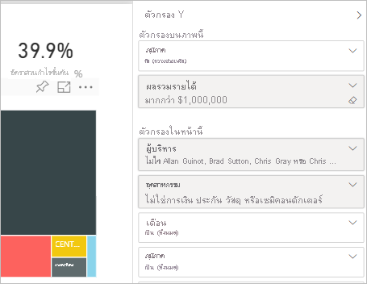
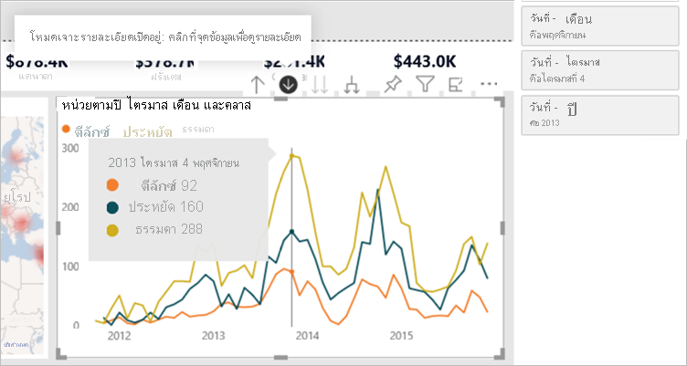
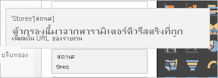
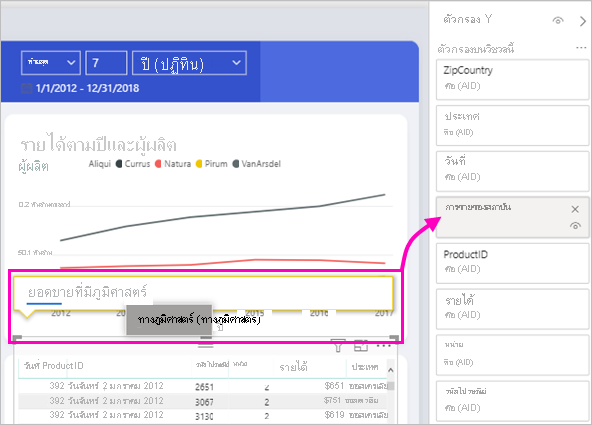

# ชนิดของตัวกรองในรายงาน Power BITypes of filters in Power BI reports

ตัวกรองทั้งหมดไม่ได้ทำงานในแนวทางเดียวกันเนื่องจากไม่ได้สร้างขึ้นด้วยแนวทางเดียวกันFilters don't all behave the same way because they're not created the same way. วิธีการที่คุณสร้างตัวกรองมีผลต่อการทำงานของตัวกรองในบานหน้าต่างตัวกรองใหม่ในโหมดการแก้ไขHow you create them influences how they behave in the new filter pane in editing mode. ในบทความนี้ เราอธิบายชนิดของตัวกรอง: วิธีการต่างๆ ที่คุณใช้ในการสร้างตัวกรองและสิ่งที่ตัวกรองเหล่านั้นทำงานได้ดีIn this article, we describe the different kinds of filters: the different ways you create them and the different things they're good for. อ่านเกี่ยวกับวิธีการ [เพิ่มตัวกรองไปยังรายงาน](power-bi-report-add-filter.md)Read about how to [add filters to reports](power-bi-report-add-filter.md). 

เริ่มต้นด้วยตัวกรองสองชนิดที่รู้จักกันมากที่สุด: ซึ่งก็คือแบบแมนนวลและแบบอัตโนมัติLet’s start with the two most common filter types: manual and automatic.

## ตัวกรองแบบแมนนวลManual filters 

ตัวกรองแบบแมนนวลคือตัวกรองที่ตัวสร้างรายงานลากและวางไว้บนที่ใดก็ได้ในบานหน้าต่างตัวกรองManual filters are the filters that report creators drag and drop anywhere in the new filter pane. ผู้ใช้ที่มีสิทธิ์แก้ไขรายงานจะสามารถแก้ไข ลบ ล้าง ซ่อน ล็อก เปลี่ยนชื่อ หรือจัดเรียงตัวกรองนี้ในบานหน้าต่างใหม่Users with edit permission to the report can edit, delete, clear, hide, lock, rename, or sort this filter in the new pane.

## ตัวกรองแบบอัตโนมัติAutomatic filters 

ตัวกรองอัตโนมัติคือตัวกรองที่เพิ่มเข้าไปยังระดับการแสดงผลด้วยภาพของบานหน้าต่างตัวกรองโดยอัตโนมัติเมื่อคุณสร้างการแสดงผลด้วยภาพAutomatic filters are the filters that get automatically added to the visual level of the filter pane when you build a visual. ตัวกรองเหล่านี้เป็นไปตามเขตข้อมูลที่สร้างการแสดงผลด้วยภาพของคุณThese filters are based on the fields that make up your visual. ผู้ใช้ที่มีสิทธิ์แก้ไขรายงานจะสามารถแก้ไข ล้าง ซ่อน ล็อก เปลี่ยนชื่อ หรือจัดเรียงตัวกรองนี้ในบานหน้าต่างใหม่Users with edit permission to the report can edit, clear, hide, lock, rename, or sort this filter in the new pane. ผู้ใช้เหล่านี้ไม่สามารถลบตัวกรองแบบอัตโนมัติ เนื่องจากการแสดงผลด้วยภาพอ้างอิงถึงเขตข้อมูลเหล่านั้นThey can't delete automatic filters, because the visual refers to those fields.

## ตัวกรองขั้นสูงกว่าMore advanced filters

ตัวกรองชนิดต่อไปเป็นตัวกรองที่เป็นที่รู้จักกันน้อยกว่า แต่ยังคงเป็นสิ่งสำคัญที่ควรทำความเข้าใจเอาไว้หากตัวกรองเหล่านี้แสดงอยู่ในรายงานของคุณThese next filter types are less common, but it's still important to understand them if they're displayed in your report. นอกจากนี้ คุณอาจจะได้รู้ว่าตัวกรองเหล่านี้มีประโยชน์ในการสร้างตัวกรองที่เหมาะสมที่สุดสำหรับรายงานของคุณBesides, you might find them useful in creating just the right filter for your report.

## ตัวกรองรวมและคัดออกInclude and exclude filters

ตัวกรองรวมและคัดออกจะเพิ่มไปยังบานหน้าต่างตัวกรองของคุณโดยอัตโนมัติเมื่อคุณใช้ฟังก์ชันการรวมและการคัดออกสำหรับการแสดงผลด้วยภาพInclude and exclude filters get automatically added to the filter pane when you use the include or exclude functionality for a visual. ผู้ใช้ที่มีสิทธิ์แก้ไขรายงานสามารถลบ ล็อก ซ่อน หรือจัดเรียงตัวกรองนี้ในบานหน้าต่างใหม่Users with edit permission to the report can delete, lock, hide, or sort this filter in the new pane. ผู้ใช้เหล่านี้ไม่สามารถแก้ไข ล้าง หรือเปลี่ยนชื่อตัวกรองรวมหรือคัดออก เนื่องจากตัวกรองดังกล่าวมีความเกี่ยวข้องกับฟังก์ชันการรวมและการคัดออกของการแสดงผลด้วยภาพThey can't edit, clear, or rename an include or exclude filter, because it's associated with the include and exclude functionality of visuals.

## ตัวกรองแบบเจาะลึกDrill-down filters

ตัวกรองเจาะลึกจะเพิ่มไปยังบานหน้าต่างตัวกรองของคุณโดยอัตโนมัติเมื่อคุณใช้ฟังก์ชันการเจาะลึกสำหรับการแสดงผลด้วยภาพในรายงานของคุณDrill-down filters get automatically added to the filter pane when you use the drill-down functionality for a visual in your report. ผู้ใช้ที่มีสิทธิ์แก้ไขรายงานสามารถแก้ไขหรือล้างตัวกรองในบานหน้าต่างใหม่Users with edit permission to the report can edit or clear the filter in the new pane. ผู้ใช้เหล่านี้ไม่สามารถลบ ซ่อน ล็อก เปลี่ยนชื่อ หรือจัดเรียงตัวกรองนี้ เนื่องจากตัวกรองนี้มีความเกี่ยวข้องกับฟังก์ชันการเจาะลึกของการแสดงผลด้วยภาพThey can't delete, hide, lock, rename, or sort this filter because it's associated with the drill-down functionality of visuals. หากต้องการนำตัวกรองแบบเจาะลึกออก ให้คลิกที่ปุ่มการเจาะลึกสำหรับการแสดงผลด้วยภาพTo remove the drill-down filter, you click the drill-up button for the visual.

## ตัวกรองแบบเจาะข้ามCross-drill filters

ตัวกรองแบบเจาะข้ามจะเพิ่มไปยังบานหน้าต่างใหม่ของคุณโดยอัตโนมัติ เมื่อตัวกรองแบบเจาะข้ามได้ส่งผ่านไปยังการแสดงผลด้วยภาพอีกส่วนหนึ่งในหน้ารายงานผ่านทางตัวกรองแบบข้ามหรือคุณสมบัติการไฮไลต์ข้ามCross-drill filters are automatically added to the new pane when a drill-down filter is passed to another visual on the report page via the cross-filter or cross-highlight feature. ผู้ใช้ที่มีสิทธิ์การแก้ไขรายงานไม่สามารถลบ ซ่อน ล็อก เปลี่ยนชื่อ หรือจัดเรียงตัวกรองนี้เนื่องจากตัวกรองนี้มีความเกี่ยวข้องกับฟังก์ชันการเจาะลึกของการแสดงผลด้วยภาพUsers with edit permission to the report can't delete, clear, hide, lock, rename, or sort this filter because it's associated with the drill-down functionality of visuals. ผู้ใช้เหล่านี้ยังคงไม่สามารถแก้ไขตัวกรองนี้เนื่องจากตัวกรองนี้มาจากการเจาะลึกในการแสดงผลด้วยภาพอื่นThey also can't edit this filter because it comes from drilling down in another visual. หากต้องการนำตัวกรองแบบเจาะลึกออก ให้คลิกที่ปุ่มการเจาะขึ้นสำหรับการแสดงผลด้วยภาพที่กำลังผ่านตัวกรองTo remove the drill-down filter, you click the drill-up button for the visual that's passing the filter.

## ตัวกรองการเจาะลึกรายละเอียดDrillthrough filters

ตัวกรองการเจาะลึกรายละเอียดได้รับการส่งผ่านจากหน้าหนึ่งไปยังอีกหน้าหนึ่งผ่านคุณสมบัติการเจาะลึกรายละเอียดDrillthrough filters get passed from one page to another via the drillthrough feature. ตัวกรองเหล่านี้แสดงในบานหน้าต่างการเจาะลึกรายละเอียดThey show up in the drillthrough pane. ตัวกรองการเจาะลึกรายละเอียดมีสองชนิดThere are two types of drillthrough filters. ชนิดแรกคือชนิดที่เรียกใช้การเข้าถึงรายละเอียดThe first type is the one that invokes the drillthrough. ผู้แก้ไขรายงานสามารถแก้ไข ลบ ล้าง ซ่อน หรือล็อกตัวกรองชนิดนี้Report editors can edit, delete, clear, hide, or lock this type of filter. ชนิดที่สองคือตัวกรองการเจาะลึกรายละเอียดที่ส่งผ่านไปยังเป้าหมาย โดยขึ้นอยู่กับตัวกรองระดับหน้าของหน้าต้นทางThe second type is the drillthrough filter that gets passed to the target, based on the page-level filters of the source page. ผู้แก้ไขรายงานสามารถแก้ไข ลบ หรือล้างตัวกรองการเจาะลึกรายละเอียดชนิดชั่วคราวนี้Report editors can edit, delete, or clear, this transient type of drillthrough filter. ผู้ใช้เหล่านี้ไม่สามารถล็อกหรือซ่อนตัวกรองนี้สำหรับผู้ใช้ปลายทางThey can't lock or hide this filter for end users.

## ตัวกรอง URLURL filters

ตัวกรอง URL จะเพิ่มไปยังบานหน้าต่างใหม่ด้วยการเพิ่มพารามิเตอร์การสอบถาม URLURL filters get added to the new pane by adding a URL query parameter. ผู้ใช้ที่มีสิทธิ์แก้ไขรายงานสามารถแก้ไข ลบ หรือล้างตัวกรองในบานหน้าต่างใหม่Users with edit permission to the report can edit, delete, or clear the filter in the new pane. ผู้ใช้เหล่านี้ไม่สามารถซ่อน ล็อก เปลี่ยนชื่อ หรือจัดเรียงตัวกรองนี้ เนื่องจากตัวกรองนี้มีความเกี่ยวข้องกับพารามิเตอร์ URLThey can't hide, lock, rename, or sort this filter because it's associated with the URL parameter. หากต้องการนำตัวกรองออก ให้นำพารามิเตอร์ออกจาก URLTo remove the filter, you remove the parameter from the URL. นี่คือ URL ตัวอย่างพร้อมพารามิเตอร์:Here's an example URL with a parameter:

app.powerbi.com/groups/me/apps/*app-id*/reports/*report-id*/ReportSection?filter=Stores~2FStatus%20eq%20'Off'app.powerbi.com/groups/me/apps/*app-id*/reports/*report-id*/ReportSection?filter=Stores~2FStatus%20eq%20'Off'

อ่านเพิ่มเติมเกี่ยวกับ [ตัวกรอง URL](../collaborate-share/service-url-filters.md)Read more about [URL filters](../collaborate-share/service-url-filters.md).

## ตัวกรองแบบพาส-ทรูPass-through filters

ตัวกรองแบบพาส-ทรู เป็นตัวกรองระดับการแสดงผลด้วยภาพ ซึ่งสร้างขึ้นผ่าน Q&APass-through filters are visual-level filters created through Q&A. ผู้เขียนสามารถลบ ซ่อน หรือเรียงลำดับตัวกรองเหล่านี้ในหน้าต่างใหม่Authors can delete, hide, or sort these filters in the new pane. อย่างไรก็ตาม ผู้เขียนไม่สามารถเปลี่ยนชื่อ แก้ไข ล้าง หรือล็อกตัวกรองเหล่านี้However, they can't rename, edit, clear, or lock these filters.

## เปรียบเทียบชนิดตัวกรองComparing filter types

ตารางนี้เปรียบเทียบสิ่งที่ผู้เขียนสามารถทำในส่วนของตัวกรองชนิดต่างๆThis table compares what authors can do with the different types of filters.

| ชนิดตัวกรองFilter type | แก้ไขEdit | ล้างClear | ลบDelete | ซ่อนHide | ล็อกLock | SortSort | เปลี่ยนชื่อRename |
|----|----|----|----|----|----|----|----|
| ตัวกรองแบบแมนนวลManual filters | YY | YY | YY | YY | YY | YY | YY |
| ตัวกรองอัตโนมัติAuto filters | YY | YY | NN | YY | YY | YY | YY |
| ตัวกรอง รวม/ไม่รวมInclude/Exclude filters | NN | NN | YY | YY | YY | YY | NN |
| ตัวกรองแบบเจาะลึกDrill-down filters | YY | YY | NN | NN | NN | NN | NN |
| ตัวกรองแบบเจาะข้ามCross Drill filters | NN | NN | NN | NN | NN | NN | NN |
| ตัวกรองการเจาะลึกรายละเอียด (เรียกใช้การเจาะลึกรายละเอียด)Drillthrough filters (Invokes drillthrough) | YY | YY | YY | YY | YY | NN | NN |
| ตัวกรองการเจาะลึกรายละเอียด (ชั่วคราว)Drillthrough filters (Transient) | YY | YY | YY | NN | NN | NN | NN |
| ตัวกรอง URL - ชั่วคราวURL filters - transient | YY | YY | YY | NN | NN | NN | NN |
| ตัวกรองส่งผ่านPass Through filters | NN | NN | YY | YY | NN | YY | NN |

## ขั้นตอนถัดไปNext steps

[เพิ่มตัวกรองไปยังรายงานAdd filters to reports](power-bi-report-add-filter.md)

[สำรวจภาพรวมของบานหน้าต่างตัวกรองของรายงานTake a tour of the report Filters pane](../consumer/end-user-report-filter.md)

[ตัวกรองและการทำไฮไลท์ในรายงานFilters and highlighting in reports](power-bi-reports-filters-and-highlighting.md)

มีคำถามเพิ่มเติมหรือไม่More questions? [ลองไปที่ชุมชน Power BITry the Power BI Community](https://community.powerbi.com/)
