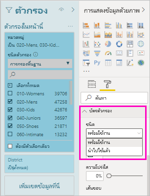
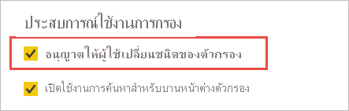

# <a name="design-filters-in-power-bi-reports"></a><span data-ttu-id="53328-103">ออกแบบตัวกรองในรายงาน Power BI</span><span class="sxs-lookup"><span data-stu-id="53328-103">Design filters in Power BI reports</span></span>

<span data-ttu-id="53328-104">[!INCLUDE [applies-to](../includes/applies-to.md)] [!INCLUDE [yes-desktop](../includes/yes-desktop.md)] [!INCLUDE [yes-service](../includes/yes-service.md)]</span><span class="sxs-lookup"><span data-stu-id="53328-104">[!INCLUDE [applies-to](../includes/applies-to.md)] [!INCLUDE [yes-desktop](../includes/yes-desktop.md)] [!INCLUDE [yes-service](../includes/yes-service.md)]</span></span>

<span data-ttu-id="53328-105">ด้วยประสบการณ์การใช้งานตัวกรองใหม่ คุณสามารถควบคุมการออกแบบและการทำงานของตัวกรองรายงานได้จำนวนมาก</span><span class="sxs-lookup"><span data-stu-id="53328-105">With the new filter experience, you have a lot of control over report filter design and functionality.</span></span> <span data-ttu-id="53328-106">คุณสามารถจัดรูปแบบบานหน้าต่างตัวกรองเพื่อให้มีลักษณะเหมือนกับส่วนอื่นๆ ของรายงาน</span><span class="sxs-lookup"><span data-stu-id="53328-106">You can format the Filters pane to look like the rest of the report.</span></span> <span data-ttu-id="53328-107">คุณสามารถล็อก และแม้แต่ซ่อนตัวกรอง</span><span class="sxs-lookup"><span data-stu-id="53328-107">You can lock and even hide filters.</span></span> <span data-ttu-id="53328-108">เมื่อคุณออกแบบรายงานของคุณ คุณจะไม่เห็นบานหน้าต่างตัวกรองเก่าในพื้นที่การแสดงภาพ</span><span class="sxs-lookup"><span data-stu-id="53328-108">When designing your report, you no longer see the old Filters pane at all in the Visualizations pane.</span></span> <span data-ttu-id="53328-109">คุณสามารถกำเนินการแก้ไขตัวกรองและการจัดรูปแบบในบานหน้าต่างตัวกรองเดียว</span><span class="sxs-lookup"><span data-stu-id="53328-109">You do all your filter editing and formatting in a single Filters pane.</span></span> 


<span data-ttu-id="53328-111">ในฐานะผู้ออกแบบรายงาน นี่คืองานบางอย่างที่คุณสามารถทำได้ในบานหน้าต่างตัวกรองใหม่:</span><span class="sxs-lookup"><span data-stu-id="53328-111">As a report designer, here are some of the tasks you can do in the new Filters pane:</span></span>

- <span data-ttu-id="53328-112">เพิ่มและลบเขตข้อมูลที่จะกรอง</span><span class="sxs-lookup"><span data-stu-id="53328-112">Add and remove fields to filter on.</span></span> 
- <span data-ttu-id="53328-113">เปลี่ยนสถานะตัวกรอง</span><span class="sxs-lookup"><span data-stu-id="53328-113">Change the filter state.</span></span>
- <span data-ttu-id="53328-114">จัดรูปแบบ และกำหนดค่าบานหน้าต่างตัวกรองเพื่อให้เป็นส่วนหนึ่งของรายงานของคุณ</span><span class="sxs-lookup"><span data-stu-id="53328-114">Format and customize the Filters pane so that it feels part of your report.</span></span>
- <span data-ttu-id="53328-115">กำหนดว่าบานหน้าต่างตัวกรองถูกเปิด หรือถูกยุบอยู่ตามค่าเริ่มต้นเมื่อลูกค้าเปิดรายงานขึ้น</span><span class="sxs-lookup"><span data-stu-id="53328-115">Define whether the Filters pane is open or collapsed by default when a consumer opens the report.</span></span>
- <span data-ttu-id="53328-116">ซ่อนบานบานหน้าต่างตัวกรองทั้งหมดหรือตัวกรองเฉพาะที่คุณต้องการให้ผู้ใช้รายงานเพื่อดู</span><span class="sxs-lookup"><span data-stu-id="53328-116">Hide the entire Filters pane or specific filters that you don't want report consumers to see.</span></span>
- <span data-ttu-id="53328-117">ควบคุม และยังบุ๊คมาร์กการมองเห็น เปิด และยุบสถานะของบานบานหน้าต่างตัวกรองได้</span><span class="sxs-lookup"><span data-stu-id="53328-117">Control and even bookmark the visibility, open, and collapsed state of the Filters pane.</span></span>
- <span data-ttu-id="53328-118">ล็อกตัวกรองที่คุณต้องการให้ผู้บริโภคเมื่อต้องแก้ไข</span><span class="sxs-lookup"><span data-stu-id="53328-118">Lock filters that you don't want consumers to edit.</span></span>

<span data-ttu-id="53328-119">ในการอ่านรายงาน ผู้ใช้รายงานสามารถโฮเวอร์เหนือวิชวลใดก็ได้ เพื่อดูรายการแบบอ่านอย่างเดียวของตัวกรองหรือตัวแบ่งส่วนข้อมูลทั้งหมดที่มีผลต่อวิชวลนั้น</span><span class="sxs-lookup"><span data-stu-id="53328-119">When reading a report, users can hover over any visual to see a read-only list of all the filters or slicers affecting that visual.</span></span>


<span data-ttu-id="53328-121">อ่านเกี่ยวกับ [วิธีการใช้ตัวกรองของผู้อ่านรายงาน](../consumer/end-user-report-filter.md) ในรายงานของคุณ</span><span class="sxs-lookup"><span data-stu-id="53328-121">Read about [how report readers use filters](../consumer/end-user-report-filter.md) in your report.</span></span>

## <a name="view-filters-for-a-visual-in-reading-mode"></a><span data-ttu-id="53328-122">ดูตัวกรองสำหรับภาพในโหมดการอ่าน</span><span class="sxs-lookup"><span data-stu-id="53328-122">View filters for a visual in Reading mode</span></span>

<span data-ttu-id="53328-123">ในโหมดการอ่าน ลากเมาส์ไปยังตัวกรองไอคอนสำหรับภาพเพื่อดูรายการตัวกรองแบบป็อปอัพกับตัวกรองทั้งหมด ตัวแบ่งส่วนข้อมูล และอื่นๆ ที่มีผลต่อภาพนั้น</span><span class="sxs-lookup"><span data-stu-id="53328-123">In Reading mode, hover over the filter icon for a visual to see a pop-up filter list with all the filters, slicers, and so on, affecting that visual.</span></span> <span data-ttu-id="53328-124">การจัดรูปแบบรายการตัวกรองแบบป็อปอัพจะเหมือนกับการจัดรูปแบบในบานหน้าต่างตัวกรอง</span><span class="sxs-lookup"><span data-stu-id="53328-124">The formatting of the pop-up filter list is the same as the Filters pane formatting.</span></span>


<span data-ttu-id="53328-126">นี่คือชนิดตัวกรองที่มุมมองนี้แสดง:</span><span class="sxs-lookup"><span data-stu-id="53328-126">Here are the types of filters this view shows:</span></span>

- <span data-ttu-id="53328-127">ตัวกรองพื้นฐาน</span><span class="sxs-lookup"><span data-stu-id="53328-127">Basic filters</span></span>
- <span data-ttu-id="53328-128">ตัวแบ่งส่วนข้อมูล</span><span class="sxs-lookup"><span data-stu-id="53328-128">Slicers</span></span>
- <span data-ttu-id="53328-129">ไฮไลต์เชื่อมโยง</span><span class="sxs-lookup"><span data-stu-id="53328-129">Cross-highlighting</span></span> 
- <span data-ttu-id="53328-130">กรองข้าม</span><span class="sxs-lookup"><span data-stu-id="53328-130">Cross-filtering</span></span>
- <span data-ttu-id="53328-131">ตัวกรองขั้นสูง</span><span class="sxs-lookup"><span data-stu-id="53328-131">Advanced filters</span></span>
- <span data-ttu-id="53328-132">ตัวกรอง Top N</span><span class="sxs-lookup"><span data-stu-id="53328-132">Top N filters</span></span>
- <span data-ttu-id="53328-133">ตัวกรองวันที่ที่เกี่ยวข้อง</span><span class="sxs-lookup"><span data-stu-id="53328-133">Relative Date filters</span></span>
- <span data-ttu-id="53328-134">ตัวแบ่งส่วนข้อมูลซิงค์</span><span class="sxs-lookup"><span data-stu-id="53328-134">Sync-slicers</span></span>
- <span data-ttu-id="53328-135">ตัวกรอง รวม/ไม่รวม</span><span class="sxs-lookup"><span data-stu-id="53328-135">Include/Exclude filters</span></span>
- <span data-ttu-id="53328-136">ตัวกรองที่ส่งผ่าน URL</span><span class="sxs-lookup"><span data-stu-id="53328-136">Filters passed through a URL</span></span>

<span data-ttu-id="53328-137">อ่านเพิ่มเติมเกี่ยวกับ [การโต้ตอบกับตัวกรองในโหมดการอ่าน](../consumer/end-user-report-filter.md)</span><span class="sxs-lookup"><span data-stu-id="53328-137">Read more about [interacting with filters in reading mode](../consumer/end-user-report-filter.md).</span></span>

## <a name="build-the-filters-pane"></a><span data-ttu-id="53328-138">สร้างบานหน้าต่างตัวกรอง</span><span class="sxs-lookup"><span data-stu-id="53328-138">Build the Filters pane</span></span>

<span data-ttu-id="53328-139">หลังจากที่คุณเปิดใช้งานบานหน้าต่างตัวกรองใหม่ คุณจะเห็นบานหน้าต่างทางด้านขวาของหน้ารายงาน จัดรูปแบบตามค่าเริ่มต้นที่ยึดตามการตั้งค่ารายงานปัจจุบันของคุณ</span><span class="sxs-lookup"><span data-stu-id="53328-139">After you enable the new Filters pane, you see it to the right of the report page, formatted by default based on your current report settings.</span></span> <span data-ttu-id="53328-140">ในบานหน้าต่างตัวกรอง คุณจะกำหนดค่าว่าจะรวมตัวกรองใดบ้าง และอัปเดตตัวกรองเดิมที่มีอยู่</span><span class="sxs-lookup"><span data-stu-id="53328-140">In the Filters pane, you configure which filters to include, and update existing filters.</span></span> <span data-ttu-id="53328-141">บานหน้าต่างตัวกรองจะมีลักษณะเดียวกันสำหรับผู้ใช้รายงานของคุณเมื่อคุณเผยแพร่รายงานของคุณ</span><span class="sxs-lookup"><span data-stu-id="53328-141">The Filters pane will look the same for your report consumers when you publish your report.</span></span> 

1. <span data-ttu-id="53328-142">ตามค่าเริ่มต้น ผู้บริโภครายงานของคุณสามารถดูบานหน้าต่างตัวกรอง</span><span class="sxs-lookup"><span data-stu-id="53328-142">By default, your report consumers can see the Filters pane.</span></span> <span data-ttu-id="53328-143">หากไม่ต้องการให้มองเห็น ให้เลือกไอคอนรูปตาที่อยูถัดจาก **ตัวกรอง**</span><span class="sxs-lookup"><span data-stu-id="53328-143">If you don't want them to see it, select the eye icon next to **Filters**.</span></span>

    

2. <span data-ttu-id="53328-145">ในการเริ่มสร้างบานหน้าต่างตัวกรองของคุณ ลากเขตข้อมูลที่สนใจไปยังบานหน้าต่างตัวกรอง ไม่ว่าจะเป็น วิชวล หน้า หรือตัวกรองระดับรายงาน</span><span class="sxs-lookup"><span data-stu-id="53328-145">To start building your Filters pane, drag fields of interest into the Filters pane either as visual, page, or report level filters.</span></span>

<span data-ttu-id="53328-146">เมื่อคุณเพิ่มภาพลงในพื้นที่รายงาน Power BI เพิ่มตัวกรองไปยังบานหน้าต่างตัวกรองสำหรับแต่ละเขตข้อมูลในภาพโดยอัตโนมัติ</span><span class="sxs-lookup"><span data-stu-id="53328-146">When you add a visual to a report canvas, Power BI automatically adds a filter to the Filters pane for each field in the visual.</span></span> 

## <a name="hide-the-filters-pane-while-editing"></a><span data-ttu-id="53328-147">ซ่อนบานหน้าต่างตัวกรองขณะที่แก้ไข</span><span class="sxs-lookup"><span data-stu-id="53328-147">Hide the Filters pane while editing</span></span>

<span data-ttu-id="53328-148">Power BI Desktop มรชุดแถบเครื่องมือใหม่ในตัวอย่าง</span><span class="sxs-lookup"><span data-stu-id="53328-148">Power BI Desktop has a new ribbon in preview.</span></span> <span data-ttu-id="53328-149">บนแท็บ **มุมมอง** ปุ่มสลับ **ตัวกรอง** ช่วยให้คุณสามารถแสดงหรือซ่อนบานหน้าต่างตัวกรองได้</span><span class="sxs-lookup"><span data-stu-id="53328-149">On the **View** tab, the **Filters** toggle button allows you to show or hide the Filters pane.</span></span> <span data-ttu-id="53328-150">คุณลักษณะนี้มีประโยชน์ เมื่อคุณไม่ได้ใช้บานหน้าต่างตัวกรองและต้องการพื้นที่เพิ่มเติมบนหน้าจอ</span><span class="sxs-lookup"><span data-stu-id="53328-150">This feature is useful when you aren't using the Filters pane and need extra space on the screen.</span></span> <span data-ttu-id="53328-151">นอกจากนี้ยังจัดเรียงบานหน้าต่างตัวกรองให้สอดคล้องกับบานหน้าต่างอื่น ๆ ที่คุณสามารถเปิดและปิดได้ เช่น บานหน้าต่างบุ๊กมาร์กและการเลือก</span><span class="sxs-lookup"><span data-stu-id="53328-151">This addition aligns the Filters pane with the other panes that you can open and close, such as the Bookmarks and Selection panes.</span></span> 


<span data-ttu-id="53328-153">การตั้งค่านี้จะซ่อนบานหน้าต่างตัวกรองใน Power BI Desktop เท่านั้น</span><span class="sxs-lookup"><span data-stu-id="53328-153">This setting only hides the Filters pane in Power BI Desktop.</span></span> <span data-ttu-id="53328-154">หากคุณต้องการซ่อนบานหน้าต่างตัวกรองสำหรับผู้ใช้ปลายทาง ให้คุณเลือกไอคอน **ตา** ซึ่งอยู่ถัดจาก **ตัวกรอง**</span><span class="sxs-lookup"><span data-stu-id="53328-154">If you want to hide the Filters pane for your end users, you instead select the **eye** icon next to **Filters**.</span></span>

 

## <a name="lock-or-hide-filters"></a><span data-ttu-id="53328-156">ล็อกหรือซ่อนตัวกรอง</span><span class="sxs-lookup"><span data-stu-id="53328-156">Lock or hide filters</span></span>

<span data-ttu-id="53328-157">คุณสามารถล็อกหรือซ่อนตัวกรองของแต่ละการ์ด</span><span class="sxs-lookup"><span data-stu-id="53328-157">You can lock or hide individual filter cards.</span></span> <span data-ttu-id="53328-158">ถ้าคุณล็อกตัวกรอง ผู้บริโภครายงานของคุณสามารถดู แต่ไม่สามารถเปลี่ยนแปลง</span><span class="sxs-lookup"><span data-stu-id="53328-158">If you lock a filter, your report consumers can see but not change it.</span></span> <span data-ttu-id="53328-159">หากคุณซ่อน พวกเขาไม่สามารถมองเห็นได้</span><span class="sxs-lookup"><span data-stu-id="53328-159">If you hide it, they can't even see it.</span></span> <span data-ttu-id="53328-160">ซ่อนตัวกรองการ์ดจะมีประโยชน์หากถ้าคุณต้องการซ่อนตัวกรองล้างข้อมูลที่แยกค่า null หรือค่าที่ไม่คาดคิด</span><span class="sxs-lookup"><span data-stu-id="53328-160">Hiding filter cards is typically useful if you need to hide data cleanup filters that exclude nulls or unexpected values.</span></span> 

- <span data-ttu-id="53328-161">ในบานหน้าต่างตัวกรอง เลือกหรือล้าง **การล็อกตัวกรอง** หรือ **ซ่อนไอคอนตัวกรอง** ในการ์ดตัวกรอง</span><span class="sxs-lookup"><span data-stu-id="53328-161">In the Filters pane, select or clear the **Lock filter** or **Hide filter** icons in a filter card.</span></span>

   

<span data-ttu-id="53328-163">เมื่อคุณเปิดและปิดการตั้งค่าเหล่านี้ในบานหน้าต่างตัวกรอง คุณจะเห็นการเปลี่ยนแปลงปรากฏในรายงาน</span><span class="sxs-lookup"><span data-stu-id="53328-163">As you turn these settings on and off in the Filters pane, you see the changes reflected in the report.</span></span> <span data-ttu-id="53328-164">ตัวกรองที่ซ่อนอยู่จะไม่แสดงในรายการตัวกรองแบบป็อปอัพสำหรับภาพ</span><span class="sxs-lookup"><span data-stu-id="53328-164">Hidden filters don't show up in the pop-up filter list for a visual.</span></span>

<span data-ttu-id="53328-165">คุณยังสามารถกำหนดค่าสถานะบานหน้าต่างตัวกรองให้เป็นไปในทางเดียวกับบุ๊กมาร์กรายงานของคุณ</span><span class="sxs-lookup"><span data-stu-id="53328-165">You can also configure the Filters pane state to flow with your report bookmarks.</span></span> <span data-ttu-id="53328-166">สถานะบานหน้าต่างเปิด ปิด และมองเห็นเป็นบุ๊กมาร์กทั้งหมด</span><span class="sxs-lookup"><span data-stu-id="53328-166">The pane's open, close, and visibility state are all bookmarkable.</span></span>
 
## <a name="format-the-filters-pane"></a><span data-ttu-id="53328-167">จัดรูปแบบบานหน้าต่างตัวกรอง</span><span class="sxs-lookup"><span data-stu-id="53328-167">Format the Filters pane</span></span>

<span data-ttu-id="53328-168">ส่วนที่สำคัญของการใช้งานตัวกรองคือ คุณสามารถจัดรูปแบบบานหน้าต่างตัวกรองเพื่อให้ตรงกับรูปลักษณ์และสัมผัสของรายงานของคุณ</span><span class="sxs-lookup"><span data-stu-id="53328-168">A big part of the filter experience is that you can format the Filters pane to match the look and feel of your report.</span></span> <span data-ttu-id="53328-169">คุณยังสามารถจัดรูปแบบบานหน้าต่างตัวกรองที่แตกต่างกันสำหรับแต่ละหน้าในรายงาน</span><span class="sxs-lookup"><span data-stu-id="53328-169">You can also format the Filters pane differently for each page in the report.</span></span> <span data-ttu-id="53328-170">นี่คือองค์ประกอบที่คุณสามารถจัดรูปแบบได้:</span><span class="sxs-lookup"><span data-stu-id="53328-170">Here are elements you can format:</span></span> 

- <span data-ttu-id="53328-171">สีพื้นหลัง</span><span class="sxs-lookup"><span data-stu-id="53328-171">Background color</span></span>
- <span data-ttu-id="53328-172">ความโปร่งใสของพื้นหลัง</span><span class="sxs-lookup"><span data-stu-id="53328-172">Background transparency</span></span>
- <span data-ttu-id="53328-173">เส้นขอบ: เปิดหรือปิด</span><span class="sxs-lookup"><span data-stu-id="53328-173">Border on or off</span></span>
- <span data-ttu-id="53328-174">สีขอบ</span><span class="sxs-lookup"><span data-stu-id="53328-174">Border color</span></span>
- <span data-ttu-id="53328-175">ชื่อและแบบอักษรหัวข้อ สี และขนาดข้อความ</span><span class="sxs-lookup"><span data-stu-id="53328-175">Title and header font, color, and text size</span></span>

<span data-ttu-id="53328-176">คุณยังสามารถจัดรูปแบบองค์ประกอบเหล่านี้สำหรับการ์ดตัวกรอง ขึ้นอยู่กับการนำไปใช้ (ตั้งค่าเป็นอย่างอื่น) หรือพร้อมใช้งาน (ลบ):</span><span class="sxs-lookup"><span data-stu-id="53328-176">You can also format these elements for filter cards, depending on if they're applied (set to something) or available (cleared):</span></span> 

- <span data-ttu-id="53328-177">สีพื้นหลัง</span><span class="sxs-lookup"><span data-stu-id="53328-177">Background color</span></span>
- <span data-ttu-id="53328-178">ความโปร่งใสของพื้นหลัง</span><span class="sxs-lookup"><span data-stu-id="53328-178">Background transparency</span></span>
- <span data-ttu-id="53328-179">เส้นขอบ: เปิดหรือปิด</span><span class="sxs-lookup"><span data-stu-id="53328-179">Border: on or off</span></span>
- <span data-ttu-id="53328-180">สีขอบ</span><span class="sxs-lookup"><span data-stu-id="53328-180">Border color</span></span>
- <span data-ttu-id="53328-181">แบบอักษร์ สี และขนาดข้อความ</span><span class="sxs-lookup"><span data-stu-id="53328-181">Font, color, and text size</span></span>
- <span data-ttu-id="53328-182">สีของกล่องข้อมูลป้อนเข้า</span><span class="sxs-lookup"><span data-stu-id="53328-182">Input box color</span></span>

### <a name="format-the-filters-pane-and-cards"></a><span data-ttu-id="53328-183">จัดรูปแบบบานหน้าต่างตัวกรองและการ์ด</span><span class="sxs-lookup"><span data-stu-id="53328-183">Format the Filters pane and cards</span></span>

1. <span data-ttu-id="53328-184">ในรายงาน คลิกรายงานเอง หรือพื้นหลัง (*รูปพื้นหลัง*), จากนั้นในการ **แสดงภาพ** บานหน้าต่าง เลือก **รูปแบบ**</span><span class="sxs-lookup"><span data-stu-id="53328-184">In the report, click the report itself, or the background (*wallpaper*), then in the **Visualizations** pane, select **Format**.</span></span> 
    <span data-ttu-id="53328-185">คุณจะเห็นตัวเลือกการจัดรูปแบบหน้ารายงาน รูปพื้น หลัง และยังบานหน้าต่างตัวกรอง และการ์ดตัวกรอง</span><span class="sxs-lookup"><span data-stu-id="53328-185">You see options for formatting the report page, the wallpaper, and also the Filters pane and Filter cards.</span></span>

1. <span data-ttu-id="53328-186">ขยาย **บานหน้าต่างตัวกรอง** เพื่อตั้งค่าสีสำหรับพื้นหลัง ไอคอน และเส้นขอบด้านซ้ายเพื่อเสริมหน้ารายงาน</span><span class="sxs-lookup"><span data-stu-id="53328-186">Expand **Filters pane** to set color for the background, icon, and left border, to complement the report page.</span></span>

    

1. <span data-ttu-id="53328-188">ขยาย **การ์ดตัวกรอง** เพื่อตั้งค่าสีและเส้นขอบเป็น **พร้อมใช้งาน** และ **ใช้งานได้**</span><span class="sxs-lookup"><span data-stu-id="53328-188">Expand **Filter cards** to set the **Available** and **Applied** color and border.</span></span> <span data-ttu-id="53328-189">หากคุณสร้างการ์ดที่พร้อมใช้งาน และใช้สีที่ต่างกัน จะเห็นได้ชัดว่าใช้ตัวกรองใหนสามารภใช้ได้</span><span class="sxs-lookup"><span data-stu-id="53328-189">If you make available and applied cards different colors, it's obvious which filters are applied.</span></span> 
  
    

## <a name="theming-for-filters-pane"></a><span data-ttu-id="53328-191">การกำหนดธีมสำหรับบานหน้าต่างตัวกรอง</span><span class="sxs-lookup"><span data-stu-id="53328-191">Theming for Filters pane</span></span>
<span data-ttu-id="53328-192">ตอนนี้คุณสามารถปรับเปลี่ยนการตั้งค่าเริ่มต้นของบานหน้าต่างตัวกรองด้วยไฟล์ธีมได้</span><span class="sxs-lookup"><span data-stu-id="53328-192">You can now modify the default settings of the Filters pane with the theme file.</span></span> <span data-ttu-id="53328-193">นี่คือส่วนย่อยธีมตัวอย่างเพื่อให้คุณเริ่มต้นใช้:</span><span class="sxs-lookup"><span data-stu-id="53328-193">Here's a sample theme snippet to get you started:</span></span>

 
```
"outspacePane": [{ 

"backgroundColor": {"solid": {"color": "#0000ff"}}, 

"foregroundColor": {"solid": {"color": "#00ff00"}}, 

"transparency": 50, 

"titleSize": 35, 

"headerSize": 8, 

"fontFamily": "Georgia", 

"border": true, 

"borderColor": {"solid": {"color": "#ff0000"}} 

}], 

"filterCard": [ 

{ 

"$id": "Applied", 

"transparency": 0, 

"backgroundColor": {"solid": {"color": "#ff0000"}}, 

"foregroundColor": {"solid": {"color": "#45f442"}}, 

"textSize": 30, 

"fontFamily": "Arial", 

"border": true, 

"borderColor": {"solid": {"color": "#ffffff"}}, 

"inputBoxColor": {"solid": {"color": "#C8C8C8"}} 

}, 

{ 

"$id": "Available", 

"transparency": 40, 

"backgroundColor": {"solid": {"color": "#00ff00"}}, 

"foregroundColor": {"solid": {"color": "#ffffff"}}, 

"textSize": 10, 

"fontFamily": "Times New Roman", 

"border": true, 

"borderColor": {"solid": {"color": "#123456"}}, 

"inputBoxColor": {"solid": {"color": "#777777"}} 

}] 
```

## <a name="sort-the-filters-pane"></a><span data-ttu-id="53328-194">จัดเรียงบานหน้าต่างตัวกรอง</span><span class="sxs-lookup"><span data-stu-id="53328-194">Sort the Filters pane</span></span>

<span data-ttu-id="53328-195">ฟังก์ชันการจัดเรียงแบบกำหนดเองจะพร้อมใช้งานในบานหน้าต่างตัวกรอง</span><span class="sxs-lookup"><span data-stu-id="53328-195">Custom sort functionality is available in the Filters pane.</span></span> <span data-ttu-id="53328-196">ในการสร้างรายงานของคุณ คุณสามารถลาก แล้วปล่อยตัวกรองเพื่อจัดเรียงตัวกรองใหม่ตามลำดับ</span><span class="sxs-lookup"><span data-stu-id="53328-196">When creating your report, you can drag and drop filters to rearrange them in any order.</span></span>


<span data-ttu-id="53328-198">ลำดับการจัดเรียงค่าเริ่มต้นเป็นการจัดเรียงตามลำดับตัวอักษรสำหรับตัวกรอง</span><span class="sxs-lookup"><span data-stu-id="53328-198">The default sort order is alphabetical for filters.</span></span> <span data-ttu-id="53328-199">หากต้องการเริ่มโหมดเรียงลำดับแบบกำหนดเอง เพียงแค่ลากตัวกรองใดๆ ไปยังตำแหน่งใหม่</span><span class="sxs-lookup"><span data-stu-id="53328-199">To start custom sort mode, just drag any filter to a new position.</span></span> <span data-ttu-id="53328-200">คุณสามารถเรียงลำดับตัวกรองภายในระดับที่สอดคล้องกันเท่านั้น - เช่น ตัวกรองระดับภาพ ระดับหน้า หรือ ระดับรายงาน</span><span class="sxs-lookup"><span data-stu-id="53328-200">You can only sort filters within the level they apply to -- for example, a visual-level, page-level, or report-level filter.</span></span>

## <a name="improved-filters-pane-accessibility"></a><span data-ttu-id="53328-201">การเข้าถึงบานหน้าต่างตัวกรองที่ปรับปรุงแล้ว</span><span class="sxs-lookup"><span data-stu-id="53328-201">Improved Filters pane accessibility</span></span>

<span data-ttu-id="53328-202">เราได้ปรับปรุงการนำทางแป้นพิมพ์สำหรับบานหน้าต่างตัวกรอง</span><span class="sxs-lookup"><span data-stu-id="53328-202">We've improved the keyboard navigation for the Filters pane.</span></span> <span data-ttu-id="53328-203">คุณสามารถดูทุกส่วนของบานหน้าต่างตัวกรอง และใช้ปุ่มบริบทบนแป้นพิมพ์ของคุณหรือกด Shift + F10 เพื่อเปิดเมนูบริบท</span><span class="sxs-lookup"><span data-stu-id="53328-203">You can tab through every part of the Filters pane and use the context key on your keyboard or Shift+F10 to open the context menu.</span></span>


## <a name="rename-filters"></a><span data-ttu-id="53328-205">เปลี่ยนชื่อตัวกรอง</span><span class="sxs-lookup"><span data-stu-id="53328-205">Rename filters</span></span>
<span data-ttu-id="53328-206">เมื่อคุณกำลังแก้ไขบานหน้าต่างตัวกรอง คุณสามารถดับเบิลคลิกที่ชื่อเรื่องเพื่อทำการแก้ไข</span><span class="sxs-lookup"><span data-stu-id="53328-206">When you're editing the Filters pane, you can double-click the title to edit it.</span></span> <span data-ttu-id="53328-207">การเปลี่ยนชื่อจะเป็นประโยชน์ถ้าคุณต้องการอัปเดตบัตรตัวกรองเพื่อทำให้ผู้ใช้ของคุณเข้าใจได้ง่ายขึ้น</span><span class="sxs-lookup"><span data-stu-id="53328-207">Renaming is useful if you want to update the filter card to make more sense for your end users.</span></span> <span data-ttu-id="53328-208">อย่าลืมว่าการเปลี่ยนเชื่อการ์ดตัวกรอง *ไม่ได้* เป็นการเปลี่ยนชื่อแสดงของเขตข้อมูลในรายการเขตข้อมูล</span><span class="sxs-lookup"><span data-stu-id="53328-208">Keep in mind renaming the filter card does *not* rename the display name of the field in the fields list.</span></span> <span data-ttu-id="53328-209">การทำเช่นนี้เป็นเพียงการเปลี่ยนแปลงชื่อแสดงที่ใช้ในบัตรตัวกรอง</span><span class="sxs-lookup"><span data-stu-id="53328-209">It just changes the display name used in the filter card.</span></span>


## <a name="filters-pane-search"></a><span data-ttu-id="53328-211">การค้นหาบานหน้าต่างตัวกรอง</span><span class="sxs-lookup"><span data-stu-id="53328-211">Filters pane search</span></span>

<span data-ttu-id="53328-212">คุณลักษณะการค้นหาบานหน้าต่างตัวกรองช่วยให้คุณสามารถค้นหาผ่านการ์ดตัวกรองของคุณตามหัวข้อได้</span><span class="sxs-lookup"><span data-stu-id="53328-212">The Filters pane search feature allows you to search across your filter cards by title.</span></span> <span data-ttu-id="53328-213">คุณลักษณะนี้จะเป็นประโยชน์ หากคุณมีการ์ดตัวกรองที่แตกต่างกันหลายใบในบานหน้าต่างตัวกรองของคุณ และต้องการความช่วยเหลือในการค้นหาสิ่งต่าง ๆ ที่น่าสนใจ</span><span class="sxs-lookup"><span data-stu-id="53328-213">This feature is helpful if you have several different filter cards in your Filters pane and need help finding the ones of interest.</span></span>


<span data-ttu-id="53328-215">คุณยังสามารถจัดรูปแบบกล่องค้นหา เช่นเดียวกับที่คุณสามารถจัดรูปแบบองค์ประกอบอื่น ๆ ของบานหน้าต่างตัวกรอง</span><span class="sxs-lookup"><span data-stu-id="53328-215">You can also format the search box, just as you can format the other elements of the Filters pane.</span></span>


<span data-ttu-id="53328-217">ในขณะที่คุณลักษณะการค้นหาบานหน้าต่างตัวกรองนี้จะเปิดใช้งานตามค่าเริ่มต้น แต่คุณยังสามารถเลือกที่จะเปิดหรือปิดได้โดยการเลือก **เปิดใช้งานการค้นหาบานหน้าต่างตัวกรอง** ในการตั้งค่า **รายงาน** ของกล่องโต้ตอบ **ตัวเลือก**</span><span class="sxs-lookup"><span data-stu-id="53328-217">While this Filters pane search feature is on by default, you can also choose to turn it on or off by selecting **Enable search for Filters pane** in the **Report** settings of the **Options** dialog.</span></span>


## <a name="restrict-changes-to-filter-type"></a><span data-ttu-id="53328-219">จำกัดการเปลี่ยนแปลงสำหรับชนิดตัวกรอง</span><span class="sxs-lookup"><span data-stu-id="53328-219">Restrict changes to filter type</span></span>

<span data-ttu-id="53328-220">ภายใต้ส่วน **ประสบการณ์การกรอง** ของการตั้งค่า **รายงาน** คุณจะมีตัวเลือกในการควบคุมว่า ผู้ใช้สามารถเปลี่ยนชนิดตัวกรองได้หรือไม่</span><span class="sxs-lookup"><span data-stu-id="53328-220">Under the **Filtering experience** section of **Report** settings, you have an option to control if users can change the filter type.</span></span>



## <a name="allow-saving-filters"></a><span data-ttu-id="53328-222">อนุญาตให้บันทึกตัวกรอง</span><span class="sxs-lookup"><span data-stu-id="53328-222">Allow saving filters</span></span>

<span data-ttu-id="53328-223">ตามค่าเริ่มต้น ผู้อ่านรายงานของคุณสามารถบันทึกตัวกรองสำหรับรายงานของคุณได้</span><span class="sxs-lookup"><span data-stu-id="53328-223">By default, your report readers can save filters for your report.</span></span> <span data-ttu-id="53328-224">คุณสามารถเลือกที่จะไม่อนุญาตให้บันทึกตัวกรองได้</span><span class="sxs-lookup"><span data-stu-id="53328-224">You can choose to not allow them to save filters.</span></span>

- <span data-ttu-id="53328-225">นอกจากนี้ ในการตั้งค่า **รายงาน** ของกล่องโต้ตอบ **ตัวเลือก** ภายใต้ **ตัวกรองแบบถาวร** ให้เลือก **ไม่อนุญาตให้ผู้ใช้บันทึกตัวกรองบนรายงานนี้**</span><span class="sxs-lookup"><span data-stu-id="53328-225">Also in **Report** settings of the **Options** dialog, under **Persistent filters**, select **Don't allow end users to save filters on this report**.</span></span>

    :::image type="content" source="media/power-bi-report-filter/power-bi-persistent-filters.png" alt-text="สกรีนช็อตของไม่อนุญาตให้ผู้ใช้บันทึกตัวกรองบนรายงานนี้":::

## <a name="apply-filters-button"></a><span data-ttu-id="53328-227">ใช้งานปุ่มตัวกรอง</span><span class="sxs-lookup"><span data-stu-id="53328-227">Apply filters button</span></span>

<span data-ttu-id="53328-228">คุณสามารถเพิ่มปุ่ม **นำไปใช้** ไปยังบานหน้าต่างตัวกรอง เพื่อให้คุณและผู้ใช้ปลายทางของคุณสามารถนำการปรับเปลี่ยนตัวกรองทั้งหมดไปใช้ได้ในครั้งเดียว</span><span class="sxs-lookup"><span data-stu-id="53328-228">You can add a single **Apply** button to the filter pane, allowing you and your end-users to apply all filter modifications at once.</span></span> <span data-ttu-id="53328-229">การมีปุ่มนี้จะเป็นประโยชน์ถ้าคุณต้องการเลื่อนใช้การเปลี่ยนแปลงตัวกรอง</span><span class="sxs-lookup"><span data-stu-id="53328-229">Having this button can be useful if you want to defer applying filter changes.</span></span> <span data-ttu-id="53328-230">คุณจะต้องรอเพียงครั้งเดียว หลังจากที่คุณพร้อมนำการเปลี่ยนแปลงของตัวกรองทั้งหมดไปใช้กับรายงานหรือวิชวล</span><span class="sxs-lookup"><span data-stu-id="53328-230">You only have to wait once, after you're ready to apply all the filter changes to the report or visuals.</span></span>

:::image type="content" source="media/power-bi-report-filter/apply-filter-button.png" alt-text="ปุ่มใช้งานตัวกรอง":::

### <a name="turn-on-the-apply-button"></a><span data-ttu-id="53328-232">เปิดปุ่มนำไปใช้</span><span class="sxs-lookup"><span data-stu-id="53328-232">Turn on the Apply button</span></span>

<span data-ttu-id="53328-233">คุณสามารถตั้งค่าคุณลักษณะนี้ได้ในระดับรายงาน</span><span class="sxs-lookup"><span data-stu-id="53328-233">You can set this feature at the report level.</span></span> <span data-ttu-id="53328-234">อย่างไรก็ตาม คุณลักษณะจะถูกปิดใช้งานตามค่าเริ่มต้น</span><span class="sxs-lookup"><span data-stu-id="53328-234">However, the feature is off by default.</span></span>

1. <span data-ttu-id="53328-235">ไปที่ตัวเลือก **ไฟล์** > **และตัวเลือกการตั้งค่า** > **การลดคิวรี**</span><span class="sxs-lookup"><span data-stu-id="53328-235">Go to **File** > **Options and settings** > **Options** > **Query reduction**.</span></span>

1. <span data-ttu-id="53328-236">เลือก **เพิ่มปุ่มนำไปใช้ไปยังบานหน้าต่างตัวกรองเพื่อนำการเปลี่ยนแปลงไปใช้ในครั้งเดียว**</span><span class="sxs-lookup"><span data-stu-id="53328-236">Select **Add a single Apply button to the filter pane to apply changes at once**.</span></span>

    :::image type="content" source="media/power-bi-report-filter/apply-all-filters.png" alt-text="เปิดใช้งานปุ่มใช้งานตัวกรอง":::

### <a name="format-the-apply-button"></a><span data-ttu-id="53328-238">จัดรูปแบบปุ่มนำไปใช้</span><span class="sxs-lookup"><span data-stu-id="53328-238">Format the Apply button</span></span>

<span data-ttu-id="53328-239">ในขณะนี้คุณสามารถควบคุมการจัดรูปแบบบางอย่างสำหรับข้อความ **นำไปใช้** สำหรับปุ่มได้</span><span class="sxs-lookup"><span data-stu-id="53328-239">Currently, you can control some of the formatting for the **Apply** text for the button.</span></span> <span data-ttu-id="53328-240">ในส่วน **บานหน้าต่างตัวกรอง** ของบานหน้าต่าง **การจัดรูปแบบ** ให้ตั้งค่าตัวเลือกเหล่านี้:</span><span class="sxs-lookup"><span data-stu-id="53328-240">In the **Filter pane** section of the **Format** pane, set these options:</span></span>

- <span data-ttu-id="53328-241">**ช่องทำเครื่องหมายและใช้สี** ควบคุมสีเติม</span><span class="sxs-lookup"><span data-stu-id="53328-241">**Checkbox and Apply color** controls fill color.</span></span> 
- <span data-ttu-id="53328-242">**สีแบบอักษรและไอคอน** ควบคุมสีของข้อความ</span><span class="sxs-lookup"><span data-stu-id="53328-242">**Font and icon color** controls text color.</span></span>
- <span data-ttu-id="53328-243">**ขนาดข้อความส่วนหัว** ควบคุมขนาดของข้อความ</span><span class="sxs-lookup"><span data-stu-id="53328-243">**Header text size** controls text size.</span></span>
- <span data-ttu-id="53328-244">**ชุดแบบอักษร** ควบคุมแบบอักษร</span><span class="sxs-lookup"><span data-stu-id="53328-244">**Font family** controls font.</span></span>

    :::image type="content" source="media/power-bi-report-filter/format-apply-filter.gif" alt-text="จัดรูปแบบข้อความของปุ่มใช้งานตัวกรอง":::

## <a name="considerations-and-limitations"></a><span data-ttu-id="53328-246">ข้อควรพิจารณาและข้อจำกัด</span><span class="sxs-lookup"><span data-stu-id="53328-246">Considerations and limitations</span></span>

<span data-ttu-id="53328-247">การเผยแพร่ไปยังเว็บไม่แสดงบานหน้าต่างตัวกรอง</span><span class="sxs-lookup"><span data-stu-id="53328-247">Publish-to-web doesn't display the Filters pane.</span></span> <span data-ttu-id="53328-248">ถ้าคุณกำลังวางแผนที่จะเผยแพร่รายงานไปยังเว็บ ให้พิจารณาเพิ่มตัวแบ่งส่วนข้อมูลสำหรับการกรอง</span><span class="sxs-lookup"><span data-stu-id="53328-248">If you're planning to publish a report to the web, consider adding slicers for filtering.</span></span>

## <a name="next-steps"></a><span data-ttu-id="53328-249">ขั้นตอนถัดไป</span><span class="sxs-lookup"><span data-stu-id="53328-249">Next steps</span></span>

- [<span data-ttu-id="53328-250">วิธีการใช้ตัวกรองรายงาน</span><span class="sxs-lookup"><span data-stu-id="53328-250">How to use report filters</span></span>](../consumer/end-user-report-filter.md)
- [<span data-ttu-id="53328-251">ตัวกรองและการทำไฮไลท์ในรายงาน</span><span class="sxs-lookup"><span data-stu-id="53328-251">Filters and highlighting in reports</span></span>](power-bi-reports-filters-and-highlighting.md)
- [<span data-ttu-id="53328-252">ตัวกรองประเภทต่างๆ ใน Power BI</span><span class="sxs-lookup"><span data-stu-id="53328-252">Different kinds of filters in Power BI</span></span>](power-bi-report-filter-types.md)

<span data-ttu-id="53328-253">มีคำถามเพิ่มเติมหรือไม่</span><span class="sxs-lookup"><span data-stu-id="53328-253">More questions?</span></span> [<span data-ttu-id="53328-254">ลองไปที่ชุมชน Power BI</span><span class="sxs-lookup"><span data-stu-id="53328-254">Try the Power BI Community</span></span>](https://community.powerbi.com/)
