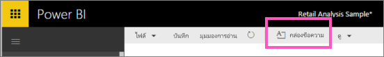
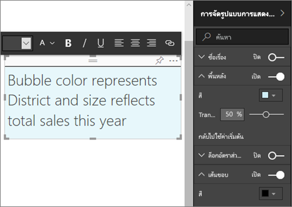
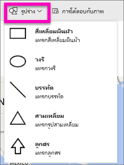
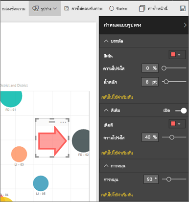

# เพิ่มกล่องข้อความและรูปร่างในรายงาน Power BIAdd text boxes and shapes to Power BI reports
คุณสามารถเพิ่มกล่องข้อความและรูปร่างในรายงานโดยใช้บริการของ Power BI service และ Power BI DesktopYou can add text boxes and shapes to reports by using the Power BI service and Power BI Desktop. ในทั้งสองกรณี คุณต้องแก้ไขสิทธิ์สำหรับรายงานIn both cases, you must have editing permissions for the report. ถ้ารายงานมีการแชร์ให้กับคุณในบริการของ Power BI คุณจะไม่ได้สิทธิการแก้ไขIf a report has been shared with you in the Power BI service, you won't have editing permissions. 

Watch Will ใช้ Power BI Desktop เพื่อ[เพิ่มรูปภาพแบบคงที่ไปยังรายงาน](/learn/modules/visuals-in-power-bi/12-formatting)แล้ว ทำตามขั้นตอนด้านล่างเพื่อลองใช้ Power BI service แทนWatch Will use Power BI Desktop to [add static images to a report](/learn/modules/visuals-in-power-bi/12-formatting), and then follow the steps below to try it out yourself by using the Power BI service instead.
> 
> <iframe width="560" height="315" src="https://www.youtube.com/embed/_3q6VEBhGew" frameborder="0" allowfullscreen></iframe>
> 

## เพิ่มกล่องข้อความไปยังรายงานAdd a text box to a report
1. เปิดรายงานในมุมมองการแก้ไขOpen a report in Editing view.

2. วางเคอร์เซอร์ของคุณในพื้นที่ว่างบนพื้นที่รายงาน และให้เลือก **กล่องข้อความ** จากเมนูด้านบนPlace your cursor in any blank area on the report canvas and select **Text box** from the top menu.
   
   
3. พิมพ์ข้อความของคุณลงในกล่องข้อความ รวมทั้งตั้งค่ารูปแบบฟอนต์ สี และการจัดแนวข้อความType your text into the text box and, optionally, set the format font, color, and text alignment. 
   
   
4. การจัดตำแหน่งกล่องข้อความ ให้เลือกพื้นที่สีเทาที่ด้านบนแล้วลากTo position the text box, select the grey area at the top and drag. เมื่อต้องการปรับขนาดกล่องข้อความ เลือกแล้วลากจุดเค้าร่างTo resize the text box, select and drag any of the outline handles. 
   
   

5. ด้วยกล่องข้อความที่เลือก เพิ่มการจัดรูปแบบเพิ่มเติมในบานหน้าต่าง **การจัดรูปแบบการแสดงข้อมูล**With the text box still selected, add additional formatting in the **Visualizations** pane. ในตัวอย่างนี้ เราได้จัดรูปแบบพื้นหลังและเส้นขอบIn this example, we've formatted the background and border. คุณยังสามารถสร้างเป็นขนาดที่แน่นอนและตำแหน่งของกล่องข้อความYou can also create an exact size and position for a text box.  

   

6. เพื่อปิดกล่องข้อความ เลือกพื้นที่ว่างบนพื้นที่รายงานTo close the text box, select any blank space on the report canvas. 

7. เลือกไอคอนหมุดSelect the pin icon   เพื่อปักหมุดกล่องข้อความไปยังแดชบอร์ดto pin the text box to a dashboard. 

## เพิ่มรูปร่างไปยังรายงานAdd a shape to a report
1. วางเคอร์เซอร์ของคุณที่ใดก็ได้บนพื้นที่รายงาน แล้วเลือก **รูปร่าง**Place your cursor anywhere on the report canvas and select **Shapes**.
   
   
2. จากดร๊อปดาวน์ เลือกรูปร่างเพื่อเพิ่มในพื้นที่รายงานของคุณFrom the dropdown, select a shape to add it to your report canvas. สำหรับตัวอย่างนี้ ลองเพิ่มลูกศรเพื่อดึงดูดความสนใจไปที่แผนภูมิฟองที่มีความแปรปรวนของยอดขายสูงสุดFor this example, add an arrow to direct attention to the bubble with the highest total sales variance. 
   
   ในบานหน้าต่าง **จัดรูปแบบรูปร่าง** ให้ปรับแต่งรูปร่างของคุณIn the **Format shape** pane, customize your shape. ในตัวอย่างนี้ เราได้สร้างเป็นลูกศรสีแดงมีขอบสีแดงเข้ม ถูกหมุน 90 องศาIn this example we've created a red arrow with a dark red border, rotated 90 degrees.
   
   
3. เพื่อจัดตำแหน่งรูปร่าง ให้เลือกพื้นที่สีเทาที่ด้านบนและลากTo position the shape, select the grey area at the top and drag. เมื่อต้องการปรับขนาด เลือกและลากจุดเค้าร่างใด ๆ ก็ได้To resize the shape, select and drag any of the outline handles. เหมือนในหนังสือ คุณยังสามารถสร้างเป็นขนาดที่แน่นอนและตำแหน่งของกล่องข้อความAs with the text box, you can also create an exact size and position for a shape.

   > [!NOTE]
   > รูปร่างที่ไม่สามารถปักหมุดที่ยังแดชบอร์ดได้ ยกเว้นเป็นหนึ่งภาพเมื่อคุณ[ปักหมุดหน้าสด](service-dashboard-pin-live-tile-from-report.md)Shapes cannot be pinned to a dashboard, except as one of the visuals when you [pin a live page](service-dashboard-pin-live-tile-from-report.md). 
   > 
   > 

## ขั้นตอนถัดไปNext steps

คุณอาจมีความสนใจบทความต่อไปนี้:You might also be interested in the following articles:

* [เพิ่มไฮเปอร์ลิงก์ให้กล่องข้อความAdd a hyperlink to a text box](service-add-hyperlink-to-text-box.md)
* [แนวคิดพื้นฐานสำหรับนักออกแบบในบริการของ Power BIBasic concepts for designers in the Power BI service](../fundamentals/service-basic-concepts.md)
* [เคล็ดลับในการปรับปรุงการวิเคราะห์ด้วยรูปร่าง รูปภาพ และไอคอนในรายงาน Power BITips to improve analysis with shapes, images, and icons in Power BI reports](../guidance/report-tips-shapes-images-icons.md)
* มีคำถามเพิ่มเติมหรือไม่More questions? [ลองไปที่ชุมชน Power BITry the Power BI Community](https://community.powerbi.com/)
