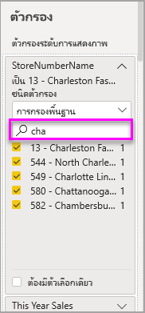

# ตัวกรองและการไฮไลท์ในรายงาน Power BIFilters and highlighting in Power BI reports
 บทความนี้ทำการแนะนำการใช้ตัวกรองและการไฮไลท์ในบริการของ Power BIThis article introduces you to filtering and highlighting in the Power BI service. ประสบการณ์การใช้งานนั้นแทบจะเหมือนกับใน Power BI DesktopThe experience is almost exactly the same in Power BI Desktop. *ตัวกรอง* ให้ลบออกทั้งหมดยกเว้นข้อมูลที่คุณต้องการวิเคราะห์*Filters* remove all but the data you want to focus on. *การไฮไลต์* ไม่ใช่การกรอง*Highlighting* isn't filtering. โดยจะไม่ลบข้อมูลออก แต่จะไฮไลต์เซตย่อยของข้อมูลที่สามารถมองเห็นได้แทน ซึ่งข้อมูลที่ไม่ได้ไฮไลต์ยังคงสามารถจะมองเห็นได้แต่จะเป็นสีจางIt doesn't remove data, but instead highlights a subset of the visible data; the data that isn't highlighted remains visible but dimmed.

มีหลายวิธีคุณสามารถกรอง และไฮไลท์รายงานใน Power BIThere are many different ways you can filter and highlight reports in Power BI. การอัดข้อมูลทั้งหมดในบทความเดียวจะสร้างความสับสน ดังนั้นจึงได้แบ่งส่วนออกมาดังนี้:Putting all of that information in one article would get confusing, so we've broken it into these sections:

* แนะนำตัวกรองและการไฮไลท์ บทความที่คุณกำลังอ่านในขณะนี้Introduction to filters and highlighting, the article you're reading now.
* วิธีการ[สร้างและใช้ตัวกรองในมุมมองการแก้ไข](power-bi-report-add-filter.md)ในรายงานใน Power BI Desktop และบริการของ Power BIHow to [create and use filters in Editing view](power-bi-report-add-filter.md) in reports in Power BI Desktop and the Power BI service. เมื่อคุณมีสิทธิ์การแก้ไขสำหรับรายงาน คุณสามารถสร้าง, แก้ไข และลบตัวกรองในรายงานได้When you have editing permissions for a report, you can create, modify, and delete filters in reports.
* วิธีที่วิชวล[กรองและไฮไลต์ในรายงานที่แชร์ร่วมกับคุณ](../consumer/end-user-interactions.md) ในมุมมองการอ่านรายงานในบริการของ Power BIHow visuals [filter and highlight in a report shared with you](../consumer/end-user-interactions.md), in report Reading view in the Power BI service. สิ่งที่คุณสามารถดำเนินการได้มีข้อจำกัดมาก อย่างไรก็ตามคุณยังคงมีตัวเลือกการกรองและการไฮไลต์อีกมากมายWhat you can do is more limited, but you still have a wide range of filtering and highlighting options.  
* รายละเอียดของตัวควบคุม[ตัวกรองและการไฮไลต์](power-bi-report-add-filter.md)ที่พร้อมใช้งานในมุมมองการแก้ไขใน Power BI Desktop และบริการของ Power BIA detailed tour of the [filter and highlighting controls available in Editing view](power-bi-report-add-filter.md) in Power BI Desktop and the Power BI service. บทความนี้จะศึกษาเชิงลึกเกี่ยวกับประเภทของตัวกรองเช่น วันที่และเวลา ตัวเลข และข้อความThe article takes an in-depth look at types of filters such as date and time, numeric, and text. นอกจากนี้ยังครอบคลุมความแตกต่างระหว่างตัวเลือกพื้นฐานและขั้นสูงIt also covers the differences between basic and advanced options.
* หลังจากที่ได้เรียนรู้วิธีการทำงานของตัวกรองและไฮไลท์ตามค่าเริ่มต้นแล้ว ลองเรียนรู้การ [เปลี่ยนวิธีที่การจัดรูปแบบการแสดงข้อมูลบนตัวกรองหน้าและไฮไลต์ซึ่งกันและกัน](service-reports-visual-interactions.md)After you've learned how filters and highlighting work by default, learn how to [change the way visualizations on a page filter and highlight each other](service-reports-visual-interactions.md)

**คุณทราบหรือไม่****Did you know?** Power BI มีการใช้งานตัวกรองใหม่Power BI has a new filter experience. อ่านเพิ่มเติมเกี่ยวกับ[การใช้งานตัวกรองใหม่ในรายงาน Power BI](power-bi-report-filter.md)Read more about [the new filter experience in Power BI reports](power-bi-report-filter.md).

## บทแนะนำบานหน้าต่างตัวกรองIntro to the Filters pane

คุณสามารถใช้ตัวกรองในบานหน้าต่าง **ตัวกรอง** หรือโดย [สร้างการเลือกในตัวแบ่งส่วนข้อมูล](../visuals/power-bi-visualization-slicers.md) โดยตรงบนรายงานYou can apply filters in the **Filters** pane or by [making selections in slicers](../visuals/power-bi-visualization-slicers.md) directly on the report itself. บานหน้าต่างตัวกรองแสดงตารางและเขตข้อมูลที่ใช้ในรายงานและตัวกรองที่มีการใช้ ถ้ามีThe Filters pane shows the tables and fields used in the report and the filters that have been applied, if any. 

ตัวกรองสี่ประเภทThere are four types of filters.

- **ตัวกรองหน้า** ใช้กับภาพทั้งหมดบนหน้ารายงาน**page filter** applies to all the visuals on the report page     
- **ตัวกรองภาพ** ใช้กับภาพเดียวบนหน้ารายงาน**visual filter** applies to a single visual on a report page. หากคุณเลือกภาพบนพื้นที่รายงาน คุณจะเห็นตัวกรองระดับภาพเท่านั้นYou only see visual level filters if you've selected a visual on the report canvas.    
- **ตัวกรองรายงาน** นำไปใช้กับทุกหน้าในรายงาน**report filter** applies to all pages in the report    
- **ตัวกรอง drillthrough** นำไปใช้กับเอนทิตีแบบเดียวในรายงาน**drillthrough filter** applies to a single entity in a report    

คุณสามารถค้นหาในตัวกรองหน้า, ตัวกรองภาพ และตัวกรองรายงานในมุมมองการอ่านหรือมุมมองการแก้ไข เพื่อค้นหาและเลือกค่าที่คุณต้องการYou can search in page, visual, and report filters, in Reading or Editing view, to find and select the value you want. 

หากตัวกรองมีคำว่า **ทั้งหมด** ด้านข้าง หมายความว่า ค่าทั้งหมดในเขตข้อมูลจะรวมอยู่ในตัวกรองIf the filter has the word **All** next to it, that means all the values in the field are included in the filter.  ตัวอย่างเช่น **สาขา (ทั้งหมด)** ในสกรีนช็อตด้านล่าง หมายถึงหน้ารายงานนี้มีข้อมูลเกี่ยวกับสาขาร้านค้าทั้งหมดFor example, **Chain(All)** in the screenshot below means this report page includes data about all the store chains.  ในทางกลับกัน ตัวกรองระดับรายงาน **FiscalYear เป็น 2013 หรือ 2014** แสดงถึงรายงานที่มีข้อมูลสำหรับปีงบประมาณ 2013 และ 2014 เท่านั้นOn the other hand, the report-level filter **FiscalYear is 2013 or 2014** tells us that the report only includes data for the fiscal years of 2013 and 2014.

## ตัวกรองในมุมมองการอ่านหรือมุมมองการแก้ไขFilters in Reading or Editing view
มีการโต้ตอบกับรายงานสองโหมด คือ [มุมมองการอ่าน](../consumer/end-user-reading-view.md) และมุมมองการแก้ไขThere are two modes for interacting with reports: [Reading view](../consumer/end-user-reading-view.md) and Editing view. ความสามารถในการกรองที่พร้อมใช้งานสำหรับคุณจะขึ้นอยู่กับโหมดที่เลือกThe filtering capabilities available to you depend on which mode you're in.

* ในมุมมองการแก้ไข คุณสามารถเพิ่มตัวกรองรายงาน, ตัวกรองหน้า, ตัวกรอง Drillthrough และตัวกรองภาพIn Editing view, you can add report, page, drillthrough, and visual filters. เมื่อคุณบันทึกรายงาน ตัวกรองจะถูกบันทึกไปกับรายงานด้วย แม้ว่าคุณจะเปิดในแอปสำหรับอุปกรณ์เคลื่อนที่ก็ตามWhen you save the report, the filters are saved with the report, even if you open it in a mobile app. บุคคลที่กำลังดูรายงานในมุมมองการอ่านสามารถโต้ตอบกับตัวกรองที่คุณเพิ่มได้ แต่ไม่สามารถเพิ่มตัวกรองใหม่ได้People looking at the report in Reading view can interact with the filters you added, but can't add new filters.
* ในมุมมองการอ่าน คุณสามารถโต้ตอบกับตัวกรองใด ๆ ที่มีอยู่แล้วในรายงาน และบันทึกการเลือกของคุณIn Reading view, you can interact with any filters that already exist in the report, and save the selections you make. คุณไม่สามารถเพิ่มตัวกรองใหม่ได้You can't add new filters.

### ตัวกรองในมุมมองการอ่านFilters in Reading view
หากคุณเข้าถึงรายงานในมุมมองการอ่านเท่านั้น บานหน้าต่างตัวกรองจะมีลักษณะดังนี้:If you only have access to a report in Reading view, the Filters pane looks similar to this:

หน้านี้ของรายงานมีตัวกรองระดับหน้า 6 ตัว และตัวกรองระดับรายงาน 1 ตัวSo this page of the report has six page-level filters and one report-level filter.

แต่ละภาพสามารถมีตัวกรองสำหรับทุกเขตข้อมูลในภาพดังกล่าวได้ และผู้เขียนรายงานอาจเพิ่มตัวกรองอื่น ๆ อีกEach visual can have filters for all the fields in the visual, and a report author may add more. ในรูปภาพด้านล่าง แผนภูมิฟองมีตัวกรองหกตัวIn the image below, the bubble chart has six filters.

ในมุมมองการอ่าน สำรวจข้อมูลโดยการปรับเปลี่ยนตัวกรองที่มีอยู่In Reading view, explore the data by modifying the existing filters. เปลี่ยนแปลงที่คุณเซฟในรายงาน แม้ว่าคุณดูรายงานในแอปสำหรับอุปกรณ์เคลื่อนที่The changes you make are saved with the report, even if you open the report in a mobile app. เรียนรู้วิธีเมื่อคุณ [สำรวจบานหน้าต่างตัวกรองรายงาน](../consumer/end-user-report-filter.md)Learn how when you [take a tour of the report Filters pane](../consumer/end-user-report-filter.md)

เมื่อคุณออกจากรายงาน ตัวกรองของคุณจะถูกบันทึกWhen you exit the report, your filters are saved. หากต้องการยกเลิกการกรองของคุณและกลับไปยังการกรอง, การแบ่งส่วนข้อมูล, การดูรายละเอียด และชุดการเรียงลำดับ ตามค่าเริ่มต้นของผู้เขียนรายงาน ให้เลือก **รีเซ็ตเป็นค่าเริ่มต้น** จากแถบเมนูด้านบนTo undo your filtering and return to the default filtering, slicing, drill, and sorting set by the report author, select **Reset to default** from the top menubar.

### ตัวกรองในมุมมองการแก้ไขFilters in Editing view
เมื่อคุณมีสิทธิ์ระดับเจ้าของสำหรับรายงาน และเปิดในมุมมองการแก้ไข คุณจะเห็นว่า **ตัวกรอง** เป็นเพียงหนึ่งในบานหน้าต่างตัวแก้ไขWhen you have owner permissions for a report and open it in Editing view, you see that **Filters** is just one of several editing panes available.

ในมุมมองการอ่าน จะเห็นหน้านี้ของรายงานมีตัวกรองระดับหน้า 6 ตัว และตัวกรองระดับรายงาน 1 ตัวAs in Reading view, we see this page of the report has six page-level filters and one report-level filter. และโดยการเลือกแผนภูมิฟอง เราจะเห็นว่ามีตัวกรองระดับภาพ 6 ตัวถูกใช้อยู่And by selecting the bubble chart, we'd see it has six visual level filters applied.

เราสามารถจัดการตัวกรองและการไฮไลต์ในมุมมองการแก้ไขได้มากขึ้นWe can do more with filters and highlighting in Editing view. โดยส่วนใหญ่เราสามารถเพิ่มตัวกรองใหม่ได้Mainly, we can add new filters. เรียนรู้วิธีการ [เพิ่มตัวกรองไปยังรายงาน](power-bi-report-add-filter.md) และอีกมากมายLearn how to [Add a filter to a report](power-bi-report-add-filter.md) and much more.

## การไฮไลต์เฉพาะกิจAd hoc highlighting
เลือกป้ายชื่อค่าหรือแกนในวิชวลเพื่อไฮไลต์วิชวลอื่น ๆ บนหน้าSelect a value or axis label in a visual to highlight the other visuals on the page. หากต้องการลบไฮไลต์ออก ให้เลือกค่าอีกครั้งหรือเลือกพื้นที่ว่างในวิชวลเดียวกันTo remove the highlighting, select the value again, or select any empty space in the same visual. การไฮไลต์คือวิธีการที่สนุกในการสำรวจผลกระทบของข้อมูลอย่างรวดเร็วHighlighting is a fun way to quickly explore data impacts. หากต้องการปรับแต่งวิธีการทำงานของการไฮไลต์เชื่อมโยง สามารถดูได้ที่ [การโต้ตอบของภาพ](service-reports-visual-interactions.md)To fine-tune how this type of cross-highlighting works, see [Visual interactions](service-reports-visual-interactions.md).

## ขั้นตอนถัดไปNext steps

[การใช้งานตัวกรองใหม่ในรายงาน Power BIThe new filter experience in Power BI reports](power-bi-report-filter.md)

[เพิ่มตัวกรองไปยังรายงาน (ในมุมมองการแก้ไข)Add a filter to a report (in Editing view)](power-bi-report-add-filter.md)

[ชมการแนะนำของตัวกรองรายงานTake a tour of report filters](../consumer/end-user-report-filter.md)

[เปลี่ยนวิธีที่่ภาพรายงานกรองแบบไขว้ และข้ามไฮไลท์ของแต่ละตัวChange how report visuals cross-filter and cross-highlight each other](../consumer/end-user-interactions.md)

มีคำถามเพิ่มเติมหรือไม่More questions? [ลองไปที่ชุมชน Power BITry the Power BI Community](https://community.powerbi.com/)
