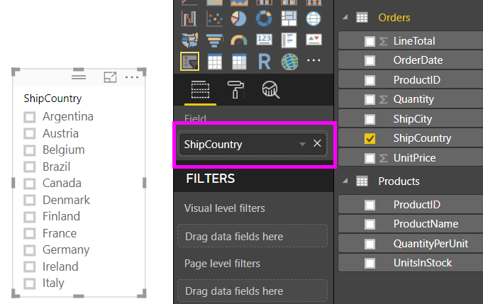
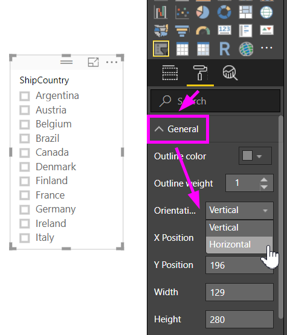
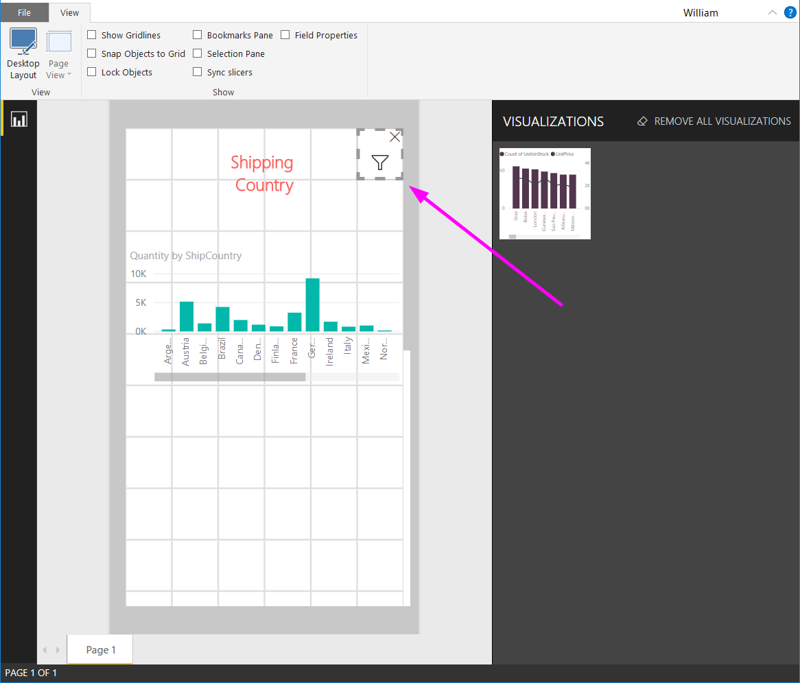

# สร้างตัวแบ่งส่วนข้อมูล คุณสามารถปรับขนาดใน Power BI ได้Create a responsive slicer you can resize in Power BI

[!INCLUDE [applies-to](../includes/applies-to.md)] [!INCLUDE [yes-desktop](../includes/yes-desktop.md)] [!INCLUDE [yes-service](../includes/yes-service.md)][!INCLUDE [applies-to](../includes/applies-to.md)] [!INCLUDE [yes-desktop](../includes/yes-desktop.md)] [!INCLUDE [yes-service](../includes/yes-service.md)]

ตัวแบ่งส่วนข้อมูลแบบตอบสนองปรับขนาดให้พอดีกับพื้นที่บนรายงานของคุณResponsive slicers resize to fit any space on your report. ตัวแบ่งส่วนข้อมูลแบบตอบสนอง คุณสามารถปรับขนาดให้มีหลายรูปร่างและขนาดที่แตกต่างกัน จากแนวนอนเป็นแนวตั้ง และค่าในตัวแบ่งส่วนข้อมูลได้จัดเรียงใหม่ด้วยตนเองเหมือนที่คุณทำอีกด้วยWith responsive slicers, you can resize them to different sizes and shapes, from horizontal to square to vertical, and the values in the slicer rearrange themselves as you do. ใน Power BI Desktop และใน Power BI service คุณสามารถสร้างให้ตัวแบ่งส่วนข้อมูลแนวนอน และตัวแบ่งส่วนข้อมูลแบบตอบสนองตามวัน/ช่วงเวลาIn Power BI Desktop and in the Power BI service, you can make horizontal slicers and date/range slicers responsive. ตัวแบ่งส่วนข้อมูลตามวัน/ช่วงเวลา ยังได้ปรับปรุงพื้นที่สัมผัส ซึ่งง่ายต่อการเปลี่ยนแปลงด้วยปลายนิ้วDate/range slicers also have improved touch areas so it's easier to change them with a fingertip. คุณสามารถทำให้ตัวแบ่งส่วนข้อมูลแบบตอบสนองเป็นขนาดเล็กหรือใหญ่ตามที่คุณต้อง แล้วพวกมันยังปรับขนาดโดยอัตโนมัติให้พอดีกับรายงาน ใน Power BI service และในแอป mobile Power BIYou can make responsive slicers as small or as large as you want; they also resize automatically to fit well on reports in the Power BI service and also in the Power BI mobile apps. 

## สร้างตัวแบ่งส่วนข้อมูลCreate a slicer

ขั้นตอนแรกในการสร้างตัวแบ่งส่วนข้อมูลแบบไดนามิกคือสร้างตัวแบ่งส่วนข้อมูลพื้นฐานThe first step to creating a dynamic slicer is to create a basic slicer. 

1. เลือกไอคอน **ตัวแบ่งส่วนข้อมูล**ในบานหน้าต่าง **แสดงภาพ**Select the **Slicer** icon  in the **Visualizations** pane.
2. ลากเขตข้อมูลที่คุณต้องการไปยังตัวกรองบน **เขตข้อมูล**Drag the field you want to filter on to **Field**.

    

## แปลงเป็นตัวแบ่งส่วนข้อมูลแนวนอนConvert to a horizontal slicer

1. ด้วยตัวแบ่งส่วนข้อมูลที่เลือกไว้ ในบานหน้าต่าง **แสดงภาพ** ให้เลือกแท็บ **รูปแบบ**With the slicer selected, in the **Visualizations** pane select the **Format** tab.
2. ขยายส่วน **ทั่วไป** แล้วสำหรับ **วางแนว** ให้เลือก **แนวนอน**Expand the **General** section, then for **Orientation**, select **Horizontal**.

     

1.  คุณอาจจะต้องการทำให้กว้างขึ้น เพื่อแสดงค่าเพิ่มเติมYou'll probably want to make it wider, to show more values.

     

## ทำให้เป็นแบบตอบสนอง และทดลองใช้มันMake it responsive and experiment with it

ขั้นตอนนี้เป็นเรื่องง่ายThis step is easy. 

1. ที่ใต้ **การจัดแนว** ในส่วน **ทั่วไป** ของแท็บ **รูปแบบ** สไลด์ค่า **ตอบสนอง** ไปยัง **เปิด**Right under **Orientation** in the **General** section of the **Format** tab, slide **Responsive** to **On**.  

    

1. ในตอนนี้ คุณสามารถเล่นกับมันNow you can play with it. ลากตรงมุมเพื่อทำให้สั้น สูง ความกว้างและแคบDrag the corners to make it short, tall, wide, and narrow. ถ้าคุณปรับให้มีขนาดเล็กพอ จะกลายเป็นเพียงไอคอนตัวกรองIf you make it small enough, it becomes just a filter icon.

    

## เพิ่มลงในเค้าโครงรายงานโทรศัพท์Add it to a phone report layout

ใน Power BI Desktop คุณสามารถสร้างเค้าโครงโทรศัพท์สำหรับแต่ละหน้าของรายงานIn Power BI Desktop, you can create a phone layout for each page of a report. ถ้าหน้ามีเค้าโครงโทรศัพท์ จะแสดงบนโทรศัพท์มือถือในมุมมองแนวตั้งIf a page has a phone layout, it displays on a mobile phone in portrait view. ไม่เช่นนั้น คุณจำเป็นต้องดูในมุมมองแนวนอนOtherwise, you need to view it in landscape view. 

1. ที่เมนู **มุมมอง** ให้เลือก **เค้าโครงโทรศัพท์**On the **View** menu, select **Phone Layout**.

     
    
1. ลากภาพทั้งหมดที่คุณต้องการในรายงานโทรศัพท์ลงในตารางDrag all the visuals you want in the phone report to the grid. เมื่อคุณลากตัวแบ่งส่วนข้อมูลแบบตอบสนอง มันทำให้ได้ขนาดที่คุณต้องการ ในกรณีนี้ เป็นเพียงไอคอนตัวกรองWhen you drag the responsive slicer, make it the size you want -- in this case, just a filter icon.

    

อ่านเพิ่มเติมเกี่ยวกับการสร้าง[รายงานที่ปรับให้เหมาะสมสำหรับแอปอุปกรณ์เคลื่อนที่ Power BI](desktop-create-phone-report.md)Read more about creating [reports optimized for the Power BI mobile apps](desktop-create-phone-report.md).

## สร้างตัวแบ่งส่วนข้อมูลแบบตอบสนองต่แเวลาหรือช่วงเวลาMake a time or range slicer responsive

คุณสามารถทำตามขั้นตอนเดียวกันเพื่อสร้างตัวแบ่งส่วนข้อมูลแบบตอบสนองต่อเวลาหรือช่วงเวลาYou can follow the same steps to make a time or range slicer responsive. หลังจากที่คุณตั้งค่า **การตอบสนอง** เป็น **เปิด** คุณจะสังเกตเห็นบางอย่างAfter you set **Responsive** to **On**, you notice a few things:

- ภาพได้ปรับลำดับของกล่องป้อนข้อมูลให้เหมาะสมโดยขึ้นอยู่กับขนาดที่อนุญาตให้ใช้บนพื้นที่Visuals optimize the order of input boxes depending on the size allowed on the canvas. 
- แสดงองค์ประกอบข้อมูลที่ถูกปรับให้เหมาะสม เพื่อทำให้ตัวแบ่งส่วนข้อมูลใช้งานได้มากที่สุด ขึ้นอยู่กับขนาดที่อนุญาตบนพื้นที่Data-element display is optimized to make the slicer as usable as possible, based on the size it's allowed on the canvas. 
- แถบที่จับทรงกลมใหม่บนแถบเลื่อนที่ปรับการโต้ตอบแบบสัมผัสให้เหมาะสมNew round handlebars on the sliders optimize touch interactions. 
- เมื่อรูปภาพเปลี่ยนขนาดจนเล็กเกินไปที่จะเป็นประโยชน์ จะกลายเป็นไอคอนที่แสดงชนิดภาพแทนWhen a visual becomes too small to be useful, it becomes an icon representing the visual type in its place. เพื่อใช้งาน ก็แค่แตะครั้งสองครั้งเพื่อเปิดในโหมดโฟกัสTo interact with it, just double-tap to open it in focus mode. ซึ่งช่วยประหยัดเนื้อที่อันมีค่าบนหน้ารายงานโดยไม่สูญเสียความสามารถการทำงานThis saves valuable space on the report page without losing the functionality.

## ขั้นตอนถัดไปNext steps

- [ตัวแบ่งส่วนข้อมูลในบริการ Power BISlicers in the Power BI service](../visuals/power-bi-visualization-slicers.md)
- มีคำถามเพิ่มเติมหรือไม่More questions? [ลองถามชุมชน Power BITry asking the Power BI Community](https://community.powerbi.com/)