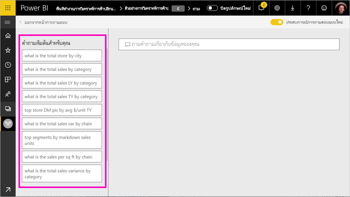

# ใช้ Power BI Q&A เพื่อสำรวจข้อมูลของคุณและสร้างวิชวลUse Power BI Q&A to explore your data and create visuals

ในบางครั้ง วิธีที่เร็วที่สุดในการให้ได้คำตอบจากข้อมูลของคุณคือ การถามคำถามโดยใช้ภาษาธรรมชาติSometimes the fastest way to get an answer from your data is to ask a question using natural language. คุณลักษณะถามตอบ (Q&A) ใน Power BI ช่วยให้คุณสามารถสำรวจข้อมูลของคุณด้วยคำพูดของคุณเองThe Q&A feature in Power BI lets you explore your data in your own words.  ส่วนแรกของบทความนี้แสดงวิธีการใช้ถามตอบ (Q&A) ในแดชบอร์ดในบริการ Power BIThe first part of this article shows how you use Q&A in dashboards in the Power BI service. ส่วนที่สองแสดงสิ่งที่คุณสามารถทำได้ด้วยถามตอบ (Q&A) เมื่อสร้างรายงานในบริการ Power BI หรือไม่ก็ Power BI DesktopThe second part shows what you can do with Q&A when creating reports in either the Power BI service or Power BI Desktop. สำหรับพื้นหลังเพิ่มเติม ดูบทความ [ถามตอบ (Q&A) สำหรับผู้บริโภค](../consumer/end-user-q-and-a.md)For more background, see the [Q&A for consumers](../consumer/end-user-q-and-a.md) article. 

[Q&A ในแอป Power BI สำหรับอุปกรณ์เคลื่อนที่ ](../consumer/mobile/mobile-apps-ios-qna.md)และ[ Q&A ที่มี Power BI Embedded](../developer/embedded/qanda.md) ครอบคลุมในบทความต่างหาก[Q&A in the Power BI mobile apps](../consumer/mobile/mobile-apps-ios-qna.md) and [Q&A with Power BI Embedded](../developer/embedded/qanda.md) are covered in separate articles. 

ระบบถามตอบ (Q&A) เป็นระบบแบบโต้ตอบ แถมยังสนุกด้วยQ&A is interactive, even fun. บ่อยครั้งที่คำถามหนึ่งนำไปสู่อีกคำถามหนึ่งเนื่องจากการแสดงผลข้อมูลด้วยภาพแสดงให้เห็นเส้นทางที่น่าสนใจในการติดตามOften, one question leads to others as the visualizations reveal interesting paths to pursue. ดู Amanda สาธิตการใช้ถามตอบ เพื่อสร้างการแสดงภาพ เจาะลึกลงในวิชวลเหล่านั้น และปักหมุดวิชวลไปยังแดชบอร์ดWatch Amanda demonstrate using Q&A to create visualizations, dig into those visuals, and pin them to dashboards.

<iframe width="560" height="315" src="https://www.youtube.com/embed/qMf7OLJfCz8?list=PL1N57mwBHtN0JFoKSR0n-tBkUJHeMP2cP" frameborder="0" allowfullscreen></iframe>

## ส่วนที่ 1: ใช้ Q&A บนแดชบอร์ดในบริการของ Power BIPart 1: Use Q&A on a dashboard in the Power BI service

ในบริการของ Power BI (app.powerbi.com) แดชบอร์ดประกอบด้วย ไทล์ที่ปักหมุดจากชุดข้อมูลหนึ่งหรือหลายชุด ดังนั้นคุณสามารถถามคำถามเกี่ยวกับข้อมูลที่มีอยู่ในชุดข้อมูลใดๆ เหล่านั้นIn the Power BI service (app.powerbi.com), a dashboard contains tiles pinned from one or more datasets, so you can ask questions about any of the data contained in any of those datasets. เพื่อดูว่ารายงานและชุดข้อมูลใดถูกใช้ในการสร้างแดชบอร์ด เลือก **ดูรายการที่เกี่ยวข้อง** จากแถบเมนูTo see what reports and datasets were used to create the dashboard, select **View related** from the menu bar.

กล่องคำถามของถามตอบ (Q&A) อยู่ที่มุมบนซ้ายของแดชบอร์ดคุณ และที่คุณพิมพ์คำถามของคุณโดยใช้ภาษาธรรมชาติThe Q&A question box is located in the upper-left corner of your dashboard, where you type your question using natural language. ไม่เห็นกล่องถามตอบ (Q&A) ใช่หรือไม่?Don't see the Q&A box? โปรดดู [ข้อควรพิจารณาและการแก้ไขปัญหา](../consumer/end-user-q-and-a.md#considerations-and-troubleshooting) ในบทความ **ถามตอบ (Q&A) สำหรับผู้บริโภค**See [Considerations and troubleshooting](../consumer/end-user-q-and-a.md#considerations-and-troubleshooting) in the **Q&A for consumers** article.  ถามตอบ (Q&A) เข้าใจคำที่คุณพิมพ์เข้าไป และหาว่าที่ไหน (ชุดข้อมูลไหน) เพื่อค้นหาคำตอบQ&A recognizes the words you type and figures out where (in which dataset) to find the answer. ถามตอบยังช่วยคุณสร้างคำถาม ด้วยการทำให้ข้อความสมบูรณ์โดยอัตโนมัติ การเปลี่ยนข้อความในคำถาม และการช่วยเหลืออื่น ๆ ทางข้อความหรือภาพQ&A also helps you form your question with auto-completion, restatement, and other textual and visual aids.

คำตอบของคำถามคุณ จะแสดงเป็นการแสดงภาพแบบโต้ตอบ และจะปรับปรุงตามเมื่อคุณปรับเปลี่ยนคำถามThe answer to your question is displayed as an interactive visualization and updates as you modify the question.

1. เปิดแดชบอร์ด แล้ววางเคอร์เซอร์ของคุณในกล่องคำถามOpen a dashboard and place your cursor in the question box. ในมุมขวาบน ให้เลือก **ประสบการณ์การใช้งานถามตอบ (Q&A) แบบใหม่**In the upper-right corner, select **New Q&A experience**.

    

1. ถึงแม้ว่าคุณยังไม่เริ่มพิมพ์ ถามตอบจะแสดงหน้าจอใหม่ ด้วยคำแนะนำเพื่อช่วยคุณสร้างคำถามของคุณEven before you start typing, Q&A displays a new screen with suggestions to help you form your question. คุณเห็นวลีและคำถามทั้งหมดที่มีชื่อของตารางในชุดข้อมูลเบื้องต้น และอาจเห็นรายการคำถามทั้งหมด ถ้าเจ้าของชุดข้อมูลสร้าง[คำถามที่น่าสนใจ](service-q-and-a-create-featured-questions.md)ไว้แล้วYou see phrases and complete questions containing the names of the tables in the underlying datasets and may even see complete questions listed if the dataset owner has created [featured questions](service-q-and-a-create-featured-questions.md),

   

   คุณสามารถเลือกหนึ่งในคำถามเหล่านี้เป็นจุดเริ่มต้น และปรับแต่งคำถามต่อไปเพื่อค้นหาคำตอบเฉพาะYou can choose one of these questions as a starting point and continue to refine the question to find a specific answer. หรือใช้ชื่อตารางเพื่อช่วยคุณในการใช้ถ้อยคำสำหรับการตั้งคำถามใหม่Or use a table name to help you word a new question.

2. เลือกจากรายการคำถาม หรือเริ่มพิมพ์คำถามของคุณเอง แล้วเลือกจากคำแนะนำในรายการดรอปดาวน์Select from the list of questions, or begin typing your own question and select from the dropdown suggestions.

   

3. ในขณะที่คุณพิมพ์คำถาม ถามตอบ (Q&A) จะเลือกการแสดงผลข้อมูลด้วยภาพที่ดีที่สุดเพื่อแสดงคำถามของคุณAs you type a question, Q&A picks the best visualization to display your answer.

   

4. การแสดงผลข้อมูลด้วยภาพจะเปลี่ยนแปลงแบบไดนามิกเมื่อคุณปรับเปลี่ยนคำถามThe visualization changes dynamically as you modify the question.

   

1. เมื่อคุณพิมพ์คำถาม Power BI จะค้นหาคำตอบที่ดีที่สุด โดยใช้ชุดข้อมูลใด ๆ ที่มีไทล์อยู่บนแดชบอร์ดนั้นWhen you type a question, Power BI looks for the best answer using any dataset that has a tile on that dashboard.  ถ้าไทล์ทั้งหมดมาจาก *ชุดข้อมูล A* คำตอบของคุณจะมาจาก *ชุดข้อมูล A*If all the tiles are from *datasetA*, then your answer will come from *datasetA*.  ถ้ามีไทล์จากทั้ง *ชุดข้อมูล A* และ *ชุดข้อมูล B* ถามตอบ (Q&A) จะค้นหาคำตอบที่ดีที่สุดจากชุดข้อมูลทั้ง 2 นั้นIf there are tiles from *datasetA* and *datasetB*, then Q&A searches for the best answer from those 2 datasets.

   > [!TIP]
   > ดังนั้นโปรดระวัง ถ้าคุณมีไทล์หนึ่งจาก *ชุดข้อมูล A* และคุณเอาออกจากแดชบอร์ดของคุณ ถามตอบจะไม่สามารถเข้าถึง *ชุดข้อมูล A* ได้อีกSo be careful, if you only have one tile from *datasetA* and you remove it from your dashboard, Q&A will no longer have access to *datasetA*.
   >

5. เมื่อคุณพอใจกับผลลัพธ์ ให้ปักหมุดการแสดงผลข้อมูลด้วยภาพไปยังแดชบอร์ด โดยการเลือกไอคอนรูปเข็มหมุดในมุมบนขวาWhen you're happy with the result, pin the visualization to a dashboard by selecting the pin icon in the top right corner. ถ้าแดชบอร์ดถูกแชร์ให้กับคุณ หรือเป็นส่วนหนึ่งของแอป คุณจะไม่สามารถปักหมุดได้If the dashboard has been shared with you, or is part of an app, you won't be able to pin.

   

## ส่วนที่ 2: ใช้ Q&A ในรายงาน ในบริการของ Power BI หรือ Power BI DesktopPart 2: Use Q&A in a report in Power BI service or Power BI Desktop

ใช้ถามตอบ เพื่อสำรวจชุดข้อมูลของคุณ และเพิ่มการแสดงภาพไปยังรายงาน และแดชบอร์ดUse Q&A to explore your dataset and to add visualizations to the report and to dashboards. รายงานจะมาจากชุดข้อมูลเดียว และอาจเป็นรายงานเปล่า หรือประกอบด้วยหน้าต่าง ๆ ที่เต็มไปด้วยการแสดงภาพA report is based on a single dataset and may be completely blank or contain pages full of visualizations. แต่เพียงเพราะว่ารายงานว่างเปล่า ไม่ได้หมายความว่าไม่มีข้อมูลใด ๆ ที่คุณสามารถสำรวจได้ - ชุดข้อมูลเชื่อมโยงกับรายงาน และกำลังรอให้คุณสำรวจ และสร้างการแสดงภาพBut just because a report is blank, doesn't mean there isn't any data for you to explore -- the dataset is linked to the report and is waiting for you to explore and create visualizations.  เพื่อดูว่าชุดข้อมูลไหนใช้สร้างรายงาน เปิดรายงานในมุมมองการอ่านในบริการของ Power BI แล้วเลือก **ดูรายการที่เกี่ยวข้อง** จากแถบเมนูTo see which dataset is being used to create a report, open the report in Power BI service Reading view and select **View related** from the menubar.

หากต้องการใช้ถามตอบ (Q&A) ในรายงาน คุณต้องมีสิทธิ์ในการแก้ไขสำหรับ รายงานและชุดข้อมูลพื้นฐานTo use Q&A in reports, you must have edit permissions for the report and underlying dataset. ในบทความ [ถามตอบ (Q&A) สำหรับผู้บริโภค](../consumer/end-user-q-and-a.md) เราอ้างถึงสิ่งนี้ว่าเป็นสถานการณ์จำลองของ *ผู้สร้าง*In the [Q&A for consumers](../consumer/end-user-q-and-a.md) article, we refer to this as a *creator* scenario. หากคุณ *กำลังใช้งาน* รายงานที่แบ่งปันกับคุณแทน ถามตอบ (Q&A) จะไม่สามารถใช้งานได้If instead you're *consuming* a report that has been shared with you, Q&A isn't available.

1. เปิดรายงานในมุมมองการแก้ไข (บริการ Power BI) หรือมุมมองรายงาน (Power BI Desktop) และเลือก **ถามคำถาม** จากแถบเมนูOpen a report in Editing view (Power BI service) or Report view (Power BI Desktop) and select **Ask a question** from the menu bar.

    **Power BI Desktop**  **Power BI Desktop**    
    

    **บริการ**  **Service**    
    

2. กล่องคำถามถามตอบ จะแสดงบนพื้นที่รายงานของคุณA Q&A question box displays on your report canvas. ในตัวอย่างด้านล่าง กล่องคำถามแสดงอยู่เหนือการแสดงภาพอื่นIn the example below, the question box displays on top of another visualization. ซึ่งยอมรับได้ แต่จะเป็นการดีกว่าถ้าเพิ่มหน้าเปล่าลงในรายงานก่อนที่ถามคำถามThis is fine, but it might be better to add a blank page to the report before asking a question.

    

3. วางเคอร์เซอร์ของคุณในกล่องคำถามPlace your cursor in the question box. ขณะที่คุณพิมพ์ ถามตอบจะแสดงคำแนะนำ เพื่อช่วยคุณสร้างคำถามของคุณAs you type, Q&A displays suggestions to help you form your question.

   

4. ขณะที่คุณพิมพ์คำถาม ถามตอบจะเลือก[การแสดงภาพ](../visuals/power-bi-visualization-types-for-reports-and-q-and-a.md)ที่ดีที่สุด เพื่อแสดงคำตอบของคุณ และการแสดงภาพจะเปลี่ยนตาม ขณะที่คุณปรับเปลี่ยนคำถามAs you type a question, Q&A picks the best [visualization ](../visuals/power-bi-visualization-types-for-reports-and-q-and-a.md)to display your answer; and the visualization changes dynamically as you modify the question.

   

5. เมื่อคุณมีการแสดงภาพที่คุณชอบ เลือก ENTERWhen you have the visualization you like, select ENTER. เพื่อบันทึกการแสดงภาพลงรายงาน เลือก **ไฟล์ > บันทึก**To save the visualization with the report, select **File > Save**.

6. โต้ตอบกับการแสดงภาพใหม่Interact with the new visualization. ไม่สำคัญว่าคุณได้สร้างการแสดงภาพด้วยวิธีไหน -- ทั้งหมดจะมีการโต้ตอบ จัดรูปแบบ และคุณลักษณะที่เหมือนกันIt doesn't matter how you created the visualization -- all the same interactivity, formatting, and features are available.

   

   ถ้าคุณได้สร้างการแสดงภาพในบริการของ Power BI คุณสามารถ[ปักหมุดไปยังแดชบอร์ด](service-dashboard-pin-tile-from-q-and-a.md)ได้If you've created the visualization in Power BI service, you can even [pin it to a dashboard](service-dashboard-pin-tile-from-q-and-a.md).

## บอกการถามตอบว่าต้องใช้การแสดงภาพแบบใดTell Q&A which visualization to use
ด้วยถามตอบ ไม่เพียงแต่คุณสามารถขอให้ข้อมูลคุณพูดออกมาด้วยตัวเอง คุณสามารถบอกวิธีที่ Power BI จะแสดงคำตอบได้With Q&A, not only can you ask your data to speak for itself, you can tell Power BI how to display the answer. เพียงแค่เพิ่ม "as a <visualization type>" ตรงท้ายคำถามของคุณJust add "as a <visualization type>" to the end of your question.  ตัวอย่างเช่น "show inventory volume by plant as a map" และ "show total inventory as a card"For example, "show inventory volume by plant as a map" and "show total inventory as a card".  ลองทำด้วยตัวเองดูTry it for yourself.

## ข้อควรพิจารณาและการแก้ไขปัญหาConsiderations and troubleshooting
- ถ้าคุณได้เชื่อมต่อชุดข้อมูลโดยใช้การเชื่อมต่อสด หรือใช้เกตเวย์ ถามตอบจะต้อง[เปิดใช้งานสำหรับชุดข้อมูลนั้น](service-q-and-a-direct-query.md)If you've connected to a dataset using a live connection or gateway, Q&A needs to be [enabled for that dataset](service-q-and-a-direct-query.md).

- คุณได้เปิดรายงาน และไม่เห็นตัวเลือกการถามตอบYou've opened a report and don't see the Q&A option. ถ้าคุณกำลังใช้บริการของ Power BI ตรวจสอบทำให้แน่ใจว่า รายงานเปิดในมุมมองการแก้ไขIf you're using Power BI service, make sure the report is open in Editing view. ถ้าคุณไม่สามารถเปิดรายงานในมุมมองการแก้ไข นั่นหมายความว่า คุณไม่มีสิทธิ์ในการแก้ไขรายงานนั้น และคุณไม่สามารถใช้ถามตอบ (Q&A) กับรายงานเฉพาะนั้นได้If you can't open Editing view it means you don't have edit permissions for that report and you can use Q&A with that specific report.

## ขั้นตอนถัดไปNext steps

- [การถามตอบสำหรับผู้ใช้Q&A for consumers](../consumer/end-user-q-and-a.md)   
- [เคล็ดลับการถามคำถามในถามตอบ (Q&A)Tips for asking questions in Q&A](../consumer/end-user-q-and-a-tips.md)   
- [เตรียมเวิร์กบุ๊กสำหรับการถามตอบPrepare a workbook for Q&A](service-prepare-data-for-q-and-a.md)  
- [เตรียมชุดข้อมูลภายในองค์กรสำหรับถามตอบ (Q&A)Prepare an on-premises dataset for Q&A](service-q-and-a-direct-query.md)   
- [ปักหมุดไทล์ไปยังแดชบอร์ดจากถามตอบ (Q&A)Pin a tile to the dashboard from Q&A](service-dashboard-pin-tile-from-q-and-a.md)
