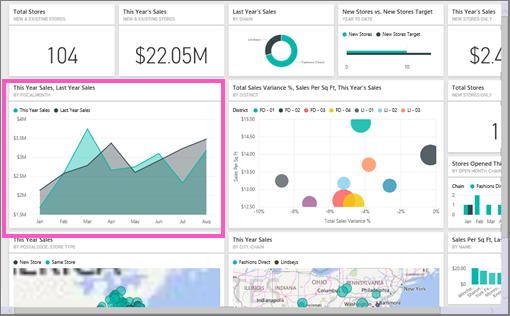

# สร้างวิชวลด้วย Power BI Q&ACreate a visual with Power BI Q&A

ในบางครั้ง วิธีที่เร็วที่สุดในการให้ได้คำตอบจากข้อมูลของคุณคือ การถามคำถามโดยใช้ภาษาธรรมชาติSometimes the fastest way to get an answer from your data is to ask a question using natural language.  ในบทความนี้ เราจะมาดูวิธีการที่แตกต่างกันสองวิธีในการสร้างการแสดงผลข้อมูลด้วยภาพชนิดเดียวกัน: วิธีแรก ถามคำถามกับถามตอบ (Q&A) และวิธีที่สอง สร้างในรายงานIn this article, we look at two different ways of creating the same visualization: first, asking a question with Q&A, and second, building it in a report. เราใช้บริการ Power BI เพื่อสร้างวิชวลในรายงาน แต่กระบวนการเกือบจะเหมือนกันทั้งหมดกับการใช้ Power BI DesktopWe use the Power BI service to build the visual in the report, but the process is almost identical using Power BI Desktop.

ในการทำตาม คุณต้องใช้รายงานที่คุณสามารถแก้ไขได้ ดังนั้นเราจะใช้หนึ่งในตัวอย่างที่พร้อมใช้งานกับ Power BITo follow along, you must use a report that you can edit, so we'll use one of the samples available with Power BI.

## สร้างการแสดงผลด้วยภาพด้วยการถามตอบCreate a visual with Q&A

เราจะทำอย่างไรในการสร้างแผนภูมิเส้นนี้โดยใช้ถามตอบ (Q&A)?How would we go about creating this line chart using Q&A?

1. จากพื้นที่ทำงานของ Power BI เลือก **รับข้อมูล** \> **ตัวอย่าง** \> **ตัวอย่างการวิเคราะห์ร้านค้าปลีก**  >  **เชื่อมต่อ**From your Power BI workspace, select **Get Data** \> **Samples** \> **Retail Analysis Sample** > **Connect**.

1. เปิดแดชบอร์ดตัวอย่างการวิเคราะห์ร้านค้าปลีก และวางเคอร์เซอร์ของคุณในกล่องถามตอบ (Q&A) **ถามคำถามเกี่ยวกับข้อมูลของคุณ**Open the Retail Analysis Sample dashboard and place your cursor in the Q&A box, **Ask a question about your data**.

    

2. ในกล่องถามตอบ (Q&A) ให้พิมพ์บางสิ่งบางอย่างเช่นคำถามนี้:In the Q&A box, type something like this question:
   
    **ยอดขายในปีนี้และยอดขายในปีที่แล้วตามเดือนโดยแสดงเป็นแผนภูมิพื้นที่****this year sales and last year sales by month as area chart**
   
    ขณะที่คุณพิมพ์คำถามของคุณ การถามตอบจะเลือกการแสดงภาพที่ดีที่สุดเพื่อแสดงคำตอบของคุณ และการแสดงภาพจะเปลี่ยนแปลงอย่างต่อเนื่องขณะที่คุณเปลี่ยนคำถามของคุณAs you type your question, Q&A picks the best visualization to display your answer; and the visualization changes dynamically as you modify the question. นอกจากนี้ การถามตอบยังช่วยให้คุณสามารถจัดรูปแบบคำถามของคุณตามคำแนะนำ การกรอกข้อมูลอัตโนมัติ และการแก้ไขการสะกดAlso, Q&A helps you format your question with suggestions, autocomplete, and spelling corrections. ถามตอบ (Q&A) แนะนำให้ใช้การเปลี่ยนแปลงถ้อยคำเล็กน้อย: "ยอดขายในปีนี้และยอดขายในปีที่แล้วตาม *เดือนเวลา* โดยแสดงเป็นแผนภูมิพื้นที่"Q&A recommends a small wording change: "this year sales and last year sales by *time month* as area chart".  

    

4. เลือกประโยคเพื่อยอมรับคำแนะนำSelect the sentence to accept the suggestion. 
   
   เมื่อคุณพิมพ์คำถามของคุณเสร็จแล้ว ผลลัพธ์จะแสดงเป็นแผนภูมิเดียวกับที่คุณเห็นในแดชบอร์ดWhen you finish typing your question, the result is the same chart that you see in the dashboard.
   
   

4. เมื่อต้องการปักหมุดแผนภูมิไปยังแดชบอร์ด เลือกไอคอนปักหมุดTo pin the chart to your dashboard, select the pin icon  ที่มุมขวาบนin the upper-right corner.

## สร้างวิชวลในตัวแก้ไขรายงานCreate a visual in the report editor

1. นำทางกลับไปยังแดชบอร์ดตัวอย่างการวิเคราะห์ร้านค้าปลีกNavigate back to the Retail Analysis Sample dashboard.
   
2. แดชบอร์ดประกอบด้วยไทล์แผนภูมิพื้นที่เดียวกันสำหรับ "ยอดขายของปีที่แล้วและยอดขายของปีนี้"The dashboard contains the same area chart tile for "Last Year Sales and This Year Sales."  เลือกไทล์นี้Select this tile. อย่าเลือกไทล์ที่คุณสร้างขึ้นด้วยถามตอบ (Q&A)Don't select the tile you created with Q&A. การเลือกจะเปิดถามตอบ (Q&A)Selecting it opens Q&A. ไทล์แผนภูมิพื้นที่ดั้งเดิมถูกสร้างขึ้นในรายงาน ดังนั้นรายงานจะเปิดไปยังหน้าที่ประกอบด้วยการแสดงภาพนี้The original area chart tile was created in a report, so the report opens to the page that contains this visualization.

    

1. เปิดรายงานในมุมมองการแก้ไขโดยการเลือก **แก้ไขรายงาน**Open the report in Editing View by selecting **Edit Report**.  ถ้าคุณไม่ได้เป็นเจ้าของรายงาน คุณจะไม่มีตัวเลือกในการเปิดรายงานในมุมมองแก้ไขIf you aren't the owner of a report, you don't have the option to open the report in Editing view.
   
    
4. เลือกแผนภูมิพื้นที่และตรวจทานการตั้งค่าในพื้นที่ **เขตข้อมูล**Select the area chart and review the settings in the **Fields** pane.  ผู้สร้างรายงานสร้างแผนภูมินี้โดยการเลือกทั้งสามค่านี้ (**ยอดขายปีที่แล้ว** และ **ยอดขายในปีนี้ > ค่า** จากตาราง **ยอดขาย** และ **เดือนทางบัญชี** จากตาราง **เวลา**) และจัดระเบียบพวกเขาในพื้นที่ **แกน** และ **ค่า**The report creator built this chart by selecting these three values (**Last Year Sales** and **This Year Sales > Value** from the **Sales** table, and **FiscalMonth** from the **Time** table) and organizing them in the **Axis** and **Values** wells.
   
    

    คุณเห็นพวกเขาจบลงด้วยวิชวลที่เหมือนกันYou see they ended up with the same visual. การสร้างแบบนี้ไม่ซับซ้อนเกินไปCreating it this way wasn't too complicated. แต่การสร้างด้วยถามตอบ (Q&A) นั้นง่ายกว่า!But creating it with Q&A was easier!

## ขั้นตอนถัดไปNext steps

- [ใช้การถามตอบในแดชบอร์ดและรายงานUse Q&A in dashboards and reports](power-bi-tutorial-q-and-a.md)  
- [การถามตอบสำหรับผู้ใช้Q&A for consumers](../consumer/end-user-q-and-a.md)
- [ทำให้ข้อมูลของคุณทำงานได้ดีกับการถามตอบใน Power BIMake your data work well with Q&A in Power BI](service-prepare-data-for-q-and-a.md)

มีคำถามเพิ่มเติมหรือไม่More questions? [ลองไปที่ชุมชน Power BITry the Power BI Community](https://community.powerbi.com/)
