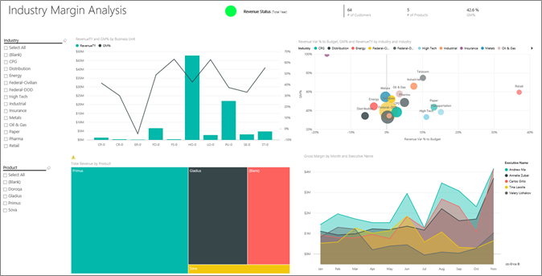

# ตัวอย่างความสามารถในการทำกำไรลูกค้าสำหรับ Power BI: ชมการแนะนำCustomer Profitability sample for Power BI: Take a tour

ชุดเนื้อหาตัวอย่างความสามารถในการทำกำไรจากลูกค้าประกอบด้วยแดชบอร์ด รายงาน และชุดข้อมูลสำหรับบริษัทที่ผลิตเอกสารทางการตลาดThe Customer Profitability sample content pack contains a dashboard, report, and dataset for a company that manufactures marketing materials. แดชบอร์ดนี้ถูกสร้างขึ้นโดย CFO เพื่อดูเมตริกสำคัญเกี่ยวกับผู้จัดการหน่วยธุรกิจห้าราย (ผู้บริหาร) ผลิตภัณฑ์ ลูกค้า และอัตราส่วนกำไรขั้นต้น (GM)This dashboard was created by a CFO to see key metrics about their five business unit managers (executives), products, customers, and gross margins (GM). พวกเขาสามารถมองเห็นปัจจัยที่ส่งผลต่อความสามารถในการทำกำไรได้ในทันทีAt a glance, they can see what factors are impacting profitability.

ตัวอย่างนี้เป็นส่วนหนึ่งของชุดตัวอย่าง ที่แสดงให้เห็นวิธีการที่คุณสามารถใช้ Power BI กับข้อมูล รายงาน และแดชบอร์ดที่เกี่ยวข้องกับธุรกิจThis sample is part of a series that shows how you can use Power BI with business-oriented data, reports, and dashboards. ซึ่งสร้างขึ้นโดย [obviEnce](http://www.obvience.com/) ด้วยข้อมูลจริงที่ไม่มีการระบุชื่อIt was created by [obviEnce](http://www.obvience.com/) with real data, which has been anonymized. ข้อมูลมีให้ใช้งานหลายรูปแบบ: ชุดเนื้อหา ไฟล์ Power BI Desktop .pbix หรือเวิร์กบุ๊ก ExcelThe data is available in several formats: content pack, .pbix Power BI Desktop file, or Excel workbook. ดู [ตัวอย่างสำหรับ Power BI](sample-datasets.md)See [Samples for Power BI](sample-datasets.md). 

บทช่วยสอนนี้จะสำรวจชุดเนื้อหาของตัวอย่างความสามารถในการทำกำไรจากลูกค้าในบริการของ Power BIThis tutorial explores the Customer Profitability sample content pack in the Power BI service. เนื่องจากประสบการณ์การใช้รายงานจะคล้ายคลึงกันใน Power BI Desktop ดังนั้นคุณสามารถใช้ Power BI Desktop กับไฟล์ .pbix ตัวอย่างใน Power BI Desktop ได้Because the report experience is similar in Power BI Desktop and in the service, you can also follow along by using the sample .pbix file in Power BI Desktop. 

คุณไม่จำเป็นต้องมีสิทธิการใช้งาน Power BI ในการสำรวจตัวอย่างใน Power BI DesktopYou don't need a Power BI license to explore the samples in Power BI Desktop. ถ้าคุณไม่มีสิทธิการใช้งาน Power BI Pro คุณสามารถบันทึกตัวอย่างไปยังพื้นที่ทำงานของฉันในบริการของ Power BI ได้If you don't have a Power BI Pro license, you can save the sample to your My Workspace in the Power BI service. 

## รับตัวอย่างGet the Sample

ก่อนที่คุณสามารถใช้ตัวอย่าง คุณต้องดาวน์โหลดในรูปแบบ[ชุดเนื้อหา](#get-the-content-pack-for-this-sample)[ไฟล์ .pbix](#get-the-pbix-file-for-this-sample) หรือ[เวิร์กบุ๊ก Excel](#get-the-excel-workbook-for-this-sample)Before you can use the sample, you must first download it as a [content pack](#get-the-content-pack-for-this-sample), [.pbix file](#get-the-pbix-file-for-this-sample), or [Excel workbook](#get-the-excel-workbook-for-this-sample).

### รับชุดเนื้อหาสำหรับตัวอย่างนี้Get the content pack for this sample

1. เปิดบริการ Power BI (app.powerbi.com) ลงชื่อเข้าใช้ และเปิดพื้นที่ทำงานที่คุณต้องการบันทึกตัวอย่างOpen the Power BI service (app.powerbi.com), sign in, and open the workspace where you want to save the sample.

   ถ้าคุณไม่มีสิทธิการใช้งาน Power BI Pro คุณสามารถบันทึกตัวอย่างไปยังพื้นที่ทำงานของฉันIf you don't have a Power BI Pro license, you can save the sample to your My Workspace.

2. ที่มุมด้านล่างซ้าย เลือก **รับข้อมูล**In the bottom-left corner, select **Get Data**.

   
3. บนหน้า **รับข้อมูล** ที่ปรากฏขึ้น เลือก **ตัวอย่าง**On the **Get Data** page that appears, select **Samples**.

4. เลือก **ตัวอย่างความสามารถในการทำกำไรลูกค้า** แล้วเลือก **เชื่อมต่อ**Select **Customer Profitability Sample**, then choose **Connect**.  

    
5. Power BI นำเข้าชุดเนื้อหา จากนั้นเพิ่มแดชบอร์ด รายงาน และชุดข้อมูลใหม่ไปยังพื้นที่ทำงานปัจจุบันของคุณPower BI imports the content pack and then adds a new dashboard, report, and dataset to your current workspace.

    

### รับไฟล์ .pbix สำหรับตัวอย่างนี้Get the .pbix file for this sample

อีกทางเลือกหนึ่งคือ คุณสามารถดาวน์โหลดตัวอย่างความสามารถในการทำกำไรสำหรับลูกค้า เป็น [ไฟล์ .pbix](https://download.microsoft.com/download/6/A/9/6A93FD6E-CBA5-40BD-B42E-4DCAE8CDD059/Customer%20Profitability%20Sample%20PBIX.pbix) ซึ่งถูกออกแบบมาสำหรับใช้กับ Power BI DesktopAlternatively, you can download the Customer Profitability sample as a [.pbix file](https://download.microsoft.com/download/6/A/9/6A93FD6E-CBA5-40BD-B42E-4DCAE8CDD059/Customer%20Profitability%20Sample%20PBIX.pbix), which is designed for use with Power BI Desktop.

### รับเวิร์กบุ๊ก Excel สำหรับตัวอย่างนี้Get the Excel workbook for this sample

ถ้าคุณต้องการดูแหล่งข้อมูลสำหรับตัวอย่างนี้ ตัวอย่างนี้ยังมีให้ในรูปแบบ[เวิร์กบุ๊ก Excel](https://go.microsoft.com/fwlink/?LinkId=529781)If you want to view the data source for this sample, it's also available as an [Excel workbook](https://go.microsoft.com/fwlink/?LinkId=529781). เวิร์กบุ๊กประกอบด้วยแผ่นงาน Power View ที่คุณสามารถดู และปรับเปลี่ยนThe workbook contains Power View sheets that you can view and modify. หากต้องการดูข้อมูลดิบ ให้เปิดใช้งาน add-in การวิเคราะห์ข้อมูล แล้วจากนั้นเลือก **Power Pivot > จัดการ**To see the raw data, enable the Data Analysis add-ins, and then select **Power Pivot > Manage**. หากต้องการเปิดใช้งาน Power View และ Power Pivot add-in โปรดดู [สำรวจตัวอย่าง Excel ใน Excel ](sample-datasets.md#explore-excel-samples-inside-excel)สำหรับรายละเอียดTo enable the Power View and Power Pivot add-ins, see [Explore the Excel samples in Excel](sample-datasets.md#explore-excel-samples-inside-excel) for details.

## แดชบอร์ดกำลังบอกอะไรแก่เราWhat is our dashboard telling us?

ในพื้นที่ทำงานที่คุณบันทึกตัวอย่าง ค้นหาแดชบอร์ดการทำกำไรสำหรับลูกค้า และเลือก:In the workspace where you saved the sample, find the Customer Profitability dashboard and select it:

### ไทล์แดชบอร์ดระดับทั่วทั้งบริษัทCompany-wide dashboard tiles
1. เปิดแดชบอร์ดในบริการ Power BIOpen the dashboard in the Power BI service. ไทล์แดชบอร์ดมีมุมมองเมตริกระดับสูงที่สำคัญของบริษัทสำหรับ CFOThe dashboard tiles give our CFO a view of the high-level company metrics important to them. เมื่อพวกเขาเห็นสิ่งใดที่น่าสนใจ พวกเขาสามารถเลือกไทล์เพื่อเจาะลึกข้อมูลนั้นได้When they see something interesting, they can select a tile to dig into the data.

2. ตรวจดูไทล์ที่อยู่ด้านซ้ายของแดชบอร์ดReview the tiles on the left side of the dashboard.

    

   บันทึกรายละเอียดดังต่อไปนี้:Note the following details:
   - อัตราส่วนกำไรขั้นต้นของบริษัทคือ 42.5%The company's gross margin is 42.5%.
   - มีลูกค้า 80 รายIt has 80 customers.
   - จำหน่ายผลิตภัณฑ์ต่าง ๆ ห้ารายการIt sells five different products.
   - มี % ความแปรปรวนของรายได้ต่ำที่สุดในการจัดงบประมาณเดือนกุมภาพันธ์ ตามด้วยค่าสูงสุดในเดือนมีนาคมIt had its lowest revenue % variance to budget in February, followed by the highest in March.
   - ส่วนใหญ่ของรายได้ของเรามาจากภูมิภาคตะวันออกและเหนือMost of our revenue comes from the east and north regions. อัตราส่วนกำไรขั้นต้นไม่เคยเกินงบประมาณ โดยที่หน่วยธุรกิจ ER-0 และ MA-0 จะต้องมีการตรวจสอบเพิ่มเติมGross margin has never exceeded budget, with the ER-0 and MA-0 business units requiring further investigation.
   - รายได้รวมสำหรับปีใกล้เคียงกับงบประมาณTotal revenue for the year is close to budget.

### ไทล์แดชบอร์ดเฉพาะผู้จัดการManager-specific dashboard tiles
ไทล์ทางด้านขวาของแดชบอร์ดมีดัชนีที่ชี้วัดทีมThe tiles on the right side of the dashboard provide a team scorecard. CFO จำเป็นต้องติดตามผู้จัดการของตน และไทล์เหล่านี้มีภาพรวมระดับสูงของกำไรโดยใช้ GM%The CFO needs to keep track of their managers and these tiles give them a high-level overview of profit, by using GM%. ถ้าแนวโน้มของ GM% เป็นแบบที่ไม่คาดคิดสำหรับผู้จัดการคนใดคนหนึ่ง พวกเขาจะสามารถตรวจสอบเพิ่มเติมได้If the GM% trend is unexpected for any manager, then they can investigate further.

โดยการวิเคราะห์ไทล์แดชบอร์ดเฉพาะผู้จัดการ เราสามารถทำการสังเกตได้ดังต่อไปนี้:By analyzing the manager-specific dashboard tiles, we can make the following observations:

- ผู้บริหารทั้งหมด ยกเว้น Carlos ทำยอดขายได้เกินเป้าหมายแล้วAll executives, except Carlos, have already exceeded their target sales. อย่างไรก็ตาม ยอดขายจริงของคุณ Carlos มีค่าสูงสุดHowever, Carlos' actual sales are the highest.
- GM% ของ Annelie มีค่าต่ำสุด แต่เราเห็นการค่อย ๆ เพิ่มขึ้นนับตั้งแต่เดือนมีนาคมAnnelie's GM% is the lowest, but we see a steady increase since March.
- ในทางกลับกัน Valery เห็น GM% ของตนลดลงอย่างมากValery, on the other hand, has seen their GM% drop significantly.
- Andrew ก็มีปีที่ผันผวนมากAndrew had a volatile year.

## สำรวจข้อมูลพื้นฐานของแดชบอร์ดExplore the dashboard's underlying data
แดชบอร์ดนี้มีไทล์ที่เชื่อมโยงไปยังรายงาน และเวิร์กบุ๊ก ExcelThis dashboard has tiles that link to a report and to an Excel workbook.

### เปิดแหล่งข้อมูล Excel OnlineOpen the Excel Online data source
สองไทล์บนแดชบอร์ดนี้ **เป้าหมายเทียบกับค่าจริง** และ **การเติบโตของรายได้ปีต่อปี** ถูกปักหมุดจากเวิร์กบุ๊ก ExcelTwo tiles on this dashboard, **Target vs Actual** and **Year Over Year Revenue Growth** were pinned from an Excel workbook. เมื่อคุณเลือกไทล์ใดไทล์หนึ่ง Power BI จะเปิดแหล่งข้อมูล ซึ่งในกรณีนี้คือ Excel OnlineWhen you select either of these tiles, Power BI opens the data source: in this case, Excel Online.

1. เลือกไทล์ใดไทล์หนึ่งที่ถูกปักหมุดจาก ExcelSelect either of the tiles that were pinned from Excel. Excel Online เปิดขึ้นภายในบริการ Power BIExcel Online opens within the Power BI service.
2. โปรดสังเกตว่า เวิร์กบุ๊ก มีข้อมูลทั้งหมดสามแท็บNotice that the workbook has three tabs worth of data. **รายได้** ที่เปิดOpen **Revenue**.
3. เรามาดูว่าในทำไม Carlos ไม่สามารถทำตามเป้าหมายของเขาได้:Let's look into why Carlos hasn't hit his target yet:  

    a.a. จากแถบเลื่อน **ผู้บริหาร** เลือก **Carlos Grilo**From the **Executive** slider, select **Carlos Grilo**.   

    b.b. PivotTable แรกบอกเราว่าการเติบโตของรายได้ของ Carlos สำหรับผลิตภัณฑ์อันดับหนึ่ง ซึ่งก็คือ Primus ลดลง 152% เทียบกับปีที่แล้วThe first PivotTable tells us that Carlos' revenue growth for the top product, Primus, is down 152% from last year. แผนภูมิ **ผลต่างรายได้ YoY** แสดงให้เห็นว่า Carlos ได้ทำต่ำกว่างบประมาณในเดือนส่วนใหญ่The **YoY Revenue Variance** chart shows that for most months, Carlos has been below budget.  

    

    

4. สำรวจต่อไปContinue exploring. ถ้าคุณพบบางสิ่งที่น่าสนใจ ให้เลือก **ปักหมุด**  จากมุมบนขวาเพื่อ [ปักหมุดไปยังแดชบอร์ด](service-dashboard-pin-tile-from-excel.md)If you find something interesting, select **Pin**  from the upper-right corner to [pin it to a dashboard](service-dashboard-pin-tile-from-excel.md).

5. ใช้ปุ่มย้อนกลับของเบราว์เซอร์ของคุณเพื่อกลับไปยังแดชบอร์ดUse your browser's back arrow to return to the dashboard.

### เปิดรายงาน Power BI พื้นฐานOpen the underlying Power BI report
ไทล์จำนวนมากบนแดชบอร์ดตัวอย่างความสามารถในการทำกำไรลูกค้า ถูกปักหมุดจาก รายงานตัวอย่างความสามารถในการทำกำไรลูกค้าอีกทีหนึ่งMany of the tiles on the Customer Profitability sample dashboard were pinned from the underlying Customer Profitability sample report.

1. เลือกไทล์ใดไทล์หนึ่งเหล่านี้ เพื่อเปิดรายงานในมุมมองการอ่านSelect one of these tiles to open the report in Reading view.

   ถ้าไทล์ถูกสร้างขึ้นในถามตอบ เมื่อเลือกแล้วจะเปิดหน้าต่างถามตอบIf the tile was created in Q&A, selecting it opens the Q&A window. เลือก **ออกจากถามตอบ** เพื่อกลับไปยังแดชบอร์ด และลองไทล์อื่นSelect **Exit Q&A** to return to the dashboard and try a different tile.

2. รายงานมีสามหน้าThe report has three pages. แต่ละแท็บที่ด้านล่างของรายงานแทนหน้าต่าง ๆEach tab at the bottom of the report represents a different page.

    

    * **ดัชนีชี้วัดทีม** มุ่งไปที่ประสิทธิภาพการทำงานของผู้จัดการห้าคนและบัญชีของธุรกิจของพวกเขา**Team Scorecard** focuses on the performance of the five managers and their books of business.
    * **การวิเคราะห์อัตราส่วนกำไรของอุตสาหกรรม** ให้วิธีการวิเคราะห์ความสามารถในการทำกำไรเทียบกับสิ่งที่เกิดขึ้นทั้งอุตสาหกรรมของเรา**Industry Margin Analysis** provides a way to analyze the profitability compared to what's happening in the entire industry.
    * **ดัชนีชี้วัดผู้บริหาร** มีมุมมองของผู้จัดการแต่ละคนในรูปแบบขนาดหน้าแบบกำหนดเอง**Executive Scorecard** provides a view of each of the managers, in a custom page size format.

### หน้าดัชนีชี้วัดทีมTeam Scorecard page

มาดูสมาชิกในทีมสองคนโดยละเอียดกัน และดูว่ามีข้อมูลเชิงลึกอะไรบ้างที่ค้นพบได้จากในนี้:Let's look at two of the team members in detail and see what insights can be gained: 

1. ในตัวแบ่งส่วนข้อมูล **ผู้บริหาร** ทางด้านซ้าย เลือกชื่อของ Andrew เพื่อกรองหน้ารายงานให้แสดงเฉพาะข้อมูลเกี่ยวกับ Andrew:In the **Executive** slicer on the left, select Andrew's name to filter the report page to display only data about Andrew:

   * สำหรับ KPI ด่วน ให้ดูที่ **สถานะรายได้ (รวมทั้งปี)** ของ Andrew สีเขียวหมายความว่า เขาทำงานได้ดีขึ้นFor a quick KPI, look at Andrew's **Revenue Status (Total Year)**; it's green, which means he's performing well.
   * แผนภูมิ **% ความแปรปรวนของรายได้เทียบกับงบประมาณตามเดือนและผู้บริหาร** แสดงว่า Andrew ทำงานได้ค่อนข้างดี ยกเว้นจะมีตกลงก็แค่เดือนกุมภาพันธ์The **Revenue % Variance to Budget by Month and Executive** chart shows that, except for a dip in February, Andrew is doing well. ภูมิภาคหลักของ Andrew คือตะวันออก ซึ่งมีลูกค้า 49 รายและผลิตภัณฑ์ 5 ตัว จากทั้งหมด 7 ผลิตภัณฑ์Andrew's most dominant region is the east region, which includes 49 customers, and five out of seven products. GM% ขอ Andrew ไม่ได้สูงสุดหรือต่ำสุดAndrew's GM% is not the highest or the lowest.
   * แผนภูมิ **รายได้ปีนี้และ % ผลต่างรายได้กับงบประมาณตามเดือน** แสดงเรื่องราวที่สร้างกำไรแบบคงที่และสม่ำเสมอThe **RevenueTY and Revenue % Var to Budget by Month** chart shows a steady, even-profit story. อย่างไรก็ตาม ถ้าคุณกรองตามการเลือกรูปสี่เหลี่ยมสำหรับ **ภาคกลาง** ในแผนที่ต้นไม้ภูมิภาค คุณจะพบว่า Andrew มีรายได้เฉพาะในเดือนมีนาคม และในรัฐอินเดียน่าเท่านั้นHowever, if you filter by selecting the square for **Central** in the region treemap, you discover that Andrew has revenue only in March and only in Indiana. แนวโน้มนี้เป็นความตั้งใจหรือเป็นสิ่งที่ต้องการค้นหาใช่หรือไม่Is this trend intentional or is it something that needs looking into?

2. ตอนนี้ ไปต่อที่ ValeryNow on to Valery. ในตัวแบ่งส่วนข้อมูล **ผู้บริหาร** เลือกชื่อของ Valery เพื่อกรองหน้ารายงานให้แสดงเฉพาะข้อมูลเกี่ยวกับ ValeryIn the **Executive** slicer, select Valery's name to filter the report page to display data only about Valery. 

   

   * โปรดสังเกตว่า KPI มีสีแดงสำหรับ **สถานะรายได้ (รวมทั้งปี)**Notice the red KPI for **Revenue Status (Total Year)**. รายการนี้ต้องตรวจสอบเพิ่มเติมอย่างแน่นอนThis item definitely needs further investigation.
   * ผลต่างรายได้ของ Valery ยังแสดงภาพรวมที่น่ากังวล Valery ไม่สามารถทำตามเป้าหมายอัตราส่วนกำไรที่กำหนดไว้Valery's revenue variance also paints a worrying picture; Valery is not meeting set revenue margins.
   * Valery มีลูกค้าแค่เก้ารายเท่านั้น จัดการผลิตภัณฑ์แค่สองตัว และทำงานกับลูกค้าเกือบจะเฉพาะทางตอนเหนือValery has only nine customers, handles only two products, and works almost exclusively with customers in the north region. ความเฉพาะเจาะจงนี้ สามารถอธิบายความผันผวนที่มากในเมตริกThis specialization could explain the wide fluctuations in the metrics.
   * ถ้าคุณเลือกรูปสี่เหลี่ยม **ภาคเหนือ** ในแผนที่ต้นไม้ จะแสดงให้เห็นว่าอัตราส่วนกำไรขั้นต้นของ Valery ในภาคเหนือสอดคล้องอัตราส่วนกำไรโดยรวมIf you select the **North** square in the tree map, it shows that Valery's gross margin in the north region is consistent with the overall margin.
   * การเลือกรูปสี่เหลี่ยม **รายได้รวมตามภูมิภาค** อื่นแต่ละรูปจะบอกเล่าเรื่องราวน่าสนใจ: ช่วง GM% ของตนจาก 23% ถึง 79%Selecting each of the other **Total Revenue by Region** squares tells an interesting story: their GM% ranges from 23% to 79%. ตัวเลขรายได้ของ Valery ในภูมิภาคทั้งหมดยกเว้นภาคเหนือเป็นไปตามฤดูกาลอย่างยิ่งValery's revenue numbers, in all regions except the north region, are extremely seasonal.

3. เจาะลึกลงไปต่อว่าทำไมพื้นที่ของ Valery จึงทำผลงานได้ไม่ดีนักContinue exploring to find out why Valery's area is not performing well. ดูที่ภูมิภาค หน่วยธุรกิจอื่น ๆ และหน้าถัดไปในรายงาน: **การวิเคราะห์อัตราส่วนกำไรของอุตสาหกรรม**Look at regions, the other business units, and the next page in the report: **Industry Margin Analysis**.

### การวิเคราะห์อัตราส่วนกำไรของอุตสาหกรรมIndustry Margin Analysis
หน้ารายงานนี้แบ่งชิ้นส่วนของข้อมูลอีกแบบThis report page provides a different slice of the data. ซึ่งดูที่อัตราส่วนกำไรขั้นต้นสำหรับทั้งอุตสาหกรรม แบ่งย่อยตามเซกเมนต์It looks at gross margin for the entire industry, broken down by segment. CFO ใช้หน้านี้เพื่อเปรียบเทียบ บริษัทและเมตริกวัดหน่วยธุรกิจ เทียบกับเมตริกของอุตสาหกรรม เพื่อช่วยให้อธิบายแนวโน้มและความสามารถในการทำกำไรให้กับพวกเขาThe CFO uses this page to compare company and business unit metrics to industry metrics to help them explain trends and profitability. คุณอาจสงสัยว่า ทำไมแผนภูมิ **% อัตราส่วนกำไรขั้นต้นตามเดือนและผู้บริหาร** อยู่บนหน้านี้ ก็เพราะว่าเป็นข้อมูลเฉพาะทีมYou might wonder why the **Gross Margin % by Month and Executive** chart is on this page, because it's team-specific. การที่มีอยู่ในหน้านี้ ช่วยให้เราสามารถกรองหน้า ตามผู้จัดการหน่วยธุรกิจได้Having it here lets us filter the page by business unit manager.  

1. ความสามารถในการทำกำไรแตกต่างไปตามอุตสาหกรรมอย่างไร?How does profitability vary by industry? ผลิตภัณฑ์และลูกค้าเป็นอย่างไรเมื่อแบ่งตามอุตสาหกรรม?How do the products and customers break down by industry? ในการตอบคำถามเหล่านี้ เลือกอุตสาหกรรมอย่างน้อยหนึ่งรายการขึ้นไปจากด้านบนซ้าย (เริ่มต้นด้วยอุตสาหกรรม CPG)To answer these questions, select one or more industries from the top left (start with the CPG industry). เมื่อต้องการล้างตัวกรอง เลือกที่ไอคอนยางลบTo clear the filter, select the eraser icon.

2. บนแผนภูมิแบบฟอง ( **% ผลต่างรายได้กับงบประมาณ GM% และรายได้ปีนี้ตามอุตสาหกรรม**) CFO จะพิจารณาจำนวนฟองที่มากที่สุด เนื่องจากมีผลกระทบต่อรายได้มากที่สุดOn the **Revenue Var % to Budget, GM%, and RevenueTY by Industry** bubble chart, the CFO looks for the largest bubbles, because they have the biggest impact on revenue. เพื่อให้ง่ายต่อการพิจารณาผลกระทบของผู้จัดการแต่ละราย ให้กรองหน้าตามโดยเลือกที่ชื่อของผู้จัดการแต่ละรายในแผนภูมิพื้นที่To easily see each manager's impact by industry segment, filter the page by select each manager's name in turn in the area chart.

3. เมื่อคุณเลือกผู้จัดการแต่ละรายในแผนภูมิ ให้บันทึกรายละเอียดต่อไปนี้:As you select each manager in the chart, note the following details:
   * พื้นที่ที่ Andrew มีอิทธิพลถึง ครอบคลุมหลายเซ็กเมนต์อุตสาหกรรม ที่มี GM% และ Var % แตกต่างกันมาก (ส่วนใหญ่ของ GM% เป็นทางด้านบวก)Andrew's area of influence spans many different industry segments with widely varying GM% (most on the positive side) and Var%.
   * แผนภูมิของ Annelie จะคล้ายกัน เว้นแต่ว่า Annelie เน้นเพียงเซ็กเมนต์อุตสาหกรรมเพียงหยิบมือเดียว และเน้นหนักไปยังเซกเมนต์ของภาครัฐและโฟกัสบนผลิตภัณฑ์ GladiusAnnelie's chart is similar, except that Annelie only concentrates on a handful of industry segments with a focus on the Federal segment and a focus on the Gladius product.
   * Carlos มีโฟกัสที่ชัดเจนบนเซ็กเมนต์บริการ ด้วยกำไรที่ดีCarlos has a clear focus on the services segment, with good profit. Carlos ได้ปรับปรุง % ความแปรปรวน สำหรับเซกเมนต์ด้านไฮเท็คได้ดี และเซ็กเมนต์ใหม่ ซึ่งก็คือ อุตสาหกรรม ดำเนินการไปได้ดีเยี่ยมเมื่อเทียบกับงบประมาณCarlos has also greatly improved Var% for the High Tech segment and a new segment, Industrial, performed exceptionally well compared to budget.
   * Tina ทำงานกับเซ็กเมนต์หยิบมือเดียว และมี GM% สูงสุด แต่ขนาดของฟองส่วนใหญ่มีขนาดเล็ก แสดงว่าผลของ Tina ต่อกำไรของบริษัทมีไม่มากTina works with a handful of segments and has the highest GM%, but the mostly small size of the bubbles shows that Tina's impact on the company's bottom line is minimal.
   * Valery ที่รับผิดชอบผลิตภัณฑ์เดียว ทำงานในในแค่ห้าเซ็กเมนต์อุตสาหกรรมเท่านั้นValery, who is responsible for only one product, works in only five industry segments. ผลกระทบของ Valery ต่ออุตสาหกรรมเป็นตามฤดูกาล แต่มักก่อให้เกิดฟองขนาดใหญ่ แสดงว่ามีผลอย่างมากต่อกำไรของบริษัทValery's industry influence is seasonal, but always produces a large bubble, indicating a significant impact on the company's bottom line. เซ็กเมนต์อุตสาหกรรมสามารถใช้อธิบายประสิทธิภาพที่ไม่ดีของตนได้หรือไม่Do the industry segments explain their negative performance?

### บัตรลงคะแนนของผู้บริหารExecutive Scorecard
หน้านี้มีรูปแบบขนาดหน้าแบบกำหนดเองThis page has a custom page size format.

## เจาะลึกลงไปในข้อมูล ด้วยการถามคำถามกับ Q&ADig into the data by asking questions with Q&A
สำหรับการวิเคราะห์ของเรา อาจเป็นประโยชน์มากที่จะหาว่าอุตสาหกรรมไหนที่สร้างรายได้ส่วนใหญ่ให้กับ ValeryFor our analysis, it might be helpful to determine which industry generates the most revenue for Valery. มาใช้ถามตอบกันLet's use Q&A.

1. เลือก **แก้ไขรายงาน** เพื่อเปิดรายงานในมุมมองการแก้ไขSelect **Edit report** to open the report in Editing view. มุมมองการแก้ไขจะพร้อมใช้งานในกรณีที่คุณเป็นเจ้าของรายงานเท่านั้นEditing view is available only if you own the report. บางครั้ง มุมมองนี้เรียกว่าโหมด *ผู้สร้าง*This view is sometimes called *creator* mode. ถ้ามีการแชร์รายงานนี้ให้กับคุณ คุณจะไม่สามารถเปิดในมุมมองการแก้ไขได้If instead, this report is only shared with you, you can't open it in Editing view.

2.  จากแดชบอร์ดด้านบน เลือก **ถามคำถาม** เพื่อเปิดกล่องคำถาม Q&AFrom the top of the dashboard, select **Ask a question** to open the Q&A question box.

    

3. ชนิด *ผลรวมรายได้ตามอุตสาหกรรมสำหรับ Valery* ในกล่องคำถามType *total revenue by industry for Valery* in the question box. สังเกตว่า การแสดงผลจะเปลี่ยนไปขณะที่คุณพิมพ์คำถามNotice how the visualization updates as you type the question.

    

   ตามที่คุณเห็น อุตสาหกรรมการจัดจำหน่ายเป็นพื้นที่รายได้ที่สำคัญที่สุดของ ValeryAs you can see, the Distribution industry is the biggest revenue area for Valery.

### เจาะลึกลงไป โดยการเพิ่มตัวกรองDig deeper by adding filters
ลองมาดูอุตสาหกรรมการจัดจำหน่ายLet's take a look at the Distribution industry.  

1. เปิดหน้ารายงาน **การวิเคราะห์อัตราส่วนกำไรของอุตสาหกรรม**Open the **Industry Margin Analysis** report page.
2. ยังไม่ต้องเลือกการแสดงภาพแบบใด ๆ บนหน้ารายงาน ขยายบานหน้าต่างตัวกรองบนด้านขวา (ถ้ายังไม่ได้ขยาย)Without selecting any visualizations on the report page, expand the filter pane on the right (if it isn't already expanded). บานหน้าต่าง **ตัวกรอง** ควรแสดงเฉพาะ **ตัวกรองระดับหน้า**The **Filters** pane should display only **Page level filters**.  

   
3. ค้นหาตัวกรองสำหรับ **อุตสาหกรรม** และเลือกที่ลูกศรเพื่อขยายรายการLocate the filter for **Industry** and select the arrow to expand the list. ลองเพิ่มตัวกรองหน้า สำหรับอุตสาหกรรมการจัดจำหน่วยLet's add a page filter for the Distribution industry. ก่อนอื่น ให้ล้างการเลือกทั้งหมด โดยเอาเครื่องหมายที่กล่องกาเครื่องหมาย **เลือกทั้งหมด** ออกFirst, clear all selections by clearing the **Select All** checkbox. จากนั้นให้เลือกเฉพาะ **การจัดจำหน่าย**Then select **Distribution** only.  

   
4. แผนภูมิพื้นที่ **% อัตราส่วนกำไรขั้นต้นตามเดือนและผู้บริหาร** บอกเราว่าเฉพาะ Valery และ Tina เท่านั้นที่มีลูกค้าในอุตสาหกรรมนี้ และ Valery ทำงานกับนี้อุตสาหกรรมแค่เดือนมิถุนายนถึงพฤศจิกายนเท่านั้นThe **Gross Margin % by Month and Executive** chart tells us that only Valery and Tina have customers in this industry and Valery worked with this industry only from June to November.   
5. เลือก **Tina** แล้วเลือก **Valery** ในคำอธิบายแผนภูมิ **อัตราส่วนกำไรขั้นต้นตามเดือนและผู้บริหาร**Select **Tina** and then **Valery** in the **Gross Margin by Month and Executive** chart legend. สังเกตว่า ส่วนของแผนภูมิ **รายได้รวมตามผลิตภัณฑ์** ของ Tina มีขนาดเล็กเมื่อเทียบกับของ ValeryNotice Tina's portion of the **Total Revenue by Product** chart is small compared to Valery.
6. เมื่อต้องการดูตัวเลขรายได้จริง เลือกกล่อง Q&A แล้วป้อน *ผลรวมรายได้ตามผู้บริหารสำหรับการแจกจ่ายตามสถานการณ์สมมุติ*To see actual revenue, select the Q&A box in the dashboard and enter *total revenue by executive for distribution by scenario*.  

     

    เราสามารถสำรวจดูอุตสาหกรรมอื่น ๆ และแม้แต่เพิ่มลูกค้าในวิชวลของเรา เพื่อเข้าใจสาเหตุที่ส่งผลต่อประสิทธิภาพการทำงานของ ValeryWe can similarly explore other industries and even add customers to our visuals to understand causes for Valery's performance.

## ขั้นตอนถัดไป: เชื่อมต่อไปยังข้อมูลของคุณNext steps: Connect to your data
สภาพแวดล้อมนี้มีความปลอดภัยให้ดำเนินการต่าง ๆ ได้ เนื่องจากคุณสามารถเลือกที่จะไม่บันทึกการเปลี่ยนแปลงของคุณThis environment is a safe one to play in, because you can choose not to save your changes. ถ้าคุณบันทึก คุณสามารถเลือก **รับข้อมูล** สำหรับสำเนาชุดใหม่ของตัวอย่างนี้ได้เสมอBut if you do save them, you can always select **Get Data** for a new copy of this sample.

เราหวังว่าการแนะนำนี้ได้แสดงให้เห็นว่าแดชบอร์ด Q&A และรายงาน Power BI สามารถให้ข้อมูลเชิงลึกในข้อมูลตัวอย่างWe hope this tour has shown how Power BI dashboards, Q&A, and reports can provide insights into sample data. ตอนนี้ถึงตาคุณแล้ว ลองเชื่อมต่อกับข้อมูลของคุณเองNow it's your turn; connect to your own data. ด้วย Power BI คุณสามารถเชื่อมต่อกับแหล่งข้อมูลที่หลากหลายWith Power BI, you can connect to a wide variety of data sources. เมื่อต้องการเรียนรู้เพิ่มเติม ดู[เริ่มต้นใช้งานบริการ Power BI](../fundamentals/service-get-started.md)To learn more, see [Get started with the Power BI service](../fundamentals/service-get-started.md).
