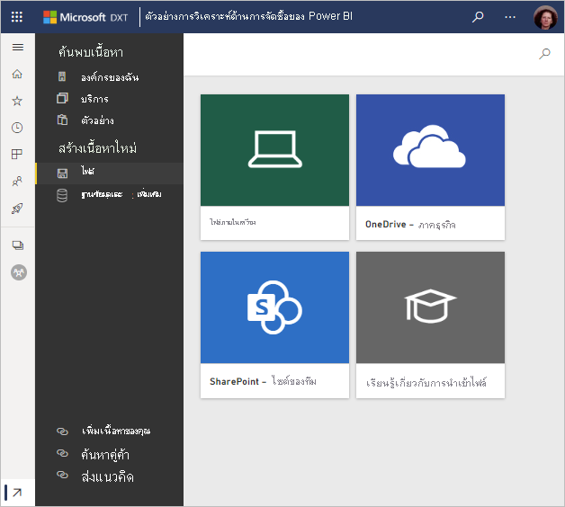

# รับตัวอย่างสำหรับ Power BIGet samples for Power BI
สมมุติว่าคุณยังใหม่กับ Power BI และต้องการทดลองใช้ แต่คุณไม่มีข้อมูลใด ๆSay you're new to Power BI and want to try it out but don't have any data.  หรือคุณอาจต้องการดูรายงานที่แสดงให้เห็นถึงบางความสามารถของ Power BIOr maybe you'd like to see reports that illustrate some of the capabilities of Power BI. เราเตรียมไว้ให้คุณแล้วWe've got you covered.

Power BI เสนอตัวอย่างหลากหลายประเภท เพื่อจุดประสงค์ที่แตกต่างกัน:Power BI offers different kinds of samples, for different purposes: 
- **[รายงาน Power BI](#sales--returns-sample-pbix-file) (ไฟล์ .pbix)** ที่คุณสามารถดูได้ในแกลเลอรีเรื่องราวข้อมูล เปิดและสำรวจใน Power BI Desktop หรืออัปโหลดไปยังบริการ Power BIA **[Power BI report](#sales--returns-sample-pbix-file) (.pbix file)** that you can view in the Data Stories Gallery, open and explore in Power BI Desktop, or upload to the Power BI service.
- **[แอปตัวอย่าง](#sample-app-from-appsource)** ที่คุณดาวน์โหลดจาก AppSource ยังเหมาะสมในบริการ Power BIA **[sample app](#sample-app-from-appsource)** that you download from AppSource, also right in the Power BI service. แอปรวมถึง แดชบอร์ด รายงาน และชุดข้อมูลApps include dashboards, reports, and datasets. คุณสามารถแก้ไขได้ จากนั้นแจกจ่ายให้กับเพื่อนร่วมงานของคุณYou can modify them, then distribute them to your colleagues.
- **[แปดตัวอย่างต้นฉบับที่มีอยู่ภายใน](#eight-original-samples)** ในบริการ Power BI เป็น *ชุดเนื้อหา* ที่ประกอบด้วยแดชบอร์ ดรายงาน และชุดข้อมูล**[Eight original built-in samples](#eight-original-samples)** in the Power BI service as *content packs*, with dashboards, reports, and datasets. คุณได้ติดตั้งไว้ในบริการ Power BIYou install them right in the Power BI service. ตัวอย่างที่มีอยู่ภายในจะพร้อมใช้งานในรูปแบบรายงาน Power BI (.pbix) และสมุดงาน Excel (.xlsx)The built-in samples are also available as Power BI reports (.pbix) and Excel workbooks (.xlsx).
- เวอร์ชัน **[สมุดงาน Excel](#download-sample-excel-files)** ของตัวอย่างที่มีอยู่ภายในประกอบด้วยรูปแบบข้อมูลและแผ่นงาน Power View**[Excel workbook](#download-sample-excel-files)** versions of the built-in samples, containing the data model and Power View sheets. คุณสามารถสำรวจหรือแก้ไขรูปแบบข้อมูลใน Excel ใช้สมุดงาน Excel เป็นแหล่งข้อมูลสำหรับรายงาน Power BIYou can explore or edit the data model in Excel, use the Excel workbook as a data source for a Power BI report. คุณยังสามารถอัปโหลดสมุดงานเป็นไฟล์ Excel และแสดงวิชวล Excel และ PivotTables ในรายงาน Power BI ได้You can also upload the workbook as an Excel file and display the Excel visuals and PivotTables in Power BI reports. 
- นอกจากนี้ยังมี **[เวิร์กบุ๊กตัวอย่างข้อมูลทางการเงิน](sample-financial-download.md)** เป็นตารางแฟล็ตอย่างง่ายในไฟล์ Excel ที่พร้อมใช้งานสำหรับการดาวน์โหลดAlso a **[Financial data sample workbook](sample-financial-download.md)**, a simple flat table in an Excel file available for download. ซึ่งประกอบด้วยข้อมูลนิรนามพร้อมผลิตภัณฑ์ที่สมมติขึ้น รวมถึงยอดขายแบ่งตามเซ็กเมนต์และประเทศ/ภูมิภาคIt contains anonymized data with fictitious products, with sales divided by segments and countries/regions. โดยจะทำให้เกิดแหล่งข้อมูลพื้นฐานที่มีประโยชน์สำหรับรายงาน Power BIIt makes a useful basic data source for a Power BI report.

เอกสารออนไลน์ของเรายังใช้ตัวอย่างเดียวกันนี้ในบทช่วยสอนและตัวอย่าง ดังนั้นคุณจึงสามารถทำตามได้Our online documentation uses these same samples in tutorials and examples, so you can follow along.

## ไฟล์ .pbix ตัวอย่างการขายและรับคืนSales & Returns sample .pbix file

:::image type="content" source="media/sample-datasets/sales-returns-sample-pbix.png" alt-text="ไฟล์ .pbix ตัวอย่างการขายและรับคืน":::

*รายงานตัวอย่างการขายและรับคืน**The Sales & Returns sample report*

ผู้ออกแบบ รายงาน Power BI คือ  Miguel Myers และ Chris Hamill ได้สร้างไฟล์ .pbix การขายและรับคืน เพื่อแสดงให้เห็นคุณลักษณะใหม่หลายรายการใน Power BI ประกอบด้วย ปุ่มต่างๆ การดูข้อมูลรายละเอียด การจัดรูปแบบตามเงื่อนไข what-if และคำแนะนำเครื่องมือที่กำหนดเองPower BI report designers Miguel Myers and Chris Hamill created the Sales & Returns .pbix file to demonstrate many new features in Power BI, including buttons, drill through, conditional formatting, what-if, and customized tooltips. 

สถานการณ์สำหรับรายงานนี้ คือ บริษัทที่จำหน่ายสเก็ตบอร์ดในธีม MicrosoftThe scenario for this report is a company that sells Microsoft-themed skateboards. พวกเขาต้องการดูสถานะของยอดขายและการรับคืน และวิเคราะห์วิธีการที่พวกเขาควรใช้ปรับเปลี่ยนการดำเนินการของพวกเขาThey want to see the state of their sales and returns, and analyze how they should modify their operations. 

คุณสามารถสำรวจได้โดยวิธีการเหล่านี้:You can explore it these ways:

- ดูและโต้ตอบกับใน [แกลเลอรีเรื่องราวข้อมูล](https://community.powerbi.com/t5/Data-Stories-Gallery/Sales-amp-Returns-Sample-Report/m-p/876607) ในชุมชน Power BIView and interact with it in the Power BI Community [Data Stories Gallery](https://community.powerbi.com/t5/Data-Stories-Gallery/Sales-amp-Returns-Sample-Report/m-p/876607).
- ดาวน์โหลดไฟล์ .pbix และสำรวจโดยละเอียดDownload the .pbix file and explore it in depth. ดู "เบื้องหลังม่าน" เพื่อดูว่า Miguel ทำอย่างไรLook "behind the curtain" to see how Miguel made it. การเลือกลิงก์นี้จะดาวน์โหลดไฟล์โดยอัตโนมัติ: [รายงานตัวอย่างการขายและรับคืน](https://go.microsoft.com/fwlink/?linkid=2113239)Selecting this link downloads the file automatically: [Sales & Returns sample report](https://go.microsoft.com/fwlink/?linkid=2113239).
- อ่านเกี่ยวกับรายงานในบล็อกโพสต์  Power BI [ชมการแนะนำรายงานตัวอย่างการขายและรับคืน](https://powerbi.microsoft.com/blog/take_a_tour_of_the_new_sales_returns_sample_report/)Read about the report in the Power BI blog post, [Take a tour of the new Sales & Returns sample report](https://powerbi.microsoft.com/blog/take_a_tour_of_the_new_sales_returns_sample_report/).

## แอปตัวอย่างจาก AppSourceSample app from AppSource

*แอป* การตลาดและการขาย มีพร้อมให้ใช้งานจาก Microsoft AppSourceThe Marketing and Sales *app* is available from Microsoft AppSource. แอปนี้เป็นประเภทเนื้อหา Power BI ที่รวมแดชบอร์ดและรายงานที่เกี่ยวข้องทั้งหมดไว้ในที่เดียวกันAn app is a Power BI content type that combines related dashboards and reports. แอปสามารถมีแดชบอร์ดอย่างน้อยหนึ่งรายการและรายงานอย่างน้อยหนึ่งรายงานทั้งหมดรวมเข้าด้วยกันAn app can have one or more dashboards and one or more reports, all bundled together. คุณสามารถดาวน์โหลดแอปการตลาดและการขายจาก **แอป**  ในบริการ Power BI หรือโดยไปที่ AppSource ในเบราว์เซอร์ของคุณYou can download the Marketing and Sales app from **Apps** in the Power BI service, or by going to AppSource in your browser.

- บทความ [ติดตั้งและใช้แอป](../consumer/end-user-app-view.md) อธิบายวิธีการดาวน์โหลดแอปจากภายในบริการ Power BIThe article [Install and use apps](../consumer/end-user-app-view.md) explains how to download an app from within the Power BI service.
- ลิงก์นี้จะนำคุณไปยัง [แอปการขายและการตลาด](https://appsource.microsoft.com/product/power-bi/microsoft-retail-analysis-sample.salesandmarketingsample?tab=Overview) ใน AppSourceThis link takes you to the [Sales & Marketing app](https://appsource.microsoft.com/product/power-bi/microsoft-retail-analysis-sample.salesandmarketingsample?tab=Overview) in AppSource.

หลังจากที่คุณติดตั้งแล้ว คุณจะเห็นแอปในคอลเลกชันของคุณAfter you install it, you see it in your collection of apps.

:::image type="content" source="media/sample-datasets/power-bi-sales-marketing-app.png" alt-text="ไทล์แอปการขายและการตลาด":::

เมื่อคุณเปิดใช้งาน เลือก **สำรวจด้วยข้อมูลตัวอย่าง**When you open it, select **Explore with sample data**. 

:::image type="content" source="media/sample-datasets/power-bi-explore-app.png" alt-text="สำรวจแอป":::

คุณจะเห็นมุมมองแอป ด้วยแดชบอร์ดและหน้ารายงานแต่ละรายการในบานหน้าต่างนำทางYou see the app view, with the dashboard and individual report pages in the navigation pane. 

:::image type="content" source="media/sample-datasets/power-bi-sales-marketing-app-navigation.png" alt-text="บานหน้าต่างนำทางแอป":::

เนื่องจากคุณได้ติดตั้งแล้ว คุณยังสามารถเปิด *พื้นที่ทำงาน* และแก้ไของค์ประกอบของแอปBecause you installed it, you can also open the *workspace* and edit the elements of the app. เลือกไอคอนดินสอ **แก้ไข** เพื่อเปิดพื้นที่ทำงานSelect the **Edit** pencil icon to open the workspace.

:::image type="content" source="media/sample-datasets/power-bi-app-edit-pencil.png" alt-text="แก้ไขแอป":::

ในตอนนี้คุณจะเห็นแดชบอร์ด รายงาน และชุดข้อมูลจากแอปในมุมมองรายการของพื้นที่ทำงานNow you see the dashboard, report, and dataset from the app in the list view of the workspace. ในพื้นที่ทำงานนี้ คุณสามารถแก้ไขแต่ละรายการได้Here in the workspace, you can edit each of them.

:::image type="content" source="media/sample-datasets/power-bi-sales-marketing-workspace.png" alt-text="พื้นที่ทำงานการขายและการตลาด":::

คุณสามารถกระจายแอปนี้กับทุกคนในองค์กรของคุณได้หากคุณต้องการIf you want to, you can distribute this app to anyone in your organization. เลือก **อัปเดตแอป**Select **Update app**.

:::image type="content" source="media/sample-datasets/power-bi-update-app.png" alt-text="อัปเดตปุ่มแอปฯ":::

ทำ **แท็บการตั้งค่า** ให้เสร็จสมบูรณ์ซึ่งรวมถึงการเลือก **สีธีมของ** แอปComplete the **Setup** tab, including choosing an **App theme color**. 

:::image type="content" source="media/sample-datasets/power-bi-app-setup.png" alt-text="เลือกการตั้งค่าแอป":::

เสร็จสิ้น **การนำทาง** และ **สิทธิ์** แท็บจากนั้นเลือก **Update app**Complete the **Navigation** and **Permission** tabs, then select **Update app**.

:::image type="content" source="media/sample-datasets/power-bi-select-update-app.png" alt-text="เลือกอัปเดตแอปเพื่อเผยแพร่":::

อ่านเพิ่มเติมเกี่ยวกับ [การเผยแพร่แอปใน Power BI](../collaborate-share/service-create-distribute-apps.md)Read more about [publishing apps in Power BI](../collaborate-share/service-create-distribute-apps.md).

## แปดตัวอย่างเดิมEight original samples
มีแปดตัวอย่างที่พร้อมให้คุณได้ใช้Eight original samples are available for you to use. แต่ละตัวอย่างแทนอุตสาหกรรมที่แตกต่างกันEach sample represents a different industry. คุณสามารถมีส่วนร่วมกับแต่ละรูปแบบที่แตกต่างกัน:You can engage with each in different formats:

- ติดตั้ง [ชุดเนื้อหาที่มีอยู่แล้วภายใน](#install-built-in-content-packs) ในบริการ Power BIInstall the [built-in content packs](#install-built-in-content-packs) in the Power BI service.
- ดาวน์โหลด [ไฟล์รายงาน Power BI](#download-original-sample-power-bi-files) (.pbix)Download the [Power BI report files](#download-original-sample-power-bi-files) (.pbix).
- ดาวน์โหลด [ไฟล์สมุดงาน Excel](#download-sample-excel-files) (.xlsx) จากนั้นอัปโหลดไปยังบริการ Power BIDownload the [Excel workbook files](#download-sample-excel-files) (.xlsx), then upload them to the Power BI service.
- สำรวจ [ไฟล์ Excel ใน Excel](#explore-excel-samples-inside-excel)Explore the [Excel files in Excel](#explore-excel-samples-inside-excel) itself.

บริษัท obviEnce ([www.obvience.com](http://www.obvience.com/)) และ Microsoft ร่วมมือกันเพื่อสร้างตัวอย่างต่างๆ เพื่อให้คุณสามารถใช้กับ Power BI ได้The company obviEnce ([www.obvience.com](http://www.obvience.com/)) and Microsoft teamed up to create samples for you to use with Power BI.  ข้อมูลถูกลบตัวตนออก และเป็นตัวอย่างจากอุตสาหกรรมที่แตกต่างกัน: การเงิน, HR, การขาย และอีกมากมายThe data is anonymized and represents different industries: finance, HR, sales, and more. 

แต่ละตัวอย่างเหล่านี้ มีให้ใช้งานในหลายรูปแบบ: เป็นชุดเนื้อหา เป็นเวิร์กบุ๊ก Excel และเป็นไฟล์ .pbix ใน Power BIEach of these samples is available in several formats: as a content pack, as an Excel workbook, and as a Power BI .pbix file. ถ้าคุณไม่ทราบว่าสิ่งเหล่านี้คืออะไร หรือไปรับมาได้อย่างไร - ไม่ต้องกังวลIf you don't know what these things are, or how to get your hands on them -- don't worry. บทความนี้จะอธิบายทั้งหมดThis article explains it all. สำหรับแต่ละตัวอย่างเหล่านี้ เราได้สร้าง *การแนะนำ* ไว้For each of these samples, we've created a *tour*. การแนะนำ คือ บทความที่บอกเรื่องราวเบื้องหลังตัวอย่าง และอธิบายให้คุณทราบเกี่ยวกับสถานการณ์ที่หลากหลายTours are articles that tell the story behind the sample and walk you through different scenarios. สถานการณ์หนึ่งอาจสามารถตอบคำถามสำหรับผู้จัดการของคุณ แต่อีกสถานการณ์อาจเป็นการมองหาข้อมูลเชิงลึกด้านความสามารถในการแข่งขัน หรือสร้างรายงานและแดชบอร์ดเพื่อแชร์ หรืออธิบายการเปลี่ยนแปลงทางธุรกิจOne scenario might be answering questions for your manager, another might be looking for competitive insights, or creating reports and dashboards to share, or explaining a business shift.

ก่อนที่เราจะเริ่มต้น นี่คือคำแนะนำด้านกฎหมายเกี่ยวกับการใช้งานตัวอย่างเหล่านี้Before we get started, here are the legal guidelines for using these samples. หลังจากนั้น เราจะแนะนำตัวอย่างและแสดงวิธีการใช้งานAfter that, we introduce the samples and show how to use them.

### แนวทางการใช้งานตัวอย่างเวิร์กบุ๊ก ExcelUsage guidelines for the sample Excel workbooks

&copy;2015 Microsoft Corporation&copy;2015 Microsoft Corporation. All rights reserved.All rights reserved. เอกสารและเวิร์กบุ๊กมีไว้ให้ “ตามที่เป็น”The documents and workbooks are provided "as-is." ข้อมูลและมุมมองที่แสดงอยู่ในเวิร์กบุ๊ก รวมถึง URL และเว็บไซต์อินเทอร์เน็ตอ้างอิงอื่น ๆ อาจเปลี่ยนแปลงโดยไม่ต้องแจ้งให้ทราบInformation and views expressed in the workbooks, including URL and other Internet Web site references, may change without notice. คุณรับผิดชอบความเสี่ยงเองจากการใช้งานYou bear the risk of using it. ตัวอย่างบางส่วนใช้สำหรับประกอบเท่านั้น และเป็นเรื่องสมมุติขึ้นSome examples are for illustration only and are fictitious. ไม่มีความสัมพันธ์ใด ๆ กับสิ่งที่มีอยู่จริง ไม่ว่าจะตั้งใจหรืออนุมานได้No real association is intended or inferred. ไมโครซอฟท์ไม่มีการรับประกันใด ๆ ไม่ว่าจะระบุโดยแจ้ง หรือโดยนัย แก่ข้อมูลที่ให้ไว้ที่นี่Microsoft makes no warranties, express or implied, with respect to the information provided here.

เวิร์กบุ๊กนี้ไม่ให้สิทธิ์ทางกฎหมายใด ๆ ในทรัพย์สินทางปัญญาในผลิตภัณฑ์ของ MicrosoftThe workbooks do not provide you with any legal rights to any intellectual property in any Microsoft product. คุณสามารถคัดลอก และใช้เวิร์กบุ๊กนี้สำหรับการอ้างอิงภายในของคุณYou may copy and use this workbook for your internal, reference purposes.

เวิร์กบุ๊กและข้อมูลที่เกี่ยวข้อง จัดหามาให้โดย obviEnceThe workbooks and related data are provided by obviEnce. [www.obvience.comwww.obvience.com](http://www.obvience.com)

ObviEnce คือ ISV และ Incubator ทรัพย์สินทางปัญญา (IP) ที่เน้นบน Microsoft Business IntelligenceObviEnce is an ISV and an Intellectual Property (IP) Incubator focused on Microsoft Business Intelligence. ObviEnce ทำงานใกล้ชิดกับ Microsoft เพื่อพัฒนาแนวทางปฏิบัติและความเป็นผู้นำทางความคิดที่ดีที่สุด สำหรับการเริ่มต้นและการปรับใช้โซลูชันของ Microsoft Business IntelligenceObviEnce works closely with Microsoft to develop best practices and thought leadership for jump-starting and deploying Microsoft Business Intelligence solutions.

เวิร์กบุ๊กและข้อมูลที่เป็นทรัพย์สินของ obviEnce, LLC และแชร์ให้ด้วยวัตถุประสงค์เพียงอย่างเดียว คือเพื่อแสดงขีดความสามารถของ Power BI ด้วยข้อมูลตัวอย่างทางอุตสาหกรรมThe workbooks and data are property of obviEnce, LLC, and have been shared solely for the purpose of demonstrating Power BI functionality with industry sample data.

การใช้งานใด ๆ ของเวิร์กบุ๊ก และ/หรือข้อมูล ต้องมีข้อความระบุแหล่งที่มาที่ปรากฏด้านบน (ซึ่งอยู่บนเวิร์กชีตข้อมูล ที่รวมอยู่ในแต่ละเวิร์กบุ๊กด้วย)Any uses of the workbooks and/or data must include the above attribution (that is also on the Info worksheet included with each workbook). เวิร์กบุ๊กและแสดงภาพใดๆ ต้องจะมาพร้อมกับข้อความลิขสิทธิ์ต่อไปนี้: obviEnce &copy;The workbook and any visualizations must be accompanied by the following copyright notice: obviEnce &copy;.

การคลิกที่ลิงก์ใดลิงก์หนึ่งต่อไปนี้เพื่อดาวน์โหลดไฟล์เวิร์กบุ๊ก Excel หรือไฟล์ .pbix แสดงว่าคุณได้ยอมรับข้อตกลงด้านบนBy clicking any of the following links to download the Excel workbook files or .pbix files, you are agreeing to the terms above.

### ตัวอย่างความสามารถในการทำกำไรสำหรับลูกค้าCustomer Profitability sample  
[ชมการแนะนำของตัวอย่างความสามารถในการทำกำไรลูกค้าTake a tour of the Customer Profitability sample](sample-customer-profitability.md)

ตัวอย่างอุตสาหกรรมนี้วิเคราะห์เมตริกหลัก ๆ ของ CFO สำหรับใช้กับผู้บริหาร ผลิตภัณฑ์ และลูกค้าของบริษัทThis industry sample analyzes a CFO's key metrics for the company's executives, products, and customers. คุณสามารถตรวจสอบปัจจัยที่ส่งผลกระทบต่อกำไรของบริษัทนี้ได้You can investigate what factors impact the company's profitability.

### ตัวอย่างทรัพยากรบุคคลHuman Resources sample 
[ชมการแนะนำของตัวอย่าง HRTake a tour of the HR sample](sample-human-resources.md)

ตัวอย่างอุตสาหกรรมนี้มุ่งเน้นกลยุทธ์การจ้างงานสำหรับบริษัทโดยการวิเคราะห์การจ้างงานใหม่ พนักงานที่ทำงานอยู่ และพนักงานที่ได้ออกไปแล้วThis industry sample focuses on the hiring strategy for a company by analyzing new hires, active employees, and employees who have left.  โดยการสำรวจข้อมูล คุณสามารถค้นหาแนวโน้มการออกจากงานโดยความสมัครใจ และความอคติในกลยุทธ์การจ้างงานBy exploring the data, you can find trends in voluntary separations and biases in the hiring strategy.

### ตัวอย่างการวิเคราะห์ค่าใช้จ่ายในด้านไอที...IT Spend Analysis sample 
[ชมการแนะนำของตัวอย่างการวิเคราะห์การใช้จ่ายด้าน ITTake a tour of the IT Spend Analysis sample](sample-it-spend.md)

ในตัวอย่างอุตสาหกรรมนี้ เราจะวิเคราะห์ต้นทุนที่วางแผนไว้เทียบกับต้นทุนจริงของแผนก IT ของบริษัทแห่งหนึ่งIn this industry sample, we analyze the planned vs. actual costs of the IT department of a company. การเปรียบเทียบนี้ช่วยให้เรา เข้าใจว่าบริษัทวางแผนไว้สำหรับปีได้ดีแค่ไหน และตรวจสอบด้านที่มีความแตกต่างอย่างมากจากแผนThis comparison helps us understand how well the company planned for the year and investigate areas with huge deviations from the plan. บริษัทในตัวอย่างนี้ ใช้การวางแผนรายปี จากนั้นก็มีการประเมินล่าสุด (Latest Estimation, LE) รายไตรมาส เพื่อช่วยวิเคราะห์การเปลี่ยนแปลงของรายจ่าย IT ตลอดช่วงปีงบประมาณThe company in this example goes through a yearly planning cycle, and then quarterly it produces a new Latest Estimate (LE) to help analyze changes in IT spend over the fiscal year.

### ตัวอย่างการวิเคราะห์โอกาสOpportunity Analysis sample 
[ชมการแนะนำของตัวอย่างการวิเคราะห์โอกาสทางการขายTake a tour of the Opportunity Analysis sample](sample-opportunity-analysis.md)

ตัวอย่างอุตสาหกรรมนี้สำรวจช่องทางการขายของบริษัทซอฟต์แวร์This industry sample explores a software company's sales channel. ผู้จัดการฝ่ายขายเฝ้าดูช่องทางการขาย ทั้งทางตรงและของคู่ค้า โดยการติดตามโอกาสทางการขายและรายได้ตามภูมิภาค ขนาดข้อเสนอ และช่องทางการขายSales managers monitor their direct and partner sales channels by tracking opportunities and revenue by region, deal size, and channel.

### ตัวอย่างการวิเคราะห์ด้านการจัดซื้อProcurement Analysis sample  
[ชมการแนะนำของตัวอย่างการวิเคราะห์การจัดซื้อTake a tour of the Procurement Analysis sample](sample-procurement.md)

ตัวอย่างอุตสาหกรรมนี้วิเคราะห์เมตริกหลัก ๆ ของ CFO สำหรับใช้กับผู้บริหาร ผลิตภัณฑ์ และลูกค้าของบริษัทThis industry sample analyzes a CFO's key metrics for the company's executives, products, and customers. คุณสามารถตรวจสอบปัจจัยที่ส่งผลกระทบต่อกำไรของบริษัทนี้ได้You can investigate what factors impact the company's profitability.

### ตัวอย่างการวิเคราะห์การค้าปลีกRetail Analysis sample  
[ชมการแนะนำของตัวอย่างการวิเคราะห์ด้านการขายปลีกTake a tour of the Retail Analysis sample](sample-retail-analysis.md)

ตัวอย่างอุตสาหกรรมนี้ วิเคราะห์ข้อมูลขายปลีกของสินค้าที่ขายในร้านค้าจำนวนมากและในหลายเขตThis industry sample analyzes retail sales data of items sold across multiple stores and districts. เมตริกเปรียบเทียบประสิทธิภาพในปีนี้เทียบกับปีที่แล้ว ในด้านต่าง ๆ เหล่านี้: ยอดขาย จำนวนหน่วยที่ขาย อัตรากำไรขั้นต้น และความแปรปรวน เช่นเดียวกับการวิเคราะห์สาขาใหม่The metrics compare this year's performance to last year's in these areas: sales, units, gross margin, and variance, as well as new store analysis.

### ตัวอย่างการขายและการตลาดSales and Marketing sample  
[ชมการแนะนำของตัวอย่างยอดขายและการตลาดTake a tour of the Sales and Marketing sample](sample-sales-and-marketing.md)

ตัวอย่างอุตสาหกรรมนี้วิเคราะห์บริษัทผลิตที่ชื่อ VanArsdel Ltd. ซึ่งอนุญาตให้ประธานฝ่ายการตลาด เฝ้าดูอุตสาหกรรมและส่วนแบ่งตลาดของ VanArsdelThis industry sample analyzes a manufacturing company, VanArsdel Ltd. It allows the Chief Marketing Officer to watch the industry and the market share for VanArsdel.  โดยการค้นคว้าตัวอย่าง คุณสามารถหาส่วนแบ่งตลาดของบริษัท ปริมาณการผลิต ยอดขาย และความคิดเห็นต่อผลิตภัณฑ์By exploring the sample, you can find the company's market share, product volume, sales, and sentiment.

### ตัวอย่างคุณภาพผู้จัดหาสินค้าSupplier Quality sample  
[ชมการแนะนำของตัวอย่างคุณภาพผู้จัดหาสินค้าTake a tour of the Supplier Quality sample](sample-supplier-quality.md)

ตัวอย่างอุตสาหกรรมนี้ มุ่งเน้นความท้าทายหนึ่งในห่วงโซ่อุปทานที่พบโดยทั่วไป — การวิเคราะห์คุณภาพของผู้จัดหาสินค้าThis industry sample focuses on one of the typical supply chain challenges — supplier quality analysis. การวิเคราะห์นี้ใช้เมตริกหลักสองอย่าง: ผลรวมจำนวนที่บกพร่องและผลรวมเวลาที่ไม่ได้ทำงานที่เกิดขึ้นจากข้อบกพร่องเหล่านี้Two primary metrics are at play in this analysis: total number of defects and the total downtime that these defects caused. ตัวอย่างนี้มีสองวัตถุประสงค์หลัก: ทำความเข้าใจว่าใครคือผู้จัดหาสินค้าที่ดีที่สุดและแย่ที่สุด และระบุโรงงานไหนค้นพบและปฏิเสธของที่บกพร่องได้ดีกว่า เพื่อลดระยะเวลาหยุดทำงานThis sample has two main objectives: understand who the best and worst suppliers are, with respect to quality, and identify which plants do a better job finding and rejecting defects, to minimize downtime.

### ติดตั้งชุดเนื้อหาที่มีอยู่แล้วภายในInstall built-in content packs

มาเริ่มต้นด้วย *ชุดเนื้อหา*Let's start with the *content packs*. ตัวอย่างที่มีอยู่ภายในมีให้พร้อมใช้งานในบริการ Power BI คุณไม่จำเป็นต้องออกจาก Power BI เพื่อค้นหาตัวอย่างเหล่านั้นThe built-in samples are available in the Power BI service; you don't have to leave Power BI to find them. ชุดเนื้อหา คือการนำแดชบอร์ด ชุดข้อมูล และรายงานที่มีคนสร้างไว้ หนึ่งหรือหลายรายการมารวมเข้าด้วยกัน และสามารถใช้กับบริการ Power BI ได้A content pack is a bundle of one or more dashboards, datasets, and reports that someone creates and that can be used with the Power BI service. แต่ละชุดเนื้อหาตัวอย่าง Power BI ประกอบด้วยชุดข้อมูล รายงาน และแดชบอร์ดEach Power BI sample content pack contains a dataset, report, and dashboard.  ชุดเนื้อหาจะยังคงพร้อมใช้งานแต่กำลังถูกยกเลิกการสนับสนุนContent packs are still available, but are being deprecated. ไม่สามารถใช้กับ Power BI Desktop ได้They aren't available for Power BI Desktop.

1. เปิดบริการ Power BI (app.powerbi.com) และลงชื่อเข้าใช้Open the Power BI service (app.powerbi.com) and sign in.
2. นำทางไปยังพื้นที่ทำงานของฉันหรือพื้นที่ทำงานอื่นที่คุณต้องการติดตั้งตัวอย่างNavigate to your My Workspace, or another workspace where you want to install the sample. 
2. ในมุมด้านล่างซ้าย เลือก **รับข้อมูล**In the bottom-left corner, select **Get data**.

    
3. บนหน้า **รับข้อมูล** ที่ปรากฏขึ้น เลือก ตัวอย่างOn the Get Data page that appears, select **Samples**.

   
4. เลือกหนึ่งในตัวอย่างเพื่อเปิดดูคำอธิบายของตัวอย่างนั้น และเลือก **เชื่อมต่อ**Select one of the samples to open a description of that sample, and choose **Connect**.  

   
5. Power BI นำเข้าชุดเนื้อหา และเพิ่มแดชบอร์ด รายงาน และชุดข้อมูลใหม่ไปยังพื้นที่ทำงานปัจจุบันของคุณPower BI imports the content pack and adds a new dashboard, report, and dataset to your current workspace. ใช้ตัวอย่างเหล่านี้ เพื่อนำ Power BI มาการทดสอบการใช้งานUse the samples to take Power BI for a test run.  

   

ตอนนี้คุณมีข้อมูลแล้ว คุณกำลังไปได้ดีNow that you have data, you're on your way.  ลองเข้าดูบทช่วยสอนของเราบางเรื่อง โดยใช้ชุดเนื้อหาตัวอย่าง หรือแค่ลองเปิดบริการ Power BI และสำรวจดูTry out some of our tutorials using the sample content packs or just open the Power BI service and explore.

### ดาวน์โหลดไฟล์ Power BI ตัวอย่างเดิมDownload original sample Power BI files
แต่ละชุดเนื้อหาตัวอย่าง มีให้ในรูปของไฟล์ .pbix ของ Power BI ด้วยEach of the sample content packs is also available as Power BI .pbix file. ไฟล์ .pbix ถูกออกแบบมาเพื่อใช้กับ Power BI DesktopThe .pbix files are designed to be used with Power BI Desktop.  

1. ดาวน์โหลดไฟล์ทีละไฟล์โดยใช้ลิงก์ด้านล่างDownload the files individually using the links below. การเลือกลิงก์เหล่านี้จะบันทึกไฟล์โดยอัตโนมัติไปยังโฟลเดอร์ดาวน์โหลดของคุณSelecting these links saves the file automatically to your Downloads folder. 

   - [ตัวอย่างความสามารถในการทำกำไรของลูกค้า PBIXCustomer Profitability Sample PBIX](https://download.microsoft.com/download/6/A/9/6A93FD6E-CBA5-40BD-B42E-4DCAE8CDD059/Customer%20Profitability%20Sample%20PBIX.pbix)
   - [ตัวอย่างทรัพยากรบุคคล PBIXHuman Resources Sample PBIX](https://download.microsoft.com/download/6/9/5/69503155-05A5-483E-829A-F7B5F3DD5D27/Human%20Resources%20Sample%20PBIX.pbix)
   - [ตัวอย่างการวิเคราะห์การจัดซื้อ PBIXProcurement Analysis Sample PBIX](https://download.microsoft.com/download/D/5/3/D5390069-F723-413B-8D27-5888500516EB/Procurement%20Analysis%20Sample%20PBIX.pbix)
   - [ตัวอย่างการวิเคราะห์ร้านค้าปลีก PBIXRetail Analysis Sample PBIX](https://download.microsoft.com/download/9/6/D/96DDC2FF-2568-491D-AAFA-AFDD6F763AE3/Retail%20Analysis%20Sample%20PBIX.pbix)
   - [ตัวอย่างยอดขายและการตลาด PBIXSales and Marketing Sample PBIX](https://download.microsoft.com/download/9/7/6/9767913A-29DB-40CF-8944-9AC2BC940C53/Sales%20and%20Marketing%20Sample%20PBIX.pbix)
   - [ตัวอย่างการวิเคราะห์คุณภาพผู้ขาย PBIXSupplier Quality Analysis Sample PBIX](https://download.microsoft.com/download/8/C/6/8C661638-C102-4C04-992E-9EA56A5D319B/Supplier-Quality-Analysis-Sample-PBIX.pbix)

1. ใน Power BI Desktop เลือก **ไฟล์ > เปิด** และไปยังตำแหน่งที่คุณบันทึกไฟล์ตัวอย่าง .pbixIn Power BI Desktop, select **File > Open** and navigate to the location where you saved the sample .pbix file.

4. เลือกไฟล์ .pbix เพื่อเปิดใน Power BI เดสก์ท็อปSelect the .pbix file to open it in Power BI Desktop.

### ดาวน์โหลดไฟล์ Excel ตัวอย่างDownload sample Excel files
แต่ละชุดเนื้อหาตัวอย่าง ยังมีให้ในรูปของเวิร์กบุ๊ก ExcelEach of the sample content packs is also available as an Excel workbook. เวิร์กบุ๊ก Excel ถูกออกแบบมาเพื่อใช้กับบริการ Power BIThe Excel workbooks are designed to be used with the Power BI service.  

1. ดาวน์โหลดไฟล์ทีละไฟล์โดยใช้ลิงก์ด้านล่าง หรือ[ดาวน์โหลดไฟล์ zip ที่มีไฟล์ตัวอย่างทั้งหมด](https://go.microsoft.com/fwlink/?LinkId=535020)Download the files individually using the links below, or [download a zip file of all the sample files](https://go.microsoft.com/fwlink/?LinkId=535020). ถ้าคุณเป็นผู้ใช้ขั้นสูง คุณอาจต้องการดาวน์โหลดเวิร์กบุ๊ก Excel เพื่อสำรวจ หรือแก้ไขรูปแบบข้อมูลIf you're an advanced user, you might want to download the Excel workbooks to explore or edit the data models.

   - [ตัวอย่างความสามารถในการทำกำไรลูกค้าCustomer Profitability Sample](https://go.microsoft.com/fwlink/?LinkId=529781)
   - [ตัวอย่างทรัพยากรบุคคลHuman Resources Sample](https://go.microsoft.com/fwlink/?LinkId=529780)
   - [ตัวอย่างการติดตามโอกาสทางการขายOpportunity Tracking Sample](https://go.microsoft.com/fwlink/?LinkId=529782)
   - [ตัวอย่างการวิเคราะห์การจัดซื้อProcurement Analysis Sample](https://go.microsoft.com/fwlink/?LinkId=529784)
   - [ตัวอย่างการวิเคราะห์ด้านการขายปลีกRetail Analysis Sample](https://go.microsoft.com/fwlink/?LinkId=529778)
   - [ตัวอย่างการขายและการตลาดSales and Marketing Sample](https://go.microsoft.com/fwlink/?LinkId=529785)
   - [ตัวอย่างการวิเคราะห์คุณภาพผู้จัดหาSupplier Quality Analysis Sample](https://go.microsoft.com/fwlink/?LinkId=529779)

2. บันทึกไฟล์ที่ดาวน์โหลดSave the downloaded file. ตำแหน่งที่คุณบันทึกไฟล์ มีผลแตกต่างกันWhere you save the file makes a difference.

      **ภายในเครื่อง** - ถ้าคุณบันทึกไฟล์ของคุณลงในไดรฟ์ภายในเครื่องบนคอมพิวเตอร์ของคุณ หรือตำแหน่งอื่นในองค์กรของคุณ จาก Power BI คุณสามารถนำเข้าไฟล์ของคุณลงใน Power BI ได้  **Local** - If you save your file to a local drive on your computer or another location in your organization, from Power BI, you can import your file into Power BI. ไฟล์ของคุณยังคงอยู่ในไดรฟ์ในเครื่องของคุณ ดังนั้นไฟล์ทั้งหมดจะไม่ถูกนำเข้าไปยัง Power BIYour file remains on your local drive, so the whole file isn't imported into Power BI. สิ่งที่เกิดขึ้นคือชุดข้อมูลใหม่ถูกสร้างขึ้นในไซต์ Power BI และโหลดข้อมูลลงในชุดข้อมูลนั้น บางกรณีเป็นรูปแบบข้อมูลWhat happens is a new dataset is created in your Power BI site and data, and in some cases the data model, are loaded into the dataset. ถ้าไฟล์ของคุณมีรายงานใด ๆ รายงานเหล่านั้นจะปรากฏในไซต์ Power BI ของคุณภายใต้รายงานIf your file has any reports, those reports appear in your Power BI site under Reports.
    
    **OneDrive - ธุรกิจ**– ถ้าคุณมี OneDrive for Business และคุณลงชื่อเข้าใช้ด้วยบัญชีเดียวกันกับที่ลงชื่อเข้าใช้ Power BI OneDrive for Business เป็นวิธีที่มีประสิทธิภาพที่สุดที่จะทำให้งานของคุณใน Excel, Power BI หรือไฟล์ .CSV มีข้อมูลให้ตรงกันกับชุดข้อมูล รายงาน และแดชบอร์ดใน Power BI **OneDrive - Business** – If you have OneDrive for Business and you sign into it with the same account you sign into Power BI with, OneDrive for Business is by far the best place to keep your work in Excel, Power BI, or a .CSV file in-sync with your dataset, reports, and dashboards in Power BI. เนื่องจากทั้ง Power BI และ OneDrive อยู่ในระบบคลาวด์ Power BI จะเชื่อมต่อกับไฟล์ของคุณบน OneDrive ประมาณทุกชั่วโมงBecause both Power BI and OneDrive are in the cloud, Power BI connects to your file on OneDrive about every hour. ถ้าพบการเปลี่ยนแปลงใด ๆ ก็ตาม Power BI จะอัปเดต ชุดข้อมูล รายงาน และแดชบอร์โดยอัตโนมัติIf any changes are found, your dataset, reports, and dashboards are automatically updated in Power BI.
    
    **SharePoint Team - ไซต์** การบันทึกไฟล์ Power BI ของคุณไปยัง SharePoint - ของไซต์ของทีม จะเหมือนกันการบันทึกไปยัง OneDrive for Business มาก **SharePoint Team-Sites**    Saving your Power BI files to SharePoint – Team Sites is much the same as saving to OneDrive for Business. ความแตกต่างที่สำคัญที่สุดคือ วิธีที่คุณเชื่อมต่อไปยังไฟล์จาก Power BIThe biggest difference is how you connect to the file from Power BI. คุณสามารถระบุ URL หรือเชื่อมต่อไปยังโฟลเดอร์รากฐานได้You can specify a URL or connect to the root folder.
1. เปิดบริการ Power BI (app.powerbi.com) และลงชื่อเข้าใช้Open the Power BI service (app.powerbi.com) and sign in.

1. นำทางไปยังพื้นที่ทำงานของฉันหรือไปยังพื้นที่ทำงานอื่น หรือสร้างพื้นที่ทำงานสำหรับตัวอย่างโดยฉพาะNavigate to your My Workspace or to another workspace, or create a workspace just for the sample.

4. ที่มุมล่างซ้ายของบานหน้าต่างนำทาง เลือก **รับข้อมูล**In the bottom-left corner of the navigation pane, select **Get data**.

    
5. บนหน้า **รับข้อมูล** ที่ปรากฏขึ้น เลือก **ไฟล์ > รับ**On the **Get Data** page that appears, select **Files > Get**.

    
6. เลือกตำแหน่งที่คุณได้ดาวน์โหลด และบันทึกตัวอย่างSelect the location where you downloaded and saved the sample.

    
7. เลือกไฟล์Select the file. ขึ้นอยู่กับตำแหน่งที่คุณบันทึกไฟล์ ให้เลือก **เชื่อมต่อ** หรือ **เปิด**Depending on where you saved the file, select **Connect** or **Open**.

8. เลือกว่า จะนำเข้าข้อมูล หรือจะนำเวิร์กบุ๊กไปยัง Power BI และดูว่ามันเหมือนกับที่อยู่ใน Excel online หรือไม่Choose whether to import the data or to bring the workbook into Power BI and see it exactly as it is in Excel online.

    
9. ถ้าคุณเลือก **นำเข้า** Power BI จะนำเข้าเวิร์กบุ๊กตัวอย่าง และเพิ่มเป็นแดชบอร์ด รายงาน และชุดข้อมูลใหม่ ซึ่งในกรณีนี้ แต่ละรายการจะมีชื่อว่า **ตัวอย่างการวิเคราะห์การจัดซื้อ**If you select **Import**, Power BI imports the sample workbook and adds it as a new dashboard, report, and dataset, in this case each named **Procurement Analysis Sample**.

    - เนื่องจากเวิร์กบุ๊กมีแผ่นงาน Power View อยู่ Power BI จะสร้างรายงานที่มีหน้าสำหรับแต่ละแผ่นงาน Power BIBecause the workbook has Power View sheets, Power BI creates a report with a page for each Power BI sheet. 
    - Power BI สร้างแดชบอร์ดใหม่ด้วยไทล์เปล่าใหม่Power BI creates a new dashboard with a new blank tile.  การเลือกไทล์นั้นจะนำคุณไปยังรายงานที่คุณเพิ่งเพิ่มSelecting that tile takes you to the report you just added.

10. เปิดรายงานOpen the report. เลือกองค์ประกอบที่แตกต่างกันของรายงานเพื่อสำรวจการโต้ตอบของพวกเขาSelect different elements of the report to explore their interactions. 

    

### สำรวจตัวอย่าง Excel ภายใน ExcelExplore Excel samples inside Excel

(ไม่บังคับ) ต้องการทำความเข้าใจว่าข้อมูลในเวิร์กบุ๊ก Excel ถูกแปลงเป็นชุดข้อมูลและรายงาน Power BI ได้อย่างไร ใช่หรือไม่?(Optional) Want to understand how the data in an Excel workbook gets converted to Power BI datasets and reports? เปิดตัวอย่าง Excel *ใน Excel* และสำรวจแผ่นงานซึ่งให้คำตอบบางคำตอบOpening the Excel samples *in Excel* and exploring the worksheets provides some of the answers.

- เมื่อคุณเริ่มเปิดเวิร์กบุ๊กตัวอย่างใน Excel คุณอาจเห็นข้อความเตือนสองข้อความWhen you first open a sample workbook in Excel, you may see two warnings. คำเตือนแรกบอกว่าเวิร์กบุ๊กอยู่ในมุมมองที่ได้รับการป้องกันThe first warning says the workbook is in Protected View. เลือก **เปิดใช้งานการแก้ไข**Select **Enable Editing**. คำเตือนที่สองบอกว่าเวิร์กบุ๊กมีการเชื่อมต่อข้อมูลภายนอกThe second warning may say that the workbook has external data connections. เลือก **เปิดใช้งานเนื้อหา**Select **Enable Content**.
- แต่ละเวิร์กบุ๊กประกอบด้วย Power View หลายแผ่นEach workbook contains several Power View sheets. ถ้าคุณต้องการดูแผ่นงาน Power View ใน Excel คุณจำเป็นต้อง[เปิดใช้งาน add-in ของ Power View ](https://support.office.com/article/flash-silverlight-and-shockwave-controls-blocked-in-microsoft-office-55738f12-a01d-420e-a533-7cef1ff6aeb1)โดยการดาวน์โหลดแพคเกจของรีจิสทรีคีย์If you want to see the Power View sheets in Excel, You need to [enable the Power View add-in](https://support.office.com/article/flash-silverlight-and-shockwave-controls-blocked-in-microsoft-office-55738f12-a01d-420e-a533-7cef1ff6aeb1) by downloading a package of registry keys.
- ดังนั้น ข้อมูลจริง ๆ อยู่ตรงไหน?So where's the actual data? มันอยู่ในรูปแบบข้อมูล Power PivotIt's in the Power Pivot data model. คุณไม่จำเป็นต้องใช้แผ่นงาน Power View เพื่อดูข้อมูลYou don't need the Power View sheets to see the data. บนแท็บ **PowerPivot** เลือก **จัดการ**On the **PowerPivot** tab, select **Manage**.

    ไม่เห็นแท็บ **PowerPivot** ใช่หรือไม่Don't see the **Power Pivot** tab? [เปิดใช้งาน Power Pivot add-in](https://support.office.com/article/Start-Power-Pivot-in-Microsoft-Excel-2013-add-in-A891A66D-36E3-43FC-81E8-FC4798F39EA8)[Enable the Power Pivot add-in](https://support.office.com/article/Start-Power-Pivot-in-Microsoft-Excel-2013-add-in-A891A66D-36E3-43FC-81E8-FC4798F39EA8).

    ใน Power Pivot คุณสามารถดูข้อมูลในตารางพื้นฐานทั้งหมด รวมถึงสูตร DAX ทั้งหมดIn Power Pivot, you can see the data in all the underlying tables, plus all the DAX formulas. 

- แท็บข้อมูลมีข้อมูลเกี่ยวกับ obviEnce บริษัทที่สร้างตัวอย่างขึ้นมาThe Info tab provides information about obviEnce, the company that created the sample.

## ขั้นตอนถัดไปNext steps
[แนวคิดพื้นฐานสำหรับนักออกแบบในบริการ Power BIBasic concepts for designers in the Power BI service](../fundamentals/service-basic-concepts.md)

[บทช่วยสอน: เชื่อมต่อกับตัวอย่างของ Power BITutorial: Connect to the Power BI samples](sample-tutorial-connect-to-the-samples.md)

[แหล่งข้อมูลสำหรับ Power BIData sources for Power BI](../connect-data/service-get-data.md)

มีคำถามเพิ่มเติมหรือไม่More questions? [ลองไปที่ชุมชน Power BITry the Power BI Community](https://community.powerbi.com/)
