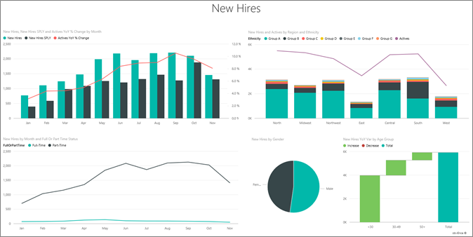
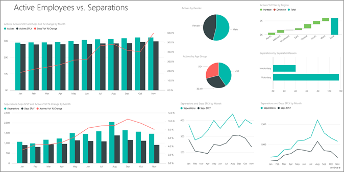

# ตัวอย่างทรัพยากรบุคคลสำหรับ Power BI: ชมการแนะนำHuman Resources sample for Power BI: Take a tour

ชุดเนื้อหาตัวอย่างทรัพยากรบุคคลประกอบด้วยแดชบอร์ด รายงาน และชุดข้อมูลสำหรับแผนกทรัพยากรบุคคลThe Human Resources sample content pack contains a dashboard, report, and dataset for a human resources department. ในตัวอย่างนี้ แผนกทรัพยากรบุคคลมีรูปแบบการรายงานเดียวกันในทุกๆ บริษัท แม้ว่าจะอยู่ในอุตสาหกรรมต่างกันหรือมีขนาดต่างกันก็ตามIn this sample, the human resources department has the same reporting model across different companies, even when they differ by industry or size. ตัวอย่างนี้มีพนักงานใหม่ พนักงานที่ปฏิบัติงานอยู่ และพนักงานที่ลาออกไปแล้วThis sample looks at new hires, active employees, and employees who have left. ซึ่งมุ่งมั่นเสมอเพื่อเปิดเผยแนวโน้มในกลยุทธ์การจ้างงานIt strives to uncover any trends in the hiring strategy. วัตถุประสงค์หลักของเราคือ ทำความเข้าใจเกี่ยวกับ:Our main objectives are to understand:

* เราจ้างใครWho we hire
* อคติในกลยุทธ์การจ้างงานของเราBiases in our hiring strategy
* แนวโน้มการลาออกตามความสมัครใจTrends in voluntary separations

ตัวอย่างนี้เป็นส่วนหนึ่งของชุดตัวอย่าง ที่แสดงให้เห็นวิธีการที่คุณสามารถใช้ Power BI กับข้อมูล รายงาน และแดชบอร์ดที่เกี่ยวข้องกับธุรกิจThis sample is part of a series that shows how you can use Power BI with business-oriented data, reports, and dashboards. ซึ่งสร้างขึ้นโดย [obviEnce](http://www.obvience.com/) ด้วยข้อมูลจริงที่ไม่มีการระบุชื่อIt was created by [obviEnce](http://www.obvience.com/) with real data, which has been anonymized. ข้อมูลมีให้ใช้งานหลายรูปแบบ: ชุดเนื้อหา ไฟล์ Power BI Desktop .pbix หรือเวิร์กบุ๊ก ExcelThe data is available in several formats: content pack, .pbix Power BI Desktop file, or Excel workbook. ดู [ตัวอย่างสำหรับ Power BI](sample-datasets.md)See [Samples for Power BI](sample-datasets.md). 

บทช่วยสอนนี้จะสำรวจชุดเนื้อหาของตัวอย่างทรัพยากรบุคคลในบริการของ Power BIThis tutorial explores the Human Resources sample content pack in the Power BI service. เนื่องจากประสบการณ์การใช้รายงานจะคล้ายคลึงกันใน Power BI Desktop ดังนั้นคุณสามารถใช้ Power BI Desktop กับไฟล์ .pbix ตัวอย่างใน Power BI Desktop ได้Because the report experience is similar in Power BI Desktop and in the service, you can also follow along by using the sample .pbix file in Power BI Desktop. 

คุณไม่จำเป็นต้องมีสิทธิการใช้งาน Power BI ในการสำรวจตัวอย่างใน Power BI DesktopYou don't need a Power BI license to explore the samples in Power BI Desktop. ถ้าคุณไม่มีสิทธิการใช้งาน Power BI Pro คุณสามารถบันทึกตัวอย่างไปยังพื้นที่ทำงานของฉันในบริการของ Power BI ได้If you don't have a Power BI Pro license, you can save the sample to your My Workspace in the Power BI service. 

## รับตัวอย่างGet the sample

ก่อนที่คุณสามารถใช้ตัวอย่าง คุณต้องดาวน์โหลดในรูปแบบ[ชุดเนื้อหา](#get-the-content-pack-for-this-sample)[ไฟล์ .pbix](#get-the-pbix-file-for-this-sample) หรือ[เวิร์กบุ๊ก Excel](#get-the-excel-workbook-for-this-sample)Before you can use the sample, you must first download it as a [content pack](#get-the-content-pack-for-this-sample), [.pbix file](#get-the-pbix-file-for-this-sample), or [Excel workbook](#get-the-excel-workbook-for-this-sample).

### รับชุดเนื้อหาสำหรับตัวอย่างนี้Get the content pack for this sample

1. เปิดบริการ Power BI (app.powerbi.com) ลงชื่อเข้าใช้ และเปิดพื้นที่ทำงานที่คุณต้องการบันทึกตัวอย่างOpen the Power BI service (app.powerbi.com), sign in, and open the workspace where you want to save the sample.

   ถ้าคุณไม่มีสิทธิการใช้งาน Power BI Pro คุณสามารถบันทึกตัวอย่างไปยังพื้นที่ทำงานของฉันIf you don't have a Power BI Pro license, you can save the sample to your My Workspace.

2. ที่มุมด้านล่างซ้าย เลือก **รับข้อมูล**In the bottom-left corner, select **Get Data**.
   
   
3. บนหน้า **รับข้อมูล** ที่ปรากฏขึ้น เลือก **ตัวอย่าง**On the **Get Data** page that appears, select **Samples**.
   
4. เลือก **ตัวอย่างทรัพยากรบุคคล** แล้วเลือก **เชื่อมต่อ**Select **Human Resources Sample**, then choose **Connect**.  
   
   

5. Power BI นำเข้าชุดเนื้อหา จากนั้นเพิ่มแดชบอร์ด รายงาน และชุดข้อมูลใหม่ไปยังพื้นที่ทำงานปัจจุบันของคุณPower BI imports the content pack and then adds a new dashboard, report, and dataset to your current workspace.
   
   
  
### รับไฟล์ .pbix สำหรับตัวอย่างนี้Get the .pbix file for this sample

อีกทางเลือกหนึ่งคือ คุณสามารถดาวน์โหลดตัวอย่างแผนกทรัพยากรบุคคลเป็ น[ไฟล์ .pbix](https://download.microsoft.com/download/6/9/5/69503155-05A5-483E-829A-F7B5F3DD5D27/Human%20Resources%20Sample%20PBIX.pbix) ซึ่งถูกออกแบบมาสำหรับใช้กับ Power BI DesktopAlternatively, you can download the Human Resources sample as a [.pbix file](https://download.microsoft.com/download/6/9/5/69503155-05A5-483E-829A-F7B5F3DD5D27/Human%20Resources%20Sample%20PBIX.pbix), which is designed for use with Power BI Desktop.

### รับเวิร์กบุ๊ก Excel สำหรับตัวอย่างนี้Get the Excel workbook for this sample

ถ้าคุณต้องการดูแหล่งข้อมูลสำหรับตัวอย่างนี้ ตัวอย่างนี้ยังมีให้ในรูปแบบ[เวิร์กบุ๊ก Excel](https://go.microsoft.com/fwlink/?LinkId=529780)If you want to view the data source for this sample, it's also available as an [Excel workbook](https://go.microsoft.com/fwlink/?LinkId=529780). เวิร์กบุ๊กประกอบด้วยแผ่นงาน Power View ที่คุณสามารถดู และปรับเปลี่ยนThe workbook contains Power View sheets that you can view and modify. หากต้องการดูข้อมูลดิบ ให้เปิดใช้งาน add-in การวิเคราะห์ข้อมูล แล้วจากนั้นเลือก **Power Pivot > จัดการ**To see the raw data, enable the Data Analysis add-ins, and then select **Power Pivot > Manage**. หากต้องการเปิดใช้งาน Power View และ Power Pivot add-in โปรดดู [สำรวจตัวอย่าง Excel ใน Excel ](sample-datasets.md#explore-excel-samples-inside-excel)สำหรับรายละเอียดTo enable the Power View and Power Pivot add-ins, see [Explore the Excel samples in Excel](sample-datasets.md#explore-excel-samples-inside-excel) for details.

## การจ้างใหม่New hires
เรามาสำรวจพนักงานจ้างใหม่กันก่อนLet's explore new hires first.

1. ในพื้นที่ทำงานของคุณ เลือกแท็บ **แดชบอร์ด** และเปิดแดชบอร์ด **ตัวอย่างทรัพยากรบุคคล**In your workspace, select the **Dashboards** tab, and open the **Human Resources Sample** dashboard.
2. บนแดชบอร์ด เลือกไทล์ **จำนวนการจ้างใหม่, การจ้างใหม่ช่วงเวลาเดียวกันปีที่แล้ว, % การเปลี่ยนแปลง YoY พนักงานที่ทำงาน** ตามเดือนOn the dashboard, select the **New Hire Count, New Hires Same Period Last Year, Actives YoY % Change By Month** tile.  

     

   รายงาน ตัวอย่างทรัพยากรบุคคล จะเปิดไปยังหน้า **การจ้างใหม่**The Human Resources Sample report opens to the **New Hires** page.  

   

3. ดูรายการที่สนใจเหล่านี้:Look at these items of interest:

    * แผนภูมิผสม **จำนวนการจ้างใหม่, การจ้างใหม่ช่วงเวลาเดียวกันปีที่แล้ว, % การเปลี่ยนแปลง YoY พนักงานที่ทำงาน ตามเดือน** แสดงให้เห็นว่าเราจ้างคนจำนวนมากกว่าปีที่แล้วทุกเดือนThe **New Hire Count, New Hires SPLY and Actives YoY % Change by Month** combo chart shows we hired more people every month this year compared to last year. บางเดือนจะมีผู้คนจำนวนมากSignificantly more people in some months.
    * ในแผนภูมิผสม **จำนวนการจ้างใหม่ และพนักงานที่ทำงานอยู่ แบ่งตามภูมิภาคและเชื้อชาติ** เราเห็นว่าเรากำลังจ้างพนักงานในภูมิภาค **ตะวันออก** น้อยลงIn the combo chart **New Hire Count and Active Employee Count by Region and Ethnicity**, notice we're hiring fewer people in the **East** region.
    * แผนภูมิแบบน้ำตก **ความแปรปรวนของจ้างใหม่ YoY แบ่งตามกลุ่มอายุ** แสดงให้เห็นว่าเรากำลังจ้างคนที่มีอายุน้อยเป็นหลักThe **New Hires YoY Var by Age Group** waterfall chart shows we're hiring mainly younger people. แนวโน้มนี้อาจมาจากลักษณะงานที่ไม่เต็มเวลาเสียส่วนใหญ่This trend may be due to the mostly part-time nature of the jobs.
    * แผนภูมิวงกลม **จำนวนการจ้างใหม่แบ่งตามเพศ** แสดงระดับใกล้เคียงกันแบบผิวเผินThe **New Hire Count by Gender** pie chart shows a roughly even split.

    คุณสามารถค้นหาข้อมูลเชิงลึกเพิ่มเติมหรือไม่?Can you find more insights? เช่น ภูมิภาคที่การจ้างงานแต่ละเพศมีความแตกต่างกันมากFor example, a region where the gender split is not even. 

4. เลือกกลุ่มอายุและเพศที่แตกต่างกันในแผนภูมิ เพื่อสำรวจความสัมพันธ์ระหว่างอายุ เพศ ภูมิภาค และกลุ่มเชื้อชาติSelect different age groups and genders in the charts to explore the relationships between age, gender, region, and ethnicity group.

5. เลือก **ตัวอย่างทรัพยากรบุคคล** จากบานหน้าต่างนำทางด้านบนเพื่อกลับไปยังแดชบอร์ดSelect **Human Resource Sample** from the top nav pane to return to the dashboard.

   

## เปรียบเทียบพนักงานปัจจุบันกับอดีตพนักงานCompare currently active and former employees
ลองสำรวจข้อมูลพนักงานปัจจุบันและพนักงานที่ไม่ได้ทำงานในบริษัทแล้วLet's explore data for currently active employees and employees who no longer work for the company.

1. บนแดชบอร์ด เลือกไทล์ **จำนวนพนักงานที่ทำงานอยู่ตามกลุ่มอายุ**On the dashboard, select the **Active Employee Count by Age Group** tile.

   

   รายงาน ตัวอย่างทรัพยากรบุคคล จะเปิดไปยังหน้า **พนักงานปัจจุบัน เทียบกับ พนักงานที่ออกจากงาน**The Human Resources Sample report opens to the **Active Employees vs. Separations** page.  

   

 2. ดูรายการที่สนใจเหล่านี้:Look at these items of interest:

    * แผนภูมิผสมสองอันทางด้านซ้ายแสดงการเปลี่ยนแปลงปีต่อปี สำหรับการแยกพนักงานที่ทำงานอยู่และที่ลาออกไปแล้วThe two combo charts on the left show the year-over-year change for active employees and employee separations. เรามีพนักงานที่ทำงานอยู่ในปีนี้มากขึ้น เพราะมีการจ้างเพิ่มขึ้น แต่การออกจากงานก็มีมากกว่าปีที่แล้วด้วยWe have more active employees this year due to rapid hiring, but also more separations than last year.
    * ในเดือนสิงหาคม เรามีพนักงานออกไปมากเทียบกับเดือนอื่นๆIn August, we had more separations compared to other months. ลองเลือกกลุ่มอายุ เพศ หรือภูมิภาค ที่ต่างกันดู เพื่อดูว่าคุณสามารถหาค่าที่ผิดปกติได้หรือไม่Select the different age groups, genders, or regions to see if you can find any outliers.
    * ดูที่แผนภูมิวงกลม เราสังเกตการลาออกของพนักงานของเราตามเพศและกลุ่มอายุมีค่าพอ ๆ กันLooking at the pie charts, we notice we have an even split in our active employees by gender and age groups. ลองเลือกกลุ่มอายุอื่นดู ดูว่าสัดส่วนของเพศที่กลุ่มอายุต่างๆ เป็นอย่างไรSelect different age groups to see how the gender split differs by age. สัดส่วนของเพศมีค่าใกล้เคียงกันในทุกกลุ่มอายุหรือไม่?Do we have an even split by gender in every age group?

## เหตุผลของการออกจากงานReasons for separation
มาดูที่รายงาน ในมุมมองการแก้ไขกันLet's look at the report in Editing View. คุณสามารถเปลี่ยนแผนภูมิวงกลมเพื่อให้แสดงข้อมูลแบบแยกของพนักงานลาออกแล้วแทนข้อมูลพนักงานปัจจุบันYou can change the pie charts to show employee separations data instead of active employee data.

1. เลือก **แก้ไขรายงาน** ตรงมุมบนซ้ายSelect **Edit report** in the upper-left corner.

2. เลือกแผนภูมิวงกลม **จำนวนพนักงานที่ทำงานอยู่ตามกลุ่มอายุ**Select the **Active Employee Count by Age Group** pie chart.

3. ใน **เขตข้อมูล** **พนักงาน** เพื่อขยายตาราง **พนักงาน**In **Fields**, select **Employees** to expand the **Employees** table. ยกเลิก **จำนวนพนักงานที่ทำงานอยู่** เพื่อเอาเขตข้อมูลนั้นออกClear **Active Employee Count** to remove that field.

4. เลือก **จำนวนการลาออก** ในตาราง **พนักงาน** เพื่อเพิ่มไปยังกล่อง **ค่า** ในบริเวณ **เขตข้อมูล**Select **Separation Count** in the **Employees** table to add it to the **Values** box in the **Fields** area.

5. บนพื้นที่รายงาน เลือกแท่ง **ความสมัครใจ** ในแผนภูมิแท่ง **จำนวนการออกจากงานแยกตามเหตุผลการออกจากงาน**On the report canvas, select the **Voluntary** bar in the **Separation Count by Separation Reason** bar chart. 

   แถบนี้จะไฮไลต์พนักงานที่ออกจากงานโดยสมัครใจในภาพอื่นๆ ในรายงานThis bar highlights those employees who left voluntarily in the other visuals in the report.

6. เลือกกลุ่มอายุ 50+ ของ แผนภูมิวงกลม **จำนวนการออกจากงานตามกลุ่มอายุ**Select the 50+ slice of the **Separation Count by Age Group** pie chart.

7. ดูที่แผนภูมิเส้นที่มุมล่างขวาLook at the line chart in the lower-right corner. แผนภูมินี้จะถูกกรองให้แสดงเฉพาะการออกจากงานตามความสมัครใจThis chart is filtered to show voluntary separations.  

   

   สังเกตเห็นแนวโน้มในกลุ่มอายุ 50+ ได้หรือไม่?Notice the trend in the 50+ age group. ในช่วงหลังของปี มีพนักงานอายุเกิน 50 ออกจากงานโดยสมัครใจมากขึ้นDuring the latter part of the year, more employees over age 50 left voluntarily. แนวโน้มนี้เป็นแง่มุมที่ควรนำไปตรวจสอบต่อโดยใช้ข้อมูลเพิ่มเติมThis trend is an area to investigate further with more data.

8. คุณยังสามารถทำตามขั้นตอนเดียวกัน กับแผนภูมิ **จำนวนพนักงานที่ทำงานอยู่แยกตามเพศ** แต่เปลี่ยนเป็นการออกจากงานแทนที่จะเป็นพนักงานที่ยังทำงานอยู่You can also follow the same steps for the **Active Employee Count by Gender** pie chart, changing it to separations instead of active employees. ดูข้อมูลการออกจากงานโดยสมัครใจ แยกตามเพศว่าคุณเห็นอะไรมากขึ้นบ้างLook at the voluntary separation data by gender to see if you find any other insights.

9. เลือก **ตัวอย่างทรัพยากรบุคคล** จากบานหน้าต่างนำทางด้านบนเพื่อกลับไปยังแดชบอร์ดSelect **Human Resource Sample** from the top nav pane to return to the dashboard. คุณสามารถเลือกที่จะบันทึกการเปลี่ยนแปลงคุณที่ทำกับรายงานYou can choose to save the changes you've made to the report.

## การจ้างที่ไม่ดีBad hires
ด้านสุดท้ายที่จะสำรวจคือการจ้างงานที่ไม่ดีThe last area to explore is bad hires. เรานิยามการจ้างงานที่ไม่ดี ว่าเป็นพนักงานที่อยู่กับเราได้ไม่เกิน 60 วันแล้วก็ออกไปBad hires are defined as employees who didn't last for more than 60 days. เรากำลังจ้างงานอย่างต่อเนื่อง แต่เรากำลังจ้างคนที่เหมาะสมอยู่หรือไม่?We're hiring rapidly, but are we hiring good candidates?

1. เลือกไทล์แดชบอร์ด **% การจ้างงานที่ไม่ดีเทียบกับพนักงานที่ทำ แยกตามกลุ่มอายุ**Select the **Bad Hires as % of Actives by Age Group** dashboard tile. รายงานเปิดแท็บที่สาม **การจ้างที่ไม่ดี**The report opens to tab three, **Bad Hires**.

     
2. เลือก **ตะวันตกเฉียงเหนือ** ในตัวแบ่ง **ภูมิภาค** ที่ด้านซ้ายและเลือก **ผู้ชาย** ในแผนภูมิโดนัทของ **จำนวนการจ้างที่ไม่ดี**Select **Northwest** in the **Region** slicer on the left and select **Male** in the **Bad Hire Count by Gender** donut chart. ดูที่แผนภูมิอื่นๆ บนหน้า **การจ้างที่ไม่ดี**Look at the other charts on the **Bad Hires** page. สังเกตได้ว่าการจ้างงานที่ไม่ดีเป็นเพศชายมากกว่าเพศหญิง และมีการจ้างงานที่ไม่ดีในกลุ่ม A จำนวนมากNotice there are more male bad hires than females and many Group A bad hires.

     

3. หากคุณดูแผนภูมิโดนัท **จำนวนการจ้างที่ไม่ดีที่แบ่งตามเพศ** และเลือกกภูมิภาคที่ต่างกันในตัวแบ่ง **ภูมิภาค** คุณจะสังเกตได้ว่าภูมิภาคตะวันออกเป็นภูมิภาคเดียวที่เกิดการจ้างที่ไม่ดีในส่วนของผู้หญิงมากกว่าผู้ชายIf you look at the **Bad Hire Count by Gender** donut chart and select different regions in the **Region** slicer, you'll notice that the East region is the only region with more female than male bad hires.  

4. เลือกชื่อของแดชบอร์ดจากบานหน้าต่างนำทางด้านบนเพื่อกลับไปยังแดชบอร์ดSelect the name of the dashboard from the top nav pane to return to the dashboard.

## ถามคำถามในกล่อง Q&A ของแดชบอร์ดAsk a question in the dashboard Q&A box
ใน [กล่องคำถาม Q&A](power-bi-tutorial-q-and-a.md) ในแดชบอร์ด คุณสามารถถามคำถามเกี่ยวกับข้อมูลของคุฯโดยใช้ภาษาแบบธรรมชาติIn the [Q&A question box](power-bi-tutorial-q-and-a.md) in the dashboard, you can ask a question about your data by using natural language. Q&A เข้าใจคำที่คุณพิมพ์เข้าไป และหาว่าคำตอบอยู่ตรงไหนในชุดข้อมูลของคุณ เพื่อหาคำตอบนั้นQ&A recognizes the words you type and figures out where in your dataset to find the answer.

1. เลือกกล่องคำถาม Q&ASelect the Q&A question box. โปรดทราบว่าแม้ว่าคุณยังไม่เริ่มพิมพ์ Q&A จะแสดงคำแนะนำเพื่อช่วยคุณสร้างคำถามของคุณNotice that even before you start typing, Q&A displays suggestions to help you form your question.

   

2. คุณสามารถเลือกคำแนะนำหนึ่งในนั้น หรือพิมพ์: *แสดงกลุ่มอายุ เพศ และการจ้างงานที่ไม่ดี ช่วงเวลาเดียวกันปีที่แล้ว (SPLY) โดยที่ภูมิภาคคือตะวันออก*You can pick one of those suggestions, or enter: *show age group, gender, and bad hires SPLY where region is east*.  

   

   โปรดสังเกตว่า ส่วนใหญ่ของการจ้างงานเพศหญิงที่ไม่ดีอายุต่ำกว่า 30Notice most of the female bad hires are under 30.

## ขั้นตอนถัดไป: เชื่อมต่อไปยังข้อมูลของคุณNext steps: Connect to your data
สภาพแวดล้อมนี้มีความปลอดภัยให้ดำเนินการต่าง ๆ ได้ เนื่องจากคุณสามารถเลือกที่จะไม่บันทึกการเปลี่ยนแปลงของคุณThis environment is a safe one to play in, because you can choose not to save your changes. ถ้าคุณบันทึก คุณสามารถเลือก **รับข้อมูล** สำหรับสำเนาชุดใหม่ของตัวอย่างนี้ได้เสมอBut if you do save them, you can always select **Get Data** for a new copy of this sample.

เราหวังว่าการแนะนำนี้ได้แสดงให้เห็นว่าแดชบอร์ด Q&A และรายงาน Power BI สามารถให้ข้อมูลเชิงลึกในข้อมูลตัวอย่างWe hope this tour has shown how Power BI dashboards, Q&A, and reports can provide insights into sample data. ตอนนี้ถึงตาคุณแล้ว ลองเชื่อมต่อกับข้อมูลของคุณเองNow it's your turn; connect to your own data. ด้วย Power BI คุณสามารถเชื่อมต่อกับแหล่งข้อมูลที่หลากหลายWith Power BI, you can connect to a wide variety of data sources. เมื่อต้องการเรียนรู้เพิ่มเติม ดู[เริ่มต้นใช้งานบริการ Power BI](../fundamentals/service-get-started.md)To learn more, see [Get started with the Power BI service](../fundamentals/service-get-started.md).
