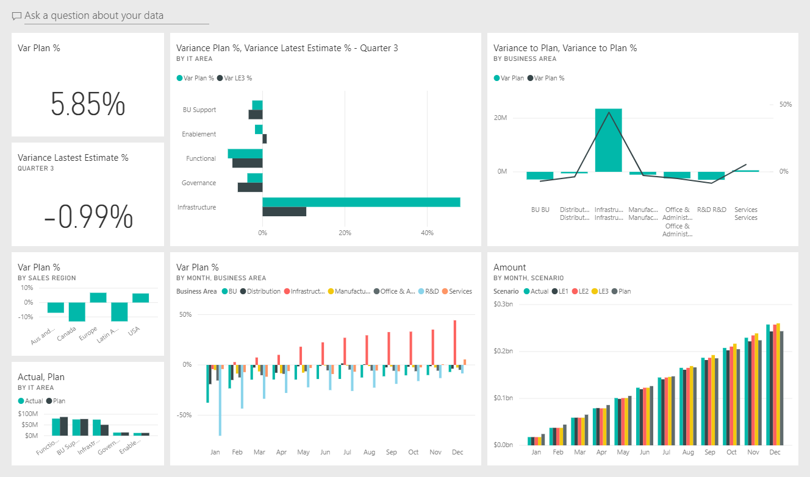
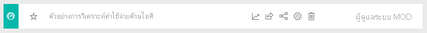
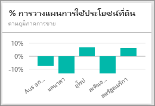
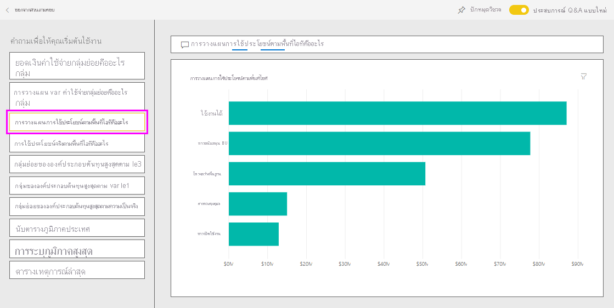
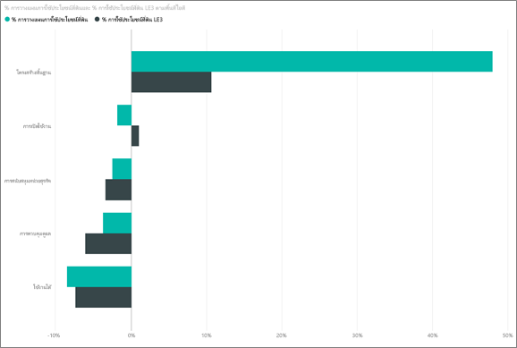

# ตัวอย่างการวิเคราะห์การใช้จ่ายด้าน IT สำหรับ Power BI: ชมการแนะนำIT Spend Analysis sample for Power BI: Take a tour

การวิเคราะห์การใช้จ่ายด้าน IT ตัวอย่างชุดเนื้อหา ที่มีแดชบอร์ด รายงาน และชุดข้อมูล  วิเคราะห์ค่าใช้จ่ายที่วางแผนเทียบกับที่ใช้จริงของแผนก ITThe IT Spend Analysis sample content pack contains a dashboard, report, and dataset that analyzes the planned vs. actual costs of an IT department. การเปรียบเทียบนี้ช่วยให้เรา เข้าใจว่าบริษัทวางแผนไว้สำหรับปีได้ดีแค่ไหน และตรวจสอบด้านที่มีความแตกต่างอย่างมากจากแผนThis comparison helps us understand how well the company planned for the year and investigate areas with huge deviations from the plan. บริษัทในตัวอย่างนี้ ใช้การวางแผนรายปี จากนั้นก็มีการประเมินล่าสุด (Latest Estimation, LE) รายไตรมาส เพื่อช่วยวิเคราะห์การเปลี่ยนแปลงของรายจ่าย IT ตลอดช่วงปีงบประมาณThe company in this example goes through a yearly planning cycle, and then quarterly it produces a new latest estimate (LE) to help analyze changes in IT spend over the fiscal year.

ตัวอย่างนี้เป็นส่วนหนึ่งของชุดตัวอย่าง ที่แสดงให้เห็นวิธีการที่คุณสามารถใช้ Power BI กับข้อมูล รายงาน และแดชบอร์ดที่เกี่ยวข้องกับธุรกิจThis sample is part of a series that shows how you can use Power BI with business-oriented data, reports, and dashboards. ซึ่งสร้างขึ้นโดย [obviEnce](http://www.obvience.com/) ด้วยข้อมูลจริงที่ไม่มีการระบุชื่อIt was created by [obviEnce](http://www.obvience.com/) with real data, which has been anonymized. ข้อมูลมีให้ใช้งานหลายรูปแบบ: ชุดเนื้อหา ไฟล์ Power BI Desktop .pbix หรือเวิร์กบุ๊ก ExcelThe data is available in several formats: content pack, .pbix Power BI Desktop file, or Excel workbook. ดู [ตัวอย่างสำหรับ Power BI](sample-datasets.md)See [Samples for Power BI](sample-datasets.md). 

บทช่วยสอนนี้จะสำรวจชุดเนื้อหาของตัวอย่างการวิเคราะห์การใช้จ่ายด้าน IT ในบริการของ Power BIThis tutorial explores the IT Spend Analysis sample content pack in the Power BI service. เนื่องจากประสบการณ์การใช้รายงานจะคล้ายคลึงกันใน Power BI Desktop ดังนั้นคุณสามารถใช้ Power BI Desktop กับไฟล์ .pbix ตัวอย่างใน Power BI Desktop ได้Because the report experience is similar in Power BI Desktop and in the service, you can also follow along by using the sample .pbix file in Power BI Desktop. 

คุณไม่จำเป็นต้องมีสิทธิการใช้งาน Power BI ในการสำรวจตัวอย่างใน Power BI DesktopYou don't need a Power BI license to explore the samples in Power BI Desktop. ถ้าคุณไม่มีสิทธิการใช้งาน Power BI Pro คุณสามารถบันทึกตัวอย่างไปยังพื้นที่ทำงานของฉันในบริการของ Power BI ได้If you don't have a Power BI Pro license, you can save the sample to your My Workspace in the Power BI service. 

## รับตัวอย่างGet the sample

 ก่อนที่คุณสามารถใช้ตัวอย่าง คุณต้องดาวน์โหลดในรูปแบบ[ชุดเนื้อหา](#get-the-content-pack-for-this-sample)[ไฟล์ .pbix](#get-the-pbix-file-for-this-sample) หรือ[เวิร์กบุ๊ก Excel](#get-the-excel-workbook-for-this-sample)Before you can use the sample, you must first download it as a [content pack](#get-the-content-pack-for-this-sample), [.pbix file](#get-the-pbix-file-for-this-sample), or [Excel workbook](#get-the-excel-workbook-for-this-sample).

### รับชุดเนื้อหาสำหรับตัวอย่างนี้Get the content pack for this sample

1. เปิดบริการ Power BI (app.powerbi.com) ลงชื่อเข้าใช้ และเปิดพื้นที่ทำงานที่คุณต้องการบันทึกตัวอย่างOpen the Power BI service (app.powerbi.com), sign in, and open the workspace where you want to save the sample.

   ถ้าคุณไม่มีสิทธิการใช้งาน Power BI Pro คุณสามารถบันทึกตัวอย่างไปยังพื้นที่ทำงานของฉันIf you don't have a Power BI Pro license, you can save the sample to your My Workspace.

2. ที่มุมด้านล่างซ้าย เลือก **รับข้อมูล**In the bottom-left corner, select **Get Data**.
   
   
3. บนหน้า **รับข้อมูล** ที่ปรากฏขึ้น เลือก **ตัวอย่าง**On the **Get Data** page that appears, select **Samples**.
   
4. เลือก **ตัวอย่างการวิเคราะห์การใช้จ่ายด้าน IT** แล้วเลือก **เชื่อมต่อ**Select **IT Spend Analysis Sample**, then choose **Connect**.  
  
   
   
5. Power BI นำเข้าชุดเนื้อหา จากนั้นเพิ่มแดชบอร์ด รายงาน และชุดข้อมูลใหม่ไปยังพื้นที่ทำงานปัจจุบันของคุณPower BI imports the content pack and then adds a new dashboard, report, and dataset to your current workspace.
   
   
  
### รับไฟล์ .pbix สำหรับตัวอย่างนี้Get the .pbix file for this sample

อีกทางเลือกหนึ่งคือ คุณสามารถดาวน์โหลดตัวอย่างการวิเคราะห์การใช้จ่ายด้าน IT เป็น[ไฟล์ .pbix](https://download.microsoft.com/download/E/9/8/E98CEB6D-CEBB-41CF-BA2B-1A1D61B27D87/IT%20Spend%20Analysis%20Sample%20PBIX.pbix) ซึ่งถูกออกแบบมาสำหรับใช้กับ Power BI DesktopAlternatively, you can download the IT Spend Analysis sample as a [.pbix file](https://download.microsoft.com/download/E/9/8/E98CEB6D-CEBB-41CF-BA2B-1A1D61B27D87/IT%20Spend%20Analysis%20Sample%20PBIX.pbix), which is designed for use with Power BI Desktop.

### รับเวิร์กบุ๊ก Excel สำหรับตัวอย่างนี้Get the Excel workbook for this sample

ถ้าคุณต้องการดูแหล่งข้อมูลสำหรับตัวอย่างนี้ ตัวอย่างนี้ยังมีให้ในรูปแบบ[เวิร์กบุ๊ก Excel](https://go.microsoft.com/fwlink/?LinkId=529783)If you want to view the data source for this sample, it's also available as an [Excel workbook](https://go.microsoft.com/fwlink/?LinkId=529783). เวิร์กบุ๊กประกอบด้วยแผ่นงาน Power View ที่คุณสามารถดู และปรับเปลี่ยนThe workbook contains Power View sheets that you can view and modify. หากต้องการดูข้อมูลดิบ ให้เปิดใช้งาน add-in การวิเคราะห์ข้อมูล แล้วจากนั้นเลือก **Power Pivot > จัดการ**To see the raw data, enable the Data Analysis add-ins, and then select **Power Pivot > Manage**. หากต้องการเปิดใช้งาน Power View และ Power Pivot add-in โปรดดู [สำรวจตัวอย่าง Excel ใน Excel ](sample-datasets.md#explore-excel-samples-inside-excel)สำหรับรายละเอียดTo enable the Power View and Power Pivot add-ins, see [Explore the Excel samples in Excel](sample-datasets.md#explore-excel-samples-inside-excel) for details.

## แดชบอร์ดตัวอย่างการวิเคราะห์การใช้จ่ายด้าน ITIT Spend Analysis Sample dashboard
ไทล์ตัวเลขสองไทล์ที่อยู่บนด้านซ้ายของแดชบอร์ด **%แปรปรวน แผน** และ **%แปรปรวน ประเมินล่าสุด ไตรมาสที่ 3** บอกภาพรวมว่าเราดำเนินไปอย่างไร เทียบกับแผน และเทียบกับการประเมินในไตรมาสล่าสุด (LE3 =ประเมินล่าสุดไตรมาส 3)The two numbers tiles on the left of the dashboard, **Var Plan %** and **Variance Latest Estimate % Quarter 3**, give us an overview of how well we're doing against the plan and against the latest quarterly estimate (LE3 = latest estimate quarter 3). โดยรวมแล้ว เราผิดไปจากแผนประมาณ 6%Overall, we're about 6% off the plan. เราลองมาสำรวจสาเหตุของความแปรปรวนนี้: เมื่อใด ที่ไหน และในประเภทใดLet's explore the cause of this variance: when, where, and in which category.

## หน้าการวิเคราะห์แนวโน้มการใช้จ่ายด้าน IT YTDYTD IT Spend Trend Analysis page
เมื่อคุณเลือกเลือกที่ไทล์แดชบอร์ด **%ความแปรปรวน แผน ตามภูมิภาค** ระบบจะแสดง **การวิเคราะห์แนวโน้มการใช้จ่ายด้าน IT** ของรายงานตัวอย่างการวิเคราะห์การใช้จ่ายด้าน ITWhen you select the **Var Plan % by Sales Region** dashboard tile, it displays the **YTD IT Spend Trend Analysis** page of the IT Spend Analysis Sample report. เห็นได้อย่างรวดเร็วว่าเรามีค่าความแปรปรวนด้านบวกในสหรัฐอเมริกา และยุโรป และด้านลบในแคนาดา ละตินอเมริกา และออสเตรเลียAt a glance, we see that we have positive variance in the United States and Europe and negative variance in Canada, Latin America, and Australia. สหรัฐอเมริกามีค่าความแปรปรวน +LE ประมาณ 6% และออสเตรเลียมีค่าความแปรปรวน -LE ประมาณ 7%The United States has about 6% +LE variance and Australia has about 7% -LE variance.

อย่างไรก็ตามแค่ดูแผนภูมินี้และสรุป สามารถทำให้เข้าใจผิดได้However, just looking at this chart and drawing conclusions can be misleading. เราจำเป็นต้องดูที่จำนวนเงินจริง ๆ เพื่อให้เห็นภาพที่ถูกต้องยิ่งขึ้นWe need to look at actual dollar amounts to put things in perspective.

1. เลือก **ออสเตรเลียและนิวซีแลนด์** ในแผนภูมิ **%ความแปรปรวน แผน ตามภูมิภาค** และดู **แผนภูมิ ความแปรปรวน แผน ตามด้านของ IT**Select **Aus and NZ** in the **Var Plan % by Sales Region** chart, and then observe the **Var Plan by IT Area** chart.

   
2. ตอนนี้ เลือก **สหรัฐอเมริกา**Now select **USA**. โปรดสังเกตว่า ออสเตรเลียและนิวซีแลนด์เป็นส่วนหนึ่งของค่าใช้จ่ายของเราโดยรวมมาเทียบกับสหรัฐอเมริกาซึ่งมีขนาดเล็กมากNotice that Australia and New Zealand are a very small part of our overall spending as compared to the United States.

    ต่อไป เรามาสำรวจว่าประเภทใดในสหรัฐอเมริกาที่ทำให้เกิดความแปรปรวนNext, let's explore which category in the USA is causing the variance.

## ถามคำถามจากข้อมูลAsk questions of the data
1. เลือก **ตัวอย่างการวิเคราะห์การใช้จ่ายด้าน IT** ในบานหน้าต่างนำทางด้านบนเพื่อกลับไปยังตัวอย่างแดชบอร์ดSelect **IT Spend Analysis Sample** in the top nav pane to return to the sample dashboard.
2. เลือก **ถามคำถามเกี่ยวกับข้อมูลของคุณ**Select **Ask a question about your data**.
3. จากรายการ **คำถามเพื่อเริ่มต้นใช้** ทางด้านซ้าย เลือก **อะไรคือแผนตามพื้นที่ไอที**From the **Questions to get you started** list on the left side, select **what is the plan by IT area**.

   

4. ในกล่องถามตอบ ล้างรายการก่อนหน้า และใส่ *แสดงพื้นที่ IT, %ความแปรปรวนแผน% และใช้ประโยชน์ที่ดิน le3 แผนภูมิแท่ง*In the Q&A box, clear the previous entry and enter *show IT areas, var plan % and var le3 % bar chart*.

   

   ในด้านแรกของ IT ซึ่งก็คือ **โครงสร้างพื้นฐาน** สังเกตว่าเปอร์เซ็นต์มีการเปลี่ยนแปลงอย่างรวดเร็ว ระหว่างค่าความแปรปรวนของแผนเริ่มต้น และค่าความแปรปรวนของแผนจากการประเมินล่าสุดIn the first IT area, **Infrastructure**, notice that the percentage has changed drastically between the initial variance plan and the variance plan latest estimate.

## หน้าการใช้จ่าย ตามประเภทค่าใช้จ่าย YTDYTD Spend by Cost Elements page

1. กลับไปยังแดชบอร์ดและดูไทล์แดชบอร์ด **%ความแปรปรวนแผน %การประเมินค่าความแปรปรวนล่าสุด - ไตรมาสที่ 3**Return to the dashboard and look at the **Variance Plan %, Variance Latest Estimate % - Quarter 3** dashboard tile.

   

   โปรดสังเกตว่า พื้นที่โครงสร้างพื้นฐานที่โดดเด่นมากกับเป็นค่าความแปรปรวนบวกขนาดใหญ่เมื่อเทียบกับแผนNotice that the Infrastructure area stands out with a large positive variance to the plan.

1. เลือกไทล์นี้เพื่อเปิดหน้ารายงานและมุมมอง **YTD ใช้จ่ายตามประเภทค่าใช้จ่าย**Select this tile to open the report and view the **YTD Spend by Cost Elements** page.
2. เลือกที่แท่ง **โครงสร้างพื้นฐาน** ในแผนภูมิ **%ความแปรปรวน แผน %ความแปรปรวน LE3 ตามด้านของ IT** ในด้านล่างซ้าย และสังเกตค่าความแปรปรวนเทียบกับแผนใน **%ความแปรปรวน แผน ตามภูมิภาคการขาย** ทางด้านซ้ายด้านล่างSelect the **Infrastructure** bar in the **Var Plan % and Var LE3 % by IT Area** chart on the lower right, and observe the variance-to-plan values in the **Var Plan % by Sales Region** chart on the lower left.

    
3. เลือกตัวแบ่งส่วนข้อมูลแต่ละชื่อในลำดับ **ค่าใช้จ่าย** เพื่อค้นหาองค์ประกอบค่าใช้จ่ายที่ มีค่าความแปรปรวนมากที่สุดSelect each name in turn in the **Cost Element Group** slicer to find the cost element with the largest variance.
4. เมื่อมีการเลือก **อื่น ๆ** แล้ว ให้เลือก **โครงสร้างพื้นฐาน** ในตัวแบ่งส่วนข้อมูล **ตามด้านของ IT** และเลือกด้านย่อยใน **ตัวแบ่งส่วนข้อมูล ด้านย่อยของ IT** เพื่อค้นหาด้านย่อย ที่มีความแปรปรวนมากที่สุดWith **Other** selected, select **Infrastructure** in the **IT Area** slicer and select subareas in the **IT Sub Area** slicer to find the subarea with the largest variance.  

   โปรดสังเกตค่าความแปรปรวนขนาดใหญ่สำหรับ **เครือข่าย**Notice the large variance for **Networking**. บริษัทตัดสินใจให้บริการโทรศัพท์แก่พนักงานเป็นสวัสดิการ แม้ว่าเรื่องนี้ไม่ได้วางแผนเอาไว้ก่อนApparently the company decided to give its employees phone services as a benefit, even though this move was not planned for.

## หน้า "การวิเคราะห์ความแปรปรวนของแผน"Plan Variance Analysis page

1. เลือกแท็บ **วิเคราะห์ความแปรปรวนแผน** ที่ด้านล่างของหน้าSelect the **Plan Variance Analysis** tab on the bottom of the page.

2. ในแผนภูมิ **ความแปรปรวนแผน, %ความแปรปรวนแผน ตามด้านของธุรกิจ** ทางด้านซ้าย เลือกที่คอลัมน์ **โครงสร้างพื้นฐาน** เพื่อไฮไลต์ค่าโครงสร้างพื้นฐานทางธุรกิจในส่วนเหลือของหน้าIn the **Var Plan and Var Plan % by Business Area** chart on the left, select the **Infrastructure** column to highlight infrastructure business area values in the rest of the page.

    

   โปรดสังเกตว่า ในแผนภูมิ **%แผน%ความแปรปรวนตามเดือนและพื้นที่ธุรกิจ** โครงสร้างพื้นฐานเริ่มต้นค่าความแปรปรวนเป็นบวกในเดือนกุมภาพันธ์Notice in the **Var plan % by Month and Business Area** chart that the infrastructure business area started a positive variance in February. นอกจากนี้ยังสังเกตว่าค่าความแปรปรวนของแผน สำหรับพื้นที่ธุรกิจแตกต่างกันตามประเทศเมื่อเทียบกับค่าของทุก ๆ ด้านของธุรกิจAlso, notice how the variance-to-plan value for that business area varies by country, as compared to all other business areas. 

3. ใช้ตัวแบ่งส่วนข้อมูล **ด้านของ IT** และ **ด้านย่อยของ IT** ทางด้านขวาเพื่อกรองค่าในส่วนเหลือของหน้าเพื่อค้นหาข้อมูลUse the **IT Area** and **IT Sub Area** slicers on the right to filter the values in the rest of the page and to explore the data. 

## แก้ไขรายงานEdit the report
เลือก **แก้ไขรายงาน** ในมุมบนซ้ายเพื่อสำรวจในมุมมองการแก้ไขSelect **Edit Report** in the upper-left corner to explore in Editing view:

* ดูว่าหน้าถูกสร้างขึ้นอย่างไร – เขตข้อมูลในแต่ละแผนภูมิและตัวกรองบนหน้าSee how the pages are made, the fields in each chart, and the filters on the pages.
* เพิ่มหน้าและแผนภูมิที่มาจากข้อมูลเดียวกันAdd pages and charts, based on the same data.
* เปลี่ยนชนิดของการแสดงภาพสำหรับแต่ละแผนภูมิChange the visualization type for each chart.
* แผนภูมิปักหมุดที่สนใจแดชบอร์ดของคุณPin charts of interest to your dashboard.

## ขั้นตอนถัดไป: เชื่อมต่อกับข้อมูลของคุณNext steps: Connect to your data
สภาพแวดล้อมนี้มีความปลอดภัยให้ดำเนินการต่างๆ ได้ เนื่องจากคุณสามารถเลือกที่จะไม่บันทึกการเปลี่ยนแปลงของคุณThis environment is a safe one to play in, because you can choose not to save your changes. ถ้าคุณบันทึก คุณสามารถเลือก **รับข้อมูล** สำหรับสำเนาชุดใหม่ของตัวอย่างนี้ได้เสมอBut if you do save them, you can always select **Get Data** for a new copy of this sample.

เราหวังว่าการแนะนำนี้ได้แสดงให้เห็นว่าแดชบอร์ด Q&A และรายงาน Power BI สามารถให้ข้อมูลเชิงลึกในข้อมูลตัวอย่างWe hope this tour has shown how Power BI dashboards, Q&A, and reports can provide insights into sample data. ตอนนี้ถึงตาคุณแล้ว ลองเชื่อมต่อกับข้อมูลของคุณเองNow it's your turn; connect to your own data. ด้วย Power BI คุณสามารถเชื่อมต่อกับแหล่งข้อมูลที่หลากหลายWith Power BI, you can connect to a wide variety of data sources. เมื่อต้องการเรียนรู้เพิ่มเติม ดู[เริ่มต้นใช้งานบริการ Power BI](../fundamentals/service-get-started.md)To learn more, see [Get started with the Power BI service](../fundamentals/service-get-started.md).
