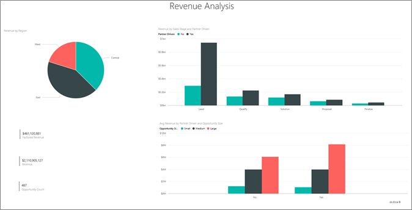
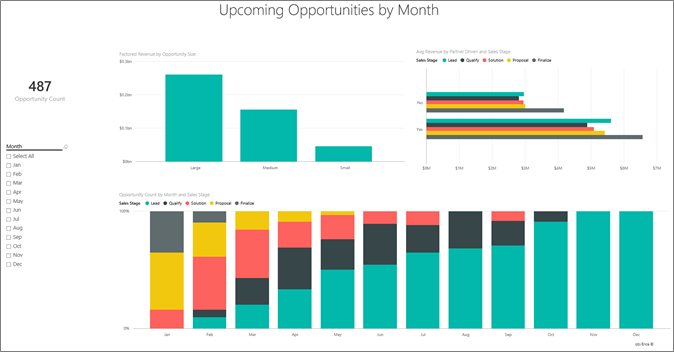

# ตัวอย่างการวิเคราะห์โอกาสทางการขายสำหรับ Power BI: ชมการแนะนำOpportunity Analysis sample for Power BI: Take a tour

ชุดเนื้อหาตัวอย่างการวิเคราะห์โอกาสทางการขายประกอบไปด้วยแดชบอร์ด รายงาน และชุดข้อมูลสำหรับบริษัทซอฟต์แวร์ที่มีช่องทางขาย 2 ช่องทาง: *โดยตรง* และ *ผ่านคู่ค้า*The Opportunity Analysis sample content pack contains a dashboard, report, and dataset for a software company that has two sales channels: *direct* and *partner*. ผู้จัดการฝ่ายขายสร้างแดชบอร์ดนี้เพื่อติดตามโอกาสและรายได้ตามภูมิภาค ขนาดโอกาส และช่องทางThe sales manager created this dashboard to track opportunities and revenue by region, deal size, and channel.

ตัวอย่างนี้อาศัยตัววัดรายได้สองตัว:This sample relies on two measures of revenue:

* รายได้: ยอดประเมินของเจ้าหน้าที่ฝ่ายขายเกี่ยวกับรายได้ที่จะได้รับRevenue: A salesperson's estimate of what the revenue will be.
* รายได้ตามปัจจัย: คำนวณจากรายได้ X % ความน่าจะเป็น และเป็นที่ยอมรับว่าค่านี้เป็นค่าที่ใช้คาดการณ์ยอดขายจริงได้แม่นยำกว่าFactored revenue: Calculated as revenue X probability% and is accepted as being a more-accurate predictor of actual sales revenue. ความน่าเป็นกำหนดจาก *ขั้นตอนการขาย* ปัจจุบันของข้อตกลง:Probability is determined by the deal's current *sales stage*:
  * ลูกค้าเป้าหมาย: 10%Lead: 10%  
  * คุณสมบัติ: 20%Qualify: 20%  
  * วิธีการแก้ไข: 40%Solution: 40%  
  * ข้อเสนอ: 60%Proposal: 60%  
  * เสร็จสิ้น: 80%Finalize: 80%

ตัวอย่างนี้เป็นส่วนหนึ่งของชุดตัวอย่าง ที่แสดงให้เห็นวิธีการที่คุณสามารถใช้ Power BI กับข้อมูล รายงาน และแดชบอร์ดที่เกี่ยวข้องกับธุรกิจThis sample is part of a series that shows how you can use Power BI with business-oriented data, reports, and dashboards. ซึ่งสร้างขึ้นโดย [obviEnce](http://www.obvience.com/) ด้วยข้อมูลจริงที่ไม่มีการระบุชื่อIt was created by [obviEnce](http://www.obvience.com/) with real data, which has been anonymized. ข้อมูลมีให้ใช้งานหลายรูปแบบ: ชุดเนื้อหา ไฟล์ Power BI Desktop .pbix หรือเวิร์กบุ๊ก ExcelThe data is available in several formats: content pack, .pbix Power BI Desktop file, or Excel workbook. ดู [ตัวอย่างสำหรับ Power BI](sample-datasets.md)See [Samples for Power BI](sample-datasets.md). 

บทช่วยสอนนี้จะสำรวจชุดเนื้อหาของตัวอย่างการวิเคราะห์โอกาสทางการขายในบริการของ Power BIThis tutorial explores the Opportunity Analysis sample content pack in the Power BI service. เนื่องจากประสบการณ์การใช้รายงานจะคล้ายคลึงกันใน Power BI Desktop ดังนั้นคุณสามารถใช้ Power BI Desktop กับไฟล์ .pbix ตัวอย่างใน Power BI Desktop ได้Because the report experience is similar in Power BI Desktop and in the service, you can also follow along by using the sample .pbix file in Power BI Desktop. 

คุณไม่จำเป็นต้องมีสิทธิการใช้งาน Power BI ในการสำรวจตัวอย่างใน Power BI DesktopYou don't need a Power BI license to explore the samples in Power BI Desktop. ถ้าคุณไม่มีสิทธิการใช้งาน Power BI Pro คุณสามารถบันทึกตัวอย่างไปยังพื้นที่ทำงานของฉันในบริการของ Power BI ได้If you don't have a Power BI Pro license, you can save the sample to your My Workspace in the Power BI service. 

## รับตัวอย่างGet the sample

ก่อนที่คุณสามารถใช้ตัวอย่าง คุณต้องดาวน์โหลดในรูปแบบ[ชุดเนื้อหา](#get-the-content-pack-for-this-sample)[ไฟล์ .pbix](#get-the-pbix-file-for-this-sample) หรือ[เวิร์กบุ๊ก Excel](#get-the-excel-workbook-for-this-sample)Before you can use the sample, you must first download it as a [content pack](#get-the-content-pack-for-this-sample), [.pbix file](#get-the-pbix-file-for-this-sample), or [Excel workbook](#get-the-excel-workbook-for-this-sample).

### รับชุดเนื้อหาสำหรับตัวอย่างนี้Get the content pack for this sample

1. เปิดบริการ Power BI (app.powerbi.com) ลงชื่อเข้าใช้ และเปิดพื้นที่ทำงานที่คุณต้องการบันทึกตัวอย่างOpen the Power BI service (app.powerbi.com), sign in, and open the workspace where you want to save the sample. 

    ถ้าคุณไม่มีสิทธิการใช้งาน Power BI Pro คุณสามารถบันทึกตัวอย่างไปยังพื้นที่ทำงานของฉันIf you don't have a Power BI Pro license, you can save the sample to your My Workspace.

2. ที่มุมด้านล่างซ้าย เลือก **รับข้อมูล**In the bottom-left corner, select **Get Data**.

    
3. บนหน้า **รับข้อมูล** ที่ปรากฏขึ้น เลือก **ตัวอย่าง**On the **Get Data** page that appears, select **Samples**.

4. เลือก **ตัวอย่างการวิเคราะห์โอกาสทางการขาย** แล้วเลือก **เชื่อมต่อ**Select **Opportunity Analysis Sample**, and then choose **Connect**.  

   
5. Power BI นำเข้าชุดเนื้อหา จากนั้นเพิ่มแดชบอร์ด รายงาน และชุดข้อมูลใหม่ไปยังพื้นที่ทำงานปัจจุบันของคุณPower BI imports the content pack, and then adds a new dashboard, report, and dataset to your current workspace.

   

### รับไฟล์ .pbix สำหรับตัวอย่างนี้Get the .pbix file for this sample

อีกทางเลือกหนึ่งคือ คุณสามารถดาวน์โหลดตัวอย่างการวิเคราะห์โอกาสทางการขายเป็น[ไฟล์ .pbix](https://download.microsoft.com/download/9/1/5/915ABCFA-7125-4D85-A7BD-05645BD95BD8/Opportunity%20Analysis%20Sample%20PBIX.pbix) ซึ่งถูกออกแบบมาสำหรับใช้กับ Power BI DesktopAlternatively, you can download the Opportunity Analysis sample as a [.pbix file](https://download.microsoft.com/download/9/1/5/915ABCFA-7125-4D85-A7BD-05645BD95BD8/Opportunity%20Analysis%20Sample%20PBIX.pbix), which is designed for use with Power BI Desktop.

### รับเวิร์กบุ๊ก Excel สำหรับตัวอย่างนี้Get the Excel workbook for this sample

ถ้าคุณต้องการดูแหล่งข้อมูลสำหรับตัวอย่างนี้ ตัวอย่างนี้ยังมีให้ในรูปแบบ[เวิร์กบุ๊ก Excel](https://go.microsoft.com/fwlink/?LinkId=529782)If you want to view the data source for this sample, it's also available as an [Excel workbook](https://go.microsoft.com/fwlink/?LinkId=529782). เวิร์กบุ๊กประกอบด้วยแผ่นงาน Power View ที่คุณสามารถดู และปรับเปลี่ยนThe workbook contains Power View sheets that you can view and modify. หากต้องการดูข้อมูลดิบ ให้เปิดใช้งาน add-in การวิเคราะห์ข้อมูล แล้วจากนั้นเลือก **Power Pivot > จัดการ**To see the raw data, enable the Data Analysis add-ins, and then select **Power Pivot > Manage**. หากต้องการเปิดใช้งาน Power View และ Power Pivot add-in โปรดดู [สำรวจตัวอย่าง Excel ใน Excel ](sample-datasets.md#explore-excel-samples-inside-excel)สำหรับรายละเอียดTo enable the Power View and Power Pivot add-ins, see [Explore the Excel samples in Excel](sample-datasets.md#explore-excel-samples-inside-excel) for details.

## แดชบอร์ดกำลังบอกอะไรแก่เราWhat is our dashboard telling us?
ผู้จัดการฝ่ายขายของเราได้สร้างแดชบอร์ดเพื่อติดตามเมตริกที่สำคัญที่สุดสำหรับพวกเขาOur sales manager has created a dashboard to track those metrics most important to them. เมื่อพวกเขาเห็นสิ่งใดที่น่าสนใจ พวกเขาสามารถเลือกไทล์เพื่อค้นหาข้อมูลนั้นได้:When they see something interesting, they can select a tile to look into the data:

- รายได้ของบริษัทคือ 2 พันล้านเหรียญ และรายได้ที่แยกแยะแล้ว คือ 461 ล้านเหรียญCompany revenue is $2 billion and factored revenue is $461 million.
- จำนวนโอกาสทางการขายและรายได้ เป็นไปตามรูปแบบกรวยที่คุ้นเคย โดยค่าผลรวมมีค่าที่ทยอยลดลงเมื่อผ่านไปยังขั้นตอนถัด ๆ ไปOpportunity count and revenue follow a familiar funnel pattern, with totals decreasing with each subsequent stage.
- โอกาสทางการขายของเรา ส่วนใหญ่อยู่ในภูมิภาคตะวันออกMost of our opportunities are in the East region.
- โอกาสที่มีขนาดใหญ่กว่าจะสร้างรายได้ให้มากกว่าโอกาสขนาดกลางหรือโอกาสขนาดเล็กLarge opportunities generate more revenue than medium or small opportunities.
- ข้อเสนอของพันธมิตรรายใหญ่สร้างรายได้เพิ่มขึ้น: $ 8 ล้านโดยเฉลี่ยเมื่อเทียบกับ $ 6 ล้านสำหรับการขายตรงLarge partner deals generate more revenue: $8 million on average versus $6 million for direct sales.

เนื่องจากความพยายามเพื่อให้ได้ข้อตกลงมีเท่ากัน ไม่ว่าข้อตกลงนั้นจะจัดเป็นขนาดใหญ่ กลาง หรือเล็ก บริษัทของเราควรวิเคราะห์ข้อมูลเพื่อศึกษาเพิ่มเติมเกี่ยวกับโอกาสขนาดใหญ่Because the effort to land a deal is the same whether the deal is classified as large, medium, or small, our company should analyze the data to learn more about large opportunities.

1. ในพื้นที่ทำงานที่คุณบันทึกตัวอย่าง เปิดแท็บ **แดชบอร์ด** จาก นั้นค้นหาแดชบอร์ด **ตัวอย่างการวิเคราะห์โอกาสทางการขาย** และเลือกIn the workspace where you saved the sample, open the **Dashboards** tab, then find the **Opportunity Analysis Sample** dashboard and select it.

2. เลือกไทล์ **จำนวนโอกาสทางการขายตามการขับเคลื่อนของคู่ค้า ขั้นตอนการขาย** เพื่อเปิดหน้าแรกของรายงานตัวอย่างการวิเคราะห์โอกาสทางการขายSelect the **Opportunity Count by Partner Driven, Sales Stage** tile to open the first page of the Opportunity Analysis Sample report. 

    

## สำรวจหน้าต่าง ๆ ในรายงานExplore the pages in the report

ดูแต่ละหน้าในรายงานโดยการเลือกแท็บหน้าที่ด้านล่างView each page in the report by selecting the page tabs at the bottom.

### หน้าภาพรวมจำนวนโอกาสทางการขายOpportunity Count Overview page

บันทึกรายละเอียดดังต่อไปนี้:Note the following details:
* ตะวันออก คือภูมิภาคที่ใหญ่ที่สุดของเราในแง่จำนวนโอกาสทางการขายEast is our biggest region in terms of opportunity counts.  
* บนแผนภูมิวงกลม **จำนวนโอกาสทางการขายตามภูมิภาค** เลือกแต่ละภูมิภาคเพื่อกรองหน้าตามภูมิภาคตามลำดับOn the **Opportunity Count by Region** pie chart, select each region in turn to filter the page by region. สำหรับแต่ละภูมิภาค โปรดสังเกตว่าคู่ค้าจะพยายามคว้าหาโอกาสขนาดใหญ่มากกว่าFor each region, notice that partners are pursuing significantly more large opportunities.   
* แผนภูมิคอลัมน์ **จำนวนโอกาสตามการขับเคลื่อนของคู่ค้าและขนาดของโอกาส** แสดงให้เห็นว่าโอกาสขนาดใหญ่ส่วนใหญ่ถูกขับเคลื่อนโดยคู่ค้า ขณะที่โอกาสขนาดเล็กและขนาดกลางอีกมากมายไม่ได้ถูกขับเคลื่อนโดยคู่ค้าThe **Opportunity Count by Partner Driven and Opportunity Size** column chart shows that most of the large opportunities are partner driven, while most of the small and medium opportunities are not.
* ในแผนภูมิแท่ง **จำนวนโอกาสทางการขายตามขั้นตอนการขาย** เลือกแต่ละ **ขั้นตอนการขาย** ตามลำดับเพื่อดูความแตกต่างของจำนวนภูมิภาคIn the **Opportunity Count by Sales Stage** bar chart, select each **Sales Stage** in turn to see the difference in regional count. โปรดสังเกตว่าแม้ว่าภูมิภาคตะวันออกจะมีโอกาสทางการขายครั้งใหญ่ที่สุด แต่ภูมิภาคทั้งสามในโซลูชัน ข้อเสนอ และขั้นตอนการขายสุดท้ายนั้นมีจำนวนใกล้เคียงกันNotice that although the East region has the largest opportunity count, all three regions in the Solution, Proposal, and Finalize sales stages have comparable counts. ผลลัพธ์นี้หมายความว่าเราสามารถปิดการขายในภูมิภาคกลางและตะวันตกด้วยเปอร์เซ็นต์ที่สูงกว่าThis result means we close a higher percent of deals in the Central and West regions.

### หน้าการวิเคราะห์รายได้Revenue Analysis page
หน้านี้จะดูที่ข้อมูลคล้ายกัน แต่ใช้มุมมองของรายได้แทนที่จะเป็นการนับจำนวนThis page takes a similar look at the data, but uses a revenue perspective instead of count.  

บันทึกรายละเอียดดังต่อไปนี้:Note the following details:
* ภูมิภาคตะวันออกเป็นภูมิภาคที่ใหญ่ที่สุดของเรา ไม่เพียงแค่จำนวนโอกาสแต่ยังรวมถึงรายได้ด้วยEast is our biggest region, not only in opportunity count but also in revenue.  
* ถ้าคุณกรองแผนภูมิ **รายได้ตามขั้นตอนการขายและการขับเคลื่อนโดยคู่ค้า** โดยการเลือก **ใช่** สำหรับ **การขับเคลื่อนโดยคู่ค้า** คุณจะเห็นรายได้ $1.5 พันล้านเหรียญและรายได้ตามปัจจัย $294 ล้านเหรียญIf you filter the **Revenue by Sales Stage and Partner Driven** chart by selecting **Yes** for **Partner Driven**, you see a revenue of $1.5 billion and a factored revenue of $294 million. เปรียบเทียบจำนวนเหล่านี้กับ $644 ล้านเหรียญ และ $166 ล้านเหรียญสำหรับรายได้ที่ไม่ได้มาจากการขับเคลื่อนโดยคู่ค้าCompare these amounts to $644 million and $166 million for non-partner driven revenue. 
* รายได้เฉลี่ยสำหรับบัญชีขนาดใหญ่มีขนาดมากกว่า 8 ล้านถ้าโอกาสทางการขายมาจากการขับเคลื่อนของคู่ค้า เทียบกับตัวเลข 6 ล้าน สำหรับธุรกิจที่ไม่ได้มาจากการขับเคลื่อนของคู่ค้าAverage revenue for large accounts is larger at 8 million if the opportunity is partner driven, compared to 6 million for non-partner driven business.  
* สำหรับธุรกิจที่ขับเคลื่อนโดยคู่ค้า รายได้เฉลี่ยต่อโอกาสทางการขายขนาดใหญ่ เกือบจะเป็นสองเท่าของโอกาสทางการขายขนาดกลางFor partner driven businesses, average revenue for large-sized opportunities is almost double that of medium-sized opportunities.  
* รายได้เฉลี่ยสำหรับธุรกิจขนาดเล็กและขนาดกลาง มีค่าใกล้เคียงกันทั้งที่ขับเคลื่อนโดยคู่ค้า และไม่ได้ขับเคลื่อนโดยคู่ค้าAverage revenue for small and medium businesses is comparable for both partner driven and non-partner driven business.   

ชัดเจนแล้วว่าคู่ค้าของเราขายให้กับลูกค้าได้ดีกว่าบริษัทที่ไม่ใช่คู่ค้าClearly our partners are doing a better job than non-partners selling to customers. จึงสมเหตุสมผลที่จะส่งต่อข้อเสนอไปทางคู่ค้าให้มากขึ้นIt might make sense to funnel more deals through our partners.

### จำนวนโอกาสทางการขายตามภูมิภาคและขั้นตอนOpportunity Count by Region and Stage
หน้านี้ของรายงานดูที่ข้อมูลคล้ายกับข้อมูลในหน้าก่อนหน้า แต่แยกตามภูมิภาคและขั้นตอนThis page of the report looks at data similar to the data on the previous page but breaks it down by region and stage. 

บันทึกรายละเอียดดังต่อไปนี้:Note the following details:
* ถ้าคุณเลือก **ตะวันออก** ในแผนภูมิวงกลม **จำนวนโอกาสทางการขายตามภูมิภาค** เพื่อกรองตามภูมิภาคตะวันออก คุณเห็นว่าโอกาสทางการขายในขอบเขตนี้จะถูกแบ่งออกระหว่างโอกาสจากการขับเคลื่อนของคู่ค้าและโอกาสที่ไม่ได้มาจากการชับเคลื่อนของคู่ค้าเกือบเท่ากันIf you select **East** in the **Opportunity Count by Region** pie chart to filter by the East region, you see that the opportunities in this region are split almost equally between partner driven and non-partner driven.
* โอกาสขนาดใหญ่พบได้มากสุดในภูมิภาคส่วนกลาง โอกาสขนาดเล็กพบมากในภูมิภาคตะวันออก และโอกาสขนาดกลางพบมากสุดในภูมิภาคตะวันตกLarge opportunities are most common in the Central region, small opportunities are most common in the East region, and medium opportunities are most common in the West region.

### หน้าโอกาสทางการขายที่จะเกิดขึ้นตามเดือนUpcoming Opportunities by Month page
สำหรับหน้านี้ เรากำลังดูปัจจัยที่คล้ายกัน แต่จากมุมมองของวันที่และเวลาFor this page we're looking at similar factors, but from a date and time perspective. 
 

CFO ของเราใช้หน้านี้เพื่อจัดสรรปริมาณงานOur CFO uses this page to manage workload. พวกเขาสามารถวางแผนตามนั้นโดยดูที่โอกาสในการสร้างรายได้ ตามขั้นตอนการขายและเดือนBy looking at the revenue opportunities by sales stage and month, they can plan accordingly.

บันทึกรายละเอียดดังต่อไปนี้:Note the following details:
* รายได้เฉลี่ยสำหรับขั้นตอนการขายสุดท้ายมีค่าสูงสุดAverage revenue for the Finalize sales stage is the highest. การปิดข้อเสนอเหล่านี้ คือสิ่งสำคัญที่สุดClosing these deals is a top priority.
* หากคุณกรองตามเดือน (โดยการเลือกเดือนในตัวแบ่งส่วนข้อมูล **เดือน**) คุณจะเห็นว่าเดือนมกราคมมีข้อเสนอขนาดใหญ่ในขั้นตอนการสุดท้ายเป็นสัดส่วนที่สูงด้วยรายได้ตามปัจจัยที่ $75 ล้านเหรียญIf you filter by month (by selecting a month in the **Month** slicer), you see that January has a high proportion of large deals in the Finalize sales stage with a factored revenue of $75 million. ในทางกลับกัน เดือนกุมภาพันธ์มีข้อเสนอปานกลางในขั้นตอนการขายของโซลูชันและข้อเสนอเป็นส่วนใหญ่February, on the other hand, has mostly medium deals in the Solution and Proposal sales stages.
* โดยทั่วไป ตัวเลขรายได้ที่แยกแยะแล้ว ผันผวนตาม ขั้นตอนการขาย จำนวนโอกาส และขนาดของข้อเสนอIn general, the factored revenue numbers fluctuate based on sales stage, number of opportunities, and deal size. เพิ่มตัวกรองสำหรับปัจจัยเหล่านี้โดยใช้บานหน้าต่าง **ตัวกรอง** เพื่อค้นหาข้อมูลเชิงลึกเพิ่มเติมAdd filters for these factors by using the **Filter** pane on the right to discover further insights.

## ขั้นตอนถัดไป: เชื่อมต่อไปยังข้อมูลของคุณNext steps: Connect to your data
สภาพแวดล้อมนี้มีความปลอดภัยให้ดำเนินการต่าง ๆ ได้ เนื่องจากคุณสามารถเลือกที่จะไม่บันทึกการเปลี่ยนแปลงของคุณThis environment is a safe one to play in, because you can choose not to save your changes. ถ้าคุณบันทึก คุณสามารถเลือก **รับข้อมูล** สำหรับสำเนาชุดใหม่ของตัวอย่างนี้ได้เสมอBut if you do save them, you can always select **Get Data** for a new copy of this sample.

เราหวังว่าการแนะนำนี้ได้แสดงให้เห็นว่าแดชบอร์ด Q&A และรายงาน Power BI สามารถให้ข้อมูลเชิงลึกในข้อมูลตัวอย่างWe hope this tour has shown how Power BI dashboards, Q&A, and reports can provide insights into sample data. ตอนนี้ถึงตาคุณแล้ว ลองเชื่อมต่อกับข้อมูลของคุณเองNow it's your turn; connect to your own data. ด้วย Power BI คุณสามารถเชื่อมต่อกับแหล่งข้อมูลที่หลากหลายWith Power BI, you can connect to a wide variety of data sources. เมื่อต้องการเรียนรู้เพิ่มเติม ดู[เริ่มต้นใช้งานบริการ Power BI](../fundamentals/service-get-started.md)To learn more, see [Get started with the Power BI service](../fundamentals/service-get-started.md).
