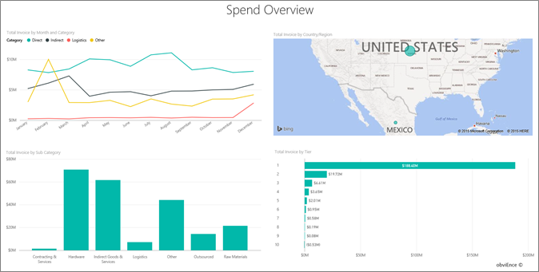

# ตัวอย่างการวิเคราะห์การจัดซื้อสำหรับ Power BI: ชมการแนะนำProcurement Analysis sample for Power BI: Take a tour

ชุดเนื้อหาตัวอย่างการวิเคราะห์การจัดซื้อประกอบด้วยแดชบอร์ด รายงาน และชุดข้อมูลที่วิเคราะห์ค่าใช้จ่ายเกี่ยวกับผู้จัดจำหน่ายของบริษัทผู้ผลิตตามประเภทและตำแหน่งที่ตั้งThe Procurement Analysis sample content pack contains a dashboard, report, and dataset that analyzes a manufacturing company's spending on vendors by category and location. ในตัวอย่าง เราสำรวจด้านต่าง ๆ เหล่านี้:In the sample, we explore these areas:

* ใครคือผู้จัดจำหน่ายที่ติดอันดับสูงสุดWho the top vendors are
* ค่าใช้จ่ายประเภทใดที่เราจ่ายมากที่สุดWhat categories we spend the most on
* ผู้จัดจำหน่ายรายใดที่ให้ส่วนลดแก่เราสูงสุด และเมื่อใดWhich vendors give us the highest discount and when

ตัวอย่างนี้เป็นส่วนหนึ่งของชุดตัวอย่าง ที่แสดงให้เห็นวิธีการที่คุณสามารถใช้ Power BI กับข้อมูล รายงาน และแดชบอร์ดที่เกี่ยวข้องกับธุรกิจThis sample is part of a series that shows how you can use Power BI with business-oriented data, reports, and dashboards. ซึ่งสร้างขึ้นโดย [obviEnce](http://www.obvience.com/) ด้วยข้อมูลจริงที่ไม่มีการระบุชื่อIt was created by [obviEnce](http://www.obvience.com/) with real data, which has been anonymized. ข้อมูลมีให้ใช้งานหลายรูปแบบ: ชุดเนื้อหา ไฟล์ Power BI Desktop .pbix หรือเวิร์กบุ๊ก ExcelThe data is available in several formats: content pack, .pbix Power BI Desktop file, or Excel workbook. ดู [ตัวอย่างสำหรับ Power BI](sample-datasets.md)See [Samples for Power BI](sample-datasets.md). 

บทช่วยสอนนี้จะสำรวจชุดเนื้อหาของตัวอย่างการวิเคราะห์การจัดซื้อในบริการของ Power BIThis tutorial explores the Procurement Analysis sample content pack in the Power BI service. เนื่องจากประสบการณ์การใช้รายงานจะคล้ายคลึงกันใน Power BI Desktop ดังนั้นคุณสามารถใช้ Power BI Desktop กับไฟล์ .pbix ตัวอย่างใน Power BI Desktop ได้Because the report experience is similar in Power BI Desktop and in the service, you can also follow along by using the sample .pbix file in Power BI Desktop. 

คุณไม่จำเป็นต้องมีสิทธิการใช้งาน Power BI ในการสำรวจตัวอย่างใน Power BI DesktopYou don't need a Power BI license to explore the samples in Power BI Desktop. ถ้าคุณไม่มีสิทธิการใช้งาน Power BI Pro คุณสามารถบันทึกตัวอย่างไปยังพื้นที่ทำงานของฉันในบริการของ Power BI ได้If you don't have a Power BI Pro license, you can save the sample to your My Workspace in the Power BI service. 

## รับตัวอย่างGet the sample

ก่อนที่คุณสามารถใช้ตัวอย่าง คุณต้องดาวน์โหลดในรูปแบบ[ชุดเนื้อหา](#get-the-content-pack-for-this-sample)[ไฟล์ .pbix](#get-the-pbix-file-for-this-sample) หรือ[เวิร์กบุ๊ก Excel](#get-the-excel-workbook-for-this-sample)Before you can use the sample, you must first download it as a [content pack](#get-the-content-pack-for-this-sample), [.pbix file](#get-the-pbix-file-for-this-sample), or [Excel workbook](#get-the-excel-workbook-for-this-sample).

### รับชุดเนื้อหาสำหรับตัวอย่างนี้Get the content pack for this sample

1. เปิดบริการ Power BI (app.powerbi.com) ลงชื่อเข้าใช้ และเปิดพื้นที่ทำงานที่คุณต้องการบันทึกตัวอย่างOpen the Power BI service (app.powerbi.com), sign in, and open the workspace where you want to save the sample. 

    ถ้าคุณไม่มีสิทธิการใช้งาน Power BI Pro คุณสามารถบันทึกตัวอย่างไปยังพื้นที่ทำงานของฉันIf you don't have a Power BI Pro license, you can save the sample to your My Workspace.

2. ที่มุมด้านล่างซ้าย เลือก **รับข้อมูล**In the bottom-left corner, select **Get Data**.

    
3. บนหน้า **รับข้อมูล** ที่ปรากฏขึ้น เลือก **ตัวอย่าง**On the **Get Data** page that appears, select **Samples**.

4. เลือก **ตัวอย่างการวิเคราะห์การจัดซื้อ** แล้วเลือก **เชื่อมต่อ**Select **Procurement Analysis Sample**, and then choose **Connect**.  
  
   
   
5. Power BI นำเข้าชุดเนื้อหา จากนั้นเพิ่มแดชบอร์ด รายงาน และชุดข้อมูลใหม่ไปยังพื้นที่ทำงานปัจจุบันของคุณPower BI imports the content pack, and then adds a new dashboard, report, and dataset to your current workspace.
   
   
  
### รับไฟล์ .pbix สำหรับตัวอย่างนี้Get the .pbix file for this sample

อีกทางเลือกหนึ่งคือ คุณสามารถดาวน์โหลดตัวอย่างการวิเคราะห์การจัดซื้อเป็น[ไฟล์ .pbix](https://download.microsoft.com/download/D/5/3/D5390069-F723-413B-8D27-5888500516EB/Procurement%20Analysis%20Sample%20PBIX.pbix) ซึ่งถูกออกแบบมาสำหรับใช้กับ Power BI DesktopAlternatively, you can download the Procurement Analysis sample as a [.pbix file](https://download.microsoft.com/download/D/5/3/D5390069-F723-413B-8D27-5888500516EB/Procurement%20Analysis%20Sample%20PBIX.pbix), which is designed for use with Power BI Desktop. 

### รับเวิร์กบุ๊ก Excel สำหรับตัวอย่างนี้Get the Excel workbook for this sample

ถ้าคุณต้องการดูแหล่งข้อมูลสำหรับตัวอย่างนี้ ตัวอย่างนี้ยังมีให้ในรูปแบบ[เวิร์กบุ๊ก Excel](https://go.microsoft.com/fwlink/?LinkId=529784)If you want to view the data source for this sample, it's also available as an [Excel workbook](https://go.microsoft.com/fwlink/?LinkId=529784). เวิร์กบุ๊กประกอบด้วยแผ่นงาน Power View ที่คุณสามารถดู และปรับเปลี่ยนThe workbook contains Power View sheets that you can view and modify. หากต้องการดูข้อมูลดิบ ให้เปิดใช้งาน add-in การวิเคราะห์ข้อมูล แล้วจากนั้นเลือก **Power Pivot > จัดการ**To see the raw data, enable the Data Analysis add-ins, and then select **Power Pivot > Manage**. หากต้องการเปิดใช้งาน Power View และ Power Pivot add-in โปรดดู [สำรวจตัวอย่าง Excel ใน Excel ](sample-datasets.md#explore-excel-samples-inside-excel)สำหรับรายละเอียดTo enable the Power View and Power Pivot add-ins, see [Explore the Excel samples in Excel](sample-datasets.md#explore-excel-samples-inside-excel) for details.

## แนวโน้มค่าใช้จ่ายSpending trends
ก่อนอื่น มาดูแนวโน้มค่าใช้จ่ายตามประเภทและตำแหน่งที่ตั้งFirst, let's look for trends in spending by category and location.  

1. ในพื้นที่ทำงานที่คุณบันทึกตัวอย่าง เปิดแท็บ **แดชบอร์ด** จาก นั้นค้นหาแดชบอร์ด **ตัวอย่างการวิเคราะห์การจัดซื้อ** และเลือกIn the workspace where you saved the sample, open the **Dashboards** tab, then find the **Procurement Analysis Sample** dashboard and select it. 
2. เลือกไทล์แดชบอร์ด **ใบแจ้งหนี้รวมตามประเทศ/ภูมิภาค** ซึ่งเปิดขึ้นในหน้า **ภาพรวมการใช้จ่าย** ของรายงาน **ตัวอย่างการวิเคราะห์การจัดซื้อ**Select the dashboard tile, **Total Invoice by Country/Region**, which opens to the **Spend Overview** page of the **Procurement Analysis Sample** report.

    

บันทึกรายละเอียดดังต่อไปนี้:Note the following details:

* ในแผนภูมิเส้น **ใบแจ้งหนี้รวมตามเดือนและประเภท**: ประเภท **โดยตรง** มีการใช้จ่ายที่ค่อนข้างเสมอต้นเสมอปลาย ประเภท **ลอจิสติกส์** มีค่าสูงสุดในเดือนธันวาคม และประเภท **อื่น ๆ** มีการดีดขึ้นในเดือนกุมภาพันธ์In the **Total Invoice by Month and Category** line chart, the **Direct** category has consistent spending, **Logistics** has a peak in December, and **Other** has a spike in February.
* ในแผนที่ **ใบแจ้งหนี้รวมตามประเทศ/ภูมิภาค**: ส่วนใหญ่ของค่าใช้จ่ายของเราอยู่ในสหรัฐอเมริกาIn the **Total Invoice by Country/Region** map, most of our spending is in the United States.
* ในแผนภูมิคอลัมน์ **ใบแจ้งหนี้รวมตามประเภทย่อย**: **ฮาร์ดแวร์** และ **สินค้าทางอ้อมและบริการ** เป็นประเภทมีค่าใช้จ่ายสูงที่สุดIn the **Total Invoice by Sub Category** column chart, **Hardware** and **Indirect Goods & Services** are the biggest spend categories.
* ในแผนภูมิแท่ง **ใบแจ้งหนี้รวมตามระดับ**: ธุรกิจส่วนใหญ่ของเราทำกับผู้จัดจำหน่ายระดับ 1 (10 อันดับแรก)In the **Total Invoice by Tier** bar chart, most of our business is done with our tier 1 (top 10) vendors. การดำเนินการดังกล่าวช่วยให้เราสามารถจัดการความสัมพันธ์ผู้จัดจำหน่ายได้ดียิ่งขึ้นDoing so enables us to manage better vendor relationships.

## ค่าใช้จ่ายในเม็กซิโกSpending in Mexico
เรามาสำรวจค่าใช้จ่ายในเม็กซิโกกันLet's explore the spending areas in Mexico.

1. ในแผนที่ **ใบแจ้งหนี้รวมตามประเทศ/ภูมิภาค** เลือกแผนภูมิแบบฟอง **เม็กซิโก**In the **Total Invoice by Country/Region** map, select the **Mexico** bubble. โปรดสังเกตว่า ในแผนภูมิคอลัมน์ **ใบแจ้งหนี้รวมตามประเภทย่อย** ค่าใช้จ่ายส่วนใหญ่จะอยู่ในประเภทย่อย **สินค้าทางอ้อมและบริการ**Notice that in the **Total Invoice by Sub Category** column chart, most spending is in the **Indirect Goods & Services** sub category.

   
2. การดูรายละเอียดลึกลงไปในคอลัมน์ **สินค้าทางอ้อมและบริการ**:Drill down into the **Indirect Goods & Services** column:

   * ในแผนภูมิ **ใบแจ้งหนี้รวมตามประเภทย่อย** เลือกลูกศรดูรายละเอียดแนวลึก ในมุมขวาบนของแผนภูมิIn the **Total Invoice by Sub Category** chart, select the drill-down arrow  in the upper-right corner of the chart.
   * เลือกคอลัมน์ **สินค้าทางอ้อมและบริการ**Select the **Indirect Goods & Services** column.

      ตามที่คุณเห็น ค่าใช้จ่ายสูงสุดโดยมากสำหรับประเภทย่อย **ยอดขายและการตลาด**As you can see, the highest spending by far is for the **Sales & Marketing** subcategory.
   * เลือก **เม็กซิโก** ในแผนที่อีกครั้งSelect **Mexico** in the map again.

      สำหรับเม็กซิโก ค่าใช้จ่ายที่สำคัญที่สุดคือประเภทย่อย **การบำรุงรักษาและการซ่อมแซม**For Mexico, the biggest spending is in the **Maintenance & Repair** subcategory.

      
3. เลือกลูกศรขึ้นที่มุมบนซ้ายของแผนภูมิเพื่อกลับขึ้นไปข้างบนSelect the up arrow on the upper-left corner of the chart to drill back up.
4. เลือกลูกศรดูรายละเอียดแนวลึกอีกครั้งเพื่อปิดการใช้รายละเอียดแนวลึกSelect the drill-down arrow again to turn drill down off.  
5. ในบานหน้าต่างนำทางด้านบน ให้เลือก **ตัวอย่างการวิเคราะห์การจัดซื้อ** เพื่อกลับไปยังแดชบอร์ดIn the top nav pane, select **Procurement Analysis Sample** to return to the dashboard.

## ประเมินเมืองต่าง ๆEvaluate different cities
เราสามารถใช้การไฮไลต์ เพื่อประเมินค่าเมืองต่าง ๆ กันWe can use highlighting to evaluate different cities.

1. เลือกไทล์แดชบอร์ด **ใบแจ้งหนี้รวม, % ส่วนลดตามเดือน** ซึ่งเปิดขึ้นในหน้า **การวิเคราะห์ส่วนลด** ของรายงาน **ตัวอย่างการวิเคราะห์การจัดซื้อ**Select the dashboard tile, **Total Invoice, Discount % By Month**, which opens to the **Discount Analysis** page of the **Procurement Analysis Sample** report.
2. ในแผนที่ต้นไม้ **ใบแจ้งหนี้รวมตามเมือง** เลือกแต่ละเมืองเพื่อเปรียบเทียบกันIn the **Total Invoice by City** tree map, select each city in turn to see how they compare. โปรดสังเกตว่าเกือบทั้งหมดของใบแจ้งหนี้ของเมืองไมอามีมาจากผู้จัดจำหน่ายระดับ 1Notice that almost all of Miami's invoices are from tier 1 vendors.

   

## ส่วนลดผู้จัดจำหน่ายVendor discounts
เรามาสำรวจส่วนลดจากผู้จัดจำหน่าย และรอบระยะเวลาที่เราได้รับส่วนลดมากที่สุดLet's also explore the discounts available from vendors, and the time periods when we get the most discounts:
* มีส่วนลดแตกต่างกันแต่ละเดือน หรือส่วนลดยังคงเหมือนเดิมหรือไม่Are the discounts different each month or do they remain the same?
* มีเมืองบางที่ได้รับส่วนลดมากกว่าเมืองอื่น ๆ หรือไม่Do some cities get more discounts than others?

### ส่วนลด ตามเดือนDiscount by month
หากดูที่แผนภูมิผสม **ใบแจ้งหนี้รวมและ%ส่วนลดตามเดือน** เราเห็นว่าเดือนกุมภาพันธ์คือเดือนที่ยุ่งที่สุด และเดือนกันยายนเป็นเดือนยุ่งน้อยที่สุดIf you look at the **Total Invoice and Discount % by Month** combo chart, we see that February is the busiest month, and September is the least busy month. 

ดูที่เปอร์เซ็นต์ส่วนลดในช่วงเดือนเหล่านี้: เมื่อปริมาณเพิ่ม ส่วนลดจะลดลง และเมื่อปริมาณอยู่ในระดับต่ำ ส่วนลดจะเพิ่มLook at the discount percent during these months: when volume increases, the discount shrinks, and when volume is low, the discount increases. ยิ่งเราต้องการส่วนลด ข้อเสนอที่เราได้รับกลับยิ่งแย่ลงThe more we need the discount, the worse of a deal we get.

### ส่วนลด ตามเมืองDiscount by city
อีกด้านหนึ่งที่จะสำรวจคือส่วนลดตามเมืองAnother area to explore is the discount by city. เลือกแต่ละเมืองตามลำดับในแผนที่ต้นไม้ และดูว่าแผนภูมิอื่น ๆ มีการเปลี่ยนแปลงอย่างไรSelect each city in turn in the tree map and see how the other charts change:

* เมืองเซนต์หลุยส์ มีการดีดขึ้นของจำนวนใบแจ้งหนี้ในเดือนกุมภาพันธ์ และการประหยัดจากส่วนลดได้ตกลงอย่างมากเดือนเมษายนSt. Louis had a large spike in total invoices in February and a large dip in discount savings in April.
* เมืองเม็กซิโกซิตีมี %ส่วนลดสูงสุด (11.05%) และเมืองแอตแลนต้ามีส่วนลดน้อยที่สุด (0.08%)Mexico City has the highest discount percentage (11.05%) and Atlanta has the smallest (0.08%).

### แก้ไขรายงานEdit the report
เลือก **แก้ไขรายงาน** ในมุมบนซ้าย และสำรวจในมุมมองการแก้ไขSelect **Edit report** in the upper-left corner and explore in Editing view:

* ดูว่าหน้าสร้างขึ้นได้อย่างไรSee how the pages are made.
* เพิ่มหน้าและแผนภูมิที่มาจากข้อมูลเดียวกันAdd pages and charts based on the same data.
* เปลี่ยนชนิดของการแสดงภาพของแผนภูมิ เช่น เปลี่ยนแผนที่ต้นไม้ ไปเป็นแผนภูมิโดนัทChange the visualization type for a chart; for example, change the tree map to a donut chart.
* ปักหมุดแผนภูมิเหล่านั้นไปยังแดชบอร์ดของคุณPin charts to your dashboard.

## ขั้นตอนถัดไป: เชื่อมต่อกับข้อมูลของคุณNext steps: Connect to your data
สภาพแวดล้อมนี้มีความปลอดภัยให้ดำเนินการต่างๆ ได้ เนื่องจากคุณสามารถเลือกที่จะไม่บันทึกการเปลี่ยนแปลงของคุณThis environment is a safe one to play in, because you can choose not to save your changes. ถ้าคุณบันทึก คุณสามารถเลือก **รับข้อมูล** สำหรับสำเนาชุดใหม่ของตัวอย่างนี้ได้เสมอBut if you do save them, you can always select **Get Data** for a new copy of this sample.

เราหวังว่าการแนะนำนี้ได้แสดงให้เห็นว่าแดชบอร์ด Q&A และรายงาน Power BI สามารถให้ข้อมูลเชิงลึกในข้อมูลตัวอย่างWe hope this tour has shown how Power BI dashboards, Q&A, and reports can provide insights into sample data. ตอนนี้ถึงตาคุณแล้ว ลองเชื่อมต่อกับข้อมูลของคุณเองNow it's your turn; connect to your own data. ด้วย Power BI คุณสามารถเชื่อมต่อกับแหล่งข้อมูลที่หลากหลายWith Power BI, you can connect to a wide variety of data sources. เมื่อต้องการเรียนรู้เพิ่มเติม ดู[เริ่มต้นใช้งานบริการ Power BI](../fundamentals/service-get-started.md)To learn more, see [Get started with the Power BI service](../fundamentals/service-get-started.md).
