# ตัวอย่างการวิเคราะห์ด้านการขายปลีก - Power BI: ชมการแนะนำRetail Analysis sample for Power BI: Take a tour

ชุดเนื้อหาตัวอย่างการวิเคราะห์การขายปลีกประกอบด้วยแดชบอร์ด รายงาน และชุดข้อมูลที่วิเคราะห์ข้อมูลการขายปลีกของสินค้าที่ขายในหลายร้านค้าและเขตThe Retail Analysis sample content pack contains a dashboard, report, and dataset that analyzes retail sales data of items sold across multiple stores and districts. The metrics compare this year's performance to last year's for sales, units, gross margin, and variance, as well as new-store analysis.The metrics compare this year's performance to last year's for sales, units, gross margin, and variance, as well as new-store analysis. 

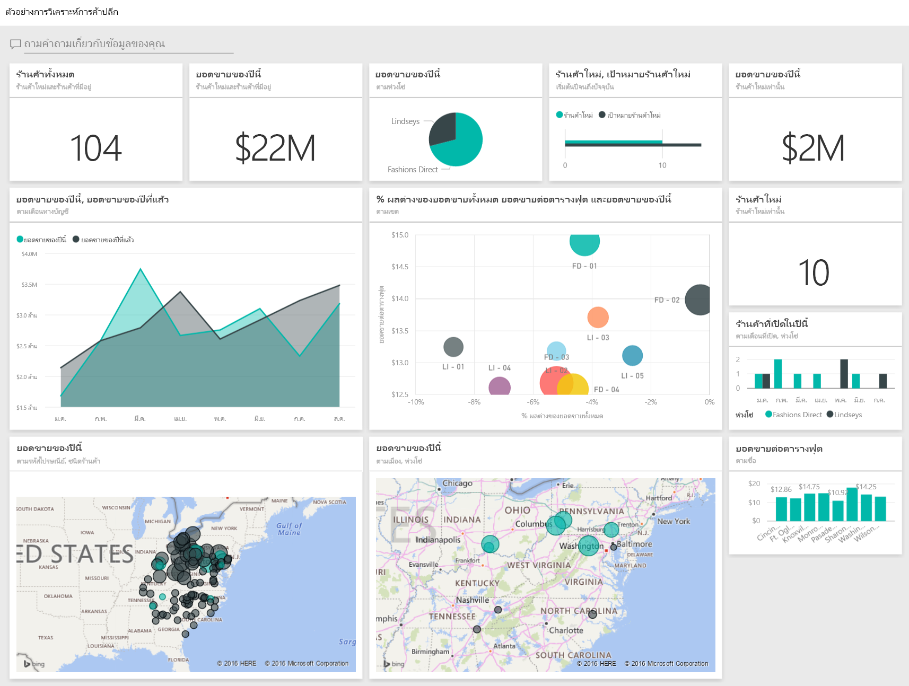

ตัวอย่างนี้เป็นส่วนหนึ่งของชุดตัวอย่าง ที่แสดงให้เห็นวิธีการที่คุณสามารถใช้ Power BI กับข้อมูล รายงาน และแดชบอร์ดที่เกี่ยวข้องกับธุรกิจThis sample is part of a series that shows how you can use Power BI with business-oriented data, reports, and dashboards. ซึ่งสร้างขึ้นโดย [obviEnce](http://www.obvience.com/) ด้วยข้อมูลจริงที่ไม่มีการระบุชื่อIt was created by [obviEnce](http://www.obvience.com/) with real data, which has been anonymized. ข้อมูลมีให้ใช้งานหลายรูปแบบ: ชุดเนื้อหา ไฟล์ Power BI Desktop .pbix หรือเวิร์กบุ๊ก ExcelThe data is available in several formats: content pack, .pbix Power BI Desktop file, or Excel workbook. ดู [ตัวอย่างสำหรับ Power BI](sample-datasets.md)See [Samples for Power BI](sample-datasets.md). 

บทช่วยสอนนี้จะสำรวจชุดเนื้อหาของตัวอย่างการวิเคราะห์การขายปลีกในบริการของ Power BIThis tutorial explores the Retail Analysis sample content pack in the Power BI service. เนื่องจากประสบการณ์การใช้รายงานจะคล้ายคลึงกันใน Power BI Desktop ดังนั้นคุณสามารถใช้ Power BI Desktop กับไฟล์ .pbix ตัวอย่างใน Power BI Desktop ได้Because the report experience is similar in Power BI Desktop and in the service, you can also follow along by using the sample .pbix file in Power BI Desktop. 

คุณไม่จำเป็นต้องมีสิทธิการใช้งาน Power BI ในการสำรวจตัวอย่างใน Power BI DesktopYou don't need a Power BI license to explore the samples in Power BI Desktop. ถ้าคุณไม่มีสิทธิการใช้งาน Power BI Pro คุณสามารถบันทึกตัวอย่างไปยังพื้นที่ทำงานของฉันในบริการของ Power BI ได้If you don't have a Power BI Pro license, you can save the sample to your My Workspace in the Power BI service. 

## รับตัวอย่างGet the sample

 ก่อนที่คุณสามารถใช้ตัวอย่าง คุณต้องดาวน์โหลดในรูปแบบ[ชุดเนื้อหา](#get-the-content-pack-for-this-sample)[ไฟล์ .pbix](#get-the-pbix-file-for-this-sample) หรือ[เวิร์กบุ๊ก Excel](#get-the-excel-workbook-for-this-sample)Before you can use the sample, you must first download it as a [content pack](#get-the-content-pack-for-this-sample), [.pbix file](#get-the-pbix-file-for-this-sample), or [Excel workbook](#get-the-excel-workbook-for-this-sample).

### รับชุดเนื้อหาสำหรับตัวอย่างนี้Get the content pack for this sample

1. เปิดบริการ Power BI (app.powerbi.com) ลงชื่อเข้าใช้ และเปิดพื้นที่ทำงานที่คุณต้องการบันทึกตัวอย่างOpen the Power BI service (app.powerbi.com), sign in, and open the workspace where you want to save the sample. 

    ถ้าคุณไม่มีสิทธิการใช้งาน Power BI Pro คุณสามารถบันทึกตัวอย่างไปยังพื้นที่ทำงานของฉันIf you don't have a Power BI Pro license, you can save the sample to your My Workspace.

2. ที่มุมด้านล่างซ้าย เลือก **รับข้อมูล**In the bottom-left corner, select **Get Data**.

    
3. บนหน้า **รับข้อมูล** ที่ปรากฏขึ้น เลือก **ตัวอย่าง**On the **Get Data** page that appears, select **Samples**.
   
4. เลือก **ตัวอย่างการวิเคราะห์ด้านการขายปลีก** และเลือก **เชื่อมต่อ**Select **Retail Analysis Sample**, and then choose **Connect**.  
  
   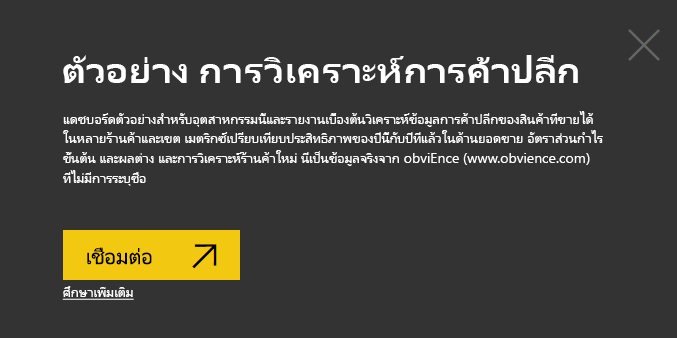
   
5. Power BI นำเข้าชุดเนื้อหา จากนั้นเพิ่มแดชบอร์ด รายงาน และชุดข้อมูลใหม่ไปยังพื้นที่ทำงานปัจจุบันของคุณPower BI imports the content pack, and then adds a new dashboard, report, and dataset to your current workspace.
   
   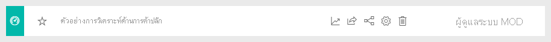
  
### รับไฟล์ .pbix สำหรับตัวอย่างนี้Get the .pbix file for this sample

อีกทางเลือกหนึ่งคือ คุณสามารถดาวน์โหลดตัวอย่างการวิเคราะห์การขายปลีกเป็น[ไฟล์ .pbix](https://download.microsoft.com/download/9/6/D/96DDC2FF-2568-491D-AAFA-AFDD6F763AE3/Retail%20Analysis%20Sample%20PBIX.pbix) ซึ่งได้รับการออกแบบมาสำหรับใช้กับ Power BI DesktopAlternatively, you can download the Retail Analysis sample as a [.pbix file](https://download.microsoft.com/download/9/6/D/96DDC2FF-2568-491D-AAFA-AFDD6F763AE3/Retail%20Analysis%20Sample%20PBIX.pbix), which is designed for use with Power BI Desktop. 

### รับเวิร์กบุ๊ก Excel สำหรับตัวอย่างนี้Get the Excel workbook for this sample

ถ้าคุณต้องการดูแหล่งข้อมูลสำหรับตัวอย่างนี้ ตัวอย่างนี้ยังมีให้ในรูปแบบ[เวิร์กบุ๊ก Excel](https://go.microsoft.com/fwlink/?LinkId=529778)If you want to view the data source for this sample, it's also available as an [Excel workbook](https://go.microsoft.com/fwlink/?LinkId=529778). เวิร์กบุ๊กประกอบด้วยแผ่นงาน Power View ที่คุณสามารถดู และปรับเปลี่ยนThe workbook contains Power View sheets that you can view and modify. หากต้องการดูข้อมูลดิบ ให้เปิดใช้งาน add-in การวิเคราะห์ข้อมูล แล้วจากนั้นเลือก **Power Pivot > จัดการ**To see the raw data, enable the Data Analysis add-ins, and then select **Power Pivot > Manage**. หากต้องการเปิดใช้งาน Power View และ Power Pivot add-in โปรดดู [สำรวจตัวอย่าง Excel ใน Excel ](sample-datasets.md#explore-excel-samples-inside-excel)สำหรับรายละเอียดTo enable the Power View and Power Pivot add-ins, see [Explore the Excel samples in Excel](sample-datasets.md#explore-excel-samples-inside-excel) for details.

## เริ่มต้นที่แดชบอร์ดและเปิดรายงานStart on the dashboard and open the report

1. ในพื้นที่ทำงานที่คุณบันทึกตัวอย่าง เปิดแท็บ **แดชบอร์ด** จาก นั้นค้นหาแดชบอร์ด **ตัวอย่างการวิเคราะห์การขายปลีก** และเลือกIn the workspace where you saved the sample, open the **Dashboards** tab, then find the **Retail Analysis Sample** dashboard and select it. 
2. บนแดชบอร์ด เลือกไทล์ **รวมร้านค้าใหม่ & ร้านค้าที่มีอยู่** ไทล์ ซึ่งเปิดขึ้นในหน้า **ภาพรวมยอดขายของร้านค้า** ในรายงานตัวอย่างการวิเคราะห์การขายปลีกOn the dashboard, select the **Total Stores New & Existing Stores** tile, which opens to the **Store Sales Overview** page in the Retail Analysis Sample report. 

   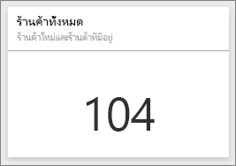  

   บนหน้ารายงานนี้ คุณจะเห็นว่าเรามีร้านค้าทั้งหมด 104 แห่ง ซึ่ง 10 ร้านเป็นร้านใหมOn this report page, you see we have a total of 104 stores, 10 of which are new. เรามีสองเชนธุรกิจ นั่นคือ Fashions Direct และ LindseysWe have two chains, Fashions Direct and Lindseys. ร้านค้า Fashions Direct มีขนาดใหญ่กว่าเมื่อดูโดยเฉลี่ยแล้วFashions Direct stores are larger, on average.
3. ในแผนภูมิวงกลม **ยอดขายของปีนี้ตามห่วงโซ่** เลือก **Fashions Direct**In the **This Year Sales by Chain** pie chart, select **Fashions Direct**.

     

   สังเกตผลลัพธ์ในแผนภูมิฟอง **% ผลต่างของยอดขายรวม**:Notice the result in the **Total Sales Variance %** bubble chart:

   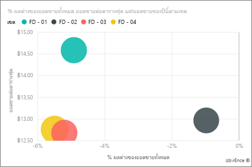  

   เขต **FD-01** มี **ยอดขายเฉลี่ยต่อตารางฟุตสูงสุด** ส่วน FD-02 มี **ค่าความแปรปรวนของยอดขายรวม** ต่ำสุด เมื่อเปรียบเทียบกับปีที่แล้วThe **FD-01** district has the highest average **Sales per Square Foot** and FD-02 has the lowest **Total Sales Variance** compared to last year. FD-03 และ FD-04 มีผลประกอบการโดยรวมแย่ที่สุดFD-03 and FD-04 are worst performers overall.
4. เลือกแต่ละฟองหรือแผนภูมิอื่น ๆ เพื่อดูการไฮไลท์ข้าม ซึ่งเผยให้เห็นผลกระทบของการเลือกของคุณSelect individual bubbles or other charts to see cross highlighting, revealing the impact of your selections.
5. เลือก **ตัวอย่างการวิเคราะห์การขายปลีก** จากบานหน้าต่างนำทางด้านบนเพื่อกลับไปยังแดชบอร์ดTo return to the dashboard, select  **Retail Analysis Sample** from the top nav pane.

   
6. บนแดชบอร์ด เลือกไทล์ **ร้านค้าที่มีอยู่และร้านค้าใหม่ของปีนี้** ซึ่งมีค่าเท่ากับการพิมพ์ *ยอดขายของปีนี้* ในกล่องคำถามถามตอบOn the dashboard, select the **This Year's Sales New & Existing Stores** tile, which is equivalent to typing *This year sales* in the Q&A question box.

   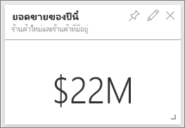

   ผลลัพธ์การถามตอบจะปรากฏขึ้น:The Q&A results appear:

   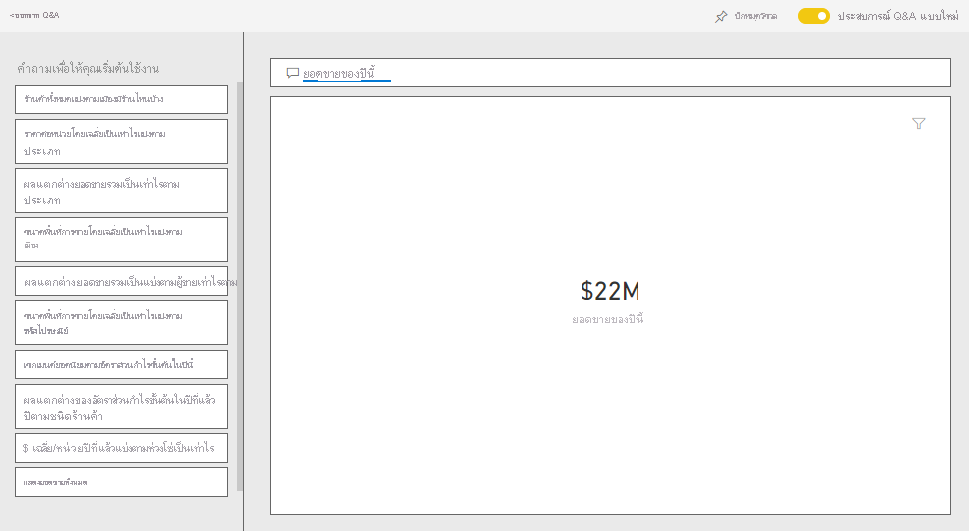

## ตรวจทานไทล์ที่สร้างขึ้นด้วย Power BI ถามตอบReview a tile created with Power BI Q&A
เรามาดูแบบเฉพาะเจาะจงมากขึ้นกันLet's get more specific.

1. เปลี่ยนคำถามเป็น _ยอดขายของปีนี้ **ตามเขต**_Change the question to _this year sales **by district**_. สังเกตผลลัพธ์: ระบบถามตอบจะใส่คำตอบในแผนภูมิแท่งและแนะนำวลีอื่น ๆ โดยอัตโนมัติ:Observe the result: Q&A automatically places the answer in a bar chart and suggests other phrases:

   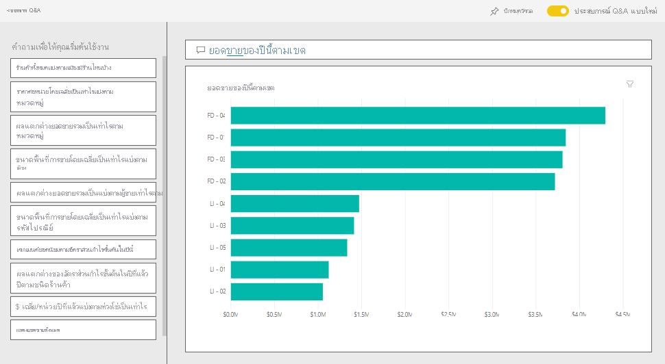
2. ตอนนี้เปลี่ยนคำถามเป็น _ยอดขายของปีนี้ **แยกตามเขตพื้นที่และเชนธุรกิจ**_Now change the question to _this year sales **by zip and chain**_.

   โปรดสังเกตวิธีการที่ Power BI ตอบคำถามขณะที่คุณพิมพ์และแสดงแผนภูมิที่เหมาะสมNotice how Power BI answers the question as you type and displays the appropriate chart.
3. ลองใช้คำถามเพิ่มเติมและดูประเภทของผลลัพธ์ที่คุณได้Experiment with more questions and see what kind of results you get.
4. เมื่อคุณพร้อมแล้ว ให้ย้อนกลับไปยังแดชบอร์ดWhen you're ready, return to the dashboard.

## เจาะลึกลงในข้อมูลนั้นDive deeper into the data
ตอนนี้เรามาสำรวจในระดับที่ละเอียดยิ่งขึ้นโดยดูที่การดำเนินการของแต่ละเขตNow let's explore on a more detailed level, looking at the districts' performances.

1. บนแดชบอร์ด เลือกไทล์ **ยอดขายของปีนี้ ยอดขายของปีที่แล้ว** ซึ่งเปิดหน้า **ยอดขายรายเดือนของเขต** ของรายงานOn the dashboard, select the **This Year's Sales, Last Year's Sales** tile, which opens the **District Monthly Sales** page of the report.

   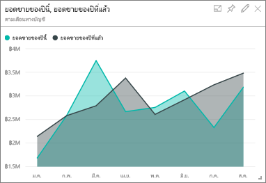

   ในแผนภูมิ **% ผลต่างของยอดขายรวมตามเดือนงบประมาณ** สังเกตว่ามีการแปรผันอย่างมากเกี่ยวกับ % ผลต่างเมื่อเปรียบเทียบกับปีที่แล้ว กับมกราคม เมษายน และกรกฎาคม ซึ่งเป็นเดือนที่มีผลประกอบการไม่ดีIn the **Total Sales Variance % by Fiscal Month** chart, notice the large variability on variance % compared to last year, with January, April, and July being particularly bad months.

   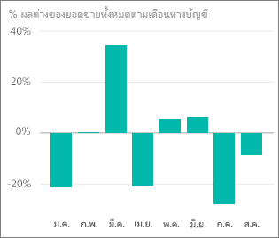

   มาดูว่าเราสามารถดูรายละเอียดได้หรือไม่ว่าปัญหามาจากที่ใดLet's see if we can narrow down where the issues might be.
2. ในแผนภูมิฟอง เลือกแบบฟอง **020-Mens**In the bubble chart, select the **020-Mens** bubble.

     

   สังเกตว่าแม้สินค้าในหมวดสินค้าผู้ชายไม่ได้รับผลกระทบอย่างร้ายแรงในเดือนเมษายนตามผลประกอบการธุรกิจโดยรวม แต่เดือนมกราคมและกรกฎาคมยังคงเป็นเดือนที่มีปัญหาObserve that although the men's category wasn't as severely affected in April as the overall business, January and July were still problematic months.
1. เลือกแบบฟอง **010-Womens**Select the **010-Womens** bubble.

   

   คุณจะสังเกตเห็นว่าสินค้าในหมวดสินค้าผู้หญิงนั้นมีผลประกอบการแย่กว่าผลประกอบการโดยรวมในทุกเดือน และแย่กว่ามากในเกือบทุกเดือนเมื่อเทียบกับปีก่อนหน้านี้Notice the women's category performed much worse than the overall business across all months, and in almost every month compared to the previous year.
1. เลือกแผนภูมิฟองอีกครั้งเพื่อล้างตัวกรองSelect the bubble again to clear the filter.

## ลองใช้ตัวแบ่งส่วนข้อมูลTry out the slicer
มาดูว่าในบางเขตมีผลประกอบการเป็นอย่างไรบ้างLet's look at how specific districts are doing.

1. เลือก **Allan Guinot** ในตัวแบ่งส่วนข้อมูล **ผู้จัดการเขต** ด้านบนซ้ายSelect **Allan Guinot** in the **District Manager** slicer on the top left.

   

   โปรดทราบว่าเขตของ Allan มีผลประกอบการที่ดีกว่าที่อื่นในเดือนมีนาคมและเดือนมิถุนายน เทียบกับปีที่แล้วNote that Allan's district outperformed in March and June, compared to last year.
2. เมื่อยังคงเลือก **Allan Guinot** ให้เลือกแบบฟอง **Womens-10** ในแผนภูมิฟองWith **Allan Guinot** still selected, select the **Womens-10** bubble in the bubble chart.

   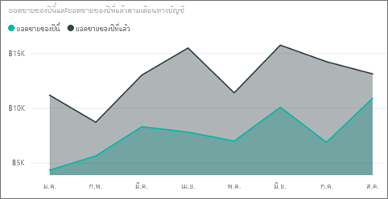

   Notice that for the Womens-10 category, Allan's district didn't meet last year's volume.Notice that for the Womens-10 category, Allan's district didn't meet last year's volume.
3. สำรวจผู้จัดการเขตอื่นและสินค้าหมวดอื่น ข้อมูลเชิงลึกอื่น ๆ ที่คุณสามารถค้นหาได้ มีอะไรบ้าง?Explore the other district managers and categories; what other insights can you find?
4. เมื่อคุณพร้อมแล้ว ให้ย้อนกลับไปยังแดชบอร์ดWhen you are ready, return to the dashboard.

## ข้อมูลระบุเกี่ยวกับการเพิ่มยอดขายปีนี้What the data says about sales growth this year
ส่วนสุดท้ายที่เราต้องการสำรวจคือการเติบโตของเรา โดยการสำรวจร้านค้าใหม่ ๆ ที่เปิดขึ้นในปีนี้The last area we want to explore is our growth by examining the new stores opened this year.

1. เลือกไทล์ **ร้านค้าที่เปิดในปีนี้ตามเดือนเปิด, เชนธุรกิจ** ซึ่งเปิดหน้า **การวิเคราะห์ร้านค้าใหม่** ของรายงานSelect the **Stores Opened This Year by Open Month, Chain** tile, which opens the **New Stores Analysis** page of the report.

   

   มีร้านค้าของ Fashions Direct เปิดขึ้นในปีนี้มากกว่าร้านค้าของ Lindseys โดยเราจะเห็นได้ชัดเจนจากไทล์As evident from the tile, more Fashions Direct stores than Lindseys stores opened this year.
2. สำรวจแผนภูมิ **ยอดขายต่อตารางฟุตแยกตามชื่อ**:Observe the **Sales Per Sq Ft by Name** chart:

   

    โปรดสังเกตความแตกต่างในยอดขาย/ตารางฟุตโดยเฉลี่ยทั่วทั้งร้านค้าใหม่Notice the difference in average sales/square foot across the new stores.
3. เลือกรายการคำอธิบายแผนภูมิ **Fashions Direct** ในแผนภูมิด้านบนขวา **จำนวนร้านค้าที่เปิดตามเดือนที่เปิดและเชนธุรกิจ**Select the **Fashions Direct** legend item in the **Open Store Count by Open Month and Chain** top-right chart. โปรดสังเกตว่าแม้แต่ธุรกิจเชนเดียวกัน ร้านค้าที่ดีที่สุด (Winchester Fashions Direct) มีผลประกอบการดีกว่าร้านค้าที่มีผลประกอบการแย่อย่างมีนัยสำคัญ (Cincinnati 2 Fashions Direct) โดยมีผลประกอบการ $21.22 เทียบกับ $12.86 ตามลำดับNotice, even for the same chain, the best store (Winchester Fashions Direct) significantly outperforms the worst store (Cincinnati 2 Fashions Direct) by $21.22 vs $12.86, respectively.

   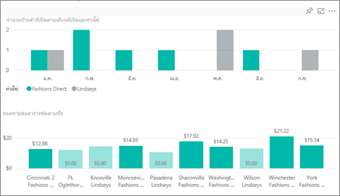
4. เลือก **Winchester Fashions Direct** ในตัวแบ่งส่วนข้อมูล **ชื่อ** และสังเกตแผนภูมิเส้นSelect **Winchester Fashions Direct** in the **Name** slicer and observe the line chart. มีการรายงานตัวเลขยอดขายแรกในเดือนกุมภาพันธ์The first sales numbers were reported in February.
5. เลือก **Cincinnati 2 Fashions Direct** ในตัวแบ่งส่วนข้อมูล และสังเกตในแผนภูมิเส้นว่าร้านค้านี้เปิดในเดือนมิถุนายน และดูเหมือนว่าเป็นร้านที่มีผลประกอบการแย่ที่สุดSelect **Cincinnati 2 Fashions Direct** in the slicer and observe in the line chart that it was opened in June and appears to be the worst performing store.
6. สำรวจโดยการเลือกแถบ เส้นและฟองอื่น ๆ ตลอดทั้งแผนภูมิและดูข้อมูลเชิงลึกที่คุณสามารถค้นหาได้Explore by selecting other bars, lines, and bubbles throughout the charts and see what insights you can discover.

## ขั้นตอนถัดไป: เชื่อมต่อไปยังข้อมูลของคุณNext steps: Connect to your data
สภาพแวดล้อมนี้มีความปลอดภัยให้ดำเนินการต่าง ๆ ได้ เนื่องจากคุณสามารถเลือกที่จะไม่บันทึกการเปลี่ยนแปลงของคุณThis environment is a safe one to play in, because you can choose not to save your changes. ถ้าคุณบันทึก คุณสามารถเลือก **รับข้อมูล** สำหรับสำเนาชุดใหม่ของตัวอย่างนี้ได้เสมอBut if you do save them, you can always select **Get Data** for a new copy of this sample.

เราหวังว่าการแนะนำนี้ได้แสดงให้เห็นว่าแดชบอร์ด Q&A และรายงาน Power BI สามารถให้ข้อมูลเชิงลึกในข้อมูลตัวอย่างWe hope this tour has shown how Power BI dashboards, Q&A, and reports can provide insights into sample data. ตอนนี้ถึงตาคุณแล้ว ลองเชื่อมต่อกับข้อมูลของคุณเองNow it's your turn; connect to your own data. ด้วย Power BI คุณสามารถเชื่อมต่อกับแหล่งข้อมูลที่หลากหลายWith Power BI, you can connect to a wide variety of data sources. เมื่อต้องการเรียนรู้เพิ่มเติม ดู[เริ่มต้นใช้งานบริการ Power BI](../fundamentals/service-get-started.md)To learn more, see [Get started with the Power BI service](../fundamentals/service-get-started.md).
