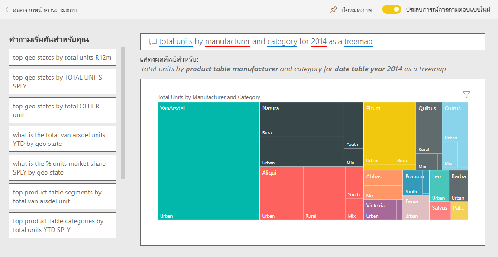

# ตัวอย่างการขายและการตลาดสำหรับ Power BI: ชมการแนะนำSales and Marketing sample for Power BI: Take a tour

ตัวอย่างการขายและการตลาด มีแดชบอร์ดและรายงานในบริษัทผลิตที่สมมุติขึ้น ที่ชื่อว่า VanArsdel Ltd. เจ้าหน้าที่หัวหน้าฝ่ายตลาด (CMO) ของ VanArsdel สร้างแดชบอร์ดนี้ขึ้นเพื่อเฝ้าดูอุตสาหกรรม และส่วนแบ่งทางการตลาด จำนวนการผลิต ยอดขาย และความคิดเห็นต่อผลิตภัณฑ์ของบริษัทของเขาThe Sales and Marketing sample contains a dashboard and report for a fictitious manufacturing company named VanArsdel Ltd. The VanArsdel Chief Marketing Officer (CMO) created this dashboard to keep an eye on the industry and the company's market share, product volume, sales, and sentiment.

VanArsdel มีคู่แข่งหลายราย แต่ก็เป็นอันดับหนึ่งของตลาดในอุตสาหกรรมVanArsdel has many competitors, but is the market leader in its industry. CMO ต้องการเพิ่มส่วนแบ่งทางการตลาด และค้นหาโอกาสการเติบโตThe CMO wants to increase market share and discover growth opportunities. แต่ด้วยเหตุผลบางประการ ส่วนแบ่งทางการตลาดของ VanArsdel ได้เริ่มลดลง และลดลงอย่างมีนัยสำคัญในเดือนมิถุนายนHowever, for unknown reasons, VanArsdel's market share has started to decline, with significant dips in June.

ตัวอย่างนี้เป็นส่วนหนึ่งของชุดตัวอย่าง ที่แสดงให้เห็นวิธีการที่คุณสามารถใช้ Power BI กับข้อมูล รายงาน และแดชบอร์ดที่เกี่ยวข้องกับธุรกิจThis sample is part of a series that shows how you can use Power BI with business-oriented data, reports, and dashboards. ซึ่งสร้างขึ้นโดย [obviEnce](http://www.obvience.com/) ด้วยข้อมูลจริงที่ไม่มีการระบุชื่อIt was created by [obviEnce](http://www.obvience.com/) with real data, which has been anonymized. ข้อมูลมีให้ใช้งานหลายรูปแบบ: ตัวอย่างในผลิตภัณฑ์ ไฟล์ Power BI Desktop .pbix หรือเวิร์กบุ๊ก ExcelThe data is available in several formats: in-product sample, .pbix Power BI Desktop file, or Excel workbook. ดู [ตัวอย่างสำหรับ Power BI](sample-datasets.md)See [Samples for Power BI](sample-datasets.md). 

บทช่วยสอนนี้จะสำรวจตัวอย่างการขายและการตลาดในบริการของ Power BIThis tutorial explores the Sales and Marketing sample in the Power BI service. เนื่องจากประสบการณ์การใช้รายงานจะคล้ายคลึงกันใน Power BI Desktop ดังนั้นคุณสามารถใช้ Power BI Desktop กับไฟล์ .pbix ตัวอย่างใน Power BI Desktop ได้Because the report experience is similar in Power BI Desktop and in the service, you can also follow along by using the sample .pbix file in Power BI Desktop. 

คุณไม่จำเป็นต้องมีสิทธิการใช้งาน Power BI ในการสำรวจตัวอย่างใน Power BI DesktopYou don't need a Power BI license to explore the samples in Power BI Desktop. ถ้าคุณไม่มีสิทธิการใช้งาน Power BI Pro คุณสามารถบันทึกตัวอย่างไปยังพื้นที่ทำงานของฉันในบริการของ Power BI ได้If you don't have a Power BI Pro license, you can save the sample to your My Workspace in the Power BI service. 

## รับตัวอย่างGet the sample

ก่อนที่คุณจะสามารถใช้ตัวอย่างคุณต้องดาวน์โหลด [แดชบอร์ด รายงาน และชุดข้อมูล](#get-the-sample-from-the-power-bi-service)[ไฟล์ .pbix](#get-the-pbix-file-for-this-sample)หรือ [เวิร์กบุ๊ก Excel](#get-the-excel-workbook-for-this-sample)Before you can use the sample, you must first download the [dashboard, report, and dataset](#get-the-sample-from-the-power-bi-service), [.pbix file](#get-the-pbix-file-for-this-sample), or [Excel workbook](#get-the-excel-workbook-for-this-sample).

### รับตัวอย่างจากบริการของ Power BIGet the sample from the Power BI service

1. เปิดบริการ Power BI (app.powerbi.com) ลงชื่อเข้าใช้ และเปิดพื้นที่ทำงานที่คุณต้องการบันทึกตัวอย่างOpen the Power BI service (app.powerbi.com), sign in, and open the workspace where you want to save the sample.

   ถ้าคุณไม่มีสิทธิการใช้งาน Power BI Pro คุณสามารถบันทึกตัวอย่างไปยังพื้นที่ทำงานของฉันIf you don't have a Power BI Pro license, you can save the sample to your My Workspace.

2. ที่มุมด้านล่างซ้าย เลือก **รับข้อมูล**In the bottom-left corner, select **Get Data**.
   
   
3. บนหน้า **รับข้อมูล** ที่ปรากฏขึ้น เลือก **ตัวอย่าง**On the **Get Data** page that appears, select **Samples**.
   
4. เลือก **ตัวอย่างการขายและการตลาด** แล้วเลือก **เชื่อมต่อ**Select **Sales and Marketing Sample**, then choose **Connect**.   
  
   
   
5. Power BI นำเข้าตัวอย่าง จากนั้นเพิ่มแดชบอร์ด รายงาน และชุดข้อมูลใหม่ไปยังพื้นที่ทำงานปัจจุบันของคุณPower BI imports the sample and then adds a new dashboard, report, and dataset to your current workspace.
   
   
  
### รับไฟล์ .pbix สำหรับตัวอย่างนี้Get the .pbix file for this sample

อีกทางเลือกหนึ่งคือ คุณสามารถดาวน์โหลดตัวอย่างการขายและการตลาดเป็น [ไฟล์ .pbix](https://download.microsoft.com/download/9/7/6/9767913A-29DB-40CF-8944-9AC2BC940C53/Sales%20and%20Marketing%20Sample%20PBIX.pbix) ซึ่งถูกออกแบบมาสำหรับใช้กับ Power BI DesktopAlternatively, you can download the Sales and Marketing sample as a [.pbix file](https://download.microsoft.com/download/9/7/6/9767913A-29DB-40CF-8944-9AC2BC940C53/Sales%20and%20Marketing%20Sample%20PBIX.pbix), which is designed for use with Power BI Desktop.

### รับเวิร์กบุ๊ก Excel สำหรับตัวอย่างนี้Get the Excel workbook for this sample

ถ้าคุณต้องการดูแหล่งข้อมูลสำหรับตัวอย่างนี้ ตัวอย่างนี้ยังมีให้ในรูปแบบ[เวิร์กบุ๊ก Excel](https://go.microsoft.com/fwlink/?LinkId=529785)If you want to view the data source for this sample, it's also available as an [Excel workbook](https://go.microsoft.com/fwlink/?LinkId=529785). เวิร์กบุ๊กประกอบด้วยแผ่นงาน Power View ที่คุณสามารถดู และปรับเปลี่ยนThe workbook contains Power View sheets that you can view and modify. หากต้องการดูข้อมูลดิบ ให้เปิดใช้งาน add-in การวิเคราะห์ข้อมูล แล้วจากนั้นเลือก **Power Pivot > จัดการ**To see the raw data, enable the Data Analysis add-ins, and then select **Power Pivot > Manage**. หากต้องการเปิดใช้งาน Power View และ Power Pivot add-in โปรดดู [สำรวจตัวอย่าง Excel ใน Excel ](sample-datasets.md#explore-excel-samples-inside-excel)สำหรับรายละเอียดTo enable the Power View and Power Pivot add-ins, see [Explore the Excel samples in Excel](sample-datasets.md#explore-excel-samples-inside-excel) for details.

## แดชบอร์ดกำลังบอกอะไรแก่เราWhat is our dashboard telling us?
มาเริ่มต้นการสำรวจของเราที่แดชบอร์ด และดูไทล์ที่ CMO เลือกปักหมุดLet's start our tour at the dashboard and look at the tiles the CMO has chosen to pin. เราเห็นข้อมูลเกี่ยวกับส่วนแบ่งทางการตลาด ยอดขาย และความคิดเห็นต่อผลิตภัณฑ์We see information about our market share, sales, and sentiment. และเราเห็นข้อมูลที่แบ่งย่อยตามภูมิภาค เวลา และการแข่งขันData is broken down by region, time, and competition.

* ไทล์ตัวเลขไปทางคอลัมน์ด้านซ้าย แสดงปริมาณยอดขายของอุตสาหกรรมในปีที่ผ่านมา (50,000), ส่วนแบ่งการตลาด (32.86%), ปริมาณขาย (16,000), คะแนนความคิดเห็น (68), ช่องว่างความคิดเห็น (4), และจำนวนหน่วยทั้งหมดที่ขาย (1 ล้าน)The number tiles along the left column show industry sales volume for the past year (50,000), market share (32.86%), sales volume (16,000), sentiment score (68), sentiment gap (4), and total units sold (1 million).
* แผนภูมิเส้นบนสุด ( **% ส่วนแบ่งตลาดของหน่วย เทียบกับ % ส่วนแบ่งตลาด 12 เดือน**) แสดงให้เห็นว่าการผันผวนของเรามีการใช้งานอย่างไรเมื่อเวลาผ่านไปThe top line chart (**% Units Market Share vs. % Units Market Share Rolling 12 Months**) shows how our market share fluctuates over time. โปรดสังเกตว่าลดลงมากในเดือนมิถุนายนNotice the large drop in June. นอกจากนี้ ส่วนแบ่ง 12 เดือน (R12M) ของเรา เพิ่มขึ้นอยู่ช่วงนึง แล้วก็เริ่มนิ่งOur rolling 12-month (R12M) share, which was increasing for a while, is now starting to stall.
* คู่แข่งที่ใหญ่ที่สุดของเราคือ Aliqui เห็นชัดเจนตรงไทล์แผนภูมิ คอลัมน์กลาง ( **% ความแตกต่างผลรวมหน่วยตั้งแต่ต้นปี**)Our biggest competitor is Aliqui, as evident in the middle column chart tile (**Total Units YTD Variance %**).
* ธุรกิจส่วนใหญ่ของเรา อยู่ในภูมิภาคตะวันออกและภูมิภาคส่วนกลางMost of our business is in the East and Central regions.
* แผนภูมิเส้นที่อยู่ด้านล่าง (**ผลรวมหน่วยสำหรับปี 2014**) แสดงให้เห็นว่า การตกของเราในเดือนมิถุนายนไม่ใช่เกิดจากฤดูกาล ไม่มีคู่แข่งของเรารายไหน ที่แสดงแนวโน้มแบบเดียวกันThe line chart at the bottom (**Total Units for 2014**) shows that our dip in June isn't seasonal; none of our competitors show the same trend.
* **ไทล์ผลรวมหน่วยทั้งหมด** และ **ผลรวมหน่วย YTD** ทางด้านขวาแสดงหน่วยที่ขาย โดยเซกเมนต์และตามภูมิภาค/ผู้ผลิตThe **Total Units Overall** and **Total Units YTD** tiles on the right show units sold, by segment and by region/manufacturer. เซ็กเมนต์ของตลาดที่ใหญ่ที่สุดของเราคือ **ประสิทธิภาพ** และ **ความสะดวกสบาย**The largest market segments for our industry are **Productivity** and **Convenience**.

## ใช้การถามตอบเพื่อเจาะลึกลงไปอีกหน่อยUse Q&A to dig a little deeper

โดยใช้ถามตอบ คุณสามารถค้นหารายละเอียดเพิ่มเติมในข้อมูลBy using Q&A, you can discover additional details in the data.

### เซ็กเมนต์ไหนที่ผลักดันยอดขายของเราWhich segments drive our sales? ตรงกับแนวโน้มอุตสาหกรรมหรือไม่Do they match the industry trend?
1. เลือกไทล์ **ผลรวมหน่วยโดยรวมตามส่วน** ที่เปิดถามตอบ และแสดงขึ้นด้วยคำถาม *ผลรวมหน่วยตามส่วน*Select the **Total Units Overall by Segment** tile, which opens Q&A and populates it with the query, *total units by segment*.
2. ในส่วนท้ายของคำถามที่มีอยู่แล้ว ให้เพิ่ม *สำหรับ VanArsdel*At the end of the existing query, add: *for VanArsdel*. Q&A ตีความคำถาม และแสดงแผนภูมิที่ปรับปรุงแล้วเป็นคำตอบQ&A interprets the question and displays an updated chart with the answer. โปรดสังเกตว่าปริมาณผลิตภัณฑ์ของเราส่วนใหญ่จากส่วน **ความสะดวก** และ **การควบคุม**Notice that our product volume is mostly from the **Convenience** and **Moderation** segments.

   
3. ส่วนแบ่งของเราในหมวดหมู่ **การดูแล** และ **ความสะดวก** สูง ส่วนเหล่านี้เป็นหนึ่งในสิ่งที่เราแข่งขันOur share in the **Moderation** and **Convenience** categories is high; these segments are the ones where we compete.
4. กลับไปยังแดชบอร์ดโดยการเลือก **ตัวอย่างการขายและการตลาด** ในบานหน้าต่างนำทางด้านบนReturn to the dashboard by selecting the **Sales and Marketing Sample** in the top nav pane.

### ส่วนแบ่งทางการตลาดของจำนวนหน่วยรวมเป็นอย่างไร ในแต่ละประเภท (เทียบกับภูมิภาค)What does total unit market share look like for category (versus region)?
1. สังเกตไทล์ **ผลรวมหน่วย YTD ตามผู้ผลิต ภูมิภาค**Notice the **Total Units YTD by Manufacturer, Region** tile. ผลรวมหน่วยส่วนแบ่งตลาดตามประเภท่คืออะไรWhat is the total unit market share by category?

   
2. เลือกกล่องคำถามที่ด้านบนสุดของแดชบอร์ด และพิมพ์คำถาม *ผลรวมหน่วยตามผู้ผลิตและประเภท สำหรับ 2014 เป็นแผนที่ต้นไม้*Select the question box at the top of the dashboard and type the question, *total units by manufacturer and category for 2014 as a treemap*. สังเกตว่า การแสดงผลจะเปลี่ยนไปขณะที่คุณพิมพ์คำถามNotice how the visualization updates as you type the question.

   
3. เพื่อเปรียบเทียบผลที่ได้ ปักหมุดแผนภูมิไปยังแดชบอร์ดTo compare the findings, pin the chart to your dashboard. สังเกตข้อเท็จจริงที่น่าสนใจนี้: ในปี 2014 VanArsdel จำหน่ายเฉพาะผลิตภัณฑ์ในประเภท **เมือง**Notice this interesting fact: In 2014, VanArsdel sold only products in the **Urban** category.
4. กลับไปยังแดชบอร์ดReturn to the dashboard.

## รายงานตัวอย่างการขายและการตลาดSales and Marketing Sample report

แดชบอร์ดเป็นจุดที่จะเข้าไปยังรายงานDashboards are an entry point into reports. ถ้าไทล์ถูกสร้างขึ้นจากรายงานพื้นฐาน คลิกที่ไทล์นั้นจะเปิดรายงานขึ้นมาIf a tile was created from an underlying report, selecting that tile opens the report.

บนแดชบอร์ดของเรา บรรทัด **% ส่วนแบ่งตลาดหน่วย R12M** ในแผนภูมิ **% ส่วนแบ่งตลาดหน่วย เทียบกับ % ส่วนแบ่งตลาดหน่วยย้อนหลัง 12 เดือน** แสดงว่าส่วนแบ่งตลาดของเราไม่เพิ่มขึ้นอีกเมื่อเวลาผ่านไปOn our dashboard, the **% Units Market Share R12M** line in the **% Units Market Share vs. % Units Market Share Rolling 12 Months** chart shows that our market share is no longer increasing over time. แต่กลับมีการลดลงของเล็กน้อยIt's even declining a bit. แล้วทำไมส่วนแบ่งตลาดของเรา ตกลงมามากในเดือนมิถุนายนAnd why do we have a large market share dip in June? 

รายงานสำหรับตัวอย่างการขายและการตลาดมีสี่หน้าThe report for the Sales and Marketing sample has four pages.
 
### VanArsdel - หน้าส่วนแบ่งตลาดVanArsdel - Market Share page
หน้าที่ 1 ของรายงานมุ่งเน้นที่ส่วนแบ่งทางการตลาดของ VanArsdelPage one of the report focuses on VanArsdel's market share.

1. บนแดชบอร์ดเลือกแผนภูมิ **% ส่วนแบ่งตลาดหน่วย เปรียบเทียบกับ %ส่วนแบ่งตลาดหน่วยย้อนหลัง 12 เดือน** เพื่อเปิดหน้า **VanArsdel - ส่วนแบ่งตลาด** ของรายงานตัวอย่างการขายและการตลาดOn the dashboard, select the **% Units Market Share vs. % Units Market Share Rolling 12 Months** chart to open the **VanArsdel - Market Share** page of the Sales and Marketing Sample report.

   

2. ดูที่แผนภูมิคอลัมน์ **ผลรวมหน่วยตามเดือนและเป็นของ VanArsdel** ที่ด้านล่างของรายงานLook at the **Total Units by Month and isVanArsdel** column chart at the bottom of the report. คอลัมน์สีดำแทน VanArsdel (ผลิตภัณฑ์ของเรา) และคอลัมน์สีเขียวคือคู่แข่งของเราThe black column represents VanArsdel (our products) and the green column is our competition. การตกลงในเดือนมิถุนายนปี 2014 ที่ VanArsdel ประสบอยู่ ไม่พบในคู่แข่งของเราThe drop in June 2014 that VanArsdel experienced was not experienced by the competition.

3. แผนภูมิแท่ง **ผลรวมปริมาณหมวดหมู่ตามเซ็กเมนต์** ทางด้านขวา จะถูกกรองเพื่อแสดงเซ็กเมนต์ 2 อันดับแรกสุดของ VanArsdelThe **Total Category Volume by Segment** bar chart on the right is filtered to show VanArsdel's top two segments. ดูว่าตัวกรองนี้สร้างขึ้นได้อย่างไร:Take a look at how this filter was created:  

   a.a. เลือกแผนภูมิ **ปริมาณรวมของประเภทตามเซกเมนต์**Select the **Total Category Volume by Segment** chart.

   b.b. เลือกบานหน้าต่าง **ตัวกรอง** ทางด้านขวาเพื่อขยายSelect the **Filters** pane on the right to expand it.  

   c.c. ภายใต้ **ตัวกรองระดับการมองเห็น** สังเกตว่า **เซกเมนต์** ได้รับการกรองเพื่อรวมเฉพาะส่วน **ความสะดวกสบาย** และ **ประหยัด** เท่านั้นUnder **Visual level filters**, notice that **Segment** is filtered to include only the **Convenience** and **Moderation** segments.  

   d.d. ปรับเปลี่ยนตัวกรองโดยการเลือก **เซกเมนต์** เพื่อขยายส่วนนั้น แล้วทำเครื่องหมาย **ประสิทธิภาพ** เพื่อเพิ่มเซกเมนต์นั้นลงไปด้วยModify the filter by selecting **Segment** to expand it, and then check **Productivity** to add that segment.  

4. ในแผนภูมิ **ผลรวมหน่วยตามเดือนและเป็นของ VanArsdel** เลือก **Yes** ในคำอธิบายแผนภูมิเพื่อกรองแบบไขว้หน้าโดย VanArsdelIn the **Total Units by Month and isVanArsdel** chart, select **Yes** in the legend to cross-filter the page by VanArsdel. ในแผนภูมิ **ปริมาณรวมประเภทตามเซ็กเมนต์** จะสังเกตว่าเราไม่ได้แข่งขันในส่วนของ **ประสิทธิภาพ**In the **Total Category Volume by Segment** chart, notice that we don't compete in the **Productivity** segment.

5. เลือก **Yes** อีกครั้งเพื่อเอาตัวกรองออกSelect the **Yes** again in the legend to remove the filter.

6. ดูที่แผนภูมิเส้น **%ส่วนแบ่งตลาดหน่วย และ %ส่วนแบ่งตลาด R12M ตามเดือน**Look at the **% Units Market Share and % Units Market Share R12M by Month** line chart. จะแสดงส่วนแบ่งตลาดรายเดือน และส่วนแบ่งตลาดย้อนหลัง 12 เดือนของเราIt shows our monthly market share and rolling 12-month market shares. ข้อมูลย้อนหลัง 12 เดือน ช่วยลดความผันผวนรายเดือน และแสดงให้เห็นแนวโน้มระยะยาวRolling-months data helps to smooth out monthly fluctuations and shows the long-term trends. ในแผนภูมิแท่ง **ปริมาณรวมประเภทตามเซกเมนต์** ให้เลือก **ความสะดวก** จากนั้น **ความประหยัด** เพื่อดูความผันผวนของส่วนแบ่งตลาดสำหรับแต่ละเซกเมนต์In the **Total Category Volume by Segment** bar chart, select **Convenience**, and then **Moderation** to see the fluctuation in market share for each segment. โปรดทราบว่าเซกเมนต์ **ความประหยัด** จะแสดงความผันผวนในส่วนแบ่งตลาดมากกว่าNotice that the **Moderation** segment shows much more fluctuation in market share.

เรายังคงกำลังมองหาว่า ทำไมส่วนแบ่งทางการตลาดของเราถึงตกลงมากในเดือนมิถุนายนWe're still looking to find out why our market share dipped so low in June. ถัดไป เราจะตรวจสอบหน้า **การวิเคราะห์ความคิดเห็น** ของรายงานNext, let's check the **Sentiment Analysis** page of the report.

### หน้าการวิเคราะห์ความคิดเห็นSentiment Analysis page
หน้าสามของรายงานเน้นไปที่ความคิดเห็นของผู้ใช้งานPage three of the report focuses on consumer sentiment.

Tweets, Facebook, บล็อกและบทความล้วนแต่ส่งผลต่อความคิดเห็นของผู้ใช้งาน ซึ่งจะปรากฏในแผนภูมิเส้นสองแผนภูมิที่ด้านซ้ายของหน้าTweets, Facebook, blogs, and articles all contribute to consumer sentiment, which is shown in the two line charts on left side of the page. แผนภูมิ **VanArsdel - ความคิดเห็นรายเดือน** ที่มุมซ้ายบนแสดงว่าความคิดเห็นสำหรับผลิตภัณฑ์ของเราส่วนใหญ่ค่อนข้างเป็นกลางจนถึงเดือนกุมภาพันธ์The **VanArsdel - Sentiment by Month** chart in the top-left corner shows that sentiment for our products was mostly neutral up until February. จากนั้นก็ตกลงมากตั้งแต่เดือนกุมภาพันธ์ และตกลงถึงจุดต่ำสุดในเดือนมิถุนายนThen, a large drop started in February and bottomed out in June. เกิดอะไรขึ้นถึงทำให้ความคิดเห็นตกลงเช่นนี้What happened to cause this drop in sentiment? 

ต้องดูแหล่งข้อมูลภายนอกLet's look at external sources. ในเดือนกุมภาพันธ์ หลายบทความและบล็อกโพสต์ ได้จัดอันดับให้การบริการลูกค้าของ VanArsdel ว่าเลวร้ายที่สุดในอุตสาหกรรมIn February, several articles and blog posts rated VanArsdel's customer service as the worst in the industry. ข่าวที่ไม่ดีนี้มีผลโดยตรงต่อความคิดเห็นของลูกค้าและการขายThis bad press had a direct correlation to customer sentiment and sales. VanArsdel พยายามอย่างหนักเพื่อปรับปรุงการบริการลูกค้า และลูกค้าและอุตสาหกรรมก็มองเห็นVanArsdel worked hard to improve customer service, and customers and the industry took note. ในเดือนกรกฎาคม ความคิดเห็นเริ่มปรับตัวดีขึ้น และถึงจุดสูงสุดที่แถว หกสิบกว่า ๆIn July, positive sentiment started to rise and then reached an all-time high in the 60s. การเพิ่มขึ้นเล็กน้อยนี้ในความคิดเห็นนี้จะแสดงในแผนภูมิ **หน่วยรวมตามรายเดือน** ในหน้าหนึ่งและสองของรายงานThis uptick in sentiment is reflected in the **Total Units by Month** charts on pages one and two of the report. บางที นี่ช่วยอธิบายการตกลงของส่วนแบ่งทางการตลาดของเดือนมิถุนายนได้บางส่วนPerhaps this partially explains our market share dips for June?

ช่องว่างด้านความคิดเห็นอาจเป็นอีกหนึ่งพื้นที่ในการสำรวจSentiment gap might be another area to explore. เขตใดบ้างที่มีช่องว่างด้านความคิดเห็นสูงสุด สามารถจัดการได้อย่างไรและสามารถทำซ้ำในเขตอื่น ๆ ได้อย่างไรWhich districts have the highest sentiment gap, how can management capitalize on it, and how can they replicate it in other districts?

### หน้าการวิเคราะห์แนวโน้มประเภท YTDYTD Category Trend Analysis page
หน้าสองของรายงานเน้นไปที่แนวโน้มหมวดหมู่ปีต่อวันPage two of the report focuses on the year-to-date category trend.

โปรดสังเกตรายละเอียดดังต่อไปนี้:Notice the following details:
* VanArsdel เป็นบริษัทขนาดใหญ่ที่สุดในหมวดหมู่นี้และคู่แข่งที่ใหญ่ที่สุดคือ Natura, Aliqui และ PiriumVanArsdel is the largest company in this category and its biggest competitors are Natura, Aliqui, and Pirium. เราจะจับตาดูพวกเขาWe'll keep our eyes on them.
* Aliqui ก็กำลังเติบโต แต่ปริมาณของผลิตภัณฑ์เมื่อเทียบกับเราแล้ว ยังต่ำมากAliqui is growing, but product volume compared to us is still low.
* แผนที่ต้นไม้แสดง VanArsdel เป็นสีเขียวThe treemap shows VanArsdel in green. ในภูมิภาคตะวันออก ลูกค้าต้องการการแข่งขันของเรา แต่ในภูมิภาคกลาง การดำเนินการของเราไปได้ด้วยดีIn the East region, customers prefer our competition, but in the Central region we're doing okay. ส่วนแบ่งในภูมิภาคตะวันออกเป็นการใช้งานร่วมกันต่ำสุดของเราOur share in the East region is our lowest.
* ภูมิศาสตร์มีผลต่อจำนวนหน่วยที่ขายได้Geography has an impact on units sold. ภูมิภาคตะวันออกเป็นภูมิภาคที่สำคัญสำหรับผู้ผลิตส่วนใหญ่ และ VanArsdel มีความแข็งแกร่งในภูมิภาคส่วนกลางเช่นกันThe East region is the dominant region for most manufacturers and VanArsdel has a strong presence in the Central region as well.
* บนแผ่นภูมิ **% ความแปรผันของ YTD ในหน่วยรวมตามเดือนและบริษัทผู้ผลิต** ในด้านขวาล่าง โปรดสังเกตว่าเรามีความแปรผันเชิงบวก ซึ่งเป็นสัญญาณที่ดีOn the **Total Units YTD Var % by Month and Manufacturer** chart in the bottom right, notice that we have positive variance, which is a good sign. เรากำลังทำได้ดีกว่าปีที่ผ่านมา แต่คู่แข่งของเรา Aliqui ก็เช่นกันWe're doing better than last year, but so is our competitor, Aliqui.

### หน้าโอกาสทางการขายGrowth Opportunities page
หน้าสี่ของรายงานเน้นไปที่การวิเคราะห์ผลิตภัณฑ์ที่แข่งขันPage four of the report focuses on competitive product analysis.

โปรดสังเกตรายละเอียดดังต่อไปนี้:Notice the following details:
* แผนภูมิ **หน่วยรวมตามเซ็กเมนต์** ในด้านล่างซ้ายแสดงเซ็กเมนต์ทุกประเภท ยกเว้นสองเซ็กเมนต์ที่แข็งแกร่งที่สุดของ VanArsdelThe **Total Units by Segment** chart in the bottom-left shows all the category segments, except for VanArsdel's two strongest segments. เลือกแต่ละเซ็กเมนต์ตามลำดับเพื่อระบุพื้นที่การขยายที่อาจเกิดขึ้นสำหรับ VanArsdelSelect each of the segments in turn to identify potential expansion areas for VanArsdel. 
* โปรดสังเกตว่าเซ็กเมนต์ **ที่สุด** และ **ประสิทธิภาพ** กำลังเติบโตได้เร็วกว่าเซ็กเมนต์อื่นNotice that the **Extreme** and **Productivity** segments are growing faster than others. อย่างไรก็ตาม เราจะไม่แข่งขันในเซ็กเมนต์เหล่านั้น หากเราต้องการย้ายไปยังเซ็กเมนต์เหล่านี้ เราสามารถใช้ข้อมูลของเราเพื่อดูว่าเซ็กเมนต์ใดได้รับความนิยมในภูมิภาคใดบ้างHowever, we don't compete in those segments; if we want to move into these segments, we can use our data to see which segments are popular in which regions. เราสามารถตรวจสอบคำถามดังกล่าวเช่น ภูมิภาคใดกำลังเติบโตเร็วกว่า และใครจะมาเป็นคู่แข่งที่ใหญ่ที่สุดในเซ็กเมนต์นั้นWe can further investigate such questions as which regions are growing faster and who would be our biggest competitor in that segment.
* ยังจำการตกลงของส่วนแบ่งทางการตลาดในเดือนมิถุนายนหรือไม่Remember our market share dip in June? มิถุนายนเป็นเดือนที่สำคัญสำหรับเซ็กเมนต์ **ประสิทธิภาพ** – เซ็กเมนต์ที่เราไม่เข้าแข่งขันเลยJune is a significant month for the **Productivity** segment, a segment we don't compete in at all. รายละเอียดนี้สามารถช่วยอธิบายการตกลงของส่วนแบ่งทางการตลาดในเดือนมิถุนายนThis detail could help explain our market share dip in June.

โดยการกรองการแสดงภาพ ตาม VanArsdel, ตามเซ็กเมนต์, ตามเดือน และ ตามภูมิภาค เราสามารถค้นพบโอกาสในการเติบโตสำหรับ VanArsdelBy filtering the visualizations by VanArsdel, by segment, by month, and by region, we can discover growth opportunities for VanArsdel.

## ขั้นตอนถัดไป: เชื่อมต่อไปยังข้อมูลของคุณNext steps: Connect to your data
สภาพแวดล้อมนี้มีความปลอดภัยให้ดำเนินการต่าง ๆ ได้ เนื่องจากคุณสามารถเลือกที่จะไม่บันทึกการเปลี่ยนแปลงของคุณThis environment is a safe one to play in, because you can choose not to save your changes. ถ้าคุณบันทึก คุณสามารถเลือก **รับข้อมูล** สำหรับสำเนาชุดใหม่ของตัวอย่างนี้ได้เสมอBut if you do save them, you can always select **Get Data** for a new copy of this sample.

เราหวังว่าการแนะนำนี้ ได้แสดงให้เห็นว่าแดชบอร์ด, Q&A และรายงาน Power BI สามารถให้ข้อมูลเชิงลึกในข้อมูลทรัพยากรบุคคลWe hope this tour has shown how Power BI dashboards, Q&A, and reports can provide insights into human resources data. ตอนนี้ถึงตาคุณแล้ว ลองเชื่อมต่อกับข้อมูลของคุณเองNow it's your turn; connect to your own data. ด้วย Power BI คุณสามารถเชื่อมต่อกับแหล่งข้อมูลที่หลากหลายWith Power BI, you can connect to a wide variety of data sources. เมื่อต้องการเรียนรู้เพิ่มเติม ดู[เริ่มต้นใช้งานบริการ Power BI](../fundamentals/service-get-started.md)To learn more, see [Get started with the Power BI service](../fundamentals/service-get-started.md).
