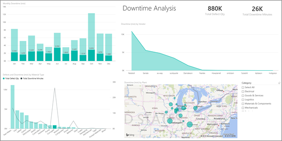
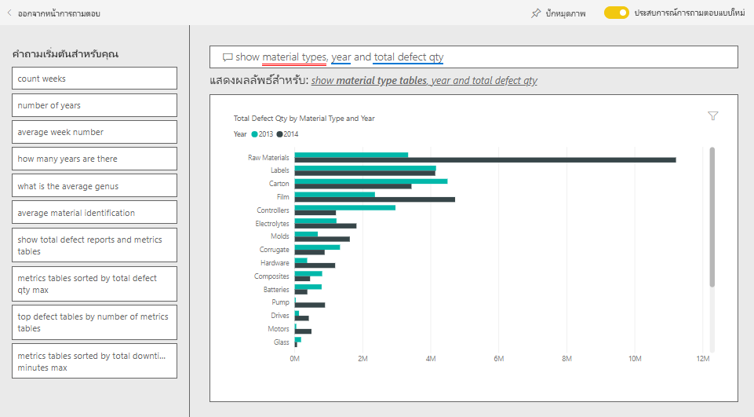

# ตัวอย่างการวิเคราะห์คุณภาพผู้จัดหาสินค้าสำหรับ Power BI: ชมการแนะนำSupplier Quality Analysis sample for Power BI: Take a tour

แดชบอร์ดตัวอย่างสำหรับอุตสาหกรรมนี้และรายงานเบื้องต้นเน้นไปที่หนึ่งในความท้าทายของห่วงโซ่อุปทานทั่วไป: การวิเคราะห์คุณภาพผู้จัดหาสินค้าThis industry sample dashboard and underlying report focus on one of the typical supply chain challenges: supplier quality analysis. การวิเคราะห์นี้ใช้เมตริกหลักสองอย่าง: ผลรวมจำนวนที่บกพร่องและผลรวมเวลาที่ไม่ได้ทำงานที่เกิดขึ้นจากข้อบกพร่องเหล่านี้Two primary metrics are at play in this analysis: total number of defects and the total downtime that these defects caused. 

ตัวอย่างนี้มีสองวัตถุประสงค์หลัก:This sample has two main objectives:

* ทำความเข้าใจว่า ใครเป็นผู้จัดหาสินค้าที่มีคุณภาพดีที่สุดและแย่ที่สุดUnderstand who the best and worst suppliers are, with respect to quality.
* ระบุโรงงานไหนสามารถค้นพบและปฏิเสธวัสดุที่มีข้อบกพร่องได้ดีกว่า เพื่อลดเวลาที่ต้องหยุดทำงานIdentify which plants do a better job finding and rejecting defects, to minimize downtime.

ตัวอย่างนี้เป็นส่วนหนึ่งของชุดตัวอย่าง ที่แสดงให้เห็นวิธีการที่คุณสามารถใช้ Power BI กับข้อมูล รายงาน และแดชบอร์ดที่เกี่ยวข้องกับธุรกิจThis sample is part of a series that shows how you can use Power BI with business-oriented data, reports, and dashboards. ซึ่งสร้างขึ้นโดย [obviEnce](http://www.obvience.com/) ด้วยข้อมูลจริงที่ไม่มีการระบุชื่อIt was created by [obviEnce](http://www.obvience.com/) with real data, which has been anonymized. ข้อมูลมีให้ใช้งานหลายรูปแบบ: ชุดเนื้อหา ไฟล์ Power BI Desktop .pbix หรือเวิร์กบุ๊ก ExcelThe data is available in several formats: content pack, .pbix Power BI Desktop file, or Excel workbook. ดู [ตัวอย่างสำหรับ Power BI](sample-datasets.md)See [Samples for Power BI](sample-datasets.md). 

บทช่วยสอนนี้จะสำรวจชุดเนื้อหาของตัวอย่างการวิเคราะห์คุณภาพผู้จัดหาสินค้าในบริการของ Power BIThis tutorial explores the Supplier Quality Analysis sample content pack in the Power BI service. เนื่องจากประสบการณ์การใช้รายงานจะคล้ายคลึงกันใน Power BI Desktop ดังนั้นคุณสามารถใช้ Power BI Desktop กับไฟล์ .pbix ตัวอย่างใน Power BI Desktop ได้Because the report experience is similar in Power BI Desktop and in the service, you can also follow along by using the sample .pbix file in Power BI Desktop. 

คุณไม่จำเป็นต้องมีสิทธิการใช้งาน Power BI ในการสำรวจตัวอย่างใน Power BI DesktopYou don't need a Power BI license to explore the samples in Power BI Desktop. ถ้าคุณไม่มีสิทธิการใช้งาน Power BI Pro คุณสามารถบันทึกตัวอย่างไปยังพื้นที่ทำงานของฉันในบริการของ Power BI ได้If you don't have a Power BI Pro license, you can save the sample to your My Workspace in the Power BI service. 

## รับตัวอย่างGet the sample

ก่อนที่คุณสามารถใช้ตัวอย่าง คุณต้องดาวน์โหลดในรูปแบบ[ชุดเนื้อหา](#get-the-content-pack-for-this-sample)[ไฟล์ .pbix](#get-the-pbix-file-for-this-sample) หรือ[เวิร์กบุ๊ก Excel](#get-the-excel-workbook-for-this-sample)Before you can use the sample, you must first download it as a [content pack](#get-the-content-pack-for-this-sample), [.pbix file](#get-the-pbix-file-for-this-sample), or [Excel workbook](#get-the-excel-workbook-for-this-sample).

### รับชุดเนื้อหาสำหรับตัวอย่างนี้Get the content pack for this sample

1. เปิดบริการ Power BI (app.powerbi.com) ลงชื่อเข้าใช้ และเปิดพื้นที่ทำงานที่คุณต้องการบันทึกตัวอย่างOpen the Power BI service (app.powerbi.com), sign in, and open the workspace where you want to save the sample.

   ถ้าคุณไม่มีสิทธิการใช้งาน Power BI Pro คุณสามารถบันทึกตัวอย่างไปยังพื้นที่ทำงานของฉันIf you don't have a Power BI Pro license, you can save the sample to your My Workspace.

2. ที่มุมด้านล่างซ้าย เลือก **รับข้อมูล**In the bottom-left corner, select **Get Data**.
   
   
3. บนหน้า **รับข้อมูล** ที่ปรากฏขึ้น เลือก **ตัวอย่าง**On the **Get Data** page that appears, select **Samples**.
   
4. เลือก **ตัวอย่างการวิเคราะห์คุณภาพผู้จัดหาสินค้า** แล้วเลือก **เชื่อมต่อ**Select **Supplier Quality Analysis Sample**, then choose **Connect**.  
   
   

5. Power BI นำเข้าชุดเนื้อหา จากนั้นเพิ่มแดชบอร์ด รายงาน และชุดข้อมูลใหม่ไปยังพื้นที่ทำงานปัจจุบันของคุณPower BI imports the content pack and then adds a new dashboard, report, and dataset to your current workspace.
   
   
  
### รับไฟล์ .pbix สำหรับตัวอย่างนี้Get the .pbix file for this sample

อีกทางเลือกหนึ่งคือ คุณสามารถดาวน์โหลดตัวอย่างการวิเคราะห์คุณภาพผู้จัดหาสินค้าเป็น [ไฟล์ .pbix](https://download.microsoft.com/download/8/C/6/8C661638-C102-4C04-992E-9EA56A5D319B/Supplier-Quality-Analysis-Sample-PBIX.pbix) ซึ่งถูกออกแบบมาสำหรับใช้กับ Power BI DesktopAlternatively, you can download the Supplier Quality Analysis sample as a [.pbix file](https://download.microsoft.com/download/8/C/6/8C661638-C102-4C04-992E-9EA56A5D319B/Supplier-Quality-Analysis-Sample-PBIX.pbix), which is designed for use with Power BI Desktop.

### รับเวิร์กบุ๊ก Excel สำหรับตัวอย่างนี้Get the Excel workbook for this sample

ถ้าคุณต้องการดูแหล่งข้อมูลสำหรับตัวอย่างนี้ ตัวอย่างนี้ยังมีให้ในรูปแบบ[เวิร์กบุ๊ก Excel](https://go.microsoft.com/fwlink/?LinkId=529779)If you want to view the data source for this sample, it's also available as an [Excel workbook](https://go.microsoft.com/fwlink/?LinkId=529779). เวิร์กบุ๊กประกอบด้วยแผ่นงาน Power View ที่คุณสามารถดู และปรับเปลี่ยนThe workbook contains Power View sheets that you can view and modify. หากต้องการดูข้อมูลดิบ ให้เปิดใช้งาน add-in การวิเคราะห์ข้อมูล แล้วจากนั้นเลือก **Power Pivot > จัดการ**To see the raw data, enable the Data Analysis add-ins, and then select **Power Pivot > Manage**. หากต้องการเปิดใช้งาน Power View และ Power Pivot add-in โปรดดู [สำรวจตัวอย่าง Excel ใน Excel ](sample-datasets.md#explore-excel-samples-inside-excel)สำหรับรายละเอียดTo enable the Power View and Power Pivot add-ins, see [Explore the Excel samples in Excel](sample-datasets.md#explore-excel-samples-inside-excel) for details.

## เวลาหยุดทำงานที่เกิดจากวัสดุที่มีข้อบกพร่องDowntime caused by defective materials
เรามาวิเคราะห์เวลาหยุดทำงานที่เกิดจากวัสดุที่มีข้อบกพร่อง และดูว่าผู้จัดหาสินค้ารายไหนที่เป็นผู้รับผิดชอบLet's analyze the downtime caused by defective materials and see which vendors are responsible.  

1. บนแดชบอร์ด เลือก **จำนวนข้อบกพร่องรวม** หรือไทล์ **เวลาหยุดทำงานรวม เป็นนาที**On the dashboard, select the **Total Defect Quantity** or the **Total Downtime Minutes** tile.

     

   รายงานตัวอย่างการวิเคราะห์คุณภาพผู้จัดหาสินค้าจะเปิดไปยังหน้า **วิเคราะห์เวลาหยุดทำงาน**The Supplier Quality Analysis Sample report opens to the **Downtime Analysis** page.

   โปรดสังเกตว่าเรามีชิ้นส่วนที่บกพร่อง 33 ล้านชิ้น ทำให้เวลาในการหยุดทำงานทั้งหมดเท่ากับ 77,000 นาทีNotice we have 33 million defective pieces, causing a total downtime of 77,000 minutes. แม้ว่าวัสดุบางชนิดจะมีชิ้นส่วนที่บกพร่องน้อยลง แต่ก็อาจทำให้เกิดความล่าช้า ซึ่งส่งผลให้มีปัญหาในการหยุดทำงานมากขึ้นAlthough some materials have fewer defective pieces, they can cause delays, which result in more downtime. เรามาสำรวจวัสดุเหล่านี้บนหน้ารายงานLet's explore them on the report page.  
2. หากเราดูที่เส้น **เวลาหยุดทำงานรวม เป็นนาที** ในแผนภูมิผสม **ข้อบกพร่องและเวลาหยุดทำงาน (นาที) ตามชนิดของวัสดุ** เราจะเห็นว่าวัสดุที่เป็นลอนก่อให้เกิดการหยุดทำงานสูงที่สุดIf we look at the **Total Downtime Minutes** line in the **Defects and Downtime (min) by Material Type** combo chart, we can see that corrugate materials cause the most downtime.  
3. เลือกคอลัมน์ **เป็นลอน** เพื่อดูว่าโรงงานไหนได้รับผลกระทบมากที่สุดจากข้อบกพร่องนี้ และผู้จัดหาสินค้ารายไหนที่เป็นผู้ที่รับผิดชอบSelect the **Corrugate** column to see which plants are affected most by this defect and which vendor is responsible.  

     
4. ในแผนที่ **การหยุดทำงาน (นาที) ตามโรงงาน** ให้เลือกโรงงานแต่ละแห่งเพื่อดูว่าผู้จัดหาสินค้าหรือวัสดุไหนที่รับผิดชอบต่อการหยุดทำงานในโรงงานนั้นIn the **Downtime (min) by Plant** map, select individual plants in turn to see which vendor or material is responsible for the downtime at that plant.

### ผู้จัดหาสินค้ารายไหนเป็นผู้จัดหาที่แย่ที่สุดWhich are the worst suppliers?
 เราต้องการค้นหาผู้จัดหาสินค้าแปดรายที่แย่ที่สุด และหาว่า มีกี่เปอร์เซ็นต์ของเวลาหยุดทำงานทั้งหมดที่ของพวกเขาเป็นผู้รับผิดชอบWe want to find the worst eight suppliers and determine what percentage of the downtime they're responsible for creating. เราสามารถทำได้โดยการเปลี่ยนแผนภูมิพื้นที่ **เวลาหยุดทำงาน (นาที) ตามผู้จัดหาสินค้า** ให้เป็นแผนที่ต้นไม้We can do so by changing the **Downtime (min) by Vendor** area chart to a treemap.  

1. ในหน้า **การวิเคราะห์การหยุดทำงาน** ของรายงาน ให้เลือก **แก้ไขรายงาน** ในมุมบนซ้ายOn the **Downtime Analysis** page of the report, select **Edit report** in the upper-left corner.  
2. เลือกแผนภูมิพื้นที่ **เวลาหยุดทำงาน (นาที) ตามผู้จัดหาสินค้า** และในบานหน้าต่างการ **แสดงภาพข้อมูล** เลือกไอคอน **แผนที่ต้นไม้**Select the **Downtime (min) by Vendor** area chart, and in the **Visualizations** pane, select the **Treemap** icon.  

     

    แผนที่ต้นไม้จะกำหนดเขตข้อมูล **ผู้จัดหาสินค้า** สำหรับ **จัดกลุ่ม** ให้โดยอัตโนมัติThe treemap automatically sets the **Vendor** field as the **Group**.  

      

   จากแผนที่ต้นไม้นี้ เราสามารถเห็นผู้จัดหาที่แย่ที่สุดแปดราย เป็นรูปสี่เหลี่ยมแปดรูป บนด้านซ้ายของแผนที่ต้นไม้From this treemap, we can see the top eight vendors are the eight blocks on the left of the treemap. นอกจากนี้เรายังสามารถเห็นว่า พวกเขาทำให้เกิดการหยุดทำงานประมาณ 50% ของจำนวนนาทีทั้งหมดWe can also see they account for about 50% of all downtime minutes.  
3. เลือก **ตัวอย่างการวิเคราะห์คุณภาพผู้จัดหาสินค้า** ในบานหน้าต่างนำทางด้านบนเพื่อย้อนกลับไปยังแดชบอร์ดSelect **Supplier Quality Analysis Sample** in the top nav pane to return to the dashboard.

### เปรียบเทียบโรงงานต่าง ๆComparing plants
ในตอนนี้เรามาสำรวจกันว่า โรงงานไหนสามารถจัดการกับวัสดุที่มีข้อบกพร่องได้ดีกว่า และส่งผลให้เกิดการหยุดทำงานน้อยกว่าNow let's explore which plant does a better job managing defective material, resulting in less downtime.  

1. บนแดชบอร์ด เลือกไทล์แผนที่ **รายงานข้อบกพร่องรวมโดยแยกตามโรงงาน, ชนิดข้อบกพร่อง**On the dashboard, select the **Total Defect Reports by Plant, Defect Type** map tile.      

     

   รายงานจะเปิดขึ้นไปยังหน้า **การวิเคราะห์คุณภาพผู้จัดหาสินค้า**The report opens to the **Supplier Quality Analysis** page.  

2. ในคำอธิบายของ **รายงานข้อบกพร่องรวมโดยแยกตามโรงงานและชนิดข้อบกพร่อง** ให้เลือกวงกลม **ผลกระทบ**In the legend of the **Total Defect Reports by Plant and Defect Type**, select the **Impact** circle.  

      

    โปรดสังเกตว่าในแผนภูมิแบบฟองที่ซึ่ง **โลจิสติกส์** เป็นประเภทที่ยุ่งยากที่สุดNotice in the bubble chart that **Logistics** is the most troublesome category. โดยมีจำนวนมากที่สุดในแง่ของปริมาณข้อบกพร่องทั้งหมด รายงานข้อบกพร่อง และนาทีการหยุดทำงาน
It's the largest in terms of total defect quantity, defect reports, and downtime minutes. เรามาสำรวจประเภทนี้เพิ่มเติมกันLet's explore this category more.  
3. เลือกฟอง **ลอจิสติกส์** ในแผนภูมิฟอง และสังเกตโรงงานในเมืองสปริงฟิลด์ รัฐอิลลินอยส์ และเนเปอร์วิลล์ รัฐอิลลินอยส์Select the **Logistics** bubble in the bubble chart and observe the plants in Springfield and Naperville, IL. ดูเหมือนว่าเนเปอร์วิลล์จะจัดการกับข้อบกพร่องได้ดีกว่า เนื่องจากมีจำนวนที่ถูกปฏิเสธมากและผลกระทบน้อย เมื่อเทียบกับผลกระทบจำนวนมากของสปริงฟิลด์Naperville seems to be doing a much better job of managing defective supplies as it has a high number of rejects and few impacts, compared to Springfield's large number for impacts.  

     
4. เลือก **ตัวอย่างการวิเคราะห์คุณภาพผู้จัดหาสินค้า** ในบานหน้าต่างนำทางด้านบนเพื่อย้อนกลับไปยังแดชบอร์ดSelect **Supplier Quality Analysis Sample** in the top nav pane to return to the dashboard.

## วัสดุชนิดไหนที่จัดการได้ดีที่สุดWhich material type is best managed?
วัสดุที่ได้รับการจัดการดีที่สุด คือวัสดุที่มีเวลาหยุดทำงานต่ำที่สุดหรือไม่มีเลย โดยไม่ขึ้นกับปริมาณวัสดุที่มีข้อบกพร่องThe best managed material type is the one with lowest downtime or no impact, regardless of defect quantity.

1. ในแดชบอร์ด ลองดูที่ไทล์ **จำนวนข้อบกพร่องรวม ตามชนิดของวัสดุ, ชนิดของข้อบกพร่อง**In the dashboard, look at the **Total Defect Quantity by Material Type, Defect Type** tile.

   

   โปรดสังเกตว่าแม้ว่า **วัตถุดิบ** ประเภทวัสดุมีข้อบกพร่องทั้งหมดจำนวนมาก แต่ข้อบกพร่องเหล่านั้นส่วนใหญ่จะถูกปฏิเสธหรือไม่มีผลกระทบNotice that although **Raw Materials** material type has many total defects, most of those defects are either rejected or have no impact.

   เรามาตรวจสอบเพื่อยืนยันว่า ชนิดของวัสดุนี้ไม่ก่อให้เกิดการหยุดทำงานมากนัก แม้ว่าจะมีจำนวนข้อบกพร่องที่สูงLet's verify that this material type doesn't cause much downtime, despite high defect quantity.

2. ในแดชบอร์ด ดูที่ไทล์ **จำนวนข้อพร่องรวม เวลาหยุดทำงานรวมเป็นนาที ตามชนิดของวัสดุ**In the dashboard, look at the **Total Defect Qty, Total Downtime Minutes by Material Type** tile.

   

   เห็นได้ว่าการจัดการวัตถุดิบทำได้ดี: ถึงแม้ว่ามีจำนวนข้อบกพร่องมากกว่า แต่จำนวนนาทีรวมที่หยุดทำงานต่ำกว่าRaw materials appear to be well managed; although they have more defects, they have lower total downtime minutes.

### เปรียบเทียบข้อบกพร่องกับเวลาหยุดทำงาน ตามปีCompare defects to downtime by year
1. เลือกไทล์แผนที่ **รายงานความบกพร่องรวม ตามโรงงาน, ชนิดข้อบกพร่อง** เพื่อเปิดรายงานไปยังหน้า **การวิเคราะห์คุณภาพผู้จัดหาสินค้า**Select the **Total Defect Reports by Plant, Defect Type** map tile to open the report to the **Supplier Quality Analysis** page.
2. ในแผนภูมิ **จำนวนข้อบกพร่องรวมแบ่งตามเดือนและปี**  ให้สังเกตว่าปริมาณข้อบกพร่องในปี 2014 สูงกว่ากว่าในปี 2013In the **Total Defect Qty by Month and Year** chart, notice that defect quantity is higher in 2014 than in 2013.  

      
3. ข้อบกพร่องที่มากกว่า ลงผลให้เกิดเวลาหยุดทำงานที่มากขึ้นหรือไม่Do more defects translate into more downtime? ถามคำถามในกล่อง Q&A เพื่อค้นหาคำตอบAsk questions in the Q&A box to find out.  
4. เลือก **ตัวอย่างการวิเคราะห์คุณภาพผู้จัดหาสินค้า** ในบานหน้าต่างนำทางด้านบนเพื่อย้อนกลับไปยังแดชบอร์ดSelect **Supplier Quality Analysis Sample** in the top nav pane to return to the dashboard.  
5. เนื่องจากเราทราบว่าวัตถุดิบมีจำนวนข้อบกพร่องสูงสุด ให้พิมพ์ในกล่องคำถาม: *แสดงประเภทวัสดุ ปี และจำนวนข้อบกพร่องรวม*Because we know that raw materials have the highest number of defects, type in the question box: *show material types, year, and total defect qty*.  

    มีข้อบกพร่องที่เกิดจากวัตถุดิบในปี 2014 มากกว่าของปี 2013There were many more raw materials defects in 2014 than in 2013.  

      
6. ถัดไป เปลี่ยนคำถามเป็น: _แสดงชนิดของวัสดุ ปี และ **เวลาหยุดทำงานทั้งหมดเป็นนาที**_Next, change the question to: _show material types, year, and total **downtime minutes**_.  

   

   ขอให้สังเกตว่าเวลาหยุดทำงานเนื่องจากวัตถุดิบของปี 2013 และปี 2014 มีค่าใกล้เคียงกัน ถึงแม้ว่าจะมีข้อบกพร่องจากวัตถุดิบในปี 2014 มากกว่ามากNotice that downtime for raw materials was about the same in 2013 and 2014, even though there were many more raw materials defects in 2014. ซึ่งปรากฏว่าข้อบกพร่องของวัตถุดิบในปี 2014 ไม่ได้ทำให้เกิดการหยุดทำงานเนื่องจากวัตถุดิบในปี 2014 มากขึ้นIt appears that more defects for raw materials in 2014 didn't lead to much more downtime for raw materials in 2014.

### เปรียบเทียบข้อบกพร่องกับเวลาหยุดทำงาน เทียบเดือนต่อเดือนCompare defects to downtime month to month
มาดูอีกหนึ่งไทล์แดชบอร์ด ซึ่งเกี่ยวข้องกับจำนวนข้อบกพร่องรวมLet's look at another dashboard tile related to total defective quantity.  

1. เลือก **ออกจาก Q&A** ในมุมบนซ้ายเพื่อกลับไปยังแดชบอร์ดSelect **Exit Q&A** in the upper-left corner to return to the dashboard.  

    ดูรายละเอียดเพิ่มเติมในไทล์ **ปริมาณข้อบกพร่องรวม ตามเดือน ปี**Look more closely at the **Total Defect Quantity by Month, Year** tile. พบว่า ครึ่งปีแรกของปี 2014 มีจำนวนข้อบกพร่องที่คล้ายกับของปี 2013 แต่ในครึ่งปีหลังของปี 2014 จำนวนข้อบกพร่องเพิ่มขึ้นอย่างมากIt shows that the first half of 2014 had a similar number of defects as 2013, but in the second half of 2014, the number of defects increased significantly.  

      

    เรามาดูกันว่า การเพิ่มจำนวนของข้อบกพร่องนี้ ส่งผลให้เกิดเวลาหยุดทำงานเป็นนาทีในระดับที่เท่ากันหรือไม่Let's see if this increase in defect quantity led to an equal increase in downtime minutes.  
2. ในกล่องคำถาม พิมพ์ *เวลาหยุดทำงานรวมเป็นนาที ตามเดือนและปี เป็นแผนภูมิเส้น*In the question box, type *total downtime minutes by month and year as a line chart*.  

   

   นอกเหนือจากการเพิ่มขึ้นของเวลาหยุดทำงานอย่างก้าวกระโดดในเดือนมิถุนายนและตุลาคม จำนวนข้อบกพร่องไม่ได้ส่งผลให้เกิดเวลาหยุดทำงานเพิ่มขึ้นอย่างมีนัยสำคัญOther than a jump in downtime minutes during June and October, the number of defects didn't result in significantly more downtime. ผลลัพธ์นี้แสดงให้เห็นว่าเราจัดการกับข้อบกพร่องนี้ได้ดีทีเดียวThis result shows we're managing defects well.  
3. เมื่อต้องการปักหมุดแผนภูมินี้ไปยังแดชบอร์ด เลือกไอคอนปักหมุดTo pin this chart to your dashboard, select the pin icon  เหนือกล่องคำถามabove the question box.  
4. เพื่อจะสำรวจเดือนที่มีค่าแตกต่างจากเดือนอื่นมาก ลองดูจำนวนนาทีในเดือนตุลาคม ตามชนิดของวัสดุ ตำแหน่งโรงงาน ประเภท และอื่นๆ โดยการถามคำถามเช่น *เวลาหยุดทำงานรวมเป็นนาที ในเดือนตุลาคม ตามโรงงาน*To explore the outlier months, check out the downtime minutes during October by material type, plant location, category, and so on, by asking questions such as *total downtime minutes in October by plant*. 
5. เลือก **ออกจาก Q&A** ในมุมบนซ้ายเพื่อกลับไปยังแดชบอร์ดSelect **Exit Q&A** in the upper-left corner to return to the dashboard.

## ขั้นตอนถัดไป: เชื่อมต่อไปยังข้อมูลของคุณNext steps: Connect to your data
สภาพแวดล้อมนี้มีความปลอดภัยให้ดำเนินการต่าง ๆ ได้ เนื่องจากคุณสามารถเลือกที่จะไม่บันทึกการเปลี่ยนแปลงของคุณThis environment is a safe one to play in, because you can choose not to save your changes. ถ้าคุณบันทึก คุณสามารถเลือก **รับข้อมูล** สำหรับสำเนาชุดใหม่ของตัวอย่างนี้ได้เสมอBut if you do save them, you can always select **Get Data** for a new copy of this sample.

เราหวังว่าการแนะนำนี้ได้แสดงให้เห็นว่าแดชบอร์ด Q&A และรายงาน Power BI สามารถให้ข้อมูลเชิงลึกในข้อมูลตัวอย่างWe hope this tour has shown how Power BI dashboards, Q&A, and reports can provide insights into sample data. ตอนนี้ถึงตาคุณแล้ว ลองเชื่อมต่อกับข้อมูลของคุณเองNow it's your turn; connect to your own data. ด้วย Power BI คุณสามารถเชื่อมต่อกับแหล่งข้อมูลที่หลากหลายWith Power BI, you can connect to a wide variety of data sources. เมื่อต้องการเรียนรู้เพิ่มเติม ดู[เริ่มต้นใช้งานบริการ Power BI](../fundamentals/service-get-started.md)To learn more, see [Get started with the Power BI service](../fundamentals/service-get-started.md).
