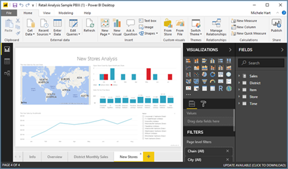

# สำรวจตัวอย่างการวิเคราะห์ด้านการขายปลีกExplore the Retail Analysis sample

บทช่วยสอนนี้สอนให้คุณรู้จักวิธี:This tutorial shows you how to: 
- นำเข้าชุดเนื้อหาตัวอย่าง เพิ่มไปยังบริการ Power BI และเปิดดูเนื้อหาImport the Retail Analysis sample content pack, add it to the Power BI service, and open the contents. *ชุดเนื้อหา* คือตัวอย่างชนิดหนึ่ง ที่มีการรวมชุดข้อมูลกับแดชบอร์ดและรายงานA *content pack* is a type of sample where the dataset is bundled with a dashboard and report. 
- เปิดไฟล์ .pbix ตัวอย่างการวิเคราะห์ด้านการขายปลีกใน Power BI DesktopOpen the Retail Analysis sample .pbix file in Power BI Desktop.

ถ้าคุณต้องการข้อมูลพื้นหลังเพิ่มเติม ดู [ตัวอย่างชุดข้อมูลสำหรับ Power BI](sample-datasets.md)If you'd like more background information, see [Sample datasets for Power BI](sample-datasets.md). ในบทความดังกล่าว คุณจะได้เรียนรู้เกี่ยวกับตัวอย่าง วิธีรับตัวอย่างเหล่านั้น พื้นที่ที่จะบันทึก วิธีการใช้งาน และเรื่องราวจากแต่ละตัวอย่างIn that article you'll learn all about the samples: how to get them, where to save them, how to use them, and some of the stories each sample can tell. 

## ข้อกำหนดเบื้องต้นPrerequisites
มีตัวอย่างให้สำหรับบริการ Power BI และ Power BI DesktopThe samples are available for the Power BI service and Power BI Desktop. เรากำลังใช้ตัวอย่างการวิเคราะห์ด้านการขายปลีกถ้าคุณต้องการทำตามWe're using the Retail analysis sample, if you want to follow along.

ชุดเนื้อหาตัวอย่างการ *วิเคราะห์ด้านการขายปลีก* ที่ใช้ในบทช่วยสอนนี้ประกอบด้วยแดชบอร์ด รายงาน และชุดข้อมูลThe *Retail Analysis* sample content pack used in this tutorial consists of a dashboard, report, and dataset.
ทำความคุ้นเคยกับชุดเนื้อหานี้ และสถานการณ์ คุณอาจต้องการชม [ตัวอย่างการวิเคราะห์ด้านการขายปลีกสำหรับ Power BI: ชมการแนะนำ ](sample-retail-analysis.md) ก่อนที่คุณจะเริ่มต้นTo familiarize yourself with this particular content pack and its scenario, see [Retail Analysis sample for Power BI: Take a tour](sample-retail-analysis.md) before you begin.

## นำเข้าตัวอย่างในบริการของ Power BIImport the sample in the Power BI service

1. เปิดบริการ Power BI (app.powerbi.com) ลงชื่อเข้าใช้ และเปิดพื้นที่ทำงานที่คุณต้องการบันทึกตัวอย่างOpen the Power BI service (app.powerbi.com), sign in, and open the workspace where you want to save the sample. 

    ถ้าคุณไม่มีสิทธิการใช้งาน Power BI Pro คุณสามารถบันทึกตัวอย่างไปยังพื้นที่ทำงานของฉันIf you don't have a Power BI Pro license, you can save the sample to your My Workspace.

2. เลือก **รับข้อมูล** ที่ด้านล่างของบานหน้าต่างนำทางSelect **Get Data** at the bottom of the nav pane. 

   

   ถ้าคุณไม่เห็น **รับข้อมูล** ให้ขยายบานหน้าต่างนำทางโดยการเลือกไอคอนต่อไปนี้ที่ด้านบนของบานหน้าต่าง: If you don't see **Get Data**, expand the nav pane by selecting the following icon at the top of the pane: .

5. บนหน้า **รับข้อมูล** ที่ปรากฏขึ้น เลือก **ตัวอย่าง**On the **Get Data** page that appears, select **Samples**.
   
6. เลือก **ตัวอย่างการวิเคราะห์ด้านการขายปลีก** และเลือก **เชื่อมต่อ**Select **Retail Analysis Sample**, and then choose **Connect**.   
   
   

## มีการนำเข้าอะไรบ้างWhat was imported?
ด้วยตัวอย่างชุดเนื้อหา เมื่อคุณเลือก **เชื่อมต่อ** แล้ว Power BI จะนำสำเนาของชุดเนื้อหานั้น มาเก็บไว้ให้คุณในคลาวด์With the sample content packs, when you select **Connect**, Power BI gets a copy of that content pack and stores it for you in the cloud. เนื่องจากบุคคลที่สร้างชุดเนื้อหา รวมชุดข้อมูล รายงาน และแดชบอร์ดไว้ นั่นคือสิ่งที่คุณจะได้รับเมื่อคุณคลิก **เชื่อมต่อ**Because the person who created the content pack included a dataset, a report, and a dashboard, that's what you get when you select **Connect**. 

1. เมื่อคุณเลือก **เชื่อมต่อ** Power BI จะสร้างแดชบอร์ดใหม่ และแสดงรายการในแท็บ **แดชบอร์ด** ของคุณWhen you select **Connect**, Power BI creates the new dashboard and lists it on your **Dashboards** tab. 
   
   
2. เปิดแท็บ **รายงาน** ที่นี่คุณจะเห็นรายงานใหม่ที่มีชื่อ *ตัวอย่างการวิเคราะห์ด้านการขายปลีก*Open the **Reports** tab. Here, you'll see a new report named *Retail Analysis Sample*.
   
   
   
   ตรวจสอบแท็บ **ชุดข้อมูล** ซึ่งจะมีชุดข้อมูลใหม่อยู่ที่นั่นด้วยเช่นกันCheck out the **Datasets** tab; there's a new dataset there as well.
   
   

## สำรวจเนื้อหาใหม่ของคุณExplore your new content
ตอนนี้ ลองสำรวจแดชบอร์ด ชุดข้อมูล และรายงานด้วยตัวคุณเองNow explore the dashboard, dataset, and report on your own. ระบบจะนำทางไปยังแดชบอร์ด รายงาน และชุดข้อมูลของคุณได้หลายวิธีThere are many different ways to navigate to your dashboards, reports, and datasets. หนึ่งในวิธีเหล่านี้จะอธิบายไว้ในขั้นตอนต่อไปนี้One of these ways is described in the following procedure.  

1. ย้อนกลับไปยังแท็บ **แดชบอร์ด** จากนั้นเลือกแดชบอร์ด **ตัวอย่างการวิเคราะห์ด้านการขายปลีก** เพื่อเปิดNavigate back to the **Dashboards** tab, and then select the **Retail Analysis Sample** dashboard to open it.       

   แดชบอร์ดจะเปิดขึ้นซึ่งมีไทล์การแสดงภาพที่หลากหลายThe dashboard opens, which has a variety of visualization tiles.   
 
1. เลือกไทล์หนึ่งในนั้นเพื่อเปิดรายงานพื้นฐานSelect one of the tiles in the dashboard to open the underlying report. ในตัวอย่างนี้เราจะเลือกแผนภูมิพื้นที่ **ยอดขายของปีนี้ ยอดขายของปีที่แล้วตามเดือนทางบัญชี**In this example, we'll select the area chart, **This Year's Sales, Last Year's Sales by Fiscal Month**.  

   

   รายงานจะเปิดไปยังหน้าที่มีแผนภูมิพื้นที่ที่คุณเลือก ในกรณีนี้คือ หน้ารายงาน **ยอดขายรายเดือนของเขต**The report opens to the page that contains the area chart you selected; in this case, the **District Monthly Sales** page of the report.
   
   
   
   > [!NOTE]
   > ถ้าไทล์ถูกสร้างขึ้นโดยใช้ [ถามตอบ Power BI](power-bi-tutorial-q-and-a.md) หน้าถามตอบจะเปิดขึ้นแทนIf the tile was created by using [Power BI Q&A](power-bi-tutorial-q-and-a.md), the Q&A page will open instead. ถ้าไทล์เป็นการ [ปักหมุดจาก Excel](service-dashboard-pin-tile-from-excel.md) จะเปิด Excel Online ขึ้นภายใน Power BIIf the tile was [pinned from Excel](service-dashboard-pin-tile-from-excel.md), Excel Online will open inside of Power BI.
   > 
   > 
1. เมื่อมีบางคนแชร์ชุดเนื้อหากับเพื่อนร่วมงาน พวกเขามักต้องการแชร์ข้อมูลเชิงลึก ไม่ได้ให้เพื่อนร่วมงานของพวกเขาเข้าถึงข้อมูลโดยตรงWhen someone shares a content pack with colleagues, they typically want to share only the insights, rather than provide direct access to the data. กลับไปที่แท็บ **ชุดข้อมูล** ของคุณ คุณมีหลายตัวเลือกในการสำรวจชุดข้อมูลของคุณOn the **Datasets** tab, you have several options for exploring your dataset. อย่างไรก็ตามคุณไม่สามารถดูแถวและคอลัมน์ของข้อมูลของคุณได้เช่นเดียวกับที่คุณสามารถทำได้ใน Power BI Desktop หรือ ExcelHowever, you can't view the rows and columns of your data, as you can in Power BI Desktop or Excel. 
   
   
   
1. วิธีหนึ่งในการสำรวจชุดข้อมูล ก็โดยการสร้างการแสดงภาพและรายงานของคุณเองตั้งแต่เริ่มต้นOne way of exploring the dataset is by creating your own visualizations and reports from scratch. เลือกไอคอนแผนภูมิSelect the chart icon  เพื่อเปิดชุดข้อมูลในโหมดการแก้ไขรายงานto open the dataset in report editing mode.
     
   

1. อีกวิธีหนึ่งในการสำรวจชุดข้อมูล คือการเรียกใช้ [ข้อมูลเชิงลึกด่วน](../consumer/end-user-insights.md)Another way of exploring the dataset is to run [quick insights](../consumer/end-user-insights.md). เลือก **ตัวเลือกเพิ่มเติม** (...) แล้วเลือก **รับข้อมูลเชิงลึกด่วน**Select **More options** (...), and then choose **Get quick insights**. เมื่อข้อมูลเชิงลึกพร้อมแล้ว เลือก **ดูข้อมูลเชิงลึก**When the insights are ready, select **View insights**.
     
    

## ดาวน์โหลดตัวอย่างใน Power BI DesktopDownload the sample in Power BI Desktop 
เมื่อคุณเริ่มเปิดไฟล์ .pbix ตัวอย่าง ใน Power BI Desktop จะแสดงในมุมมองรายงาน ที่คุณสามารถสำรวจ สร้าง และปรับเปลี่ยนตัวเลขใด ๆ ของหน้ารายงานที่มีการแสดงผลเป็นภาพWhen you first open the sample .pbix file in Power BI Desktop, it displays in Report view where you can explore, create, and modify any number of report pages with visualizations. มุมมองรายงาน ออกแบบให้ได้ประสบการณ์แบบเดียวกับ มุมมองการแก้ไขรายงาน ในบริการ Power BIReport view provides almost the same design experience as a report's Editing view in the Power BI service. คุณสามารถย้ายการแสดงภาพไปรอบ ๆ คัดลอกและวาง ผสาน และอื่น ๆYou can move visualizations around, copy and paste, merge, and so on. 

ซึ่งต่างจากการแก้ไขในบริการ Power BI ใน Power BI Desktop คุณสามารถทำงานกับคิวรีของคุณ และสร้างแบบจำลองข้อมูลของคุณ เพื่อให้แน่ใจว่า ข้อมูลรองรับข้อมูลเชิงลึกที่ดีที่สุดในรายงานของคุณUnlike editing a report in the Power BI service, in Power BI Desktop you can also work with your queries and model your data to ensure your data supports the best insights in your reports. จากนั้นคุณสามารถบันทึกไฟล์ Power BI Desktop ของคุณเมื่อใดก็ตามที่คุณต้องการ ไม่ว่าจะบันทึกลงไดรฟ์ในเครื่อง หรือคลาวด์You can then save your Power BI Desktop file wherever you like, whether it's to your local drive or to the cloud.

1. ดาวน์โหลดไฟล์ [Retail Analysis sample .pbix](https://download.microsoft.com/download/9/6/D/96DDC2FF-2568-491D-AAFA-AFDD6F763AE3/Retail%20Analysis%20Sample%20PBIX.pbix) แล้วเปิดใน Power BI DesktopDownload the [Retail Analysis sample .pbix file](https://download.microsoft.com/download/9/6/D/96DDC2FF-2568-491D-AAFA-AFDD6F763AE3/Retail%20Analysis%20Sample%20PBIX.pbix) and open it in Power BI Desktop. 

    

1. ไฟล์เปิดขึ้นในมุมมองรายงานThe file opens in Report view. สังเกตเห็นสี่แท็บที่ด้านล่างของตัวแก้ไขรายงาน แท็บเหล่านี้แสดงสี่หน้าในรายงานนี้Notice the four tabs at the bottom of the report editor; these tabs represent the four pages in this report. สำหรับตัวอย่างนี้ หน้า **ร้านค้าใหม่** ่ถูกเลือกอยู่ในขณะนี้For this example, the **New Stores** page is currently selected. 

    ..

1. สำหรับการเจาะลึกลงในตัวแก้ไขรายงาน ดู[ชมการแนะนำของตัวแก้ไขรายงาน](service-the-report-editor-take-a-tour.md)For a deep dive into the report editor, see [Take a tour of the report editor](service-the-report-editor-take-a-tour.md).

## ในรายงานของคุณมีอะไรWhat's in your report?
เมื่อคุณดาวน์โหลดไฟล์ตัวอย่าง .pbix คุณไม่ได้ดาวน์โหลดเพียงรายงาน แต่ยังมี *ชุดข้อมูลพื้นฐาน*When you download a sample .pbix file, you've downloaded not just a report but also the *underlying dataset*. เมื่อคุณเปิดไฟล์ Power BI Desktop โหลดข้อมูลด้วยข้อซักถามและความสัมพันธ์ที่เกี่ยวข้องWhen you open the file, Power BI Desktop loads the data with its associated queries and relationships. คุณสามารถดูข้อมูลพื้นฐานและความสัมพันธ์ แต่คุณไม่สามารถดูข้อซักถามที่ซ่อนอยู่ในตัวแก้ไขข้อซักถามYou can view the underlying data and relationships, but you can't view the underlying queries in the Query Editor.

1. สลับไปยัง [มุมมองข้อมูล](../connect-data/desktop-data-view.md) โดยการเลือกไอคอนตาราง Switch to [Data view](../connect-data/desktop-data-view.md) by selecting the table icon .
 
    

    มุมมองข้อมูลช่วยให้คุณตรวจสอบ สำรวจ และทำความเข้าใจข้อมูลในแบบจำลอง Power BI DesktopIn Data view, you can inspect, explore, and understand data in your Power BI Desktop model. ซึ่งจะแตกต่างจากวิธีที่คุณดูตาราง คอลัมน์ และข้อมูลในตัวแก้ไขแบบสอบถามIt's different from how you view tables, columns, and data in the Query Editor. ข้อมูลในมุมมองข้อมูลถูกโหลดลงในแบบจำลองแล้วThe data in Data view is already loaded into the model.

    เมื่อคุณทำแบบจำลองข้อมูลของคุณ บางครั้งคุณอาจต้องการดูว่ามีอะไรอยู่ในแถวหรือคอลัมน์ของตาราง โดยไม่ต้องสร้างภาพบนพื้นที่รายงานWhen you're modeling your data, sometimes you want to see what's actually in the rows and columns of a table, without creating a visual on the report canvas. โดยเฉพาะอย่างยิ่งเมื่อคุณกำลังจะสร้างการวัดและคอลัมน์จากการคำนวณ หรือคุณจำเป็นต้องระบุชนิดข้อมูลหรือประเภทข้อมูลThis is especially true when you're creating measures and calculated columns, or you need to identify a data type or data category.

1. สลับไปยัง[มุมมองความสัมพันธ์](../transform-model/desktop-relationship-view.md) โดยการเลือกไอคอนต่อไปนี้: Switch to [Relationships view](../transform-model/desktop-relationship-view.md) by selecting the following icon: .
 
    

    มุมมองความสัมพันธ์ แสดงตาราง คอลัมน์ และความสัมพันธ์ทั้งหมดในรูปแบบข้อมูลของคุณRelationship view shows all of the tables, columns, and relationships in your model. จากที่นี่ คุณสามารถดู เปลี่ยน และสร้างความสัมพันธ์ใหม่From here you can view, change, and create relationships.

## ขั้นตอนถัดไปNext steps
สภาพแวดล้อมนี้มีความปลอดภัยให้ดำเนินการต่าง ๆ ได้ เนื่องจากคุณสามารถเลือกที่จะไม่บันทึกการเปลี่ยนแปลงของคุณThis environment is a safe one to play in, because you can choose not to save your changes. ถ้าคุณบันทึก คุณสามารถเลือก **รับข้อมูล** สำหรับสำเนาชุดใหม่ของตัวอย่างนี้ได้เสมอBut if you do save them, you can always select **Get Data** for a new copy of this sample.

เราหวังว่าการแนะนำนี้ได้แสดงให้เห็นว่าแดชบอร์ด Power BI ชุดข้อมูล ความสัมพันธ์ และรายงาน สามารถให้ข้อมูลเชิงลึกในข้อมูลตัวอย่างได้อย่างไรWe hope this tour has shown how Power BI dashboards, datasets, relationships, and reports can provide insights into sample data. ตอนนี้ถึงตาคุณแล้ว ลองเชื่อมต่อกับข้อมูลของคุณเองNow it's your turn; connect to your own data. ด้วย Power BI คุณสามารถเชื่อมต่อกับแหล่งข้อมูลที่หลากหลายWith Power BI, you can connect to a wide variety of data sources. หากต้องการเรียนรู้เพิ่มเติม ดู [เริ่มต้นด้วยบริการของ Power BI](../fundamentals/service-get-started.md) และ [เริ่มต้นด้วย Power BI Desktop](../fundamentals/desktop-getting-started.md)To learn more, see [Get started with the Power BI service](../fundamentals/service-get-started.md) and [Get started with Power BI Desktop](../fundamentals/desktop-getting-started.md).  

สำหรับข้อมูลเพิ่มเติม ให้ด:For more information, see:  
- [แนวคิดพื้นฐานสำหรับนักออกแบบในบริการ Power BIBasic concepts for designers in the Power BI service](../fundamentals/service-basic-concepts.md)
- [ตัวอย่างสำหรับบริการ Power BISamples for the Power BI service](sample-datasets.md)
- [แหล่งข้อมูลสำหรับ Power BIData sources for Power BI](../connect-data/service-get-data.md)

มีคำถามเพิ่มเติมหรือไม่More questions? [ลองไปที่ชุมชน Power BITry the Power BI Community](https://community.powerbi.com/)
