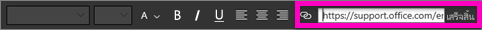
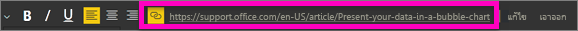
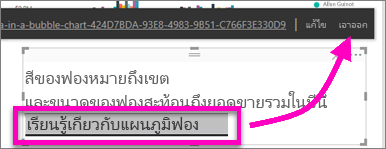

# เพิ่มการเชื่อมโยงหลายมิติไปยังกล่องข้อความในรายงานAdd a hyperlink to a text box in a report
คุณสามารถเพิ่มกล่องข้อความไปยังรายงานใน Power BI Desktop หรือบริการของ Power BIYou can add a text box to a report in Power BI Desktop or the Power BI service. คุณสามารถปักหมุดกล่องข้อความจากรายงานไปยังแดชบอร์ด หรือเพิ่มลงในแดชบอร์ดได้โดยตรงYou can pin a text box from a report to a dashboard, or add one directly to a dashboard. ไม่ว่ากล่องข้อความจะอยู่ที่ไหนคุณสามารถเพิ่มการเชื่อมโยงหลายมิติไปยังกล่องข้อความได้เสมอWherever the text box is, you can always add a hyperlink to it. บทความนี้แสดงวิธีการเพิ่มการเชื่อมโยงหลายมิติไปยังกล่องข้อความในรายงานThis article shows how to add a hyperlink to a text box in a report. 

ดู วิล ทอมป์สัน สร้างกล่องข้อความและเพิ่มการเชื่อมโยงหลายมิติไปยังกล่องข้อความWatch Will Thompson create a text box and add a hyperlink to it. 

<iframe width="560" height="315" src="https://www.youtube.com/embed/_3q6VEBhGew#t=0m55s" frameborder="0" allowfullscreen></iframe>

สำหรับข้อมูลเกี่ยวกับการเชื่อมโยงหลายมิติในตารางและเมทริกซ์ของ Power BI โปรดดู [เพิ่มการเชื่อมโยงหลายมิติไปยังตาราง](power-bi-hyperlinks-in-tables.md)For information on hyperlinks in Power BI tables and matrixes, see [Add hyperlinks to a table](power-bi-hyperlinks-in-tables.md). สำหรับข้อมูลเกี่ยวกับการเพิ่มกล่องข้อความลงในแดชบอร์ดของคุณ โปรดดู [เพิ่มรูปภาพ วิดีโอ และอื่นๆ ไปยังแดชบอร์ดของคุณ](service-dashboard-add-widget.md)For information on adding text boxes to your dashboard, see [Add images, videos, and more to your dashboard](service-dashboard-add-widget.md). 

## เมื่อต้องเพิ่มการเชื่อมโยงหลายมิติไปยังกล่องข้อความTo add a hyperlink to a text box
1. เปิดรายงาน [สร้างกล่องข้อความ](power-bi-reports-add-text-and-shapes.md) แล้วเพิ่มข้อความบางอย่างOpen a report, [create a text box](power-bi-reports-add-text-and-shapes.md), and add some text. 
2. เลือกข้อความที่มีอยู่ หรือเพิ่มข้อความใหม่ เพื่อใช้เป็นการเชื่อมโยงหลายมิติSelect existing text, or add new text to use as a hyperlink. 

   เมนูกล่องข้อความจะปรากฏขึ้นThe text box menu appears.
   
   
3. เลือกไอคอนการเชื่อมโยงหลายมิติSelect the hyperlink icon  บนเมนูกล่องข้อความon the text box menu.

   เขตข้อมูลการเชื่อมโยงหลายมิติจะปรากฏบนเมนูกล่องข้อความThe hyperlink field appears on the text box menu.

4. พิมพ์หรือวาง URL ลงในเขตข้อมูลการเชื่อมโยงหลายมิติ แล้วเลือก **เสร็จสิ้น**Type or paste the URL in the hyperlink field, and then select **Done**.
   
   
5. ทดสอบลิงก์:Test the link:  

   ก.a. วางเคอร์เซอร์ของคุณที่ใดก็ได้ในการเชื่อมโยงหลายมิติอันใหม่ในกล่องข้อความเพื่อแสดง URL ในเขตข้อมูลการเชื่อมโยงหลายมิติPlace your cursor anywhere in the new hyperlink in the text box to display the URL in the hyperlink field.  
     
      
   
      

   b.b. เลือก URL ในเขตข้อมูลการเชื่อมโยงหลายมิติที่จะเปิดหน้าเพจในหน้าต่างเบราว์เซอร์ใหม่Select the URL in the hyperlink field to open the page in a new browser window.

## หากต้องการนำการเชื่อมโยงหลายมิติออกTo remove the hyperlink
1. ในกล่องข้อความ ให้เลือกการเชื่อมโยงหลายมิติเพื่อไฮไลต์การเชื่อมโยงดังกล่าวIn the text box, select the hyperlink to highlight it.
   
     
2. เลือก **นำออก** จากเมนูกล่องข้อความSelect **Remove** from the text box menu. 

   Power BI Desktop จะนำการเชื่อมโยงหลายมิติออก แต่ปล่อยข้อความทิ้งไว้Power BI Desktop removes the hyperlink, but leaves the text.

## ขั้นตอนถัดไปNext steps
[กล่องข้อความและรูปร่างในรายงาน Power BIText boxes and shapes in Power BI reports](power-bi-reports-add-text-and-shapes.md)

มีคำถามเพิ่มเติมหรือไม่More questions? [ลองไปที่ชุมชน Power BI](https://community.powerbi.com/)[Try the Power BI Community](https://community.powerbi.com/).

