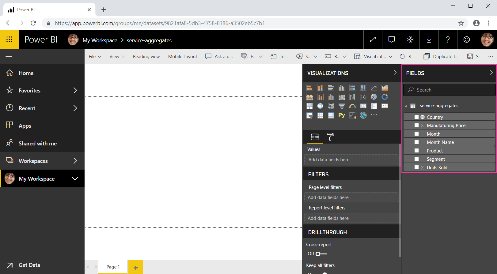
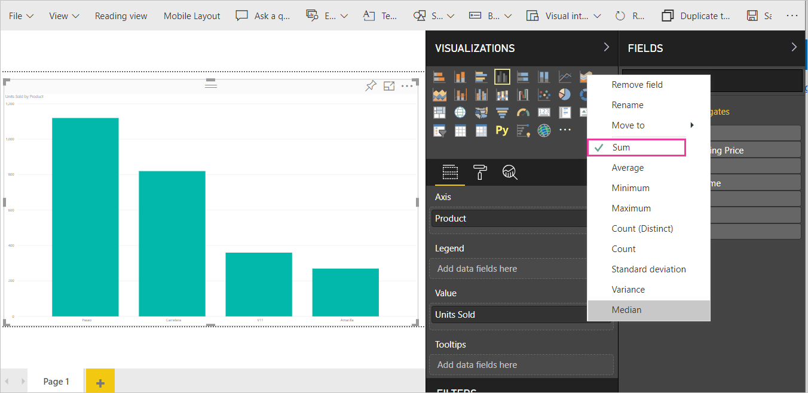
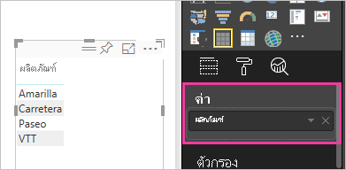
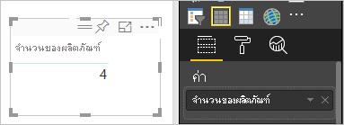
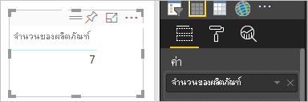
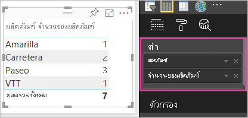

# ทำงานกับการรวม (ผลรวม ค่าเฉลี่ย และอื่นๆ) ในบริการของ Power BIWork with aggregates (sum, average, and so on) in the Power BI service

## การรวมคืออะไร?What is an aggregate?

ในบางครั้งคุณต้องการรวมค่าต่าง ๆ ทางคณิตศาสตร์ในข้อมูลของคุณSometimes you want to mathematically combine values in your data. การดำเนินการทางคณิตศาสตร์อาจเป็น การบวก การเฉลี่ย ค่าสูงสุด การนับจำนวน และอื่นๆThe mathematical operation could be sum, average, maximum, count, and so on. เมื่อคุณรวมค่าในข้อมูลของคุณ นั่นเรียกว่า *การรวม*When you combine values in your data, it's called *aggregating*. ส่วนผลลัพธ์ของการดำเนินการทางคณิตศาสตร์คือ *การรวม หรือ ค่ารวม*The result of that mathematical operation is an *aggregate*.

เมื่อบริการของ Power BI และ Power BI Desktop สร้างการแสดงผล อาจมีการรวมข้อมูลของคุณWhen Power BI service and Power BI Desktop create visualizations, they may aggregate your data. การรวมมักจะเป็นสิ่งที่คุณต้องการ แต่บางครั้งคุณอาจต้องการรวมค่าในวิธีอื่นOften the aggregate is just what you need, but other times you may want to aggregate the values in a different way.  ตัวอย่างเช่น การบวก กับ การหาค่าเฉลี่ยFor example, a sum versus an average. มีหลายวิธีที่จะจัดการ และเปลี่ยนการรวมที่ Power BI ใช้ในการแสดงผลข้อมูลด้วยภาพThere are several different ways to manage and change the aggregate Power BI uses in a visualization.

ก่อนอื่น มาดูที่ *ชนิด* ของข้อมูล เนื่องจากชนิดของข้อมูลกำหนดวิธีการและ Power BI สามารถรวมได้หรือไม่First, let's take a look at data *types* because the type of data determines how, and whether, Power BI can aggregate it.

## ชนิดของข้อมูลTypes of data

ชุดข้อมูลส่วนใหญ่มีชนิดของข้อมูลมากกว่าหนึ่งชนิดMost datasets have more than one type of data. ในระดับพื้นฐานสุด ข้อมูลเป็นตัวเลขหรือไม่เป็นAt the most basic level, the data is either numeric or it isn't. Power BI สามารถรวบรวมข้อมูลตัวเลขโดยใช้การบวก การหาค่าเฉลี่ย การนับจำนวน ค่าต่ำสุด ค่าความแปรปรวน และอีกมากมายPower BI can aggregate numeric data using a sum, average, count, minimum, variance, and much more. นอกจากนี้ บริการยังสามารถรวมข้อมูลที่เป็นข้อความ ซึ่งมักเรียกว่าข้อมูล *แบบจัดกลุ่ม* ได้อีกด้วยThe service can even aggregate textual data, often called *categorical* data. หากคุณพยายามที่จะรวมเขตข้อมูลแบบจัดกลุ่มโดยการใส่ไว้ในบักเก็ตที่เป็นตัวเลขเท่านั้น เช่น **ค่า** หรือ **คำแนะนำเครื่องมือ** Power BI จะนับจำนวนครั้งของแต่ละประเภท หรือนับจำนวนครั้งที่ไม่ซ้ำกันสำหรับแต่ละประเภทIf you try to aggregate a categorical field by placing it in a numeric-only bucket like **Values** or **Tooltips**, Power BI will count the occurrences of each category or count the distinct occurrences of each category. ข้อมูลชนิดพิเศษ เช่น วันที่ ก็มีตัวเลือกการรวมของตัวเอง เช่น: ก่อนสุด, หลังสุด, แรกสุด และสุดท้ายSpecial types of data, like dates, have a few of their own aggregate options: earliest, latest, first, and last.

ในตัวอย่างด้านล่าง:In the example below:

- **หน่วยที่ขาย** และ **ราคาผลิต** เป็นคอลัมน์ที่ประกอบด้วยข้อมูลตัวเลข**Units Sold** and **Manufacturing Price** are columns that contain numeric data

- **เซกเมนต์**, **ประเทศ**, **ผลิตภัณฑ์**, **เดือน** และ **ชื่อเดือน** เป็นข้อมูลตามประเภท**Segment**, **Country**, **Product**, **Month**, and **Month Name** contain categorical data

   

เมื่อสร้างการแสดงผลข้อมูลด้วยภาพใน บริการจะรวมเขตข้อมูลตัวเลข (ค่าเริ่มต้นคือ *การบวก*) ตามเขตข้อมูลแบบจัดกลุ่มบางตัวWhen creating a visualization in Power BI, the service will aggregate numeric fields (the default is *sum*) over some categorical field.  ตัวอย่างเช่น "หน่วยที่ขาย **ตามผลิตภัณฑ์** _", “หน่วยที่ขาย _\*_ตามเดือน_*_”, และ "ราคาผลิต _*_ตามเซ็กเมนต์_\*_"For example, "Units Sold ***by Product** _", "Units Sold _*_by Month_*_" and "Manufacturing Price _*_by Segment_\*_". Power BI อ้างอิงถึงเขตข้อมูลตัวเลขบางตัวเป็น _*หน่วยวัด*\*Power BI refers to some numeric fields as _\*measures\*\*. ซึ่งง่ายต่อการระบุหน่วยวัดในตัวแก้ไขรายงาน Power BI - รายการ **เขตข้อมูล** แสดงหน่วยวัดที่มีสัญลักษณ์ ∑ ถัดจากรายการเขตข้อมูลIt's easy to identify measures in the Power BI report editor -- The **Fields** list shows measures with the ∑ symbol next to them. โปรดดูหัวข้อ [ตัวแก้ไขรายงาน...ลองสำรวจดู](service-the-report-editor-take-a-tour.md) สำหรับข้อมูลเพิ่มเติมSee [The report editor... take a tour](service-the-report-editor-take-a-tour.md) for more info.

## ทำไมการรวมไม่ทำอย่างที่ฉันต้องการ?Why don't aggregates work the way I want them to?

การทำงานกับการรวมในบริการของ Power BI สามารถทำให้เกิดความสับสนได้Working with aggregates in Power BI service can be confusing. บางทีคุณอาจมีเขตข้อมูลตัวเลขและ Power BI จะไม่อนุญาตให้คุณเปลี่ยนแปลงการรวมMaybe you have a numeric field and Power BI won't let you change the aggregation. หรือบางทีคุณมีเขตข้อมูล เช่น ปี และคุณไม่ต้องการรวม คุณเพียงแค่ต้องการนับจำนวนครั้งที่ปรากฏOr maybe you have a field, like a year, and you don't want to aggregate it, you just want to count the number of occurrences.

โดยทั่วไปแล้ว ปัญหาเบื้องต้นคือการกำหนดเขตข้อมูลในชุดข้อมูลTypically, the underlying issue is the field definition in the dataset. บางทีเจ้าของชุดข้อมูลได้กำหนดเขตข้อมูลเป็นข้อความและนั่นเป็นเหตุผลว่าทำไม Power BI จึงไม่สามารถหาผลรวมหรือหาค่าเฉลี่ยได้Maybe the dataset owner defined the field as text and that explains why Power BI can't sum or average it. ขออภัยที่ [เฉพาะเจ้าของชุดข้อมูลเท่านั้น ที่สามารถเปลี่ยนการจัดประเภทของเขตข้อมูลได้](../transform-model/desktop-measures.md)Unfortunately, [only the dataset owner can change the way a field is categorized](../transform-model/desktop-measures.md). ดังนั้น หากคุณมีสิทธิ์ระดับเจ้าของชุดข้อมูล คุณจะสามารถแก้ไขปัญหานี้ได้ ทั้งในเดสก์ท็อปหรือโปรแกรมที่ใช้สร้างชุดข้อมูล (เช่น Excel)So if you have owner permissions to the dataset, either in Desktop or the program used to create the dataset (for example, Excel), you can fix this problem. มิฉะนั้น คุณจะต้องติดต่อเจ้าของชุดข้อมูลเพื่อขอความช่วยเหลือOtherwise, you'll need to contact the dataset owner for help.  

เรามีส่วนพิเศษที่ท้ายของบทความนี้ ที่เรียกว่า [**ข้อควรพิจารณาและการแก้ไขปัญหา**](#considerations-and-troubleshooting)There is a special section at the end of this article called [**Considerations and troubleshooting**](#considerations-and-troubleshooting). ซึ่งมีคำแนะนำและแนวทางIt provides tips and guidance. ถ้าคุณไม่พบคำตอบของคุณที่นั่น กรุณาโพสต์คำถามของคุณบน[ฟอรั่มชุมชน Power BI](https://community.powerbi.com)If you don't find your answer there, post your question on the [Power BI Community forum](https://community.powerbi.com). คุณจะได้รับคำตอบอย่างรวดเร็วจากทีมงาน Power BI โดยตรงYou'll get a quick response directly from the Power BI team.

## เปลี่ยนวิธีการรวมเขตข้อมูลตัวเลขChange how a numeric field is aggregated

สมมุติว่าคุณมีแผนภูมิที่หาผลรวม จำนวนหน่วยที่ขายได้สำหรับผลิตภัณฑ์ต่าง ๆ แต่คุณอยากได้ค่าเฉลี่ยแทนSay you have a chart that sums the units sold for different products, but you'd rather have the average.

1. สร้าง **แผนภูมิคอลัมน์แบบคลัสเตอร์** ที่ใช้หน่วยวัดและประเภทCreate a **Clustered column chart** that uses a measure and a category. ในตัวอย่างนี้ เรากำลังใช้หน่วยที่ขายเป็นผลิตภัณฑ์In this example, we're using Units Sold by Product.  ตามค่าเริ่มต้น Power BI สร้างแผนภูมิที่หาผลรวมหน่วยที่ขายได้ (ลากหน่วยวัดไปยังช่อง **ค่า**) สำหรับแต่ละผลิตภัณฑ์ (ลากประเภทไปยังช่อง **แกน**)By default, Power BI creates a chart that sums the units sold (drag the measure into the **Value** well) for each product (drag the category into the **Axis** well).

   

1. ในบานหน้าต่าง **การแสดงผลข้อมูลด้วยภาพ** ให้คลิกขวาที่หน่วยวัด แล้วเลือกชนิดการรวมที่คุณต้องการIn the **Visualizations** pane, right-click the measure, and select the aggregate type you need. ในกรณีนี้ เรากำลังเลือก **ค่าเฉลี่ย**In this case, we're selecting **Average**. ถ้าคุณไม่เห็นการรวมที่คุณต้องการ โปรดดูส่วน [**ข้อควรพิจารณาและการแก้ไขปัญหา**](#considerations-and-troubleshooting)If you don't see the aggregation you need, see the [**Considerations and troubleshooting**](#considerations-and-troubleshooting) section.

   

   > [!NOTE]
   > ตัวเลือกที่มีอยู่ในรายการแบบหล่นลงจะแตกต่างกันไปขึ้นอยู่กับ 1) เขตข้อมูลที่เลือกและ 2) วิธีที่เจ้าของชุดข้อมูลจัดประเภทเขตข้อมูลนั้นThe options available in the drop-down list will vary depending on 1) the field selected and 2) the way the dataset owner categorized that field.

1. การแสดงภาพของคุณ ตอนนี้รวมโดยการเฉลี่ยYour visualization is now using aggregated by average.

   

## วิธีการรวมข้อมูลของคุณWays to aggregate your data

บางตัวเลือกที่อาจมีให้สำหรับการรวมเขตข้อมูล:Some of the options that may be available for aggregating a field:

- **ไม่ต้องทำการสรุป****Do Not Summarize**. เมื่อเลือกตัวเลือกนี้ Power BI จะปฏิบัติต่อแต่ละค่าในเขตข้อมูลนั้นแยกกันและไม่ได้สรุปค่าWith this option chosen, Power BI treats each value in that field  separately and doesn't summarize them. ใช้ตัวเลือกนี้ถ้าคุณมีคอลัมน์ตัวเลข ID ที่บริการไม่ควรนำมารวมผลUse this option if you have a numeric ID column that the service shouldn't sum.

- **ผลรวม****Sum**. บวกค่าทั้งหมดในเขตข้อมูลนั้นAdds all the values in that field up.

- **ค่าเฉลี่ย****Average**. คำนวนค่าเฉลี่ยเลขคณิตของค่าทั้งหมดTakes an arithmetic mean of the values.

- **ต่ำสุด****Minimum**. แสดงค่าที่น้อยที่สุดShows the smallest value.

- **สูงสุด****Maximum**. แสดงค่าที่มากที่สุดShows the largest value.

- **นับจำนวน (ไม่เว้นว่าง)****Count (Not Blanks).** นับจำนวนของค่าในเขตข้อมูลนั้นที่ไม่ว่างเปล่าCounts the number of values in that field that aren't blank.

- **นับจำนวน (ค่าที่แตกต่างกัน)****Count (Distinct).** นับจำนวนค่าที่แตกต่างกันในเขตข้อมูลนั้นCounts the number of different values in that field.

- **ค่าเบี่ยงเบนมาตรฐาน****Standard deviation.**

- **ผลต่าง****Variance**.

- **ค่ากลาง****Median**.  แสดงค่ามัธยฐาน (ค่าตรงกลาง)Shows the median (middle) value. ค่านี้มีจำนวนรายการด้านบนและด้านล่างเท่ากันThis value has the same number of items above and below.  หากมีค่ากลางสองค่า Power BI จะหาค่าเฉลี่ยIf there are two medians, Power BI averages them.

ตัวอย่างเช่น ข้อมูลนี้:For example, this data:

| ประเทศCountry | ยอดเงินAmount |
|:--- |:--- |
| สหรัฐอเมริกาUSA |100100 |
| สหราชอาณาจักรUK |150150 |
| แคนาดาCanada |100100 |
| เยอรมนีGermany |125125 |
| ฝรั่งเศสFrance | |
| ญี่ปุ่นJapan |125125 |
| ออสเตรเลียAustralia |150150 |

จะให้ผลลัพธ์ดังต่อไปนี้:Would give the following results:

- **ไม่ต้องสรุป**: จะแสดงค่าแต่ละรายการแยกต่างหาก**Do Not Summarize**: Each value is shown separately

- **ผลรวม**: 750**Sum**: 750

- **ค่าเฉลี่ย**: 125**Average**: 125

- **สูงสุด**:  150**Maximum**:  150

- **ต่ำสุด**: 100**Minimum**: 100

- **นับจำนวน (ไม่เว้นว่าง):** 6**Count (Not Blanks):** 6

- **จำนวน (เขต):** 4**Count (Distinct):** 4

- **ค่าเบี่ยงเบนมาตรฐาน:** 20.4124145...**Standard deviation:** 20.4124145...

- **ผลต่าง:** 416.666...**Variance:** 416.666...

- **ค่ากลาง:** 125**Median:** 125

## สร้างการรวมโดยใช้เขตข้อมูลประเภท (ข้อความ)Create an aggregate using a category (text) field

คุณยังสามารถรวมเขตข้อมูลที่ไม่ใช่ตัวเลขYou can also aggregate a non-numeric field. ตัวอย่างเช่น ถ้าคุณมีเขตข้อมูลชื่อผลิตภัณฑ์ คุณสามารถเพิ่มเป็นค่า และตั้งค่าเป็น **นับจำนวน**, **นับจำนวนที่แตกต่างกัน**, **แรก** หรือ **สุดท้าย** ได้For example, if you have a product name field, you can add it as a value and then set it to **Count**, **Distinct count**, **First**, or **Last**.

1. ลากเขตข้อมูล **ผลิตภัณฑ์** ลงในช่อง **ค่า**Drag the **Product** field into the **Values** well. โดยทั่วไป ช่อง **ค่า** มักใช้กับเขตข้อมูลตัวเลขThe **Values** well is typically used for numeric fields. Power BI รู้ว่าเขตข้อมูลนี้เป็นเขตข้อมูลข้อความ ตั้งค่าการรวมเป็น **ไม่ต้องทำการสรุป** และแสดงตารางที่มีหนึ่งคอลัมน์ให้คุณPower BI recognizes that this field is a text field, sets the aggregate to **Do not summarize**, and presents you with a single-column table.

   

1. ถ้าคุณเปลี่ยนการรวมจากค่าเริ่มต้น **ไม่ต้องทำการสรุป** ไปเป็น **นับจำนวน (ค่าที่แตกต่างกัน)** Power BI จะนับจำนวนของผลิตภัณฑ์ที่แตกต่างกันIf you change the aggregation from the default **Do not summarize** to **Count (Distinct)**, Power BI counts the number of different products. ในกรณีนี้ มีค่าเป็นสี่In this case, there are four.
  
   

1. และ ถ้าคุณเปลี่ยนการรวมเป็น **นับจำนวน** Power BI จะนับจำนวนทั้งหมดAnd if you change the aggregation to **Count**, Power BI counts the total number. ในกรณีนี้ มี **ผลิตภัณฑ์** เจ็ดรายการIn this case, there are seven entries for **Product**.

   

1. Power BI จะแบ่งการนับจำนวนตามผลิตภัณฑ์โดยการลากเขตข้อมูลเดียวกัน (ในกรณีนี้คือ **ผลิตภัณฑ์**) ลงในช่อง **ค่า** และปล่อยให้เป็นการรวมค่าเริ่มต้น **ไม่ต้องทำการสรุป**By dragging the same field (in this case **Product**) into the **Values** well, and leaving the default aggregation **Do not summarize**, Power BI breaks down the count by product.

   

## ข้อควรพิจารณาและการแก้ไขปัญหาConsiderations and Troubleshooting

Q:  เหตุใดฉันจึงไม่มีตัวเลือกให้ **ไม่ต้องทำการสรุป**?Q:  Why don't I have a **Do not summarize** option?

A:  เขตข้อมูลที่คุณเลือกมีแนวโน้มว่าเป็นหน่วยวัดที่คำนวณในแบบจำลองหลายมิติหรือหน่วยวัดที่สร้างขึ้นใน Excel หรือ [Power BI Desktop](../transform-model/desktop-measures.md)A:  The field you've selected is likely a calculated measure in a multidimensional model, or a measure created in Excel or [Power BI Desktop](../transform-model/desktop-measures.md). แต่ละหน่วยวัดจะมีสูตรคำนวณที่ตายตัวของตนเองEach measure has its own hard-coded formula. คุณไม่สามารถเปลี่ยนการรวมที่ Power BI ใช้ได้You can’t change the aggregation Power BI uses. ตัวอย่างเช่น ถ้าใช้ผลรวม จะต้องเป็นผลรวมเท่านั้นFor example, if it’s a sum, it can only be a sum. รายการ **เขตข้อมูล** แสดง *หน่วยวัด* ด้วยสัญลักษณ์เครื่องคิดเลขThe **Fields** list shows *measures* with the calculator symbol.

Q:  เขตข้อมูลฉัน **เป็น** ตัวเลข ทำไมฉันมีตัวเลือกแค่ **นับจำนวน** และ **นับจำนวนที่แตกต่างกัน**?Q:  My field **is** numeric, why are my only choices **Count** and **Distinct count**?

คำตอบที่ 1:  เหตุผลที่เป็นไปได้คือ เจ้าชุดข้อมูล *ไม่* จัดประเภทเขตข้อมูลเป็นตัวเลขA1:  The likely explanation is that the dataset owner has *not* classified the field as a number. ตัวอย่างเช่น ถ้าชุดข้อมูลมีเขตข้อมูล **ปี** เจ้าของชุดข้อมูลอาจจัดประเภทค่าเป็นข้อความFor example, if a dataset has a **year** field, the dataset owner may categorize the value as text. ซึ่งอาจเป็นไปได้ว่า Power BI จะนับเขตข้อมูล **ปี** (ตัวอย่างเช่น จำนวนคนที่เกิดในปี 1974)It's more likely that Power BI will count the **year** field (for example, number of people born in 1974). ซึ่งมีโอกาสน้อยที่ Power BI จะหาผลรวมหรือเฉลี่ยIt's less likely that Power BI will sum or average it. ถ้าคุณเป็นเจ้าของ คุณสามารถเปิดชุดข้อมูลใน Power BI Desktop และใช้แท็บ **การสร้างแบบจำลอง** เพื่อเปลี่ยนชนิดข้อมูลได้If you're the owner, you can open the dataset in Power BI Desktop and use the **Modeling** tab to change the data type.

คำตอบที่ 2: ถ้าเขตข้อมูลมีไอคอนเครื่องคิดเลข นั่นหมายความว่าเป็น *หน่วยวัด*A2: If the field has a calculator icon, that means it's a *measure*. แต่ละหน่วยวัดมีสูตรของตนเองที่เฉพาะเจ้าของชุดข้อมูลเท่านั้นที่สามารถเปลี่ยนแปลงได้Each measure has its own formula that only the dataset owner can change. การคำนวณที่ Power BI ใช้อาจเป็นการรวมอย่างง่าย เช่น ค่าเฉลี่ย หรือผลรวมThe calculation Power BI uses may be a simple aggregation like an average or sum. ซึ่งยังอาจเป็นการคำนวณที่ซับซ้อนขึ้น เช่น "เปอร์เซ็นต์ของผลกระทบต่อประเภทหลัก" หรือ "ผลรวมสะสมตั้งแต่ต้นปี"It may also be something more complicated like a "percent of contribution to parent category" or "running total since start of the year". Power BI จะไม่หาผลรวมหรือค่าเฉลี่ยของผลลัพธ์Power BI isn't going to sum or average the results. แต่จะคำนวณใหม่ (โดยใช้สูตรคำนวณที่ตายตัว) สำหรับแต่ละจุดข้อมูลInstead, it will just recalculate (using the hard-coded formula) for each data point.

คำตอบที่ 3:  อีกความเป็นไปได้คือ คุณได้ปล่อยเขตข้อมูลลงใน *บักเก็ต* ที่อนุญาตให้ใส่ค่าที่เป็นประเภทเท่านั้นA3:  Another possibility is that you've dropped the field into a *bucket* that only allows categorical values.  ในกรณีนั้น ตัวเลือกของคุณจะมีแค่ นับจำนวนและนับจำนวนที่แตกต่างกันเท่านั้นIn that case, your only options will be count and distinct count.

คำตอบที่ 4:  และความเป็นไปได้ที่สี่คือ คุณกำลังใช้เขตข้อมูลสำหรับแกนA4:  And a fourth possibility is that you're using the field for an axis. ตัวอย่างเช่น บนแกนแผนภูมิแท่ง Power BI แสดงหนึ่งแท่งสำหรับแต่ละค่าที่ไม่ซ้ำกัน จะไม่มีรวมค่าของเขตข้อมูลเลยOn a bar chart axis, for example, Power BI shows one bar for each distinct value -- it doesn't aggregate the field values at all.

>[!NOTE]
>ข้อยกเว้นของกฎนี้คือ แผนภูมิกระจาย ซึ่ง *จำเป็นต้องมี* การรวมค่าสำหรับแกน X และ YThe exception to this rule is scatter charts, which *require* aggregated values for the X and Y axes.

Q:  เหตุใดฉันจึงไม่สามารถรวมเขตข้อมูลข้อความสำหรับแหล่งข้อมูล SQL Server Analysis Services (SSAS) ได้?Q:  Why can't I aggregate text fields for SQL Server Analysis Services (SSAS) data sources?

A:  การเชื่อมต่อแบบสดไปยังโมเดลหลายมิติของ SSAS ไม่อนุญาตให้มีการรวมฝั่งไคลเอ็นต์ใด ๆ รวมถึงครั้งแรก ครั้งสุดท้าย เฉลี่ย ต่ำสุด สูงสุดและผลรวมA:  Live connections to SSAS multidimensional models don't allow any client-side aggregations, including first, last, avg, min, max, and sum.

Q:  ฉันมีแผนภูมิกระจาย และฉันต้องการให้เขตข้อมูลของฉัน *ไม่* รวมQ:  I have a scatter chart and I want my field to *not* aggregate.  อย่างไร?How?

A:  เพิ่มเขตข้อมูลไปยังบักเก็ต **รายละเอียด** และไม่ใส่ในบักเก็ตแกน X หรือ YA:  Add the field to the **Details** bucket and not to the X or Y axes buckets.

Q:  เมื่อฉันเพิ่มเขตข้อมูลตัวเลขลงในการแสดงภาพ ส่วนใหญ่ค่าเริ่มต้นคือผลรวม แต่บางทีค่าเริ่มต้นเป็นค่าเฉลี่ย บางทีเป็นการนับจำนวน หรือการรวมอื่น ๆQ:  When I add a numeric field to a visualization, most of them default to sum but some default to average or count or some other aggregation.  เหตุใดค่าเริ่มต้นจึงไม่ได้เหมือนกันตลอด?Why isn't the default aggregation always the same?

A:  เจ้าของชุดข้อมูลสามารถตั้งค่าการสรุปเริ่มต้นสำหรับแต่ละเขตข้อมูลได้A:  Dataset owners can set the default summarization for each field. หากคุณเป็นเจ้าของชุดข้อมูล ให้เปลี่ยนการสรุปเริ่มต้นในแท็บ **การสร้างแบบจำลอง** ของ Power BI DesktopIf you're a dataset owner, change the default summarization in the **Modeling** tab of Power BI Desktop.

Q:  ฉันเป็นเจ้าของชุดข้อมูล และฉันต้องการให้แน่ใจว่า เขตข้อมูลหนึ่งจะไม่มีการรวมเลยQ:  I'm a dataset owner and I want to ensure that a field is never aggregated.

A:  ใน Power BI Desktop ในแท็บ **การวางรูปแบบ** ตั้งค่า **ชนิดข้อมูล** ให้เป็น **ข้อความ**A:  In Power BI Desktop, in the **Modeling** tab, set **Data type** to **Text**.

Q:  ฉันไม่เห็น **ไม่ต้องทำการสรุป** เป็นตัวเลือกในรายการแบบหล่นของฉันQ:  I don't see **Do not summarize** as an option in my drop-down list.

A:  ลองเอาเขตข้อมูลออก และเพิ่มกลับเข้าไปอีกครั้งA:  Try removing the field and adding it back in.

มีคำถามเพิ่มเติมหรือไม่More questions? [ลองไปที่ชุมชน Power BITry the Power BI Community](https://community.powerbi.com/)
