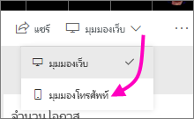
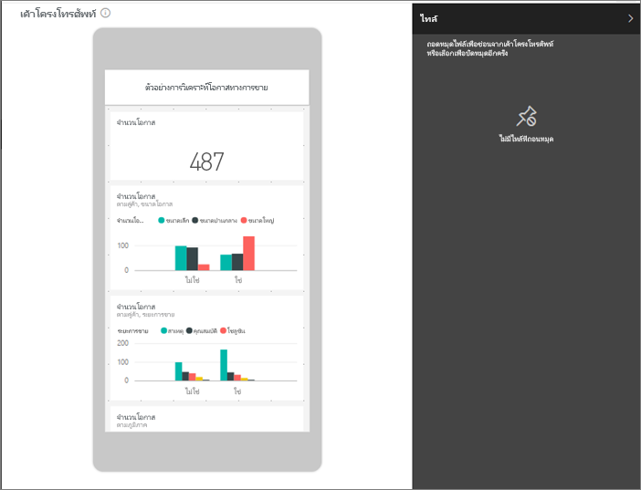
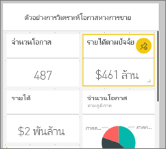
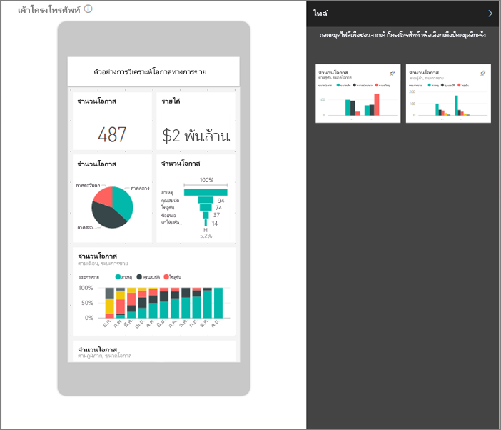
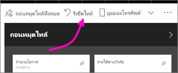

# ปรับแดชบอร์ดให้เหมาะสมสำหรับโทรศัพท์มือถือ-Power BI 
เมื่อคุณดูแดชบอร์ดในโหมดแนวตั้งบนโทรศัพท์ของคุณ คุณจะสังเกตเห็นแดชบอร์ดที่เป็นแบบซ้อนถัดๆกัน ที่มีขนาดเดียวกันทั้งหมด ใน Power BI service คุณสามารถสร้างมุมมองของแดชบอร์ดโดยเฉพาะสำหรับโหมดแนวตั้งของคุณ เมื่อคุณเปิดใช้งานมุมมองทางโทรศัพท์เมื่อคุณหันโทรศัพท์ไปทางทางด้านข้าง คุณจะเห็นแดชบอร์ดถูกวางไว้ในบริการ

คุณกำลังค้นหาข้อมูลเกี่ยวกับการดูแดชบอร์ดบนอุปกรณ์เคลื่อนที่แทนใช่หรือไม่ ลองใช้การเริ่มต้นใช้งานด่วนแทนที่[ แดชบอร์ดและรายงานในแอป Power BI สำหรับอุปกรณ์เคลื่อนที่](../consumer/mobile/mobile-apps-quickstart-view-dashboard-report.md)

> [!NOTE]
> เมื่อคุณแก้ไขมุมมองโทรศัพท์ ทุกคนที่ดูแดชบอร์ดบนโทรศัพท์ของคุณสามารถดูการเปลี่ยนแปลงที่คุณทำในแบบเรียลไทม์ ตัวอย่างเช่น ถ้าคุณถอนหมุดไทล์ทั้งหมดในมุมมองโทรศัพท์ของแดชบอร์ด แดชบอร์ดบนโทรศัพท์จะไม่มีไทล์ทันที 
> 
> 

## สร้างมุมมองโทรศัพท์ของแดชบอร์ด
1. ใน Power BI service เปิดแดชบอร์ด
2. เลือกลูกศรที่อยู่ถัดจาก **มุมมองเว็บ** ที่มุมบนขวา > เลือก **มุมมองโทรศัพท์**

    

    ถ้าคุณไม่ได้เป็นเจ้าของแดชบอร์ด คุณจะไม่เห็นตัวเลือกนี้

    

    มุมมองแก้ไขแดชบอร์ดโทรศัพท์เปิดขึ้น ที่นี่คุณสามารถถอนการปักหมุด ปรับขนาด และจัดเรียงไทล์ให้พอดีกับมุมมองโทรศัพท์ได้ แดชบอร์ดเวอร์ชันบนเว็บไม่เปลี่ยนแปลง

1. เลือกไทล์เพื่อลาก ปรับขนาดหรือถอนหมุด คุณสังเกตเห็นว่า ไทล์อื่นจะย้ายออกในขณะที่คุณลากไทล์
   
    
   
    หมุดไทล์ที่ถูกถอนจะไปอยู่ในบานหน้าต่างไทล์ที่ถูกถอน ซึ่งเป็นที่ที่พวกมันอยูเว้นแต่ว่าคุณเพิ่มมันกลับมา
   
    
2. ถ้าคุณเปลี่ยนใจ ให้เลือก **รีเซ็ตไทล์** เพื่อเปลี่ยนเป็นขนาดและลำดับเดิมของพวกมัน
   
    
   
    เพียงแค่เปิดมุมมองแก้ไขของโทรศัพท์ใน Power BI service เปลี่ยนแปลงขนาดและรูปร่างของไทล์บนโทรศัพท์ของคุณเล็กน้อย ดังนั้นเพื่อเปลี่ยนแดชบอร์ดให้อยู่ในสถานะเช่นเดียวกับก่อนที่คุณได้เปิดแก้ไขมุมมองโทรศัพท์ ให้เลือก **รีเซ็ตไทล์**
3. เมื่อคุณพอใจกับเค้าโครงแดชบอร์ดโทรศัพท์ ให้เลือกลูกศรที่อยู่ถัดจาก **มุมมองโทรศัพท** ที่มุมบนขวา > เลือก **มุมมองเว็บ**
   
    Power BI จะบันทึกเค้าโครงโทรศัพท์โดยอัตโนมัติ

## ขั้นตอนถัดไป
* [สร้างรายงานที่ปรับให้เหมาะสมสำหรับแอปมือถือ Power BI](desktop-create-phone-report.md)
* [สร้างภาพแบบตอบสนองที่ปรับให้เหมาะสมกับทุกขนาด](../visuals/power-bi-report-visualizations.md)
* มีคำถามเพิ่มเติมหรือไม่ [ลองถามชุมชน Power BI](https://community.powerbi.com/)
