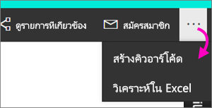

# สร้างคิวอาร์โค้ด ให้แก่รายงานที่ใช้ในแอปสำหรับอุปกรณ์เคลื่อนที่ของ Power BICreate a QR code for a report in Power BI to use in the mobile apps
คิวอาร์โค้ดใน Power BI สามารถเชื่อมต่อทุกอย่างในโลกแห่งความจริง เข้ากับข้อมูลที่เกี่ยวข้องกับ BI่ได้โดยตรง &#151; โดยที่ไม่จำเป็นต้องใช้การค้นหาQR codes in Power BI can connect anything in the real world directly to related BI information &#151; no navigation or search needed.

คุณสามารถสร้างคิวอาร์โค้ดในบริการ Power BI ให้แก่รายงานทุกชนิด แม้แต่รายงานคุณไม่สามารถแก้ไขได้You can create a QR code in the Power BI service for any report, even for a report you can't edit. จากนั้น คุณใส่คิวอาร์โค้ดในตำแหน่งหลักThen you place the QR code in a key location. ตัวอย่างเช่น คุณสามารถวางลงในอีเมล หรือพิมพ์ออกมาและวางในตำแหน่งที่เจาะจงFor example, you could paste it in an email, or print it out and paste it in a specific location. 

เพื่อนร่วมงานที่คุณแชร์รายงานด้วยจะสามารถสแกนคิวอาร์โค้ดเพื่อเข้าถึงรายงาน ได้จาก[อุปกรณ์เคลื่อนที่ของพวกเขา](../consumer/mobile/mobile-apps-qr-code.md)Colleagues you've shared the report with can scan the QR code for access to the report, right from [their mobile device](../consumer/mobile/mobile-apps-qr-code.md). พวกเขาสามารถใช้ที่สแกนคิวอาร์โค้ดที่อยู่ในแอป Power BI หรือที่สแกนคิวอาร์โค้ดอื่น ๆ ที่ติดตั้งบนอุปกรณ์ของพวกเขาThey can use either the QR code scanner located in the Power BI app, or any other QR scanner installed on their device. พวกเขายังสามารถ[สแกนคิวอาร์โค้ดด้วย Power BI สำหรับแอปความเป็นจริงผสม](../consumer/mobile/mobile-hololens2-app.md#open-reports-with-qr-codes)ได้อีกด้วยThey can also [scan a report QR code with the Power BI for Mixed Reality app](../consumer/mobile/mobile-hololens2-app.md#open-reports-with-qr-codes).

## สร้างคิวอาร์โค้ดสำหรับรายงานCreate a QR code for a report
1. เปิดรายงานใน Power BIOpen a report in the Power BI service.
2. เลือก **ตัวเลือกเพิ่มเติม** (...) ที่มุมขวาบน แล้วเลือก **สร้างคิวอาร์โค้ด**Select **More options** (...) in the top-right corner and select **Generate QR code**. 
   
    
3. กล่องโต้ตอบที่มีคิวอาร์โค้ดจะปรากฏขึ้นA dialog box with the QR code appears. 
   
    
4. จากที่นี่ คุณสามารถสแกนคิวอาร์โค้ด หรือดาวน์โหลด และบันทึกเพื่อให้คุณสามารถ:From here you can scan the QR code or download and save it so you can: 
   
   * เพิ่มคิวอาร์โค้ดลงในอีเมลหรือเอกสารอื่น ๆ หรือAdd it to an email or other document, or 
   * พิมพคิวอาร์โค้ดและวางในตำแหน่งที่เจาะจงPrint it and place it in a specific location. 

## พิมพ์คิวอาร์โค้ดPrint the QR code
Power BI สร้างคิวอาร์โค้ด เป็นไฟล์ JPG พร้อมที่จะพิมพ์Power BI generates the QR code as a JPG file, ready to print. 

1. เลือก **ดาวน์โหลด** แล้ว เปิดไฟล์ JPG บนคอมพิวเตอร์ที่เชื่อมต่อกับเครื่องพิมพ์Select **Download**, then open the JPG file on a computer connected to a printer.  
   
   ไฟล์ JPG จะมีชื่อเหมือนกันเป็นไทลThe JPG file has the same name as the tile. ตัวอย่างเช่น “Sale and Marketing Sample.jpg”For example, "Sales and Marketing Sample.jpg".
   
1. พิมพ์ไฟล์ที่ขนาด 100 เปอร์เซ็นต์ หรือ “ขนาดตามจริง”Print the file at 100% or “actual size”.  
2. ตัดคิวอาร์โค้ดโดยรอบตามของของแผ่นงาน และใช้กาวติดไว้ตรงบริเวณที่เกี่ยวข้องกับรายงานนั้น ๆCut out the QR code along its edge and glue it to a place relevant to the report. 

## ขั้นตอนถัดไปNext steps
* [เชื่อมต่อกับข้อมูล Power BI จากโลกแห่งความจริง](../consumer/mobile/mobile-apps-data-in-real-world-context.md)ด้วยแอปโทรศัพท์เคลื่อนที่[Connect to Power BI data from the real world](../consumer/mobile/mobile-apps-data-in-real-world-context.md) with the mobile apps
* [สแกนคิวอาร์โค้ดของ Power BI จากอุปกรณ์เคลื่อนที่ของคุณScan a Power BI QR code from your mobile device](../consumer/mobile/mobile-apps-qr-code.md)
* [สร้างคิวอาร์โค้ด สำหรับไทล์Create a QR code for a tile](service-create-qr-code-for-tile.md)
* มีคำถามหรือไม่Questions? [ลองถามชุมชน Power BITry asking the Power BI Community](https://community.powerbi.com/)
