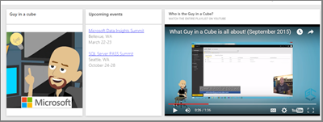

# <a name="add-images-videos-and-more-to-your-dashboard"></a><span data-ttu-id="c9900-103">เพิ่มรูปภาพ วิดีโอ การสตรีมข้อมูลไปยังแดชบอร์ดของคุณ</span><span class="sxs-lookup"><span data-stu-id="c9900-103">Add images, videos, and more to your dashboard</span></span>

<span data-ttu-id="c9900-104">ด้วยการเพิ่มไทล์ลงในแดชบอร์ดของคุณ คุณสามารถวางรูปภาพ กล่องข้อความ วิดีโอ ข้อมูลการสตรีม หรือโค้ดของเว็บลงบนแดชบอร์ดของคุณได้</span><span class="sxs-lookup"><span data-stu-id="c9900-104">By adding a tile to your dashboard, you can place an image, text box, video, streaming data, or web code on your dashboard.</span></span> 

<span data-ttu-id="c9900-105">ดู อแมนดา เพิ่มไทล์ลงในแดชบอร์ด</span><span class="sxs-lookup"><span data-stu-id="c9900-105">Watch Amanda add tiles to a dashboard.</span></span>

   
<iframe width="560" height="315" src="https://www.youtube.com/embed/e2PD8m1Q0vU" frameborder="0" allowfullscreen></iframe>


## <a name="add-an-image-video-or-other-tile"></a><span data-ttu-id="c9900-106">เพิ่มรูปภาพ วิดีโอ หรือไทล์อื่นๆ</span><span class="sxs-lookup"><span data-stu-id="c9900-106">Add an image, video, or other tile</span></span>
<span data-ttu-id="c9900-107">คุณสามารถเพิ่มรูปภาพ กล่องข้อความ วิดีโอ ข้อมูล การสตรีม หรือโค้ดของเว็บลงบนแดชบอร์ดได้โดยตรง</span><span class="sxs-lookup"><span data-stu-id="c9900-107">You can add an image, text box, video, streaming data, or web code directly to your dashboard.</span></span>

1. <span data-ttu-id="c9900-108">เลือก **เพิ่มไทล์** จากแถบเมนูด้านบนของแดชบอร์ดของคุณ</span><span class="sxs-lookup"><span data-stu-id="c9900-108">Select **Add tile** from the top menu bar of your dashboard.</span></span> <span data-ttu-id="c9900-109">ขึ้นอยู่กับข้อจำกัดด้านพื้นที่ คุณอาจเห็นเฉพาะเครื่องหมายบวก  เท่านั้น</span><span class="sxs-lookup"><span data-stu-id="c9900-109">Depending on space limitations, you may see only the plus  sign.</span></span>
   
    
2. <span data-ttu-id="c9900-111">เลือกชนิดของไทล์ที่ต้องเพิ่ม:</span><span class="sxs-lookup"><span data-stu-id="c9900-111">Select which type of tile to add:</span></span> 

    <span data-ttu-id="c9900-112">**[เนื้อหาเว็บ](#add-web-content)**</span><span class="sxs-lookup"><span data-stu-id="c9900-112">**[Web content](#add-web-content)**</span></span>

    <span data-ttu-id="c9900-113">**[รูปภาพ](#add-an-image)**</span><span class="sxs-lookup"><span data-stu-id="c9900-113">**[Image](#add-an-image)**</span></span>

    <span data-ttu-id="c9900-114">**[กล่องข้อความ](#add-a-text-box-or-dashboard-heading)**</span><span class="sxs-lookup"><span data-stu-id="c9900-114">**[Text box](#add-a-text-box-or-dashboard-heading)**</span></span>

    <span data-ttu-id="c9900-115">**[วิดีโอ](#add-a-video)**</span><span class="sxs-lookup"><span data-stu-id="c9900-115">**[Video](#add-a-video)**</span></span>

    <span data-ttu-id="c9900-116">**[ข้อมูลการสตรีมแบบกำหนดเอง](#add-streaming-data)**</span><span class="sxs-lookup"><span data-stu-id="c9900-116">**[Custom streaming data](#add-streaming-data)**</span></span>
   
    

## <a name="add-an-image"></a><span data-ttu-id="c9900-118">เพิ่มไฟล์รูปภาพ</span><span class="sxs-lookup"><span data-stu-id="c9900-118">Add an image</span></span>
<span data-ttu-id="c9900-119">หากคุณต้องการเพิ่มโลโก้บริษัทหรือภาพอื่น ๆ ลงในแดชบอร์ดของคุณ คุณสามารถบันทึกไฟล์ภาพออนไลน์และเชื่อมโยงไปยังแดชบอร์ดได้</span><span class="sxs-lookup"><span data-stu-id="c9900-119">If you want to add your company logo or some other image to your dashboard, you save the image file online and link to it.</span></span> <span data-ttu-id="c9900-120">ตรวจสอบให้แน่ใจว่าไม่จำเป็นต้องใช้ข้อมูลรับรองความปลอดภัยเพื่อเข้าถึงไฟล์ภาพ</span><span class="sxs-lookup"><span data-stu-id="c9900-120">Make sure security credentials aren't required to access the image file.</span></span> <span data-ttu-id="c9900-121">ตัวอย่างเช่นเนื่องจาก OneDrive และ SharePoint จำเป็นต้องรับรองความถูกต้อง ดังนั้นรูปภาพที่เก็บไว้จะไม่สามารถเพิ่มลงในแดชบอร์ดด้วยแนวทางนี้ได้</span><span class="sxs-lookup"><span data-stu-id="c9900-121">For example, because OneDrive and SharePoint require authentication, images stored there can't be added to a dashboard this way.</span></span>  

1. <span data-ttu-id="c9900-122">จากหน้าต่าง **เพิ่มไทล์** เลือก **รูปภาพ** > **ถัดไป**</span><span class="sxs-lookup"><span data-stu-id="c9900-122">From the **Add tile** window, select **Image** > **Next**.</span></span>

2. <span data-ttu-id="c9900-123">จากหน้าต่าง **เพิ่มไทล์รูปภาพ** เพิ่มข้อมูลรูปภาพ:</span><span class="sxs-lookup"><span data-stu-id="c9900-123">From the **Add image tile** window, add the image information:</span></span>   
   
   <span data-ttu-id="c9900-124">ก.</span><span class="sxs-lookup"><span data-stu-id="c9900-124">a.</span></span> <span data-ttu-id="c9900-125">เมื่อต้องการแสดงชื่อเรื่องเหนือรูปภาพ ให้เลือก **แสดงชื่อเรื่องและคำบรรยาย** แล้วป้อน **ชื่อเรื่อง** และ **คำบรรยาย** ทางเลือก</span><span class="sxs-lookup"><span data-stu-id="c9900-125">To display a title above the image, select **Display title and subtitle** and enter a **Title** and an optional **Subtitle**.</span></span>

   <span data-ttu-id="c9900-126">b.</span><span class="sxs-lookup"><span data-stu-id="c9900-126">b.</span></span> <span data-ttu-id="c9900-127">ป้อน **URL** ของรูปภาพ</span><span class="sxs-lookup"><span data-stu-id="c9900-127">Enter the image **URL**.</span></span>

   <span data-ttu-id="c9900-128">c.</span><span class="sxs-lookup"><span data-stu-id="c9900-128">c.</span></span> <span data-ttu-id="c9900-129">เมื่อต้องการทำไทล์การเชื่อมโยงหลายมิติ ให้เลือก **กำหนดค่าการเชื่อมโยงหลายมิติแบบกำหนดเอง** และป้อน **URL**</span><span class="sxs-lookup"><span data-stu-id="c9900-129">To make the tile a hyperlink, select **Set custom link** and enter the **URL**.</span></span> 

      <span data-ttu-id="c9900-130">เมื่อเพื่อนร่วมงานคลิกที่รูปภาพหรือชื่อเรื่องนี้ พวกเขาจะถูกนำไปยัง URL นี้</span><span class="sxs-lookup"><span data-stu-id="c9900-130">When colleagues click the image or title, they'll be taken to this URL.</span></span>

   <span data-ttu-id="c9900-131">d.</span><span class="sxs-lookup"><span data-stu-id="c9900-131">d.</span></span> <span data-ttu-id="c9900-132">เลือก **นำไปใช้**</span><span class="sxs-lookup"><span data-stu-id="c9900-132">Select **Apply**.</span></span> 

      

3. <span data-ttu-id="c9900-134">บนแดชบอร์ด ปรับขนาด และย้ายรูปภาพตามความจำเป็น</span><span class="sxs-lookup"><span data-stu-id="c9900-134">On the dashboard, resize and move the image as needed.</span></span>
     
     

## <a name="add-a-text-box-or-dashboard-heading"></a><span data-ttu-id="c9900-136">เพิ่มข้อความกล่องหรือแดชบอร์ดหัวเรื่อง</span><span class="sxs-lookup"><span data-stu-id="c9900-136">Add a text box or dashboard heading</span></span>

<span data-ttu-id="c9900-137">เมื่อต้องเพิ่มหัวเรื่องแดชบอร์ด พิมพ์หัวเรื่องของคุณในกล่องข้อความ และเพิ่มฟอนต์</span><span class="sxs-lookup"><span data-stu-id="c9900-137">To add a dashboard heading, type your heading in the text box and increase the font.</span></span>

1. <span data-ttu-id="c9900-138">จากหน้าต่าง **เพิ่มไทล์** เลือก **กล่องข้อความ** > **ถัดไป**</span><span class="sxs-lookup"><span data-stu-id="c9900-138">From the **Add tile** window, select **Text box** > **Next**.</span></span>

2. <span data-ttu-id="c9900-139">จัดรูปแบบข้อความ:</span><span class="sxs-lookup"><span data-stu-id="c9900-139">Format the text box:</span></span>
   
   <span data-ttu-id="c9900-140">ก.</span><span class="sxs-lookup"><span data-stu-id="c9900-140">a.</span></span> <span data-ttu-id="c9900-141">เมื่อต้องการแสดงชื่อเรื่องเหนือกล่องข้อความ ให้เลือก **แสดงชื่อเรื่องและคำบรรยาย** แล้วป้อน **ชื่อเรื่อง** และ **คำบรรยาย** ทางเลือก</span><span class="sxs-lookup"><span data-stu-id="c9900-141">To display a title above the text box, select **Display title and subtitle** and enter a **Title** and an optional **Subtitle**.</span></span>

   <span data-ttu-id="c9900-142">b.</span><span class="sxs-lookup"><span data-stu-id="c9900-142">b.</span></span> <span data-ttu-id="c9900-143">ป้อนและจัดรูปแบบ **เนื้อหา** สำหรับกล่องข้อความ</span><span class="sxs-lookup"><span data-stu-id="c9900-143">Enter and format **Content** for the text box.</span></span>  

   <span data-ttu-id="c9900-144">c.</span><span class="sxs-lookup"><span data-stu-id="c9900-144">c.</span></span> <span data-ttu-id="c9900-145">อีกทางหนึ่งคือ ตั้งค่าการเชื่อมโยงแบบกำหนดเองสำหรับชื่อเรื่อง</span><span class="sxs-lookup"><span data-stu-id="c9900-145">Optionally, set a custom link for the title.</span></span> <span data-ttu-id="c9900-146">ลิงก์แบบกำหนดเองสามารถไซต์ภายนอก หรือในแดชบอร์ด หรือรายงานในพื้นที่ทำงานของคุณ</span><span class="sxs-lookup"><span data-stu-id="c9900-146">A custom link can be an external site or a dashboard or report in your workspace.</span></span> <span data-ttu-id="c9900-147">อย่างไรก็ตาม ในตัวอย่างนี้ เราได้เพิ่มการเชื่อมโยงหลายมิติภายในกล่องข้อความโดยตรง ดังนั้นจึงไม่ต้องเลือก **กำหนดค่าการเชื่อมโยงหลายมิติแบบกำหนดเอง**</span><span class="sxs-lookup"><span data-stu-id="c9900-147">However, in this example we've added hyperlinks within the text box itself, so we'll leave **Set custom link** unchecked.</span></span>

   <span data-ttu-id="c9900-148">d.</span><span class="sxs-lookup"><span data-stu-id="c9900-148">d.</span></span> <span data-ttu-id="c9900-149">เลือก **นำไปใช้**</span><span class="sxs-lookup"><span data-stu-id="c9900-149">Select **Apply**.</span></span> 

     
   
3. <span data-ttu-id="c9900-151">บนแดชบอร์ด ปรับขนาด และย้ายรูปภาพตามความจำเป็น</span><span class="sxs-lookup"><span data-stu-id="c9900-151">On the dashboard, resize and move the text box as needed.</span></span>
   
   

## <a name="add-a-video"></a><span data-ttu-id="c9900-153">เพิ่มไฟล์วิดีโอ</span><span class="sxs-lookup"><span data-stu-id="c9900-153">Add a video</span></span>
<span data-ttu-id="c9900-154">เมื่อคุณเพิ่มไทล์วิดีโอ YouTube หรือ Vimeo ไปยังแดชบอร์ด วิดีโอเล่นบนแดชบอร์ดของคุณ</span><span class="sxs-lookup"><span data-stu-id="c9900-154">When you add a YouTube or Vimeo video tile to your dashboard, the video plays right on your dashboard.</span></span>

1. <span data-ttu-id="c9900-155">จากหน้าต่าง **เพิ่มไทล์** เลือก **วิดีโอ** > **ถัดไป**</span><span class="sxs-lookup"><span data-stu-id="c9900-155">From the **Add tile** window, select **Video** > **Next**.</span></span>
2. <span data-ttu-id="c9900-156">เพิ่มข้อมูลวิดีโอไปยังบานหน้าต่าง **เพิ่มไทล์วิดีโอ**:</span><span class="sxs-lookup"><span data-stu-id="c9900-156">Add video information in the **Add video tile** window:</span></span>   
   
   <span data-ttu-id="c9900-157">ก.</span><span class="sxs-lookup"><span data-stu-id="c9900-157">a.</span></span> <span data-ttu-id="c9900-158">เมื่อต้องการแสดงชื่อเรื่องและคำบรรยายที่ด้านบนสุดของไทล์ วิดีโอ ให้เลือก **แสดงชื่อเรื่องและคำบรรยาย** แล้วป้อน **ชื่อเรื่อง** และ **คำบรรยาย** ทางเลือก</span><span class="sxs-lookup"><span data-stu-id="c9900-158">To display a title and subtitle at the top of the video tile, select **Display title and subtitle** and enter a **Title** and an optional **Subtitle**.</span></span> <span data-ttu-id="c9900-159">ในตัวอย่างนี้ เราจะเพิ่ม **คำบรรยาย** แล้ว เปลี่ยนเป็นการเชื่อมโยงหลายมิติกลับไปยังรายการที่เล่นทั้งหมดบน YouTube</span><span class="sxs-lookup"><span data-stu-id="c9900-159">In this example, we'll add a **Subtitle**, and then convert it to a hyperlink to the entire YouTube playlist.</span></span>

   <span data-ttu-id="c9900-160">b.</span><span class="sxs-lookup"><span data-stu-id="c9900-160">b.</span></span> <span data-ttu-id="c9900-161">ป้อน **URL ของวิดีโอ** สำหรับวิดีโอดังกล่าว</span><span class="sxs-lookup"><span data-stu-id="c9900-161">Enter the **Video URL** for the video.</span></span>

   <span data-ttu-id="c9900-162">c.</span><span class="sxs-lookup"><span data-stu-id="c9900-162">c.</span></span> <span data-ttu-id="c9900-163">เพิ่มการเชื่อมโยงหลายมิติสำหรับ **ชื่อเรื่อง** และ **คำบรรยาย** เพื่อให้เพื่อนร่วมงานของคุณสามารถดูรายการที่เล่นทั้งหมดบน YouTube ได้หลังจากที่พวกเขารับชมวิดีโอแบบฝัง</span><span class="sxs-lookup"><span data-stu-id="c9900-163">Add a hyperlink for the **Title** and **Subtitle**, so that your colleagues can view the entire playlist on YouTube after they watch the embedded video.</span></span> <span data-ttu-id="c9900-164">เมื่อต้องการทำเช่นนั้น ภายใต้ **ฟังก์ชันการทำงาน** ให้เลือก **ตั้งค่าลิงก์แบบกำหนดเอง** จากนั้นป้อน **URL** สำหรับรายการที่จะเล่น</span><span class="sxs-lookup"><span data-stu-id="c9900-164">To do so, under **Functionality**, select **Set custom link**, and then enter the **URL** for the playlist.</span></span>

   <span data-ttu-id="c9900-165">d.</span><span class="sxs-lookup"><span data-stu-id="c9900-165">d.</span></span> <span data-ttu-id="c9900-166">เลือก **นำไปใช้**</span><span class="sxs-lookup"><span data-stu-id="c9900-166">Select **Apply**.</span></span>  

   

3. <span data-ttu-id="c9900-168">บนแดชบอร์ด ปรับขนาด และย้ายรูปภาพตามความจำเป็น</span><span class="sxs-lookup"><span data-stu-id="c9900-168">On the dashboard, resize and move the video tile as needed.</span></span>
     
   
4. <span data-ttu-id="c9900-170">เลือกไทล์วิดีโอเล่นวิดีโอ</span><span class="sxs-lookup"><span data-stu-id="c9900-170">Select the video tile to play the video.</span></span>
5. <span data-ttu-id="c9900-171">เลือกชื่อเรื่องรองการเยี่ยมชมเล่นบน YouTube</span><span class="sxs-lookup"><span data-stu-id="c9900-171">Select the subtitle to visit the playlist on YouTube.</span></span>

## <a name="add-streaming-data"></a><span data-ttu-id="c9900-172">เพิ่มชุดข้อมูลการสตรีม</span><span class="sxs-lookup"><span data-stu-id="c9900-172">Add streaming data</span></span>
<span data-ttu-id="c9900-173">คุณสามารถใช้ PubNub เพื่อเพิ่มข้อมูลการสตรีม เช่น ฟีด Twitter หรือข้อมูลเซนเซอร์ไปยังไทล์ในแดชบอร์ดของคุณ</span><span class="sxs-lookup"><span data-stu-id="c9900-173">You can use PubNub to add streaming data, such as Twitter feeds or sensor data, to a tile in your dashboard.</span></span> <span data-ttu-id="c9900-174">Power BI ได้สร้างการบูรณาการเพื่อรับข้อมูลจาก PubNub</span><span class="sxs-lookup"><span data-stu-id="c9900-174">Power BI has created an integration to get the data from PubNub.</span></span> <span data-ttu-id="c9900-175">ต่อไปนี้ เราจะอธิบายวิธีการทำงาน</span><span class="sxs-lookup"><span data-stu-id="c9900-175">Here, Will explains how it works.</span></span>
   

<iframe width="560" height="315" src="https://www.youtube.com/embed/kOuINwgkEkQ" frameborder="0" allowfullscreen></iframe>

1. <span data-ttu-id="c9900-176">จากหน้าต่าง **เพิ่มไทล์** เลือก **ข้อมูลการสตรีมแบบกำหนดเอง** > **ถัดไป**</span><span class="sxs-lookup"><span data-stu-id="c9900-176">From the **Add tile** window, select **Custom Streaming Data** > **Next**.</span></span>
2. <span data-ttu-id="c9900-177">เลือก **เพิ่มชุดข้อมูลการสตรีม**</span><span class="sxs-lookup"><span data-stu-id="c9900-177">Select **Add streaming dataset**.</span></span>
3. <span data-ttu-id="c9900-178">สร้าง **ชุดข้อมูลการสตรีมใหม่** โดยใช้ API ของ Power BI หรือ PubNub</span><span class="sxs-lookup"><span data-stu-id="c9900-178">Create a **New streaming dataset** using the Power BI API or PubNub.</span></span>
4. <span data-ttu-id="c9900-179">กรอกข้อมูลในเขตข้อมูลสำหรับ **ชื่อชุดข้อมูล**, **รหัสการสมัครใช้งาน** และ **ชื่อช่องทาง**</span><span class="sxs-lookup"><span data-stu-id="c9900-179">Fill in the fields for **Dataset name**, **Subscription key**, and **Channel name**.</span></span> <span data-ttu-id="c9900-180">หากเป็นการเชื่อมต่อที่ปลอดภัยก็จะมีรหัสการตรวจสอบความถูกต้อง</span><span class="sxs-lookup"><span data-stu-id="c9900-180">If it's a secure connection, it also has an authorization key.</span></span> <span data-ttu-id="c9900-181">คุณสามารถใช้ค่าตัวอย่างจาก PubNub เพื่อลองใช้ได้</span><span class="sxs-lookup"><span data-stu-id="c9900-181">You can use the sample values from PubNub to try it out.</span></span>
5. <span data-ttu-id="c9900-182">เลือก **ถัดไป**</span><span class="sxs-lookup"><span data-stu-id="c9900-182">Select **Next**.</span></span>
    <span data-ttu-id="c9900-183">คุณเห็นเขตข้อมูลที่มีอยู่ในชุดข้อมูลโดยมีประเภทข้อมูลและรูปแบบ JSON</span><span class="sxs-lookup"><span data-stu-id="c9900-183">You see the fields that are available in the dataset, with their data types and JSON format.</span></span>
6. <span data-ttu-id="c9900-184">เลือก **เชื่อมต่อ**</span><span class="sxs-lookup"><span data-stu-id="c9900-184">Select **Connect**.</span></span>
    <span data-ttu-id="c9900-185">คุณได้สร้างชุดข้อมูลการสตรีมแล้ว</span><span class="sxs-lookup"><span data-stu-id="c9900-185">You have created a streaming dataset.</span></span>
7. <span data-ttu-id="c9900-186">กลับไปที่แดชบอร์ดแล้วเลือก **เพิ่มไทล์** > **ข้อมูลการสตรีมแบบกำหนดเอง** > **ถัดไป**</span><span class="sxs-lookup"><span data-stu-id="c9900-186">Go back to the dashboard and again select **Add tile** > **Custom Streaming Data** > **Next**.</span></span>
8. <span data-ttu-id="c9900-187">เลือกชุดข้อมูลเซนเซอร์ที่คุณสร้าง > **ถัดไป**</span><span class="sxs-lookup"><span data-stu-id="c9900-187">Select the sensor data dataset you created > **Next**.</span></span>
9. <span data-ttu-id="c9900-188">เลือกชนิดภาพวิชวลที่คุณต้องการ</span><span class="sxs-lookup"><span data-stu-id="c9900-188">Select the visual type you want.</span></span> <span data-ttu-id="c9900-189">บ่อยครั้งที่แผนภูมิเส้นใช้งานได้ดีสำหรับข้อมูลนี้</span><span class="sxs-lookup"><span data-stu-id="c9900-189">Often a line chart works well for this data.</span></span>
10. <span data-ttu-id="c9900-190">เลือก **แกน** **คำอธิบายแผนภูมิ** และ **ค่า**</span><span class="sxs-lookup"><span data-stu-id="c9900-190">Select the **Axis**, **Legend**, and **Values**.</span></span>
11. <span data-ttu-id="c9900-191">ตัดสินใจเลือกระยะเวลาที่คุณต้องการแสดงผลเป็นวินาที นาที หรือ ชั่วโมง</span><span class="sxs-lookup"><span data-stu-id="c9900-191">Decide the amount of time you want to display, either in seconds, minutes, or hours.</span></span>
12. <span data-ttu-id="c9900-192">เลือก **ถัดไป**</span><span class="sxs-lookup"><span data-stu-id="c9900-192">Select **Next**.</span></span>
13. <span data-ttu-id="c9900-193">ให้ **ชื่อเรื่อง** และ **คำบรรยาย** หากคุณต้องการ</span><span class="sxs-lookup"><span data-stu-id="c9900-193">Give it a **Title** and **Subtitle**, if you want.</span></span>
14. <span data-ttu-id="c9900-194">ปักหมุดเหล่านั้นไปยังแดชบอร์ดของคุณ</span><span class="sxs-lookup"><span data-stu-id="c9900-194">Pin it to your dashboard.</span></span>


1. <span data-ttu-id="c9900-195">จากหน้าต่าง **เพิ่มไทล์** เลือก **ข้อมูลการสตรีมแบบกำหนดเอง** > **ถัดไป**</span><span class="sxs-lookup"><span data-stu-id="c9900-195">From the **Add tile** window, select **Custom Streaming Data** > **Next**.</span></span>

2. <span data-ttu-id="c9900-196">เลือก **เพิ่มชุดข้อมูลการสตรีม**</span><span class="sxs-lookup"><span data-stu-id="c9900-196">Select **Add streaming dataset**.</span></span>

3. <span data-ttu-id="c9900-197">สร้าง **ชุดข้อมูลการสตรีมใหม่** โดยใช้ API ของ Power BI หรือ PubNub</span><span class="sxs-lookup"><span data-stu-id="c9900-197">Create a **New streaming dataset** using the Power BI API or PubNub.</span></span>

4. <span data-ttu-id="c9900-198">กรอกข้อมูลในเขตข้อมูลสำหรับ **ชื่อชุดข้อมูล**, **รหัสการสมัครใช้งาน** และ **ชื่อช่องทาง**</span><span class="sxs-lookup"><span data-stu-id="c9900-198">Fill in the fields for **Dataset name**, **Subscription key**, and **Channel name**.</span></span> <span data-ttu-id="c9900-199">หากเป็นการเชื่อมต่อที่ปลอดภัยก็จะมีรหัสการตรวจสอบความถูกต้อง</span><span class="sxs-lookup"><span data-stu-id="c9900-199">If it's a secure connection, it also has an authorization key.</span></span> <span data-ttu-id="c9900-200">คุณสามารถใช้ค่าตัวอย่างจาก PubNub เพื่อลองใช้ได้</span><span class="sxs-lookup"><span data-stu-id="c9900-200">You can use the sample values from PubNub to try it out.</span></span>

5. <span data-ttu-id="c9900-201">เลือก **ถัดไป**</span><span class="sxs-lookup"><span data-stu-id="c9900-201">Select **Next**.</span></span>

   <span data-ttu-id="c9900-202">คุณเห็นเขตข้อมูลที่มีอยู่ในชุดข้อมูลโดยมีประเภทข้อมูลและรูปแบบ JSON</span><span class="sxs-lookup"><span data-stu-id="c9900-202">You see the fields that are available in the dataset, with their data types and JSON format.</span></span>

6. <span data-ttu-id="c9900-203">เลือก **เชื่อมต่อ**</span><span class="sxs-lookup"><span data-stu-id="c9900-203">Select **Connect**.</span></span>

   <span data-ttu-id="c9900-204">คุณได้สร้างชุดข้อมูลการสตรีมแล้ว</span><span class="sxs-lookup"><span data-stu-id="c9900-204">You've created a streaming dataset.</span></span>

7. <span data-ttu-id="c9900-205">กลับไปที่แดชบอร์ดแล้วเลือก **เพิ่มไทล์** > **ข้อมูลการสตรีมแบบกำหนดเอง** > **ถัดไป**</span><span class="sxs-lookup"><span data-stu-id="c9900-205">Go back to the dashboard and again select **Add tile** > **Custom Streaming Data** > **Next**.</span></span>

8. <span data-ttu-id="c9900-206">เลือกชุดข้อมูลเซนเซอร์ที่คุณสร้าง > **ถัดไป**</span><span class="sxs-lookup"><span data-stu-id="c9900-206">Select the sensor data dataset you created > **Next**.</span></span>

9. <span data-ttu-id="c9900-207">เลือกชนิดภาพวิชวลที่คุณต้องการ</span><span class="sxs-lookup"><span data-stu-id="c9900-207">Select the visual type you want.</span></span> <span data-ttu-id="c9900-208">บ่อยครั้งที่แผนภูมิเส้นใช้งานได้ดีสำหรับข้อมูลนี้</span><span class="sxs-lookup"><span data-stu-id="c9900-208">Often a line chart works well for this data.</span></span>

10. <span data-ttu-id="c9900-209">เลือก **แกน** **คำอธิบายแผนภูมิ** และ **ค่า**</span><span class="sxs-lookup"><span data-stu-id="c9900-209">Select the **Axis**, **Legend**, and **Values**.</span></span>

11. <span data-ttu-id="c9900-210">ตัดสินใจเลือกระยะเวลาที่คุณต้องการแสดงผลเป็นวินาที นาที หรือ ชั่วโมง</span><span class="sxs-lookup"><span data-stu-id="c9900-210">Decide the amount of time you want to display, either in seconds, minutes, or hours.</span></span>

12. <span data-ttu-id="c9900-211">เลือก **ถัดไป**</span><span class="sxs-lookup"><span data-stu-id="c9900-211">Select **Next**.</span></span>

13. <span data-ttu-id="c9900-212">อีกทางหนึ่งคือให้ **ชื่อเรื่อง** และ **คำบรรยาย**</span><span class="sxs-lookup"><span data-stu-id="c9900-212">Optionally, give it a **Title** and **Subtitle**.</span></span>

14. <span data-ttu-id="c9900-213">ปักหมุดเหล่านั้นไปยังแดชบอร์ดของคุณ</span><span class="sxs-lookup"><span data-stu-id="c9900-213">Pin it to your dashboard.</span></span>

## <a name="add-web-content"></a><span data-ttu-id="c9900-214">เพิ่มเนื้อหาเว็บ</span><span class="sxs-lookup"><span data-stu-id="c9900-214">Add web content</span></span>
<span data-ttu-id="c9900-215">คุณสามารถวางหรือพิมพ์เนื้อหา HTML ใดก็ตามในฐานะไทล์ไปยังรายงานหรือแดชบอร์ดของคุณ</span><span class="sxs-lookup"><span data-stu-id="c9900-215">You can paste or type in any HTML content, as a tile, to your report or dashboard.</span></span> <span data-ttu-id="c9900-216">ป้อนโค้ดการฝังด้วยตนเอง หรือคัดลอก/วางจากเว็บไซต์ เช่น Twitter, YouTube, embed.ly และอื่น ๆ</span><span class="sxs-lookup"><span data-stu-id="c9900-216">Enter the embed code manually or copy/paste from sites such as Twitter, YouTube, embed.ly, and so on.</span></span>

1. <span data-ttu-id="c9900-217">จากหน้าต่าง **เพิ่มไทล์** เลือก **เนื้อหาของเว็บ** > **ถัดไป**</span><span class="sxs-lookup"><span data-stu-id="c9900-217">From the **Add tile** window, select **Web content** > **Next**.</span></span>

2. <span data-ttu-id="c9900-218">เพิ่มข้อมูลลงในบานหน้าต่าง **เพิ่มไทล์เนื้อหาของเว็บ**:</span><span class="sxs-lookup"><span data-stu-id="c9900-218">Add information to the **Add web content tile** window:</span></span>
   
   <span data-ttu-id="c9900-219">ก.</span><span class="sxs-lookup"><span data-stu-id="c9900-219">a.</span></span> <span data-ttu-id="c9900-220">เมื่อต้องการแสดงชื่อเรื่องเหนือไทล์ ให้เลือก **แสดงชื่อเรื่องและคำบรรยาย** แล้วป้อน **ชื่อเรื่อง** และ **คำบรรยาย** ทางเลือก</span><span class="sxs-lookup"><span data-stu-id="c9900-220">To display a title above the tile, select **Display title and subtitle** and enter a **Title** and an optional **Subtitle**.</span></span>

   <span data-ttu-id="c9900-221">b.</span><span class="sxs-lookup"><span data-stu-id="c9900-221">b.</span></span> <span data-ttu-id="c9900-222">ป้อนโค้ดการฝัง</span><span class="sxs-lookup"><span data-stu-id="c9900-222">Enter the embed code.</span></span> <span data-ttu-id="c9900-223">ในตัวอย่างนี้ เรากำลังคัดลอกและวางฟีด Twitter</span><span class="sxs-lookup"><span data-stu-id="c9900-223">In this example, we're copying and pasting a Twitter feed.</span></span>

   <span data-ttu-id="c9900-224">c.</span><span class="sxs-lookup"><span data-stu-id="c9900-224">c.</span></span> <span data-ttu-id="c9900-225">เลือก **นำไปใช้**</span><span class="sxs-lookup"><span data-stu-id="c9900-225">Select **Apply**.</span></span>

   
   

3. <span data-ttu-id="c9900-227">บนแดชบอร์ด ปรับขนาด และย้ายรูปภาพตามความจำเป็น</span><span class="sxs-lookup"><span data-stu-id="c9900-227">On the dashboard, resize and move the web content tile as needed.</span></span>
     
   

### <a name="tips-for-embedding-web-content"></a><span data-ttu-id="c9900-229">เคล็ดลับสำหรับการฝังเนื้อหาบนเว็บ</span><span class="sxs-lookup"><span data-stu-id="c9900-229">Tips for embedding web content</span></span>
* <span data-ttu-id="c9900-230">สำหรับ iframes ใช้แหล่งข้อมูลความปลอดภัย</span><span class="sxs-lookup"><span data-stu-id="c9900-230">For iframes, use a secure source.</span></span> <span data-ttu-id="c9900-231">ถ้าคุณใส่โค้ดการฝัง iframe ของคุณ และได้รับไทล์ว่าง ตรวจสอบว่าคุณไม่ได้ใช้ *http* สำหรับแหล่งข้อมูล iframe</span><span class="sxs-lookup"><span data-stu-id="c9900-231">If you enter your iframe embed code and get a blank tile, verify you're not using *http* for the iframe source.</span></span> <span data-ttu-id="c9900-232">ถ้าเป็นเช่นนั้น เปลี่ยนให้เป็น *https*</span><span class="sxs-lookup"><span data-stu-id="c9900-232">If you are, change it to *https*.</span></span>
  
  ```html
  <iframe src="https://xyz.com">
  ```
* <span data-ttu-id="c9900-233">แก้ไขข้อมูลความกว้างและความสูง</span><span class="sxs-lookup"><span data-stu-id="c9900-233">Edit width and height information.</span></span> <span data-ttu-id="c9900-234">โค้ดการฝังนี้ฝังวิดีโอ และตั้งค่าโปรแกรมเล่นวิดีโอให้มีความละเอียดเท่ากับ 560 x 315 พิกเซล</span><span class="sxs-lookup"><span data-stu-id="c9900-234">The embed code embeds a video and sets the video player to 560 x 315 pixels.</span></span> <span data-ttu-id="c9900-235">ขนาดนี้จะไม่เปลี่ยนแปลงเมื่อคุณปรับขนาดไทล์</span><span class="sxs-lookup"><span data-stu-id="c9900-235">This size doesn't change as you resize the tile.</span></span>
  
  ```html
  <iframe width="560" height="315"
  src="https://www.youtube.com/embed/Cle_rKBpZ28" frameborder="0"
   allowfullscreen></iframe>
  ```
  
  <span data-ttu-id="c9900-236">หากคุณต้องการให้โปรแกรมเล่นปรับขนาดให้พอดีกับขนาดไทล์ ให้ตั้งค่าความกว้างและความสูงเป็น 100%</span><span class="sxs-lookup"><span data-stu-id="c9900-236">If you'd like the player to resize to fit the tile size, set the width and height to 100%.</span></span>
  
  ```html
  <iframe width="100%" height="100%"
  src="https://www.youtube.com/embed/Cle_rKBpZ28" frameborder="0"
   allowfullscreen></iframe>
  ```
* <span data-ttu-id="c9900-237">โค้ดนี้จะฝังทวีตและเก็บลิงก์แยกต่างหากบนแดชบอร์ด ลิงก์สำหรับพ็อดแคสต์ AFK, หน้า Twitter ของ \@GuyInACube, ติดตาม, #analytics, ตอบกลับ, รีทวีต, และถูกใจ</span><span class="sxs-lookup"><span data-stu-id="c9900-237">This code embeds a tweet and retains, as separate links on the dashboard, links for the AFK podcast, \@GuyInACube's Twitter page, Follow, #analytics, reply, retweet, and like.</span></span>  <span data-ttu-id="c9900-238">เลือกไทล์เองนำคุณไปยัง podcast บน Twitter</span><span class="sxs-lookup"><span data-stu-id="c9900-238">Selecting the tile itself takes you to the podcast on Twitter.</span></span>
  
  ```html
  <blockquote class="twitter-tweet" data-partner="tweetdeck">
  <p lang="en" dir="ltr">Listen to
  <a href="https://twitter.com/GuyInACube">@GuyInACube</a> talk to
  us about making videos about Microsoft Business Intelligence
  platform
  <a href="https://t.co/TmRgalz7tv">https://t.co/TmRgalz7tv </a>
  <a href="https://twitter.com/hashtag/analytics?src=hash">
  #analytics</a></p>&mdash; AFTK Podcast (@aftkpodcast) <a
  href="https://twitter.com/aftkpodcast/status/693465456531771392">
  January 30, 2016</a></blockquote> <script async src="//platform.twitter.com/widgets.js" charset="utf-8"></script>
  ```

## <a name="edit-a-tile"></a><span data-ttu-id="c9900-239">แก้ไขไทล์</span><span class="sxs-lookup"><span data-stu-id="c9900-239">Edit a tile</span></span>
<span data-ttu-id="c9900-240">เมื่อต้องการทำการเปลี่ยนแปลงไปยังไทล์ที่มีอยู่:</span><span class="sxs-lookup"><span data-stu-id="c9900-240">To make changes to an existing tile:</span></span>

1. <span data-ttu-id="c9900-241">วางเมาส์เหนือมุมขวาบนของไทล์แล้วเลือก **ตัวเลือกเพิ่มเติม** (...)</span><span class="sxs-lookup"><span data-stu-id="c9900-241">Hover over the top-right corner of the tile and select **More options** (...).</span></span>
   
    
2. <span data-ttu-id="c9900-243">เลือก **แก้ไขรายละเอียด** เพื่อแสดงหน้าต่าง **รายละเอียดไทล์** และทำการเปลี่ยนแปลง</span><span class="sxs-lookup"><span data-stu-id="c9900-243">Select **Edit details** to display the **Tile details** window and make changes.</span></span>
   
    

## <a name="considerations-and-troubleshooting"></a><span data-ttu-id="c9900-245">ข้อควรพิจารณาและการแก้ไขปัญหา</span><span class="sxs-lookup"><span data-stu-id="c9900-245">Considerations and troubleshooting</span></span>
* <span data-ttu-id="c9900-246">เมื่อต้องการทำให้ง่ายต่อการย้ายไทล์บนแดชบอร์ดของคุณ ให้เพิ่มชื่อเรื่องและ/หรือคำบรรยาย</span><span class="sxs-lookup"><span data-stu-id="c9900-246">To make it easier to move the tile on your dashboard, add a title and an optional subtitle.</span></span>
* <span data-ttu-id="c9900-247">ถ้าคุณต้องการฝังเนื้อหาจากเว็บไซต์ แต่ไม่ให้เว็บไซต์คุณฝังโค้ดเพื่อคัดลอก และวาง โปรดดู embed.ly สำหรับความช่วยเหลือในการสร้างโค้ดแบบฝัง</span><span class="sxs-lookup"><span data-stu-id="c9900-247">If you'd like to embed content from a website, but the website doesn't provide embed code to copy and paste, see embed.ly for help with generating the embed code.</span></span>
* <span data-ttu-id="c9900-248">ตรวจสอบให้แน่ใจว่าไม่จำเป็นต้องใช้ข้อมูลรับรองความปลอดภัยเพื่อเข้าถึงไฟล์ภาพ</span><span class="sxs-lookup"><span data-stu-id="c9900-248">Make sure security credentials aren't required to access the image file.</span></span> <span data-ttu-id="c9900-249">ตัวอย่างเช่นเนื่องจาก OneDrive และ SharePoint จำเป็นต้องรับรองความถูกต้อง ดังนั้นรูปภาพที่เก็บไว้จะไม่สามารถเพิ่มลงในแดชบอร์ดด้วยแนวทางนี้ได้</span><span class="sxs-lookup"><span data-stu-id="c9900-249">For example, because OneDrive and SharePoint require authentication, images stored there can't be added to a dashboard this way.</span></span>  

## <a name="next-steps"></a><span data-ttu-id="c9900-250">ขั้นตอนถัดไป</span><span class="sxs-lookup"><span data-stu-id="c9900-250">Next steps</span></span>
[<span data-ttu-id="c9900-251">แนะนำไทล์แดชบอร์ดสำหรับนักออกแบบ Power BI</span><span class="sxs-lookup"><span data-stu-id="c9900-251">Intro to dashboard tiles for Power BI designers</span></span>](service-dashboard-tiles.md)

<span data-ttu-id="c9900-252">มีคำถามเพิ่มเติมหรือไม่</span><span class="sxs-lookup"><span data-stu-id="c9900-252">More questions?</span></span> <span data-ttu-id="c9900-253">[ลองไปที่ชุมชน Power BI](https://community.powerbi.com/)</span><span class="sxs-lookup"><span data-stu-id="c9900-253">[Try the Power BI Community](https://community.powerbi.com/).</span></span>

