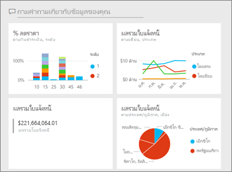
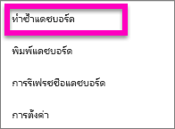
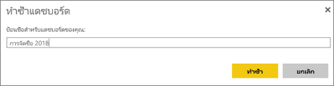
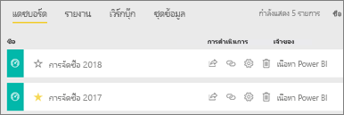

# สร้างมุมมองโทรศัพท์สำหรับแดชบอร์ดใน Power BICreate a copy of a dashboard in Power BI service

 มีเหตุผลมากมายว่าทำไมต้องคำสำเนาแดชบอร์ดThere are many different reasons to make a copy of a dashboard. คุณอาจต้องการทำการเปลี่ยนแปลง และทดสอบของประสิทธิภาพการทำงานกับต้นฉบับ หรือสร้างเวอร์ชันที่ต่างกันเล็กน้อยเพื่อกระจาย ให้ผู้ร่วมงาน ภูมิภาค หรือทีมMaybe you want to make changes and test its performance against the original; or create slightly different versions to distribute by colleague, region, or team. บางครั้งเพื่อนร่วมงานชื่นชอบการออกแบบแดชบอร์ดของคุณ และต้องการใช้สำหรับรายงานเพื่อเสนอผู้จัดการของตนPerhaps a colleague admires your dashboard design and wants to use it for reporting out to their managers. อาจะมีอีกเหตุผลหนึ่งถ้าคุณมีฐานข้อมูลใหม่ว่ามีโครงสร้างข้อมูลเดียวกันกับชนิดข้อมูลและต้องการใช้แดชบอร์ดที่คุณเคยสร้างอีกครั้ง ซึ่งสามารถทำได้เช่นกัน แต่อาจจำเป็นต้องทำงานบางอย่างใน Power BI DesktopAnother reason would be if you have a new database with the same data structure and data types and want to reuse the dashboard you've already created -- this too can be done but would require some work in Power BI Desktop. 

แดชบอร์ดที่ถูกสร้าง(และถูกคัดลอก)โดยใช้ Power BI service และสามารถดูได้ในอุปกรณ์เคลื่อนที่ Power BI และ Power BI EmbeddedDashboards are created (and copied) using Power BI service and can be viewed in Power BI mobile and Power BI Embedded.  แดชบอร์ดใช้งานใน Power BI Desktop ไม่ได้Dashboards are not available in Power BI Desktop. 

เพื่อทำสำเนาของแดชบอร์ด คุณต้องเป็น *ผู้สร้าง* แดชบอร์ดTo make a copy of a dashboard, you must be the dashboard *creator*. แดชบอร์ดที่มีการแชร์กับคุณเป็นแอปไม่สามารถซ้ำกันได้Dashboards that have been shared with you as an app cannot be duplicated.

1. เปิดแดชบอร์ดOpen the dashboard.
2. ที่มุมบนขวา ให้เลือก **ตัวเลือกเพิ่มเติม** (...) แล้วเลือก **ทำสำเนาแดชบอร์ด**From the top-right corner, select **More options** (...) and choose **Duplicate dashboard**.
   
   
3. ตั้งชื่อแดชบอร์ดแล้วเลือก **ทำสำเนา**Give the dashboard a name and select **Duplicate**. 
   
   
4. แดชบอร์ดใหม่จะถูกบันทึกในพื้นที่ทำงานเดียวกันเป็นต้นฉบับThe new dashboard is saved in the same workspace as the original. 
   
   

5.    เปิดแดชบอร์ดใหม่ละแก้ไขตามความจำเป็นOpen the new dashboard and edit as needed. นี่คือบางสิ่งที่คุณอาจต้องการทำต่อไปHere are some things you might want to do next:    
    ก.a. [ย้าย เปลี่ยนชื่อ ปรับขนาด หรือแม้กั่งลบไทล์](service-dashboard-edit-tile.md)[Move, rename, resize or even delete tiles](service-dashboard-edit-tile.md).  
    b.b. แก้ไขรายละเอียดไทล์และไฮเปอร์ลิงก์ โดยเลือก **ตัวเลือกเพิ่มเติม** (...) ของไทล์ แล้วเลือก **แก้ไขรายละเอียด**Edit tile details and hyperlinks by selecting the tile **More options** (...) and choosing **Edit details**.  
    c.c. [เพิ่มไทล์ใหม่จากแถบเมนูแดชบอร์ด](service-dashboard-add-widget.md) (**เพิ่มไทล์**)[Add new tiles from the dashboard menubar](service-dashboard-add-widget.md) (**Add tile**)  
    d.d. ปักหมุดไทล์ใหม่[จาก Q&A](service-dashboard-pin-tile-from-q-and-a.md)หรือ[จากรายงาน](service-dashboard-pin-tile-from-report.md)Pin new tiles [from Q&A](service-dashboard-pin-tile-from-q-and-a.md) or [from reports](service-dashboard-pin-tile-from-report.md).  
    e.e. เปลี่ยนชื่อแดชบอร์ด เปิดหรือปิด Q&A และตั้งค่าไทล์โฟลว์จากบานหน้าต่างการตั้งค่าแดชบอร์ดRename the dashboard, turn Q&A on or off, and set the tile flow from the dashboard Settings pane.  (เลือกดรอปดาวน์ **ตัวเลือกเพิ่มเติม** (... ) ของแดชบอร์ด และเลือก **การตั้งค่า**)(select the dashboard **More options** (...) dropdown and choose **Settings**)  
    f.f. แชร์แดชบอร์ดของคุณโดยตรงกับเพื่อนร่วมงาน หรือเป็นส่วนหนึ่งของแอป Power BIShare your dashboard directly with colleagues or as part of a Power BI app. 

## ขั้นตอนถัดไปNext steps
* [เคล็ดลับสำหรับการออกแบบแดชบอร์ด ที่ยอดเยี่ยมTips for designing a great dashboard](service-dashboards-design-tips.md) 

มีคำถามเพิ่มเติมหรือไม่More questions? [ลองไปที่ชุมชน Power BITry the Power BI Community](https://community.powerbi.com/)

