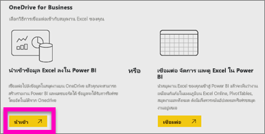

# สร้างแดชบอร์ด Power BI จากรายงานCreate a Power BI dashboard from a report
คุณได้อ่าน[บทนำเกี่ยวกับแดชบอร์ดใน Power BI](service-dashboards.md) แล้วและตอนนี้ คุณต้องการสร้างของคุณเองYou've read [Introduction to dashboards in Power BI](service-dashboards.md), and now you want to create your own. มีหลายวิธีในการสร้างแดชบอร์ดThere are many different ways to create a dashboard. ตัวอย่างเช่น คุณสามารถสร้างจากรายงาน จาก scratch จากชุดข้อมูล หรือโดยการทำซ้ำแดชบอร์ดที่มีอยู่แล้วFor example, you can create a dashboard from a report, from scratch, from a dataset, or by duplicating an existing dashboard.  

เราจะเริ่มต้นโดยการสร้างแดชบอร์ดที่ง่ายและรวดเร็วซึ่งปักหมุดการจัดรูปแบบการแสดงข้อมูลจากรายงานที่มีการทำขึ้นแล้วWe start by creating a quick and easy dashboard that pins visualizations from a report that's already been built. 

หลังจากเสร็จสิ้นบทความนี้ คุณจะเข้าใจเรื่องต่อไปนี้เป็นอย่างดี:After you complete this article, you'll have a good understanding of:
- ความสัมพันธ์ระหว่างแดชบอร์ดและรายงานThe relationship between dashboards and reports
- วิธีการเปิดมุมมองการแก้ไขในตัวแก้ไขรายงานHow to open Editing view in the report editor
- วิธีการปักหมุดไทล์How to pin tiles 
- วิธีการนำทางระหว่างแดชบอร์ดและรายงานHow to navigate between a dashboard and a report 
 

> [!NOTE] 
> แดชบอร์ดเป็นคุณลักษณะของบริการ Power BI ไม่ใช่ Power BI DesktopDashboards are a feature of the Power BI service, not Power BI Desktop. ถึงแม้ว่าคุณไม่สร้างแดชบอร์ดในแอปสำหรับอุปกรณ์เคลื่อนที่ Power BI แต่คุณสามารถ[ดูและแชร์](../consumer/mobile/mobile-apps-view-dashboard.md)ได้Although you don't create dashboards in the Power BI mobile apps, you can [view and share](../consumer/mobile/mobile-apps-view-dashboard.md) there.
>
> 

## วิดีโอ: สร้างแดชบอร์ดโดยการปักหมุดภาพและรูปภาพจากรายงานหนึ่งVideo: Create a dashboard by pinning visuals and images from a report
ดู Amanda สร้างแดชบอร์ดใหม่โดยการปักหมุดไปที่การแสดงภาพจากรายงานWatch Amanda create a new dashboard by pinning visualizations from a report. จากนั้นให้ทำตามขั้นตอนในส่วนถัดไป [นำเข้าชุดข้อมูลพร้อมรายงาน](#import-a-dataset-with-a-report)เพื่อลองด้วยตนเองโดยใช้ตัวอย่างการวิเคราะห์การจัดซื้อThen, follow the steps in the next section, [Import a dataset with a report](#import-a-dataset-with-a-report), to try it out yourself using the Procurement Analysis sample.
    

<iframe width="560" height="315" src="https://www.youtube.com/embed/lJKgWnvl6bQ" frameborder="0" allowfullscreen></iframe>

## นำเข้าชุดข้อมูลที่มีรายงานImport a dataset with a report
ในคำแนะนำทีละขั้นตอนนี้ เราจะนำเข้าหนึ่งในชุดข้อมูลตัวอย่าง Power BI และใช้ในการสร้างแดชบอร์ดใหม่ของเราIn this step-by-step, we import one of the Power BI sample datasets and use it to create our new dashboard. ตัวอย่างที่เราใช้คือสมุดงาน Excel ที่มีแผ่นงาน PowerView สองแผ่นThe sample we use is an Excel workbook with two PowerView sheets. เมื่อ Power BI นำเข้าสมุดงาน โปรแกรมจะเพิ่มชุดข้อมูลและรายงานไปยังพื้นที่ทำงานของคุณWhen Power BI imports the workbook, it adds a dataset and a report to your workspace. จากนั้น รายงานจะถูกสร้างขึ้นจากแผ่นงาน PowerView โดยอัตโนมัติThe report is automatically created from the PowerView sheets.

1. ดาวน์โหลด[ไฟล์ Excel](https://go.microsoft.com/fwlink/?LinkId=529784) ตัวอย่างการวิเคราะห์การจัดซื้อDownload the [Procurement Analysis sample](https://go.microsoft.com/fwlink/?LinkId=529784) Excel file. เราขอแนะนำให้บันทึกไฟล์ใน OneDrive for Business ของคุณWe recommend saving it in your OneDrive for Business.
2. บริการ Power BI ในเบราว์เซอร์ของคุณ (app.powerbi.com)Open the Power BI service in your browser (app.powerbi.com).
3. จากบานหน้าต่างนำทาง ให้เลือก **พื้นที่ทำงานของฉัน** จากนั้นเลือก **รับข้อมูล**From the nav pane, select **My Workspace** and then select **Get Data**.

    
5. ภายใต้ **ไฟล์** ให้เลือก **รับ**Under **Files**, select **Get**.

   
6. นำทางไปยังตำแหน่งที่คุณบันทึกไฟล์ Excel สำหรับตัวอย่างการวิเคราะห์การจัดซื้อNavigate to the location where you saved the Procurement Analysis sample Excel file. เลือกไฟล์ดังกล่าว จากนั้นเลือก **เชื่อมต่อ**Select it and choose **Connect**.

   
7. สำหรับการดำเนินการนี้ เลือก **นำเข้า**For this exercise, select **Import**.

    
8. เมื่อข้อความแสดงความสำเร็จปรากฏขึ้น เลือก **x** เพื่อยกเลิกWhen the success message appears, select the **x** to dismiss it.

   

> [!TIP]
> คุณทราบหรือไม่Did you know? คุณสามารถทำให้บานหน้าต่างนำทางแคบลงได้โดยเลือกไอคอนที่มีสามบรรทัดที่ ด้านบนYou can narrow the nav pane by selecting the icon with three lines at the top . ซึ่งช่วยให้คุณมีพื้นที่มากขึ้นในการรายงานThat gives you more room for the report itself.

### เปิดรายงานและปักหมุดไทล์ไปยังแดชบอร์ดของคุณOpen the report and pin tiles to your dashboard
1. ในพื้นที่ทำงานเดียวกัน เลือกแท็บ **รายงาน** จากนั้นเลือก **ตัวอย่างการวิเคราะห์การจัดซื้อ** เพื่อเปิดรายงานIn the same workspace, select the **Reports** tab, and then select **Procurement Analysis Sample** to open the report.

     รายงานเปิดขึ้นในมุมมองการอ่าน The report opens in Reading view. โปรดสังเกตว่ามีสองแถบที่ด้านซ้าย: **การวิเคราะห์ส่วนลด** และ **ภาพรวมการใช้จ่าย**Notice it has two tabs on the left: **Discount Analysis** and **Spend Overview**. แต่ละแถบจะแสดงหน้าของรายงานนั้น ๆEach tab represents a page of the report.

2. เลือก **ตัวเลือกอื่นๆ (...)**  > **แก้ไขรายงาน** เพื่อเปิดรายงานในมุมมองการแก้ไขSelect **More options (...)** > **Edit report** to open the report in Editing view.

    
3. เลื่อนไปเหนือการแสดงภาพเพื่อดูตัวเลือกที่พร้อมใช้งานHover over a visualization to reveal the options available. เมื่อต้องการเพิ่มการแสดงภาพลงในแดชบอร์ด เลือกไอคอนเข็มหมุดTo add a visualization to a dashboard, select the pin icon ..

    
4. เนื่องจากเรากำลังสร้างแดชบอร์ดใหม่ ให้เลือกตัวเลือกสำหรับ **แดชบอร์ดใหม่** และตั้งชื่อBecause we're creating a new dashboard, select the option for **New dashboard** and give it a name.

    
5. เมื่อคุณเลือก **Pin**, Power BI สร้างแดชบอร์ดใหม่ในพื้นที่ทำงานปัจจุบันWhen you select **Pin**, Power BI creates the new dashboard in the current workspace. หลังจากข้อความ **ปักหมุดไปยังแดชบอร์ด** ปรากฏขึ้น ให้เลือก **ไปยังแดชบอร์ด**After the **Pinned to dashboard** message appears, select **Go to dashboard**. หากมีข้อความปรากฏขึ้นให้บันทึกรายงาน เลือก **บันทึก**If you're prompted to save the report, choose **Save**.

    

    Power BI เปิดแดชบอร์ดใหม่Power BI opens the new dashboard. ซึ่งมีหนึ่งไทล์: การแสดงภาพที่คุณเพิ่งปักหมุดIt has one tile: the visualization you just pinned.

   
7. เลือกไทล์ดังกล่าวเพื่อต้องกลับไปยังรายงานSelect the tile to return to the report. ปักหมุดไทล์เพิ่มเติมไปยังแดชบอร์ดใหม่Pin a few more tiles to the new dashboard. เมื่อหน้าต่าง **ปักหมุดลงในแดชบอร์ด** แสดงขึ้นมา ให้เลือก **แดชบอร์ดที่มีอยู่**When the **Pin to dashboard** window displays, select **Existing dashboard**.  

   

## ปักหมุดทั้งหน้ารายงานไปยังแดชบอร์ดPin an entire report page to the dashboard
แทนที่จะเป็นการปักหมุดไปยังทีละภาพ คุณสามารถ [ปักหมุดทั้งหน้ารายงานเป็น *ไทล์สด*](service-dashboard-pin-live-tile-from-report.md)ได้Instead of pinning one visual at a time, you can [pin an entire report page as a *live tile*](service-dashboard-pin-live-tile-from-report.md). ลองทำดูกันLet's do it.

1. ในตัวแก้ไขรายงาน เลือกแถบ **ภาพรวมการใช้จ่าย** เพื่อเปิดหน้าที่สอง ของรายงานขึ้นIn the report editor, select the **Spend Overview** tab to open the second page of the report.

   

2. เราต้องการการแสดงผลด้วยภาพทั้งหมดในรายงานบนแดชบอร์ดของคุณWe want all of the visuals in the report on your dashboard. ที่มุมขวาบนของแถบเมนู เลือก **ปักหมุดหน้ารายงานสด**In the upper-right corner of the menubar, select **Pin live page**. ที่แดชบอร์ด ระบบจะอัปเดทไทล์หน้ารายงานสดทุกครั้งที่มีการรีเฟรชหน้าดังกล่าวOn a dashboard, live page tiles update each time the page is refreshed.

   

3. เมื่อหน้าต่าง **ปักหมุดลงในแดชบอร์ด** ปรากฎขึ้นมา ให้เลือก **แดชบอร์ดที่มีอยู่**When the **Pin to dashboard** window appears, select **Existing dashboard**.

   

4. หลังจากข้อความแสดงความ สำเร็จ ปรากฏขึ้น เลือก **ไปยังแดชบอร์ด**After the Success message appears, select **Go to dashboard**. ตรงจุดนี้คุุณจะเห็นไทล์ที่คุณได้ปักหมุดไทล์จากรายงานThere you see the tiles you pinned from the report. ในตัวอย่างด้านล่าง เราได้ปักหมุดไทล์สองแผ่นจากหน้าหนึ่งของรายงานและหนึ่ง ไทล์รายงานสดที่อยู่บนหน้าสองของรายงานIn the example below, we've pinned two tiles from page one of the report and one live tile, which is page two of the report.

   

## ขั้นตอนถัดไปNext steps
ยินดีด้วย คุณได้สร้างแดชบอร์ดแรกของคุณแล้ว!Congratulations on creating your first dashboard! ตอนนี้คุณมีแดชบอร์ดหนึ่งอันแล้ว มีสิ่งต่าง ๆ มากมายที่คุณสามารถทำได้บนแดชบอร์ดของคุณNow that you have a dashboard, there's much more you can do with it. ทำตามหนึ่งในบทความที่แนะนำด้านล่างหรือเริ่มต้นสำรวจด้วยตัวคุณเอง:Follow one of the suggested articles below, or start exploring on your own: 

* [ปรับขนาดและย้ายไทล์Resize and move tiles](service-dashboard-edit-tile.md)
* [ทั้งหมดเกี่ยวกับไทล์แดชบอร์ดAll about dashboard tiles](service-dashboard-tiles.md)
* [แชร์แดชบอร์ดของคุณโดยการสร้างแอปฯShare your dashboard by creating an app](../collaborate-share/service-create-workspaces.md)
* [Power BI แนวคิดพื้นฐานPower BI - Basic Concepts](../fundamentals/service-basic-concepts.md)
* [เคล็ดลับสำหรับการออกแบบแดชบอร์ด ที่ยอดเยี่ยมTips for designing a great dashboard](service-dashboards-design-tips.md)

มีคำถามเพิ่มเติมหรือไม่More questions? [ลองไปที่ชุมชน Power BI](https://community.powerbi.com/)[Try the Power BI Community](https://community.powerbi.com/).
