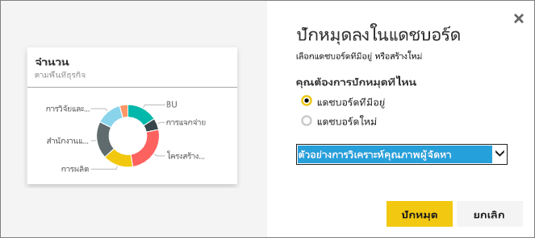

# แก้ไขหรือลบแดชบอร์ดไทล์Edit or remove a dashboard tile

## *เจ้าของ* แดชบอร์ดเทียบกับ *ผู้บริใช้* แดชบอร์ดDashboard *owners* versus dashboard *consumers*
เมื่อคุณสร้าง หรือเป็นเจ้าของแดชบอร์ด คุณมีตัวเลือกมากมายสำหรับการเปลี่ยนแปลงการลักษณะและพฤติกรรมของไทล์บนแดชบอร์ดนั้นWhen you create or own a dashboard, you have many options for changing the look and default behavior of the tiles on that dashboard. ใช้การตั้งค่าและกลยุทธ์ด้านล่างเมื่อต้องการออกแบบแดชบอร์ด *โดยใช้* ประสบการณ์การใช้งานของผู้ร่วมงานของคุณUse the settings and strategies below to design the dashboard *consuming* experience for your colleagues.  จะเลือกไทล์เปิดรายงานที่สำคัญ URL ที่กำหนดเอง หรือแดชบอร์ดต่างๆ ได้อย่างไรWill selecting a tile open the underlying report, a custom URL, or a different dashboard? อาจคุณจะ[เพิ่มไทล์ที่แสดงวิดีโอ หรือข้อมูลการสตรีม](service-dashboard-add-widget.md)หรือไม่Maybe you'll [add a tile that displays a video or streaming data](service-dashboard-add-widget.md)? และแม้คุณอาจต้องการ[สร้างไทล์ที่มีตัวแบ่งส่วนข้อมูลแบบโต้ตอบ](service-dashboard-pin-live-tile-from-report.md)And you might even want to [create a tile that has interactive slicers](service-dashboard-pin-live-tile-from-report.md). ในฐานะ *ผู้สร้าง* คุณมีตัวเลือกมากมายAs a *creator* you have many options. 

<iframe width="560" height="315" src="https://www.youtube.com/embed/lJKgWnvl6bQ" frameborder="0" allowfullscreen></iframe>

บทความนี้ครอบคลุมเรื่องต่อไปนี้This article covers the following.

* [สร้างภาพและปักหมุดกับแดชบอร์ดCreate a visualization and pin it to a dashboard](#create)
* [ย้ายไทล์Move a tile](#move)
* [ปรับขนาดไทล์Resize a tile](#resize)
* [เปลี่ยนชื่อไทล์Rename a tile](#rename)
* [เพิ่มไฮเปอร์ลิงก์ให้ไทล์Add a hyperlink to a tile](#hyperlink)
* [ปักหมุดไทล์ให้แดชบอร์ดต่างๆPin a tile to a different dashboard](#different)
* [ลบไทล์Delete a tile](#delete)
  
  > [!TIP]
  > เมื่อต้องเปลี่ยนการแสดงภาพที่แสดงบนไทล์เอง ลบไทล์ และเพิ่ม[แดชบอร์ดไทล์](../consumer/end-user-tiles.md)ใหม่To change the visualization shown on the tile itself, delete the tile and add a new [dashboard tile](../consumer/end-user-tiles.md).

  
## ข้อกำหนดเบื้องต้นPrerequisites
เพื่อติดตาม ให้เปิด Power BI service(ไม่ใช่ Power BI Desktop) และ[ดาวน์โหลดตัวอย่างการวิเคราะห์การใช้จ่ายด้าน IT](sample-it-spend.md)To follow along, open Power BI service (not Power BI Desktop) and [download the IT Spend Analysis sample](sample-it-spend.md). เมื่อข้อความแสดงความสำเร็จปรากฏขึ้น เลือก **ไปยังแดชบอร์ด**When the "Success" message appears, select **Go to dashboard**

- - -

## สร้างภาพใหญ่และปักมันไว้กับแดชบอร์ดCreate a new visualization and pin it to the dashboard
1. จากแดชบอร์ดการวิเคราะห์การใช้จ่ายด้าน IT ให้เลือกไทล์ "Amount" เพื่อเปิดรายงานFrom the IT Spend Analysis dashboard, select the "Amount" tile to open the report.

    

2. เปิดรายงานในมุมมองการแก้ไข โดยการเลือก **แก้ไขรายงาน** จากแถบเมนูด้านบนOpen the report in Editing view by selecting **Edit report** from the top menubar.

3. เพิ่มหน้ารายงานใหม่โดยเลือกไอคอนเครื่องหมายบวก (+) ที่ด้านล่างของรายงานAdd a new report page by selecting the plus sign (+) at the bottom of the report.

    

4. จากบานหน้าต่างเขตข้อมูล ให้เลือก **ข้อเท็จจริง > ยอด** และ **พื้นที่ธุรกิจ > พื้นที่ธุรกิจ**From the FIELDS pane, select **Fact > Amount** and **Business Area > Business Area**.
 
5. จากบานหน้าต่างการแสดงภาพ ให้เลือกไอคอนแผนภูมิโดนัทเพื่อแปลงการสดงภาพลงเป็นแผนภูมิโดนัทFrom the VISUALIZATIONS pane, select the Donut chart icon to convert the visualization to a Donut chart.

    

5. เลือกไอคอนหมุดและปักหมุดแผนภูมิโดนัทกับแดชบอร์ดตัวอย่างการวิเคราะห์การใช้จ่ายด้าน ITSelect the pin icon and pin the Donut chart to the IT Spend Analysis sample dashboard.

   

6. เมื่อข้อความแสดงความ “สำเร็จ” ปรากฏขึ้น เลือก **ไปยังแดชบอร์ด**When the "Success"message appears, select **Go to dashboard**. คุณจะถูกถามให้บันทึกการเปลี่ยนแปลงYou will be prompted to save your changes. เลือก **บันทึก**Select **Save**.

- - -

## ย้ายไทล์Move the tile
บนแดชบอร์ด ค้นหาไทล์ใหม่On the dashboard, locate the new tile. เลือกและกดไทล์เพื่อลากไปยังตำแหน่งใหม่บนผืนผ้าใบแดชบอร์ดSelect and hold the tile to drag it to a new location on the dashboard canvas.

- - -

## ปรับขนาดไทล์Resize the tile
คุณสามารถสร้างไทล์ได้หลายขนาด จาก 1 x 1 หน่วยไทล์จนถึง 5 x 5You can make tiles many different sizes -- from 1x1 tile units up to 5x5. เลือกและลากหูหิ้ว(ที่มุมล่างขวา) เพื่อปรับขนาดไทล์Select and drag the handle (in the bottom right corner) to resize the tile.

- - -
## เมนู **ตัวเลือกเพิ่มเติม** (...)**More options** (...) menu

1. เลือก **ตัวเลือกเพิ่มเติม** (...) ในมุมขวาบนของไทล์Select **More options** (...) in the upper-right corner of the tile. 
   
   

2. วางเคอร์เซอร์เหนือไทล์ "บัญชี" และเลือกจุดไข่ปลาเมื่อต้องแสดงตัวเลือกHover over the "Account" tile and select the ellipses to display the options. ตัวเลือกที่พร้อมใช้งานจะแตกต่างกันตามชนิดไทล์The options available will vary by tile type.  ตัวอย่าง ตัวเลือกที่พร้อมใช้งานสำหรับไทล์รายงานแบบไลฟ์ต่างจากตัวเลือกที่พร้อมใช้งานสำหรับไทล์การแสดงภาพแบบมาตรฐานFor example, the options available for a live tile are different from options available for a standard visualization tile. นอกจากนี้ ถ้ามีการแชร์แดชบอร์ดกับคุณ(คุณไม่ใช่เจ้าของ) คุณจะมีตัวเลือกน้อยลงAlso, if a dashboard has been shared with you (you are not the owner), you will have fewer options.

   

3. ให้เลือก **แก้ไขรายละเอียด** เพื่อเปิดหน้าต่าง "ไทล์รายละเอียด"Select **Edit details** to open the "Tile details" window. 

    เปลี่ยนชื่อและค่าเริ่มต้นลักษณะการทำงานของไทล์Change the title and default behavior of the tile.  ตัวอย่างเช่น คุณอาจตัดสินใจว่าเมื่อเลือก *ผู้บริโภค* ในฐานะไทล์ แทนที่จะเปิดรายงานที่ถูกใช้เพื่อสร้างไทล์ แดชบอร์ดใหม่ได้แสดงแทนFor example, you may decide that when a *consumer* selects a tile, instead of opening the report that was used to create that tile, a new dashboard displays instead.  
   

### เปลี่ยนชื่อไทล์Rename the tile
ที่ด้านบนของหน้าต่าง "ไทล์รายละเอียด" ให้เปลี่ยน **ชื่อเรื่อง** เป็น **ยอดเงินที่ใช้**At the top of the "Tile details" window, change **Title** to **Amount spent**.

### เปลี่ยนไฮเปอร์ลิงก์เริ่มต้นChange the default hyperlink
ตามค่าเริ่มต้น การเลือกไทล์โดยปกติแล้วจะนำคุณไปยังรายงานทีไทล์ หรือ Q&A(ถ้าไทล์ถูกสร้างขึ้นใน Q&A)By default, selecting a tile usually takes you to the report where the tile was created or to Q&A (if the tile was created in Q&A). เมื่อต้องการเชื่อมโยงไปยังเว็บเพจ แดชบอร์ดอื่นหรือรายงาน (ในพื้นที่ทำงานเดียวกัน) รายงาน SSRS หรือเนื้อหาอื่นๆ แบบออนไลน์ ให้เพิ่มลิงก์แบบกำหนดเองTo link to a webpage, another dashboard or report (in the same workspace), an SSRS report, or other online content - add a custom link.

1. ภายใต้หัวเรื่องฟังก์ชันการทำงาน ให้เลือก **ตั้งค่าลิงก์แบบกำหนดเอง**Under the Functionality heading, select **Set custom link**.

2. เลือก **ลิงก์ไปยังแดชบอร์ดหรือรายงานในพื้นที่ทำงานปัจจุบัน** แล้ว เลือกจากรายการแบบดร๊อปดาวน์Select **Link to a dashboard or report in the current workspace** and then select from the dropdown.  ในตัวอย่างนี้ เราได้เลือกแดชบอร์ดตัวอย่างทรัพยากรบุคคลIn this example I've selected the Human Resources sample dashboard. ถ้าคุณไม่มีตัวอย่างนี้อยู่ในพื้นที่ทำงานของคุณ คุณสามารถเพิ่มและกลับไปยังขั้นตอนนี้ หรือคุณสามารถเลือกแดชบอร์ดที่แตกต่างกันIf you don't have this sample already in your workspace, you can add it and come back to this step, or you can select a different dashboard. 

    

3. เลือก **นำไปใช้**Select **Apply**.

4. ชื่อเรื่องใหม่แสดงบนไทล์The new title displays on the tile.  และ เมื่อคุณเลือกไทล์ Power BI เปิดแดชบอร์ดทรัพยากรบุคคลขึ้นAnd, when you select the tile, Power BI opens the Human Resources dashboard. 

    

### ปักหมุดแดชบอร์ดไทล์ที่แตกต่างกันPin the tile to a different dashboard
1. จากเมนูจุดไข่ปลาแบบหล่นลง ให้เลือก **ปักหมุดไทล์** From the ellipses dropdown menu, select **Pin tile**  .
2. ให้ตัดสินใจว่าจะปักหมุดรายการซ้ำของไทล์นี้กับแดชบอร์ดที่มีอยแล้วหรือแดชบอร์ดใหม่Decide whether to pin a duplicate of this tile to an existing dashboard or to a new dashboard. 
   
   
3. เลือก **หมุด**Select **Pin**.

### ลบไทล์Delete the tile
1. หากต้องการลบไทล์ออกอย่างถาวรจากแดชบอร์ด ให้เลือก **ลบไทล์**  จากเมนูจุดไข่ปลาแบบหล่นลงTo permanently remove a tile from a dashboard, select  **Delete tile**  from the ellipses dropdown menu. 

2. การลบไทล์ไม่ลบการแสดงภาพแบบพื้นฐานDeleting a tile does not delete the underlying visualization. เปิดรายงานพื้นฐาน โดยเลือกไทล์ "Amount"Open the underlying report by selecting the "Amount" tile. เปิดหน้าสุดท้ายในรายงานของคุณ เพื่อดูว่าการแสดงภาพต้นฉบับไม่ถูกลบจากรายงานหรือไม่Open the last page in your report to see that the original visualization has not been deleted from the report. 

- - -
## ขั้นตอนถัดไปNext steps
[ไทล์แดชบอร์ดใน Power BIDashboard tiles in Power BI](../consumer/end-user-tiles.md)

[แดชบอร์ดใน Power BIDashboards in Power BI](../consumer/end-user-dashboards.md)

[แนวคิดพื้นฐานสำหรับนักออกแบบในบริการของ Power BIBasic concepts for designers in the Power BI service](../fundamentals/service-basic-concepts.md)

มีคำถามเพิ่มเติมหรือไม่More questions? [ลองไปที่ชุมชน Power BITry the Power BI Community](https://community.powerbi.com/)
